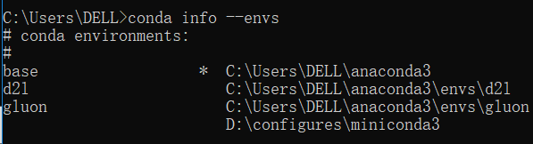

linux

今天遇到一个问题，就是得到了一个来自linux系统的压缩文件，我放到windows解压的时候出现了同名文件。原因是linux文件系统对于文件名是区分大小写的，而windows是不区分的。为了实现我能成功解压来自Linux的压缩文件。需要开启windows的区分大小写功能。

管理员运行cmd

输入 `fsutil file SetCaseSensitiveInfo c:\sysgeek enable`

这条命令是指让 c:\sysgeek 这个文件夹里的文件名区分大小写

enable是生效

disable就是不生效


conda的一些了解

Conda是适用于任何语言的   软件包、依赖项和环境  的管理系统

Conda是在Windows、macOS和Linux上运行的开源软件包管理系统和环境管理系统


环境管理：

conda可以设置一个完全独立的环境来运行不同版本的Python，同时继续在正常环境中运行喜欢的Python版本。

conda常用命令：

```
conda list    //查看包
conda env list  //查看当前所有的虚拟环境
conda info --envs  //查看当前环境名
在显示的环境中，星号 * 前是环境的名字，星号后是环境的路径。
```


```
conda create -n your_env_name python=x.x   //创建环境
conda activate 环境名或者环境的路径    //激活环境
deactivate env_name //关闭虚拟环境(即从当前环境退出返回使用PATH环境中的默认python版本)
conda remove -n your_env_name --all   //删除虚拟环境
```

anaconda命令创建python版本为x.x，名字为your_env_name的虚拟环境。**your_env_name文件可以在Anaconda安装目录envs文件下找到**。



可以看到我打开cmd，输入这行命令后显示我正常环境的名字是base，路径是C:\Users\DELL\anaconda3


为什么我们需要虚拟环境呢？举一个简单的例子，想象一下你有多个项目要开发，每个项目中都有一些包要依赖于某个共同的包，但是各自的所需要的版本不一致，有一些需要低版本的，有些需要高版本的。然后你就陷入了众口难调的困境。为不同的项目创建虚拟环境就可以把不同项目隔离开来，各自使用自己所需要的软件环境。


[http://Anaconda.org](https://link.zhihu.com/?target=http%3A//Anaconda.org)的服务器在国外，安装多个packages时，conda下载的速度经常很慢。清华TUNA镜像源有Anaconda仓库的镜像，将其加入conda的配置即可

\# 添加Anaconda的TUNA镜像

conda config --add channels [https://mirrors.tuna.tsinghua.edu.cn](https://link.zhihu.com/?target=https%3A//mirrors.tuna.tsinghua.edu.cn/anaconda/pkgs/free/)

