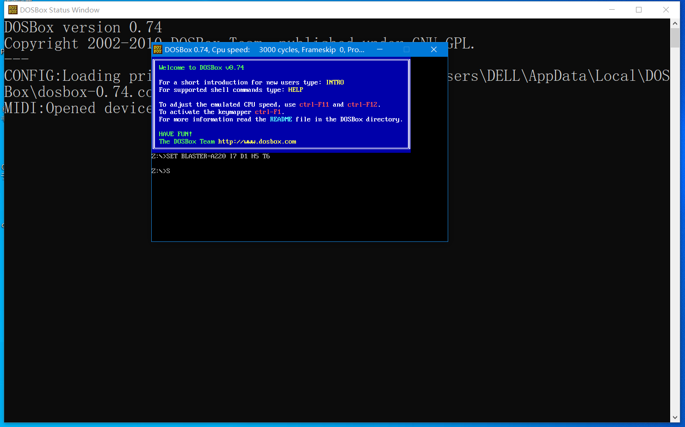
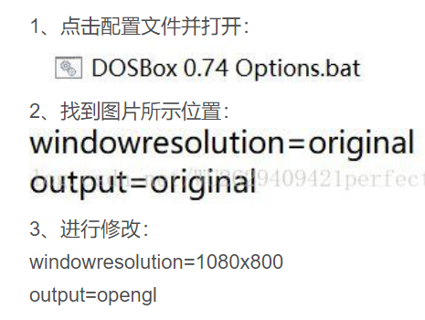
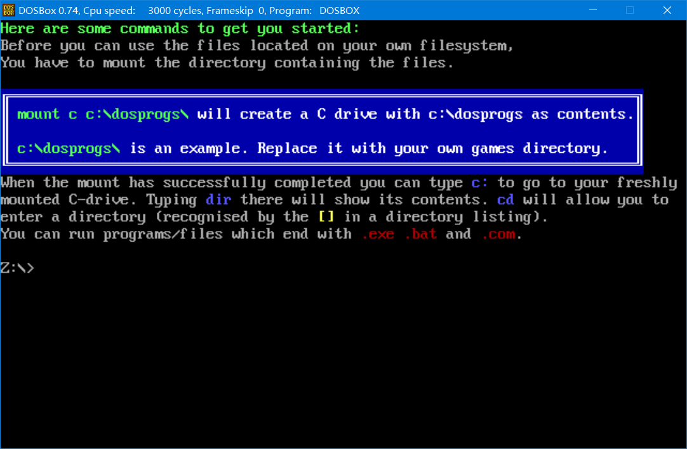
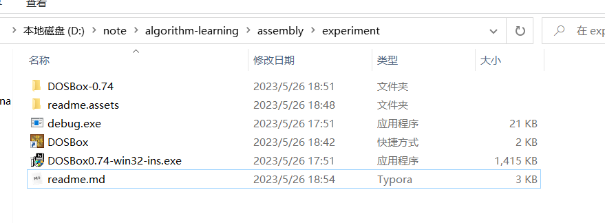
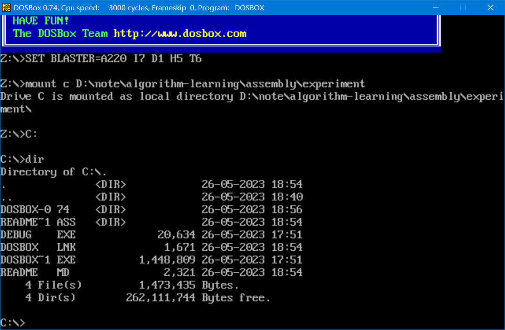
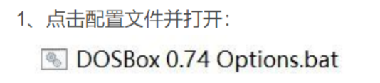
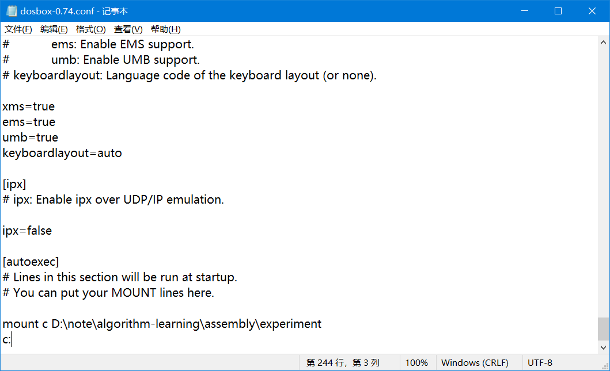
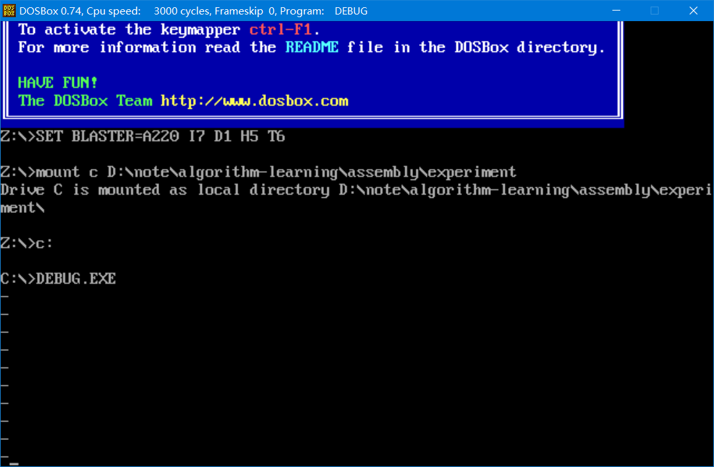

DOSBox是一种模拟器软件，用于在现代操作系统上模拟运行旧版的DOS操作系统和DOS应用程序。它的目标是提供一个可靠的环境，让用户能够在现代计算机上运行那些设计用于早期DOS平台的软件。

DOSBox是一个跨平台的开源软件，可以在多个操作系统上运行，包括Windows、macOS、Linux和其他一些操作系统。它模拟了x86架构的CPU、DOS环境下的硬件设备（如显卡、声卡、键盘等）以及相关的系统功能。

通过DOSBox，用户可以在现代操作系统中运行DOS游戏、DOS应用程序以及其他与DOS相关的软件。DOSBox提供了一个虚拟的DOS环境，用户可以通过命令行界面输入DOS命令和运行可执行文件。此外，DOSBox还支持图形界面和配置选项，允许用户对模拟环境进行自定义设置。

DOSBox在保留旧版DOS软件的同时，提供了更好的兼容性和性能，使用户能够在现代计算机上重温或体验旧版DOS软件的魅力。


下载Dox_box是为了学习汇编语言的调试工具Debug.exe



双击exe之后，出现两个窗口，下面的窗口不知道是干啥的，也不用管。我们主要使用上面的小窗口，因为窗口太小了，需要放大，网上搜索解决方案即可。




快捷键 alt+enter 进入全屏模式，体验过早时候的程序员的桌面


学习一个Dox_box的内置命令

刚打开的时候，出现的盘符是Z，但是我电脑上只有CDE盘，没有Z盘是怎么回事？

```
intro mount
```



上面的介绍提到，要想在dos中使用自己的文件系统，必须mount 

```
mount C C:\dosprogs
```

这个意思是，将自己电脑上的路径C:\dosprogs 用Dos中的C来表示。

这样就能用Dos访问自己电脑的文件了。


先将debug.exe文件下载到文件夹`D:\note\算法学习\汇编语言\experiment`


刚才试了一下，由于dos不支持输入包含中文的路径，所以需要修改路径为英文。





可以看到已经成功地使用dos访问电脑上的文件了。接下来执行debug.exe就可以使用了。


另一个问题，由于每次启动dos之后都需要重新mount，很麻烦，接下来进行的操作能够省去输入mount的过程，让dos在启动的时候就执行这个命令，我们直接执行debug.exe就可以了，不用每次重新输入mount了。



在 `[autoexec]` 下输入每次开启需要重复的命令



输入 `DEBUG.EXE` ,出现 `-` 提示符，表示成功进入debug调试程序。可以执行debug相关命令了。



