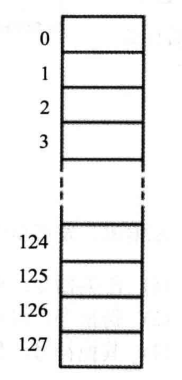
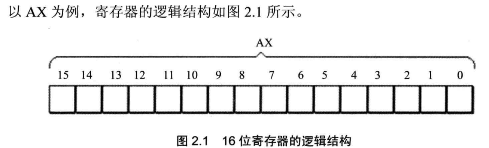
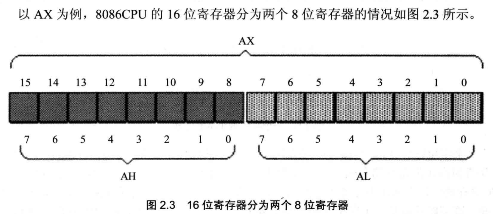
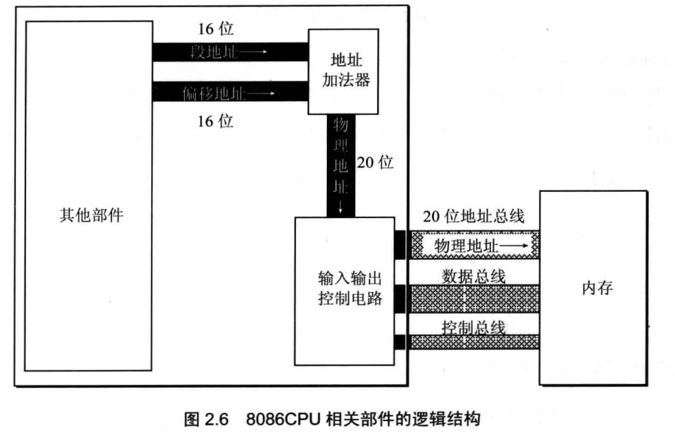
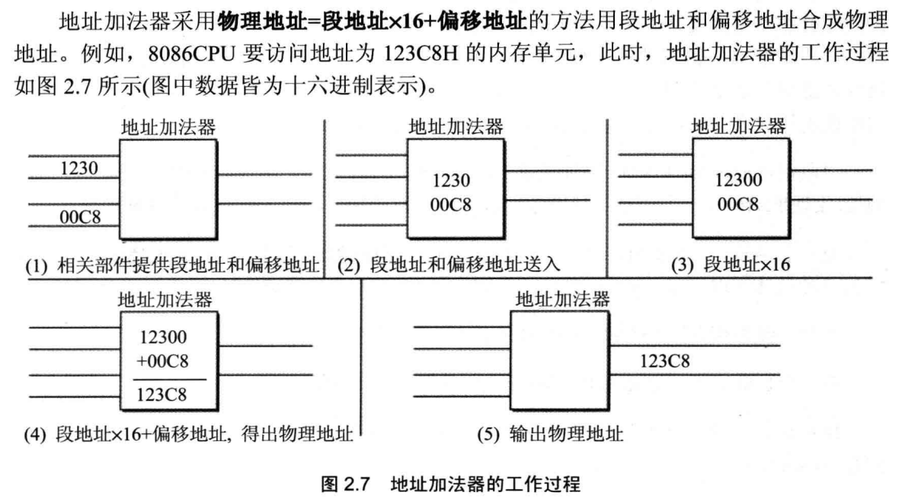
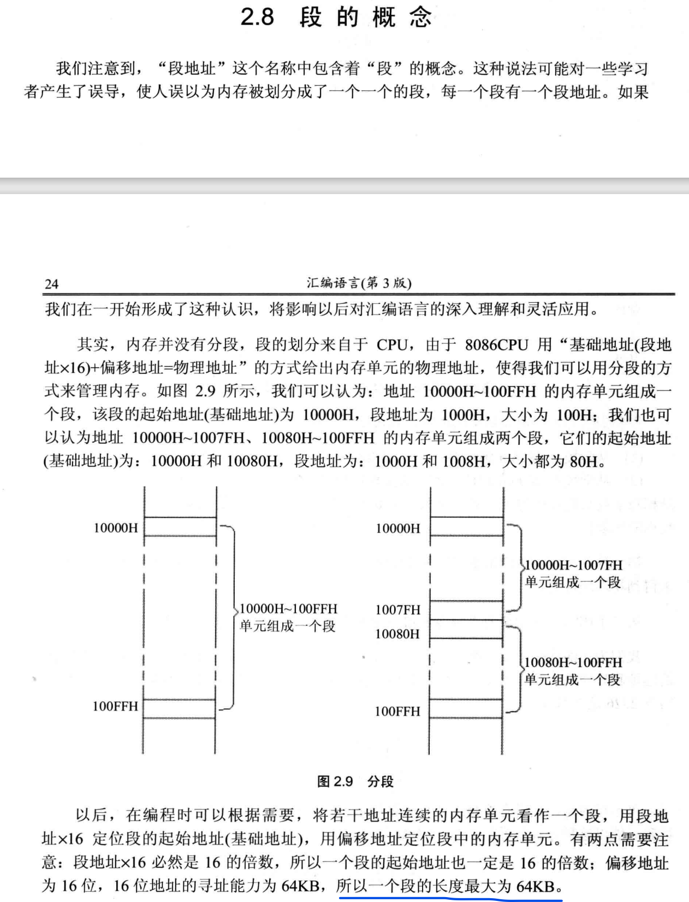
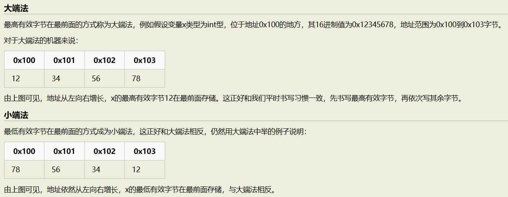
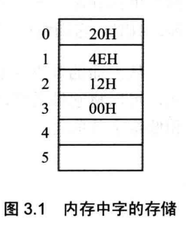

汇编语言

汇编语言是一门非常重要的课程。高级语言编程隐藏了代码在计算机上执行的具体细节。程序员不用考虑程序在计算机上是怎么工作的，只需使用高级语言编写逻辑过程就能跑代码。但是我们必须要学习程序在计算机上的工作过程，这对于我们了解计算机硬件的功能是很有用的，同时我们明白了程序在计算机的具体工作细节，也能够改进我们的代码，让我们的代码更有效率。


从汇编程序员的角度看，计算机由两部分组成，CPU和内存。

CPU控制着程序的运作和进行数据的计算，要想让程序运作，必须向CPU提供指令和数据，同时CPU也可能需要将临时数据存储。指令和数据存放在内存中，由总线进行传输。因此，CPU通过总线实现对内存数据的读取和将运算结果数据写入内存。


先看内存的结构，从程序员的视角，我们可以把内存看成一个大的字节数组。注意数组的最小单位是字节。数组下标从0开始，下标就是字节在内存中所处的位置，就是字节的地址。




CPU对内存进行读写数据需要三种信息，地址信息：读写到哪一个字节；数据信息：读写的数据内容是什么；控制信息：是读操作还是写操作。


总线根据传输数据的类型分为三类：

1. 地址总线
2. 数据总线
3. 控制总线


先来了解一下总线，总线就是一捆线。

数据是如何通过线路传输的呢？其实是通过操作电压，低电压表示 0，高压电压则表示 1。

如果构造了高低高这样的信号，其实就是 101 二进制数据，十进制则表示 5，如果只有一条线路，就意味着每次只能传递 1 bit 的数据，即 0 或 1，那么传输 101 这个数据，就需要 3 次才能传输完成，这样的效率非常低。

这样一位一位传输的方式，称为串行，下一个 bit 必须等待上一个 bit 传输完成才能进行传输。这样的传输称为串行传输。

我们可以通过增加线路，比如，有两条线路，那么一次就可以传输2位二进制数据，总线的位宽就是2。这也就是并行传输。

汇编语言一条语句

我们学习的这个8086CPU有20位的地址总线，16位的数据总线，没提及控制总线的位宽。好像不重要？

20位地址总线意味着一次能传输20bit，我们把一次能传输的20bit的数据认为是地址。那么能表示地址的范围用十进制表示是$[0,2^{20}-1]$ ，每一个地址代表一个字节（8bit）

那么CPU可以寻到的内存空间大小是$2^{20}*8= 1MB$

16位数据线表示CPU一次可以传输的数据大小。


一个典型的CPU由运算器、控制器和寄存器和一些其他的器件组成，各个器件之间由内部总线相连。上面提到的总线相对于CPU而言属于外部总线。


CPU的位宽：

我们现在常见的电脑都是64位的，也有32位的，这其实说的就是CPU的位宽。8086CPU的位宽是16位。

CPU的位宽描述了CPU的下面的结构特性：

1. 运算器一次最多可以处理16位的数据（这里的“一次”该怎么理解？机组才能学，学汇编不用管）
2. 寄存器的**最大宽度**是16位
3. 寄存器与运算器之间的通路为16位


**机器字长** 的概念：

我们知道 一个字节是8bit，那么一个字是多少bit？

这个机器字长就是CPU一次能处理的最多bit的数据，也就是CPU的位宽，受上面三个条件限制，按最小的来，不过一般设计的都是一样长的。


寄存器本质上是存储器，特点是存取速度非常快，容量很小，一般只有一到两个字节的大小。


对于汇编程序员来说，CPU最重要的是寄存器，不同的CPU，寄存器的个数和种类是不太相同的。8086CPU中有14个寄存器，每个寄存器有一个名称，AX，BX，CX，DX，SI，DI，SP，BP，IP，CS，SS，DS，ES，PSW。每个寄存器都有自己的任务。


8086CPU的寄存器都是16位的，可以存放两个字节。



AX，BX，CX，DX可分为两个独立的8位寄存器使用

AX可分为AH,AL

BX可分为BH,BL

CX可分为CH,CL

DX可分为DH,DL




在计算机中，任何数据都是以二进制形式存储的。当我们想要表达数据或地址的时候，总不能用它的二进制形式来描述吧，这样不利于理解和交流。因为最小单位是字节，用十六进制描述数据或地址时较二进制能清晰，能很容易的转化为其二进制形式，所以我们以后会用十六进制来描述数据。

比如说AX里存放的数据是0100_1110_0010_0000，我们可以说AX里放的是4E20，AH里放的是4E，AL里放的是20


8086CPU的外部地址总线是20位，而8086CPU只能处理16位数据。CPU内部能表示的地址范围是$[0,2^{16}-1]$,如果直接把地址发送到外部的地址总线，最多才能寻到的内存地址也就$2^{16}-1$，多出来的4条线不就没啥用了吗？


8086CPU用两个16位的地址来表示一个20位的地址



图中，左边的大方框是CPU，右边的小方框是内存，两个方框之间的是三类外部总线。CPU内部的是内部数据通路。



描述是用16进制描述的，实现是二进制哦，别混了。





8086CPU中的段寄存器存放了段地址，8086CPU中有4个段寄存器：CS，DS，SS，ES


CS和IP是CPU中的两个关键寄存器，CS为代码段寄存器，IP为指令指针寄存器。

在8086PC机中，任意时刻，设CS存放的内容为M，IP中的内容为N，8086CPU读取内存地址为$M*16+N$的单元存放的指令并执行。

换一种表述：CS存放指令的段地址，IP存放指令的偏移地址，用CS：IP表示以CS存放的内容为段地址，IP存放的内容为偏移地址的物理地址，CS：IP指向的内容为CPU下一次执行的指令。


由于CPU16位与外部地址总线20位的差异，有了基地址+偏移地址表示物理地址的方式，在这种方式下，为了便于我们编程，我们可以定义一个代码段地址来表示基地址，段的最大长度不超过64K，这个范围内存放指令，然后让CS：IP指向代码段的首地址。也就是程序的执行。


实验（experiment）

prerequisite：

Debug程序是 Windows / Dos 操作系统提供的一种功能。**使用 Debug 能让我们方便查看 CPU 各种寄存器的值、内存情况，方便我们调试指令、跟踪程序的运行过程。**


什么是Dos？


DOS（Disk Operating System）是指磁盘操作系统，是早期个人计算机上使用的一种操作系统。最初，DOS是由微软公司开发的，主要用于IBM PC及其兼容机上。

DOS是一种单用户、单任务的操作系统，主要提供文件管理、命令行操作和基本的系统功能。**它使用了文本界面（命令行）作为用户与计算机交互的接口，用户通过输入命令来操作计算机和执行应用程序。DOS提供了一系列的内部命令和外部命令，用于文件操作、目录管理、硬盘格式化等常见操作。**

最著名的DOS版本是MS-DOS（Microsoft Disk Operating System），它成为IBM PC的默认操作系统，并在个人计算机行业迅速流行起来。除了MS-DOS，还有其他厂商开发的DOS版本，如Digital Research的DR-DOS。

随着图形用户界面（GUI）的发展和操作系统的演进，DOS逐渐被类似Windows、Linux等现代操作系统所取代。然而，DOS仍然具有一定的历史和技术意义，并在某些特定场景下仍然得到使用和研究。


如何进入debug模式，查阅相关文档[配置环境](.\experiment\readme.md)，查阅一些简单且必要的[debug命令](.\experiment\debug命令)


大端法和小端法

在几乎所有的机器上，多字节对象都被存储为连续的字节序列，**对象的地址为所使用字节中的最小地址。**

> 例如，假设一个类型为int的变量x的地址为0x100，即&x的值为0x100。那么x的4个字节将被存储在存储器的0x100，0x101，0x102和0x103的位置。

多字节对象存储在内存中的字节顺序，有两种不同的存储方案：大端法和小端法。现代的处理器大多为双端法，大小端都支持，可以配置称大端法或者小端法。



大端法就是把数据的高字节存放在低地址，低字节存放在高地址

小端法则相反，把数据的高字节存放在高地址，低字节存放在低地址。

8086CPU使用的是小端法



例如，01两个内存单元存放2_0000（4E20H）


DS和[address]


CPU在读写一个内存单元的时候，必须先给出这个内存单元的地址，在8086PC中，内存地址由段地址和偏移地址组成，8086CPU中的寄存器DS通常用来存放要访问数据的段地址。


mov指令：

1. 将值直接传入寄存器
2. 将一个寄存器的内容传入另一个寄存器
3. 使用地址间接地将值传入寄存器

举例说明三种情况

```assembly
mov bx,1000H
mov ds,bx
mov al,[0]
```

首先将值 1000H直接传入寄存器bx中，再将寄存器bx的内容传入ds中，再将 ds：0 指向的内存单元的内容传入al中。

最后一条指令 `mov al,[0]` 中，中括号[]放的是偏移地址，默认段地址在DS寄存器中。


疑问：

为什么不直接将 1000H传入DS中？

这属于硬件设计的内容了，不用管，只需要知道先传入一个一般的寄存器，然后再传给DS就行了。（挖坑，这个一般咋理解？）


数据段

可以定义一个段地址来表示数据段，这个段来存储数据。访问的方式可以把数据段的段地址传给DS，然后根据上面的方式就能访问了。


栈段

定义一个段地址来表示栈段，这个段的数据由push和pop命令接管。

我们用寄存器 SS来存放栈段的段地址，用SP来存放偏移地址。


