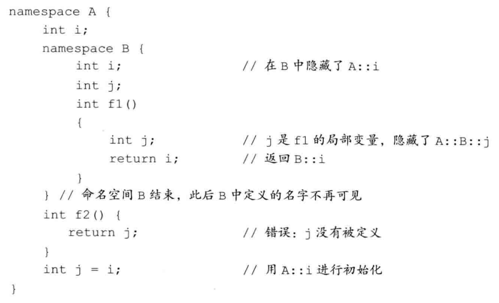

c++非oop部分，但是属于c++提供而非c的内容


### 程序设计范型

1. 面向过程程序设计范型

   程序 = 过程 + 调用。例如，C、Pascal、Fortran等

2. 面向对象程序设计范型

   程序 = 对象 + 消息。例如，C++、python等

3. 函数式程序设计范型

   例如，python

4. 还有其他的一些程序设计范型

> 需要特殊说明，某一种程序设计语言不一定只与一种程序设计范型相对应。例如，C++是具有面向过程和面向过程的混合型编程语言。


### oop和面向过程的区别

从程序结构上区分c++的面向过程性程序设计、面向对象程序设计：

面向过程程序设计的程序结构分为两部分：过程+函数定义

```cpp
// 函数定义

int main()
{
    //主函数中执行程序的过程，在过程中可能会调用函数
}
```

面向对象程序设计的程序结构分为两部分：类的声明+类的使用

```cpp
class A{                           //类的声明
    //声明类A的数据成员
    //声明类A的成员函数
};

int main()                     //类的使用
{
    //定义类A的对象
    //调用类A的成员
}
```

在面向对象程序设计中，程序设计始终围绕“类”展开。通过声明类，构造了程序所要完成的功能。通过对类的具体使用实现具体程序要完成的工作。


### c++在非面向对象方面的扩充

#### 注释行

在c语言中，用 `/* 注释内容 */` 来作注释符号。c++增加了  `// 注释内容` 

#### 输入输出

在c语言中，常使用 `scanf` 和  `printf`。 c++增加了 `cin` 和 `cout` ，更安全更方便。但是在大规模输入输出的时候没有 `scanf` 和 `printf` 快，小规模输入输出的话都一样

#### 灵活的局部变量说明

在c语言中，全局变量声明必须在任何函数之前，局部变量必须集中在可执行语句之前。而在c++中，变量声明非常灵活，允许变量声明与可执行语句在程序中交替出现。这样程序员可以在使用一个变量时才声明它。（这也间接说明了，为什么学生在初学c语言的时候都用c++文件）

#### 结构、联合和枚举名可直接作为类型名

以结构体为例：

```cpp
struct Node{                          //在c语言中，我们定义一个结构体
    //结构体的变量成员
};

int main()
{
    struct Node N;
    //定义一个结构体类型的变量N，结构体类型是 struct Node，结构体名是 Node
    //注意区分以上三个概念
}
```

在c++中，定义结构体类型的变量时，我们可以把结构体类型 struct Node 看成 结构体名 Node

```cpp
int main()
{
    Node N;    //这似乎是更合理的
}
```


#### const修饰符

在c中，习惯使用 #define来定义常量，例如：

```cpp
#define N 100    //注意只是对字符进行替换，重点理解
```

#define是在预处理阶段完成的命令，未来将程序中的N进行简单的字符替换

```cpp
#define N 3+2

cout << 2*N;   // 2*3+2 --->8
```

```cpp
#define N (3+2)

cout << 2*N;   // 2*(3+2) ---->10
```

c++提供了一种更灵活、更安全的方式来定义常量

```cpp
const int N = 100;
```

区别：用#define 定义的常量没有自己的数据类型，而const定义的常量有自己的数据类型。这样c++的编译程序可以进行更加严格的类型检查，具有良好的编译时的检测性


定义常量的意义是什么？

1. 如果程序中频繁使用了某个常量，可以用 const int N = 该常量;直接用一个N去替换程序中的这个常量，代码更简洁一些。

2. 常量和指针的组合使用

   1. 指向常量的指针  ：不能修改指针所指向**地址的内容。**但可以改变指针所指向的地址。

      ```cpp
      const char *name = "chen";
      const int N = 10; //上面的可以类比下面的，修饰的是 *name ，即*name的内容不能变
      ```

   2. 常指针 ：const修饰的是指针name，即常指针,不能修改指针所指向的**地址**。在定义的同时必须初始化。

      ```cpp
      char* const name = "chen";
      //上面的类比这个，const修饰的是指针 name,即name的内容不能变
      ```

   3. 指向常量的常指针

      ```cpp
      const char* const name = "chen";
      ```

3. 函数的形参用const说明，用来保证形参在函数内部不能被改动。

4. 大多数的c++编译器能对具有const参数的函数进行更好的代码优化。


特殊：如果用const修饰int类型的变量，int可以省略

```cpp
const int N = 100;
const N = 100;      //这两条语句等价
```


#### 函数声明

在c语言中，如果函数调用的位置在函数定义之前，则应在函数调用之前对所调用的函数作声明，**建议**使用函数原型声明。

而在c++中，必须使用函数原型声明。这是因为c++中有函数重载的原因吧。

因此，以后写代码，尽量把函数定义部分写在主函数前面，如果必须在函数定义部分后面的话，必须用函数原型声明。

函数原型就是函数定义中的函数说明部分

```cpp
//函数定义
void sum(int a,int b)  //函数说明部分
{
    //函数体
}
```

#### 内联函数

在**函数说明**前加上关键字 `inline`，该函数被声明为内联函数，又称内置函数。每当程序中出现对该函数的调用时，c++编译器将函数体中的代码插入到调用该函数的语句处，同时用实参替代形参，这样程序运行时就不再进行函数调用。

内联函数的意义就在于，消除了函数调用的开销，提高运行速度。

在程序执行过程中调用函数时，系统要将程序当前的一些状态信息（例如现场和返回地址）存到栈中，同时转到函数的代码处去执行函数体语句。在这个过程中需要空间和时间的开销，使得程序执行效率变低，如果是频繁地调用函数时，这个问题就会很明显。

举个具体的例子，好好理解

```cpp
#include <iostream>
using namespace std;

inline int box(int i,int j,int k);    //函数声明用函数原型
int main()
{
    int a,b,c,v;
    cin >> a >> b >> c;
    v = box(a,b,c);
    cout << v << endl;
    return 0;
}

inline int box(int i,int j,int k)   //注意啊，这里的函数原型inline不能少
{
    int i = a,j = b,k = c;
    v = i * j * k;
}
```

编译程序将原代码修改如下：

```cpp
#include <iostream>
using namespace std;

inline int box(int i,int j,int k);    //函数声明用函数原型，这里的inline不是必须的
int main()
{
    int a,b,c,v;
    cin >> a >> b >> c;
    //v = box(a,b,c);
    //{
    int i = a,j = b,k = c;
    v = i * j * k;
    //}
    cout << v << endl;
    return 0;
}

inline int box(int i,int j,int k)   //注意啊，这里的函数原型inline不能少
{
    int i = a,j = b,k = c;
    return i * j * k;
}
```


**注意：**

1. **通常只有规模很小（一般1~5条语句）且频繁使用的函数才定义为内联函数，这样可大大提高运行速度**
2. 内联函数不能包含复杂的结构控制语句例如 while、switch。如果函数体内出现**循环**，那么执行函数体内代码的时间要比函数调用的开销大。
3. 关键字 **inline** 必须与函数定义体放在一起才能使函数成为内联，仅将 **inline** 放在函数声明前面不起任何作用。
4. 因为内联函数要在调用点展开，所以**编译器必须随处可见内联函数的定义**，要不然就成了非内联函数的调用了。所以，这要求每个调用了内联函数的文件都出现了该**内联函数的定义**。将**内联函数的定义**放在**头文件**里实现是合适的，省却你为每个文件实现一次的麻烦。
5. **inline** 函数仅仅是一个对编译器的建议，所以最后能否真正内联，由编译器决定，它如果认为函数不复杂，能在调用点展开，就会真正内联，并不是说声明了内联就会内联，声明内联只是一个建议而已。


#### 函数重载

在传统c语言中，函数名必须是唯一的，即不允许出现同名的函数。

举个例子，当要求编写求整数，长整型数和双精度数的二次方的函数时，若用c语言来处理，需要编写3个函数，这3个函数名字不能相同。例如：

```cpp
Isquare(int i);    //求整数的二次方
Lsquare(long l);   //求长整型数的二次方
Dsquare(double d);  //求双精度数的二次方
```

这样的方式，不仅编写函数的时候麻烦，给使用函数的人也带来麻烦，还要去根据数据类型去查对应的函数名才能使用。


在c++中函数可以重载。只要函数参数的类型不同，位置不同，或者参数的个数不同或者兼而有之，函数可以使用相同的函数名。有一点需要注意的是，如果函数的参数类型、个数、位置都一样，而函数返回值一样不是函数重载，而且也不支持这样的。

上面的例子更改成这样的形式：

```cpp
square(int i); square(long i); square(double i);
```

用一个函数名就可以了。这样对使用函数的人来说方便了不少，但是对于编写者来说，只是方便了函数名不用多写，但是还是要写三个同样的函数体。


注意：

1. 函数重载建议不要和带默认值的函数一起使用，容易产生二义性

2. 函数调用时，如果给出的实参和形参类型不相符时，c++编译器会自动地做类型转换工作。如果转换成功就继续执行。

   如果这个函数有重载函数，而且给出的实参类型和函数的所有函数的形参类型都不符合，这时候就会产生错误：无法识别

   例如

   ```cpp
   void f(int a);
   void f(long b);
   
   f(2.23);   //这个2.23既不是int，也不是long；这时就会产生错误
   ```


#### 作用域运算符 ::

一般情况下，如果有两个同名变量，一个是全局变量，一个是局部变量，那么局部变量在其作用域内具有较高的优先权，它将屏蔽全局变量

如果希望在局部变量的作用域内使用全局变量，可以在变量名前加上 ::

```cpp
int a = 10;
int main()
{
    int a = 20;
    cout << a << endl;   //20
    cout << ::a << endl;  //10
}
```

#### 命名空间（重点）

在写大型程序的时候，会有.cpp文件和.h文件

.h文件用于声明函数、类、全局变量等接口

.cpp文件用于实现头文件中声明的接口和定义的具体功能

我们在写大型项目的时候，也会使用提供商提供的头文件和.cpp文件

在main.cpp文件中，会#include头文件

这样就相当于把所有cpp文件的函数、类名等都放到了main函数上面。

这么多的函数或类或变量有可能重名，到时候要用的时候，编译器不知道要去调用哪个函数。

命名空间可以帮助我们解决这个命名冲突的问题


先看一个命名空间的简单使用

```cpp
namespace a
{
    int a = 10;
}
namespace b
{
    int a = 20;
}
int main()
{
    printf("%d",a);         //报错
    printf("%d",a::a);     //输出 10
    printf("%d",b::a);     //输出 20
}
```

在命名空间中定义变量，函数，类，模板。那么在调用的时候需要指明哪个命名空间的。这样就能避免命名冲突的问题了。


命名空间只能定义在全局范围内，不能定义在局部范围内，如函数内或块作用域内。其实也不难理解，

首先，类只能定义在全局范围内，函数虽然也能在函数内定义，但是作用域只有在被定义的函数内部。局部变量的作用域也是一样的，如果能将局部变量或函数放到命名空间里，根本没有任何意义。因为我们在另一个文件的main函数调用局部变量或函数的时候，内存中根本就找不到这个玩意儿。

所以命名空间只能定义在全局范围内。


命名空间的定义

```cpp
namespace s         // 自定义命名空间的名字 s
{
    //全局变量的定义
    int a = 100;
    void fun()  //函数定义
    {
        //函数体
    }
    void func();//函数声明
    class MyClass
    {
        //类的定义
    }
    class MyClass1;  //类的声明
}
void s::func()  //空间外定义函数
{
    
}
class s::MyClass1   //空间外定义类
{
    
}
```

命名空间内还能定义模板，这个以后真用到的时候再说。

除了可以定义上述的全局变量，函数，类，模板以外，还可以定义命名空间。

```cpp
namespace nsp
{
    namespace nsp1
    {
        namespace nsp2
        {
            
        }
    }
}
```

命名空间也是有作用域的，如nsp2的作用域是nsp1，nsp1的作用域是nsp，nsp的作用域是全局范围，其实全局范围也是一个命名空间，这是一个隐式声明的，称为全局命名空间。

因为是隐式的，所以在全局命名空间内定义全局变量，如果被局部覆盖的话，可以用 `::变量名`来访问，没有命名空间名字，因此是隐式的。

命名空间内声明的函数或类，在命名空间外定义函数或类只能在该命名空间的作用域内定义。比如，在nsp2内声明的函数或类，在具体定义的时候只能在nsp1命名空间内。

下面这张图能体现命名空间的作用域，其实跟普通变量也没啥区别




为了命名空间的简洁，我们一般在命名空间里放类的声明和函数的声明还有全局变量的定义。那么就是这样的，我们的头文件里放的是声明和全局变量的定义，cpp文件放的是实现。我们在头文件里定义命名空间，然后把声明和全局变量的定义放进去。

这样在main.cpp文件中，我们就会有多个命名空间，且不会有命名冲突。


命名空间是不连续的

如果我们有一个名为nsp的命名空间，当我们再次使用

```cpp
namespace nsp
{
    //声明和定义
}
```

是给nsp的命名空间里添加新的成员。


命名空间的不连续性能够使得我们多个文件的函数或类在同一个命名空间。


using的使用，建议别用


其实命名空间不是什么神秘的东西，就是一个特殊的机制吧，原来是将所有cpp实现的类和函数都放到了全局范围内，也就是全局命名空间，因为会存在名字冲突，所以将全局命名空间的类和函数等分开放到了几个命名空间中了。


其实原本没打算总结这部分内容，但是学python的时候需要学习命名空间，所以先学一下c++的命名空间，再去看看python的命名空间。


#### 无名联合

因为没有学过c语言的联合，这里不知道在讲什么，先隔过去。


#### 强制类型转换

在c语言中，不同类型的数据会自动转换数据类型，或者利用强制类型转换将不同类型的数据进行转换。

```cpp
int main()
{
    int a = 10;
    double b = a;   //自动类型转换
    int c = (int) b;  //强制类型转换
}
```


c++提供了新的类型转换的方式,类似函数调用。（更推荐使用这种方式）

```cpp
int main()
{
    int a = 10;
    double b = double(a);
}
```

#### 运算符 new 和 delete

c语言使用malloc和free动态分配内存和释放动态分配的内存。c66提供了更好、更简单的new、delete

```cpp
指针变量名 = new 数据类型;
//运算符new从堆中为程序分配一块与 该数据类型 相适应的 内存空间，并返回该块内存的首地址
```

```cpp
delete 指针变量名;
//delete用于释放new分配的存储空间，但是指针变量还在，为随机值
```


new和delete较malloc和free的优点：

1. malloc需要使用sizeof计算出的字节数，而new可以自动计算；减少了错误的可能性
2. new能够自动返回正确的指针类型，malloc必须在程序中进行强制类型转换，才能返回正确的指针类型


动态数组的创建和删除

```cpp
int *p = new int[10];  //创建一维数组
int *p = new int[10][10];  //创建二维数组
//要想创建多维数组，就必须提供每一维的大小
```

```cpp
int *p = new int[t][10];
//对于第一维，我们可以使用正整数表达式。
int *a = new int[n]; //我们经常使用的创建动态一维数组的语句
```

```cpp
delete []指针变量名;  //
```

分配内存的同时初始化

```cpp
指针变量名 = new  类型(初值);

int *p = new int(99); //动态分配内存空间，并将99作为初始值存放到这里面
```


**使用new动态分配内存时，如果没有足够的内存满足分配要求，则动态分配空间失败，有些编译系统会返回NULL，所以在进行动态内存分配的时候要检查是否成功分配。**


在用new给一个变量分配内存空间之后，如果这片空间以后用不到了一定要用delete释放掉。不然一直保留直到程序结束才会被释放。为了防止内存泄漏，需要及时进行delete


#### 引用

```cpp
类型 &引用名 = 已经定义的变量名;
//引用在声明的时候必须进行初始化
//引用在初始化之后不能更改！！
```

引用就是变量的另一个名字，对引用的所有操作都是对变量的操作。

**引用一般用来作为函数的参数。**

比如，我想在函数内部对某一个变量进行修改，如果只传入变量本身的话，函数执行完后变量本身不会改变

```cpp
void change(int a)
{
    a++;
    return;
}

int main()
{
    int a = 1;
    change(a);
    cout << a;  // 输出 1
}
```

```cpp
void change(int &a)
{
    a++;
    return;
}

int main()
{
    int a = 1;
    change(a);
    cout << a;  //输出 2
}
```

同样，我们也可以使用指针来实现这种方式

```cpp
void change(int *a)
{
    (*a)++;
    return;
}

int main()
{
    int a = 1;
    int *p = &a;
    change(p);
    cout << a;   //输出 2
}
```


引用是变量的别名，对引用的操作就是对变量的直接操作；

指针就是通过地址间接访问某个变量；按理说，引用和指针+&+*是等价的。引用更方便简洁。


**引用也可以用来做函数的返回值**

```cpp
int a[] = {1,3,5,7,9}
int &index(int i)
{
    return a[i];
}
// 可以理解成 int &x = a[i]; 返回值是a[i]的一个别名
int main()
{
    index(2) = 25;  //a[2] = 25
    //这种操作第一次见，拿函数返回值放赋值操作符左边，666
}
```


