# introduction

## java技术体系

| Java SE(Java Standard Edition)标准版                         |
| ------------------------------------------------------------ |
| JavaSE是基础，主要学习的是Java语法、面向对象、集合、IO、多线程等基础 |
| **Java EE(Java Enterprise Edition)企业版**                   |
| JavaEE，Java最大的用处就是做WEB层的应用，而JavaEE，也就是企业版的应用，生态体系极为庞大，主流的就是Spring全家桶，要学的框架也是很多包括MyBatis、SpringMVC、SpringBoot等，自学的时候先学习Servlet那套，然后是SSM，最后SpringBoot。学会了，你也可以自己做自己的网站。（**目前不用了解太多，学了就知道是什么了**） |
| **Java ME(Java Micro Edition)微型版**                        |
| 支持Java程序运行在移动终端平台(如手机、PDA等)，对Java API有所精简。自从android系统出来后，Java ME就很少用了，这个不学。 |

只要知道有这三种即可。

我们现在学Java基础语法，也就是Java SE


面向对象编程

目前程序有两类：

第一类是程序员通过编写逻辑过程，让程序按照编写的逻辑来执行

第二类是目前的机器学习，深度学习，神经网络这类通过训练数据调参，程序根据模型进行预测


编写执行逻辑又有两类：面向过程和面向对象。函数式编程？

面向过程就是，完成一个任务，编写每一步的执行逻辑。

面向对象就是，创建多个对象，每一个对象负责完成一个具体的功能，为了完成一个任务，将每一步交给每一个对象去实现。


在编写大型工程的时候，面向对象是优于面向过程的。因为面向对象编程可以减少代码的重复，同时将不同的功能交由不同的对象去实现，这样通过不同的调用方式，可以实现不同的任务。而且逻辑比面向过程能清晰。


## Java语言的优缺点

Java确实是从C语言和C++语言继承了许多成份，甚至可以将Java看成是类C语言发展和衍生的产物。“青出于蓝，而胜于蓝”。

### 优点

- **跨平台性：**这是Java的核心优势。Java在最初设计时就很注重移植和跨平台性。比如：Java的int永远都是32位。不像C++可能是16，32，可能是根据编译器厂商规定的变化。
- 通过Java语言编写的应用程序在不同的系统平台上都可以运行。“`Write once, Run Anywhere`”。
- 原理：只要在需要运行 java 应用程序的操作系统上，先安装一个Java虚拟机 (`J`VM ，Java `V`irtual `M`achine) 即可。由JVM来负责Java程序在该系统中的运行。

- **面向对象性：**

  面向对象是一种程序设计技术，非常`适合大型软件的设计和开发`。面向对象编程支持封装、继承、多态等特性，让程序更好达到`高内聚`，`低耦合`的标准。

- **健壮性：**吸收了C/C++语言的优点，但去掉了其影响程序健壮性的部分（如指针、内存的申请与释放等），提供了一个相对安全的内存管理和访问机制。

- **安全性高：**

  Java适合于网络/分布式环境，需要提供一个安全机制以防恶意代码的攻击。如：`安全防范机制`（ClassLoader类加载器），可以分配不同的命名空间以防替代本地的同名类、字节代码检查。

- **简单性：**

  Java就是C++语法的`简化版`，我们也可以将Java称之为“`C++--`”。比如：头文件，指针运算，结构，联合，操作符重载，虚基类等。

- **高性能：**

  - Java最初发展阶段，总是被人诟病“`性能低`”；客观上，高级语言运行效率总是低于低级语言的，这个无法避免。Java语言本身发展中通过虚拟机的优化提升了`几十倍运行效率`。比如，通过**JIT**(JUST IN TIME)即时编译技术提高运行效率。(JIT像路飞的技能😂)
  - `Java低性能的短腿，已经被完全解决了`。业界发展上，我们也看到很多C++应用转到Java开发，很多C++程序员转型为Java程序员。

### 缺点

- `语法过于复杂、严谨`，对程序员的约束比较多，与python、php等相比入门较难。但是一旦学会了，就业岗位需求量大，而且`薪资待遇节节攀升`。
- 一般适用于大型网站开发，`整个架构会比较重`，对于初创公司开发和维护人员的成本比较高（即薪资高），选择用Java语言开发网站或应用系统的需要一定的经济实力。
- `并非适用于所有领域`。比如，Objective C、Swift在iOS设备上就有着无可取代的地位。浏览器中的处理几乎完全由JavaScript掌控。Windows程序通常都用C++或C#编写。Java在服务器端编程和跨平台客户端应用领域则很有优势。

如何看待Java是一门半编译半解释型的语言？


### Java开发工具

开发工具：开发人员用到的工具。

文本编辑器：notepad++、Sublime[**səˈblaɪm**]

> 学英语：
>
> sublime 
> **a.**  of very great excellence or beauty  

IDE: IDEA、eclipse


我觉得作为一个计算机初学者，在学一门编程语言的时候，应该先用文本编辑器编写程序，等到熟练了再学使用IDE，这样既能加深对程序的执行过程有了解，又能知道什么是IDE，等IDE学会了，就去玩vscode，学会DIY自己的IDE，一方面能锻炼程序员环境的配置，了解更多原理，又能搭配适合自己的IDE。


## JDK介绍

首先介绍Java跨平台的机理：(需要有计组和汇编基础才能读懂👇)

**JVM：Java Virtual Machine**。(Java虚拟机)这是一种抽象的计算机，是在真实的计算机中仿真模拟出各种计算机的功能。简单地说，我们可以把JVM理解成是一个”软件“，该软件相当于一个小型的”计算机系统“。虚拟机有自己完善的硬体架构，如处理器、堆栈、寄存器等，还有各种指令系统。Java虚拟机屏蔽了与具体操作系统平台相关的信息，使得Java程序只需生成在Java虚拟机上运行的目标代码(**字节码**)，就可以在多种操作系统平台上不加修改地运行。

### 功能1：实现Java程序的跨平台性

JVM最核心的一个模块叫Java解释器，相当于是计算机的“CPU”，可以将.class字节码解释成适合不同操作系统的可执行代码。**Java解释器实际上就是特定系统平台下的一个应用程序，只要实现了这个解释器程序，Java字节码就能通过该解释器在该平台下运行，这是Java之所以可以实现跨平台的根本原因所在！**

但目前并不是所有的操作系统都有自己对应的Java解释器，所以Java程序并不能在所有的操作系统下运行。它只能在已实现了Java解释器的平台中运行，比如windows、linux、mac等主流平台。

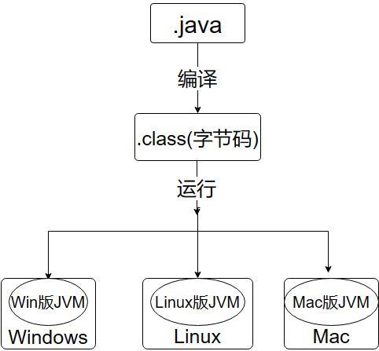

根据图上的内容，我们还可以知道，我们可以拿着我们的.java文件或者.class文件在不同的平台上都可以运行。

### 功能2：自动内存管理(内存分配、内存回收)

- Java程序在运行过程中，涉及到运算的`数据的分配`、`存储`等都由JVM来完成
- Java消除了程序员回收无用内存空间的职责。提供了一种系统级线程跟踪存储空间的分配情况，在内存空间达到相应阈值时，检查并释放可被释放的存储器空间。
- GC的自动回收，提高了内存空间的利用效率，也提高了编程人员的效率，很大程度上`减少了`因为没有释放空间而导致的`内存泄漏`。

**JDK：Java Development Kit**。(Java开发工具包)

JDK = JRE + java开发工具集

**JRE：Java Runtime Environment**.（Java运行时环境）

JRE = JVM + Java的核心类库 

平时也会遇到SDK，自行网页搜索。

首先讲什么是JRE，**JRE是指Java程序运行时所需要的环境，也就是Java程序要运行的话不可缺少的东西**：JVM和核心类库。

对于用户来说，用户只需要.class文件和JRE就可以运行程序了。

对于开发者来说，开发者需要先编写Java程序，然后使用Java开发工具集里的工具，如javac.exe(编译器)将.java程序编译成.class文件、java.exe（解释器）、javadoc（网页文档生成器）等。因此，对于开发者来说，需要完整的JDK

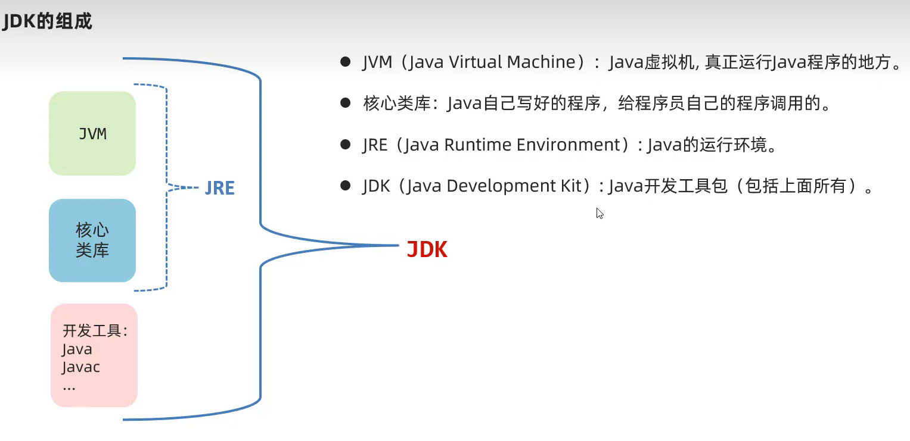

## 环境变量的配置

[09、Java入门：Path、JAVA_HOME环境变量配置_哔哩哔哩_bilibili](https://www.bilibili.com/video/BV1Cv411372m?p=9&vd_source=5a374f315281b0338a0b7fd69b8b8e98)

win+r 打开shell命令行。所谓命令行就是用户输入命令，然后系统执行命令并返回信息的。是用户与系统进行交互的一个窗口。

那么什么是命令呢？命令本质上是一个可执行程序，在windows上就是以exe为扩展名的文件。我们双击exe文件就相当于在命令行窗口输入该命令。

命令的搜索路径：

windows系统在执行用户命令时，若用户未给出exe文件的绝对路径，则首先在当前路径下寻找相应的可执行文件、批处理文件等；

若找不到，再依次在系统变量的Path保存的这些路径中寻找相应的可执行程序文件。

查找顺序是按照路径的录入顺序从左往右寻找的，最前面一条的优先级最高，如果找到命令就不会再向后寻找。

如果还找不到再继续在用户变量的Path路径中寻找。

Shell 内置命令，就是 Shell 自带的命令，这些命令是没有执行文件的；而外部命令就是由程序员单独开发的，所以会有命令的执行文件。

cd 命令是一个典型的 Shell 内置命令，所以 cd 命令没有执行文件所在路径。

ping.exe命令就存放在C:\Windows\System32夹下。


## Java代码规范

java开发涉及各方面的知识，现有的开发手册如阿里云、华为的java开发手册覆盖了各方面的开发规范，我们目前只是java的初学者，并不会要求一上来就去读Java开发规范手册。目前我们只了解一些java代码规范，为我们后续的学习打下良好的基础。

1. 类、方法的注释使用文档注释
2. 使用tab键和shift+tab键实现缩进和取消缩进，不要用空格。
3. 运算符和=两边留空格
4. 源文件用utf-8编码
5. 一行代码不要写太长，不便于阅读
6. 左大括号换行或不换行均可，要选一种，别混用！

## java程序从编写到运行

在如下目录下创建hello.java的文件

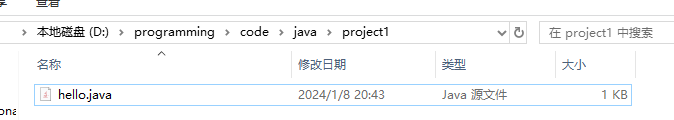

编写代码如下：(注意:**文件名 `hello`需要与类名 `hello` 保持一致，注意大小写有区别**)

```java
public class hello{
	public static void main(String[] args)
	{
		System.out.println("Hello,world");
	}
}
```

如果不一致会报错。这是java特性，没有为什么！！

对于上述java代码，学过面向对象才知道每一部分表示的含义，对于新人，记住这个框架，在main函数里编程即可。

接下来，在地址栏中输入cmd并回车，即可打开终端窗口。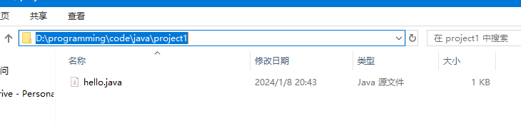

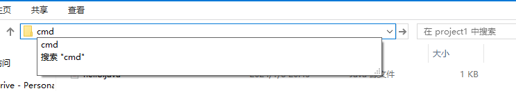

此时的当前目录就是此文件夹

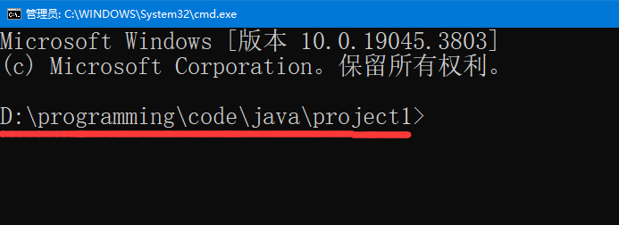

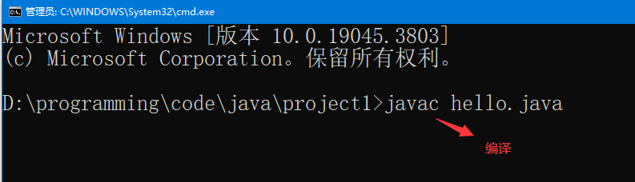

回车后，没有问题的话会出现`hello.class`

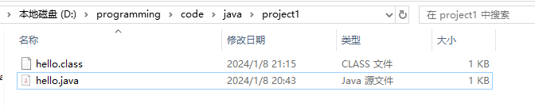

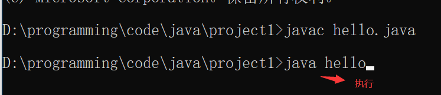

> 注意编译和运行时的区别，在编译的时候使用的是javac.exe这个工具，处理的文件是带有后缀".java"的，而在运行的时候，使用的工具是java.exe,处理的文件是不带有后缀".class"的
>

执行结果

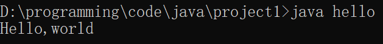


在国内的windows上，cmd窗口使用的是GBK编码方案，而sublime保存文件时的编码方案是UTF-8，这会导致如果源文件中有汉字，在编译的时候会报错，这时候下载插件GBK Support

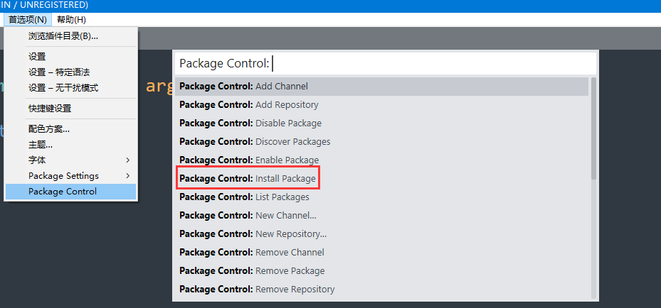


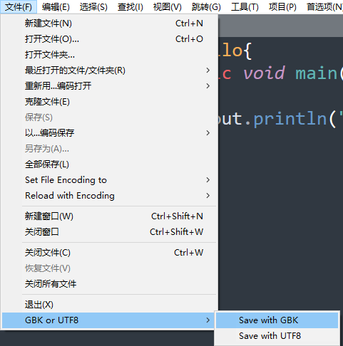

注意：每一次修改代码，都要经历保存，编译，运行三个过程。


> Java源文件以.java为扩展名。
>
> 源文件的基本组成单位是类(class)
>
> Java语言区分大小写
>
> Java语言的每一条语句以英文分号`;`结尾
>
> Java用{}来划分作用域
>
> 一个源文件最多只能有一个public类，如果源文件中有一个public类，则文件名必须与该public类的类名保持一致。
>
> Java的入口函数main的书写格式：
>
> ```java
> public static void main(String[] args)
> {
>     //
> }
> ```
>
> 一个源文件如下：
>
> ```java
> // hello.java
> public class hello{
> 	public static void main(String[] args)
> 	{
> 		System.out.println("hello,world");
> 	}
> }
> 
> class Dog
> {
> 	public static void main(String[] args)
> 	{
> 		System.out.println("hello,dog");
> 	}
> }
> 
> class Tiger
> {
> 	public static void main(String[] args)
> 	{
> 		System.out.println("hello,tiger");
> 	}
> }
> ```
>
> 在cmd经过编译 `javac hello.java`之后生成三个文件 `hello.class`、`Dog.class`、 `Tiger.class`
>
> 分别运行这三个 `.class`文件，会分别执行这三个类的main函数。
>
> 由上可知：
>
> 1. 源文件中的每一个类经过编译都会生成对应的class文件
>
> 2. main函数可以在多个类中实现，分别执行对应类的.class文件可以执行该类中的main函数


# 基本语法

### 注释(comment)

```java
//单行注释

/*
多~
行~
注~
释~
*/

```


**文档注释**

文档注释可以被JDK提供的工具javadoc解析，生成网页格式的说明文档。

[Java 文档注释全攻略，建议收藏！ - 知乎 (zhihu.com)](https://zhuanlan.zhihu.com/p/619502562#:~:text=二、文档注释格式总结 1 所有的 Java 文档注释都以 %2F** 开头， *%2F,每个 Java 文档注释都要和其后对应的类%2F方法%2F字段%2F包保持同样的缩进 4 Java 文档注释的内容，支持采用 HTML 语法规则书写，同时也支持一些额外的辅助标签)

[0024_韩顺平Java_文档注释_哔哩哔哩_bilibili](https://www.bilibili.com/video/BV1fh411y7R8?p=25&vd_source=5a374f315281b0338a0b7fd69b8b8e98)

先了解一下，多看看别人写的java代码，学学。后面再说。


看源码的时候再具体了解。


### API文档

- API （Application Programming Interface，应用程序编程接口）是 Java 提供的基本编程接口。
- **Java语言提供了大量的基础类**，因此 Oracle 也为这些基础类提供了相应的说明文档，**用于告诉开发者如何使用这些类，以及这些类里包含的方法。**
- Java API文档，即JDK使用说明书、帮助文档。

- 下载API文档：
  - 在线看：https://docs.oracle.com/en/java/javase/17/docs/api/index.html
  - 离线下载：https://www.oracle.com/java/technologies/javase-jdk17-doc-downloads.html

学一些Java提供的类的时候一定会用到，比如String类。

### 关键字(keyword)

- 定义：**被Java语言赋予了特殊含义，用做专门用途的字符串（或单词）**
- 特点：全部关键字都是`小写字母`。
- 关键字比较多，不需要死记硬背，学到哪里记到哪里即可。
- 官方地址： https://docs.oracle.com/javase/tutorial/java/nutsandbolts/_keywords.html

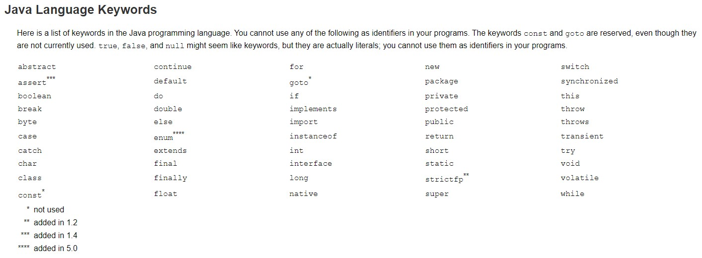

> 说明：
>
> 1. 关键字一共`50个`，其中`const`和`goto`是`保留字`(reserved word)。
> 2. `true`，`false`，`null`不在其中，它们看起来像关键字，其实是`字面值(iterals)`，表示特殊的布尔值和空值。

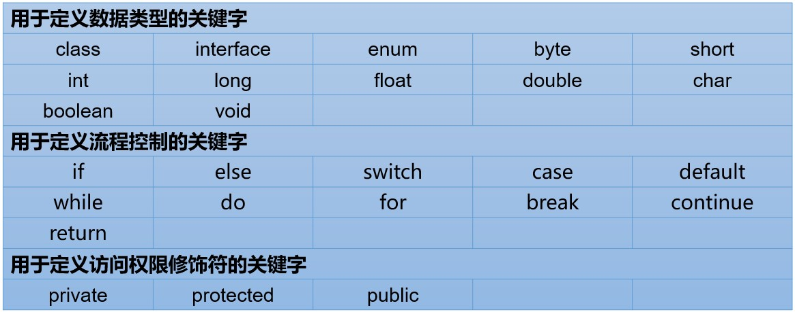

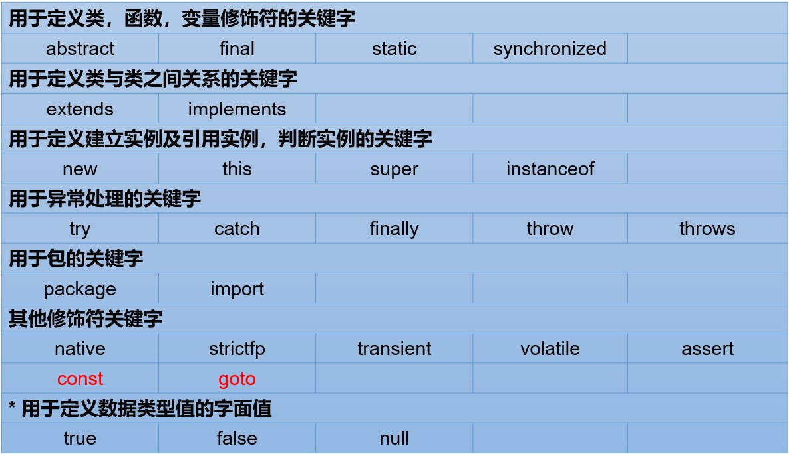

strictfp了解一下即可，以后不会用到。。


### 标识符(identifier)

Java中变量、方法、类等要素命名时使用的字符序列，称为标识符。

技巧：凡是自己可以起名字的地方都叫标识符。

**标识符的命名规则**（必须遵守的`硬性规定`）：

```
> 由26个英文字母大小写，0-9 ，_或 $ 组成  
> 数字不可以开头。
> 不可以使用关键字和保留字，但能包含关键字和保留字。
> Java中严格区分大小写，长度无限制。
```

**标识符的命名规范**（建议遵守的`软性要求`，否则工作时容易被鄙视）:

```
> 包名：多单词组成时所有字母都小写
  例如：java.lang、com.atguigu.bean
  
> 类名、接口名：多单词组成时，所有单词的首字母大写：XxxYyyZzz
  例如：HelloWorld，String，System等
  
> 变量名、方法名：多单词组成时，第一个单词首字母小写，第二个单词开始每个单词首字母大写：xxxYyyZzz
  例如：age,bookName,getName
  
> 常量名：所有字母都大写。多单词时每个单词用下划线连接：XXX_YYY_ZZZ
  例如：MAX_VALUE,PI,DEFAULT_CAPACITY
```

注意：在起名字时，为了提高阅读性，要尽量有意义，“见名知意”。

> 更多细节详见《代码整洁之道_关于标识符.txt》《阿里巴巴Java开发手册-1.7.1-黄山版》有时间看，没时间算


### 变量(variable)

- 变量的概念：
  - 内存中的一个存储区域
  - 变量的构成包含三个要素：`数据类型`、`变量名`、`存储的值`
  - Java中变量声明的格式：`数据类型 变量名 = 字面值(literals);`
- 变量的作用：用于在内存中保存数据。
- 使用变量注意：
  - Java中每个变量必须先声明，后使用。
  - 使用变量名来访问这块区域的数据。
  - 变量的作用域：其定义所在的一对{ }内。
  - 变量只有在其`作用域`内才有效。出了作用域，变量不可以再被调用。
  - 同一个作用域内，不能定义重名的变量。

java不支持外层块定义一个变量，在内层块再定义一个同名变量

> With java, you cannot make a local variable with the same name, even though the data types are different.

```java
public static void main(String[] args)
{
    int i = 1;
    for(int i = 0;;)    //在main中定义了变量i，再在内层块定义会报错。
    {
        
    }
}
```

### 数据类型

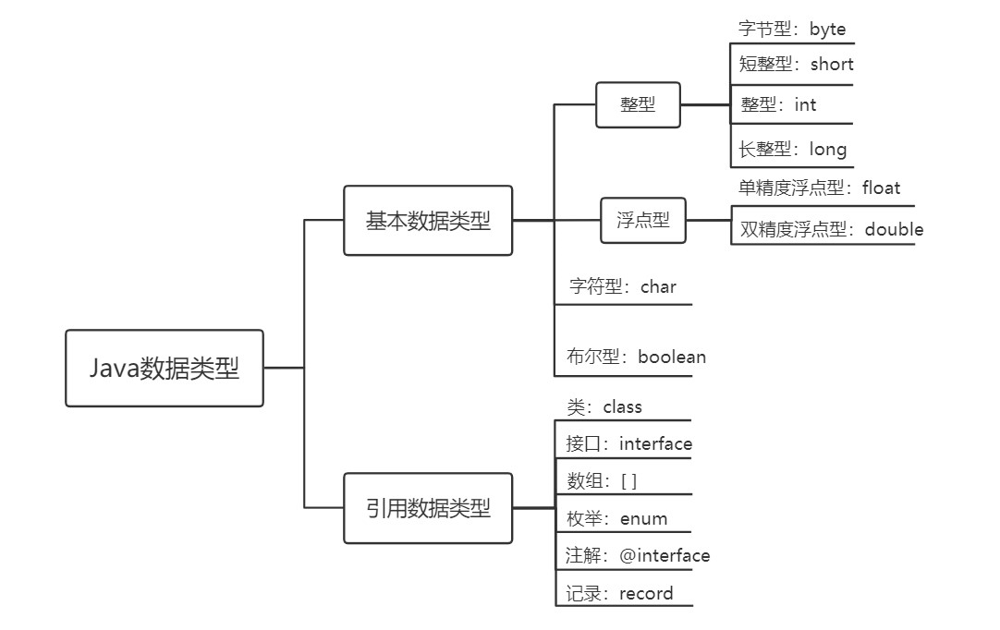

提问：什么是引用数据类型？

引用数据类型的变量存放的是地址。而基本数据类型的变量存放的是值。java里的引用就是地址值。

而c++里的引用与java里的引用不是同一个概念，c++里的引用是同一内存空间的另一个变量名，即另一个名字。

举例：

```c++
int i = 5;
int &j = i; 
```

执行`int i = 5;`之后，会开辟一个int类型字节大小的内存空间，里面存放数字5。`i`是该内存空间的一个标识，即名字。

执行 `int&j = i;`之后，`j`也是该内存空间的一个标识。而`j`不是该内存空间的地址值。


java与c不同，java的数据类型有固定的字节，不受具体操作系统的影响，而c++各数据类型的字节大小是受到具体cpu的机器字长影响。这一特性保证了java可移植性。

| 数据类型 | 存储方式     | 字节大小 | 取值范围      | 默认值   |
| -------- | ------------ | -------- | ------------- | -------- |
| byte     | 有符号、补码 | 1        | 自己算        | 0        |
| short    | 有符号、补码 | 2        |               | 0        |
| int      | 有符号、补码 | 4        |               | 0        |
| long     | 有符号、补码 | 8        |               | 0L       |
| float    | IEEE754      | 4        |               | 0.0f     |
| double   | IEEE754      | 8        |               | 0.0d     |
| boolean  |              | ~        | true or false | false    |
| char     |              | 2        |               | '\u0000' |

> boolean类型不能用0、非0代替flase、true

~~数据类型的默认值是指在定义一个该数据类型的变量且并未初始化时，系统赋予该变量的初始值。~~


定义变量的时候，系统会根据其数据类型给变量分配对应字节大小的空间。

> 面试题boolean 占几个字节（阿**巴）
>
> ```
> 编译时不谈占几个字节。
> 
> 但是JVM在给boolean类型分配内存空间时，boolean类型的变量占据一个槽位(slot，等于4个字节)。
> 细节：true:1  false:0
> 
> >拓展：在内存中，byte\short\char\boolean\int\float : 占用1个slot
>               double\long :占用2个slot
> ```


### 字面值(literals)

字面值也有数据类型！

在默认值那一列可以看到0有四种表示形式，分别是：0，0L，0.0f，0.0d

Java中默认将整数字面值视为 `int` 类型。在整数字面值后面添加 `L` 或 `l` 来表示长整数（`long` 类型）


Java会将带小数点的数值视为小数，

**0.0f** 这表示一个浮点数常量，类型为单精度浮点数（float）
**0.0d：** 这表示一个浮点数常量，类型为双精度浮点数（double）
如果不加f或d得话，浮点数默认是`double`类型

浮点型常值有两种表示形式：

- 十进制数形式。如：5.12       512.0f        .512   (必须有小数点）
- 科学计数法形式。如：5.12e2      512E2     100E-2

```java
double num1 = 0.314;
double num1 = .314; //等价于 double num1 = 0.314
double num2 = 3.14e3; // 3.14e3 = 3.14*10^3
double num3 = 3.14E3;  //e、E是一样的
System.out.println(num1);
System.out.println(num2);
System.out.println(num3);
------------
0.314    
0.314
3140.0         //注意不是3140
3140.0    
```


**浮点数陷阱**

```java
double num1 = 2.7;
double num2 = 8.1 / 3;    // 正常计算应该是2.7
System.out.println(num1);
System.out.println(num2);

--------

2.7
2.6999999999999997
```


出现这种情况，需要学习浮点数的乘除，必须要学会！（考研考到了）

综上，不要用浮点数相等作为判断条件：

```java
if(num1 == num2)
{
    System.out.println("2.7 = 8.1 / 3");
}
else
{
    System.out.println("2.7 != 8.1 / 3");
}
```

正确的做法是：两个数相减的绝对值小于1e-6或1e-15

如果是float类型的，要小于1e-6

如果是double类型的，要小于1e-15

为什么是这样，具体原因与浮点数的存储方式有关！

- 并不是所有的小数都能可以精确的用二进制浮点数表示。二进制浮点数不能精确的表示0.1、0.01、0.001这样10的负次幂。（这个也是跟浮点数的存储方式有关）
- 浮点类型float、double的数据不适合在`不容许舍入误差`的金融计算领域。如果需要`精确`数字计算或保留指定位数的精度，需要使用`BigDecimal类`。

> (面试题). Java开发中计算金额时使用什么数据类型？（5*到家）
>
> 不能使用float或double，因为精度不高。
>
> 应该使用BigDecimal类替换，可以实现任意精度的数据的运算。

**在变量定义的时候，整型变量常用int，浮点数变量常用double**

> (面试题)为什么Java中0.1 + 0.2结果不是0.3？（字*跳动）
>
> 在代码中测试0.1 + 0.2，你会惊讶的发现，结果不是0.3，而是0.3000……4。这是为什么？
>
> 几乎所有现代的编程语言都会遇到上述问题，包括 JavaScript、Ruby、Python、Swift 和 Go 等。引发这个问题的原因是，它们都采用了`IEEE 754标准`。

学计组的时候再算算！！！

### 类型转换

1. boolean类型不参与转换

2. 自动转换

   编译器自动完成数据类型转换

   1. 什么时候进行自动转换

      1. 将低级字面值赋给高级变量时

         ```java
      byte myByte = 0;
         // 字面值0是int类型，字节大小为4，而变量myByte是byte类型，字节大小为1，当您将一个整数赋值给一个byte类型的变量时，如果该整数在 byte 类型的取值范围内（即 -128 到 127），则赋值是有效的，这个过程进行了自动类型转换。如果整数超出了byte类型的取值范围，那么编译器将报错
      int n1 = 0;
         byte n2 = n1; 
      //但是如果您将一个int类型变量赋值给一个byte类型的变量时，编译器将报错。不管超没超byte类型的取值范围。
         ```
         
      2. 进行运算时
   
         不同数据类型的数字进行运算时，需要先转换成同样的数据类型才能计算,当存储范围小的数据类型与存储范围大的数据类型变量一起混合运算时，会按照其中最大的类型运算。
   
         ```java
         int i = 1;
      byte b = 1;
      double d = 1.0;
   
         double sum = i + b + d;//混合运算，升级为double
         ```
      ```
         
         当byte,short,char数据类型的变量进行算术运算时，按照int类型处理。
         
         ```java
         byte b1 = 1;
         byte b2 = 2;
         byte b3 = b1 + b2;//编译报错，b1 + b2自动升级为int
         
         char c1 = '0';
         char c2 = 'A';
         int i = c1 + c2;//至少需要使用int类型来接收
         System.out.println(c1 + c2);//113 
      ```
   
   
      规则
   
      虚线表示可能丢失精度
   
   2. 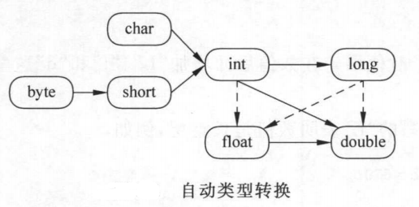
   
3. 强制转换

   程序员强制要求进行数据类型转换

   格式： 低级数据类型 变量名 = (高级数据类型) (被转换的数据);

   可能会有精度的损失，一般不建议这样使用。

（1）当把存储范围大的值（常量值、变量的值、表达式计算的结果值）强制转换为存储范围小的变量时，可能会`损失精度`或`溢出`。

```java
int i = (int)3.14;//损失精度

double d = 1.2;
int num = (int)d;//损失精度

int i = 200;
byte b = (byte)i;//溢出
```

（2）当某个值想要提升数据类型时，也可以使用强制类型转换。这种情况的强制类型转换是`没有风险`的，通常省略。

```java
int i = 1;
int j = 2;
double bigger = (double)(i/j);
```

（3）声明long类型变量时，可以出现省略后缀的情况。float则不同。

```java
long l1 = 123L;
long l2 = 123;//如何理解呢？ 此时可以看做是int类型的123自动类型提升为long类型

//long l3 = 123123123123; //报错，因为123123123123超出了int的范围。
long l4 = 123123123123L;


//float f1 = 12.3; //报错，因为12.3看做是double，不能自动转换为float类型
float f2 = 12.3F;
float f3 = (float)12.3;
```


### 字符(char)

- char 型数据用来表示通常意义上“`字符`”（占2字节）

- Java中的所有字符都使用Unicode编码

- 字符型字面值的三种表现形式：

  - **形式1：**使用单引号(' ')括起来的`单个字符`。

    例如：char c1 = 'a';   char c2 = '中'; char c3 =  '9';

  - **形式2：**直接使用 `Unicode值`来表示字符型常量：‘`\uXXXX`’。其中，XXXX代表一个十六进制整数。

    例如：\u0023 表示 '#'。

  - **形式3：**Java中还允许使用`转义字符‘\’`来将其后的字符转变为特殊字符型常量。

    例如：char c3 = '\n';  // '\n'表示换行符

  | 转义字符 |  说明  | Unicode表示方式 |
  | :------: | :----: | :-------------: |
  |   `\n`   | 换行符 |     \u000a      |
  |   `\t`   | 制表符 |     \u0009      |
  |   `\"`   | 双引号 |     \u0022      |
  |   `\'`   | 单引号 |     \u0027      |
  |   `\\`   | 反斜线 |     \u005c      |
  |   `\b`   | 退格符 |     \u0008      |
  |   `\r`   | 回车符 |     \u000d      |

- char类型是可以进行运算的。因为它都对应有Unicode码，可以看做是一个数值。

char类型计算的时候，是Unicode码参与计算

```java
char c = '\r',d = '\n';
System.out.print(c+d);  // '\r'=000d=13,'\n'=000a=10
-----------
23    
```


### 编码

字符集：字符与(十进制)码点的映射。

编码方案：二进制码点与真实底层存储的映射。


[05、IO流（一）：前置知识-字符集、UTF-8、GBK、ASCII、乱码问题、编码和解码等_哔哩哔哩_bilibili](https://www.bilibili.com/video/BV1Cv411372m?p=156&vd_source=5a374f315281b0338a0b7fd69b8b8e98)

### 转义字符

在Java中，反斜杠（\）是一个特殊的字符，被称为转义字符，它的作用是用来转义后面一个字符，用于表示特殊含义，接下来介绍几个

```java
//Hello.java
public class Hello
{
    public static void main(String[] args)
    {
        System.out.println("hello,world\n你好，世界");
    }
}
------
hello,world
你好，世界
```

```java
//Hello.java
class number
{
    public static void main(String[] args)
    {
        System.out.println("1234567\t12345678\t123456789\t1")
    }
}
----------
1234567 12345678        123456789       1

//第一个\t前面有7位字符，不满8位，补空格至8位
//第二个\t前面有8位字符，不满16位，补空格至16位
//第三个\t前面有9位字符，不满16位，补空格至16位
```

综上，制表符\t前面的字符数不足或等于8的倍数时，补空格至8的倍数。

```java
//Hello.java
class Enter
{
    public static void main(String[] args)
    {
        System.out.println("人人得而诛之\r非也");
    }
}
-----------
非也得而诛之    
```

在java中，用双引号括起来的部分表示字符串，如果我们想在字符串内使用双引号，如：

他们说："人生不得意之事十之八九"。

```java
class Escape
{
    public static void main(String[] args)
    {
        System.out.println("他们说：\"人生不得意之事十之八九\"。")
        //要在需要识别成字符的引号前加\
    }
}
```

因为双引号`"`会被编译器识别为字符串的标志，而我们希望双引号作为字符串的一部分，即我们希望双引号被识别成一个字符，因此我们可以在双引号前加反斜杠，这样编译器就能将其识别为字符。

综上可知,如果我们想在字符串中使用 `\`,会被编译器直接识别为转义字符，而转义字符是与其后的字符结合会产生效果的。因此我们需要在 `\`前加 `\`，这样就能被识别成字符了。

### 布尔类型(boolean)

- **boolean类型数据只有两个值：true、false。**
  - 不可以使用0或非 0 的整数替代false和true，这点和C语言不同。
  - 拓展：Java虚拟机中没有任何供boolean值专用的字节码指令，Java语言表达所操作的boolean值，在编译之后都使用java虚拟机中的int数据类型来代替：true用1表示，false用0表示。——《java虚拟机规范 8版》(`看不懂`)

> 经验之谈：
>
> Less is More！建议不要这样写：if ( isFlag = = true )，只有新手才如此。关键也很容易写错成if(isFlag = true)，这样就变成赋值isFlag为true而不是判断！`老鸟的写法`是if (isFlag)或者if ( !isFlag)。


### 字符串类型(String)

- String不是基本数据类型，属于引用数据类型

- 使用一对`""`来表示一个字符串，内部可以包含0个、1个或多个字符。

- ```java
  String s = "hello,world!";
  ```

1、任意八种基本数据类型的数据与String类型只能进行连接“+”运算，且结果一定也是String类型

```java
System.out.println("" + 1 + 2);//12

int num = 10;
boolean b1 = true;
String s1 = "abc";

String s2 = s1 + num + b1;
System.out.println(s2);//abc10true

//String s3 = num + b1 + s1;//编译不通过，因为int类型不能与boolean运算
String s4 = num + (b1 + s1);//编译通过
```

2、String类型不能通过强制类型()转换，转为其他的类型

```java
String str = "123";
int num = (int)str;//错误的

int num = Integer.parseInt(str);//正确的，后面才能讲到，借助包装类的方法才能转
```

String类

与c不同的是，Java的String类不支持方括号运算符

```java
String s = "Hello,world!";
System.out.println(s[0]);     //在java中，用运算符[]来获取索引对应的元素，是错误的。但char[]数组依然支持
System.out.println(s.charAt(0));  //正确的做法！！！
```

String类提供charAt()方法来获取索引对应的元素。


### 运算符(Operator)

运算符的分类：

- 按照`功能`分为：算术运算符、赋值运算符、比较(或关系)运算符、逻辑运算符、位运算符、条件运算符、Lambda运算符

```java
public class Test {
    public static void main(String args[]) {
        int x = -5;
        int y = -12;
        System.out.println(y % x);
    }
}
```

取模运算（“Modulus Operation”）和取余运算（“Remainder Operation ”）两个概念有重叠的部分但又不完全一致。主要的区别在于对负整数进行除法运算时操作不同。取模主要是用于计算机术语中。取余则更多是数学概念。 

另外各个环境下%运算符的含义不同，比如C/C++，Java 为取余，而Python则为取模。

在java中，%为取余操作，Math.floorMod为取模操作
取余的结果是与被除数的符号保持一致；
取模的结果是与除数的符号保持一致。


|           分类            |                        运算符                        |
| :-----------------------: | :--------------------------------------------------: |
|     算术运算符（7个）     |                +、-、*、/、%、++、--                 |
|    赋值运算符（12个）     | =、+=、-=、*=、/=、%=、>>=、<<=、>>>=、&=、\|=、^=等 |
| 比较(或关系)运算符（6个） |                 >、>=、<、<=、==、!=                 |
|     逻辑运算符（6个）     |                &、\|、^、!、&&、\|\|                 |
|      位运算符（7个）      |               &、\|、^、~、<<、>>、>>>               |
|     条件运算符（1个）     |               (条件表达式)?结果1:结果2               |
|    Lambda运算符（1个）    |                          ->                          |

- 按照`操作数个数`分为：一元运算符（单目运算符）、二元运算符（双目运算符）、三元运算符 （三目运算符）

|           分类            |                  运算符                  |
| :-----------------------: | :--------------------------------------: |
| 一元运算符（单目运算符）  |    正号（+）、负号（-）、++、--、!、~    |
| 二元运算符（双目运算符）  | 除了一元和三元运算符剩下的都是二元运算符 |
| 三元运算符 （三目运算符） |         (条件表达式)?结果1:结果2         |


**自增运算符**

以下代码执行的结果显示是多少（）？

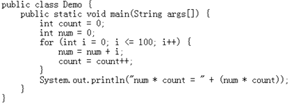

答案：num * count = 0

`count = count++;`

执行过程：先执行`count++`

count++是先赋值后加=>   temp = count  ， count = count + 1； 即先把count的值放到一个临时变量中，然后执行count = count + 1。即count = 1

接着执行赋值运算符，即将临时变量temp的值赋给count。即count = 0；

因此， `count = count++;`执行完后count的值不变。

**赋值运算符**

| 赋值运算符 |                           符号解释                           |
| :--------: | :----------------------------------------------------------: |
|    `+=`    | 将符号`左边的值`和`右边的值`进行`相加`操作，最后将结果`赋值给左边的变量` |
|    `-=`    | 将符号`左边的值`和`右边的值`进行`相减`操作，最后将结果`赋值给左边的变量` |
|    `*=`    | 将符号`左边的值`和`右边的值`进行`相乘`操作，最后将结果`赋值给左边的变量` |
|    `/=`    | 将符号`左边的值`和`右边的值`进行`相除`操作，最后将结果`赋值给左边的变量` |
|    `%=`    | 将符号`左边的值`和`右边的值`进行`取余`操作，最后将结果`赋值给左边的变量` |

> (面试题). 代码分析(君\*科技、新\*陆)
>
> ```java
> short s1=1; 
> s1=s1+1;  //有什么错？  =右边是int类型。需要强转
> ```
>
> ```java
> short s1=1;
> s1+=1; //有什么错?   没错
> ```


**位运算符**

```java
A = 0011 1100
B = 0000 1101
-----------------
A & B = 0000 1100
A | B = 0011 1101
A ^ B = 0011 0001
~A= 1100 0011
```

| 操作符 | 描述           |
| ------ | -------------- |
| &      | 按位与         |
| I      | 按位或         |
| ~      | 按位非         |
| ^      | 按位异或       |
| <<     |                |
| \>>    |                |
| \>>>   | 逻辑右移操作符 |

```java
int a = -15,b = -15;
a = a >> 1;  
b = b >>> 1;
System.out.println(a);   
System.out.println(b);
---------
    
-8
2147483640    
```

可知，符号位是什么， `>>` 右移补什么。  `>>>`右移补0


**逻辑运算符**

| &&    | 当且仅当两个操作数都为真，条件才为真。                       |
| ----- | ------------------------------------------------------------ |
| \| \| | 如果任何两个操作数任何一个为真，条件为真。                   |
| ！    | 称为逻辑非运算符。用来反转操作数的逻辑状态。如果条件为true，则逻辑非运算符将得到false。 |

java逻辑运算符支持短路

```java
public class Test {
    private static int j = 0;
 
    private static Boolean methodB(int k) {
        j += k;
        return true;
    }
 
    public static void methodA(int i) {
        boolean b;
        b = i < 10 | methodB(4);
        b = i < 10 || methodB(8);
 
    }
 
    public static void main(String args[]) {
        methodA(0);
        System.out.println(j);
    }
}
```

输出结果j为4.因为     `||` 前边是true，根据短路原则，methodB(8)不再执行。


**条件运算符**

```java
int a , b;
a = 10;
// 如果 a 等于 1 成立，则返回 20，否则 30
b = (a == 1) ? 20 : 30;
System.out.println( "Value of b is : " +  b );
```


**运算符优先级**

运算符有不同的优先级，所谓优先级就是在表达式运算中的运算符顺序。

上一行中的运算符总是优先于下一行的。

| 优先级 |    运算符说明    |             Java运算符             |
| ------ | :--------------: | :--------------------------------: |
| 1      |       括号       |          `()`、`[]`、`{}`          |
| 2      |      正负号      |              `+`、`-`              |
| 3      |    单元运算符    |       `++`、`--`、`~`、`！`        |
| 4      | 乘法、除法、求余 |           `*`、`/`、`%`            |
| 5      |    加法、减法    |              `+`、`-`              |
| 6      |    移位运算符    |         `<<`、`>>`、`>>>`          |
| 7      |    关系运算符    | `<`、`<=`、`>=`、`>`、`instanceof` |
| 8      |    等价运算符    |             `==`、`!=`             |
| 9      |      按位与      |                `&`                 |
| 10     |     按位异或     |                `^`                 |
| 11     |      按位或      |                `|`                 |
| 12     |      条件与      |                `&&`                |
| 13     |      条件或      |                `||`                |
| 14     |    三元运算符    |               `? :`                |
| 15     |    赋值运算符    | `=`、`+=`、`-=`、`*=`、`/=`、`%=`  |
| 16     |   位赋值运算符   |  `&=`、`|=`、`<<=`、`>>=`、`>>>=`  |

> 开发建议：
>
> 1. 不要过多的依赖运算的优先级来控制表达式的执行顺序，这样可读性太差，尽量`使用()来控制`表达式的执行顺序。
> 2. 不要把一个表达式写得过于复杂，如果一个表达式过于复杂，则把它`分成几步`来完成。例如：
>    ​ (num1 + num2) * 2 > num3 && num2 > num3 ? num3 : num1 + num2;


别想着优先级不用记，多加括号就行。一旦遇到面试就直接没分了，有了工作后忘了就行。


### 条件语句

```java
if(布尔表达式)
{
   //如果布尔表达式为true将执行的语句
}
```

```java
if(布尔表达式){
   //如果布尔表达式的值为true
}else{
   //如果布尔表达式的值为false
}
```

```java
if(布尔表达式 1){
   //如果布尔表达式 1的值为true执行代码
}else if(布尔表达式 2){
   //如果布尔表达式 2的值为true执行代码
}else if(布尔表达式 3){
   //如果布尔表达式 3的值为true执行代码
}else {
   //如果以上布尔表达式都不为true执行代码
}
```

```java
if(布尔表达式 1){
   ////如果布尔表达式 1的值为true执行代码
   if(布尔表达式 2){
      ////如果布尔表达式 2的值为true执行代码
   }
}
```

### 循环语句

```java
while( 布尔表达式 ) {
  //循环内容
}
```

对于 while 语句而言，如果不满足条件，则不能进入循环。但有时候我们需要即使不满足条件，也至少执行一次。

do…while 循环和 while 循环相似，不同的是，do…while 循环至少会执行一次。

```java
do {
       //代码语句
}while(布尔表达式);

```

```java
for(初始化; 布尔表达式; 更新) {
    //代码语句
}
```

```java
for(声明语句 : 表达式)
{
   //代码句子
}
```

```java
public class Test {
   public static void main(String[] args){
      int [] numbers = {10, 20, 30, 40, 50};
 
      for(int x : numbers ){
         System.out.print( x );
         System.out.print(",");
      }
      System.out.print("\n");
      String [] names ={"James", "Larry", "Tom", "Lacy"};
      for( String name : names ) {
         System.out.print( name );
         System.out.print(",");
      }
   }
}
```


### break&continue


### 方法&return

方法的定义：

```java
修饰符 返回值类型 方法名(形参列表){
    //方法体
    return 返回值;
}    
```

修饰符在学习封装的时候会学。

方法的作用：

将代码进行封装，以便可以重复的被调用，即降低代码的重复性。同时将代码封装可以使整体代码的逻辑更清晰。


参数传递机制

Java里方法的参数传递方式只有一种： 值传递 。 即将实际参数值的副本（复制品）传入方法内，而参数
本身不受影响。
形参是基本数据类型：将实参基本数据类型变量的“数据值”传递给形参
形参是引用数据类型：将实参引用数据类型变量的“地址值”传递给形参

以下Java程序运行的结果是

```java
public class Tester{
public static void main(String[] args){
   Integer var1=new Integer(1);
   Integer var2=var1;
   doSomething(var2);
   System.out.print(var1.intValue());
   System.out.print(var1==var2);
}
public static void doSomething(Integer integer){
    integer=new Integer(2);
    }
}
```

输出结果：1true


### 递归

学习递归能帮助我们理解，在底层，方法在调用后是存放在栈区里的。

[04、Java方法：方法在计算机中的执行_哔哩哔哩_bilibili](https://www.bilibili.com/video/BV1Cv411372m?p=57&spm_id_from=pageDriver&vd_source=5a374f315281b0338a0b7fd69b8b8e98)


### switch

```java
switch(expression){
    case value :
       //语句
       break; //可选
    case value :
       //语句
       break; //可选
    //你可以有任意数量的case语句
    default : //可选
       //语句
}
```

- switch 语句中的表达式的类型可以是： byte、short、int 或者 char。从 Java SE 7 开始，switch 支持字符串 String 类型了，同时 case 标签必须为字符串常量或字面量。

- switch 语句可以拥有多个 case 语句。每个 case 后面跟一个要比较的值和冒号。

- 当变量的值与 case 语句的值相等时，那么 case 语句之后的语句开始执行，直到 break 语句出现才会跳出 switch 语句。如果 case 语句块中没有 break 语句时，匹配成功后，从当前 case 开始，后续所有 case 的值都会输出。

  ```java
  public class Test {
     public static void main(String args[]){
        int i = 1;
        switch(i){
           case 0:
              System.out.println("0");
           case 1:
              System.out.println("1");
           case 2:
              System.out.println("2");
           default:
              System.out.println("default");
        }
     }
  }
  -------
  1
  2
  default    
  ```

- switch 语句可以包含一个 default 分支，该分支一般是 switch 语句的最后一个分支（可以在任何位置，但建议在最后一个）。default 在没有 case 语句的值和变量值相等的时候执行。default 分支不需要 break 语句。


### 输入输出语句

输出语句

```java
public static void main(String[] ags){           
    System.out.println("1");   
    System.out.println();
    System.out.println("2");   //自带换行
    System.out.print("3");     //不带换行
    System.out.print("4");
}
-------------
1

2    
34    
```

输入语句

```java
import java.util.Scanner;

Scanner scan = new Scanner(System.in);   //实例化类Scanner
String str = scan.nextline();        //调用scan中的方法nextline(),从键盘获取一串字符串并返回
```

更多内容查询API文档


### 一维数组

概念：相同数据类型的数据的排列集合

- 创建数组对象会在内存中开辟一整块`连续的空间`。占据的空间的大小，取决于数组的长度和数组中元素的类型。
- 数组，一旦初始化完成，其长度就是确定的。数组的`长度一旦确定，就不能修改`。
- 我们可以直接通过下标(或索引)的方式调用指定位置的元素，速度很快。
- 数组名引用的是这块连续空间的首地址。

#### 声明与初始化

```java
int[] arr;   // 首选的方法

int arr[];  // 效果相同，但不是首选方法
```

**注意:** 建议使用 **int[] arr;** 的声明风格声明数组变量。 int arr[]; 风格是来自 C/C++ 语言 ，在Java中采用是为了让 C/C++ 程序员能够快速理解java语言。


##### 分配空间

```java
arr = new int[arraySize];   //创建一个大小为arraySize，类型为int的数组，并将首地址赋给arr
//arraySize可以是字面值，也可以是变量或常量
```


由上可知，跟c++不一样，c++在声明的时候就要给数组分配空间，而java可以先声明再分配空间

当然，java也可以在声明的时候分配空间

```java
int[] arr = new int[arraySize];     //声明数组并分配空间
```


##### 动态初始化

```java
int n = 5;
int[] a = new int[n];
System.out.println(a.length);   // 5    数组的长度用length属性
```

----------------------

> 动态初始化和静态初始化的区别？
>
> 举个例子，
>
> 让用户输入一个数字n，表示接下来用户将输入n个数，并用数组存储起来。在这种预先不知道数组大小的情况下，只能用动态创建数组的方法。


##### 静态初始化

```java
int[] arr = new int[]{1,2,3,4,5};//正确
//或
int[] arr;
arr = new int[]{1,2,3,4,5};//正确
```


```java
int[] arr = {1,2,3,4,5};//正确
```


#### 索引

用中括号[]

> 面试题. 为什么数组要从0开始编号，而不是1(中*支付)
>
> 数组的索引，表示了数组元素距离首地址的偏离量。因为第1个元素的地址与首地址相同，所以偏移量就是0。所以从0开始。

#### **动态创建数组的默认值**

通过对静态创建数组和动态创建数组可知，静态数组必须初始化才能完成创建，而动态创建数组可以不进行初始化，原因是动态创建数组若不进行初始化的话，会赋予默认值。

| 数据类型     | 默认值      |
| ------------ | ----------- |
| byte         | 0           |
| short        | 0           |
| int          | 0           |
| long         | 0L          |
| float        | 0.0f        |
| double       | 0.0d        |
| boolean      | false       |
| char         | '\u0000' =0 |
| 引用数据类型 | null        |

```java
char[] letters = new char[5];
System.out.println("letters数组的长度：" + letters.length);
if(letters[0] == '\u0000')
{
    System.out.println("6");
}
if(letters[0] == 0)
{
    System.out.print("6");
}
-----
66    
```

**根据上面这个例子可知，char类型的默认值是'\u0000',也是int类型的字面量0**


```java
String[] arr = new String[5];
System.out.print(arr[0]);
------
null
```

String是引用数据类型，由上面的例子可知，String类的默认值是null。实际上，引用数据类型的默认值都是null。


#### 打印地址

```java
int[] arr = {1,2,3,4,5};
System.out.println(arr);//[I@6d03e736
```

> 以[I@6d03e736为例：
> [ ：表示现在打印的是一个数组。
> I：表示现在打印的数组是int类型的。
> @：仅仅是一个间隔符号而已。
> 6d03e736：就是数组在内存中真正的地址值。（十六进制的）
> 但是，我们习惯性会把[I@6d03e736这个整体称之为数组的地址值

以上提到的是定长数组，可变长数组ArraysList在集合框架中学。


### 二维数组

#### 声明与初始化

##### 声明数组

```java
//推荐
int[][] arr;

//不推荐
int  arr[][];
//不推荐
int[]  arr[];
```


##### 静态初始化

法一：

```java
int[][] arr = {{1,2,3},{4,5,6},{7,8,9,10}};//声明与初始化必须在一句完成
```

法二：

```java
int[][] arr = new int[][]{{3,8,2},{2,7},{9,0,1,6}};
```

法三：

```java
int[][] arr;
arr = new int[][]{{1,2,3},{4,5,6},{7,8,9,10}};

arr = new int[3][3]{{1,2,3},{4,5,6},{7,8,9,10}};//错误，静态初始化右边new 数据类型[][]中不能写数字
```


##### 动态初始化

1. 规则分配

```java
int m,n;
int[][] a = new int[m][n];
```

2. 不规则分配：从最高维开始，分别为每一维分配空间，例如：

```java
String[][] s = new String[2][];
s[0] = new String[2];
s[1] = new String[3];
```

二维数组的长度

```java
int[][] a = new int[2][3];
System.out.println(a.length);    //二维数组a的行数
System.out.println(a[0].length);  //二维数组第一行有多少个元素
```

#### 索引

- 二维数组的长度/行数：二维数组名.length
- 二维数组的某一行：二维数组名[行下标]，此时相当于获取其中一组数据。它本质上是一个一维数组。行下标的范围：[0, 二维数组名.length-1]。此时把二维数组看成一维数组的话，元素是行对象。
- 某一行的列数：二维数组名[行下标].length，因为二维数组的每一行是一个一维数组。
- 某一个元素：二维数组名\[行下标\]\[列下标\]，即先确定行/组，再确定列。


### Arrays工具类

[Arrays (Java SE 17 & JDK 17) (oracle.com)](https://docs.oracle.com/en/java/javase/17/docs/api/java.base/java/util/Arrays.html)

java.util.Arrays类包含了用来操作数组（比如排序和搜索）的各种方法。


具体某个方法如何使用去看源码即可。


# 包机制

## 什么是包

所谓包，说白了就是文件夹或者目录，当我们创建了许多类时，就需要包来归类，可以将功能相似或相关的类放在同一包下，包里不同有同名类，但不同包下的类可以重名。所以，**包的本质其实就是用以区别不同类的文件夹或目录**。

## 包的作用

1. 可以对类进行分门别类的管理，**把功能相似或相关联的类或接口放在同一包下，方便查看和使用。**

   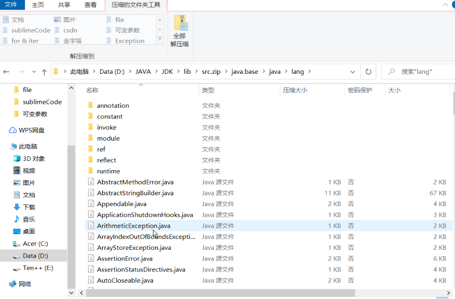

   如上图所示，每一个文件夹就是一个包，每个包又有多个类。

2. 区别相同名字的类，同名的两个类可以放在不同的包下。当同时调用两个不同包中相同类名的类时，应该加上包名加以区别。因此，**包可以避免名字冲突**。

   如果导入两个包里存在相同的类，在调用的时候需要具体指明调用哪个包里的类

   ```java
   import pack1.ClassA;
   import pack2.ClassA;
   
   
   pack2.ClassA s = new pack2.ClassA();
   ```

3. **限制访问权限**，java默认的访问权限是在本包下，用到其他包下的类需要导包。

   包的使用：

   ```java
import pack.ClassA;  //导入pack包里的ClassA类
   import pack.*;        //导入pack包
   ```
   
   当导入包类以后，可以通过类实例化对象，再通过对象调用类中具体实现方法了。

   ```java
import java.util.Scanner;
   
   Scanner scan = new Scanner(System.in);   //实例化类Scanner
   String str = scan.nextline();        //调用scan中的方法nextline(),从键盘获取一串字符串并返回
   ```

如何在IDEA中创建包？

如何创建多级包：

网上搜即可，简单的很。

多级包之间用 `.`来分割。

在IDEA中，创建包之后，在包里定义类，会自动完成package语句。

package关键字的作用是声明当前类所在的包，因此**一个类中最多只有一个package语句，且必须放在类的最顶端**。

**import关键字指令，要放在包声明后，类定义前。**导包语句可以有多句且无顺序要求。


# 面向对象

### 类和对象

#### 类和对象的概念

#### 类的成员

不止这两种，先了解最简单的两种，后面还有，会继续学。

对应的英文了解一下，编程的时候会遇到。

**fields 成员变量**

**Method (成员)方法**

static & instance 

static：不用创建实例就可调用。

instance：必须通过创建实例才能调用。

attribute：public fields

properties： private fields+ getter/setter方法

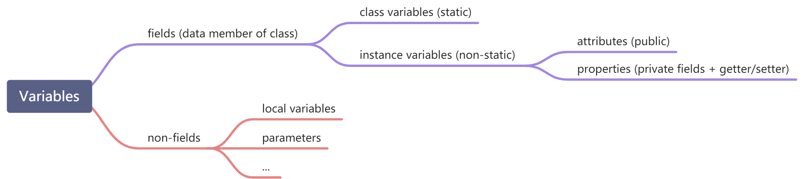

#### 类和对象的具体使用步骤

1. 定义类,类定义的格式如下：

   ```java
   [修饰符] class 类名{
   	属性声明;
   	方法声明;
   }
   ```

   举例：

   ```java
   public class Person{
   	//声明属性age
   	int age;
   	//声明方法showAge()
   	public void eat() {
   		System.out.println("人吃饭");
   	}
   }
   ```

2. 创建类的对象,格式如下：

   ```java
   类名 对象名 = new 类名();
   ```

   举例：

   ```java
   Person per = new person();
   ```

3. 调用某一具体对象的属性和方法

   ```java
   使用" 对象名.属性 " 或 " 对象名.方法 "的方式访问对象成员（包括属性和方法）
   ```

   举例：

   ```java
   //声明Animal类
   public class Animal { //动物类
   	public int legs;
   	public void eat() {
   	System.out.println("Eating.");
   	}
   	public void move() {
   		System.out.println("Move.");
   	}
   }
   ```

   ```java
   //声明测试类
   public class AnimalTest {
   	public static void main(String args[]) {
   	//创建对象
   	Animal xb = new Animal();
   	xb.legs = 4;//访问属性
   	System.out.println(xb.legs);
   	xb.eat();//访问方法
   	xb.move();//访问方法
   	}
   }
   ```


#### 匿名对象

如果一个对象只需要进行一次方法调用，那么就可以使用匿名对象。

```java
new Person().shout();   // new Person() 返回的是一个对象。
```


#### 类的对象的内存解析

[74-面向对象(基础)-类的实例化与对象的内存解析_哔哩哔哩_bilibili](https://www.bilibili.com/video/BV1PY411e7J6?p=74&vd_source=5a374f315281b0338a0b7fd69b8b8e98)

#### 类的成员之一：成员变量

语法格式：

```java
[修饰符] class 类名{
	[修饰符] 数据类型 成员变量名 [= 初始化值];
}
```

说明：

- 位置要求：必须在类中，方法外

- 修饰符(暂不考虑)
  常用的权限修饰符有：private、缺省、protected、public
  其他修饰符：static、final
- 初始化值
  根据情况，可以显式赋值；也可以不赋值，使用默认值


#### 成员变量 vs 局部变量

1、变量的分类：成员变量与局部变量
在方法体外，类体内声明的变量称为成员变量。
在方法体内部等位置声明的变量称为局部变量。


> 由static修饰的成员变量又被称为静态变量，类变量。这里先只学习非static修饰的成员变量，又被称为实例变量。


**根据内存解析可知，局部变量在栈，成员变量在堆**


**当一个对象被创建时，会对其中各种类型的成员变量自动进行初始化赋值。**

#### 类的成员之二：方法(method)

**Java里的方法 不能独立存在 ，所有的方法必须定义在类里。**

方法的定义格式：

```java
[修饰符] 返回值类型 方法名([形参列表])[throws 异常列表]{
	//方法体;
}
```

- 修饰符：可选的。方法的修饰符也有很多，例如：public、protected、private、static、abstract、native、final、synchronized等，后面会一一学习。
  其中，权限修饰符有public、protected、private。在讲封装性之前，我们先默认使用pulbic修
  饰方法。
  其中，根据是否有static，可以将方法分为静态方法和非静态方法。其中静态方法又称为类方
  法，非静态方法又称为实例方法。咱们在讲static前先学习实例方法。

- throws 异常列表：可选，在【第09章-异常处理】章节再讲

方法的调用格式：

```java
对象.方法名([实参列表]);
```

#### 方法调用内存解析


#### 对象数组


#### 方法的重载

- 方法重载：在同一个类中，允许存在一个以上的同名方法，只要它们的参数列表不同即可。参数列表不同，意味着参数个数或参数类型的不同
- 重载的特点：与修饰符、返回值类型无关，**只看参数列表**，且参数列表必须不同。(参数个数或参数类型)。调用时，根据方法参数列表的不同来区别。
- 重载方法调用：JVM通过方法的参数列表，调用匹配的方法。
  先找个数、类型最匹配的，
  再找个数和类型可以兼容的，如果同时多个方法可以兼容将会报错


#### 可变个数的形参

**使用背景**

在调用方法的时候可能会需要方法的形参的类型是确定的，而参数的个数是不确定的，此时我们就可以使用可变个数的形参的机制来实现。

格式如下：

```java
void foo(String... args);
void foo(String[] args);
```

两种格式的作用是一样的。如果一个方法同时写了这两种格式不会被认为是重载，会出现编译错误。

注意：

- 可变参数只能作为函数的最后一个参数

- 由于可变参数必须是最后一个参数，所以一个函数最多只能有一个可变参数

- 在调用的时候，可以传递0、1、多个参数，当传递多个参数的时候，args在方法中是数组名。

- 两种调用方法：

  ```java
  public void foo(String...varargs){}
  
  foo("arg1", "arg2", "arg3");
  
  //上述过程和下面的调用是等价的
  foo(new String[]{"arg1", "arg2", "arg3"});
  ```

- ## 方法重载

  ### 优先匹配固定参数

  调用一个被重载的方法时，如果此调用既能够和固定参数的重载方法匹配，也能够与可变长参数的重载方法匹配，则选择固定参数的方法:

  ```java
  public class Varargs {
  
      public static void test(String... args) {
          System.out.println("version 1");
      }
  
      public static void test(String arg1, String arg2) {
          System.out.println("version 2");
      }
      public static void main(String[] args) {
          test("a","b");//version 2 优先匹配固定参数的重载方法
                  test();//version 1
      }
  }
  ```

  ### 匹配多个可变参数

  调用一个被重载的方法时，如果此调用能够和**两个可变长参数**的重载方法匹配，则编译出错:

  ```java
  public class Varargs {
  
      public static void test(String... args) {
          System.out.println("version 1");
      }
  
      public static void test(String arg1, String... arg2) { //和上一个区别在于该方法是可变参数
          System.out.println("version 2");
      }
      public static void main(String[] args) {
          test("a","b");//Compile error
      }
  }
  ```


### 封装

> 合理隐藏，合理暴露

#### 简介

在面向对象程式设计方法中，封装（英语：Encapsulation）是指一种将抽象性函式接口的实现细节部分包装、隐藏起来的方法。

封装可以被认为是一个保护屏障，防止该类的代码和数据被外部类定义的代码随机访问。

要访问该类的代码和数据，必须通过严格的接口控制。

封装最主要的功能在于我们能修改自己的实现代码，而不用修改那些调用我们代码的程序片段。

适当的封装可以让程式码更容易理解与维护，也加强了程式码的安全性。

封装的优点

- 1. 良好的封装能够减少耦合。
- 2. 类内部的结构可以自由修改。
- 3. 可以对成员变量进行更精确的控制。
- 4. 隐藏信息，实现细节。

> 随着我们系统越来越复杂，类会越来越多，那么类之间的访问边界必须把握好，面向对象的开发原则要
> 遵循“ 高内聚、低耦合 ”。
> 高内聚、低耦合是软件工程中的概念，也是UNIX 操作系统设计的经典原则。
> 内聚，指一个模块内各个元素彼此结合的紧密程度；耦合指一个软件结构内不同模块之间互连程度
> 的度量。内聚意味着重用和独立，耦合意味着多米诺效应牵一发动全身。

#### java如何实现封装性

实现封装就是控制类或成员的可见性范围。这就需要依赖访问控制修饰符，也称为权限修饰符来控制。

访问控制修饰符：

Java中，可以使用访问控制符来保护对类、变量、方法和构造方法的访问。Java 支持 4 种不同的访问权限。

- (不使用任何修饰符）: 在同一包内可见，称为Package private（包私有）。使用对象：类、接口、变量、方法。

  例如，称不使用任何修饰符的构造器为：Package private constructor.

- **private** : 在同一类内可见。使用对象：变量、方法。 **注意：不能修饰类（外部类）**

- **public** : 对所有包里的所有类可见。使用对象：类、接口、变量、方法

- **protected** : 对同一包内的类和所有子类可见。使用对象：变量、方法。 **注意：不能修饰类（外部类）**
  
  - 父类的 protected 成员是包内可见的，并且对子类可见；
  - 若子类与父类不在同一包中，只有子类内可见。


总结：

接口和外部类是同一层次的，权限修饰符有两个：public和缺省。

public表明该接口或外部类在本包中可见，在导入到其他包里依旧可见。

缺省表明该接口或外部类在本包中可见，在导入到其他包里不可见。


对于类或接口来说，可见性意味着 类或接口可以声明。

举个例子：public类在本包中可见，即在本包中的任何一个类中都可被声明，然后初始化。当import到其他包中，也可以在其他包中的任何一个类中被声明。而缺省类在本包中可见，即在本包中的任何一个类中都可被声明，当import到其他包中，声明该类会编译不通过。


| 修饰符    | 本类内 | 本包内 | 其他包子类内 | 其他包非子类内 |
| --------- | ------ | ------ | ------------ | -------------- |
| private   | √      | ×      | ×            | ×              |
| 缺省      | √      | √      | ×            | ×              |
| protected | √      | √      | √            | ×              |
| public    | √      | √      | √            | √              |


类的成员的权限修饰符：缺省、public、private、protected

类的成员有：成员变量、成员方法、代码块、内部类、构造器。

以下内容均建立在类的权限修饰符为public的情况下：


在本类内可见，说明在本类里可以直接使用该成员，也就是省略掉this指针的调用。也可以在该类中定义一个该类的对象，通过该类的对象调用该成员。

在本包内可见，说明在本包中的其他类中定义一个该类的对象，可以通过该类的对象调用该成员。

在其他包的非子类内可见，说明当把该类导入到其他包里之后，那么其他包里的非子类中定义一个该类对象，可以通过该类对象调用该成员。

在其他包的子类内可见，说明当把该类导入到其他包里之后，那么其他包的子类中可以直接使用该成员。当然也可以定义该子类对象，然后用该对象直接调用该成员。


举个例子：我们看看protected成员。

首先，protected成员在本类内可以直接使用，在本包的其他类内也可以通过本类对象直接调用。在其他包的类中，不能通过本类对象直接调用。在其他包的类中可以直接使用。


实现Java封装的步骤

1. 修改属性的可见性来限制对属性的访问（一般限制为private），例如：

```java
public class Person {
    private String name;
    private int age;
}
```

这段代码中，将 **name** 和 **age** 属性设置为私有的，只能本类才能访问，其他类都访问不了，如此就对信息进行了隐藏。

 对每个值属性提供对外的公共方法访问，也就是创建一对赋取值方法，用于对私有属性的访问，

```java
public class Person{
    private String name;
    private int age;

    public int getAge(){
      return age;
    }

    public String getName(){
      return name;
    }

    public void setAge(int age){
      this.age = age;
    }

    public void setName(String name){
      this.name = name;
    }
}
```


### 构造器

构造器就是c++中的构造函数


构造器的作用：

**在创建类的对象的时候会自动调用该类的构造器,完成对类的对象的初始化。**

```java
[修饰符] class 类名{
	[修饰符] 构造器名(参数列表){
	// 实例初始化代码
	}
}
```

说明：

1. 构造器名必须与它所在的类名必须相同。
2. 它没有返回值，所以不需要返回值类型，也不需要void。
3. 构造器的修饰符只能是权限修饰符，不能被其他任何修饰。比如，不能被static、final、
synchronized、abstract、native修饰，不能有return语句返回值。

使用说明：

1. 当我们没有显式的声明类中的构造器时，系统会默认提供一个无参的构造器并且该构造器的修饰
符默认与类的修饰符相同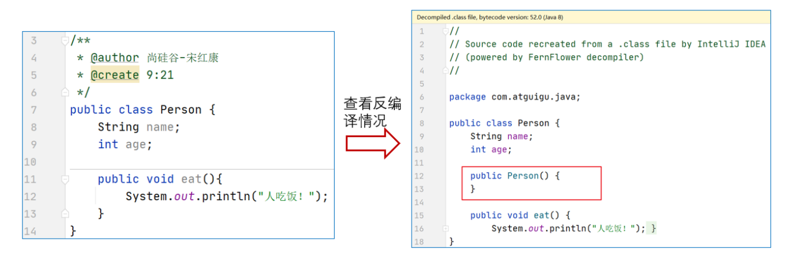
2. 当我们显式的定义类的构造器以后，系统就不再提供默认的无参的构造器了。
3. 在类中，至少会存在一个构造器。
4. 构造器是可以重载的。

### this

采用 **this** 关键字是为了解决实例变量（private String name）和局部变量（setName(String name)中的name变量）之间发生的同名的冲突。

**在实例方法或构造器中，如果使用当前类的成员变量或成员方法可以在其前面添加this，增强程序的可读性。不过，通常我们都习惯省略this。**

但是，当形参与成员变量同名时，如果在方法内或构造器内需要使用成员变量，必须添加this来表明该变量是类的成员变量。即：我们可以用this来区分`成员变量`和`局部变量`。比如：

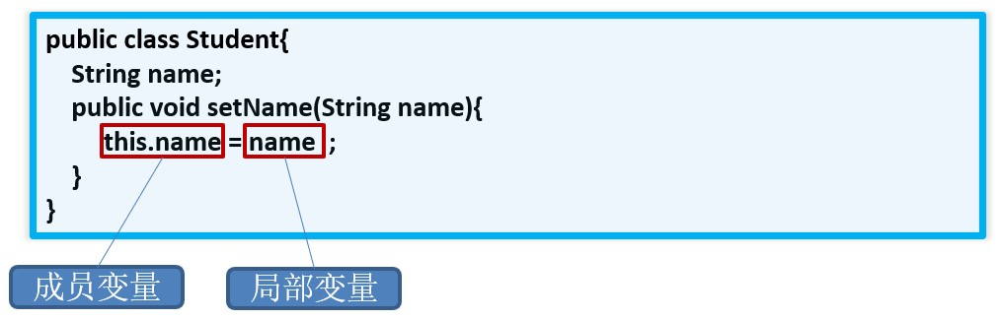

> this关键字：它指的是**该类的当前对象的地址**。

this在构造器中的特殊用法：

this( ) 用来访问本类的构造方法，下面定义一个 Student 类，使用 this( ) 调用构造方法给 name 赋值：

```java
public class Student {
    String name;
    // 无参构造方法（没有参数的构造方法）
    public Student() {
        this("张三");    //
    }
    // 有参构造方法
    public Student(String name) {
        this.name = name;
    }
    // 输出name和age
    public void print() {
        System.out.println("姓名：" + name);
    }
    public static void main(String[] args) {
        Student stu = new Student();
        stu.print();       //张三
    }
}
```

注意：

- this( ) 不能在普通方法中使用，只能写在构造方法中。
- 在构造方法中使用时，必须是第一条语句。


### JavaBean实体类

[05、面向对象基础：封装，实体JavaBean_哔哩哔哩_bilibili](https://www.bilibili.com/video/BV1Cv411372m?p=73&vd_source=5a374f315281b0338a0b7fd69b8b8e98)


### 继承

继承就是子类继承父类的特征和行为

```java
class 父类 {
}
 
class 子类 extends 父类 {
}
```

为什么要继承？

继承可以减少代码的复用，有利于功能的扩展，继承是多态的前提，没有继承就没有多态。

需要注意的是 `Java类`不支持多继承，但支持多重继承。

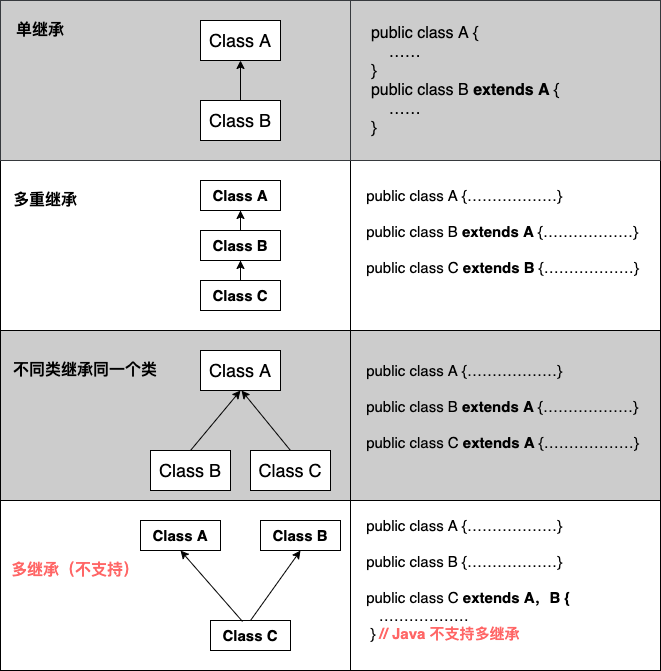

- 子类继承父类所有的属性、方法。---本质上都是父类的。可以从this、super知晓。
- 子类可以拥有自己的属性和方法，即子类可以对父类进行扩展。
- 父类的构造方法不能继承，需要子类实现自己的构造方法。在**实现**子类的构造方法时，必须先调用父类的构造方法
- Java 的继承是单继承，但是可以多重继承，单继承就是一个子类只能继承一个父类，多重继承就是，例如 B 类继承 A 类，C 类继承 B 类，所以按照关系就是 B 类是 C 类的父类，A 类是 B 类的父类，这是 Java 继承区别于 C++ 继承的一个特性。
- 提高了类之间的耦合性（继承的缺点，耦合度高就会造成代码之间的联系越紧密，代码独立性越差）。


#### 重写&重载

重写是子类对父类的允许访问的方法的实现过程进行重新编写, 返回值和形参都不能改变。**即外壳不变，核心重写！**

```java
class Animal{
   public void move(){
      System.out.println("动物可以移动");
   }
}
 
class Dog extends Animal{
   public void move(){
      System.out.println("狗可以跑和走");
   }
}
 
public class TestDog{
   public static void main(String args[]){
      Animal a = new Animal(); // Animal 对象
      Animal b = new Dog(); // Dog 对象
 
      a.move();// 执行 Animal 类的方法
 
      b.move();//执行 Dog 类的方法
   }
}
```

**方法的重写规则**

- 父类的成员方法只能被它的子类重写。

- 父类被重写的方法名和参数列表必须与子类要重写的方法名和参数列表相同。

- **子类重写的方法的权限修饰符大于等于父类被重写方法的权限修饰符**

- 关于返回值类型：

  父类要被重写的方法分返回值如果是void，子类重写方法的返回值也必须是void

  父类要被重写的方法分返回值如果是基本数据类型，那么父类方法返回值是啥，子类方法返回值就是啥。

  父类要被重写的方法分返回值如果是引用数据类型，那么父类方法返回值是啥，子类方法返回值就是啥或者是它的子类。

- **如果父类要被重写的方法抛出了异常，那么子类重写方法也要抛出相同的异常或其子类异常。**如果父类要被重写的方法没有抛出异常，子类重写方法也不能抛异常。

- 声明为 final 的方法不能被重写。

- 声明为 static 的方法不能被重写，因为static方法是属于类的。但是可以在子类中定义一个同名的static方法，这个方法是属于子类的。

- 构造方法不能被重写。


**重载(overloading)** 是在一个类里面，方法名字相同，而参数不同。返回类型可以相同也可以不同。

每个重载的方法（或者构造函数）都必须有一个独一无二的参数类型列表。

最常用的地方就是构造器的重载。

**重载规则:**

- 被重载的方法必须改变参数列表(参数个数或类型不一样)；
- 被重载的方法可以改变返回类型；
- 被重载的方法可以改变访问修饰符；
- 被重载的方法可以声明新的或更广的检查异常；
- 方法能够在同一个类中或者在一个子类中被重载。
- 无法以返回值类型作为重载函数的区分标准。

方法重写举例

比如新的手机增加来电显示头像的功能，代码如下：

```java
package com.atguigu.inherited.method;

public class Phone {
    public void sendMessage(){
        System.out.println("发短信");
    }
    public void call(){
        System.out.println("打电话");
    }
    public void showNum(){
        System.out.println("来电显示号码");
    }
}
```

```java
package com.atguigu.inherited.method;

//SmartPhone：智能手机
public class SmartPhone extends Phone{
    //重写父类的来电显示功能的方法
	@Override
    public void showNum(){
        //来电显示姓名和图片功能
        System.out.println("显示来电姓名");
        System.out.println("显示头像");
    }
    //重写父类的通话功能的方法
    @Override
    public void call() {
        System.out.println("语音通话 或 视频通话");
    }
}
```

```java
package com.atguigu.inherited.method;

public class TestOverride {
    public static void main(String[] args) {
        // 创建子类对象
        SmartPhone sp = new SmartPhone();

        // 调用父类继承而来的方法
        sp.call();

        // 调用子类重写的方法
        sp.showNum();
    }
}
```

> @Override使用说明：
>
> 写在方法上面，用来检测是不是满足重写方法的要求。这个注解就算不写，只要满足要求，也是正确的方法覆盖重写。建议保留，这样编译器可以帮助我们检查格式，另外也可以让阅读源代码的程序员清晰的知道这是一个重写的方法。


#### 再谈封装性

| 修饰符    | 本类内 | 本包内 | 其他包子类内 | 其他包非子类内 |
| --------- | ------ | ------ | ------------ | -------------- |
| private   | √      | ×      | ×            | ×              |
| 缺省      | √      | √      | ×            | ×              |
| protected | √      | √      | √            | ×              |
| public    | √      | √      | √            | √              |


总结：

外部类和接口的权限修饰符：public和缺省

public：本包内可见，导入到其他包内后包内可见。

缺省：本包内可见，导入到其他包内不可见。

内部成员：

public：本包内可见，导入到其他包内后包内可见。

缺省：本包内可见，导入到其他包内不可见。

private：本类内可见

protected：本包内可见，导入到其他包内只有子类内可见。


#### super

思考两个问题：

1. 如果子类重写了父类的一个方法，还能不能再调用父类被重写前的方法？

可以，在子类中使用`super.方法名`即可

```java
// Father.java
public class Father {
    void show(){
        System.out.print("I am Father.");
    }
}
```

```java
// son.java
public class Son extends Father{
    @Override
    void show(){
        System.out.print("I am son.");
    }
    void showFather(){
        super.show();          //调用父类被重写前的方法
    }
}
```

```java
// Main.java
public class Main {
    public static void main(String[] args){
        Son s = new Son();
        Son.show();            // I am son.
        Son.showFather();      //  I am Father.
    }
}
```

**方法继承给子类了，子类重写方法之后不影响父类的方法。因此可以使用super调用父类的方法**

总结：

- **方法前面没有super.和this.**
  - 先从子类找匹配方法，如果没有，再从直接父类找，再没有，继续往上                                              
- **方法前面有this.**
  - 先从子类找匹配方法，如果没有，再从直接父类找，再没有，继续往上追溯
- **方法前面有super.**
  - 从当前子类的直接父类找，如果没有，继续往上追溯

2. 父类中有一变量名，继承给子类之后，如果子类又新定义了一个同名的变量，会怎么样？

答：子类中会有两个同名变量。

```java
// Father.java
public class Father {
    int i = 0;
}
```

```java
// son.java
public class son extends Father{
    int i = 1;
    void showFatheri(){
        System.out.print("Father's i = "+super.i); //调用父类的属性i
    }
}
```

```java
// Main.java
public class Main {
    public static void main(String[] args) {
        son s = new son();
        System.out.print(s.i);  // 1
        s.showFatherI();        // Father's i = 0
    }
}
```

总结：起点不同（就近原则）

- **变量前面没有super.和this.**
  - 在构造器、代码块、方法中如果出现使用某个变量，先查看是否是当前块声明的`局部变量`，
  - 如果不是局部变量，先从当前执行代码的`本类去找成员变量`
  - 如果从当前执行代码的本类中没有找到，会往上找`父类声明的成员变量`（权限修饰符允许在子类中访问的）
- **变量前面有this.** 
  - 通过this找成员变量时，先从当前执行代码的==本类去找成员变量==
  - 如果从当前执行代码的本类中没有找到，会往上找==父类声明的成员变量（==权限修饰符允许在子类中访问的）
- **变量前面super.** 
  - 通过super找成员变量，直接从当前执行代码的直接父类去找成员变量（权限修饰符允许在子类中访问的）
  - 如果直接父类没有，就去父类的父类中找（权限修饰符允许在子类中访问的）

**<font color='red'>特别说明：应该避免子类声明和父类重名的成员变量</font>**

在阿里的开发规范等文档中都做出明确说明：

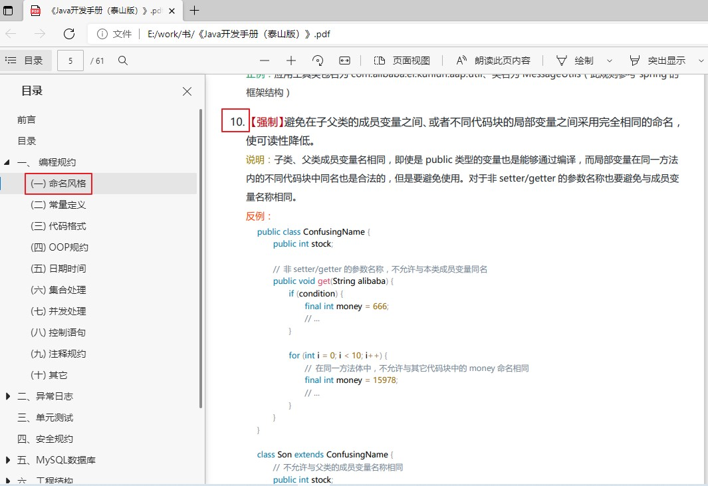

总结：

super的作用：

- super可用于访问父类中定义的属性
- super可用于调用父类中定义的成员方法
- super可用于在子类构造器中调用父类的构造器


接下来，我们学习super的第三个用途：

**子类构造器中调用父类构造器**

① 子类继承父类时，不会继承父类的构造器。只能通过“super(形参列表)”的方式调用父类指定的构造器。

② 规定：“super(形参列表)”，必须声明在构造器的首行。

③ 我们前面讲过，在构造器的首行可以使用"this(形参列表)"，调用本类中重载的构造器，
     结合②，结论：在构造器的首行，"this(形参列表)" 和 "super(形参列表)"只能二选一。

④ 如果在子类构造器的首行既没有显示调用"this(形参列表)"，也没有显式调用"super(形参列表)"，
​     则子类此构造器默认调用"super()"，即调用父类中空参的构造器。

⑤ 由③和④得到结论：子类的任何一个构造器中，要么会调用本类中重载的构造器，要么会调用父类的构造器。
     只能是这两种情况之一。

⑥一个类中声明的所有构造器中至少有一个构造器调用父类的构造器。

> 开发中常见错误：
>
> 如果子类构造器中既未显式调用父类或本类的构造器，且父类中又没有空参的构造器，则`编译出错`。

注意：

- super的追溯不仅限于直接父类
- super和this的用法相像，this代表本类对象的引用，super代表父类的内存空间的标识

#### 子类对象实例化过程

当你调用构造器创建(new)一个对象时，Java虚拟机会为对象分配内存空间并加载该类的字节码文件到内存中，其中包括类的变量和方法的定义。

类的加载是动态的，即当需要使用某个类时才会进行加载。

在创建子类对象时，Java虚拟机会首先看构造器的第一条语句是调用了父类构造器还是当前类构造器，如果是当前类构造器则调用该构造器。如果是父类构造器，则看父类构造器是否加载，如果没有加载到内存，则将父类加载到内存再调用该构造器。

父类的构造器会被执行。在执行父类构造器之前，确实会加载父类的字节码文件到内存中，以便执行父类的构造过程。

[98-面向对象(进阶)-子类对象实例化的全过程_哔哩哔哩_bilibili](https://www.bilibili.com/video/BV1PY411e7J6?p=98&vd_source=5a374f315281b0338a0b7fd69b8b8e98)


```java
public class P {
    public static int abc = 123;
    static{
        System.out.println("P is init");
    }
}
public class S extends P {
    static{
        System.out.println("S is init");
    }
}
public class Test {
    public static void main(String[] args) {
        System.out.println(S.abc);
    }
}
----------------

P is init
123    
```

**这种情况，没有加载子类。**


### 多态

多态是同一个行为具有多个不同表现形式或形态的能力。

多态就是同一个接口，使用不同的实例而执行不同操作

多态存在的三个必要条件

- 继承

- 重写

- 父类引用指向子类对象：**Parent p = new Child();**

  > new Child()返回一个Child类的对象，然后将该子类对象赋值给父类变量。

#### 举例

```java
package com.atguigu.polymorphism.grammar;

public class Pet {
    private String nickname; //昵称

    public String getNickname() {
        return nickname;
    }

    public void setNickname(String nickname) {
        this.nickname = nickname;
    }

    public void eat(){
        System.out.println(nickname + "吃东西");
    }
}
```

```java
package com.atguigu.polymorphism.grammar;

public class Cat extends Pet {
    //子类重写父类的方法
    @Override
    public void eat() {
        System.out.println("猫咪" + getNickname() + "吃鱼仔");
    }

    //子类扩展的方法
    public void catchMouse() {
        System.out.println("抓老鼠");
    }
}
```

```java
package com.atguigu.polymorphism.grammar;

public class Dog extends Pet {
    //子类重写父类的方法
    @Override
    public void eat() {
        System.out.println("狗子" + getNickname() + "啃骨头");
    }

    //子类扩展的方法
    public void watchHouse() {
        System.out.println("看家");
    }
}
```

**1、方法内局部变量的赋值体现多态**

```java
package com.atguigu.polymorphism.grammar;

public class TestPet {
    public static void main(String[] args) {
        //多态引用
        Pet pet = new Dog();
        pet.setNickname("小白");
        
        //多态的表现形式
        /*
        编译时看父类：只能调用父类声明的方法，不能调用子类扩展的方法；
        运行时，看“子类”，如果子类重写了方法，一定是执行子类重写的方法体；
         */
        pet.eat();//运行时执行子类Dog重写的方法
//      pet.watchHouse();//不能调用Dog子类扩展的方法

        pet = new Cat();
        pet.setNickname("雪球");
        pet.eat();//运行时执行子类Cat重写的方法
    }
}
```

**2、方法的形参声明体现多态**

```java
package com.atguigu.polymorphism.grammar;

public class Person{
    private Pet pet;
    public void adopt(Pet pet) {//形参是父类类型，实参是子类对象
        this.pet = pet;
    }
    public void feed(){
        pet.eat();//pet实际引用的对象类型不同，执行的eat方法也不同
    }
}
```

```java
package com.atguigu.polymorphism.grammar;

public class TestPerson {
    public static void main(String[] args) {
        Person person = new Person();

        Dog dog = new Dog();
        dog.setNickname("小白");
        person.adopt(dog);//实参是dog子类对象，形参是父类Pet类型
        person.feed();

        Cat cat = new Cat();
        cat.setNickname("雪球");
        person.adopt(cat);//实参是cat子类对象，形参是父类Pet类型
        person.feed();
    }
}
```

**3、方法返回值类型体现多态**

```java
package com.atguigu.polymorphism.grammar;

public class PetShop {
    //返回值类型是父类类型，实际返回的是子类对象
    public Pet sale(String type){
        switch (type){
            case "Dog":
                return new Dog();
            case "Cat":
                return new Cat();
        }
        return null;
    }
}
```

```java
package com.atguigu.polymorphism.grammar;

public class TestPetShop {
    public static void main(String[] args) {
        PetShop shop = new PetShop();

        Pet dog = shop.sale("Dog");
        dog.setNickname("小白");
        dog.eat();

        Pet cat = shop.sale("Cat");
        cat.setNickname("雪球");
        cat.eat();
    }
}
```


#### instanceof 运算符

当对象是右边类或子类的对象时，返回true；否则，返回false。

```java
String name = "James";
boolean result = name instanceof String; // 由于 name 是 String 类型，所以返回true
```


```java
class Vehicle {}
 
public class Car extends Vehicle {
   public static void main(String[] args){
      Vehicle a = new Car();
      boolean result =  a instanceof Car; // 由于 a 是 Car类的子类的对象，所以返回true
      System.out.println(result);    // true
   }
}
```


#### 虚方法调用(Virtual Method Invocation)

Person类中定义了welcome()方法，各个子类重写了welcome()。在多态的情况下，调用对象的welcome()方法，实际执行的是子类重写的方法。


#### 实例属性没有多态

父类中有一个变量名，子类中有一个同名的变量名，不会覆盖。

编译时看左边，左边是父类对象，因此父类对象只能调用父类的属性，不能调用子类属性。

```java
public class TestVariable {
    public static void main(String[] args) {
        Base b = new Sub();
        System.out.println(b.a);             // 1
        System.out.println(((Sub)b).a);      // 2

        Sub s = new Sub();
        System.out.println(s.a);             // 2
        System.out.println(((Base)s).a);     // 1
    }
}
class Base{
    int a = 1;
}
class Sub extends Base{
    int a = 2;
}
```


#### 类型转换

使用父类变量接收了子类对象之后，我们就`不能调用`子类拥有，而父类没有的方法了。这也是多态给我们带来的一点"小麻烦"。所以，想要调用子类特有的方法，必须做类型转换

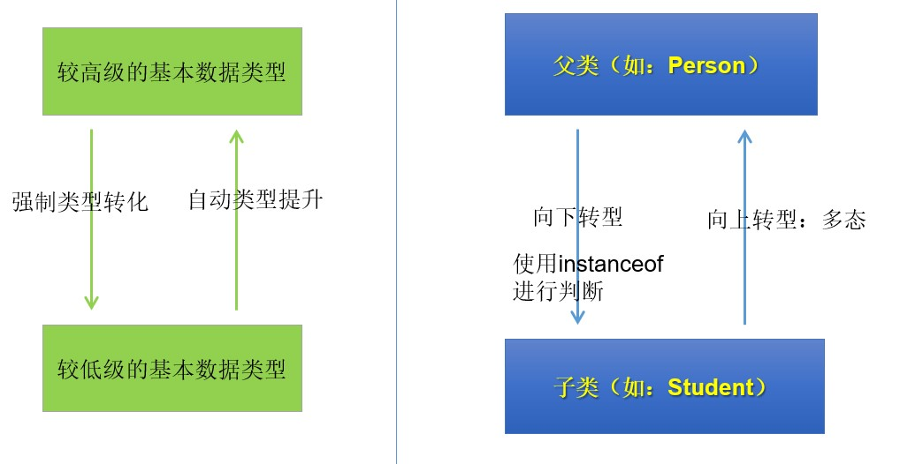


```java
package com.atguigu.polymorphism.grammar;

public class ClassCastTest {
    public static void main(String[] args) {
        //没有类型转换
        Dog dog = new Dog();

        Pet pet = new Dog();//向上转型
        pet.setNickname("小白");
        pet.eat();//可以调用父类Pet有声明的方法eat，但执行的是子类重写的eat方法体
//        pet.watchHouse();//不能调用父类没有的方法watchHouse

        Dog d = (Dog) pet;  //向下转型
        System.out.println("d.nickname = " + d.getNickname());
        d.eat();//可以调用eat方法
        d.watchHouse();//可以调用子类扩展的方法watchHouse

        Cat c = (Cat) pet;//编译通过，因为从语法检查来说，pet的编译时类型是Pet，Cat是Pet的子类，所以向下转型语法正确
        //但是这句代码运行报错ClassCastException，因为pet变量存储的对象是Dog，Dog和Cat之间是没有继承关系的
    }
}
```


### Object 类的使用

类 `java.lang.Object`是类层次结构的根类，即所有其它类的父类。

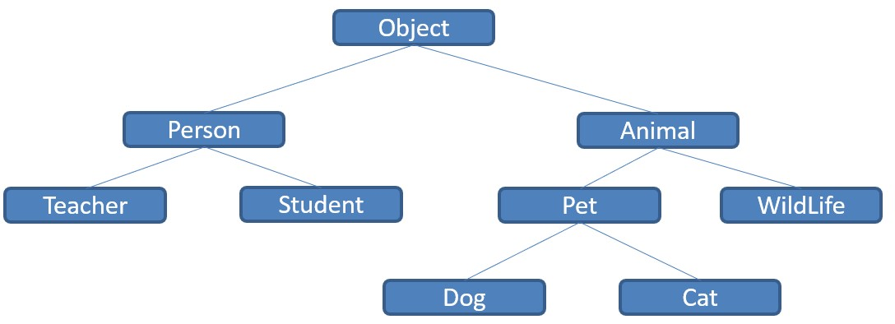


如果一个类没有特别指定父类，那么默认则继承自Object类。

```java
public class Person {
	...
}
//等价于：
public class Person extends Object {
	...
}
```

如果形参类型或返回值类型是Object类，那么任意类的对象都可以作为实参或者返回值。（多态！）

```java
method(Object obj){…} //可以接收任何类作为其参数

Person o = new Person();  
method(o);

```

#### Object类的方法

根据JDK源代码及Object类的API文档，Object类当中包含的方法有11个。这里我们主要关注其中的6个：

##### 1、(重点)equals()

**= =：** 

- 基本类型比较值:只要两个变量的值相等，即为true。

  ```java
  int a=5; 
  if(a==6){…}
  ```

- 引用类型比较引用(是否指向同一个对象)：只有指向同一个对象时，==才返回true。

  ```java
  Person p1=new Person();  	    
  Person p2=new Person();
  if (p1==p2){…}
  ```

**equals()：**所有类都继承了Object，也就获得了equals()方法。还可以重写。

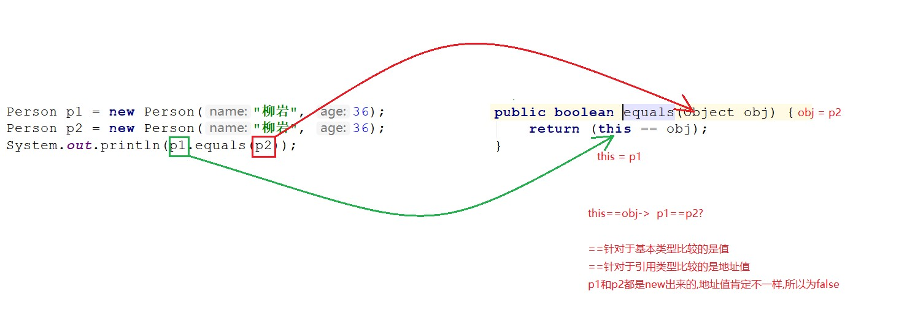

特例：当用equals()方法进行比较时，对类File、String、Date及包装类（Wrapper Class）来说，是比较类型及内容而不考虑引用的是否是同一个对象；

- 原因：在这些类中重写了Object类的equals()方法。

有兴趣可以看看源码


##### 2、(重点)toString()

object类中的toString方法

```java
public String toString() {
    return getClass().getName() + "@" + Integer.toHexString(hashCode());
}
```

可以看到该方法不接受任何参数。

```java
public class Main {
    public static void main(String[] args) {
        Base b = new Base();
        //实际上，如果我们直接System.out.println(对象)，默认会自动调用这个对象的toString()；👇
        System.out.println(b.toString());  // 输出： Base@1b6d3586
        System.out.println(b);        // 输出： Base@1b6d3586
    }
}
class Base{}
```

返回值是 `类名@16进制地址值`


在String、File、Date或包装类中对toString()方法进行了重写，此时返回值是对象的具体内容。

```java
public class Main {
    public static void main(String[] args) {
        String s = "hello";
        System.out.println(s.toString());   // 输出： hello
    }
}
```


在实际开发中，我们更希望输出对象的某些内容，因此要在子类中重写toString()方法


##### 3、clone()

clone()方法是创建一个一模一样的对象，即深拷贝。

```java
// 下面是Object类中定义的clone()方法
protected native Object clone() throws CloneNotSupportedException;
```

可以看到该方法被protected修饰，
protected修饰的类成员可以在本类中直接使用，可以在本包中的其他类中通过该类对象直接调用，不可以在其他包里的类内通过该类对象直接调用，可以在其他包里的子类内直接使用。

```java
public class Main {
    public static void main(String[] args) {
        Object o = new Object();
        Object o1 = o.clone();   // 编译不通过。
        // 原因是Object类在java.lang包内，该Main不在java.lang包内，因此被protected修饰的clone()方法不能在其他包里的类内通过该对象直接调用。因此编译不通过。
    }
}
```

正确使用clone()的方法：

比如，我们要实现Person类对象的深拷贝：

1. 让Person类实现Cloneable接口，该接口内没有任何成员，即是个空接口。为什么要这样做呢？相当于一个声明，声明该类可以进行深拷贝。没有该声明就算重写了clone()方法也不能用。
2. 重写clone()方法，记得抛异常。因受protected的限制，这里重写该方法实际上还是调用父类的clone()方法。相当于一个媒介。

```java
public class Person implements Cloneable{
    @Override
    protected Object clone() throws CloneNotSupportedException {
        return super.clone();
    }
}
```

```java
public class Main {
    public static void main(String[] args) throws CloneNotSupportedException {// 这里记得抛异常
        Person p = new Person();
        Person p1 =  (Person) p.clone();
        System.out.println(p == p1);     // false
    }
}
```


#### native关键字


### Objects类的使用

[07、常用API（一）：Objects类、包装类_哔哩哔哩_bilibili](https://www.bilibili.com/video/BV1Cv411372m?p=117&vd_source=5a374f315281b0338a0b7fd69b8b8e98)


### static

**如果想让一个成员变量被类的所有实例所共享，就用static修饰即可，称为类变量（或类属性）！**

**在类中声明的实例方法，在类的外面必须要先创建对象，才能调用。但是有些方法的调用者和当前类的对象无关，这样的方法通常被声明为`类方法`，由于不需要创建对象就可以调用类方法**

类变量、类方法，也称为静态变量、静态方法。

- 使用范围：
  - 在Java类中，可用static修饰**属性、方法、代码块、内部类**
- 被修饰后的成员具备以下特点：
  - 随着类的加载而加载
  - 优先于对象存在
  - 修饰的成员，被所有对象所共享
  - 访问权限允许时，可不创建对象，直接被类调用

#### 静态变量

语法格式

```java
[修饰符] class 类{
	[修饰符] static 数据类型 变量名;
}
```

静态变量的特点

- 静态变量的默认值规则和实例变量一样。
- 静态变量在内存空间只有一份，为所有对象共享
- 静态变量在本类中，可以在任意方法、代码块、构造器中直接使用。
- 如果权限修饰符允许，在其他类中可以通过“`类名.静态变量`”直接访问，也可以通过“`对象.静态变量`”的方式访问（但是更推荐使用类名.静态变量的方式）。
- 静态变量的get/set方法也静态的，当局部变量与静态变量`重名时`，使用“`类名.静态变量`”进行区分。

#### 静态方法

语法格式

```java
[修饰符] class 类{
	[修饰符] static 返回值类型 方法名(形参列表){
        方法体
    }
}
```

静态方法的特点

- 静态方法在本类的任意方法、代码块、构造器中都可以直接被调用。
- 只要权限修饰符允许，静态方法在其他类中可以通过“类名.静态方法“的方式调用。也可以通过”对象.静态方法“的方式调用（但是更推荐使用类名.静态方法的方式）。
- 在static方法内部只能访问类的static修饰的属性或方法，不能访问类的非static的结构。
- 静态方法可以被子类继承，但不能被子类重写。
- 静态方法的调用都只看编译时类型。
- 因为不需要实例就可以访问static方法，因此static方法内部不能有this，也不能有super。如果有重名问题，使用“类名.”进行区别。


代码块和内部类还没学


#### 单例模式(Singleton)

**设计模式**是在大量的`实践中总结`和`理论化`之后优选的代码结构、编程风格、以及解决问题的思考方式。设计模式免去我们自己再思考和摸索,经典的设计模式共有23种。每个设计模式均是特定环境下特定问题的处理方法。


所谓类的单例设计模式，就是采取一定的方法保证对某个类**只存在一个对象实例**，并且该类只提供一个取得该对象实例的方法。

实现思路：

首先将`类的构造器的访问权限设置为private`，这样就不能用new操作符在类的外部产生类的对象了，这样就保证了不能随意创建类的对象了。但**在类内部仍可以产生该类的对象**(挺神奇的，说实话)。


单例模式的两种实现方式：

饿汉式

```java
class Singleton {
    // 1.私有化构造器
    private Singleton() {
    }

    // 2.内部提供一个当前类的实例
    private static Singleton single = new Singleton(); 
    //看成是该类的一个属性，类的成员属性一般用private修饰，不要看成执行语句
    //用static修饰是为了能被下面的static方法调用。
    
    // 3.提供公共的静态的方法，返回当前类的对象
    public static Singleton getInstance() {
        return single;
    }
    // 如果不用static方法的话，就必须用类的对象调用，但是我们已经封死了在类的外部创建类的对象的途径。因此     // 必须用static方法。
}
```

```java
// Main.java
public class Main{
    public static void main(String[] args){
        Singleton s = Singleton.getInstance(); //在类的外部获取类唯一的对象
    }
}
```


懒汉式

```java
class Singleton {
    // 1.私有化构造器
    private Singleton() {
    }
    // 2.内部提供一个当前类的实例
    private static Singleton single;
    // 3.提供公共的静态的方法，返回当前类的对象
    public static Singleton getInstance() {
        if(single == null) {
            single = new Singleton();
        }
        return single;
    }
}
```

饿汉式 vs 懒汉式

饿汉式：

- 特点：`立即加载`，即在使用类的时候已经将对象创建完毕。
- 优点：实现起来`简单`；没有多线程安全问题。
- 缺点：当类被加载的时候，会初始化static的实例，静态变量被创建并分配内存空间，从这以后，这个static的实例便一直占着这块内存，直到类被卸载时，静态变量被摧毁，并释放所占有的内存。因此在某些特定条件下会`耗费内存`。

懒汉式：

- 特点：`延迟加载`，即在调用静态方法时实例才被创建。
- 优点：实现起来比较简单；当类被加载的时候，static的实例未被创建并分配内存空间，当静态方法第一次被调用时，初始化实例变量，并分配内存，因此在某些特定条件下会`节约内存`。
- 缺点：在多线程环境中，这种实现方法是完全错误的，`线程不安全`，根本不能保证单例的唯一性。
  - 说明：在多线程章节，会将懒汉式改造成线程安全的模式。


### 代码块

格式：

```java
[修饰符] class 类{
	[static]{
        //代码块
    }
}
```

代码块是类的成员之一，代码块中的代码会随着类的加载而执行，意味着只能执行一次。代码块可以被static修饰。代码块的主要作用是进行初始化

静态代码块：

- 不可以调用非静态的属性和方法。
- 一个类若有多个静态的代码块，那么按照从上到下的顺序依次执行。


非静态代码块：

- 除了调用非静态的结构外，还可以调用静态的变量或方法。
- 每次创建对象的时候，都会执行一次。且先于构造器执行。

**非静态代码块的意义**

如果多个重载的构造器有公共代码，并且这些代码都是先于构造器内的其他代码执行的，那么可以将这部分代码抽取到非静态代码块中，减少冗余代码。


### 类中属性赋值的顺序

```java
public class Main {
    public static void main(String[] args) {
        Base b = new Base();
        Base c = new Base();
    }
}
class Base{
    {
        System.out.println("非静态代码块");
    }
    static {
        System.out.println("静态代码块");
    }
    Base(){
        System.out.println("构造器");
    }
}

---------------------------
静态代码块
非静态代码块
构造器
非静态代码块
构造器    
```


根据输出可知：

在第一次创建类的对象的时候会先加载类到内存中，此时执行静态代码块。

在创建对象的时候先执行非静态代码块，然后执行构造器。

在第二次创建类的对象的时候，由于第一次创建对象的时候已经加载了类，因此不会再次加载类，因此不会再执行静态代码块。


```java
public class Main {
    public static void main(String[] args) {
        Base b = new Base();
        Base c = new Base();
    }
}
class Base extends Father{
    {
        System.out.println("子类非静态代码块");
    }
    static {
        System.out.println("子类静态代码块");
    }
    Base(){
        System.out.println("子类构造器");
    }
}

class Father{
    {
        System.out.println("父类非静态代码块");
    }
    static{
        System.out.println("父类静态代码块");
    }
    Father(){
        System.out.println("父类构造器");
    }
}
-------------------
父类静态代码块                 
子类静态代码块
父类非静态代码块
父类构造器
子类非静态代码块
子类构造器
父类非静态代码块
父类构造器
子类非静态代码块
子类构造器    
```

在第一次创建对象的时候先看Base类是否加载内存，发现没有，因此执行Base类的构造器里隐式调用的父类构造器`"super();"`,在执行前看父类Father是否加载，发现没有，因此先将父类加载，此时执行Father类的静态代码块，然后再将子类加载到内存，此时执行Base类的静态代码块。然后开始创建对象，此时执行父类的非静态代码块和构造器。然后执行子类的非静态代码块和构造器，此时第一个对象创建完成。

在第二次创建对象的时候，由于此时已经将类加载到内存中了，就不再执行非静态代码块。在创建对象的时候先执行父类的非静态代码块和构造器，然后再执行子类的非静态代码块和构造器。

下面代码运行结果是？

```java
public class Test{
static{
   int x=5;
}
static int x,y;
public static void main(String args[]){
   x--;
   myMethod( );
   System.out.println(x+y+ ++x);
}
public static void myMethod( ){
  y=x++ + ++x;
 }
}
```

1. JVM加载class文件时，就会执行静态代码块，静态代码块中初始化了一个变量x并初始化为5，由于该变量是个局部变量，静态代码快执行完后变被释放。 

2. 申明了两个静态成员变量x，y，并没有赋初值，会有默认出值，int类型为0， 


### final

final 可以用来修饰变量（包括类属性、对象属性、局部变量和形参）、方法（包括类方法和对象方法）和类。

final 含义为 "最终的"。

使用 final 关键字声明类，就是把类定义定义为最终类，不能被继承，或者用于修饰方法，该方法不能被子类重写：

- 声明类：

  ```
  final class 类名 {//类体}
  ```

- 声明方法：

  ```
  修饰符(public/private/default/protected) final 返回值类型 方法名(){//方法体}
  ```

**注：** final 定义的类，其中的属性、方法不是 final 的。

final修饰某个变量（成员变量或局部变量），一旦赋值，它的值就不能被修改，即常量，常量名建议使用大写字母。


### abstract

#### 抽象类

在面向对象的概念中，所有的对象都是通过类来描绘的，但是并不是所有的类都是用来描绘对象的

**被abstract修饰的类称为抽象类。**   抽象类中不一定包含抽象方法，但包含抽象方法的类一定是抽象类   

**抽象类除了不能实例化对象之外，类的其它功能依然存在，成员变量、成员方法和构造方法的访问方式和普通类一样。**

**由于抽象类不能实例化对象，所以抽象类必须被继承，才能被使用。**也是因为这个原因，通常在设计阶段决定要不要设计抽象类。

总结：抽象类不能实例化对象，只能用于继承。

```java
[权限修饰符] abstract class 类名
{
    
}
```

抽象类属于类的一种，权限修饰符之前总结过了，因此抽象类的权限修饰符也只有两个：public或缺省。


#### 抽象方法

如果你想设计这样一个类，该类包含一个特别的成员方法，该方法的具体实现由它的子类确定，那么你可以在父类中声明该方法为抽象方法。

Abstract 关键字同样可以用来声明抽象方法，抽象方法只包含一个方法名，而没有方法体。

抽象方法没有定义，方法名后面直接跟一个分号，而不是花括号。

```java
public abstract class Employee
{   
    public abstract double computePay();
   //其余代码
}
```

声明抽象方法会造成以下两个结果：

- 如果一个类包含抽象方法，那么该类必须是抽象类。抽象类不强制要求包含抽象方法，但是不包含抽象方法的抽象类依旧不能创建实例。
- 任何子类必须重写父类的抽象方法，或者声明自身为抽象类。

继承抽象方法的子类必须重写该方法。否则，该子类也必须声明为抽象类。最终，必须有子类实现该抽象方法，否则，从最初的父类到最终的子类都不能用来实例化对象。


我们之前说，类的成员的权限修饰符有四种：缺省、public、private、protected。

抽象方法也是类的成员，但是抽象方法的权限修饰符只有三种：缺省、public、protected。

即没有private，因为抽象方法是必须被继承下去才能使用的，而private要求只能在本类中使用，因此abstract和private不能组合使用。


#### 模板方法设计模式


### 接口(interface)

#### 成员

接口就是规范，定义的是一组规则，体现了现实世界中“如果你是/要...则必须能...”的思想。继承是一个"是不是"的is-a关系，而接口实现则是 "能不能"的`has-a`关系。

接口的定义，它与定义类方式相似，但是使用 `interface` 关键字。它也会被编译成.class文件，但一定要明确它并不是类，而是另外一种引用数据类型。

> 引用数据类型：数组，类，枚举，接口，注解。


接口不能被实例化。

格式：

```java
[修饰符] interface 接口名{
    // 接口内容
}
```

接口内容：

如果是Java 7，接口中可以包含的内容：

1. 常量
2. 抽象方法

如果是Java 8，接口中额外包含的内容：

3. 默认方法
4. 静态方法

如果是Java 9，接口中额外包含的内容：

5. 私有方法


##### 抽象方法

接口中定义的抽象方法的修饰符必须是 `public abstract`

```java
public interface Abs{
    //修饰符可以选择性省略，但必须是 public abstract
    //下面四种形式都是抽象方法
    public abstract void method1();
    abstract void method1();
    public void method2();
    void method3();
}
```


##### 抽象方法的使用

接口不能直接使用，必须有 `类` 实现 `接口`

格式：

```java
[修饰符] class 类名 implements 接口名{ 
    
}
```

该类称为该接口的实现类，接口的实现类必须重写接口的所有抽象方法。 如果实现类没有重写接口的所有抽象方法，该实现类必须是抽象类。

然后创建类的对象，调用方法即可。

```java
// myInterface.java
public interface myInterface {         // 定义了一个接口
    public abstract void method1();    // 接口中定义了一个抽象方法
}
```

```java
// myInterfaceImp.java
public class myInterfaceImp implements myInterface{     //类继承接口

    @Override
    public void method1() {                     //实现类中实现接口的所有抽象方法
        System.out.println("实现类调用已重写的接口的抽象方法");
    }
}
```

```java
// Main.java

public class Main {
    public static void main(String[] args) {
        myInterfaceImp m = new myInterfaceImp();      // 创建类的对象
        m.method1();                                 // 调用方法
    }
}
```


接口不能被实例化。很容易理解，因为接口中有抽象方法。。。即使接口中没有抽象方法，也不能实例化。我认为原因是，接口中一般都是含有抽象方法的，所以就规定接口不能实例化了。


##### 默认方法

默认方法(default method),也叫扩展方法 （extension method）

格式：

```java
public default 返回值类型 方法名(){   // 必须是public，public可以省略，default不能省略。
    // 方法体;
}
```

默认方法用于解决接口升级的问题

刚开始的时候，有一个接口和多个实现类，该接口中有一个抽象方法，现在需要对接口进行升级，即扩展一个方法，这个时候如果在接口中定义一个抽象方法的话，需要在每一个实现类中都重写，如果继承该接口的类太多了得话，这个升级过程的工作量会非常大，因此可以使用默认方法，在接口中定义默认方法，`implements`该接口的实现类都会继承该方法，如果实现类需要的话可以对该默认方法进行重写。

 **在实现类中重写该默认方法的时候不要错用default关键字作为权限修饰符了哦**

default不是权限修饰符，而是声明用途的关键字。


##### 静态方法

格式：

```java
public static 返回值类型 方法名(形参列表){      //必须是public,public可省略，static不能省略
    // 方法体;
}
```


使用： `接口名.方法名(实参列表);`


##### 私有方法

如果一个接口中定义的多个方法中有共同的部分，可以将该共同部分提取出来放到私有方法中。接口的私有方法不能继承，**只能在接口内部使用**。

私有方法分为两类：普通私有方法，静态私有方法。

普通私有方法解决默认方法中重复代码的部分。

静态私有方法解决静态方法中重复代码的部分。

格式：

```java
private [static] 返回值类型 方法名(参数列表){
    // 方法体;
}
```

##### 常量

接口中也能定义常量，格式如下：

```java
public static final 常量名 = 字面量;    
```

接口中的常量必须被public static final修饰，public static final可省略。

> 软要求：常量名全大写，如果含多个单词，单词间用下划线分隔


总结：

接口中的成员 的权限修饰符只有两种：public和private


#### 实现类的多继承

java类不允许多继承，但是类可以继承多接口

```java

```

如果实现类所实现的多个接口中，存在同名的抽象方法，在实现类中只需重写一次即可。

如果实现类所实现的多个接口中，存在同名的默认方法，在实现类中必须重写该冲突的默认方法。

如果一个类继承父类中的方法，与继承的接口中的默认方法产生冲突，即同名，那么在调用该方法的时候调用的是从父类继承来的方法。


#### 接口继承接口

下图是java类继承的特性，接口继承接口这四种方式都支持。


在多继承中，

如果多个父接口含有同名的抽象方法，子接口只需实现一次即可。

如果多个父接口含有同名的默认方法， 子接口必须重写该默认方法。

> 与实现类的多继承唯一的区别就是，在子接口中重写默认方法的时候有default关键字，在实现类重写默认方法的时候需要自定义一个权限修饰符。因为在类中没有default关键字。


#### 接口的多态性

```java
接口 接口名 = new 接口实现类();
接口名.接口成员名;  // 多态性
// 不能调用实现类额外实现的成员哦。因为编译时类型是接口。
```


### 内部类

#### 什么是内部类

将一个类A定义在另一个类B里面，里面的那个类A就称为`内部类（InnerClass）`，类B则称为`外部类（OuterClass）`。

#### 为什么要声明内部类呢

具体来说，当一个事物A的内部，还有一个部分需要一个完整的结构B进行描述，而这个内部的完整的结构B又只为外部事物A提供服务，不在其他地方单独使用，那么整个内部的完整结构B最好使用内部类。

总的来说，遵循`高内聚、低耦合`的面向对象开发原则。

#### 内部类的分类

根据内部类声明的位置，我们可以分为：

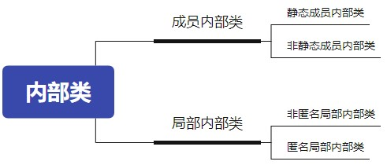

成员内部类是外部类的成员。局部内部类是在方法中声明的类。

#### 成员内部类

语法格式：

```java
[修饰符] class 外部类名{
    [修饰符] [static] class 成员内部类名{
    }
}
```


静态内部类：

- 只能调用外部类的静态成员。
- 和外部类不同，内部类还可以被private、protected修饰
- 编译以后生成`外部类名$内部类名.class`字节码文件


1. 外部类访问成员内部类的成员，需要“内部类.成员”或“内部类对象.成员”的方式
2. 成员内部类可以直接调用外部类的所有成员


**如果一个内部类中含有静态变量或静态方法，则这个内部类必须被static修饰。**

1. static类型的属性和方法，在类加载的时候就会存在于内存中。
2. 要使用某个类的static属性或者方法，那么这个类必须要加载到jvm中。

基于以上两点，可以看出，如果一个非static的内部类如果具有static的属性或者方法，那么就会出现一种情况：内部类未加载，但是却试图在内存中创建static的属性和方法，这当然是错误的。原因：类还不存在，但却希望操作它的属性和方法。


#### 成员内部类的实例化

创建成员内部类对象

- 实例化静态内部类

```
外部类名.静态内部类名 变量 = 外部类名.静态内部类名();
变量.非静态方法();
```

- 实例化非静态内部类

```
外部类名 变量1 = new 外部类();
外部类名.非静态内部类名 变量2 = 变量1.new 非静态内部类名();
变量2.非静态方法();
```


#### 局部内部类

##### 非匿名局部内部类

语法格式：

```java
[修饰符] class 外部类名{
    [修饰符] 返回值类型  方法名(形参列表){
            [final/abstract] class 局部内部类名{
    	}
    }    
}
```

编译后有自己的独立的字节码文件，只不过在内部类名前面冠以外部类名、$符号、编号。

- 这里有编号是因为同一个外部类中，不同的方法中存在相同名称的局部内部类


##### 匿名内部类

有时考虑到这个实现类是一次性的，那么我们给它取名字，就显得多余。那么我们完全可以使用匿名内部类的方式来实现，避免给类命名的问题。

```java
new 父类([实参列表]){     // new了一个该类的匿名子类的对象，这里的实参列表指明调用的是哪一个构造器
    重写方法...
}
```

```java
new 父接口(){      // new了一个该接口的匿名实现类的对象
    重写方法...
}
```

使用匿名内部类的对象直接调用方法：（这里只举了父接口的例子，可以补充父类的例子）

```java
interface A{
	void a();
}
public class Test{
    public static void main(String[] args){
    	new A(){
			@Override
			public void a() {
				System.out.println("aaaa");
			}
    	}.a();
    }
}
```


```java
interface A{
	void a();
}
public class Test{
    public static void main(String[] args){
    	A obj = new A(){           // 将匿名对象赋值给对象名
			@Override
			public void a() {
				System.out.println("aaaa");
			}
    	};
    	obj.a();
    }
}
```

匿名内部类的对象作为实参

```java
interface A{
	void method();
}
public class Test{
    public static void test(A a){
    	a.method();
    }
    
    public static void main(String[] args){
    	test(new A(){
			@Override
			public void method() {
				System.out.println("aaaa");
			}
    	});
    }   
}
```


##### JDK8新特性

###### lambda表达式

lambda表达式**只能**简化`函数式接口`的匿名实现类。

函数式接口：只能有一种抽象方法的接口。


函数式接口可以用 注解 `@FunctionalInterface` 修饰。


```java
interface A{
	void a();
}
public class Test{
    public static void main(String[] args){
    	new A(){
			@Override
			public void a() {
				System.out.println("aaaa");
			}
    	}.a();
    }
}
```

```java
// 将上面的代码用lambda表达式替换：
interface A{
	void a(int i);
}
public class Test{
    public static void main(String[] args){
        A a = (i) -> {
            System.out.println("aaaa");
        };
        a.a(1);
    }
}
```

我们来看看是怎么简化的：

1. 根据A a = () -> {}; 中的 A 可以推导出 new A()
2. 因为接口A中只有一个抽象方法，所以该抽象方法的权限修饰符、返回值类型、形参类型和方法名是知道的，可以省。`()`不能省，`()`里的形参不能省啊。
3. 如果只有一个形参，那么`()`也可以省，多个形参就不能省了，因为分不清了就。
4. 重写方法的内容放到lambda表达式的大括号里。如果只有一行代码，可以省略大括号，如果省略了大括号就必须省略掉分号。此时，如果有return，也必须省略掉。


###### 方法引用

[10、JDK8新特性：方法引用、特定类型方法引用、构造器引用_哔哩哔哩_bilibili](https://www.bilibili.com/video/BV1Cv411372m?p=128&vd_source=5a374f315281b0338a0b7fd69b8b8e98)

看懂了点。就按他讲的记。

### 枚举类

- **枚举类型本质上也是一种类，只不过是这个类的对象是有限的、固定的几个，不能让用户随意创建。**
- 枚举类的例子举不胜举：
  - `星期`：Monday(星期一)......Sunday(星期天)
  - `性别`：Man(男)、Woman(女)
  - `月份`：January(1月)......December(12月)
  - `季节`：Spring(春节)......Winter(冬天)


枚举类的实现：

- 在JDK5.0 之前，需要程序员自定义枚举类型。
- 在JDK5.0 之后，Java支持`enum`关键字来快速定义枚举类型。


#### 定义枚举类（JDK5.0 之前）

在JDK5.0 之前如何声明枚举类呢？相当于单例模式的引申：

- `私有化`类的构造器，保证不能在类的外部创建其对象
- 在类的内部创建枚举类的实例。声明为：`public static final` ，对外暴露这些常量对象
- 对象如果有`实例变量`，应该声明为`private final`（建议，不是必须），并在构造器中初始化

```java
class Season{
    private final String SEASONNAME;//季节的名称
    private final String SEASONDESC;//季节的描述
    private Season(String seasonName,String seasonDesc){
        this.SEASONNAME = seasonName;
        this.SEASONDESC = seasonDesc;
    }
    public static final Season SPRING = new Season("春天", "春暖花开");
    public static final Season SUMMER = new Season("夏天", "夏日炎炎");
    public static final Season AUTUMN = new Season("秋天", "秋高气爽");
    public static final Season WINTER = new Season("冬天", "白雪皑皑");

    @Override
    public String toString() {
        return "Season{" +
                "SEASONNAME='" + SEASONNAME + '\'' +
                ", SEASONDESC='" + SEASONDESC + '\'' +
                '}';
    }
}
class SeasonTest{
    public static void main(String[] args) {
        System.out.println(Season.AUTUMN);
    }
}
```

#### 定义枚举类（JDK5.0 之后）

格式：

```java
【修饰符】 enum 枚举类名{
    常量对象列表
}
```

举例：

```java
enum Size { SMALL， MEDIUM，LARCE，EXTRA_LARGE };
Size s = Size.MEDTUM;
```

Size类型的变量只能存储这个类型声明中给定的某个枚举值，或者null值,null表示这个变量没有设置任何值。

- 枚举类的常量对象列表必须在枚举类的首行，因为是常量，所以建议大写。
- 列出的实例对象会自动添加 public static final 修饰。
- 如果常量对象列表后面没有其他代码，那么“；”可以省略，否则不可以省略“；”

格式：

```java
【修饰符】 enum 枚举类名{
    常量对象列表;
    
    对象的实例变量列表;
}
```

- 编译器给枚举类默认提供的是private的无参构造器，如果枚举类需要的就是无参构造，那就不需要声明，写常量对象列表时也不用加参数
- 如果枚举类需要的是有参构造器，那就需要手动定义，有参构造器的private可以省略，调用有参构造的方法就是在常量对象名后面加(实参列表)就可以。
- 枚举类默认继承的是java.lang.Enum类，因此不能再继承其他的类型。
- JDK5.0 之后，switch关键字就开始支持枚举类型，case后面可以写枚举常量名，无需添加枚举类作为限定。

举例：

```java
public enum SeasonEnum {
    SPRING("春天","春风又绿江南岸"),
    SUMMER("夏天","映日荷花别样红"),
    AUTUMN("秋天","秋水共长天一色"),
    WINTER("冬天","窗含西岭千秋雪");

    private final String seasonName;
    private final String seasonDesc;
    
    private SeasonEnum(String seasonName, String seasonDesc) {
        this.seasonName = seasonName;
        this.seasonDesc = seasonDesc;
    }
    public String getSeasonName() {
        return seasonName;
    }
    public String getSeasonDesc() {
        return seasonDesc;
    }
}
```

> 经验之谈：
>
> 开发中，当需要定义一组常量时，强烈建议使用枚举类。

#### enum中常用方法

```java
String toString(): 默认返回的是常量名（对象名），可以继续手动重写该方法！
    
static 枚举类型[] values():返回枚举类型的对象数组。该方法可以很方便地遍历所有的枚举值，是一个静态方法
    
static 枚举类型 valueOf(String name)：可以把一个字符串转为对应的枚举类对象。要求字符串必须是枚举类对象的“名字”。如不是，会有运行时异常：IllegalArgumentException。
    
String name():得到当前枚举常量的名称。建议优先使用toString()。
    
int ordinal():返回当前枚举常量的次序号，默认从0开始
```


#### 实现接口的枚举类

- 和普通 Java 类一样，枚举类可以实现一个或多个接口
- 若每个枚举值在调用实现的接口方法呈现相同的行为方式，则只要统一实现该方法即可。
- 若需要每个枚举值在调用实现的接口方法呈现出不同的行为方式，则可以让每个枚举值分别来实现该方法

语法：

```java
//1、枚举类可以像普通的类一样，实现接口，并且可以多个，但要求必须实现里面所有的抽象方法！
enum A implements 接口1，接口2{
	//抽象方法的实现
}

//2、如果枚举类的常量可以继续重写抽象方法!
enum A implements 接口1，接口2{
    常量名1(参数){
        //抽象方法的实现或重写
    },
    常量名2(参数){
        //抽象方法的实现或重写
    },
    //...
}
```

举例：

```java
interface Info{
	void show();
}

//使用enum关键字定义枚举类
enum Season1 implements Info{
	//1. 创建枚举类中的对象,声明在enum枚举类的首位
	SPRING("春天","春暖花开"){
		public void show(){
			System.out.println("春天在哪里？");
		}
	},
	SUMMER("夏天","夏日炎炎"){
		public void show(){
			System.out.println("宁静的夏天");
		}
	},
	AUTUMN("秋天","秋高气爽"){
		public void show(){
			System.out.println("秋天是用来分手的季节");
		}
	},
	WINTER("冬天","白雪皑皑"){
		public void show(){
			System.out.println("2002年的第一场雪");
		}
	};
	
	//2. 声明每个对象拥有的属性:private final修饰
	private final String SEASON_NAME;
	private final String SEASON_DESC;
	
	//3. 私有化类的构造器
	private Season1(String seasonName,String seasonDesc){
		this.SEASON_NAME = seasonName;
		this.SEASON_DESC = seasonDesc;
	}
	
	public String getSEASON_NAME() {
		return SEASON_NAME;
	}

	public String getSEASON_DESC() {
		return SEASON_DESC;
	}
}
```


### 包装类

#### 为什么需要包装类

基本数据类型的变量不是类的对象，而java在设计，为了统一，将基本数据类型封装成封装类。

```java
//情况1：方法形参
Object类的equals(Object obj)

//情况2：方法形参
ArrayList类的add(Object obj)
//没有如下的方法：
add(int number)
add(double d)
add(boolean b)
```

因此，我们可以将基本数据类型包装成类。

```java
//情况3：泛型(还没学)
Set<T>
List<T>
Cllection<T>
Map<K,V>
```


| 原始类型 | 包装类    |
| :------- | :-------- |
| byte     | Byte      |
| boolean  | Boolean   |
| char     | Character |
| double   | Double    |
| float    | Float     |
| int      | Integer   |
| long     | Long      |
| short    | Short     |

封装以后的，内存结构对比：

```java
public static void main(String[] args){
	int num = 520;
	Integer obj = new Integer(520);
}
```

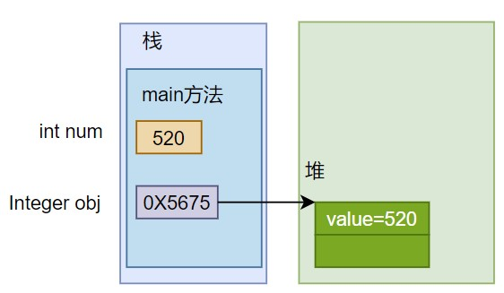

#### 包装类与基本数据类型间的转换

##### 装箱

 **装箱：把基本数据类型转为包装类对象**

> 转为包装类的对象，是为了使用专门为对象设计的API和特性

基本数值---->包装对象

```java
Integer obj1 = new Integer(4);//使用构造函数，该方法已过时，应该使用valueof方法
Float f = new Float(“4.56”);
Long l = new Long(“asdf”);  //NumberFormatException

Integer obj2 = Integer.valueOf(4);//使用包装类中的valueOf方法
```

##### 拆箱

**拆箱：把包装类对象拆为基本数据类型**

> 转为基本数据类型，一般是因为需要运算，Java中的大多数运算符是为基本数据类型设计的。比较、算术等

包装对象---->基本数值

```java
Integer obj = new Integer(4);
int num1 = obj.intValue();
```

**自动装箱与拆箱：**

由于我们经常要做基本类型与包装类之间的转换，从`JDK5.0 `开始，基本类型与包装类的装箱、拆箱动作可以自动完成。例如：

```java
Integer i = 4;//自动装箱。相当于Integer i = Integer.valueOf(4);
i = i + 5;//等号右边：将i对象转成基本数值(自动拆箱) i.intValue() + 5;
//加法运算完成后，再次装箱，把基本数值转成对象。
int j = i; //自动拆箱。
```

> 注意：只能与自己对应的类型之间才能实现自动装箱与拆箱。

```java
Integer i = 1;
Double d = 1;//错误的，1是int类型
```

```java
public class Main {
    public static void main(String[] args) {
        add(1,2);         // 实参1 ，2是int类型，形参是Integer类型，传参的过程进行了自动装箱。
    }
    public static void add(Integer i1,Integer i2) {
        System.out.println(i1+i2);
    }
}
```


#### 基本数据类型、包装类与字符串间的转换

**（1）基本数据类型转为字符串**

**方式1：**调用字符串重载的valueOf()方法

```java
int a = 10;
//String str = a;//错误的

String str = String.valueOf(a);
```

**方式2：**更直接的方式

```java
int a = 10;

String str = a + "";
```

**（2）字符串转为基本数据类型、包装类**

**方式1：**除了Character类之外，其他所有包装类都具有parseXxx静态方法可以将字符串参数转换为对应的基本类型，例如：

* `public static int parseInt(String s)`：将字符串参数转换为对应的int基本类型。
* `public static long parseLong(String s)`：将字符串参数转换为对应的long基本类型。
* `public static double parseDouble(String s)`：将字符串参数转换为对应的double基本类型。

**方式2：**字符串转为包装类，然后可以自动拆箱为基本数据类型

* ```public static Integer valueOf(String s)```：将字符串参数转换为对应的Integer包装类，然后可以自动拆箱为int基本类型
* ```public static Long valueOf(String s)```：将字符串参数转换为对应的Long包装类，然后可以自动拆箱为long基本类型
* ```public static Double valueOf(String s)```：将字符串参数转换为对应的Double包装类，然后可以自动拆箱为double基本类型

注意:如果字符串参数的内容无法正确转换为对应的基本类型，则会抛出`java.lang.NumberFormatException`异常。

**方式3：**通过包装类的构造器实现

```java
int a = Integer.parseInt("整数的字符串");
double d = Double.parseDouble("小数的字符串");
boolean b = Boolean.parseBoolean("true或false");

int a = Integer.valueOf("整数的字符串");
double d = Double.valueOf("小数的字符串");
boolean b = Boolean.valueOf("true或false");

int i = new Integer(“12”);

```

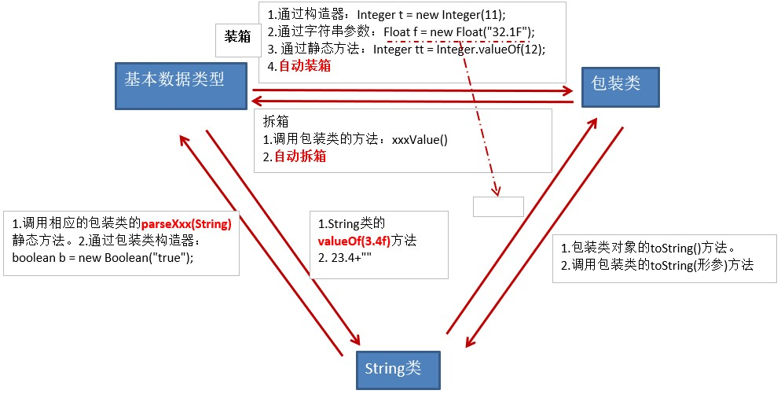

#### 缓存池

缓存池也称常量池，它事先存储一些常用数据，用于提高性能节省空间。大部分的包装类都实现了缓存池。


> **当我们在自动装箱时**（Integer i = 4;或Integer i = Integer.valueOf(4);）时，即直接赋值如果基本数据类型的值处在缓存范围内，则不会重新创建对象，而是使用缓存池中已事先创建好的对象。而Integer m = new Integer(1);//新new的在堆中，跟常量池中的不是同一个对象。

| 包装类    | 已缓存的对象 |
| --------- | ------------ |
| Byte      | -128~127     |
| Short     | -128~127     |
| Integer   | -128~127     |
| Long      | -128~127     |
| Float     | 没有         |
| Double    | 没有         |
| Character | 0~127        |
| Boolean   | true和false  |

比如常量池中已缓存Integer对象的值是从-128到127，我们在下面自动装箱了两个值为1的包装类对象，1处在-128到127之间，一比较发现这俩是同一个对象,也就是常量池里已缓存的对象。

```java
Integer a = 1;
Integer b = 1;
System.out.println(a == b);//true
```

而128不在-128到127之间，这俩128不是同一个对象。

```java
Integer i = 128;
Integer j = 128;
System.out.println(i == j);//false
```


```java
Integer m = new Integer(1);//新new的在堆中
Integer n = 1;//这个用的是缓冲的常量对象，在方法区
System.out.println(m == n);//false

Integer x = new Integer(1);//新new的在堆中
Integer y = new Integer(1);//另一个新new的在堆中
System.out.println(x == y);//false
```

```java
Double d1 = 1.0;
Double d2 = 1.0;
System.out.println(d1==d2);//false 比较地址，没有缓存对象，每一个都是新new的
```

[【每天一个技术点】装箱拆箱原理&包装类型缓存池_哔哩哔哩_bilibili](https://www.bilibili.com/video/BV1RF411s7tF/?spm_id_from=333.337.search-card.all.click&vd_source=5a374f315281b0338a0b7fd69b8b8e98)

#### 类型转换问题

当包装类与基本数据类型对比时，包装类会自动拆箱变为基本类型再进行比较

```java
Integer i = 1000;
double j = 1000;    // 这个double是基本数据类型
System.out.println(i==j);//true  会先将i自动拆箱为int，然后根据基本数据类型“自动类型转换”规则，转为double比较
```

```java
Integer i = 1000;
int j = 1000;
System.out.println(i==j);//true 会自动拆箱，按照基本数据类型进行比较
```

```java
Integer i = 1;
Double d = 1.0;          // 这个 Double是包装类
System.out.println(i==d);//编译报错，两个不同类的对象不能用==
```


#### 不可变对象

不可变对象(Immutable Object)：对象一旦被创建后，对象所有的状态及属性在其生命周期内不会发生任何变化。

从不可变对象的定义来看，其实比较简单，就是一个对象在创建后，不能对该对象进行任何更改。


String类、包装类对象是不可变对象，因为包装类对象有缓存池，String类对象也有缓存池。


#### 包装类的其它API

##### 数据类型的最大最小值

```java
Integer.MAX_VALUE和Integer.MIN_VALUE
    
Long.MAX_VALUE和Long.MIN_VALUE
    
Double.MAX_VALUE和Double.MIN_VALUE
```

#####  字符转大小写

```java
Character.toUpperCase('x');
Character.toLowerCase('X');
```

#####  整数转进制

```java
Integer.toBinaryString(int i) 
    
Integer.toHexString(int i)
    
Integer.toOctalString(int i)
```

#####  比较的方法

```java
Double.compare(double d1, double d2)
    
Integer.compare(int x, int y) 
```
