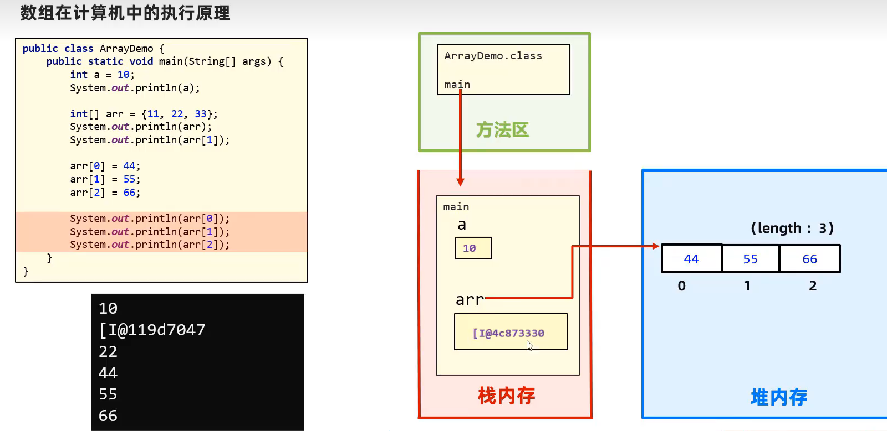

# introduction

## 面向对象编程

**Java是一种纯面向对象编程的语言**

目前程序有两类：

第一类是程序员通过编写逻辑过程，让程序按照编写的逻辑来执行

第二类是目前的机器学习，深度学习，神经网络这类通过训练数据调参，程序根据模型进行预测


编写执行逻辑又有两类：面向过程和面向对象。

面向过程就是，完成一个任务，编写每一步的执行逻辑。

面向对象就是，创建多个对象，每一个对象负责完成一个具体的功能，为了完成一个任务，将每一步交给每一个对象去实现。

在编写大型工程的时候，面向对象是优于面向过程的。因为面向对象编程可以减少代码的重复，同时将不同的功能交由不同的对象去实现，这样通过不同的调用方式，可以实现不同的任务。而且逻辑比面向过程能清晰。


## Java开发工具

开发工具：开发人员用到的工具。

文本编辑器：vscode

IDE: IDEA


~~我觉得作为一个计算机初学者，在学一门编程语言的时候，应该先用文本编辑器编写程序，等到熟练了再学使用IDE，这样既能加深对程序的执行过程有了解，又能知道什么是IDE，等IDE学会了，就去玩vscode，学会DIY自己的IDE，一方面能锻炼程序员环境的配置，了解更多原理，又能搭配适合自己的IDE。~~

我觉得作为一个计算机初学者，没必要知道什么是编辑器、IDE这种概念，该用哪款软件就用哪款软件。等用的熟练了自然就知道了。初学者没必要纠结这些。

## JDK介绍

首先介绍Java跨平台的原理：

**JVM：Java Virtual Machine(Java虚拟机)**。在真实的计算机中模拟出一台计算机。虚拟机有自己完善的硬体架构(通过编写代码模拟出来的)，如处理器、堆栈、寄存器、指令系统等。

实现Java程序的跨平台性


**JDK：Java Development Kit**。(Java开发工具包)

JDK = JRE + java开发工具集

**JRE：Java Runtime Environment**.（Java运行时环境）

JRE = JVM + Java的核心类库 

平时也会遇到SDK，自行网页搜索。之前学阿里云oss的时候就是用的阿里云提供的sdk


首先讲什么是JRE，**JRE是指Java程序运行时所需要的环境，也就是Java程序要运行的话不可缺少的东西**：JVM和核心类库。

对于用户来说，用户只需要.class文件和JRE就可以运行程序了。

对于开发者来说，开发者需要先编写Java程序，然后使用Java开发工具集里的工具，如javac.exe(编译器)将.java程序编译成.class文件、java.exe（解释器）、javadoc（网页文档生成器）等。因此，对于开发者来说，需要完整的JDK


## 环境变量的配置

python介绍过，这里不再介绍。

## Java代码规范

java开发涉及各方面的知识，现有的开发手册如阿里云、华为的java开发手册覆盖了各方面的开发规范，我们目前只是java的初学者，并不会要求一上来就去读Java开发规范手册。目前我们只了解一些java代码规范，为我们后续的学习打下良好的基础。

1. 类、方法的注释使用文档注释
2. 使用tab键和shift+tab键实现缩进和取消缩进，不要用空格。
3. 运算符和=两边留空格
4. 源文件用utf-8编码
5. 一行代码不要写太长，不便于阅读
6. 左大括号换行或不换行均可，要选一种，别混用！

## java程序从编写到运行

创建Hello.java的文件

编写代码如下：(注意:**文件名 `Hello`需要与类名 `Hello` 保持一致，注意大小写有区别**)

```java
public class Hello{
	public static void main(String[] args)
	{
		System.out.println("Hello,world");
	}
}
```

对于上述java代码，学过面向对象才知道每一部分表示的含义，对于新人，记住这个框架，在main函数里编程即可。

在地址栏中输入cmd并回车，即可打开终端窗口。输入 `javac hello.java`进行编译生成`hello.class`

再输入 `java hello`就会执行这个class文件

> 注意编译和运行时的区别，在编译的时候使用的是javac.exe这个编译工具，处理的文件是带有后缀".java"的，而在运行的时候，使用的工具是java.exe,处理的文件是不带有后缀".class"的
>

**每一次修改代码，都要经历保存，编译，运行三个过程。**


Java源文件以.java为扩展名。源文件的基本组成单位是类(class)

**一个源文件最多只能有一个public类，如果源文件中有一个public类，则文件名必须与该public类的类名保持一致。**

一个源文件如下：

```java
// hello.java
public class hello{
	public static void main(String[] args)
	{
		System.out.println("hello,world");
	}
}

class Dog
{
	public static void main(String[] args)
	{
		System.out.println("hello,dog");
	}
}

class Tiger
{
	public static void main(String[] args)
	{
		System.out.println("hello,tiger");
	}
}
```

在cmd经过编译 `javac hello.java`之后生成三个文件 `hello.class`、`Dog.class`、 `Tiger.class`

分别运行这三个`.class`文件，会分别执行这三个类的main函数。

由上可知：

1. 源文件中的每一个类经过编译都会生成对应的class文件

2. main函数可以在多个类中实现，分别执行对应类的.class文件可以执行该类中的main函数

# 基本语法

### 注释

```java
//单行注释

/*
多~
行~
注~
释~
*/

```

**文档注释**

文档注释可以被JDK提供的工具javadoc解析，生成网页格式的说明文档，也就是API文档。

[Java 文档注释全攻略，建议收藏！ - 知乎 (zhihu.com)](https://zhuanlan.zhihu.com/p/619502562#:~:text=二、文档注释格式总结 1 所有的 Java 文档注释都以 %2F** 开头， *%2F,每个 Java 文档注释都要和其后对应的类%2F方法%2F字段%2F包保持同样的缩进 4 Java 文档注释的内容，支持采用 HTML 语法规则书写，同时也支持一些额外的辅助标签)

[0024_韩顺平Java_文档注释_哔哩哔哩_bilibili](https://www.bilibili.com/video/BV1fh411y7R8?p=25&vd_source=5a374f315281b0338a0b7fd69b8b8e98)

了解即可，用不着自己写文档注释

注释并不会执行(编译器在编译代码之前会把代码中的所有注释删除,字节码中不保留注释)，是我们程序员写给自己看的，注释是你的代码说明书，能够帮助看代码的人快速地理清代码之间的逻辑关系。


API文档

- API （Application Programming Interface，应用程序编程接口）
- **Java语言提供了大量的基础类**，因此 Oracle 也为这些基础类提供了相应的说明文档，**用于告诉开发者如何使用这些类，以及这些类里包含的方法。**

  在线看：https://docs.oracle.com/en/java/javase/17/docs/api/index.html

### 关键字

(keyword)

- 定义：**被Java语言赋予了特殊含义，用做专门用途的字符串（或单词）**


> 说明：
>
> 1. 关键字一共`50个`，其中`const`和`goto`是`保留字`(reserved word)。
> 2. `true`，`false`，`null`不在其中，它们看起来像关键字，其实是`字面值(iterals)`，表示特殊的布尔值和空值。

strictfp了解一下即可，以后不会用到。。


### 标识符

(identifier)

Java中开发人员起的变量名、方法名、类名，称为标识符。

**标识符的命名规则**（必须遵守的`硬性规定`）：

- 由26个英文字母大小写，0-9 ，_或 $ 组成  
- 数字不可以开头。
- 不可以使用关键字和保留字，但能包含关键字和保留字。
- Java中严格区分大小写，长度无限制。

**标识符的命名规范**（建议遵守的`软性要求`，否则工作时容易被鄙视）:

> 包名：多单词组成时所有字母都小写
> 例如：java.lang、com.atguigu.bean
>
> 类名、接口名：多单词组成时，所有单词的首字母大写：XxxYyyZzz
> 例如：HelloWorld，String，System等
>
> 变量名、方法名：多单词组成时，第一个单词首字母小写，第二个单词开始每个单词首字母大写：xxxYyyZzz
> 例如：age,bookName,getName
>
> 常量名：所有字母都大写。多单词时每个单词用下划线连接：XXX_YYY_ZZZ
> 例如：MAX_VALUE,PI,DEFAULT_CAPACITY

注意：在起名字时，为了提高阅读性，要尽量有意义，“见名知意”。更多细节详见《代码整洁之道_关于标识符.txt》《阿里巴巴Java开发手册-1.7.1-黄山版》


### 局部变量

- 变量的概念：
  - 内存中的一个存储区域
  - Java中变量声明的格式：`数据类型 变量名 = 字面值(literals)或地址;`
- 使用变量注意：
  - Java中每个变量必须先声明，后使用。
  - 局部变量必须初始化，没有默认值。
  - 使用变量名来获取这块区域的数据。
  - 变量的作用域：其定义所在的一对{ }内。变量只有在其`作用域`内才有效。
  - 同一个作用域内，不能定义重名的变量。

```java
public static void main(String[] args)
{
    int i = 1;
    for(float i = 0;;) //java不支持外层块定义一个局部变量，在内层块再定义一个同名变量，即使数据类型不一样也不行
    {}
}
```

### 数据类型


引用数据类型的变量存放的是地址。而基本数据类型的变量存放的是值。


java与c不同，java的数据类型有固定的字节，不受具体操作系统的影响，而c++各数据类型的字节大小是受到具体cpu的机器字长影响。这一特性保证了java可移植性。

| 数据类型 | 存储方式     | 字节大小 | 取值范围                                   | 默认值   |
| -------- | ------------ | -------- | ------------------------------------------ | -------- |
| byte     | 有符号、补码 | 1        | -128(-2^7) 到 127(2^7 - 1)                 | 0        |
| short    | 有符号、补码 | 2        | -32768(-2^15) 到 32767(2^15 - 1)           | 0        |
| int      | 有符号、补码 | 4        | -2147483648(-2^31)到 2147483647(2^31 - 1)  | 0        |
| long     | 有符号、补码 | 8        | -2147483648(-2^31) 到 2147483647(2^31 - 1) | 0L       |
| float    | IEEE754      | 4        | 1.4E - 45 到 3.4028235E38                  | 0.0f     |
| double   | IEEE754      | 8        | 4.9E - 324 到 1.7976931348623157E308       | 0.0d     |
| boolean  |              | ~        | true or false                              | false    |
| char     | Unicode      | 2        | '\u0000'（0） 到 '\uffff'（65535）         | '\u0000' |

> boolean类型不能用0、非0代替flase、true

定义基本数据类型的变量的时候，系统会根据其数据类型给变量分配对应字节大小的空间。（局部变量是没有默认值的）

引用数据类型的默认值是null

### 字面值

(literals)

字面值也有数据类型！xxx感觉这样说不对，应该说，字面值以int类型存储等

在默认值那一列可以看到0有四种表示形式，分别是：0，0L，0.0f，0.0d

Java中默认将整数字面值视为 `int` 类型。在整数字面值后面添加 `L` 或 `l` 来表示`long` 类型

Java中默认将浮点数字面值视为`double`类型。在浮点数字面值后面添加`f`或`F`表示`float`类型，在浮点数字面值后面添加`d`或`D`表示`double`类型

浮点型字面值有两种表示形式：

- 十进制数形式。如：5.12       512.0        .512   (必须有小数点）
- 科学计数法形式。如：5.12e2      512E2     100E-2

```java
double num1 = 0.314;
double num1 = .314; //等价于0.314
double num2 = 3.14e3; // 3.14e3 = 3.14*10^3
double num3 = 3.14E3;  //e、E是一样的
System.out.println(num1);   // 0.314
System.out.println(num2);  //  3140.0
```

**浮点数陷阱**

```java
double num1 = 2.7;
double num2 = 8.1 / 3;    // 正常计算应该是2.7
System.out.println(num1);  // 2.7
System.out.println(num2);  // 2.6999999999999997
```

出现这种情况，需要学习浮点数的乘除，必须要学会！（考研考到了）

综上，不要用浮点数相等作为判断条件：

```java
if(num1 == num2)
{
    System.out.println("2.7 = 8.1 / 3");
}
else
{
    System.out.println("2.7 != 8.1 / 3");
}
```

正确的做法是：两个数相减的绝对值小于1e-6或1e-15

如果是float类型的，要小于1e-6

如果是double类型的，要小于1e-15

为什么是这样，具体原因与浮点数的存储方式有关！

- 并不是所有的小数都能可以精确的用二进制浮点数表示。二进制浮点数不能精确的表示0.1、0.01、0.001这样10的负次幂。（这个也是跟浮点数的存储方式有关）
- 浮点类型float、double的数据不适合在`不容许舍入误差`的金融计算领域。如果需要`精确`数字计算或保留指定位数的精度，需要使用`BigDecimal类`,可以实现任意精度的数据的运算。

**在变量定义的时候，整型变量常用int，浮点数变量常用double**

> 为什么Java中0.1 + 0.2结果不是0.3？（字*跳动）
>
> 在代码中测试0.1 + 0.2，你会惊讶的发现，结果不是0.3，而是0.3000……4。这是为什么？
>
> 几乎所有现代的编程语言都会遇到上述问题，包括 JavaScript、Ruby、Python、Swift 和 Go 等。引发这个问题的原因是，它们都采用了`IEEE 754标准`。

学计组的时候再算算！！！

### 类型转换(看底层)

1. boolean类型不参与转换

2. 自动转换

   编译器自动完成数据类型转换xxx

   1. 将低级字面值赋给高级变量时xxx

      ```java
byte myByte = 0;
      // 字面值0是int类型，字节大小为4，而变量myByte是byte类型，字节大小为1，当您将一个整数赋值给一个byte类型的变量时，如果该整数在 byte 类型的取值范围内（即 -128 到 127），则赋值是有效的，这个过程进行了自动类型转换xxx。如果整数超出了byte类型的取值范围，那么编译器将报错
      ```
      
   2. 进行运算时，不同数据类型的数字进行运算时，需要先转换成同样的数据类型才能计算
   
   ```java
   int i = 1;
   byte b = 1;
   double d = 1.0;
   double sum = i + b + d;//混合运算，升级为double
   ```
   ```java
   //当byte,short,char数据类型的变量进行算术运算时，按照int类型处理。
   byte b1 = 1;
   byte b2 = 2;
   byte b3 = b1 + b2;//编译报错，b1 + b2自动升级为int
   
   
   char c1 = '0';
   char c2 = 'A';
   int i = c1 + c2;//至少需要使用int类型来接收
   System.out.println(c1 + c2);//113 
   ```
   
   
   
   虚线表示可能丢失精度
   
3. 强制转换

   程序员强制要求进行数据类型转换,可能会有精度的损失，一般不建议这样使用。


（1）可能会`损失精度`或`溢出`。

```java
int i = (int)3.14;//损失精度

double d = 1.2;
int num = (int)d;//损失精度

int i = 200;
byte b = (byte)i;//溢出
```

（2）当某个值想要提升数据类型时，也可以使用强制类型转换。这种情况的强制类型转换是`没有风险`的，通常省略。

```java
int i = 1;
int j = 2;
double bigger = (double)(i/j);
```

```java
long l1 = 123L;
long l2 = 123;// int类型的123自动类型提升为long类型,这直接看底层就好了呀。

//long l3 = 123123123123; //报错，因为123123123123超出了int的范围。
long l4 = 123123123123L;


//float f1 = 12.3; //报错，因为12.3看做是double，不能自动转换为float类型
float f2 = 12.3F;
float f3 = (float)12.3;
```

### 编码

字符集：字符与(十进制)码点的映射。

编码方案：二进制码点与真实底层存储的映射。

以Unicode为例

Unicode字符集存储了全世界所有文字字符和符号字符与十进制数字的一一对应关系。比如汉字“字”对应的数字是23383，我们计算机底层存储数字只有二进制，如何将该数字存储到计算机里，就需要一种转换机制，也就是UTF8，UTF16，这些编码方案。

过程就是先定义字符集，再制定编码方案。

### 字符

- Java中的所有字符都使用Unicode编码

- 字符型字面值的三种表现形式：

  - **形式1：**使用单引号(' ')括起来的`单个字符`。

    例如：char c1 = 'a';   char c2 = '中'; char c3 =  '9';

  - **形式2：**直接使用 `Unicode值`来表示字符型常量：‘`\uXXXX`’。其中，XXXX代表一个十六进制整数。

    例如：\u0023 表示 '#'。

  - **形式3：**Java中还允许使用`转义字符‘\’`来将其后的字符转变为特殊字符型常量。

    例如：char c3 = '\n';  // '\n'表示换行符

  | 转义字符 |  说明  | Unicode表示方式 |
  | :------: | :----: | :-------------: |
  |   `\n`   | 换行符 |     \u000a      |
  |   `\t`   | 制表符 |     \u0009      |
  |   `\"`   | 双引号 |     \u0022      |
  |   `\'`   | 单引号 |     \u0027      |
  |   `\\`   | 反斜线 |     \u005c      |
  |   `\b`   | 退格符 |     \u0008      |
  |   `\r`   | 回车符 |     \u000d      |

- char类型是可以进行运算的。因为它都对应有Unicode码，可以看做是一个数值。

char类型计算的时候，是Unicode码参与计算

```java
char c = '\r',d = '\n';
System.out.print(c+d);  // '\r'=000d=13,'\n'=000a=10
-----------
23    
```

### 转义字符

在Java中，反斜杠（\）是一个特殊的字符，被称为转义字符，它的作用是用来转义后面一个字符，用于表示特殊含义，接下来介绍几个

```java
System.out.println("hello,world\n你好，世界");
------
hello,world
你好，世界
```

```java
System.out.println("1234567\t12345678\t123456789\t1");
----------
1234567 12345678        123456789       1

//第一个\t前面有7位字符，不满8位，补空格至8位
//第二个\t前面有8位字符，不满16位，补空格至16位
//第三个\t前面有9位字符，不满16位，补空格至16位
```

综上，制表符\t前面的字符数不足或等于8的倍数时，补空格至8的倍数。

```java
System.out.println("人人得而诛之\r非也");
-----------
非也得而诛之    
```

在java中，用双引号括起来的部分表示字符串，如果我们想在字符串内使用双引号，如：

```java
System.out.println("他们说：\"人生不得意之事十之八九\"。");//要在需要识别成字符的引号前加\
```

因为双引号`"`会被编译器识别为字符串的标志，而我们希望双引号作为字符串的一部分，即我们希望双引号被识别成一个字符，因此我们可以在双引号前加反斜杠，这样编译器就能将其识别为字符。

如果我们想在字符串中使用 `\`,会被编译器直接识别为转义字符，我们需要在 `\`前加 `\`，这样就能被识别成字符了。

### 布尔类型

- **boolean类型数据只有两个值：true、false。**
  - 不可以使用0或非 0 的整数替代false和true，这点和C语言不同。

> 经验之谈：
>
> Less is More！建议不要这样写：if ( isFlag = = true )，只有新手才如此。关键也很容易写错成if(isFlag = true)，这样就变成赋值isFlag为true而不是判断！`老鸟的写法`是if (isFlag)或者if ( !isFlag)。

### 字符数组

- 数组属于引用数据类型

- 使用一对`""`来表示一个字符串，内部可以包含0个、1个或多个字符。

  ```java
  char[] charArray = {'a', 'b', 'c', 'd', 'e'};
  System.out.println(charArray); // 输出: abcde
  ```

为什么java中输出字符数组名会直接输出字符串呢？

[输出数组名的时候char数组的特殊情况-CSDN博客](https://blog.csdn.net/weixin_43928939/article/details/98474725)

### 运算符

(Operator)

运算符的分类：

- 按照`功能`分为：算术运算符、赋值运算符、比较(或关系)运算符、逻辑运算符、位运算符、条件运算符、Lambda运算符

|           分类            |                        运算符                        |
| :-----------------------: | :--------------------------------------------------: |
|     算术运算符（7个）     |                +、-、*、/、%、++、--                 |
|    赋值运算符（12个）     | =、+=、-=、*=、/=、%=、>>=、<<=、>>>=、&=、\|=、^=等 |
| 比较(或关系)运算符（6个） |                 >、>=、<、<=、==、!=                 |
|     逻辑运算符（6个）     |                &、\|、^、!、&&、\|\|                 |
|      位运算符（7个）      |               &、\|、^、~、<<、>>、>>>               |
|     条件运算符（1个）     |  variable = Expression1 ? Expression2: Expression3   |
|    Lambda运算符（1个）    |                          ->                          |

- 按照`操作数个数`分为：一元运算符（单目运算符）、二元运算符（双目运算符）、三元运算符 （三目运算符）

|           分类            |                      运算符                       |
| :-----------------------: | :-----------------------------------------------: |
| 一元运算符（单目运算符）  |                   ++、--、!、~                    |
| 二元运算符（双目运算符）  |     除了一元和三元运算符剩下的都是二元运算符      |
| 三元运算符 （三目运算符） | variable = Expression1 ? Expression2: Expression3 |

三元操作符中**基本数据类型与包装类型同时出现，引入了类型转换规则及自动装箱与拆箱规则**。需要了解三元操作符的底层原理，才能熟练应用三元操作符

```java
int a , b;
a = 10;
// 如果 a 等于 1 成立，则返回 20，否则 30
b = (a == 1) ? 20 : 30;
System.out.println( "Value of b is : " +  b );
```

取模运算与取余运算

```java
int x = -5;
int y = -12;
System.out.println(y % x);
```

取模运算（“Modulus Operation”）和取余运算（“Remainder Operation ”）两个概念有重叠的部分但又不完全一致。主要的区别在于对负整数进行除法运算时操作不同。取模主要是用于计算机术语中。取余则更多是数学概念。 

> 取余的结果是与被除数的符号保持一致；
> 取模的结果是与除数的符号保持一致。

另外各个环境下`%`运算符的含义不同，比如C/C++，Java 为取余，而Python则为取模。

在java中，%为取余操作，Math.floorMod为取模操作


**自增运算符**

（底层不太了解）--->去看字节码文件

以下代码执行的结果显示是多少（）？


答案：num * count = 0

`count = count++;`

执行过程：先执行`count++`

count++是先赋值后加=>   temp = count  ， count = count + 1； 即先把count的值放到一个临时变量中，然后执行count = count + 1。即count = 1.接着执行赋值运算符，即将临时变量temp的值赋给count。即count = 0；

因此， `count = count++;`执行完后count的值不变。

**赋值运算符**

| 赋值运算符 |                           符号解释                           |
| :--------: | :----------------------------------------------------------: |
|    `+=`    | 将符号`左边的值`和`右边的值`进行`相加`操作，最后将结果`赋值给左边的变量` |

```java
short s1=1; 
s1=s1+1;  //有什么错？  =右边是int类型。需要强转

short s1=1;
s1+=1; //有什么错?   没错
```

**位运算符**

```java
A = 0011 1100
B = 0000 1101
-----------------
A & B = 0000 1100
A | B = 0011 1101
A ^ B = 0011 0001
~A= 1100 0011
```

| 操作符 | 描述     |
| ------ | -------- |
| &      | 按位与   |
| I      | 按位或   |
| ~      | 按位非   |
| ^      | 按位异或 |
| <<     | 算术左移 |
| \>>    | 算术右移 |
| \>>>   | 逻辑右移 |

```java
int a = -15,b = -15;
a = a >> 1;  
b = b >>> 1;
System.out.println(a);   
System.out.println(b);
---------
    
-8
2147483640    
```

可知，符号位是什么， `>>` 右移补什么。  `>>>`右移补0

**逻辑运算符**

| &&    | 当且仅当两个操作数都为真，条件才为真。                       |
| ----- | ------------------------------------------------------------ |
| \| \| | 如果任何两个操作数任何一个为真，条件为真。                   |
| ！    | 称为逻辑非运算符。用来反转操作数的逻辑状态。如果条件为true，则逻辑非运算符将得到false。 |

java逻辑运算符支持短路

```java
public class Test {
    private static int j = 0;
 
    private static Boolean methodB(int k) {
        j += k;
        return true;
    }
 
    public static void methodA(int i) {
        boolean b;
        b = i < 10 | methodB(4);
        b = i < 10 || methodB(8);
 
    }
 
    public static void main(String args[]) {
        methodA(0);
        System.out.println(j);
    }
}
```

输出结果j为4.因为     `||` 前边是true，根据短路原则，methodB(8)不再执行。

**运算符优先级**

运算符有不同的优先级，所谓优先级就是在表达式运算中的运算符顺序。

> 开发建议：
>
> 1. 不要过多的依赖运算的优先级来控制表达式的执行顺序，这样可读性太差，尽量`使用()来控制`表达式的执行顺序。
> 2. 不要把一个表达式写得过于复杂，如果一个表达式过于复杂，则把它`分成几步`来完成。例如：
>    ​ (num1 + num2) * 2 > num3 && num2 > num3 ? num3 : num1 + num2;

### 条件语句

```java
if(布尔表达式)
{
   //如果布尔表达式为true将执行的语句
}
if(布尔表达式){
   //如果布尔表达式的值为true
}else{
   //如果布尔表达式的值为false
}

if(布尔表达式 1){
   //如果布尔表达式 1的值为true执行代码
}else if(布尔表达式 2){
   //如果布尔表达式 2的值为true执行代码
}else if(布尔表达式 3){
   //如果布尔表达式 3的值为true执行代码
}else {
   //如果以上布尔表达式都不为true执行代码
}

if(布尔表达式 1){
   ////如果布尔表达式 1的值为true执行代码
   if(布尔表达式 2){
      ////如果布尔表达式 2的值为true执行代码
   }
}
```

### 循环语句

```java
while( 布尔表达式 ) {
  //循环内容
}
```

对于 while 语句而言，如果不满足条件，则不能进入循环。但有时候我们需要即使不满足条件，也至少执行一次。

do…while 循环和 while 循环相似，不同的是，do…while 循环至少会执行一次。

```java
do {
       //代码语句
}while(布尔表达式);
```

```java
for(初始化; 布尔表达式; 更新) {
    //代码语句
}
```

```java
int [] numbers = {10, 20, 30, 40, 50};

for(int x : numbers ){
    System.out.print( x );
    System.out.print(" ");
```

### break&continue

### 方法&return

方法的定义：

```java
修饰符 返回值类型 方法名(形参列表){
    //方法体
    return 返回值;
}    
```

修饰符在学习封装的时候会学。

方法的作用：

将代码进行封装，以便可以重复的被调用，即降低代码的重复性。同时将代码封装可以使整体代码的逻辑更清晰。

参数传递机制

Java里方法的参数传递方式只有一种： 值传递 。 
形参是基本数据类型：将实参基本数据类型变量的“数据值”传递给形参
形参是引用数据类型：将实参引用数据类型变量的“地址值”传递给形参

以下Java程序运行的结果是

```java
public class Tester{
public static void main(String[] args){
   Integer var1=new Integer(1);
   Integer var2=var1;
   doSomething(var2);
   System.out.print(var1.intValue());   // 1
   System.out.print(var1==var2);        // true
}
public static void doSomething(Integer integer){
    integer=new Integer(2);
    }
}
```


### 递归

学习递归能帮助我们理解，在底层，方法在调用后是存放在栈区里的。

### switch

```java
switch(expression){
    case value :
       //语句
       [break;]
    case value :
       //语句
       [break;]
    //你可以有任意数量的case语句
    [default : 语句]
}
```

- switch 语句中的表达式的类型可以是： byte、short、int 、char或枚举类型。从 Java SE 7 开始，switch 支持字符串 String 类型了；value必须为字面量。

- **计算switch后表达式expression的值，并逐个与case后常量表达式value的值相比较，当表达式expression的值与某个常量表达式value的值相等时，即执行其后的语句，直到遇到break语句为止。如表达式的值与所有case后的常量表达式均不相同时，则执行default后的语句。**(深刻理解)

- switch 语句可以包含一个 default 分支，case和default只起标号的作用，顺序可以颠倒。default 在没有value和expression相等的时候执行

  ```java
  public class Test {
     public static void main(String args[]){
        int i = 1;
        switch(i){
           case 0:
              System.out.println("0");
           case 1:
              System.out.println("1");
           case 2:
              System.out.println("2");
           default:
              System.out.println("default");
        }
     }
  }
  -------
  1
  2
  default    
  ```

### 输入输出语句

输出语句

```java
System.out.println("1");   
System.out.println();
System.out.println("2");   //自带换行
System.out.print("3");     //不带换行
System.out.print("4");
-------------
1

2    
34    
```

输入语句

```java
import java.util.Scanner;

Scanner scan = new Scanner(System.in);   //实例化类Scanner
String str = scan.nextline();        //调用scan中的方法nextline(),从键盘获取一串字符串并返回
```

### 数组

#### 一维数组

- 创建数组会在内存中开辟一整块`连续的空间`。占据的空间的大小，取决于数组的长度和数组中元素的类型。
- 数组，一旦创建完成，其长度就是确定的，不能修改。
- 我们可以直接通过下标的方式获取指定位置的元素，索引用中括号[]
- 数组名是这块连续空间的首地址。

```java
// 1.声明
int[] arr;   
int arr[];  
/* 注意:建议使用int[] arr;声明数组变量。int arr[];来自C/C++，在Java中采用是为了让C/C++程序员能够快速
上手Java语言*/
// 2.分配空间
arr = new int[arraySize];   
/*创建一个大小为arraySize，元素类型为int的数组，并将首地址赋给arr，arraySize可以是字面值，也可以是变量或常量*/
// 3.声明并分配空间
int[] arr = new int[arraySize];
```

> 在预先不知道数组大小的情况下
>
> 让用户输入一个数字n，表示接下来用户将输入n个数，并用数组存储起来。

```java
int n = 5;
int[] a = new int[n];
System.out.println(a.length);   // 5    数组的长度用length属性:数组为什么会有属性???
```

> 为什么数组要从0开始编号，而不是1
>
> 数组的索引，表示了数组元素距离首地址的偏离量。因为第1个元素的地址与首地址相同，所以偏移量就是0。所以从0开始。

打印地址

```java
int[] arr = {1,2,3,4,5};
System.out.println(arr);//[I@6d03e736
```

> 以[I@6d03e736为例：
> [ ：表示现在打印的是一个数组。
> I：表示现在打印的数组是int类型的。
> @：仅仅是一个间隔符号而已。
> 6d03e736：就是数组在内存中真正的地址值。（十六进制的）



#### 二维数组

```java
//推荐
int[][] arr;

//不推荐
int  arr[][];

int[]  arr[];
```

法一：

```java
int[][] arr = {{1,2,3},{4,5,6},{7,8,9,10}};               //法一
int[][] arr = new int[][]{{3,8,2},{2,7},{9,0,1,6}};      //法二

int[][] arr;                                                 //法三
arr = new int[][]{{1,2,3},{4,5,6},{7,8,9,10}};
```

1. 规则分配

```java
int m,n;
int[][] a = new int[m][n];
```

2. 不规则分配：从最高维开始，分别为每一维分配空间，例如：

```java
String[][] s = new String[2][];
s[0] = new String[2];
s[1] = new String[3];
```

二维数组的长度

```java
int[][] a = new int[2][3];
System.out.println(a.length);    //二维数组a的行数
System.out.println(a[0].length);  //二维数组第一行有多少个元素，数组有length属性
```

这里可能会有一个疑问，既然数组大小是初始化时就规定好的，那么`int[][] arr = new int[3][];`定义的数组并没有给出数组的第二维的大小，那么这个`arr`的长度到底是如何“规定好”的呢？

其实，`arr`的长度就是3。其实Java中所有的数组，无论几维，其实都是一维数组。例如arr，分配了3个空间，每个空间存放一个一维数组的地址，这样就成了“二维”数组。但是对于arr来说，他的长度就是3。

数组是一种引用数据类型，继承自Object类的，所以其中也包含了未被重写的equals()方法，所有的引用变量都能调用equals()方法来判断他是否与其他引用变量相等，使用这个方法来判断两个引用对象是否相等的判断标准与使用==运算符没有区别，只有在两个引用变量指向同一个对象才会返回true。如果想逐个遍历其中的元素，对每个元素进行比较，需要使用Arrays.equals()方法。

#### Arrays工具类

[Arrays (Java SE 17 & JDK 17) (oracle.com)](https://docs.oracle.com/en/java/javase/17/docs/api/java.base/java/util/Arrays.html)

java.util.Arrays类包含了用来操作数组（比如排序和搜索）的各种方法。

```java
// public static String toString(int[] arr):打印数组
int[] a = {1,2,3,4,5};
System.out.println(Arrays.toString(a));  // [1, 2, 3, 4, 5]

// public static int[] copyOfRange(int[] arr, int from, int to):下标[from,to)的元素塞入新数组
System.out.println(Arrays.toString(Arrays.copyOfRange(a, 0, 3))); // [1, 2, 3]

// public static int[] copyOf(int[] arr, int newlength):  指定一个新长度的数组，并将元素依次复制过去
System.out.println(Arrays.toString(Arrays.copyOf(a,10))); //[1, 2, 3, 4, 5, 0, 0, 0, 0, 0]
```

```java
int[] a = {1,3,2,4,5};
// public static void sort(int[] arr):在原数组上排序
Arrays.sort(a);
System.out.println(Arrays.toString(a));  //[1, 2, 3, 4, 5]
```

# 包机制

## 什么是包

所谓包，说白了就是文件夹或者目录，当我们创建了许多类时，就需要包来归类，可以将功能相似或相关的类放在同一包下，包里不能有同名类，但不同包下的类可以重名。所以，**包的本质其实就是存放类的文件夹**。

## 包的作用

1. 可以对类进行分门别类的管理，**把功能相似或相关联的类或接口放在同一包下，方便查看和使用。**

   

   

   如上图所示，每一个文件夹就是一个包，每个包又有多个类。

2. 当同时调用两个不同包中相同类名的类时，应该加上包名加以区别。因此，**包可以避免名字冲突**。

   如果导入两个包里存在相同的类，在调用的时候需要具体指明调用哪个包里的类

   ```java
   import pack1.ClassA;
   import pack2.ClassA;
   
   
   pack2.ClassA s = new pack2.ClassA();
   ```

3. **限制访问权限**，java默认的访问权限是在本包下，用到其他包下的类需要导包。导包只能导入public修饰的类和接口，默认权限下的包不能被导入其他包。

   包的使用：

   ```java
   import pack.ClassA;  //导入pack包里的ClassA类
   import pack.*;        //导入pack包里所有的public类和接口
   ```

   当导入包类以后，可以通过类实例化对象，再通过对象调用类中具体实现方法了。

   ```java
   import java.util.Scanner;
   
   Scanner scan = new Scanner(System.in);   //实例化类Scanner
   String str = scan.nextline();        //调用scan中的方法nextline(),从键盘获取一串字符串并返回
   ```

package关键字的作用是声明当前类所在的包，因此**一个类中最多只有一个package语句，且必须放在类的最顶端**。

**import关键字指令，要放在包声明后，类定义前。**

> 面试题：
>
> 要导入java/awt/event下面的所有类，叙述正确的是？()
>
> A.    import java.awt.\*和import java.awt.event.*都可以
>
> B.    只能是import java.awt.event.*
>
> 正确答案:B
>
> import java.awt.\* 只是导入了java/awt该层下的所有类，java/awt下的子包的类不会导入。

> 在运行时，由java解释器自动引入，而不用import语句引入的包是`java.lang`

# 面向对象

面向对象编程中的六大原则：

- **单一职责原则（SRP）**：一个类应该只有一个引起它变化的原因，即一个类应该只负责一项职责。例子：考虑一个员工类，它应该只负责管理员工信息，而不应负责其他无关工作。
- **开放封闭原则（OCP）**：软件实体应该对扩展开放，对修改封闭。例子：通过制定接口来实现这一原则，比如定义一个图形类，然后让不同类型的图形继承这个类，而不需要修改图形类本身。
- **里氏替换原则（LSP）**：子类对象应该能够替换掉所有父类对象。例子：一个正方形是一个矩形，但如果修改一个矩形的高度和宽度时，正方形的行为应该如何改变就是一个违反里氏替换原则的例子。[设计模式之七大原则——里氏替换原则（LSP）（三）_正方形不是长方形 里氏替换-CSDN博客](https://blog.csdn.net/qq_36501591/article/details/114849676)
- **接口隔离原则（ISP）**：客户端不应该依赖那些它不需要的接口，即接口应该小而专。例子：通过接口抽象层来实现底层和高层模块之间的解耦，比如使用依赖注入。
- **依赖倒置原则（DIP）**：高层模块不应该依赖低层模块，二者都应该依赖于抽象；抽象不应该依赖于细节，细节应该依赖于抽象。例子：如果一个公司类包含部门类，应该考虑使用合成/聚合关系，而不是将公司类继承自部门类。
- **最少知识原则 (Law of Demeter)**：一个对象应当对其他对象有最少的了解，只与其直接的朋友交互。

### 类和对象

#### 类和对象的概念

#### 类的成员

**成员变量、成员方法**

```java
[修饰符] class 类名{
	[修饰符] 数据类型 成员变量名 [= 初始化值]; //可以显式赋值，也可以不赋值，使用默认值
    [修饰符] 返回值类型 方法名([形参列表])[throws 异常列表]{
	//方法体;
    }
}
```

成员变量 vs 局部变量

在方法体外，类体内声明的变量称为成员变量。
在方法体内部声明的变量称为局部变量。

**Java里的方法不能独立存在 ，所有的方法必须定义在类里。**

方法的重载

- 方法重载：在同一个类中，允许存在多个同名方法，只要它们的参数列表不同即可。参数列表不同，意味着参数个数或参数类型或顺序的不同
- 重载的特点：与修饰符、返回值类型无关，**只看参数列表**，且参数列表必须不同。调用时，根据方法参数列表的不同来区别。

可变个数的形参

在调用方法的时候可能会需要方法的**形参的类型是确定**的，而**形参的个数是不确定**的，此时我们就可以使用可变个数的形参的机制来实现。

格式如下：

```java
void foo(String... args);  //两种格式等价
void foo(String[] args);
```

注意：

- 可变参数只能作为函数的最后一个参数

- 由于可变参数必须是最后一个参数，所以一个函数最多只能有一个可变参数

- 在调用的时候，可以传递0、1、多个参数，当传递多个参数的时候，args在方法体中是数组名。

- 两种调用方法：

  ```java
  public void foo(String...args){}
  
  foo("arg1", "arg2", "arg3");
  
  //上述过程和下面的调用是等价的
  foo(new String[]{"arg1", "arg2", "arg3"});
  ```

  重载时优先匹配固定参数

  调用一个被重载的方法时，如果此调用既能够和固定参数的重载方法匹配，也能够与可变长参数的重载方法匹配，则选择固定参数的方法:

  ```java
  public class Varargs {
  
      public static void test(String... args) {
          System.out.println("version 1");
      }
  
      public static void test(String arg1, String arg2) {
          System.out.println("version 2");
      }
      public static void main(String[] args) {
          test("a","b");//version 2 优先匹配固定参数的重载方法
      }
  }
  ```
  

匹配多个可变参数

调用一个被重载的方法时，如果此调用能够和**两个可变长参数**的重载方法匹配，则编译出错:

```java
  public class Varargs {
  
      public static void test(String... args) {
          System.out.println("version 1");
      }
  
      public static void test(String arg1, String... arg2) { 
          System.out.println("version 2");
      }
      public static void main(String[] args) {
          test("a","b");//Compile error
      }
  }
```

#### 匿名对象

如果一个对象只需要进行一次方法调用，那么就可以使用匿名对象。

```java
new Person().shout();   // new Person() 返回的是一个对象。
```

对象的内存解析:对象名里存放的是对象的地址，对象本体存放在堆空间。

#### 对象数组

略


### 封装

> 合理隐藏，合理暴露

Java实现封装是通过权限修饰符来控制**类/接口或成员**的可见性范围。

访问控制修饰符：

> java权限修饰符有四种：private、public、默认、protected
>
> 权限修饰符大小排序：public>protected>默认>private
>
> 我们分成两级介绍：
>
> 高一级：类和接口
>
> 低一级：类和接口的成员
>
> 
>
> 先介绍类和接口：
>
> 类和接口的权限修饰符有两个：public、默认
>
> public：所有包的所有类和接口可见。
>
> 默认：本包内的所有类和接口可见。
>
> 
>
> 
>
> 接下来介绍 接口的成员：
>
> 接口的成员的修饰符有两个：public、private
>
> public：所有包所有类和接口可见
>
> private：只有本接口可见
>
> 
>
> 
>
> 
>
> 接下来介绍类的成员：
>
> 类的成员有成员变量、成员方法、构造器、代码块、内部类。
>
> 其中代码块不能被权限修饰符修饰。
>
> 
>
> 类的成员的权限修饰符：private、public、默认(package-private)、protected
>
> 对于成员的可见性，指的是可访问。
>
> private：本类内可见
>
> public：所有包的所有类和接口可见
>
> 默认：本包内可见。
>
> protected：
>
> 在父类内定义一个protected成员，**在父类所在的包内**，无论是定义父类对象、与父类同一个包下的子类对象，还是不同包下的子类对象，都可以访问protected成员。即保持默认权限。除此之外，在其他包的子类**内**，只有**子类对象**能访问protected成员。
>
> 
>
> 访问成员的方式本质上只有一种，即通过`变量名.成员名`访问。本质上还是用的this访问。
>
> this、super的访问路径：就近往上找原则。

### 3.构造器

构造器的作用：

**在new类的一个对象的时候会自动调用该类的构造器,完成对类的对象的初始化。**

```java
[修饰符] class 类名{
	[修饰符] 构造器名(参数列表){
	// 实例初始化代码
	}
}
```

说明：

1. 构造器名必须与它所在的类名必须相同。
2. 它没有返回值，所以不需要返回值类型，也不需要void。
3. 构造器的修饰符只能是权限修饰符。

使用说明：

1. 当我们没有显式的声明类中的构造器时，系统会默认提供一个无参的构造器并且该构造器的修饰符默认与类的修饰符相同

2. 当我们显式的定义类的构造器以后，系统就不再提供默认的无参的构造器了。

3. 在类中，至少会存在一个构造器。

4. 构造器是可以重载的。

### this

**在实例方法或构造器中，如果使用当前类的成员变量或成员方法可以在其前面添加this，增强程序的可读性。不过，通常我们都习惯省略this。**

但是，当形参与成员变量同名时，如果在方法内或构造器内需要使用成员变量，必须添加this来表明该变量是类的成员变量。即：我们可以用this来区分`成员变量`和`局部变量`。比如：


> this关键字=**该类的当前对象的地址**。

this在构造器中的特殊用法：

this( ) 用来访问本类的构造方法，下面定义一个 Student 类，使用 this( ) 调用构造方法给 name 赋值：

```java
public class Student {
    String name;
    // 无参构造方法（没有参数的构造方法）
    public Student() {
        this("张三");    //
    }
    // 有参构造方法
    public Student(String name) {
        this.name = name;
    }
    // 输出name和age
    public void print() {
        System.out.println("姓名：" + name);
    }
    public static void main(String[] args) {
        Student stu = new Student();
        stu.print();       //张三
    }
}
```

注意：

- this( ) 不能在普通方法中使用，只能写在构造方法中。
- 在构造方法中使用时，必须是第一条语句。

### 继承

继承就是子类继承父类的特征和行为

```java
class 父类 {}

class 子类 extends 父类 {}
```

为什么要继承？

继承可以减少代码的重复，有利于功能的扩展，继承是多态的前提，没有继承就没有多态。

需要注意的是 `Java类`不支持多继承，但支持多重继承。


- 子类继承父类所有的属性、方法。---本质上都是父类的。实际上通过this、super一层层向上查找。
- 子类可以拥有自己的属性和方法，即子类可以对父类进行扩展。
- 父类的构造方法不能继承，需要子类实现自己的构造方法。在子类的构造方法体中第一条语句必须是调用父类的构造方法
- 提高了类之间的耦合性(继承的缺点，耦合度高就会造成代码之间的联系越紧密，代码独立性越差)

### 重写方法

重写是子类对父类的允许访问的方法的实现过程进行重新编写, 返回值和形参都不能改变。**即外壳不变，核心重写！**

```java
class Animal{
   public void move(){
      System.out.println("动物可以移动");
   }
}
 
class Dog extends Animal{
   public void move(){
      System.out.println("狗可以跑和走");
   }
}
 
public class TestDog{
   public static void main(String args[]){
      Animal a = new Animal(); // Animal 对象
      Animal b = new Dog(); // Dog 对象
 
      a.move();// 执行 Animal 类的方法
 
      b.move();//执行 Dog 类的方法
   }
}
```

**方法的重写规则**

- 父类被重写的方法名和参数列表必须与子类要重写的方法名和参数列表相同。

- **子类重写的方法的权限修饰符大于等于父类被重写方法的权限修饰符**

- 关于返回值类型：

  父类要被重写的方法的返回值类型如果是void，子类重写方法的返回值类型也必须是void

  父类要被重写的方法的返回值类型如果是基本数据类型，那么父类方法的返回值类型是啥，子类方法的返回值类型就是啥。

  父类要被重写的方法分返回值如果是引用数据类型，那么父类方法返回值是啥，子类方法返回值就是啥或者是它的子类。？

- **如果父类要被重写的方法抛出了异常，那么子类重写方法也要抛出相同的异常或其子类异常。**如果父类要被重写的方法没有抛出异常，子类重写方法也不能抛异常。

- 声明为 final 的方法不能被重写。

- 声明为 static 的方法不能被重写，因为static方法是属于类的。但是可以在子类中定义一个同名的static方法，这个方法是属于子类的。


> @Override使用说明：
>
> 写在方法上面，用来检测是不是满足重写方法的要求。这个注解就算不写，只要满足要求，也是正确的方法覆盖重写。建议保留，这样编译器可以帮助我们检查格式，另外也可以让阅读源代码的程序员清晰的知道这是一个重写的方法。

### 重写变量

父类中有一变量名，如果子类又新定义了一个同名的变量，其实跟重写方法是一样的。父类被重写的方法或变量，在子类中可以通过super访问。而子类新定义的同名方法或变量在子类中可以通过this访问。如果没有在子类中定义同名方法或变量，那么父类的方法或变量用this就能访问。就是就近往上原则。

**<font color='red'>特别说明：应该避免子类声明和父类重名的成员变量</font>**

在阿里的开发规范等文档中都做出明确说明：


### super

思考两个问题：

1. 如果子类重写了父类的一个方法，还能不能再调用父类被重写前的方法？

可以，在子类中使用`super.方法名`即可

```java
// Father.java
public class Father {
    void show(){
        System.out.print("I am Father.");
    }
}
```

```java
// son.java
public class Son extends Father{
    @Override
    void show(){
        System.out.print("I am son.");
    }
    void showFather(){
        super.show();          //调用父类被重写前的方法
    }
}
```

```java
// Main.java
public class Main {
    public static void main(String[] args){
        Son s = new Son();
        Son.show();            // I am son.
        Son.showFather();      //  I am Father.
    }
}
```

总结：

- **方法前面没有super.和this.**，默认是this.
  - 先从本类找匹配方法，如果没有，再从直接父类找，再没有，继续往上                                              
- **方法前面有super.**
  - 从本类的直接父类找，如果没有，继续往上追溯


**子类构造器中调用父类构造器**

① 子类继承父类时，不会继承父类的构造器。只能通过“super(形参列表)”的方式调用父类指定的构造器。

② 规定：“super(形参列表)”，必须声明在构造器的首行。

③ 我们前面讲过，在构造器的首行可以使用"this(形参列表)"，调用本类中重载的构造器，结合②，结论：在构造器的首行，"this(形参列表)" 和 "super(形参列表)"只能二选一。

④ 如果在子类构造器的首行既没有显示调用"this(形参列表)"，也没有显式调用"super(形参列表)"，则子类此构造器默认调用"super()"，即调用父类中空参的构造器。

⑤ 由③和④得到结论：子类的任何一个构造器中，要么会调用本类中重载的构造器，要么会调用父类的构造器。
     只能是这两种情况之一。

⑥一个类中声明的所有构造器中至少有一个构造器调用父类的构造器。

> 开发中常见错误：
>
> ```java
> class Base{
>     public Base(String s){
>         System.out.print("B");
>     }
> }
> public class Derived extends Base{
>     public Derived (String s) { //父类中没有无参构造器，必须显式调用
>         System.out.print("D");
>     }
>     public static void main(String[] args){
>         new Derived("C");
>     }
> }
> ```
>
> 如果子类构造器中既未显式调用父类或本类的构造器，且父类中又没有空参的构造器，则`编译出错`。

### 子类对象实例化过程

当你创建(new)一个对象时，Java虚拟机会为对象分配内存空间并加载该类的字节码文件到内存中。

JVM内容：clinit方法

在new子类对象时，Java虚拟机会首先看构造器的第一条语句是调用了父类构造器还是当前类构造器，如果是当前类构造器则调用该构造器。如果是父类构造器，则看父类字节码文件是否加载在内存中，如果没有加载到内存，则将父类加载到内存再调用该构造器。

```java
public class P {
    public static int abc = 123;
    static{
        System.out.println("P is init");
    }
}
public class S extends P {
    static{
        System.out.println("S is init");
    }
}
public class Test {
    public static void main(String[] args) {
        System.out.println(S.abc);//JVM内容:因为访问的是类的静态变量,这种情况不会触发类的clinit方法
    }
}
----------------

P is init
123    
```

面试题：以下程序输出的结果是什么？

```java
class Test {
    public static void main(String[] args) {
        System.out.println(new B().getValue());
    }
    static class A {
        protected int value;
        public A (int v) {
            setValue(v);
        }
        public void setValue(int value) {
            this.value= value;
        }
        public int getValue() {
            try {
                value ++;
                return value;
            } finally {
                this.setValue(value);
                System.out.println(value);
            }
        }
    }
    static class B extends A {
        public B () {
            super(5);
            setValue(getValue()- 3);
        }
        public void setValue(int value) {
            super.setValue(2 * value);
        }
    }
}
----------output---------
22
34
17    
```

> **第一个数值**
>
>  1. new B()构造B类实例对象，进入B类的构造方法，B类构造方法的第一行代码用super(5)调用了父类带有参数的构造函数，父类的构造函数又调用了setValue()方法，但值得注意的是，**子类中的方法覆盖父类的方法以后，父类调用的方法实际上是子类的**。那么这里的setValue(v);调用了B类的setValue()方法，而B类中setValue()方法又使用**super**关键字调用了父类的setValue()方法，将B实例的value值设置为2 x 5 = 10。那么到这里，B类的构造函数中第一行代码super(5)执行完毕，程序继续向下执行进入setValue(getValue()- 3);代码块。
>
> 2. 这里先执行getValue()方法，但因为B类中并没有重写该方法，这里需要调用父类的getValue()方法。进入A类getValue()方法，首先是value++，那么此时B的成员变量value值由 10变为11，程序继续向下执行，将11作为返回值，但此处要注意的一点是，在**Try catch finally体系当中，在return之前始终会执行finally里面的代码，如果finally里面有return，则数据跟随finally改变。如果没有return，则原数据不跟随finally里改变的数据改变。**那么进入finally代码块，由于此时正在初始化的是B类的一个对象（运行时多态），因此调用B类的setValue()方法。B类的setValue()方法中使用**super**关键字调用了父类的setValue()方法，将原有的value*2，即11 x 2 = 22，继续向下进行System.out.println(value);输出第一个数值22。随后，A类的getValue()方法将之前暂存的value=11返回。
>
> **第二个数值**
>
> 1. 拿到getValue()方法返回值之后程序继续运行，此处代码变为setValue(11- 3);根据和之前相同的流程，B类成员变量value的值变为16。程序运行到此处，new B()执行完毕。
>
> 2. 回到main函数中，实例化的B类对象调用getValue()方法，B类中并没有重写该方法，需要调用父类的getValue()方法。getValue()方法第一行代码value++将B的成员变量value值变为17，此时执行到return代码，将value=17暂存，等待finally代码块运行完毕后返回。
>
> 3. 此处finally代码块执行流程和之前相同，这里不再赘述。那么执行完this.setValue(value);后，value值变为2 x 17 = 34。继续向下进行System.out.println(value);输出第二个数值34，return刚刚暂存的value=17。
>
> **第三个数值**
>
> 回到main函数，将刚刚返回的值输出，就得到了第三个数值17。

### 多态

多态是父类变量调用重写方法，由变量指向的对象决定

多态存在的三个必要条件

- 继承

- 重写方法

- 父类引用指向子类对象：**Parent p = new Child();**

  > new Child()返回一个Child类的对象，然后将该子类对象赋值给父类变量。

```java
public class Pet {
    private String nickname; //昵称

    public String getNickname() {
        return nickname;
    }

    public void setNickname(String nickname) {
        this.nickname = nickname;
    }

    public void eat(){
        System.out.println(nickname + "吃东西");
    }
}
```

```java
public class Cat extends Pet {
    //子类重写父类的方法
    @Override
    public void eat() {
        System.out.println("猫咪" + getNickname() + "吃鱼仔");
    }

    //子类扩展的方法
    public void catchMouse() {
        System.out.println("抓老鼠");
    }
}
```

```java
public class Dog extends Pet {
    //子类重写父类的方法
    @Override
    public void eat() {
        System.out.println("狗子" + getNickname() + "啃骨头");
    }

    //子类扩展的方法
    public void watchHouse() {
        System.out.println("看家");
    }
}
```

方法内局部变量的赋值体现多态：**Parent p = new Child();**

```java
public class TestPet {
    public static void main(String[] args) {
        //多态引用
        Pet pet = new Dog();
        pet.setNickname("小白");
        
        //多态的表现形式
        /*
        编译时看父类：只能调用父类声明的方法，不能调用子类扩展的方法；
        运行时，看“子类”，如果子类重写了方法，一定是执行子类重写的方法体；本质是将this指针传到被调用的方法里了
         */
        pet.eat();//运行时执行子类Dog重写的方法
//      pet.watchHouse();//不能调用Dog子类扩展的方法
    }
}
```

方法的形参声明体现多态：形参是父类类型，实参是子类对象

方法返回值类型体现多态：返回值类型是父类类型，实际返回的是子类对象

### 实例属性没有多态

编译时看左边，左边是父类对象，因此父类对象只能访问父类的属性，不能访问子类拓展的属性。即使子类重新定义了与父类同名的变量，访问的还是父类的变量，因为没有传this指针啊

### instanceof 

instanceof是Java中的二元运算符，左边是对象，右边是类或接口；当对象是右边类或子类所创建对象时，返回true；否则，返回false。从英语的角度也很容易理解的啊，比如"Mike" is intance of String 这句话是对的。"Mike"是String的实例

```java
boolean result = "Mike" instanceof String; // 由于 "Mike" 是 String类的对象，所以返回true
boolean result = "Mike" instanceof String; // 由于 "Mike" 是 Object类的子类String对象，所以返回true
```

### 类型转换

使用父类变量接收了子类对象之后，我们就`不能调用`子类拥有，而父类没有的方法了(编译过不去)。所以，想要调用子类特有的方法，必须做类型转换

```java
public class ClassCastTest {
    public static void main(String[] args) {
        //没有类型转换
        Dog dog = new Dog();

        Pet pet = new Dog();//向上转型
        pet.setNickname("小白");
        pet.eat();//可以调用父类Pet有声明的方法eat，但执行的是子类重写的eat方法体
//        pet.watchHouse();//不能调用父类没有的方法watchHouse

        Dog d = (Dog) pet;  //向下转型
        System.out.println("d.nickname = " + d.getNickname());
        d.eat();//可以调用eat方法
        d.watchHouse();//可以调用子类扩展的方法watchHouse

        Cat c = (Cat) pet;//编译通过，因为从语法检查来说，pet的编译时类型是Pet，Cat是Pet的子类，所以向下转型语法正确
        //但是这句代码运行时报错ClassCastException，因为pet变量存储的对象是Dog，Dog和Cat之间是没有继承关系的，就不允许进行类型转换
        //为了避免出现这种运行时异常，我们在向下转型的前要用instanceof先判断一下。
        if(pet instanceof Cat) {  // 如果pet是Cat类型或Cat子类类型，才能转型。
            Cat c = (Cat) pet
        }
    }
}
```

### Object类

类 `java.lang.Object`是Java所有类的根类。如果一个类没有特别指定父类，那么默认则继承自Object类。

如果形参类型或返回值类型是Object类，那么任意类的对象都可以作为实参或者返回值。


#### Object类的方法

根据JDK源代码及Object类的API文档，Object类当中包含的方法有11个。这里我们主要关注其中的6个：

`equals()`

**= =：** 

- 基本类型比较值:两个变量的值相等，即为true。

- 引用类型比较地址(是否指向同一个对象)：指向同一个对象时，返回true。

**equals()：**所有类都继承了Object，也就获得了equals()方法。还可以重写。Object类中equals方法同一个对象返回true


特例：当用equals()方法进行比较时，对类File、String、Date及包装类（Wrapper Class）来说，是比较类型及内容而不考虑引用的是否是同一个对象；

- 原因：在这些类中重写了Object类的equals()方法。

有兴趣可以看看源码


toString()

object类中的toString方法

```java
public String toString() {
    return getClass().getName() + "@" + Integer.toHexString(hashCode());
}
```

可以看到该方法不接受任何参数。

```java
public class Main {
    public static void main(String[] args) {
        Base b = new Base();
        //实际上，如果我们直接System.out.println(对象)，默认会自动调用这个对象的toString()；👇
        System.out.println(b.toString());  // 输出： Base@1b6d3586
        System.out.println(b);        // 输出： Base@1b6d3586
    }
}
class Base{}
```

返回值是 `类名@16进制地址值`

就是因为 `直接System.out.println(对象)，默认会自动调用这个对象的toString()；`这句话，toString方法才会这么重要，因为我们经常要打印查看对象。

在String、File、Date或包装类中对toString()方法进行了重写，此时返回的是对象的具体内容。

```java
public class Main {
    public static void main(String[] args) {
        String s = "hello";
        System.out.println(s.toString());   // 输出： hello
    }
}
```

在实际开发中，我们更希望输出对象的某些内容，因此要在子类中重写toString()方法

#### 浅拷贝和深拷贝

浅拷贝只是创建一个新的对象，然后将原对象的字段值照抄到新对象中，但如果原对象内部有引用类型的字段，也是原样照抄。

深拷贝是指创建一个新的对象，然后递归复制对象内部所有引用类型的字段，生成一个全新的对象以及其内部的所有对象。

引用拷贝就是两个不同的引用指向同一个对象。


clone()

clone()方法是创建一个一模一样的对象，即深拷贝。

```java
// 下面是Object类中定义的clone()方法
protected native Object clone() throws CloneNotSupportedException;
```

可以看到该方法被protected修饰，protected修饰的成员在包内的任意地方可以访问，在其他包的子类内可以访问。

```java
public class Main {
    public static void main(String[] args) {
        Object o = new Object();
        Object o1 = o.clone();   // 编译不通过。
        // 原因是Object类在java.lang包内，该Main不在java.lang包内，因此被protected修饰的clone()方法不能在其他包里的类内通过该对象直接调用。因此编译不通过。
    }
}
```

子类对象在子类内是可以访问到父类的protected方法的。Main是Object的子类，在Main类内使用Main类对象调用clone()

```java
public class Main implements Cloneable{
    public static void main(String[] args) throws CloneNotSupportedException {
        Main m = new Main();
        Main m1 = (Main)m.clone();
        System.out.println(m1 == m);  // false
    }
}
```

比如，我们要实现Person类对象的深拷贝：

1. 让Person类实现Cloneable接口，该接口内没有任何成员，即是个空接口。为什么要这样做呢？相当于一个声明，声明该类可以进行深拷贝。

```java
public class Person implements Cloneable{}
```

```java
public class Main {
    public static void main(String[] args) throws CloneNotSupportedException {// 这里记得抛异常
        Person p = new Person();
        Person p1 =  (Person) p.clone();
        System.out.println(p == p1);     // false
    }
}
//Main和Person都是Object的子类，这里是在Main类内定义Person类调用clone()方法实现深拷贝
```

### native关键字

TODO，这个应该看JVM的课程才能理解。

### Objects类

Objects类是一个工具类，提供了很多操作对象的静态方法给我们使用。

介绍一个重要的方法：

```java
public static boolean equals(Object a, Object b) {
    return (a == b) || (a != null && a.equals(b));
}
```

选择Objects.equals(a,b);   而不选择a.equals(b);  是因为a可能是null。

### static

**如果想让一个成员变量被类的所有实例对象所共享，就用static修饰即可，称为类变量（或类属性）**

**在类中声明的实例方法，在类的外面必须要先创建对象，才能调用。但是有些方法不需要创建对象就可以调用，被static修饰，称类方法**

类变量、类方法，也称为静态变量、静态方法。

在Java类中，可用static修饰**属性、方法、代码块、内部类**

#### 静态成员变量

静态成员变量的特点

- 随着类的加载而初始化

- 静态变量在内存空间只有一份，为所有对象共享
- 静态变量在本类中，可以在任意方法、代码块、构造器中直接使用。
- 如果权限修饰符允许，在其他类中可以通过“`类名.静态成员变量`”直接访问，也可以通过“`对象.静态成员变量`”的方式访问（但是更推荐使用类名.静态变量的方式）。
- 静态变量的get/set方法也静态的，当局部变量与静态变量`重名时`，使用“`类名.静态变量`”进行区分。

#### 静态方法

静态方法的特点

- 静态方法在本类的任意方法、代码块、构造器中都可以直接被调用。
- 只要权限修饰符允许，静态方法在其他类中可以通过“类名.静态方法“的方式调用。也可以通过”对象.静态方法“的方式调用（但是更推荐使用类名.静态方法的方式）。
- 在static方法内部只能访问类的static修饰的属性或方法。
- 静态方法可以被子类继承，但不能被子类重写，子类可以有同名的静态方法。如果有重名，使用“类名.”进行区别。
- static方法可以被final修饰，但是多余没啥用。
- 静态方法的调用都只看编译时类型(意思就是说静态方法没有多态)。
- 因为不需要实例就可以访问static方法，因此static方法内部不能有this，也不能有super。

> 面试题：
>
>1.成员变量：编译和运行都参考左边。 
>   
>
>  
>2.成员函数（非静态）：编译看左边，运行看右边 
>   
>
>  
>3.静态函数：编译和运行都看左边。 
>   
>
> 
>成员变量和静态函数一样，就是如果父类有一份的话，子类再创建一个同名的，不会覆盖。两份都可以拿到，比如成员变量可以用this和super区分，静态函数可以用类名区分。
> 
>再次声明：多态指的是对象的行为有多种表示，而不是成员变量和类的行为

> ```java
> package NowCoder;
> class Test {
>     public static void hello() {
>         System.out.println("hello");
>     }
> }
> public class MyApplication {
>     public static void main(String[] args) {
>         Test test=null;  //类方法不依附与对象。所以可以正常运行
>         test.hello();
>     }
>    }
> ```


### 代码块

格式：

```java
[修饰符] class 类{
	[static]{
        //代码块
    }
}
```

代码块是类的成员之一。代码块可以被static修饰。代码块的主要作用是进行初始化、预处理

静态代码块：

- 静态代码块中的代码会随着类的加载而执行，意味着只能执行一次。

- 不可以调用非静态的属性和方法。
- 一个类若有多个静态的代码块，那么按照从上到下的顺序依次执行。


非静态代码块：称为构造代码块

- 除了调用非静态的结构外，还可以调用静态的变量或方法。
- 每次创建对象的时候，都会执行一次。且先于构造器执行。

**非静态代码块的意义**

如果多个重载的构造器有公共代码，并且这些代码都是先于构造器内的其他代码执行的，那么可以将这部分代码抽取到非静态代码块中，减少冗余代码。


### init方法

```java
public class Test
{
    public static Test t1 = new Test();
    {
         System.out.println("blockA");
    }
    static
    {
        System.out.println("blockB");
    }
    public static void main(String[] args)
    {
        Test t2 = new Test();
    }
 }
```

这段代码执行后输出的结果：blockAblockBblockA

原因如下：首先会调用main方法，在调用前触发类的装载，在连接阶段，给类中的静态变量赋默认值。t1=null，然后进入初始化阶段，这个过程对静态变量和静态代码块按顺序执行。先执行`t1=new Test()`，发现clinit过程已经调用，于是可以开始触发init过程，成员变量的初始化，非静态代码块，构造方法。输出blockA

然后继续执行初始化阶段，执行静态代码块输出blockB。初始化阶段完毕，最后执行main方法。


### final

final 可以用来修饰变量、方法和类。

final修饰变量，一旦赋值，它的值就不能被修改，即常量，常量名建议使用大写字母。

final修饰方法，该方法不能被子类重写

final修饰类，不能被继承

### abstract

#### 抽象类

将某些共性的东西抽取出来交给抽象类。

**被abstract修饰的类称为抽象类。**   抽象类中不一定包含抽象方法，但包含抽象方法的类必须是抽象类 

**抽象类除了不能实例化对象之外，类的其它功能依然存在，成员变量、成员方法和构造方法的访问方式和普通类一样。**

**由于抽象类不能实例化对象，所以抽象类必须被继承，才能被使用。**也是因为这个原因，通常在设计阶段决定要不要设计抽象类。

> 抽象类中能不能有构造方法？能。虽然抽象类不能实例化，即不能直接调用抽象类中的构造方法，但是子类可以使用super调用抽象类的方法。
>

#### 抽象方法

如果你想设计这样一个类，该类包含一个特别的成员方法，该方法的具体实现由它的子类确定，那么你可以在父类中声明该方法为抽象方法。抽象方法只包含一个方法名，而没有方法体。方法名后面直接跟一个分号，而不是花括号。

```java
public abstract class Employee
{   
    public abstract double computePay();
   //其余代码
}
```

声明抽象方法会造成以下两个结果：

- 如果一个类包含抽象方法，那么该类必须是抽象类。抽象类不强制要求包含抽象方法。
- 任何子类必须重写父类的抽象方法，或者声明自身为抽象类。


我们之前说，类的成员的权限修饰符有四种：缺省、public、private、protected。

抽象方法也是类的成员，但是抽象方法的权限修饰符只有三种：缺省、public、protected。

即没有private，因为抽象方法是必须被继承下去才能使用的，而private要求只能在本类中使用，因此abstract和private不能组合使用。

#### 模板方法设计模式

抽象方法就是定义一个模板，是个共性的东西，然后各自的子类又有具体的差异。这就是抽象类和抽象方法的意义。


### 接口

- 接口主要用于对类的行为进行约束，你实现了某个接口就具有了对应的行为。抽象类主要用于代码复用，强调的是所属关系。
- 一个类只能继承一个类，但是可以实现多个接口。

#### 成员

接口也会被编译成.class文件，但一定要明确它并不是类，而是另外一种引用数据类型。

接口不能被实例化。

格式：

```java
[修饰符] interface 接口名{
    // 接口内容
}
```

接口内容：

如果是Java 7，接口中可以包含的内容：

1. 常量
2. 抽象方法

如果是Java 8，接口中额外包含的内容：

3. 默认方法
4. 静态方法

如果是Java 9，接口中额外包含的内容：

5. 私有方法

##### 常量

接口中也能定义常量，格式如下：

```java
public static final 常量名 = 字面量;    
```

接口中的常量必须被public static final修饰，public static final可省略。

> 软要求：常量名全大写，如果含多个单词，单词间用下划线分隔

##### 抽象方法

接口中定义的抽象方法的修饰符必须是 `public abstract`

```java
public interface Abs{
    //修饰符可以选择性省略，但必须是 public abstract，即接口的默认权限修饰符是public
    //下面四种形式都是抽象方法
    public abstract void method1();
    abstract void method1();
    public void method2();
    void method3();
}
```


##### 抽象方法的使用

接口不能直接使用，必须有 `类` 实现 `接口`

格式：

```java
[修饰符] class 类名 implements 接口名{ 
    
}
```

该类称为该接口的实现类，接口的实现类必须重写接口的所有抽象方法。 如果实现类没有重写接口的所有抽象方法，该实现类必须是抽象类。

> 由于实现类必须重写接口的所有抽象方法或不重写也声明成抽象方法(这种情况，实现类也必须是抽象类)，不管怎样，实现类中与接口有关的所有方法必须是public：**接口实现类相当于子类，子类的访问权限是不能比父类小的。** 

然后创建类的对象，调用方法即可。

```java
// myInterface.java
public interface myInterface {         // 定义了一个接口
    public abstract void method1();    // 接口中定义了一个抽象方法
}
```

```java
// myInterfaceImp.java
public class myInterfaceImp implements myInterface{     //类实现接口

    @Override
    public void method1() {                     //实现类中实现接口的所有抽象方法
        System.out.println("实现类调用已重写的接口的抽象方法");
    }
}
```

```java
// Main.java

public class Main {
    public static void main(String[] args) {
        myInterfaceImp m = new myInterfaceImp();      // 创建类的对象
        m.method1();                                 // 调用方法
    }
}
```


接口不能被实例化。很容易理解，因为接口中有抽象方法。。。即使接口中没有抽象方法，也不能实例化。这跟抽象类是一个意思。我认为原因是，接口中一般都是含有抽象方法的，所以就规定接口不能实例化了。


##### 默认方法

默认方法(default method),也叫扩展方法 （extension method）

格式：

```java
public default 返回值类型 方法名(){   // 必须是public，public可以省略，default不能省略。
    // 方法体;
}
```

默认方法用于解决接口升级的问题

刚开始的时候，有一个接口和多个实现类，该接口中有一个抽象方法，现在需要对接口进行升级，即扩展一个方法，这个时候如果在接口中定义一个抽象方法的话，需要在每一个实现类中都重写，如果继承该接口的类太多了得话，这个升级过程的工作量会非常大，因此可以使用默认方法，在接口中定义默认方法，`implements`该接口的实现类都会继承该方法，如果实现类需要的话可以对该默认方法进行重写。

 **在实现类中重写该默认方法的时候不要错用default关键字作为权限修饰符了哦**

default不是权限修饰符，而是在接口内使用的关键字。


##### 静态方法

格式：

```java
public static 返回值类型 方法名(形参列表){      //必须是public,public可省略，static不能省略
    // 方法体;
}
```


使用： `接口名.方法名(实参列表);`


##### 私有方法

如果一个接口中定义的多个方法中有共同的部分，可以将该共同部分提取出来放到私有方法中。接口的私有方法不能继承，**只能在接口内部使用**。

私有方法分为两类：普通私有方法，静态私有方法。

普通私有方法解决默认方法中重复代码的部分。

静态私有方法解决静态方法中重复代码的部分。

格式：

```java
private [static] 返回值类型 方法名(参数列表){
    // 方法体;
}
```


总结：

接口中的成员 的权限修饰符只有两种：public和private


#### 实现类的多继承

java类不允许多继承，但是类可以继承多接口


如果实现类所实现的多个接口中，存在同名的抽象方法，在实现类中只需重写一次即可。

如果实现类所实现的多个接口中，存在同名的默认方法，在实现类中必须重写该冲突的默认方法。

如果一个类继承父类中的方法，与继承的接口中的默认方法同名，那么在调用该方法的时候调用的是从父类继承来的方法。


#### 接口继承接口

下图是java类继承的特性，接口继承接口这四种方式都支持。


在多继承中，

如果多个父接口含有同名的抽象方法，子接口只需实现一次即可。

如果多个父接口含有同名的默认方法， 子接口必须重写该默认方法。

> 与实现类的多继承唯一的区别就是，在子接口中重写默认方法的时候有default关键字，在实现类重写默认方法的时候需要自定义一个权限修饰符。因为在类中没有default关键字。


#### 接口的多态性

```java
接口 接口名 = new 接口实现类();
接口名.接口成员名;  // 多态性
// 不能调用实现类额外定义的成员哦。因为编译时类型是接口。
```

#### 接口与类的类型转换

```java
接口类型 接口名 = 接口实现类名;    //向上转型
实现类类型 实现类名 = (实现类类型)接口名;  //向下转型
```

**向上转型符合里氏替换原则**

如果一个类既有父类，又是接口的实现类

```java
接口类型 接口名 = (接口类型)父类名;   
父类类型 父类名 = (父类类型)接口名;
```

如果一个类既有父类，又是接口的实现类，这个父类又有父类

```java
接口类型 接口名 = (接口类型) 爷类名;
爷类类型 爷类名 = (爷类类型)接口名;
```

如果一个类是接口的实现类,又有子类

```java
接口类型 接口名 = 接口子类名;    //向上转型
子类类型 子类名 = (子类类型)接口名;  //向下转型
```

总结就是,向上转型不需要显式,向下转型必须显式.另外,可以这样想,就是跟实现类有继承关系的类与接口进行类型转换,先转型成实现类,再转型成接口.这个过程中如果有向下转型,那么就必须显式.

具体是什么原理,需要问编译器...

### 内部类

什么是内部类

将一个类A定义在另一个类B里面，里面的那个类A就称为`内部类（InnerClass）`，类B则称为`外部类（OuterClass）`。

为什么要声明内部类呢

具体来说，当一个事物A的内部，还有一个部分需要一个完整的结构B进行描述，而这个内部的完整的结构B又只为外部事物A提供服务，不在其他地方单独使用，那么整个内部的完整结构B最好使用内部类。

总的来说，遵循`高内聚、低耦合`的面向对象开发原则。

#### 内部类的分类

根据内部类声明的位置，我们可以分为：


成员内部类是外部类的成员。局部内部类是在方法中声明的类。

#### 成员内部类

语法格式：

```java
[修饰符] class 外部类名{
    [修饰符] [static] class 成员内部类名{
    }
}
```

静态内部类：

- 只能调用外部类的静态成员。
- 和外部类不同，内部类还可以被private、protected修饰
- 编译以后生成`外部类名$内部类名.class`字节码文件

1. 外部类内访问成员内部类的成员，需要“内部类.成员”或“内部类对象.成员”的方式
2. **成员**内部类可以直接调用外部类的所有成员，一个层级的嘛，很容易理解的啦。

非静态内部类可以直接访问外部方法是因为编译器在生成字节码时会为非静态内部类维护一个指向外部类实例的引用。

#### 成员内部类的实例化

创建成员内部类对象

- 实例化静态内部类

```
外部类名.静态内部类名 变量 = 外部类名.静态内部类名();
变量.非静态方法();
```

- 实例化非静态内部类

```
外部类名 变量1 = new 外部类();
外部类名.非静态内部类名 变量2 = 变量1.new 非静态内部类名();
变量2.非静态方法();
```


#### 局部内部类

##### 非匿名局部内部类

语法格式：

```java
[修饰符] class 外部类名{
    [修饰符] 返回值类型  方法名(形参列表){
            [final/abstract] class 局部内部类名{
    	}
    }    
}
```

编译后有自己的独立的字节码文件，`外部类名$方法名编号局部内部类名.class`。


##### 匿名内部类

有时考虑到这个实现类是一次性的，那么我们给它取名字，就显得多余。那么我们完全可以使用匿名内部类的方式来实现，避免给类命名的问题。

```java
new 父类([实参列表]){     // new了一个该类的匿名子类的对象，这里的实参列表指明调用的是哪一个构造器
    重写方法...
}
```

```java
new 父接口(){      // new了一个该接口的匿名实现类的对象
    重写方法...
}
```

使用匿名内部类的对象直接调用方法：（这里只举了父接口的例子，可以补充父类的例子）

```java
interface A{
	void a();
}
public class Test{
    public static void main(String[] args){
    	new A(){
			@Override
			public void a() {
				System.out.println("aaaa");
			}
    	}.a();
    }
}
```


```java
interface A{
	void a();
}
public class Test{
    public static void main(String[] args){
    	A obj = new A(){           // 将匿名对象赋值给对象名
			@Override
			public void a() {
				System.out.println("aaaa");
			}
    	};
    	obj.a();
    }
}
```

匿名内部类的对象作为实参

```java
interface A{
	void method();
}
public class Test{
    public static void test(A a){
    	a.method();
    }
    
    public static void main(String[] args){
    	test(new A(){
			@Override
			public void method() {
				System.out.println("aaaa");
			}
    	});
    }   
}
```

> 面试题：
>
> 一个源文件中有几个类和接口，就会生成几个.class文件。这句话是对的，我们总结一下：
>
> 外部类和接口会生成`类名.class`和`接口名.class`
>
> 外部类和接口中定义的内部类会生成 `外部类名$内部类名.class`文件
>
> 方法中定义的局部内部类会生成`外部类名$方法名编号局部内部类名.class`文件


### 枚举类

- **枚举类型也是一种类，这个类的对象是有限的，不能让用户随意创建。**
- 枚举类的例子举不胜举：
  - `星期`：Monday(星期一)......Sunday(星期天)
  - `性别`：Man(男)、Woman(女)
  - `月份`：January(1月)......December(12月)
  - `季节`：Spring(春节)......Winter(冬天)

枚举类的实现：

- 在JDK5.0 之前，需要程序员自定义枚举类型。
- 在JDK5.0 之后，Java支持`enum`关键字来快速定义枚举类型。


#### 定义枚举类（JDK5.0 之前）

在JDK5.0 之前如何声明枚举类呢？相当于单例模式的引申：

- `私有化`类的构造器，保证不能在类的外部创建其对象
- 在类的内部创建枚举类的实例。声明为：`public static final` ，对外暴露这些常量对象
- 对象如果有`变量`，应该声明为`private final`（建议，不是必须），并在构造器中初始化

自定义枚举类:先定义一个类,比如定义一个季节类,有季节的名称和描述两个属性,然后私有化构造器,并且将季节的所有项都在类的内部定义,对外暴露这些对象即可.

```java
class Season{
    private final String SEASONNAME;//季节的名称
    private final String SEASONDESC;//季节的描述
    private Season(String seasonName,String seasonDesc){
        this.SEASONNAME = seasonName;
        this.SEASONDESC = seasonDesc;
    }
    public static final Season SPRING = new Season("春天", "春暖花开");
    public static final Season SUMMER = new Season("夏天", "夏日炎炎");
    public static final Season AUTUMN = new Season("秋天", "秋高气爽");
    public static final Season WINTER = new Season("冬天", "白雪皑皑");

    @Override
    public String toString() {
        return "Season{" +
                "SEASONNAME='" + SEASONNAME + '\'' +
                ", SEASONDESC='" + SEASONDESC + '\'' +
                '}';
    }
}
class SeasonTest{
    public static void main(String[] args) {
        System.out.println(Season.AUTUMN);
    }
}
```

#### 定义枚举类（JDK5.0 之后）

格式：

```java
[修饰符] enum 枚举类名{
    枚举类的所有对象名;  	//必须在枚举类的首行
    					//声明的对象会自动添加 public static final 修饰,对象名被final修饰,名字建议大写
    类的成员;
}
```

枚举类的构造器只能是私有的,编译器给枚举类默认提供无参构造器

枚举类都是最终类

枚举类继承java.lang.Enum类

JDK5.0 之后，switch关键字就开始支持枚举类型，case后面可以写枚举常量名。

举例：

```java
//如果枚举类中没有定义类的成员,那么第一行的分号;可以省略👇
enum Size { SMALL，MEDIUM，LARCE，EXTRA_LARGE };  //这四个枚举类对象默认调用无参构造器
Size s = Size.MEDTUM;
```

Size类型的变量只能存储这个类型声明中给定的某个枚举值，或者null值,null表示这个变量没有设置任何值。

```java
public enum SeasonEnum {
    SPRING("春天","春风又绿江南岸"),
    SUMMER("夏天","映日荷花别样红"),
    AUTUMN("秋天","秋水共长天一色"),
    WINTER("冬天","窗含西岭千秋雪");

    private final String seasonName;
    private final String seasonDesc;
    
    private SeasonEnum(String seasonName, String seasonDesc) {
        this.seasonName = seasonName;
        this.seasonDesc = seasonDesc;
    }
    public String getSeasonName() {
        return seasonName;
    }
    public String getSeasonDesc() {
        return seasonDesc;
    }
}
```

> 经验之谈：
>
> 开发中，当需要定义一组常量时，强烈建议使用枚举类。

#### enum中常用方法

```java
String toString(): 默认返回的是常量名（对象名），可以继续手动重写该方法！
    
static 枚举类型[] values():返回枚举类型的对象数组。该方法可以很方便地遍历所有的枚举值，是一个静态方法
    
static 枚举类型 valueOf(String name)：可以把一个字符串转为对应的枚举类对象。要求字符串必须是枚举类对象的“名字”。如不是，会有运行时异常：IllegalArgumentException。
    
String name():得到当前枚举常量的名称。建议优先使用toString()。
    
int ordinal():返回当前枚举常量的次序号，默认从0开始
```

#### 实现接口的枚举类

- 和普通 Java 类一样，枚举类可以实现一个或多个接口
- 若每个枚举值在调用实现的接口方法呈现相同的行为方式，则只要统一实现该方法即可。
- 若需要每个枚举值在调用实现的接口方法呈现出不同的行为方式，则可以让每个枚举值分别来实现该方法

语法：

```java
//1、枚举类可以像普通的类一样，实现接口，必须实现里面所有的抽象方法！
enum A implements 接口1，接口2{
	//抽象方法的实现
}

//2、如果枚举类的常量可以继续重写抽象方法!
enum A implements 接口1，接口2{
    常量名1(参数){
        //抽象方法的实现或重写
    },
    常量名2(参数){
        //抽象方法的实现或重写
    },
    //...
}
```

举例：

```java
interface Info{
	void show();
}

//使用enum关键字定义枚举类
enum Season1 implements Info{
	//1. 创建枚举类中的对象,声明在enum枚举类的首行
	SPRING("春天","春暖花开"){
		public void show(){
			System.out.println("春天在哪里？");
		}
	},
	SUMMER("夏天","夏日炎炎"){
		public void show(){
			System.out.println("宁静的夏天");
		}
	},
	AUTUMN("秋天","秋高气爽"){
		public void show(){
			System.out.println("秋天是用来分手的季节");
		}
	},
	WINTER("冬天","白雪皑皑"){
		public void show(){
			System.out.println("2002年的第一场雪");
		}
	};
	
	//2. 声明每个对象拥有的属性:private final修饰
	private final String SEASON_NAME;
	private final String SEASON_DESC;
	
	//3. 私有化类的构造器
	private Season1(String seasonName,String seasonDesc){
		this.SEASON_NAME = seasonName;
		this.SEASON_DESC = seasonDesc;
	}
	
	public String getSEASON_NAME() {
		return SEASON_NAME;
	}

	public String getSEASON_DESC() {
		return SEASON_DESC;
	}
}
```


### 包装类

为什么需要包装类？

基本数据类型的变量不是类的对象，而java在设计时，为了统一，将基本数据类型封装成封装类。

比如泛型、集合不支持基本数据类型

```java
ArrayList<int> arrayList = new ArrayList<>();  //报错，不支持基本数据类型
```

因此，我们可以将基本数据类型包装成类。

| 原始类型 | 包装类    |
| :------- | :-------- |
| byte     | Byte      |
| boolean  | Boolean   |
| char     | Character |
| double   | Double    |
| float    | Float     |
| int      | Integer   |
| long     | Long      |
| short    | Short     |

包装类与基本数据类型间的转换

**装箱：把基本数据类型转为包装类对象**，转为包装类的对象，是为了使用专门为对象设计的API和特性

**拆箱：把包装类对象拆为基本数据类型**，转为基本数据类型，一般是因为需要运算，Java中的大多数运算符是为基本数据类型设计的。比较、算术等

**自动装箱与拆箱：**由于我们经常要做基本类型与包装类之间的转换，从`JDK5.0 `开始，基本类型与包装类的装箱、拆箱动作可以自动完成。

```java
Integer obj1 = Integer.valueOf(4); // 装箱
int num1 = obj.intValue();        // 拆箱
Integer obj2 = 4;       // 自动装箱:基本数据类型的数据用包装类对象接收
int num2 = obj2;        // 自动拆箱:包装类对象用基本数据类型的变量接收
```

```java
public class Main {
    public static void main(String[] args) {
        add(1,2);         // 实参1 ，2是int类型，形参是Integer类型，传参的过程进行了自动装箱。
    }
    public static void add(Integer i1,Integer i2) {
        System.out.println(i1+i2);
    }
}
```


包装类常用API

以Integer为例:

```
valueof
parseInt
```

#### 缓存池

缓存池也称常量池，它事先存储一些常用数据，用于提高性能节省空间。大部分的包装类都实现了缓存池。

| 包装类                     | 已缓存的对象 |
| -------------------------- | ------------ |
| Byte、Short、Integer、Long | -128~127     |
| Float                      | 没有         |
| Double                     | 没有         |
| Character                  | 0~127        |
| Boolean                    | true和false  |

> `Integer i = 4;` `Integer i = Integer.valueOf(4);`如果基本数据类型的值处在缓存范围内，则不会重新创建对象，而是使用缓存池中已事先创建好的对象。而`Integer m = new Integer(1);`new的对象在堆中，跟常量池中的不是同一个对象。

比如常量池中已缓存Integer对象的值是从-128到127，我们在下面自动装箱了两个值为1的包装类对象，1处在-128到127之间，一比较发现这俩是同一个对象,也就是常量池里已缓存的对象。

```java
Integer a = 1;
Integer b = 1;
System.out.println(a == b);//true

Integer a = Integer.valueOf(1);
Integer b = Integer.valueOf(1);
System.out.println(a == b);//true

```

而128不在-128到127之间，这俩128不是同一个对象。

```java
Integer i = 128;
Integer j = 128;
System.out.println(i == j);//false
```

```java
Integer m = new Integer(1);//新new的在堆中
Integer n = 1;//这个用的是缓冲的常量对象，在方法区
System.out.println(m == n);//false

Integer x = new Integer(1);//新new的在堆中
Integer y = new Integer(1);//另一个新new的在堆中
System.out.println(x == y);//false
```

```java
Double d1 = 1.0;
Double d2 = 1.0;
System.out.println(d1==d2);//false 比较地址，没有缓存对象，每一个都是新new的
```


#### 类型转换问题

当包装类与基本数据类型对比时，包装类会自动拆箱变为基本类型再进行比较

```java
Integer i = 1000;
double j = 1000;    // 这个double是基本数据类型
System.out.println(i==j);//true  会先将i自动拆箱为int，然后根据基本数据类型“自动类型转换”规则，转为double比较
```

```java
Integer i = 1000;
int j = 1000;
System.out.println(i==j);//true 会自动拆箱，按照基本数据类型进行比较
```

```java
Integer i = 1;
Double d = 1.0;          // 这个 Double是包装类
System.out.println(i==d);//编译报错，两个不同类的对象不能用==
```


#### 不可变对象

不可变对象(Immutable Object)：对象一旦被创建后，对象所有的状态及属性在其生命周期内不会发生任何变化。

从不可变对象的定义来看，其实比较简单，就是一个对象在创建后，不能对该对象进行任何更改。

String类、包装类对象是不可变对象。

> ```java
> public class Test2
> {
>     public void add(Byte b)
>     {
>         b = b++;
>     }
>     public void test()
>     {
>         Byte a = 127;
>         Byte b = 127;
>         add(++a);
>         System.out.print(a + " ");
>         add(b);
>         System.out.print(b + "");
>     }
> }
> ```
>
> 包装类是不可变对象，无论是++b还是b++都创建了一个新对象

# 泛型

## 理解

Java 泛型（generics）是 JDK 5 中引入的一个新特性

泛型说白了就是将`类型` 参数化。可以用在**类、方法和接口**中，分别被称为`泛型类`、`泛型方法`、`泛型接口`。


类型安全问题，期望在编译的时候就发现异常，而不是运行时。

> ## 安全问题
>
> 因为Object类型可以接收任意类型的对象，在实际的使用中，会存在类型转换的问题，所以Java提供了**泛型**来解决这个安全问题。
>
> 泛型背景：用Object去接收各种数据的话，这些数据都会自动向上转型为Object，所以Object对象随便接收其他类型的数据，很方便。但是在使用的时候需要再进行一次向下转型，否则很多操作都无法进行。比如Object o = 5，就是将Integer转为Object，如果不向下转型的话，这个Object的o是无法进行加减乘除操作的。但是转型只能发生在有继承关系的两个类中，所以盲目的对没有继承关系的类进行强制转型就容易引起转型异常(ClassCastException)
>
> 这显然不是我们所期望的，如果程序有潜在的错误，我们更期望在编译时被告知错误，而不是在运行时报异常。而为了解决类似这样的问题（在编译阶段就可以解决），在jdk1.5后，泛型应运而生。让你在设计API时可以指定类或方法支持泛型，**这样我们使用API的时候也变得更为简洁，并得到了编译时期的语法检查。**泛型是工作在编译阶段的，一旦生成class文件，泛型就被擦除了。
>

因此，泛型应运而生，**一方面可以提高代码复用，另一方面解决类型安全问题**。

接下来我们看看泛型怎么解决问题：

现在我们用泛型来重写一下此功能：

```java
public class Printer<T> {     
    T t;               // t是泛型变量
    Printer(T t) {
        this.t
    }
    public void print() {
        System.out.println(t);
    }
}
```

```java
public class Main {
    public static void main(String[] args) {
        Printer<Integer> p = new Printer<Integer>(12);
        p.print();    // 12
        Printer<String> s = new Printer<String>("hello");
        s.print();   // hello
    }
}
```

看上面的例子可知：

在类的定义中出现的 `<T>` ，其中 `T`是形式参数，`Integer`，`String`是实参。

注意：

1. **实参不能是基本数据类型，只能是类类型。**
2. T是形参名而已，也可以写成其他符号。

因此，泛型的概念就是**将  类类型 参数化**

[理解泛型，解决泛型擦除所带来的各类问题_范型 擦除 解决办法-CSDN博客](https://blog.csdn.net/qwecnsu/article/details/138194103)

四个类加载器,自定义类加载器懒加载(用到才会加载),其余全部加载.

类型擦除:占位符全部换成边界.说明三点:第一点泛型不支持基本数据类型

第二点泛型类的静态成员方法不支持泛型,如果支持,就与泛型初衷不符.

第三点限定边界....

接下来，我们来看看在类、方法、接口中是如何体现泛型的：

## 泛型类

```java
//泛型类的基本格式：
[权限修饰符] class 类名<形参列表>{} 
```

补充：

1. `形参列表`意味着可以传多个参数进去

   ```java
   public class Identity <T,K>{
       T t;
       K k;
       Identity(T t,K k) {
           this.t = t;
           this.k = k;
       }
       public void print() {
           System.out.println(k+"的身份证号:"+t);
       }
   }
   ```

   ```java
   public class Main {
       public static void main(String[] args) {
           Identity<Integer,String> i =
                   new Identity<Integer,String>(12345678,"小明");
           i.print();    //  小明的身份证号:12345678
       }
   }
   ```

2. 定义的泛型类，不是必须传入泛型类型实参，也可以不传，但会出现类型安全问题。
   在使用泛型的时候如果不传入泛型类型实参的话，就传递Object

3. 泛型类的派生

   ```java
   public class Father<E> {
       E e;
   }
   
   //1.派生类里传给T，K。又把T传给父类的E。
   public class Son<T,K> extends Father<T>{}  
   
   //2.如果不给父类传类型实参的话，那传给父类的类型形参的就是Object
   public class Son<T,k> extends Father{} 
   
   //3.也可以给父类传具体的类类型
   public class Son extends Father<String>{}
   ```

4. 如果在泛型类中的成员方法中使用了`类型形参`就不能声明为static

   ```java
   public class Father <E>{
       public static E print(){}  //会报错
   }
   ```

   原因很简单，泛型是编译阶段生效的,编译完,生成class字节码泛型就被擦除了,而。一会我们会学一个泛型方法，泛型方法可以被static修饰是因为，泛型方法中定义了传参的入口。而这个方法不是泛型方法，因为该方法没有传参入口，传参入口在泛型类名那。传参入口就是`<形参列表>`

## 泛型接口

```java
[权限修饰符] interface 接口名<类型形参列表>{}
```


```java
//定义一个泛型接口
public interface Generator<E> {
    public E next();
}

//1.实现类将T传给E
public class Father<T> implements Generator<T>{}

//2.如果不给接口传类型实参的话，那传给接口的类型形参的就是Object
public class Father<T,k> implements Generator{} 

//3.实现类可以传具体类
public class Father<T> implements Generator<String>{}
```


## 泛型方法

```java
[权限修饰符] <类型形参列表> 返回值类型 函数名(参数列表) {}
```

```java
public class Main {
    public static <T> T print(T t) {   //可以被static修饰，因为有传类型参数的入口,<T>
        System.out.println(t);
        return t;
    }
    public static void main(String[] args) {
        String s = "hello";
        Integer i = 22;
        print(s);      //传s的同时将String传给了T，这是编译器自行推断出来的。也就是说，实参传递就是类型传递的入口。
        print(i);      //传i的同时将Integer传给了T
        System.out.println(print(i));
    }
}
----------
hello
22
22
22    
```

当然也不强制要求必须被static修饰，具体不再举例子。


**可变参数**

可变参数是数据类型确定，但是数据个数不确定

```java
public void foo(String...varargs){}

foo("arg1", "arg2", "arg3");

//上述过程和下面的调用是等价的
foo(new String[]{"arg1", "arg2", "arg3"});
```

对比下面的：

```java
public class Main {
    public static <E> void print(E... e) {   //e是E类型的数组的数组名
        for(E e1 : e) {
            System.out.println(e1);
        }
    }
    public static void main(String[] args) {
        print(1,2,3);        //注意必须是同一类的对象。要是Integer都是Integer
        print("hello","world");    //要是String都是String
    }
}
```


## 约束

对传入类型进行限制：

```java
// 下面要求参数T只接收Animal类及其子类。
public class Person<T extends Animal>{}
```

举个例子：

```java
public class Animal {
    String name;
}
public class Cat extends Animal{}
public class OrangeCat extends Cat{}
```

```java
public class Person<T extends Animal> {   // 该参数T只接收Animal以及Animal的所有子类
    T t;
    Person(T t){
        this.t = t;
    }
    public void PrintName(){
       // 因此，在该类中，类型为T的对象t可以使用Animal继承下去的属性和方法，因为该对象继承了Animal
        System.out.println(t.name);
    }
}
```

```java
public class Main {
    public static void main(String[] args) {
        // Animal可以传进去
        Animal a = new Animal();
        Person<Animal> t = new Person<Animal>(a);
        t.print();
        // 直接子类Cat也能传进去
        Cat c = new Cat();
        Person<Cat> p = new Person<Cat>(c);
        p.print();
        // 子类的子类OrangeCat也能传进去
        OrangeCat o = new OrangeCat();
        Person<OrangeCat> q = new Person<OrangeCat>(o);
        q.print();
    }
}
```


(extends)约束接口

```java
// Id是一个接口，
<T extends Id>
// T可以接收Id的子接口或Id的实现类，我试了一下都没啥问题。
```


总结：extends后面可以接 接口或类，约束类型参数是其子接口或实现类、子类。


多限定

```java
<T extends Comparable & Serializable, U extends Runnable>   
<T extends Animal & Comparable>  
// T 可以绑定多个接口，但是只能绑定一个类，因为类是没有多继承特性的,如果T绑定了类和接口，类必须写在接口的前面。
// 第一个例子,T由两个接口限定,第二个例子,T由一个类和一个接口限定,类在最前面.
```

下限呢?没有:可以这样理解，泛型会在编译时进行类型擦除，全部替换为上限，以Object举例，任何类都可以替换object，体现了里氏替换原则。如果可以限定下限的话，这是要让父类去替换子类，不可行。所以没有设定下限。


## 常见标记符

**java 中泛型常用的标记符：**

约定俗成的或者说官方就是这样用的。

- **E** - Element (在集合中使用，因为集合中存放的是元素)
- **T** - Type（Java 类）
- **K** - Key（键）
- **V** - Value（值）
- **N** - Number（数值类型）


## wildcard

java 中泛型通配符：


[07_类型通配符_哔哩哔哩_bilibili](https://www.bilibili.com/video/BV1xJ411n77R?p=7&vd_source=5a374f315281b0338a0b7fd69b8b8e98)

[05、面向对象高级三：泛型方法、泛型的通配符和泛型的上下限、泛型注意事项_哔哩哔哩_bilibili](https://www.bilibili.com/video/BV1Cv411372m?p=115&vd_source=5a374f315281b0338a0b7fd69b8b8e98)


## 泛型与数组

[12_泛型与数组_哔哩哔哩_bilibili](https://www.bilibili.com/video/BV1xJ411n77R?p=12&vd_source=5a374f315281b0338a0b7fd69b8b8e98)

这是集合的集合啊。这个不看了。


# 异常

异常(Exception)

异常分为编译时异常和运行时异常。

**编译时异常**(checked异常):在编写代码的时候，编译器就能明确指出当前代码`可能发生`异常，并要求程序员提前编写如果异常发生了该怎样处理的代码。如果程序员`没有编写`对应的异常处理代码，过不去编译。例如：FileNotFoundException（文件找不到异常）。


这是Object类的clone方法，编译器明确告诉我们，clone方法在使用的时候**可能**会发生`java.lang.CloneNotSupportedException`这个异常。这个时候需要我们程序员对这个可能发生的异常进行处理。如果确实发生了这个异常该怎么处理(我们接下来会详细介绍`异常处理`)。

**运行时异常**（RuntimeException异常）：编译器发现不了，到了代码运行到出错的地方发生了异常。

**java.lang.RuntimeException**类及其子类都是运行时异常。比如：`ArrayIndexOutOfBoundsException`：数组下标越界异常，`ClassCastException`类型转换异常,除0发生的异常。这些都是真正发生了才会被发现的异常。**运行时异常虚拟机会帮我们捕获抛出最终呈现的就是输出在终端的错误信息。**


对于上述两种异常，我们程序员只需处理编译时异常即可，编译时异常需要处理了才能过编译，这个我们必须处理。而运行时异常需要程序执行后才能被发现，那时候我们只需根据返回的错误信息定位bug，修bug即可。xxxxx

处理异常的两种方式：

方式一：try-catch-finally

方式二：throws + 异常类型

```java
public class Main implements Cloneable{
    public static void main(String[] args) throws CloneNotSupportedException {
        Main m = new Main();
        Main m1 = (Main)m.clone();
        System.out.println(m1 == m);  // false
    }
}
```

这是我们刚才举的编译时异常的例子，我们之前讲clone方法的时候是直接在 调用 `可能产生异常的该方法` 的方法声明上直接 `throws CloneNotSupportedException`，直接将这个异常给抛出去了。其实这是消极的处理异常的方法，因为我们刚才说，我们程序员需要处理的是：如果真发生了这个异常，该怎么处理。只抛出去就相当于，如果出现了这个异常，就把这个异常交给调用者，实际上这个异常还是没有被处理。那为什么我们可以这样写呢？因为我们知道我们写的这个程序，不会让它真发生这个异常，也就走不到处理这个异常的那一步。

如果我们把异常层层往上抛而不处理的话，到最后会把异常抛给main函数，如果main函数也不处理再往上抛的话，main函数最后再抛给JVM程序了，如果真出现了这个异常，那就跟运行时异常一样，JVM就会把异常信息被输出到控制台了。

```java
修饰符 返回值类型 方法名(参数) throws 异常类名1,异常类名2…{   }	
```

如果在编写方法体的代码时，某句代码可能发生某个`编译时异常`，不处理编译不通过，但是不想在当前方法体中处理，则此方法应`显式地`声明抛出异常，表明该方法将不对这些异常进行处理，而是将异常抛给该方法的调用者。

真正处理异常的是try-catch-finally

```java
try{
	......	//可能产生异常的代码
}
catch( 异常类型1 e ){
	......	//当产生异常类型1型异常时的处置措施
}
catch( 异常类型2 e ){
	...... 	//当产生异常类型2型异常时的处置措施
}  
finally{
	...... //无论是否发生异常，都无条件执行的语句
} 
```

**整体执行过程：**

当某段代码可能发生异常，不管这个异常是编译时异常（受检异常）还是运行时异常（非受检异常），我们都可以使用try块将它括起来，并在try块下面编写catch分支尝试捕获对应的异常对象。

> 你如果不对运行时异常进行处理，那么出现运行时异常之后，要么是线程中止，要么是主程序终止。 如果不想终止，则**必须捕获所有的运行时异常**，决不让这个处理线程退出。

- 如果在程序运行时，try块中的代码没有发生异常，那么catch所有的分支都不执行。
- 如果在程序运行时，try块中的代码发生了异常，根据异常对象的类型，将从上到下选择**第一个**匹配的catch分支执行。**此时try中发生异常的语句，其下面的代码将不执行**，而整个try...catch之后的代码可以继续运行。
- 如果在程序运行时，try块中的代码发生了异常，但是所有catch分支都无法捕获这个异常，那么JVM将会终止当前方法的执行，并把异常对象“抛”给调用者。

注意：

1. 如果有多个catch分支，并且多个异常类型有父子类关系，必须保证小的子异常类型在上，大的父异常类型在下。否则，报错。

2. **因为异常会引发程序跳转，从而会导致try中发生异常的语句下面的代码执行不到。**而程序中有一些特定的代码无论异常是否发生，都`需要执行`。例如，数据库连接、输入流输出流、Socket连接、Lock锁的关闭等，这样的代码通常就会放到finally块中。所以，我们通常将一定要被执行的代码声明在finally中。

   ```java
   public void readFile(String file)  throws FileNotFoundException,IOException {
   	// 读文件的操作可能产生FileNotFoundException或IOException类型的异常，因此在方法声明那一行抛出了     // 这俩异常
   	FileInputStream fis = new FileInputStream(file);
   }
   ```


  先来看一段代码：

```java
public abstract class Test {     
    public static void main(String[] args) {         
        System.out.println(beforeFinally());     
    }          
    public static int beforeFinally(){         
        int a = 0;         
        try{             
            a = 1;             
            return a;         
        }
        finally{             
            a = 2;
        }     
    } 
} 
/**output: 1 */
```

从结果上看，貌似`finally` 里的语句是在`return` 之后执行的，其实不然，实际上`finally` 里的语句是在`return` 之前执行的。那么问题来了，既然是在之前执行，那为什么`a` 的值没有被覆盖了？
实际过程是这样的：当程序执行到try{}语句中的return方法时，它会干这么一件事，将要返回的结果存储到一个临时栈中，然后程序不会立即返回，而是去执行finally{}中的程序，在执行`a = 2`时，程序仅仅是覆盖了a的值，但不会去更新临时栈中的那个要返回的值  。执行完之后，就会通知主程序“finally的程序执行完毕，可以请求返回了”，这时，就会将临时栈中的值取出来返回。这下应该清楚了，要返回的值是保存至临时栈中的。
再来看一个例子,稍微改下上面的程序：

```java
 public abstract class Test {     
     public static void main(String[] args) {         
         System.out.println(beforeFinally());     
     }          
     public static int beforeFinally(){         
         int a = 0;         
         try{             
             a = 1;             
             return a;         
         }finally{             
             a = 2;             
             return a;         
         }     
     } 
 } 
/**output: 2 */
```

 在这里，finally{}里也有一个return，那么在执行这个return时，就会**更新临时栈中的值**。同样，在执行完finally之后，就会通知主程序请求返回了，即将临时栈中的值取出来返回。故返回值是2. 

[trycatch处理的两种方式](https://www.bilibili.com/video/BV1Cv411372m?p=135&vd_source=5a374f315281b0338a0b7fd69b8b8e98)

自定义异常

<table><tr>
    <td></td>
    <td></td>
</tr></table>

**Throwable中的常用方法：**

- `public void printStackTrace()`
- `public String getMessage()`

**Error：**例如：StackOverflowError（栈内存溢出）和OutOfMemoryError（堆内存溢出，简称OOM）。


手动抛出异常对象：throw

Java 中异常对象的生成有两种方式：

- 由虚拟机**自动生成**：程序运行过程中，虚拟机检测到程序发生了问题，那么针对当前代码，就会在后台自动创建一个对应异常类的实例对象并抛出。
- 由开发人员**手动创建**：`new 异常类型([实参列表]);`，如果创建好的异常对象不抛出对程序没有任何影响，和创建一个普通对象一样，但是一旦throw抛出，就会对程序运行产生影响了。

5.1 使用格式

```java
throw new 异常类名(参数);
```

5.2 使用注意点

throw语句会导致程序执行流程被改变，throw语句是明确抛出一个异常对象，因此它`下面的代码将不会执行`。

如果当前方法没有try...catch处理这个异常对象，throw语句就会`代替return语句`提前终止当前方法的执行，并返回一个异常对象给调用者。

```java
package com.atguigu.keyword;

public class TestThrow {
    public static void main(String[] args) {
        try {
            System.out.println(max(4,2,31,1));
        } catch (Exception e) {
            e.printStackTrace();
        }
        try {
            System.out.println(max(4));
        } catch (Exception e) {
            e.printStackTrace();
        }
        try {
            System.out.println(max());
        } catch (Exception e) {
            e.printStackTrace();
        }
    }

    public static int max(int... nums){
        if(nums == null || nums.length==0){
            throw new IllegalArgumentException("没有传入任何整数，无法获取最大值");
        }
        int max = nums[0];
        for (int i = 1; i < nums.length; i++) {
            if(nums[i] > max){
                max = nums[i];
            }
        }
        return max;
    }
}
```


反射、注解、动态代理主要用来做框架。

# 反射

## 获取Class对象

先定义一个Student类

```java
package com.example.controller;

public class Student {
}
```

接下来用三种方法获得Student类的Class对象

```java
//法一:类名.class方法获得Class对象

//Class类代表类的字节码,studentClass对象代表Student类的字节码
Class<Student> c1 = Student.class;
//public String getName():获取全类名
String name = c1.getName();//com.example.controller.Student
//public String getSimpleName():获取类名
String simpleName = c1.getSimpleName();//Student

//法二:Class.forName("全类名"):通过Class类的静态方法获得Class对象

//public static Class<?> forName(String className):调用Class类的静态方法通过全类名获得Class对象
Class<?> c2 = Class.forName("com.example.controller.Student");
System.out.println(c1 == c2); // true:一个类的Class对象只有一个

//法三:对象名.getClass():通过对象的getClass方法

Student student = new Student();
//public final native Class<?> getClass():通过对象的getClass方法
Class<? extends Student> c3 = student.getClass();
```

## Class对象的使用

### 获取constructor对象

使用Class对象来获取构造器对象

先定义一个Students类

```java
package com.example.controller;

public class Student {
    private int id;
    private String name;

    public Student(){}
    private Student(String name, int id){
        this.name = name;
        this.id = id;
    }
    public Student(int id, String name) {
        this.id = id;
        this.name = name;
    }
}
```

接下来介绍四种获取构造器的方法：

```java
//获取Class对象
Class<Student> studentClass = Student.class;
//public Constructor<?>[] getConstructors():获取所有public构造器对象
Constructor<?>[] constructors = studentClass.getConstructors();
for(int i=0; i<constructors.length; i++){
    System.out.println(constructors[i]);
}
----------output--------------
public com.example.controller.Student()
public com.example.controller.Student(int,java.lang.String)
```

```java
//public Constructor<?>[] getDeclaredConstructors():获取全部构造器对象
Constructor<?>[] declaredConstructors = studentClass.getDeclaredConstructors();
for(int i=0; i<declaredConstructors.length; i++){
    System.out.println(declaredConstructors[i]);
}
---------output---------------
public com.example.controller.Student()
private com.example.controller.Student(java.lang.String,int)
public com.example.controller.Student(int,java.lang.String)    
```

```java
Class<Student> studentClass = Student.class;
//public Constructor<T> getConstructor(Class<?>... parameterTypes):获取指定参数列表的public构造器对象

//获取无参public构造器
Constructor<Student> Nonconstructor = studentClass.getConstructor();
System.out.println(Nonconstructor);
//获取参数列表为(int,String)的构造器对象
Constructor<Student> constructor1 = studentClass.getConstructor(int.class, String.class);
System.out.println(constructor1);
--------output-----------
public com.example.controller.Student()
public com.example.controller.Student(int,java.lang.String)    
```

```java
Class<Student> studentClass = Student.class;
//public Constructor<T> getDeclaredConstructor(Class<?>... parameterTypes):获取指定参数列表的构造器
Constructor<Student> constructor = studentClass.getDeclaredConstructor(String.class, int.class);
System.out.println(constructor);
---------output-------
private com.example.controller.Student(java.lang.String,int)
```

 一般会用 `getDeclaredConstructors()`和 `getDeclaredConstructor(Class<?>... parameterTypes)`

另外两个不常用。

### constructor对象的使用

调用构造器对象的newInstance()方法创建类对象

先alt+insert快捷键在Student类中重写toString()方法

```java
Class<Student> studentClass = Student.class;
Constructor<Student> constructor = studentClass.getDeclaredConstructor(int.class, String.class);
//public T newInstance(Object ... initargs):创建对象
Student student = constructor.newInstance(3, " 叮当猫");
System.out.println(student);  //Student{id=3, name=' 叮当猫'}
```

创建对象还要受到权限修饰符的限制。

```java
Constructor<Student> constructor1 = studentClass.getDeclaredConstructor(String.class, int.class);   //这个构造器对象代表的是private Student(String name, int id)这个构造器
constructor1.setAccessible(true);    //禁止访问权限修饰符起作用
Student student1 = constructor1.newInstance("叮当猫", 3);
System.out.println(student1);//Student{id=3, name=' 叮当猫'}
```


### 获取field对象

```java
Class<Student> studentClass = Student.class;
Field[] declaredFields = studentClass.getDeclaredFields();
for (int i = 0; i < declaredFields.length; i++) {
    System.out.println(declaredFields[i]);
}
-----------output-----------
private int com.example.controller.Student.id
private java.lang.String com.example.controller.Student.name    
```


### field对象的使用

```java
Class<Student> studentClass = Student.class;

Field name = studentClass.getDeclaredField("name");
Field id = studentClass.getDeclaredField("id");

name.setAccessible(true);
id.setAccessible(true);

Student student = new Student();
//public void set(Object obj, Object value):给obj对象的value赋值
name.set(student, "John");
id.set(student, 22);
System.out.println(student);
//public Object get(Object obj):取出obj对象的值
String name1 = (String) name.get(student);
System.out.println(name1);
int id1 = (int)id.get(student);
System.out.println(id1);
```

### 获取method对象和使用


```java
Class<Student> studentClass = Student.class;

Method[] declaredMethods = studentClass.getDeclaredMethods();
for (int i = 0; i < declaredMethods.length; i++) {
    System.out.println(declaredMethods[i]);
}
----------------output------------------
public java.lang.String com.example.controller.Student.toString()
```

```java
declaredMethods[0].setAccessible(true);

String john = (String) declaredMethods[0].invoke(studentClass.getConstructor(int.class, String.class).newInstance(22, "John"));
System.out.println(john);     //Student{id=22, name='John'}
```

# 注解

(annotation)

知道如何使用即可。

# 动态代理

我们来比较Java的`class`和`interface`的区别：

- 可以实例化`class`（非`abstract`）；
- 不能实例化`interface`。

所有`interface`类型的变量总是通过某个实例向上转型并赋值给接口类型变量的：

```java
CharSequence cs = new StringBuilder();
```


有没有可能不编写实现类，直接在运行期创建某个`interface`的实例呢？

这是可能的，因为Java标准库提供了一种动态代理（Dynamic Proxy）的机制：可以在运行期动态创建某个`interface`的实例。

什么叫运行期动态创建？听起来好像很复杂。所谓动态代理，是和静态相对应的。我们来看静态代理怎么写：

定义接口：

```java
public interface Hello {
    void morning(String name);
}
```


编写实现类：

```java
public class HelloWorld implements Hello {
    public void morning(String name) {
        System.out.println("Good morning, " + name);
    }
}
```


创建实例，转型为接口并调用：

```java
Hello hello = new HelloWorld();
hello.morning("Bob");
```


这种方式就是我们通常编写代码的方式。

还有一种方式是动态代码，我们仍然先定义了接口`Hello`，但是我们并不去编写实现类，而是直接通过JDK提供的一个`Proxy.newProxyInstance()`创建了一个`Hello`接口对象。这种没有实现类但是在运行期动态创建了一个接口对象的方式，我们称为动态代码。JDK提供的动态创建接口对象的方式，就叫动态代理。

一个最简单的动态代理实现如下：

```java
import java.lang.reflect.InvocationHandler;
import java.lang.reflect.Method;
import java.lang.reflect.Proxy;

public class Main {
    public static void main(String[] args) {
        InvocationHandler handler = new InvocationHandler() {
            @Override
            public Object invoke(Object proxy, Method method, Object[] args) throws Throwable {
                System.out.println(method);
                if (method.getName().equals("morning")) {
                    System.out.println("Good morning, " + args[0]);
                }
                return null;
            }
        };
        Hello hello = (Hello) Proxy.newProxyInstance(
            Hello.class.getClassLoader(), // 传入ClassLoader
            new Class[] { Hello.class }, // 传入要实现的接口
            handler); // 传入处理调用方法的InvocationHandler
        hello.morning("Bob");
    }
}

interface Hello {
    void morning(String name);
}
```


在运行期动态创建一个`interface`实例的方法如下：

1. 定义一个`InvocationHandler`实例，它负责实现接口的方法调用；

2. 通过

   ```
   Proxy.newProxyInstance()
   ```

   创建

   ```
   interface
   ```

   实例，它需要3个参数：

   1. 使用的`ClassLoader`，通常就是接口类的`ClassLoader`；
   2. 需要实现的接口数组，至少需要传入一个接口进去；
   3. 用来处理接口方法调用的`InvocationHandler`实例。

3. 将返回的`Object`强制转型为接口。

动态代理实际上是JVM在运行期动态创建class字节码并加载的过程，它并没有什么黑魔法，把上面的动态代理改写为静态实现类大概长这样：

```java
public class HelloDynamicProxy implements Hello {
    InvocationHandler handler;
    public HelloDynamicProxy(InvocationHandler handler) {
        this.handler = handler;
    }
    public void morning(String name) {
        handler.invoke(
           this,
           Hello.class.getMethod("morning", String.class),
           new Object[] { name }
        );
    }
}
```


其实就是JVM帮我们自动编写了一个上述类（不需要源码，可以直接生成字节码），并不存在可以直接实例化接口的黑魔法。

# JDK8新特性

## lambda表达式

lambda表达式**只能**简化`函数式接口`的匿名实现类。

函数式接口：只能有一种抽象方法的接口。

TODO

函数式接口可以用 注解 `@FunctionalInterface` 修饰。


```java
interface A{
	void a();
}
public class Test{
    public static void main(String[] args){
    	new A(){
			@Override
			public void a() {
				System.out.println("aaaa");
			}
    	}.a();
    }
}
```

```java
// 将上面的代码用lambda表达式替换：
interface A{
	void a(int i);
}
public class Test{
    public static void main(String[] args){
        A a = (i) -> {
            System.out.println("aaaa");
        };
        a.a(1);
    }
}
```

我们来看看是怎么简化的：

1. 根据A a = () -> {}; 中的 A 可以推导出 new A()
2. 因为接口A中只有一个抽象方法，所以该抽象方法的权限修饰符、返回值类型、形参类型和方法名是知道的，可以省。`()`不能省，`()`里的形参不能省啊。
3. 如果只有一个形参，那么`()`也可以省，多个形参就不能省了，因为分不清了就。
4. 重写方法的内容放到lambda表达式的大括号里。如果只有一行代码，可以省略大括号，如果省略了大括号就必须省略掉分号。此时，如果有return，也必须省略掉。


## 方法引用

[10、JDK8新特性：方法引用、特定类型方法引用、构造器引用_哔哩哔哩_bilibili](https://www.bilibili.com/video/BV1Cv411372m?p=128&vd_source=5a374f315281b0338a0b7fd69b8b8e98)

看懂了点。就按他讲的记。


# 对象比较器

我们知道基本数据类型的数据（除boolean类型外）需要比较大小的话，之间使用比较运算符即可，但是引用数据类型是不能直接使用比较运算符来比较大小的。那么，如何解决这个问题呢？

Java实现对象排序的方式有两种：

- 内部比较器：java.lang.Comparable
- 外部比较器：java.util.Comparator

## Comparable

Comparable是个接口，下面是其定义：

```java
public interface Comparable<T> {
    public int compareTo(T o);
}
```

举例说明Comparable接口的使用，看看Comparable接口如何实现对象之间的比较的：

```java
// 1.要排序的类的对象，实现Comparable接口，重写compareTo方法

public class Person implements Comparable<Person> {
	String name;
	int age;
	
	public Person(String name, int age) {
		this.name = name;
		this.age = age;
	}

    /*
    *	在compareTo方法中编写：*调用该方法的对象*与*形参对象*的比较规则
    */
	@Override
	public int compareTo(Person o) {  
		return this.age - o.age;
	}
    /* 该方法中：
    * 	如果当前对象的年龄大于形参对象的年龄，相减的结果是个正整数。
    *	如果当前对象的年龄等于形参对象的年龄，值为0
    *	如果当前对象的年龄小于形参对象的年龄，值为负整数
    */	
}
```

```java
import java.util.Arrays;   

public class Test {

	public static void main(String[] args) {
        Person p1 = new Person("张三", 20);
        Person p2 = new Person("李四", 18);
        if(p1.compareTo(p2) > 0) {
            System.out.println("张三的年龄比李四大");
        }
}
------------
张三的年龄比李四大    
```

这样就实现了对象之间的比较。


如何实现多个对象之间的排序呢？

可以使用Collections.sort 或 Arrays.sort进行自动排序。（Collections还没学，我们目前只看Arrays）

Arrays类包含有操作数组的一些方法，因此，我们需要先将待排序的对象存放在数组中。

```java
import java.util.Arrays;   //先导入Arrays类

public class Test {
	public static void main(String[] args) {
		Person p1 = new Person("zhangsan", 20);
		Person p2 = new Person("lisi", 18);
		Person p3 = new Person("wangwu", 25);
		
		Person[] persons = {p1, p2, p3};   //将待排序对象存放在数组中
		System.out.println("排序前");
		for (Person person : persons) {
			System.out.println(person.name + ":" + person.age);
		}
		// 使用Arrays.sort()对persons数组进行排序。
		Arrays.sort(persons);
		System.out.println("排序后");
		for (Person person : persons) {
			System.out.println(person.name + ":" + person.age);
		}
	}
}
------------------------
排序前
zhangsan:20
lisi:18
wangwu:25
排序后
lisi:18
zhangsan:20
wangwu:25    
```


## Comparator

两种情况：

- 当元素的类没有实现java.lang.Comparable接口而又不能修改类的时候（例如：一些第三方的类，你只有.class文件，没有源文件）如何实现元素之间的比较？
- 如果一个类，实现了Comparable接口，也指定了两个对象的比较大小的规则，但是此时此刻我不想按照它预定义的方法比较大小，但是我又不能修改compareTo方法，因为会影响其他地方的使用，又该怎么办？

JDK在设计类库之初，也考虑到这种情况，所以又增加了一个java.util.Comparator接口。


举例说明Comparator的使用：

Comparator中定义了一个抽象方法：compare方法

```java
public interface Comparator<T>{
    int compare(T o1,T o2);
}
```

```java
public class Person {         
    String name;
    int age;

    public Person(String name, int age) {
        this.name = name;
        this.age = age;
    }
}
```


```java
import java.util.Comparator;

// 定义一个实现Comparator接口的类
public class comparator implements Comparator {
	// 重写compare方法，该方法定义两个对象的比较规则
    @Override
    public int compare(Object o1, Object o2) {
        Person p1 = (Person) o1;
        Person p2 = (Person) o2;

        if(p1.age > p2.age) return 1;
        else if(p1.age == p2.age) return 0;
        else return -1;
    }
}

```

用Collections.sort 或 Arrays.sort方法实现对对象数组的排序。这里依旧以Arrays.sort为例：

```java
Person p1 = new Person("zhangsan", 20);
Person p2 = new Person("lisi", 18);
Person p3 = new Person("wangwu", 25);

Person[] persons = {p1, p2, p3};
System.out.println("排序前");
for (Person person : persons) {
    System.out.println(person.name + ":" + person.age);
}

Arrays.sort(persons,new comparator()); //调用Arrays.sort方法（跟上面Comparable例子中重载）

System.out.println("排序后");
for (Person person : persons) {
    System.out.println(person.name + ":" + person.age);
}

----------------
排序前
zhangsan:20
lisi:18
wangwu:25
排序后
lisi:18
zhangsan:20
wangwu:25    
```


# 集合框架

什么是框架？框架对比现实生活中的工具包。比如说修理工专门修理东西会有一个工具包，里面有扳手、螺丝刀等工具。我们程序员要编写代码，有的时候也会使用一些“工具包”，这些工具包是Java官方提供的或第三方提供的。比如说，集合框架就是一款工具包，这款工具包里有各种各样的数据结构这些工具，我们程序员可以借助这个工具集来处理数据存储的问题。

需要学习数据结构，相当于c++里的stl，就是轮子。

具体使用查看API文档

> java中Hashtable, Vector, TreeSet, LinkedList哪些线程是安全的？
>
> HashTable是线程安全的
> Vector是线程安全的
>
> ArrayList、TreeSet和LinkedList都不是线程安全的

## Collection集合


Collection集合的元素是单值。Map集合的元素是键值对。


ArrayList和LinkedList：元素有序、可重复、有索引

HashSet：无序、不重复、无索引

LinkedHashSet：有序、不重复、无索引

TreeSet：按照大小默认升序排序、不重复、无索引


Collection接口中提供的常用方法：

接口中定义的是抽象方法，具体由各自实现类实现，但有一点：他们实现的功能是在Collection中声明的。在文档注释中可以看到其具体的功能。

```java
Collection<String> c = new ArrayList<>();
//boolean add(E e);
//元素有序，加入元素的顺序与打印输出的顺序相同
c.add("Hello");
c.add("World");
c.add("Java");
c.add("C++");
c.add("C++");
System.out.println(c);//[Hello, World, Java, C++, C++]
//int size();
System.out.println(c.size());  //5
//boolean isEmpty():是空的就返回true
System.out.println(c.isEmpty());  //false
//boolean contains(Object o):包含元素o就返回true
System.out.println(c.contains("Hello")); // true
//Object[] toArray():将collection实现类对象转为数组
Object[] array = c.toArray();
System.out.println(Arrays.toString(array)); //[Hello, World, Java, C++, C++]


Collection<String> c1 = new ArrayList<>();
c1.add("new");
//boolean addAll(Collection<? extends E> c)
c1.addAll(c);  //相当于c1.append(c)
System.out.println(c1);//[new, Hello, World, Java, C++, C++]

//void clear():清空
c.clear();
System.out.println(c); // []
```

Collection接口中支持的遍历方式：

这些遍历方式，其实现类也都可以使用。

迭代器方式,增强for

```java
Collection<String> c = new ArrayList<>();
//boolean add(E e);
//元素有序，加入元素的顺序与打印输出的顺序相同
c.add("Hello");
c.add("World");
c.add("Java");
c.add("C++");
c.add("C++");
//获取构造器对象,指针指向第一个元素
Iterator<String> iterator = c.iterator();
while (iterator.hasNext()) {
    //E next():返回当前位置的元素,指针指向下一个元素
    System.out.print(iterator.next());
    System.out.print(",");
}//Hello,World,Java,C++,C++,
System.out.println();
//增强for:每一次循环变量s去取集合或数组c中的每一个元素
for(String s : c){
    System.out.print(s);
    System.out.print(",");
}//Hello,World,Java,C++,C++,
```

lambda：

TODO：不好理解


List接口中提供的常用方法：

```java
List<String> l = new ArrayList<>();
l.add("a");
l.add("b");
l.add("c");
//void add(int index, E element):在下标为index的位置插入element
l.add(0,"d");
System.out.println(l); //[d, a, b, c]
//E remove(int index):删除下标为index的元素并返回该元素
System.out.println(l.remove(0)); //d
System.out.println(l);//[a, b, c]
//E get(int index):返回下标为0的元素
System.out.println(l.get(0));//a
//E set(int index, E element)
System.out.println(l.set(0, "e"));//把下标为0的元素替换为"e"并返回被替换前的元素
System.out.println(l);//[e, b, c]
```

List接口支持的遍历方式：

for循环(因为List集合有索引)

```java
List<String> l = new ArrayList<>();
l.add("a");
l.add("b");
l.add("c");
for (int i = 0; i < l.size(); i++) {
    System.out.print(l.get(i));//abc
}
```

Collection介绍的三种，List也支持哦~


ArrayList集合底层原理：

基于数组实现，查询效率高，插入、删除效率低。

LinkedList集合底层原理：

基于双链表实现，查询慢，增删快。对首尾元素进行增删改查极快。因为维护了首指针和尾指针。

LinkedList新增的一些对首尾元素进行操作的方法：

```java
LinkedList<String> l = new LinkedList<>();
l.addFirst("a");
l.addFirst("b");
l.addFirst("c");
System.out.println(l);//[c, b, a]
l.addLast("a");
l.addLast("b");
l.addLast("c");
System.out.println(l);//[c, b, a, a, b, c]

String first = l.getFirst();
System.out.println(first); // c
String last = l.getLast();
System.out.println(last); // c
l.removeFirst();
System.out.println(l); // [b, a, a, b, c]
l.removeLast();
System.out.println(l); // [b, a, a, b]
```

根据这些方法可以实现队列和栈


Set集合

Set集合常用的方法都是Collection提供的。

HashSet集合：

数组+链表+红黑树

默认因子：0.75

16*0.75=12------->当数组的12个位置被填满，会扩容。

当链表长度超过8，会转为红黑树。

HashSet增删改查性能都挺好。

HashSet存储内容相同的两个不同对象时，是可以存进去的。如何实现相同内容的不同对象实现去重复呢？

原理：数据在存储到HashSet集合中的时候，先根据数据的hashcode算出在数组的那个坑，然后再用equals方法与坑下的链表的数据一一比较，如果equals返回true则默认是重复的，会被去重。因此，我们需要重写hashcode方法使内容相同的不同对象有相同的hashcode，这样下一步才能进行比较。另外重写equals方法，比较内容是否一致。

LinkedHashSet

基于HashSet实现，只不过每一个元素存储的时候存的是一个双向节点,会记录元素的前后位置。也就是有序的。

```cpp
struct Node {
    int data;
    Node* l;
    Node* r;
} Node;
```

TreeSet

基于红黑树实现。


Collections工具类

```java
package com.example.controller;

import java.io.Serializable;

public class Student implements Comparable<Student>{
    private int id;
    private String name;

    public Student(){}

    public int getId() {
        return id;
    }

    public void setId(int id) {
        this.id = id;
    }

    public String getName() {
        return name;
    }

    public void setName(String name) {
        this.name = name;
    }

    private Student(String name, int id){
        this.name = name;
        this.id = id;
    }
    public Student(int id, String name) {
        this.id = id;
        this.name = name;
    }

    @Override
    public String toString() {
        return "Student{" +
                "id=" + id +
                ", name='" + name + '\'' +
                '}';
    }

    @Override
    public int compareTo(Student o) {
        /**
         * 左边对象大于右边对象返回正整数
         * 需求：按照id升序排序
         */
        return this.id - o.id;
    }
}
```

```java
List<String> list = new ArrayList<>();
list.add("a");
list.add("b");
list.add("c");
//public static <T> boolean addAll(Collection<? super T> c, T... elements):批量添加元素到集合中
Collections.addAll(list, "d", "e");
//这个实例中T是String,可以接收Collection<? super T>:表示String类以及父类泛型的Collection集合
System.out.println(list); //[a, b, c, d, e]
//public static void shuffle(List<?> list):打乱顺序
Collections.shuffle(list);
System.out.println(list);  //[d, b, e, c, a]
//public static <T extends Comparable<? super T>> void sort(List<T> list):对list进行排序
Collections.sort(list);
System.out.println(list); //[a, b, c, d, e]

//使用上面的Collections.sort(List<T> list)方法实现对自定义对象的排序
List<Student> students = new ArrayList<>();
students.add(new Student(1,"John"));
students.add(new Student(3,"Jack"));
students.add(new Student(2,"Jane"));
System.out.println(students);  //[Student{id=1, name='John'}, Student{id=3, name='Jack'}, Student{id=2, name='Jane'}]
Collections.sort(students);
System.out.println(students);  //[Student{id=1, name='John'}, Student{id=2, name='Jane'}, Student{id=3, name='Jack'}]

//使用public static <T> void sort(List<T> list, Comparator<? super T> c)方法实现自定义对象排序
Collections.sort(students, new Comparator<Student>() {

    @Override
    public int compare(Student o1, Student o2) {
        return o2.getId()-o1.getId();
    }
});
System.out.println(students); //[Student{id=3, name='Jack'}, Student{id=2, name='Jane'}, Student{id=1, name='John'}]
```


## Map集合

每一个元素是一个键值对。


HashMap：无序、不重复、无索引

LinkedHashMap：有序、不重复、无索引

TreeMap：默认按照大小升序排序、不重复、无索引

```java
Map<String,Integer> map = new HashMap<>();
map.put("a", 1);
map.put("b", 1);
map.put("b", 2);  // 不重复、覆盖前面的值
map.put("d", 3);
map.put("c", 4);
map.put("e", 5);
System.out.println(map);  //{a=1, b=2, c=4, d=3, e=5}:不保证输入顺序和输出顺序一致
Map<String,Integer> map1 = new LinkedHashMap<>();
map1.put("a", 1);
map1.put("b", 1);
map1.put("b", 2);  // 不重复、覆盖前面的值
map1.put("d", 3);
map1.put("c", 4);
map1.put("e", 5);
System.out.println(map1); //{a=1, b=2, d=3, c=4, e=5}:输入顺序和输出顺序是一致的。

Map<String,Integer> map2 = new TreeMap<>();
map2.put("a", 1);
map2.put("b", 1);
map2.put("b", 2);
map2.put("d", 3);
map2.put("c", 4);
map2.put("e", 5);
System.out.println(map2);  //{a=1, b=2, c=4, d=3, e=5}:对键进行升序排序了
```

# stream流

JDK8新特性。

java.util.stream用于操作集合或数组


[07、JDK8新特性：Stream流入门、Stream流的创建_哔哩哔哩_bilibili](https://www.bilibili.com/video/BV1Cv411372m?p=149&vd_source=5a374f315281b0338a0b7fd69b8b8e98)

# File类与IO流

## File类

java.io.File

一个**File类的对象**对应磁盘上的某个**文件**或**文件夹**。一个文件或文件夹是由路径名唯一确定的。

路径名分为绝对路径和相对路径。

在windows中，路径的表示：`D:\apps\7z` 分隔符用 `\`

在java中路径的表示：因为windows路径中的分隔符与java中的转义符冲突，因此java中路径的分割符可以用 `\\` ，这个代表的意思是 第一个 `\`是转义字符，将第二个转义字符 转义成 正常的字符。

或者分隔符用 `/`。 

当然也支持两者混用，但是最好别这样用。

 `D:\\apps\\7z`  或  `D:/apps/7z` 或 `D:/apps\\7z`

下面是简单介绍，具体的细节需要参考文档注释和源码追踪。

```java
// File(String pathname):创建一个File对象，pathname是文件或文件夹路径(不关心是否存在)，最好用相对路径
File f = new File("C:\\");
//public boolean exists():判断文件或文件夹是否存在，存在返回true
System.out.println(f.exists());
//public long length():返回文件或文件夹的大小，若文件或文件夹不存在，返回0
System.out.println(f.length());
//public boolean isFile():判断当前对象是否是文件，是文件返回true
System.out.println(f.isFile());
//public boolean isDirectory():判断当前对象是否是文件夹，是文件返回true
System.out.println(f.isDirectory());
//public String getName():返回文件或文件夹的名字
System.out.println(f.getName());
//public long lastModified():返回文件或文件夹最后一次修改的时间
System.out.println(f.lastModified());
//public String getPath():返回创建对象时传入的pathname
System.out.println(f.getPath());
//public String getAbsolutePath():返回绝对路径
System.out.println(f.getAbsolutePath());
```

```java
File f1 = new File("C:\\resource\\a.txt");
//public boolean createNewFile() throws IOException:创建成功返回true
System.out.println(f1.createNewFile());
//public boolean mkdir():创建一级文件夹new，C:\resource已存在的前提下才能创建成功
File f2 = new File("C:\\resource\\new");
System.out.println(f2.mkdir());
//public boolean mkdirs():创建多级文件夹
File f3 = new File("C:\\resource\\new1\\new2");
System.out.println(f3.mkdirs());
//public boolean delete():删除空文件或文件夹
System.out.println(f3.delete()); //删除了new2这个空文件夹
System.out.println(f1.delete()); //删除a.txt这个空文件
```

```java
File f = new File("D:\\");
//public File[] listFiles():获取当前文件夹下所有的一级文件或文件夹File类对象存到File类型数组中
File[] files = f.listFiles();
for (File file : files) {
    System.out.println(file.getName());
}
```

因此可知，File类只能对文件本身进行操作，不能读写文件的数据内容。

[04、IO流（一）：File文件搜索-啤酒问题-删除非空文件夹_哔哩哔哩_bilibili](https://www.bilibili.com/video/BV1Cv411372m?p=155&vd_source=5a374f315281b0338a0b7fd69b8b8e98)

## I/O流

IO流就是用来`读` `写`**文件或网络**中的数据内容的。


输入流：将文件或网络中的数据读到程序中。

输出流：将程序中的数据写入到文件或网络中。

### 原始流


#### FileInputStream

```java
//创建字节输入流，连接test.txt文件。
InputStream is = new FileInputStream("D:\\project\\mavenproject01\\problem\\test.txt");
//public int read():每次从文件中读取一个字节并返回，读完了就返回-1
int c;
while((c = is.read()) != -1){
    System.out.print((char)c);
}
is.close();
```

```java
//创建字节输入流，连接test.txt文件。
//文件内容: abc66
InputStream is = new FileInputStream("D:\\project\\mavenproject01\\problem\\test.txt");
//定义一个容器
byte[] buffer = new byte[3];
//public int read(byte[] b):返回读取到的字节数，如果没有读取到字节返回-1.
//将读取到的字节放入字节数组中。
int len1 = is.read(buffer);
String s = new String(buffer);
System.out.println(s);  //abc
System.out.println(len1);  // 3：读取到3个字节

int len2 = is.read(buffer);
System.out.println(new String(buffer));  // 66c
System.out.println(len2);  // 2:读取到2个字节

int len3 = is.read(buffer);
System.out.println(new String(buffer));  // 66c
System.out.println(len3); // -1:没有读取到字节

is.close();
```

`public int read(byte[] b)`:这个方法每次从文件中读满整个容器，直接覆盖的。

```java
//创建字节输入流，连接test.txt文件。
//文件内容: abc66
InputStream is = new FileInputStream("D:\\project\\mavenproject01\\problem\\test.txt");
//循环实现读取文件全部内容，还会存在乱码问题
byte[] buffer = new byte[3];
int len;
while((len=is.read(buffer)) != -1) {
    System.out.print(new String(buffer, 0, len));
}
is.close();
```

```java
//创建字节输入流，连接test.txt文件。
//文件内容: abc66
InputStream is = new FileInputStream("D:\\project\\mavenproject01\\problem\\test.txt");
//定义一个文件大小的容器，一次性读取完
byte[] buffer = new byte[(int) new File("D:\\project\\mavenproject01\\problem\\test.txt").length()];
//这里用到了强制类型转换，文件大小可能会超int，因此我们不可能定义一个无限大的容器，这种方法只适用文件不太大的时候
while(is.read(buffer) != -1) {
    System.out.print(new String(buffer));
}
is.close();
```

```java
//创建字节输入流，连接test.txt文件。
//文件内容: abc66
InputStream is = new FileInputStream("D:\\project\\mavenproject01\\problem\\test.txt");
byte[] bytes = is.readAllBytes();
System.out.println(new String(bytes));
is.close();
```

#### FileOutputStream

```java
FileOutputStream fos = new FileOutputStream("com/sxc/a.txt",true);
//public void write(int b):写一个字节进去
fos.write(97);
//public void write(byte[] b)：写一个字节数组进去
fos.write("abc".getBytes());
//public void write(byte[] b, int off, int len):写字节数组下标从[off,off+len)的字节进去
fos.write("def".getBytes(),0,2);
fos.close();
```

#### try-catch-resource

```java
InputStream is = null;
OutputStream os = null;
try{
    is = new FileInputStream("com/sxc/a.txt");
    os = new FileOutputStream("com/sxc/a.txt");
} catch (Exception e) {
    e.printStackTrace();
} finally {
    try {
        if(is != null) is.close();
    } catch (IOException e) {
        throw new RuntimeException(e);
    }
    try {
        if(os != null) os.close();
    } catch (IOException e) {
        throw new RuntimeException(e);
    }
}
}
```

在使用IO流的时候经常需要创建资源和释放资源，为了防止出现异常导致资源未能释放，需要用到try catch finally，会非常的复杂且臃肿。

```java
//换成下面这样会非常简单
try(
    InputStream is = new FileInputStream("com/sxc/a.txt");
    OutputStream os = new FileOutputStream("com/sxc/a.txt");
){
    // 正常的业务逻辑
} catch (Exception e) {
    e.printStackTrace();
}
}
```

#### FileReader

#### FileWriter

字符输出流写出数据之后，需要刷新流或关闭流才能把数据真正地写入文件中。

### 缓冲流

缓冲流包装了原始流，在原始流的基础上拓展了功能。以提高读写性能。


自带8K的缓冲池。可以修改缓冲池的大小。

### 转换流

如果代码使用的是utf-8的编码方案，而被读取的文件或写入的文件不是utf-8编码方案，就会导致读取字符流的时候出现乱码。

解决方案：要么将代码编码和文件编码改成一致，要么使用转换流。


```java
try(    //先得到原始输入字节流,a.txt是GBK编码的。
    //所以原始输入字节流里的字节也是GBK编码的
    InputStream is = new FileInputStream("com/sxc/a.txt");
    //根据原始输入流is以及is的字节编码方案GBK,得到字符转换流,就会将字节输入流转换为字符流。
    Reader isr =  new InputStreamReader(is,"GBK");
){
    // 正常的业务逻辑
} catch (Exception e) {
    e.printStackTrace();
}
```


如果需要控制写出去的字符的编码方案，用字符输出转换流。


然后再用原始字节输出流即可。


### 打印流


这段代码能够实现将打印的内容重定向到文件中。使用的就是打印流


### 数据流

将数据和其对应的数据类型存入文件中，我们之前学的都是把数据当作字符串存入txt文件中。


### 序列化流


对象序列化：把Java对象写入到文件中去

对象反序列化：把文件中的Java对象读出来。


```java
package com.sxc;

public class User implements java.io.Serializable{  //对象需要实现序列化必须实现序列化接口
    private String name;
    private int age;
    private String username;
    private String password;

    public User() {
    }

    public User(String name, int age, String username, String password) {
        this.name = name;
        this.age = age;
        this.username = username;
        this.password = password;
    }

    public String getName() {
        return name;
    }

    public void setName(String name) {
        this.name = name;
    }

    public int getAge() {
        return age;
    }

    public void setAge(int age) {
        this.age = age;
    }

    public String getUsername() {
        return username;
    }

    public void setUsername(String username) {
        this.username = username;
    }

    public String getPassword() {
        return password;
    }

    public void setPassword(String password) {
        this.password = password;
    }

    @Override
    public String toString() {
        return "User{" +
                "name='" + name + '\'' +
                ", age=" + age +
                ", username='" + username + '\'' +
                ", password='" + password + '\'' +
                '}';
    }
}

```

```java
package com.sxc;

import java.io.*;

public class Main {
    public static void main(String[] args) throws IOException {
        try (ObjectOutputStream objectOutputStream = new ObjectOutputStream(new FileOutputStream("com/sxc/a.txt"));){
            User u = new User("admin",30,"bbbbb","123456");
            objectOutputStream.writeObject(u);
        } catch (IOException e) {
            throw new RuntimeException(e);
        }
    }
}
```


```java
package com.sxc;

import java.io.*;

public class Main {
    public static void main(String[] args) throws IOException {
        try (ObjectInputStream objectInputStream = new ObjectInputStream(new FileInputStream("com/sxc/a.txt"));){
            User u = (User)objectInputStream.readObject();
            System.out.println(u);
        } catch (Exception e) {
            throw new RuntimeException(e);
        }
    }
}
-----------
User{name='admin', age=30, username='bbbbb', password='123456'}    
```

### transient

被修饰的成员变量不参与序列化。


序列化代码👆


反序列化代码👆

反序列对象之后password为null

`User{name='admin', age=30, username='bbbbb', password='null'}`


# 多线程


**volatile关键字**

JVM允许程序运行多个线程，使用`java.lang.Thread`类代表**线程**

## 创建和启动线程

### 方式1：继承Thread类

Java通过继承Thread类来**创建**并**启动多线程**的步骤如下：

1. 定义Thread类的子类，并重写该类的run()方法，该run()方法的方法体就代表了线程需要完成的任务
2. 创建Thread子类的实例，即创建了线程对象
3. 调用线程对象的start()方法来启动该线程。

举例：

```java
//1.定义一个Thread类的子类
public class MyThread extends Thread {
    //定义指定线程名称的构造方法
    public MyThread(String name) {
        //调用父类的String参数的构造方法，指定线程的名称
        super(name);
    }
    /**
     * 重写run方法，完成该线程执行的逻辑
     */
    @Override
    public void run() {
        for (int i = 0; i < 10; i++) {
            System.out.println(getName()+"：正在执行！"+i);
        }
    }
}
```

测试：

```java
public class TestMyThread {
    public static void main(String[] args) {
        //创建自定义线程对象1
        MyThread mt1 = new MyThread("子线程1");
        //开启子线程1
        mt1.start();
        
        //创建自定义线程对象2
        MyThread mt2 = new MyThread("子线程2");
        //开启子线程2
        mt2.start();
        
        //在主方法中执行for循环
        for (int i = 0; i < 10; i++) {
            System.out.println("main线程！"+i);
        }
    }
}
```

上面的过程如下图所示：在main方法这个主线程中开启了两个子线程，这三个子线程一起执行。


- 问题：在启动线程的时候，使用的语句是 `对象名.start();`，这样就会执行重写的`run()`方法,那么如果直接执行 `对象名.run();`的话，会怎么样？

  如果自己调用run()方法，那么就只是普通方法，没有启动多线程。

- 一个线程对象只能调用一次start()方法启动，如果重复调用了，则将抛出以上的异常“`IllegalThreadStateException`”。

- 这种创建线程的方法的缺点：

  线程类已经继承了Thread类，就不能继承其他类了，不利于功能的扩展。

### 方式2：实现Runnable接口

Java有单继承的限制，当我们无法继承Thread类时，那么该如何做呢？在核心类库中提供了Runnable接口，我们可以创建一个实现Runnable接口的类，然后重写该接口里的run()方法，再将该实现类的对象作为参数传递给Thread类的构造器，从而创建一个Thread类的对象，然后用该Thread类对象调用start()方法。


举例：

```java
// 1. 创建一个实现Runnable接口的实现类
public class MyRunnable implements Runnable {  
    // 2. 重写run方法
    @Override
    public void run() {  
        for (int i = 0; i < 20; i++) {
            System.out.println(Thread.currentThread().getName() + " " + i);
        }
    }
}

```

```java
public class TestMyRunnable {
    public static void main(String[] args) {
        //3. 创建实现类的对象
        MyRunnable mr = new MyRunnable();
        //4. 将实现类的对象作为参数传递给Thread类的构造器
        Thread t = new Thread(mr, "长江");
        //5. 通过Thread类对象调用start方法启动多线程。
        t.start();
        for (int i = 0; i < 20; i++) {
            System.out.println("黄河 " + i);
        }
    }
}
```


Thread类的构造器：

在方式1：继承Thread类的时候用不到Thread类的构造器，而在方式2：实现Runnable接口的时候会用到Thread类的构造器。

```java
public Thread()   //  空参构造器：new一个线程对象并返回。
public Thread(String name) // new一个名字叫name的线程对象并返回。
public Thread(Runnable target) // 这里用到了接口的多态，传入了一个实现Runnable接口的实现类的对象给target，用该对象new一个线程对象并返回
public Thread(Runnable target,String name) //第二个和第三个的组合。
```


### 匿名内部类简化方法1、2

**使用匿名内部类对象来实现线程的创建和启动**

```java
new Thread("新的线程！"){
	@Override
	public void run() {
		for (int i = 0; i < 10; i++) {
			System.out.println(getName()+"：正在执行！"+i);
		}
	}
}.start();
```

```java
new Thread(new Runnable(){
	@Override
	public void run() {
		for (int i = 0; i < 10; i++) {
			System.out.println(Thread.currentThread().getName()+"：" + i);
		}
	}
}).start();
```

**实现Runnable接口比继承Thread类所具有的优势**

- Runnable接口的实现类还可以继承其他类和其他接口。Thread类的子类不能继承其他类了。

- 多个线程可以共享同一个接口实现类的对象，非常适合多个相同线程来处理同一份资源。

  解释：

  如果多个线程共享一份资源，该如何实现呢？

  1. 使用继承的方式实现

  ```java
  //1.定义一个Thread类的子类
  public class MyThread extends Thread {
      // 将该属性声明为static，根据该类的每一个对象都是一个线程，且都共享一份该属性，那么所有线程共享该     // 属性
      private static double money = 1000.0;       
      @Override
      public void run() {
          for (int i = 0; i < 10; i++) {
              System.out.println(getName()+"：正在执行！"+i);
          }
      }
  }
  ```

  2. 使用接口的方式实现

  ```java
  // 1. 创建一个实现Runnable接口的实现类
  public class MyRunnable implements Runnable {  
      //相比上面的方式，这个方式并不需要static修饰，因为在使用的时候，我们只创建了一个该类对象，并将该     //对象传递给了Thread类的构造器，因此无论创建多少个Thread类的对象，这些对象共享的是同一个对象，就     //是上面创建的那个实现类对象。
      private double money = 1000.0;
      @Override
      public void run() {  
          for (int i = 0; i < 20; i++) {
              System.out.println(Thread.currentThread().getName() + " " + i);
          }
      }
  }
  ```

  ```java
  public class TestMyRunnable {
      public static void main(String[] args) {
          //3. 创建实现类的对象
          MyRunnable mr = new MyRunnable();
          //4. 将实现类的对象作为参数传递给Thread类的构造器
          Thread t = new Thread(mr, "长江");
          t.start();
          Thread p = new Thread(mr,"钱塘江");
          p.start();
          // 线程t和线程p共用实现类对象mr
          for (int i = 0; i < 20; i++) {
              System.out.println("黄河 " + i);
          }
      }
  }
  ```

### 方式3：实现Callable接口

前面两种方法重写的run方法没有返回值。接下来学这个有返回值。

```java
/**
 * Callable接口的实现类
 */
public class MyCallable implements Callable<String> {
    private int n;
    public MyCallable(int n) {
        this.n = n;
    }
    /**
     * 重写call()方法：方法体是线程执行的内容
     * @return
     * @throws Exception
     */
    @Override
    public String call() throws Exception {
        int sum = 0;
        for (int i = 0; i <= n; i++) {
            sum+=i;
        }
        return ""+sum;
    }
}
```

```java
public class Main{
    public static void main(String[] args) throws Exception {
        //多态:实现类对象赋值给Callable接口变量
        Callable<String> callable = new MyCallable(100);
        //public FutureTask(Callable<V> callable):构造器接收一个Callable对象,创建一个FutureTask类的对象，这个类是实现了Runnable接口的
        FutureTask<String> futureTask = new FutureTask<>(callable);
        //启动线程
        new Thread(futureTask).start();
        //获取call()方法的返回值:如果线程还没执行完，主线程执行到get()方法了，此时主线程会停在这等get方法执行,也就是等上面线程执行完。
        System.out.println(futureTask.get()); //5050
    }
}

```

## Thread类的常用方法

```java
Thread t1 = new Thread();
String t1Name = t1.getName();
System.out.println(t1Name);

Thread t2 = new Thread();
String t2Name = t2.getName();
System.out.println(t2Name);
// public Thread(String name):创建一个线程名为name的Thread对象
Thread t3 = new Thread("线程3");
String t3Name = t3.getName();
System.out.println(t3Name);
// public static native Thread currentThread():获取当前线程的对象
Thread mainThread = Thread.currentThread();
// public static native void sleep(long millis)
Thread.sleep(1000);//当前线程停止1s

new Thread(new Runnable() {
    @Override
    public void run() {
        int sum = 0;
        for (int i = 0; i <= 100; i++) {
            sum += i;
        }
        System.out.println(Thread.currentThread().getName() + ": " + sum);
    }
},"线程4").start();
```

```java
public class Main{
    public static void main(String[] args) throws InterruptedException {
        Thread t1 = new Thread(new Runnable() {
            @Override
            public void run() {
                for (int i = 0; i < 5; i++) {
                    System.out.println(Thread.currentThread().getName()+" "+i);
                }
            }
        }, "线程1");
        t1.start();
        //public final void join():Waits for this thread to die.
        t1.join();
        for (int i = 0; i < 5; i++) {
            System.out.println(Thread.currentThread().getName() + " " + i);
        }
    }
}
------------output-----------
线程1 0
线程1 1
线程1 2
线程1 3
线程1 4
main 0
main 1
main 2
main 3
main 4    
```


volatile关键字


synchrozied关键字称作同步，主要用来给方法、代码块加锁，被加锁的代码段，同一时间内多线程同时访问同一对象的加锁方法/代码块时，只能有一个线程执行能执行方法/代码块中的代码，其余线程必须等待当前线程执行完以后才执行该方法/代码块。 

  volatile关键字1.保证了不同线程对该变量操作的内存可见性.(当一个线程修改了变量,其他使用次变量的线程可以立即知道这一修改)。2.禁止了指令重排序. 

​    Lock接口提供了与synchronized关键字类似的同步功能，但需要在使用时手动获取锁和释放锁。   

transient关键字  简单地说，就是让某些被修饰的成员属性变量不被序列化。


## 线程同步

线程安全问题与线程同步


线程同步就是解决线程安全问题的方案。

### 同步代码块


### synchronized


### Lock

Lock是一个接口，用它的实现类ReentrantLock来创建一个lock对象

```java
Lock lk = new ReentrantLock();
lk.lock();  //加锁
//同步代码
lk.unlock(); //解锁
```

## 线程通信


## 线程池


创建一个线程池对象。


## 生命周期


# 网络编程

需要IO流与计网知识。


# 单元测试

## 常规做法

<div>
    
    <p>
        定义了一个类，类里定义了多个方法，现在要测试方法是否会出现异常，普遍的做法是在该类中定义一个main方法，然后依次为每个方法编写多个测试用例进行测试。<br/>
        缺点：<br/>
        1.如果有成千上万个测试用例放在一个main方法中执行，会导致非常难以分析。<br/>
        2.一旦有某一个测试用例测试失败出现异常会导致其他测试用例不能继续测试。<br/>
        3.另外如果想单独测试某个测试用例的话还需要把其他的测试用例注释掉，很麻烦。<br/>
        4.业务代码和测试代码写在一起，你就祈祷别被负责人打死就行。
    </p>
</div>

单元测试解决了以上问题。

## Juint框架的使用

1. 导入Juint框架的Jar包 
2. 为需要进行测试的业务类，定义一个测试类，在测试类中为业务类的每个业务方法定义一个测试该业务方法的测试方法(公共、无参、无返回值)，在测试方法中编写对应业务方法的测试用例。
3. 在每一个测试方法上加上`@Test`注解
4. 可以直接运行单个测试方法来运行对应的业务方法的所有测试用例。也可以直接运行整个测试类所有的测试方法，也可以运行整个project所有测试类的所有的测试方法。


根据上面的例子，业务类和测试类以及其中的方法是一一对应的。在测试方法中调用业务方法进行多次测试。在进行测试的时候尽量偏怪一点，找出逻辑上的不足或错误。我们可以看着代码编写测试用例，这就是白盒测试。


## 常见注解

Junit框架的常见注解

| 4.x版本注解  | 5.x版本注解 | 说明                                                   |
| ------------ | ----------- | ------------------------------------------------------ |
| @Test        | @Test       | 声明方法为测试方法                                     |
| @Before      | @BeforeEach | 修饰实例方法，该方法会在运行每个测试方法前都会运行一次 |
| @After       | @AfterEach  | 修饰实例方法，该方法会在每个测试方法运行后都会运行一次 |
| @BeforeClass | @BeforeAll  | 修饰静态方法，该方法会在运行所有测试方法前运行一次     |
| @AfterClass  | @AfterAll   | 修饰静态方法，该方法会在所有测试方法运行后运行一次     |

注：在运行测试方法前执行的方法常用于初始化资源，在测试方法运行后执行的方法常用于释放资源

如果每个测试方法都需要某一独立的资源，可以定义在@Before和@After修饰的方法中。

如果所有的测试方法共用同一个资源，可以定义在@BeforeClass和@AfterClass修饰的方法中。


