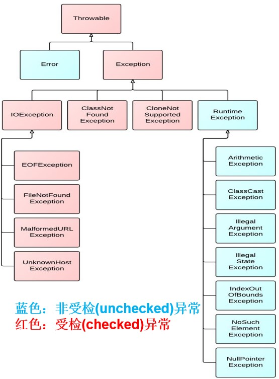
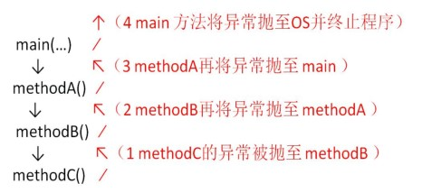
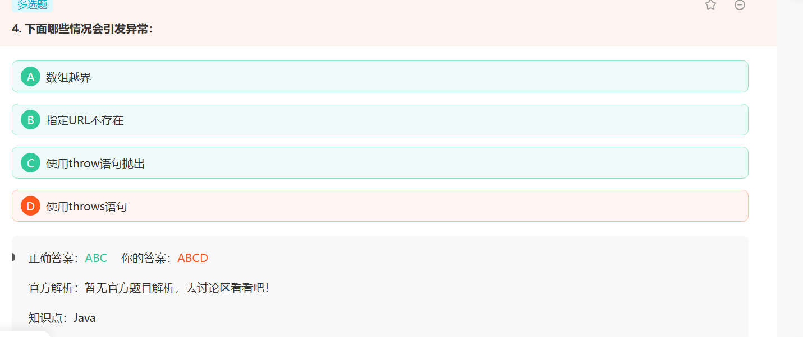

Java高级应用


# 异常

## 什么是程序的异常

在进行项目开发的过程中，即使程序员把代码写得`尽善尽美`，在系统的运行过程中仍然会遇到一些问题，因为很多问题不是靠代码能够避免的

- **异常** ：指的是程序在执行过程中，出现的非正常情况，如果不处理最终会导致JVM的非正常停止。

Java把不同的异常用不同的类表示，一旦发生某种异常，就`创建该异常类型的对象`，并且抛出（throw）。然后程序员可以捕获(catch)到这个异常对象，并处理；如果没有捕获(catch)这个异常对象，那么这个异常对象将会导致程序终止。

## Java异常体系

### Throwable

`java.lang.Throwable` 类是Java程序执行过程中发生的异常事件对应的类的根父类。

**Throwable中的常用方法：**

- `public void printStackTrace()`：打印异常的详细信息。

  包含了异常的类型、异常的原因、异常出现的位置、在开发和调试阶段都得使用printStackTrace。

- `public String getMessage()`：获取发生异常的原因。


### Error 和 Exception

Throwable的两个子类：Error和Exception。分别对应着`java.lang.Error`与`java.lang.Exception`两个类。

**Error：**Java虚拟机无法解决的严重问题。如：JVM系统内部错误、资源耗尽等严重情况。必须修改代码，debug

- 例如：StackOverflowError（栈内存溢出）和OutOfMemoryError（堆内存溢出，简称OOM）。

**Exception:** 其它因编程错误或偶然的外在因素导致的一般性问题，需要使用针对性的代码进行处理，使程序继续运行。否则一旦发生异常，程序也会挂掉。例如：

- 空指针访问
- 试图读取不存在的文件
- 网络连接中断
- 数组角标越界

> 说明：
>
> 1. 无论是Error还是Exception，还有很多子类，异常的类型非常丰富。当代码运行出现异常时，特别是我们不熟悉的异常时，不要紧张，把异常的简单类名，拷贝到API文档中去查去认识它即可。
> 2. 我们本章讲的异常处理，其实是通过异常处理机制处理Exception，而Error必须要程序员找到错误代码并修改。

### 编译时异常和运行时异常

Java程序的执行分为编译时过程和运行时过程。有的错误只有在`运行时`才会发生。比如：除数为0，数组下标越界等。

因此，根据异常可能出现的阶段，可以将异常分为：

- **编译时期异常**（即checked异常、受检异常）：在代码编译阶段，编译器就能明确`警示`当前代码`可能发生（不是一定发生）`xx异常，并`明确督促`程序员提前编写处理它的异常处理代码。如果程序员`没有编写`对应的异常处理代码，则编译器就会直接判定编译失败，从而不能生成字节码文件。通常，这类异常的发生不是由程序员的代码引起的，或者不是靠加简单判断就可以避免的，例如：FileNotFoundException（文件找不到异常）。

- **运行时期异常**（即runtime异常、unchecked异常、非受检异常）：代码运行到出错的地方并确实发生了xx异常，它才能被发现。

  - **java.lang.RuntimeException**类及它的子类都是运行时异常。比如：ArrayIndexOutOfBoundsException数组下标越界异常，ClassCastException类型转换异常。

    下图是Java异常处理类的体系图




## 异常处理机制

- Java程序的执行过程中如出现异常，会生成一个异常类对象，该异常对象将被提交给Java运行时系统，这个过程称为`抛出(throw)异常`。
- 如果一个方法内抛出异常，该异常对象会被抛给调用者方法中处理。如果异常没有在调用者方法中处理，它继续被抛给这个调用方法的上层方法。这个过程将一直继续下去，直到异常被处理。这一过程称为`捕获(catch)异常`。
- 如果一个异常回到main()方法，并且main()也不处理，则程序运行终止。

**Java异常处理的方式：**

方式一：try-catch-finally

方式二：throws + 异常类型


### 方式1：捕获异常（try-catch-finally）

```java
try{
	......	//可能产生异常的代码
}
catch( 异常类型1 e ){
	......	//当产生异常类型1型异常时的处置措施
}
catch( 异常类型2 e ){
	...... 	//当产生异常类型2型异常时的处置措施
}  
finally{
	...... //无论是否发生异常，都无条件执行的语句
} 

```

**整体执行过程：**

当某段代码可能发生异常，不管这个异常是编译时异常（受检异常）还是运行时异常（非受检异常），我们都可以使用try块将它括起来，并在try块下面编写catch分支尝试捕获对应的异常对象。

- 如果在程序运行时，try块中的代码没有发生异常，那么catch所有的分支都不执行。
- 如果在程序运行时，try块中的代码发生了异常，根据异常对象的类型，将从上到下选择**第一个**匹配的catch分支执行。**此时try中发生异常的语句，其下面的代码将不执行**，而整个try...catch之后的代码可以继续运行。
- 如果在程序运行时，try块中的代码发生了异常，但是所有catch分支都无法匹配（捕获）这个异常，那么JVM将会终止当前方法的执行，并把异常对象“抛”给调用者。如果调用者不处理，程序就挂了。

注意：

1. 如果有多个catch分支，并且多个异常类型有父子类关系，必须保证小的子异常类型在上，大的父异常类型在下。否则，报错。
2. **因为异常会引发程序跳转，从而会导致try中发生异常的语句下面的代码执行不到。**而程序中有一些特定的代码无论异常是否发生，都`需要执行`。例如，数据库连接、输入流输出流、Socket连接、Lock锁的关闭等，这样的代码通常就会放到finally块中。所以，我们通常将一定要被执行的代码声明在finally中。
3. 前面使用的异常都是`RuntimeException类`或是它的`子类`，这些类的异常的特点是：即使没有使用try和catch捕获，Java自己也能捕获，并且编译通过 ( 但运行时会发生异常使得程序运行终止 )。所以，对于这类异常，可以不作处理，因为这类异常很普遍，若全处理可能会对程序的可读性和运行效率产生影响。
4. 如果抛出的异常是IOException等类型的`非运行时异常`，则必须捕获，否则`编译错误`。也就是说，**我们必须处理编译时异常，将异常进行捕捉，转化为运行时异常。**


  先来看一段代码：

```java
public abstract class Test {     
    public static void main(String[] args) {         
        System.out.println(beforeFinally());     
    }          
    public static int beforeFinally(){         
        int a = 0;         
        try{             
            a = 1;             
            return a;         
        }
        finally{             
            a = 2;
        }     
    } 
} 
/**output: 1 */
```

  从结果上看，貌似`finally` 里的语句是在`return` 之后执行的，其实不然，实际上`finally` 里的语句是在在`return` 之前执行的。那么问题来了，既然是在之前执行，那为什么`a` 的值没有被覆盖了？
  实际过程是这样的：当程序执行到try{}语句中的return方法时，它会干这么一件事，将要返回的结果存储到一个临时栈中，然后程序不会立即返回，而是去执行finally{}中的程序，   **在执行`a = 2`时，程序仅仅是覆盖了a的值，但不会去更新临时栈中的那个要返回的值**  。执行完之后，就会通知主程序“finally的程序执行完毕，可以请求返回了”，这时，就会将临时栈中的值取出来返回。这下应该清楚了，要返回的值是保存至临时栈中的。
  再来看一个例子,稍微改下上面的程序：

```java
 public abstract class Test {     
     public static void main(String[] args) {         
         System.out.println(beforeFinally());     
     }          
     public static int beforeFinally(){         
         int a = 0;         
         try{             
             a = 1;             
             return a;         
         }finally{             
             a = 2;             
             return a;         
         }     
     } 
 } 
/**output: 2 */
```

 在这里，finally{}里也有一个return，那么在执行这个return时，就会**更新临时栈中的值**。同样，在执行完finally之后，就会通知主程序请求返回了，即将临时栈中的值取出来返回。故返回值是2. 


### 方式2：声明抛出异常类型（throws）

如果在编写方法体的代码时，某句代码可能发生某个`编译时异常`，不处理编译不通过，但是在当前方法体中可能`不适合处理`或`无法给出合理的处理方式`，则此方法应`显式地`声明抛出异常，表明该方法将不对这些异常进行处理，而是将异常抛给该方法的调用者。



> 上图中，main方法中调用methodA方法，在methodA中又调用methodB方法，在methodB中又调用methodC方法，在methodC方法中出现异常，但是程序员不想在methodC方法中处理异常，因此可以使用throws关键字，将methodC中出现的异常抛给methodC方法的调用者，由其调用者决定是继续抛给调用者还是将异常直接处理了。

throws的使用格式：

在方法声明中用`throws语句`可以声明抛出异常的列表，throws后面的异常类型可以是方法中产生的异常类型，也可以是它的父类。

```java
修饰符 返回值类型 方法名(参数) throws 异常类名1,异常类名2…{   }	
```

在throws后面可以写多个异常类型，用逗号隔开。

举例：

```java
public void readFile(String file)  throws FileNotFoundException,IOException {
	...
	// 读文件的操作可能产生FileNotFoundException或IOException类型的异常，因此在方法声明那一行抛出了     // 这俩异常
	FileInputStream fis = new FileInputStream(file);
}
```

### throws 使用举例

**举例：针对于编译时异常**

```java
package com.atguigu.keyword;

public class TestThrowsCheckedException {
    public static void main(String[] args) {
        System.out.println("上课.....");
        try {
            afterClass();//换到这里处理异常
        } catch (InterruptedException e) {
            e.printStackTrace();
            System.out.println("准备提前上课");
        }
        System.out.println("上课.....");
    }

    public static void afterClass() throws InterruptedException {
        for(int i=10; i>=1; i--){
            Thread.sleep(1000);//本来应该在这里处理异常
            System.out.println("距离上课还有：" + i + "分钟");
        }
    }
}

```

**举例：针对于运行时异常：**

throws后面也可以抛运行时异常类型，只是运行时异常类型，写或不写对于编译器和程序执行来说都没有任何区别。如果写了，唯一的区别就是调用者调用该方法后，使用try...catch结构时，IDEA可以获得更多的信息，需要添加哪种catch分支。



1、throws出现在方法头，throw出现在方法体
2、throws表示如果出现异常就往外抛；throw则是抛出异常，执行throw则一定抛出了某种异常。

### 两种异常处理方式的选择

前提：对于异常，使用相应的处理方式。此时的异常，主要指的是编译时异常。

- 如果程序代码中，涉及到资源的调用（流、数据库连接、网络连接等），则必须考虑使用try-catch-finally来处理，保证不出现内存泄漏。
- 如果父类被重写的方法没有throws异常类型，则子类重写的方法中如果出现异常，只能考虑使用try-catch-finally进行处理，不能throws。
- 开发中，方法a中依次调用了方法b,c,d等方法，方法b,c,d之间是递进关系。此时，如果方法b,c,d中有异常，我们通常选择使用throws，而方法a中通常选择使用try-catch-finally。

## 手动抛出异常对象：throw

Java 中异常对象的生成有两种方式：

- 由虚拟机**自动生成**：程序运行过程中，虚拟机检测到程序发生了问题，那么针对当前代码，就会在后台自动创建一个对应异常类的实例对象并抛出。
- 由开发人员**手动创建**：`new 异常类型([实参列表]);`，如果创建好的异常对象不抛出对程序没有任何影响，和创建一个普通对象一样，但是一旦throw抛出，就会对程序运行产生影响了。

### 5.1 使用格式

```java
throw new 异常类名(参数);
```

throw语句抛出的异常对象，和JVM自动创建和抛出的异常对象一样。

- 如果是编译时异常类型的对象，同样需要使用throws或者try...catch处理，否则编译不通过。

- 如果是运行时异常类型的对象，编译器不提示。

- 可以抛出的异常必须是Throwable或其子类的实例。下面的语句在编译时将会产生语法错误：

  ```java
  throw new String("want to throw");
  ```

### 5.2 使用注意点

无论是编译时异常类型的对象，还是运行时异常类型的对象，如果没有被try...catch合理的处理，都会导致程序崩溃。

throw语句会导致程序执行流程被改变，throw语句是明确抛出一个异常对象，因此它`下面的代码将不会执行`。

如果当前方法没有try...catch处理这个异常对象，throw语句就会`代替return语句`提前终止当前方法的执行，并返回一个异常对象给调用者。

```java
package com.atguigu.keyword;

public class TestThrow {
    public static void main(String[] args) {
        try {
            System.out.println(max(4,2,31,1));
        } catch (Exception e) {
            e.printStackTrace();
        }
        try {
            System.out.println(max(4));
        } catch (Exception e) {
            e.printStackTrace();
        }
        try {
            System.out.println(max());
        } catch (Exception e) {
            e.printStackTrace();
        }
    }

    public static int max(int... nums){
        if(nums == null || nums.length==0){
            throw new IllegalArgumentException("没有传入任何整数，无法获取最大值");
        }
        int max = nums[0];
        for (int i = 1; i < nums.length; i++) {
            if(nums[i] > max){
                max = nums[i];
            }
        }
        return max;
    }
}

```

## 自定义异常

[06、异常：异常的两种处理方式_哔哩哔哩_bilibili](https://www.bilibili.com/video/BV1Cv411372m?p=135&spm_id_from=pageDriver&vd_source=5a374f315281b0338a0b7fd69b8b8e98)


# 常用的类与API

接下来要讲的类与API呢，都是非常常用的，直接看API文档或者源码，根本看不懂一点，因此，这里的建议是跟着学，以及上网搜具体用法。等你做了几年Java程序员，写了不少代码，学了各种知识之后，再去阅读API文档或者源码。

## String类

### 声明部分与重要版本变化

看看源码中String类声明:

```java
public final class String
    implements java.io.Serializable, Comparable<String>, CharSequence{}
```

可以看到的有：

- String类被final修饰，说明不可被继承。
- String类没有显示继承某个类，说明继承Object类
- String类实现了三个接口，目前不用了解这三个接口是什么内容，后面慢慢就知道了，了解即可。


看看源码中String类的重要的属性:

```java
/** The value is used for character storage. */
private final char value[];

//这个是jdk8及以前，用来存储字符串的。 看来String类存储字符串的方式使用字符数组。
```

**字符数组被final修饰，且数组是引用类型，因此，该字符数组的值，存的是地址，即地址不能再改变，但是可以对数组的内容重新赋值。**


下面是jdk17关于String类的部分代码：

```java
public final class String
    implements java.io.Serializable, Comparable<String>, CharSequence,
               Constable, ConstantDesc {

    /**
     * The value is used for character storage.
     *
     * @implNote This field is trusted by the VM, and is a subject to
     * constant folding if String instance is constant. Overwriting this
     * field after construction will cause problems.
     *
     * Additionally, it is marked with {@link Stable} to trust the contents
     * of the array. No other facility in JDK provides this functionality (yet).
     * {@link Stable} is safe here, because value is never null.
     */
    @Stable
    private final byte[] value;
```

上面源码中的注释是下面这张图，可以看到注释中  @implNote 被搞成了 下图中的Implementation Note，也就是 `实现说明`的意思。 这部分是啥意思看不太懂。


可以看到相比java8，多了俩接口，这不重要，重要的是，String类存储字符的方式从字符数组变成了byte数组。

我们知道，字符数组中一个位置占一个字符，一个字符是俩byte，现在将存储字符的数组从字符数组变成了byte数组了。对于存储像ascii字符表中的字符来说是好事，因为原先存储一个字符要占据俩字节，但一个字符只需一个byte，多出来的就被浪费掉了。现在好了，直接用byte数组来存了。

但是如果存储像中文这样占俩字节的字符来说，从字符数组到byte数组的转变，只有一点坏处，就是对程序员来说，要记住一个中文字符要占俩位置了。对于存储方面没有坏影响。

算是内存优化吧。


### 字符串常量池及实例化过程解析

> 什么是常量？
>
> 在程序运行过程中，其值不能被改变的量称为常量。例如，字面值就是一种常量，被final修饰的也是一种常量。


String类是我们平常项目中使用频率非常高的一种类型，jvm为了提升性能和减少内存开销，避免字符串的重复创建，其维护了一块特殊的内存空间，即字符串常量池。


String类的实例化(即创建对象)的方式有两种，一种是直接赋值，一种是构造方法实现其实例化。


直接赋值：

当使用直接赋值的方式定义一个String类对象时，会在字符串常量池中创建此字符串对象，如果后续还有其他String类对象也采用了直接赋值的方式，并且设置了同样字符串内容，那么将不会开辟新的堆内存空间，而是将已有的对象的引用进行赋值。

1. 执行`String s1= "hello";`后，JVM在常量池中创建一个字符串为`hello`的String类对象,并让s1指向该对象
2. 执行`String s2= "hello";`时，JVM会先检查常量池中是否存在字符串为`hello`的String类对象，如果存在就直接让s2指向该空间，否则就会在开辟一个新的空间存放该字符串，并让s2指向该对象。

```java
String s1 = "hello";
String s2 = "hello";
System.out.println(s1 == s2);  // true
//在java中，关系运算符==如果用在String类上则表示内存地址数值的比较是否相同，
//由打印得到true可知，这俩指向的是同一个String类对象，即在字符串常量池中创建的那个对象。

s2 = "hi";
// JVM会先检查常量池中是否存在字符串为`hi`的String类对象，如果存在就直接让s2指向该空间，否则就会在开辟一个新的空间存放该字符串，并让s2指向该对象。
```


通过构造器实现实例化：

如果采用String类的构造方法实例化String对象的话,首先，在字符串常量池中创建一个字符串为`hello`的String类对象，然后将该对象传递给构造器，通过构造器，会在堆中再创建一个字符串为`hello`的String类对象，并返回此对象的引用（地址），即str指向的对象是堆中创建的对象。

这个过程一共创建了两个String类对象。

```java
String str = new String("hello");
```


就相当于下面这样：

```java
String s = "hello";
String str = new String(s);
```


进一步理解：


> 我想获得String类对象的value值，看看是否是这样的。问了一下GPT：
>
> 我：在Java中如何获得String类对象的属性value的值？
>
> ChatGPT：
>
> 在Java中，String类的属性value是一个char数组，用于存储字符串的字符。然而，String类并没有提供直接访问该属性的公共方法，因为String类是不可变的，它的内部数据是私有的，并且不能被外部修改。
>
> 尽管如此，你仍然可以通过反射来获取String对象的属性value的值。下面是一个示例代码：
>
> ```
> javaCopy code
> import java.lang.reflect.Field;
> 
> public class Main {
>  public static void main(String[] args) throws NoSuchFieldException, IllegalAccessException {
>      String str = "Hello, world!";
>      
>      // 使用反射获取String类的属性value
>      Field valueField = String.class.getDeclaredField("value");
>      valueField.setAccessible(true); // 将私有属性设置为可访问
>      char[] value = (char[]) valueField.get(str); // 获取属性值
>      
>      // 打印属性值
>      System.out.println(value);
>  }
> }
> ```
>
> 需要注意的是，这种方法依赖于反射，可能会在某些环境中受到限制，而且不建议在生产环境中广泛使用。
>
> 这里需要借助反射，不过我还没学到。。。先留着。。。


练习：自己写写这个过程，


### intern()方法

intern()方法是String类里的方法。

```java
public String intern()  //函数声明：无参数，返回值是String类对象
```

当调用 intern() 方法时，如果字符串池中已经存在相同内容的字符串，则返回字符串池中的引用；否则，将该字符串添加到字符串池中，并返回对字符串池中的新引用。

```java
public class RunoobTest {
    public static void main(String args[]) {
        String str1 = "Runoob";
        String str2 = new String("Runoob");
        String str3 = str2.intern();

        System.out.println(str1 == str2);  // false
        System.out.println(str1 == str3);  // true
        }
}
```


### replace方法

看源码，结合实例化过程解析一下发生了什么。。。


### 拼接

拼接过程具体发生了什么，以及版本变化带来了什么改变。👇

#### 常量+常量

**常量折叠**，是一种编译器优化技术。编译的时候就可以确定其值的常量，在进行运算的时候，在编译阶段就完成了。

```java
String s1 = "hello" + "world";
// 在编译阶段，编译器会直接优化成下面的语句
String s1 = "helloworld";
```

同理，

```java
final String s1 = "hello";
final String s2 = "world";
String s3 = s1 + s2;   // 等价于 String s3 = "helloworld";
```

s3指向的是常量池中的String类对象。

#### 变量+变量或变量+常量

```java
String s1 = "hello";
String s2 = "world";
String s3 = s1 + s2;  //变量+变量
String s4 = "hello" + s2; //常量+变量
```

底层实现：

```java
String s3 = new StringBuffer(s1).append(s2).toString(); 
```

StringBuffer类中的toString()方法返回的是new出来的String类对象。因此s3指向的是堆空间的String类对象。


> 细节：字符串常量池到底保存的是字符串对象还是字符串对象的引用？

在学习过上面的内容后，学习最后一个问题，看下面一段代码：

```java
String s3 = new String("1") + new String("1");
s3.intern();
String s4 = "11";
System.out.println(s3 == s4);

----------------
JDK 6 输出 : false
JDK 7 输出 : true    
```


先说结论：在 JDK 6 及以前版本，字符串常量池保存字符串对象；JDK 6 之后的版本中，既保存了字符串对象，又保存了字符串对象的引用。


在 `String s3 = new String("1") + new String("1");`执行完后，堆中新建了两个字符串为 `1` 的匿名对象，这俩匿名对象是变量拼接，最后s3指向堆中 字符串为 `11`的对象。

在 `s3.intern();`执行完后，由于常量池中没有 字符串为 `11`的对象，因此会在常量池中新建一个 `11`对象。

在 `String s4 = "11";`执行完后，s4指向常量池中的 `11`对象。

最后 `System.out.println(s3 == s4);`判断 s3和s4是否指向同一对象。

在JDK6及以前的版本中，输出的结果为 false ，说明 s3 和s4 不是指向同一个对象。

在JDK6以后的版本中，输出结果为 true，实际上， 在执行完 `s3.intern();`后，此时常量池中没有字符串为`11`的对象，而堆中有字符串为`11`的对象，因此就直接将该对象的引用传入到了常量池中，并没有像JDK6及以前的版本一样新建一个一模一样的字符串对象了。


原因：在JDK7中，将字符串常量池从方法区移到了堆中。

#### concat()


### 常用API

#### 构造器

- `public String() ` ：初始化新创建的 String对象，以使其表示空字符序列。
- ` String(String original)`： 初始化一个新创建的 `String` 对象，使其表示一个与参数相同的字符序列；换句话说，新创建的字符串是该参数字符串的副本。
- `public String(char[] value) ` ：通过当前参数中的字符数组来构造新的String。
- `public String(char[] value,int offset, int count) ` ：通过字符数组的一部分来构造新的String。
- `public String(byte[] bytes) ` ：通过使用平台的**默认字符集**解码当前参数中的字节数组来构造新的String。
- `public String(byte[] bytes,String charsetName) ` ：通过使用指定的字符集解码当前参数中的字节数组来构造新的String。

#### String与其他结构间的转换

**字符串 --> 基本数据类型、包装类：**

- Integer包装类的public static int parseInt(String s)：可以将由“数字”字符组成的字符串转换为整型。
- 类似地，使用java.lang包中的Byte、Short、Long、Float、Double类调相应的类方法可以将由“数字”字符组成的字符串，转化为相应的基本数据类型。

**基本数据类型、包装类 --> 字符串：**

- 调用String类的public String valueOf(int n)可将int型转换为字符串
- 相应的valueOf(byte b)、valueOf(long l)、valueOf(float f)、valueOf(double d)、valueOf(boolean b)可由参数的相应类型到字符串的转换。

 **字符数组 -->  字符串：**

- String 类的构造器：String(char[]) 和 String(char[]，int offset，int length) 分别用字符数组中的全部字符和部分字符创建字符串对象。 

 **字符串 -->  字符数组：**

- public char[] toCharArray()：将字符串中的全部字符存放在一个字符数组中的方法。
- public void getChars(int srcBegin, int srcEnd, char[] dst, int dstBegin)：提供了将指定索引范围内的字符串存放到数组中的方法。

**字符串 --> 字节数组：（编码）**

- public byte[] getBytes() ：使用平台的默认字符集将此 String 编码为 byte 序列，并将结果存储到一个新的 byte 数组中。
- public byte[] getBytes(String charsetName) ：使用指定的字符集将此 String 编码到 byte 序列，并将结果存储到新的 byte 数组。

 **字节数组 --> 字符串：（解码）**

- String(byte[])：通过使用平台的默认字符集解码指定的 byte 数组，构造一个新的 String。
- String(byte[]，int offset，int length) ：用指定的字节数组的一部分，即从数组起始位置offset开始取length个字节构造一个字符串对象。
- String(byte[], String charsetName ) 或 new String(byte[], int, int,String charsetName )：解码，按照指定的编码方式进行解码。


（1）boolean isEmpty()：字符串是否为空
（2）int length()：返回字符串的长度
（3）String concat(xx)：拼接
（4）boolean equals(Object obj)：比较字符串是否相等，区分大小写
（5）boolean equalsIgnoreCase(Object obj)：比较字符串是否相等，不区分大小写
（6）int compareTo(String other)：比较字符串大小，区分大小写，按照Unicode编码值比较大小
（7）int compareToIgnoreCase(String other)：比较字符串大小，不区分大小写
（8）String toLowerCase()：将字符串中大写字母转为小写
（9）String toUpperCase()：将字符串中小写字母转为大写
（10）String trim()：去掉字符串前后空白符
（11）public String intern()：结果在常量池中共享


（11）boolean contains(xx)：是否包含xx
（12）int indexOf(xx)：从前往后找当前字符串中xx，即如果有返回第一次出现的下标，要是没有返回-1
（13）int indexOf(String str, int fromIndex)：返回指定子字符串在此字符串中第一次出现处的索引，从指定的索引开始
（14）int lastIndexOf(xx)：从后往前找当前字符串中xx，即如果有返回最后一次出现的下标，要是没有返回-1
（15）int lastIndexOf(String str, int fromIndex)：返回指定子字符串在此字符串中最后一次出现处的索引，从指定的索引开始反向搜索。


（16）String substring(int beginIndex) ：返回一个新的字符串，它是此字符串的从beginIndex开始截取到最后的一个子字符串。 
（17）String substring(int beginIndex, int endIndex) ：返回一个新字符串，它是此字符串从beginIndex开始截取到endIndex(不包含)的一个子字符串。 


（18）char charAt(index)：返回[index]位置的字符
（19）char[] toCharArray()： 将此字符串转换为一个新的字符数组返回
（20）static String valueOf(char[] data)  ：返回指定数组中表示该字符序列的 String
（21）static String valueOf(char[] data, int offset, int count) ： 返回指定数组中表示该字符序列的 String
（22）static String copyValueOf(char[] data)： 返回指定数组中表示该字符序列的 String
（23）static String copyValueOf(char[] data, int offset, int count)：返回指定数组中表示该字符序列的 String


（24）boolean startsWith(xx)：测试此字符串是否以指定的前缀开始 
（25）boolean startsWith(String prefix, int toffset)：测试此字符串从指定索引开始的子字符串是否以指定前缀开始
（26）boolean endsWith(xx)：测试此字符串是否以指定的后缀结束 


（27）String replace(char oldChar, char newChar)：返回一个新的字符串，它是通过用 newChar 替换此字符串中出现的所有 oldChar 得到的。 不支持正则。
（28）String replace(CharSequence target, CharSequence replacement)：使用指定的字面值替换序列替换此字符串所有匹配字面值目标序列的子字符串。 
（29）String replaceAll(String regex, String replacement)：使用给定的 replacement 替换此字符串所有匹配给定的正则表达式的子字符串。 
（30）String replaceFirst(String regex, String replacement)：使用给定的 replacement 替换此字符串匹配给定的正则表达式的第一个子字符串。 


## StringBuffer、StringBuilder

因为String对象是不可变对象，虽然可以共享常量对象，但是对于频繁字符串的修改和拼接操作，效率极低，空间消耗也比较高。因此，JDK又在java.lang包提供了可变字符序列StringBuffer和StringBuilder类型。

[08、常用API（一）：StringBuilder、StringBuffer、StringJoiner_哔哩哔哩_bilibili](https://www.bilibili.com/video/BV1Cv411372m?p=118&spm_id_from=pageDriver&vd_source=5a374f315281b0338a0b7fd69b8b8e98)

链式编程


StringJoiner格式化字符串


## Math、System、Runtime

[01、常用API(二)：Math、System、Runtime_哔哩哔哩_bilibili](https://www.bilibili.com/video/BV1Cv411372m?p=119&vd_source=5a374f315281b0338a0b7fd69b8b8e98)

下面代码输出是？

```java
`double` `d1=-0.5;``System.out.println(``"Ceil d1="``+Math.``ceil``(d1));``System.out.println(``"floor d1="``+Math.``floor``(d1));`
```

A 、 Ceil d1=-0.0 floor d1=-1.0

B 、Ceil d1=0.0 floor d1=-1.0

选A

解释：

```java
Math.ceil(d1) 
```

  ceil 方法上有这么一段注释：If the argument value is less than zero but     greater than -1.0, then the result  is negative zero 

  如果参数小于0且大于-1.0，结果为 -0 

```java
Math.floor(d1)
```

  ceil 和 floor 方法 上都有一句话：If the argument is NaN or an infinity     or positive zero or negative zero, then the result is the same as    the argument，意思为：如果参数是 NaN、无穷、正 0、负 0，那么结果与参数相同


## BigDecimal


## JDK8之前：日期时间API


## JDK8：新的日期时间API


## 正则表达式

[03、正则表达式：概述、初体验、匹配规则_哔哩哔哩_bilibili](https://www.bilibili.com/video/BV1Cv411372m?p=132&vd_source=5a374f315281b0338a0b7fd69b8b8e98)

[Pattern (Java SE 17 & JDK 17) (oracle.com)](https://docs.oracle.com/en/java/javase/17/docs/api/java.base/java/util/regex/Pattern.html)


# 泛型

## 理解

Java 泛型（generics）是 JDK 5 中引入的一个新特性

泛型说白了就是将`类型` 参数化。可以用在**类、方法和接口**中，分别被称为`泛型类`、`泛型方法`、`泛型接口`。

举个例子：

比如我想实现不同类型对象的打印输出功能：

思路：为每一个类型写一个类来实现打印功能

```java
public class IntegerPrinter {     // 实现Integer类的打印功能
    Integer i;
    IntegerPrinter(Integer i) {
        this.i = i;
    }
    public void print() {
        System.out.println(i);
    }
}
```

```java
public class StringPrinter {     // 实现String类的打印功能
    String s;
    StringPrinter(String s) {
        this.s = s;
    }
    public void print() {
        System.out.println(s);
    }
}
```

多的就不写了，下面调用一下：

```java
public class Main {
    public static void main(String[] args) {
        IntegerPrinter p = new IntegerPrinter(12);
        p.print();    // 12
        StringPrinter s = new StringPrinter("hello");
        s.print();   // hello
    }
}
```

我们也可以以用多态来实现：

```java
public class Printer {
    Object o;
    Printer(Object o) {
        this.o = o;
    }
    public void print() {
        System.out.println(o.toString());
    }
}
```

```java
public class Main {
    public static void main(String[] args) {
        Printer p = new Printer(12);
        p.print();
        Printer v = new Printer("123");
        v.print();
    }
}
-----------
12
123    
```

但是这样存在一个问题：


这里引出类型安全问题，期望在编译的时候就发现异常，而不是运行时。

> ## 安全问题
>
> 因为Object类型可以接收任意类型的对象，在实际的使用中，会存在类型转换的问题，所以Java提供了**泛型**来解决这个安全问题。
>
> 泛型背景：用Object去接收各种数据的话，这些数据都会自动向上转型为Object，所以Object对象随便接收其他类型的数据，很方便。但是在使用的时候需要再进行一次向下转型，否则很多操作都无法进行。比如Object o = 5，就是将Integer转为Object，如果不向下转型的话，这个Object的o是无法进行加减乘除操作的。但是转型只能发生在有继承关系的两个类中，所以盲目的对没有继承关系的类进行强制转型就容易引起转型异常(ClassCastException)
>
> 来看一个经典案例：
>
> ```java
> import java.util.ArrayList;
> public static void main(String[] args) {
>     ArrayList arrayList = new ArrayList();
>     arrayList.add("helloWorld");
>     arrayList.add("taiziyenezha");
>     arrayList.add(88);
>     
>     // 需求：打印每个字符串的长度
>     for (int i = 0; i < arrayList.size(); i++) {
>         String str = (String) arrayList.get(i);
>         System.out.println(str.length());
>     }
> }
> ```
>
> 运行这段代码，程序在运行时发生了异常：
> `Exception in thread "main" java.lang.ClassCastException: java.lang.Integer cannot be cast to java.lang.String`
> 发生了数据类型转换异常，这是为什么？
>
> 由于ArrayList可以存放任意类型的元素。例子中添加了俩String类型，一个Integer类型，在代码运行到Integer类型的值时，需要强转为String类型，运行到这一步的时候就报错了。因为Integer类型是不能强转为String类型的，即引发了ClassCastException，因此程序崩溃了。
>
> 这显然不是我们所期望的，如果程序有潜在的错误，我们更期望在编译时被告知错误，而不是在运行时报异常。而为了解决类似这样的问题（在编译阶段就可以解决），在jdk1.5后，泛型应运而生。让你在设计API时可以指定类或方法支持泛型，这样我们使用API的时候也变得更为简洁，并得到了编译时期的语法检查。
>
> 我们将第一行声明初始化ArrayList的代码更改一下，编译器就会在编译阶段就能够帮我们发现类似这样的问题。现在再看看效果。
> ArrayList\<String> arrayList = new ArrayList<>();
> arrayList.add("helloWorld");
> arrayList.add("taiziyenezha");
> arrayList.add(88);// 在编译阶段，编译器就会报错
> 这样可以避免了我们类型强转时出现异常。

因此，泛型应运而生，一方面可以提高代码复用，另一方面解决类型安全问题。

接下来我们看看泛型怎么解决问题：

现在我们用泛型来重写一下此功能：

```java
public class Printer<T> {     
    T t;               // t是泛型变量
    Printer(T t) {
        this.t
    }
    public void print() {
        System.out.println(t);
    }
}
```

```java
public class Main {
    public static void main(String[] args) {
        Printer<Integer> p = new Printer<Integer>(12);
        p.print();    // 12
        Printer<String> s = new Printer<String>("hello");
        s.print();   // hello
    }
}
```

看上面的例子可知：

在类的定义中出现的 `<T>` ，其中 `T`是形式参数，`Integer`，`String`是实参。

注意：

1. **实参不能是基本数据类型，只能是类。**
2. T是形参名而已，也可以写成其他符号。

因此，泛型的概念就是**将  对象的类型 参数化**


在上面的例子中，泛型提高了代码的复用性。

接下来，我们来看看在类、方法、接口中是如何体现泛型的：

## 泛型类

```java
//泛型类的基本格式：
[权限修饰符] class 类名<形参列表>{} 
```

补充：

1. `形参列表`意味着可以传多个参数进去

   ```java
   public class Identity <T,K>{
       T t;
       K k;
       Identity(T t,K k) {
           this.t = t;
           this.k = k;
       }
       public void print() {
           System.out.println(k+"的身份证号:"+t);
       }
   }
   ```

   ```java
   public class Main {
       public static void main(String[] args) {
           Identity<Integer,String> i =
                   new Identity<Integer,String>(12345678,"小明");
           i.print();    //  小明的身份证号:12345678
       }
   }
   ```

2. 定义的泛型类，不是必须传入泛型类型实参，也可以不传，但会出现类型安全问题。
   在使用泛型的时候如果不传入泛型类型实参的话

   ```java
   public class Identity <T,K>{
       T t;
       K k;
       Identity(T t,K k) {
           this.t = t;
           this.k = k;
       }
       public void print() {
           System.out.println(k+"的身份证号:"+t);
       }
   }
   ```

   ```java
   // 如果上面的泛型不用的话，即不传实参的话：
   
   public class Main {
       public static void main(String[] args) {
           Identity i = new Identity();  // 这里没有传类型参数，此时该怎么办呢？
       }
   }
   ```

   ```java
   public class Identity {          //不使用泛型的话就按这个办。
       Object t;
       Object k;
       Identity(Object t,Object k) {
           this.t = t;
           this.k = k;
       }
       public void print() {
           System.out.println(k+"的身份证号:"+t);
       }
   }
   
   或者
   
   Identity<Object,Object> i = new Identity<Object,Object>();  //传Object的话，相当于没有使用泛型
   ```

   ```java
   //因此，第二块代码修改如下：
   
   public class Main {
       public static void main(String[] args) {
           // 因此，这里需要两个任意类型的对象传进去即可，这里我依旧用integer和String类对象就行。
           String name = "小明";
           Integer id = 123456789;
           Identity i = new Identity(name,id);  
           i.print();
       }
   }
   ```

3. 泛型类的派生

   ```java
   public class Father<E> {
       E e;
   }
   
   //1.派生类里传给T，K。又把T传给父类的E。
   public class Son<T,K> extends Father<T>{}  
   
   //2.如果不给父类传类型实参的话，那传给父类的类型形参的就是Object
   public class Son<T,k> extends Father{} 
   
   //3.也可以给父类传具体的类
   public class Son extends Father<String>{}
   ```

4. 如果在泛型类中的成员方法中使用了`类型形参`就不能声明为static

   ```java
   public class Father <E>{
       public static E print(){}  //会报错
   }
   ```

   原因很简单，我们的E只有在创建对象的时候才会把具体的类传给E，而static方法可以不用创建对象就使用。这样就矛盾了。一会我们会学一个泛型方法，泛型方法可以被static修饰是因为，泛型方法中定义了传参的入口。而这个方法不是泛型方法，因为该方法没有传参入口，传参入口在泛型类名那。传参入口就是`<形参列表>`

## 泛型接口

```java
[权限修饰符] interface 接口名<类型形参列表>{}
```


```java
//定义一个泛型接口
public interface Generator<E> {
    public E next();
}

//1.实现类将T传给E
public class Father<T> implements Generator<T>{}

//2.如果不给接口传类型实参的话，那传给接口的类型形参的就是Object
public class Father<T,k> implements Generator{} 

//3.实现类可以传具体类
public class Father<T> implements Generator<String>{}
```


## 泛型方法

```java
[权限修饰符] <类型形参列表> 返回值类型 函数名(参数列表) {}
```

```java
public class Main {
    public static <T> T print(T t) {   //可以被static修饰，因为有传类型参数的入口,<T>
        System.out.println(t);
        return t;
    }
    public static void main(String[] args) {
        String s = "hello";
        Integer i = 22;
        print(s);      //传s的同时将String传给了T，这是编译器自行推断出来的。也就是说，实参传递就是类型传递的入口。
        print(i);      //传i的同时将Integer传给了T
        System.out.println(print(i));
    }
}
----------
hello
22
22
22    
```

当然也不强制要求必须被static修饰，具体不再举例子。


**可变参数**

可变参数是数据类型确定，但是数据个数不确定

```java
public void foo(String...varargs){}

foo("arg1", "arg2", "arg3");

//上述过程和下面的调用是等价的
foo(new String[]{"arg1", "arg2", "arg3"});
```

对比下面的：

```java
public class Main {
    public static <E> void print(E... e) {   //e是E类型的数组的数组名
        for(E e1 : e) {
            System.out.println(e1);
        }
    }
    public static void main(String[] args) {
        print(1,2,3);        //注意必须是同一类的对象。要是Integer都是Integer
        print("hello","world");    //要是String都是String
    }
}
```


## 约束

对传入类型进行限制：

```java
// 下面要求参数T只接收Animal类及其子类。
public class Person<T extends Animal>{}
```

举个例子：

```java
public class Animal {
    String name;
}
```

```java
public class Cat extends Animal{
    
}
```

```java
public class OrangeCat extends Cat{
    
}
```

```java
public class Person<T extends Animal> {   // 该参数T只接收Animal以及Animal的所有子类
    T t;
    Person(T t){
        this.t = t;
    }
    public void PrintName(){
       // 因此，在该类中，类型为T的对象t可以使用Animal继承下去的属性和方法，因为该对象继承了Animal
        System.out.println(t.name);
    }
}
```

```java
public class Main {
    public static void main(String[] args) {
        // Animal可以传进去
        Animal a = new Animal();
        Person<Animal> t = new Person<Animal>(a);
        t.print();
        // 直接子类Cat也能传进去
        Cat c = new Cat();
        Person<Cat> p = new Person<Cat>(c);
        p.print();
        // 子类的子类OrangeCat也能传进去
        OrangeCat o = new OrangeCat();
        Person<OrangeCat> q = new Person<OrangeCat>(o);
        q.print();
    }
}
```


(extends)约束接口

```java
// Id是一个接口，
<T extends Id>
// T可以接收Id的子接口或Id的实现类，我试了一下都没啥问题。
```


总结：extends后面可以接 接口或类，约束类型参数是其子接口或实现类、子类。


多绑定

```java
<T extends Comparable & Serializable, U extends Runnable>
<T extends Animal & Comparable>  //如果T绑定了类和接口，类必须写在接口的前面。
// T 可以绑定多个接口，但是只能绑定一个类，因为类是没有多继承特性的，即类只有一个爹。
```


## 常见标记符

**java 中泛型常用的标记符：**

约定俗成的或者说官方就是这样用的。

- **E** - Element (在集合中使用，因为集合中存放的是元素)
- **T** - Type（Java 类）
- **K** - Key（键）
- **V** - Value（值）
- **N** - Number（数值类型）


## 类型通配符(wildcard)

java 中泛型通配符：

**？** - 是类型实参，

[07_类型通配符_哔哩哔哩_bilibili](https://www.bilibili.com/video/BV1xJ411n77R?p=7&vd_source=5a374f315281b0338a0b7fd69b8b8e98)

[泛型的上下限要怎么理解_泛型上限-CSDN博客](https://blog.csdn.net/weixin_40251892/article/details/109063161)

[05、面向对象高级三：泛型方法、泛型的通配符和泛型的上下限、泛型注意事项_哔哩哔哩_bilibili](https://www.bilibili.com/video/BV1Cv411372m?p=115&vd_source=5a374f315281b0338a0b7fd69b8b8e98)

这个跟集合有关，先不看。


泛型擦除

它提供了编译期的**类型安全**，避免了在运行时出现ClassCastException。

泛型是工作在编译阶段的，一旦生成class文件，泛型就被擦除了。


## 泛型与数组

[12_泛型与数组_哔哩哔哩_bilibili](https://www.bilibili.com/video/BV1xJ411n77R?p=12&vd_source=5a374f315281b0338a0b7fd69b8b8e98)

这是集合的集合啊。这个不看了。


# 对象比较器

我们知道基本数据类型的数据（除boolean类型外）需要比较大小的话，之间使用比较运算符即可，但是引用数据类型是不能直接使用比较运算符来比较大小的。那么，如何解决这个问题呢？

Java实现对象排序的方式有两种：

- 内部比较器：java.lang.Comparable
- 外部比较器：java.util.Comparator

## Comparable

Comparable是个接口，下面是其定义：

```java
public interface Comparable<T> {
    public int compareTo(T o);
}
```

`<T>`与范型有关，先忽略掉，我们就当成下面这样就可以了。(实际上，如果我们不使用范型的特点，源码就是这样)

```java
public interface Comparable {
    public int compareTo(Object o);
}
```

我们看到Comparable接口只有一个compareTo()方法,该方法接收一个Object类的对象，我们知道Object类是所有类的父类，因此该方法接收任意类型的对象（多态性）


举例说明Comparable接口的使用，看看Comparable接口如何实现对象之间的比较的：

```java
// 1.类实现Comparable接口，重写compareTo方法

public class Person implements Comparable<Person> {
	String name;
	int age;
	
	public Person(String name, int age) {
		this.name = name;
		this.age = age;
	}

    /*
    *	在compareTo方法中编写：*调用该方法的对象*与*形参对象*的比较规则
    */
	@Override
	public int compareTo(Person o) {  
		return this.age - o.age;
	}
    /* 该方法中：
    * 	如果当前对象的年龄大于形参对象的年龄，相减的结果是个正整数。
    *	如果当前对象的年龄等于形参对象的年龄，值为0
    *	如果当前对象的年龄小于形参对象的年龄，值为负整数
    */	
}
```

```java
import java.util.Arrays;   

public class Test {

	public static void main(String[] args) {
        Person p1 = new Person("张三", 20);
        Person p2 = new Person("李四", 18);
        if(p1.compareTo(p2) > 0) {
            System.out.println("张三的年龄比李四大");
        }
}
------------
张三的年龄比李四大    
```

这样就实现了对象之间的比较。


如何实现多个对象之间的排序呢？

可以使用Collections.sort 或 Arrays.sort进行自动排序。（Collections还没学，我们目前只看Arrays）

Arrays类包含有操作数组的一些方法，因此，我们需要先将待排序的对象存放在数组中。

```java
import java.util.Arrays;   //先导入Arrays类

public class Test {
	public static void main(String[] args) {
		Person p1 = new Person("zhangsan", 20);
		Person p2 = new Person("lisi", 18);
		Person p3 = new Person("wangwu", 25);
		
		Person[] persons = {p1, p2, p3};   //将待排序对象存放在数组中
		System.out.println("排序前");
		for (Person person : persons) {
			System.out.println(person.name + ":" + person.age);
		}
		// 使用Arrays.sort()对persons数组进行排序。
		Arrays.sort(persons);
		System.out.println("排序后");
		for (Person person : persons) {
			System.out.println(person.name + ":" + person.age);
		}
	}
}
------------------------
排序前
zhangsan:20
lisi:18
wangwu:25
排序后
lisi:18
zhangsan:20
wangwu:25    
```

下面是Arrays.sort()方法的源码：

```java
    /**
     * Sorts the specified array of objects into ascending order, according
     * to the {@linkplain Comparable natural ordering} of its elements.
     * All elements in the array must implement the {@link Comparable}
     * interface.  Furthermore, all elements in the array must be
     * <i>mutually comparable</i> (that is, {@code e1.compareTo(e2)} must
     * not throw a {@code ClassCastException} for any elements {@code e1}
     * and {@code e2} in the array).
     *
     * <p>This sort is guaranteed to be <i>stable</i>:  equal elements will
     * not be reordered as a result of the sort.
     *
     * <p>Implementation note: This implementation is a stable, adaptive,
     * iterative mergesort that requires far fewer than n lg(n) comparisons
     * when the input array is partially sorted, while offering the
     * performance of a traditional mergesort when the input array is
     * randomly ordered.  If the input array is nearly sorted, the
     * implementation requires approximately n comparisons.  Temporary
     * storage requirements vary from a small constant for nearly sorted
     * input arrays to n/2 object references for randomly ordered input
     * arrays.
     *
     * <p>The implementation takes equal advantage of ascending and
     * descending order in its input array, and can take advantage of
     * ascending and descending order in different parts of the the same
     * input array.  It is well-suited to merging two or more sorted arrays:
     * simply concatenate the arrays and sort the resulting array.
     *
     * <p>The implementation was adapted from Tim Peters's list sort for Python
     * (<a href="http://svn.python.org/projects/python/trunk/Objects/listsort.txt">
     * TimSort</a>).  It uses techniques from Peter McIlroy's "Optimistic
     * Sorting and Information Theoretic Complexity", in Proceedings of the
     * Fourth Annual ACM-SIAM Symposium on Discrete Algorithms, pp 467-474,
     * January 1993.
     *
     * @param a the array to be sorted
     * @throws ClassCastException if the array contains elements that are not
     *         <i>mutually comparable</i> (for example, strings and integers)
     * @throws IllegalArgumentException (optional) if the natural
     *         ordering of the array elements is found to violate the
     *         {@link Comparable} contract
     */
    public static void sort(Object[] a) {
        if (LegacyMergeSort.userRequested)
            legacyMergeSort(a);
        else
            ComparableTimSort.sort(a, 0, a.length, null, 0, 0);
    }
```

看不懂源码不要紧，我们来看文档注释：

> Sorts the specified array of objects into ascending order, according to the natural ordering of its elements. All elements in the array must implement the Comparable interface. Furthermore, all elements in the array must be mutually comparable (that is, e1.compareTo(e2) must not throw a ClassCastException for any elements e1 and e2 in the array).
>
> 翻译一下：根据对象数组的所有元素的自然排序(natural ordering)，将该数组的所有元素整理成(sort)升序(ascending order)。数组中所有的元素必须实现Comparable接口，进一步说，数组中所有的元素必须mutually comparable，即 e1.compareTo(e2)对于数组中任意e1，e2不能抛ClassCastException异常。
>
> 哦，mutually是共同地，comparable是可比的。mutually comparable意思就是说，对于数组中任意两个元素都必须是可比的。
>
> > 什么是natual ordering？下面是定义
> >
> > This interface imposes a total ordering on the objects of each class that implements it. This ordering is referred to as the class's natural ordering, and the class's compareTo method is referred to as its natural comparison method.
> >
> > The interface指的是Comparable接口，这个接口强制规定了一种total ordering，total ordering是一种数学概念，我查了百度，认为是线性顺序。
> >
> > 这个接口对实现该接口的类的对象规定了一种线性顺序，这个顺序被称为该类的natual ordering。并且，这个类的compareTo方法是natual ordering的比较方法，即比较规则。
>
> This sort is guaranteed to be stable: equal elements will not be reordered as a result of the sort.
>
> 这个sort保证是stable，即相同的元素不会被重排为一种排序结果，意思就是只能算作一种排序结果。
>
> Implementation note: This implementation is a stable, adaptive, iterative mergesort that requires far fewer than n lg(n) comparisons when the input array is partially sorted, while offering the performance of a traditional mergesort when the input array is randomly ordered. If the input array is nearly sorted, the implementation requires approximately n comparisons. Temporary storage requirements vary from a small constant for nearly sorted input arrays to n/2 object references for randomly ordered input arrays.
> The implementation takes equal advantage of ascending and descending order in its input array, and can take advantage of ascending and descending order in different parts of the the same input array. It is well-suited to merging two or more sorted arrays: simply concatenate the arrays and sort the resulting array.
> The implementation was adapted from Tim Peters's list sort for Python ( TimSort ). It uses techniques from Peter McIlroy's "Optimistic Sorting and Information Theoretic Complexity", in Proceedings of the Fourth Annual ACM-SIAM Symposium on Discrete Algorithms, pp 467-474, January 1993.
> Params:
> a – the array to be sorted
> Throws:
> ClassCastException – if the array contains elements that are not mutually comparable (for example, strings and integers)
> IllegalArgumentException – (optional) if the natural ordering of the array elements is found to violate the Comparable contract
>
> Implementation note应该是介绍了该方法具体代码中的一些信息。
>
> 那上面的就应该是对那个方法使用的说明。


## Comparator

两种情况：

- 当元素的类没有实现java.lang.Comparable接口而又不能修改类的时候（例如：一些第三方的类，你只有.class文件，没有源文件）如何实现元素之间的比较？
- 如果一个类，实现了Comparable接口，也指定了两个对象的比较大小的规则，但是此时此刻我不想按照它预定义的方法比较大小，但是我又不能修改compareTo方法，因为会影响其他地方的使用，又该怎么办？

JDK在设计类库之初，也考虑到这种情况，所以又增加了一个java.util.Comparator接口。


举例说明Comparator的使用：

Comparator中定义了一个抽象方法：compare方法

```java
public interface Comparator<T>{
    int compare(T o1,T o2);
}

//跟上面一样，省略掉范型，即看成下面这样

public interface Comparator{
    int compare(Object o1,Object o2);
}
```

下面是该方法的注释：

> Compares its two arguments for order. Returns a negative integer, zero, or a positive integer as the first argument is less than, equal to, or greater than the second.
>
> 返回值是负整数：第一个参数小于第二个参数
>
> 返回值是0：俩参数相等
>
> 返回值是正整数：第一个参数大于第二个参数
>
> In the foregoing description, the notation sgn(expression) designates the mathematical signum function, which is defined to return one of -1, 0, or 1 according to whether the value of expression is negative, zero or positive.
> The implementor must ensure that sgn(compare(x, y)) == -sgn(compare(y, x)) for all x and y. (This implies that compare(x, y) must throw an exception if and only if compare(y, x) throws an exception.)
> The implementor must also ensure that the relation is transitive: ((compare(x, y)>0) && (compare(y, z)>0)) implies compare(x, z)>0.
> Finally, the implementor must ensure that compare(x, y)\==0 implies that sgn(compare(x, z))\==sgn(compare(y, z)) for all z.
> It is generally the case, but not strictly required that (compare(x, y)==0) \== (x.equals(y)). Generally speaking, any comparator that violates this condition should clearly indicate this fact. The recommended language is "Note: this comparator imposes orderings that are inconsistent with equals."
> Params:
> o1 – the first object to be compared. o2 – the second object to be compared.
> Returns:
> a negative integer, zero, or a positive integer as the first argument is less than, equal to, or greater than the second.
> Throws:
> NullPointerException – if an argument is null and this comparator does not permit null arguments
> ClassCastException – if the arguments' types prevent them from being compared by this comparator.

```java
public class Person {         
    String name;
    int age;

    public Person(String name, int age) {
        this.name = name;
        this.age = age;
    }
}
```


```java
import java.util.Comparator;

// 定义一个实现Comparator接口的类
public class comparator implements Comparator {
	// 重写compare方法，该方法定义两个对象的比较规则
    @Override
    public int compare(Object o1, Object o2) {
        Person p1 = (Person) o1;
        Person p2 = (Person) o2;

        if(p1.age > p2.age) return 1;
        else if(p1.age == p2.age) return 0;
        else return -1;
    }
}

```

用Collections.sort 或 Arrays.sort方法实现对对象数组的排序。这里依旧以Arrays.sort为例：

```java
Person p1 = new Person("zhangsan", 20);
Person p2 = new Person("lisi", 18);
Person p3 = new Person("wangwu", 25);

Person[] persons = {p1, p2, p3};
System.out.println("排序前");
for (Person person : persons) {
    System.out.println(person.name + ":" + person.age);
}

Arrays.sort(persons,new comparator()); //调用Arrays.sort方法（跟上面Comparable例子中重载）

System.out.println("排序后");
for (Person person : persons) {
    System.out.println(person.name + ":" + person.age);
}

----------------
排序前
zhangsan:20
lisi:18
wangwu:25
排序后
lisi:18
zhangsan:20
wangwu:25    
```

下面是Arrays.sort方法的代码：

```java
    /**
     * Sorts the specified array of objects according to the order induced by
     * the specified comparator.  All elements in the array must be
     * <i>mutually comparable</i> by the specified comparator (that is,
     * {@code c.compare(e1, e2)} must not throw a {@code ClassCastException}
     * for any elements {@code e1} and {@code e2} in the array).
     *
     * <p>This sort is guaranteed to be <i>stable</i>:  equal elements will
     * not be reordered as a result of the sort.
     *
     * <p>Implementation note: This implementation is a stable, adaptive,
     * iterative mergesort that requires far fewer than n lg(n) comparisons
     * when the input array is partially sorted, while offering the
     * performance of a traditional mergesort when the input array is
     * randomly ordered.  If the input array is nearly sorted, the
     * implementation requires approximately n comparisons.  Temporary
     * storage requirements vary from a small constant for nearly sorted
     * input arrays to n/2 object references for randomly ordered input
     * arrays.
     *
     * <p>The implementation takes equal advantage of ascending and
     * descending order in its input array, and can take advantage of
     * ascending and descending order in different parts of the the same
     * input array.  It is well-suited to merging two or more sorted arrays:
     * simply concatenate the arrays and sort the resulting array.
     *
     * <p>The implementation was adapted from Tim Peters's list sort for Python
     * (<a href="http://svn.python.org/projects/python/trunk/Objects/listsort.txt">
     * TimSort</a>).  It uses techniques from Peter McIlroy's "Optimistic
     * Sorting and Information Theoretic Complexity", in Proceedings of the
     * Fourth Annual ACM-SIAM Symposium on Discrete Algorithms, pp 467-474,
     * January 1993.
     *
     * @param <T> the class of the objects to be sorted
     * @param a the array to be sorted
     * @param c the comparator to determine the order of the array.  A
     *        {@code null} value indicates that the elements'
     *        {@linkplain Comparable natural ordering} should be used.
     * @throws ClassCastException if the array contains elements that are
     *         not <i>mutually comparable</i> using the specified comparator
     * @throws IllegalArgumentException (optional) if the comparator is
     *         found to violate the {@link Comparator} contract
     */
    public static <T> void sort(T[] a, Comparator<? super T> c) {
        if (c == null) {
            sort(a);
        } else {
            if (LegacyMergeSort.userRequested)
                legacyMergeSort(a, c);
            else
                TimSort.sort(a, 0, a.length, c, null, 0, 0);
        }
    }
```

可见：第一个参数是对象数组，第二个参数是实现Comparator接口的类。


# 集合框架

需要学习数据结构，相当于c++里的stl

学会具体使用：API文档


java中Hashtable, Vector, TreeSet, LinkedList哪些线程是安全的？

HashTable是线程安全的
Vector是线程安全的ArrayList
TreeSet和LinkedList都不是线程安全的


# stream流

JDK8新特性。

java.util.stream

[07、JDK8新特性：Stream流入门、Stream流的创建_哔哩哔哩_bilibili](https://www.bilibili.com/video/BV1Cv411372m?p=149&vd_source=5a374f315281b0338a0b7fd69b8b8e98)

讲的非常好

# File类与IO流

## java.io.File类

### 介绍

一个**File类的对象**对应磁盘上的某个**文件**或**文件夹**。一个文件或文件夹是由路径名唯一确定的。

路径名分为绝对路径和相对路径。这里我们只用绝对路径，因为相对路径有点绕。


在windows中，路径的表示：`D:\apps\7z` 分隔符用 `\`

在java中路径的表示：因为windows路径中的分隔符与java中的转义符冲突，因此java中路径的分割符可以用 `\\` ，这个代表的意思是 第一个 `\`是转义字符，将第二个转义字符 转义成 正常的字符。

或者分隔符用 `/`。 

当然也支持两者混用，但是最好别这样用。

 `D:\\apps\\7z`  或  `D:/apps/7z` 或 `D:/apps\\7z`


### 构造器

```java
File(String pathname)   

File(String parent, String child)
    
File(File parent, String child)    
```

举例说明：为已知路径名的文件或文件夹创建File类对象，为接下来操作该对象(文件或文件夹)做准备

```java
import java.io.File;

public class Main {
    public static void main(String[] args) {
        
        // 调用File(String pathname)   
        File f = new File("D:\\apps\\7z");
        System.out.println(f);
        
        //File(String parent, String child)
        File f1 = new File("D:\\","apps\\7z");
        System.out.println(f1);
        
        // File(File parent, String child)
        File f2 = new File("D:\\");
        File f3 = new File(f2,"apps\\7z");
        System.out.println(f3);
    }
}
```

需要注意：

```java
//电脑的D盘不存在hello文件夹，依旧可以创建File类对象
File f = new File("D:\\hello");
```

具体的影响下面提到👇

### 常用方法

1、获取文件和目录基本信息

```java
public String getName() ：获取名称
public String getPath() ：获取路径
public String getAbsolutePath()`：获取绝对路径
public File getAbsoluteFile()：获取绝对路径表示的文件
public String getParent()`：获取上层文件目录路径。若无，返回null
public long length() ：获取文件长度（即：字节数）。不能获取目录的长度。
public long lastModified() ：获取最后一次的修改时间，毫秒值
```

2、列出目录的下一级

```java
public String[] list() ：返回一个String数组，表示该File目录中的所有子文件或目录。
public File[] listFiles() ：返回一个File数组，表示该File目录中的所有的子文件或目录。 
```

3、File类的重命名功能

```java
public boolean renameTo(File dest):把文件重命名为指定的文件路径。
```

4、判断功能的方法

```java
public boolean exists()：此File表示的文件或目录是否实际存在。
public boolean isDirectory() ：此File表示的是否为目录。
public boolean isFile() ：此File表示的是否为文件。
public boolean canRead() ：判断是否可读
public boolean canWrite() ：判断是否可写
public boolean isHidden() ：判断是否隐藏
```

5、创建、删除功能

```java
public boolean createNewFile() ：创建文件。若文件存在，则不创建，返回false。
public boolean mkdir() ：创建文件目录。如果此文件目录存在，就不创建了。如果此文件目录的上层目录不存在，也不创建。
public boolean mkdirs() ：创建文件目录。如果上层文件目录不存在，一并创建。
public boolean delete() ：删除文件或者文件夹
//删除注意事项：① Java中的删除不走回收站。② 要删除一个文件目录，请注意该文件目录内不能包含文件或者文件目录。
```

因此可知，File类只能对文件本身进行操作，不能读写文件的数据内容。

## I/O流

IO流就是用来`读` `写`文件或网络中的数据内容的。


# 多线程

并发编程的一部分。

**volatile关键字**

[01.003-预备知识_哔哩哔哩_bilibili](https://www.bilibili.com/video/BV16J411h7Rd?p=3&vd_source=5a374f315281b0338a0b7fd69b8b8e98)

Java语言的JVM允许程序运行多个线程，使用`java.lang.Thread`类代表**线程**

## 创建和启动线程

### 方式1：继承Thread类

Java通过继承Thread类来**创建**并**启动多线程**的步骤如下：

1. 定义Thread类的子类，并重写该类的run()方法，该run()方法的方法体就代表了线程需要完成的任务
2. 创建Thread子类的实例，即创建了线程对象
3. 调用线程对象的start()方法来启动该线程。

举例：

```java
//1.定义一个Thread类的子类
public class MyThread extends Thread {
    //定义指定线程名称的构造方法
    public MyThread(String name) {
        //调用父类的String参数的构造方法，指定线程的名称
        super(name);
    }
    /**
     * 重写run方法，完成该线程执行的逻辑
     */
    @Override
    public void run() {
        for (int i = 0; i < 10; i++) {
            System.out.println(getName()+"：正在执行！"+i);
        }
    }
}
```

测试：

```java
public class TestMyThread {
    public static void main(String[] args) {
        //创建自定义线程对象1
        MyThread mt1 = new MyThread("子线程1");
        //开启子线程1
        mt1.start();
        
        //创建自定义线程对象2
        MyThread mt2 = new MyThread("子线程2");
        //开启子线程2
        mt2.start();
        
        //在主方法中执行for循环
        for (int i = 0; i < 10; i++) {
            System.out.println("main线程！"+i);
        }
    }
}
```

上面的过程如下图所示：在main方法这个主线程中开启了两个子线程，这三个子线程一起执行。


- 问题：在启动线程的时候，使用的语句是 `对象名.start();`，这样就会执行重写的`run()`方法,那么如果直接执行 `对象名.run();`的话，会怎么样？

  如果自己调用run()方法，那么就只是普通方法，没有启动多线程。

- 一个线程对象只能调用一次start()方法启动，如果重复调用了，则将抛出以上的异常“`IllegalThreadStateException`”。

- 这种创建线程的方法的缺点：

  线程类已经继承了Thread类，就不能继承其他类了，不利于功能的扩展。

### 方式2：实现Runnable接口

Java有单继承的限制，当我们无法继承Thread类时，那么该如何做呢？在核心类库中提供了Runnable接口，我们可以创建一个实现Runnable接口的类，然后重写该接口里的run()方法，再将该实现类的对象作为参数传递给Thread类的构造器，从而创建一个Thread类的对象，然后用该Thread类对象调用start()方法。


举例：

```java
// 1. 创建一个实现Runnable接口的实现类
public class MyRunnable implements Runnable {  
    // 2. 重写run方法
    @Override
    public void run() {  
        for (int i = 0; i < 20; i++) {
            System.out.println(Thread.currentThread().getName() + " " + i);
        }
    }
}

```

```java
public class TestMyRunnable {
    public static void main(String[] args) {
        //3. 创建实现类的对象
        MyRunnable mr = new MyRunnable();
        //4. 将实现类的对象作为参数传递给Thread类的构造器
        Thread t = new Thread(mr, "长江");
        //5. 通过Thread类对象调用start方法启动多线程。
        t.start();
        for (int i = 0; i < 20; i++) {
            System.out.println("黄河 " + i);
        }
    }
}
```


Thread类的构造器：

在方式1：继承Thread类的时候用不到Thread类的构造器，而在方式2：实现Runnable接口的时候会用到Thread类的构造器。

```java
public Thread()   //  空参构造器：new一个线程对象并返回。
public Thread(String name) // new一个名字叫name的线程对象并返回。
public Thread(Runnable target) // 这里用到了接口的多态，传入了一个实现Runnable接口的实现类的对象给target，用该对象new一个线程对象并返回
public Thread(Runnable target,String name) //第二个和第三个的组合。
```


### 匿名内部类简化方法1、2

**使用匿名内部类对象来实现线程的创建和启动**

```java
new Thread("新的线程！"){
	@Override
	public void run() {
		for (int i = 0; i < 10; i++) {
			System.out.println(getName()+"：正在执行！"+i);
		}
	}
}.start();
```

```java
new Thread(new Runnable(){
	@Override
	public void run() {
		for (int i = 0; i < 10; i++) {
			System.out.println(Thread.currentThread().getName()+"：" + i);
		}
	}
}).start();
```

**实现Runnable接口比继承Thread类所具有的优势**

- 避免了单继承的局限性

- 增加程序的健壮性，实现解耦操作，**代码可以被多个线程共享**，代码和线程独立。

- 多个线程可以共享同一个接口实现类的对象，非常适合多个相同线程来处理同一份资源。

  解释：

  如果多个线程共享一份资源，该如何实现呢？

  1. 使用继承的方式实现

  ```java
  //1.定义一个Thread类的子类
  public class MyThread extends Thread {
      // 将该属性声明为static，根据该类的每一个对象都是一个线程，且都共享一份该属性，那么所有线程共享该     // 属性
      private static double money = 1000.0;       
      @Override
      public void run() {
          for (int i = 0; i < 10; i++) {
              System.out.println(getName()+"：正在执行！"+i);
          }
      }
  }
  ```

  2. 使用接口的方式实现

  ```java
  // 1. 创建一个实现Runnable接口的实现类
  public class MyRunnable implements Runnable {  
      //相比上面的方式，这个方式并不需要static修饰，因为在使用的时候，我们只创建了一个该类对象，并将该     //对象传递给了Thread类的构造器，因此无论创建多少个Thread类的对象，这些对象共享的是同一个对象，就     //是上面创建的那个实现类对象。
      private double money = 1000.0;
      @Override
      public void run() {  
          for (int i = 0; i < 20; i++) {
              System.out.println(Thread.currentThread().getName() + " " + i);
          }
      }
  }
  ```

  ```java
  public class TestMyRunnable {
      public static void main(String[] args) {
          //3. 创建实现类的对象
          MyRunnable mr = new MyRunnable();
          //4. 将实现类的对象作为参数传递给Thread类的构造器
          Thread t = new Thread(mr, "长江");
          t.start();
          Thread p = new Thread(mr,"钱塘江");
          p.start();
          // 线程t和线程p共用实现类对象mr
          for (int i = 0; i < 20; i++) {
              System.out.println("黄河 " + i);
          }
      }
  }
  ```

### 方式3：实现Callable接口

[02、多线程：概述、线程创建方式三Callable、创建的常用方法_哔哩哔哩_bilibili](https://www.bilibili.com/video/BV1Cv411372m?p=176&spm_id_from=pageDriver&vd_source=5a374f315281b0338a0b7fd69b8b8e98)


## Thread类的常用方法


## 线程安全问题

volatile关键字


synchrozied关键字称作同步，主要用来给方法、代码块加锁，被加锁的代码段，同一时间内多线程同时访问同一对象的加锁方法/代码块时，只能有一个线程执行能执行方法/代码块中的代码，其余线程必须等待当前线程执行完以后才执行该方法/代码块。 

  volatile关键字1.保证了不同线程对该变量操作的内存可见性.(当一个线程修改了变量,其他使用次变量的线程可以立即知道这一修改)。2.禁止了指令重排序. 

​    Lock接口提供了与synchronized关键字类似的同步功能，但需要在使用时手动获取锁和释放锁。   

transient关键字  简单地说，就是让某些被修饰的成员属性变量不被序列化。


## 线程同步

解决线程安全问题的方案。


# 网络编程

需要IO流与计网知识。


[阿里二面：transient 关键字的作用是什么？什么场景下会用到？_哔哩哔哩_bilibili](https://www.bilibili.com/video/BV1CV4y1C7BJ/?spm_id_from=333.337.search-card.all.click&vd_source=5a374f315281b0338a0b7fd69b8b8e98)


# 注解(annotation)

先了解几个，知道是干什么的，注解更多内容在阅读源码环节。

# 单元测试

基础阶段感觉没必要学。

[01、Java高级技术：Java高级技术、Junit单元测试框架入门_哔哩哔哩_bilibili](https://www.bilibili.com/video/BV1Pu411N7fH?p=1&vd_source=5a374f315281b0338a0b7fd69b8b8e98)

# 反射机制

[02、Java高级：反射-认识反射、获取类_哔哩哔哩_bilibili](https://www.bilibili.com/video/BV1Cv411372m?p=192&vd_source=5a374f315281b0338a0b7fd69b8b8e98)

获取类的字段信息、构造器、方法信息等，主要应用于开发框架。

比如，我们要将任意类的对象的字段信息和字段对应的值存储到文件中，[05、Java高级：反射的作用、应用场景_哔哩哔哩_bilibili](https://www.bilibili.com/video/BV1Cv411372m?p=195&vd_source=5a374f315281b0338a0b7fd69b8b8e98)


懵逼的两个地方：

第一个是lambda表达式与方法引用

第二个是泛型的？与上下限


