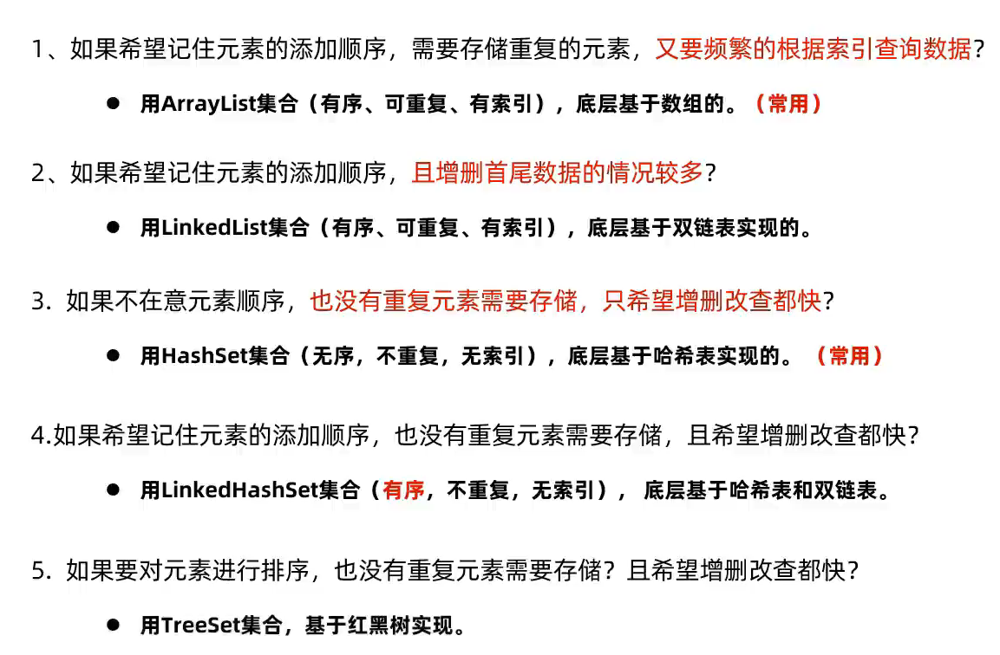
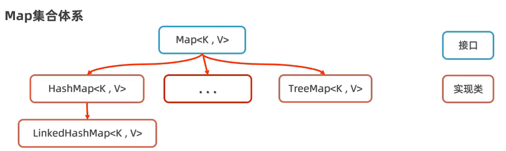
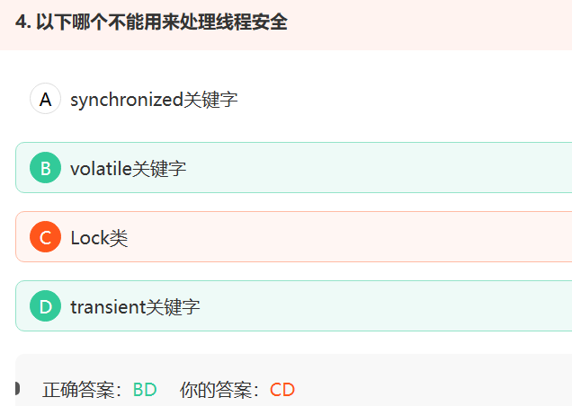
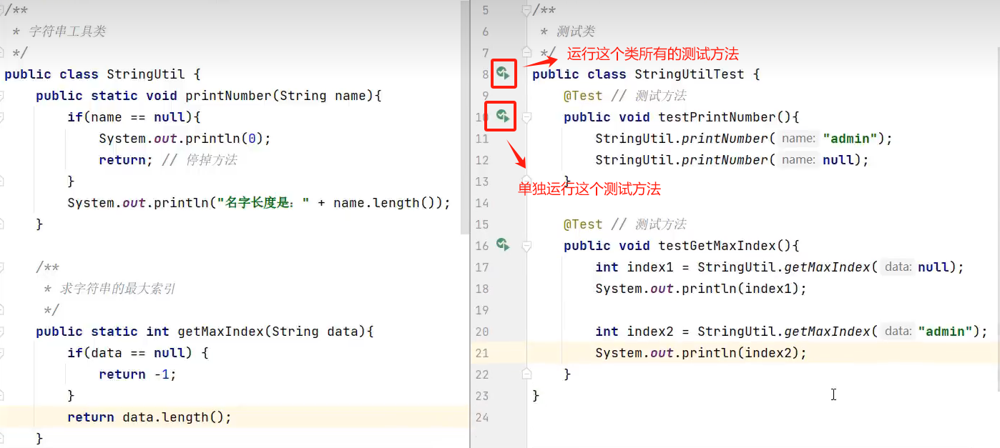
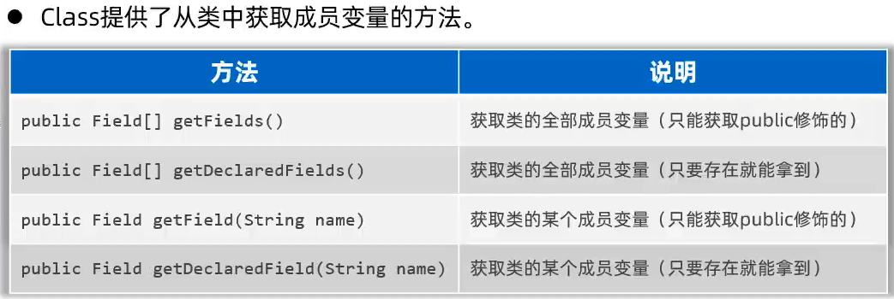
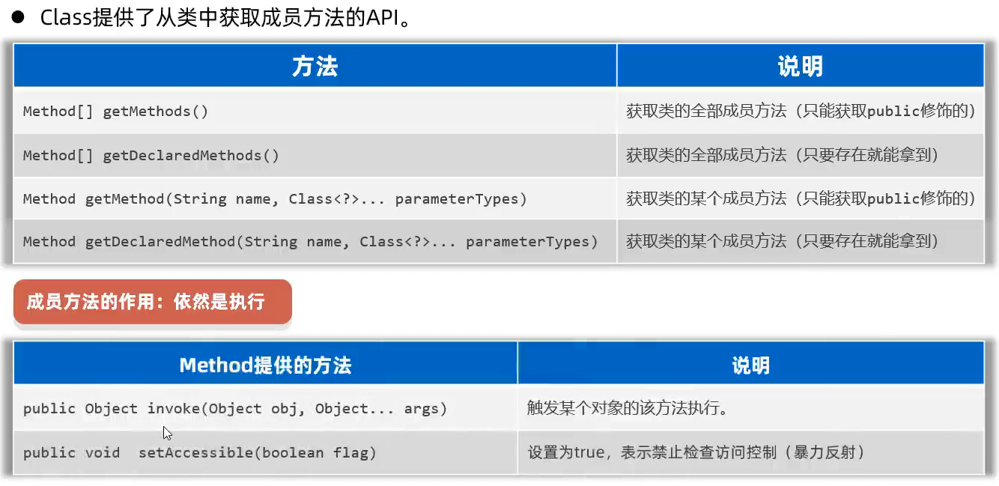

# 泛型

## 理解

Java 泛型（generics）是 JDK 5 中引入的一个新特性

泛型说白了就是将`类型` 参数化。可以用在**类、方法和接口**中，分别被称为`泛型类`、`泛型方法`、`泛型接口`。


类型安全问题，期望在编译的时候就发现异常，而不是运行时。

> ## 安全问题
>
> 因为Object类型可以接收任意类型的对象，在实际的使用中，会存在类型转换的问题，所以Java提供了**泛型**来解决这个安全问题。
>
> 泛型背景：用Object去接收各种数据的话，这些数据都会自动向上转型为Object，所以Object对象随便接收其他类型的数据，很方便。但是在使用的时候需要再进行一次向下转型，否则很多操作都无法进行。比如Object o = 5，就是将Integer转为Object，如果不向下转型的话，这个Object的o是无法进行加减乘除操作的。但是转型只能发生在有继承关系的两个类中，所以盲目的对没有继承关系的类进行强制转型就容易引起转型异常(ClassCastException)
>
> 这显然不是我们所期望的，如果程序有潜在的错误，我们更期望在编译时被告知错误，而不是在运行时报异常。而为了解决类似这样的问题（在编译阶段就可以解决），在jdk1.5后，泛型应运而生。让你在设计API时可以指定类或方法支持泛型，**这样我们使用API的时候也变得更为简洁，并得到了编译时期的语法检查。**泛型是工作在编译阶段的，一旦生成class文件，泛型就被擦除了。
>

因此，泛型应运而生，一方面可以提高代码复用，另一方面解决类型安全问题。

接下来我们看看泛型怎么解决问题：

现在我们用泛型来重写一下此功能：

```java
public class Printer<T> {     
    T t;               // t是泛型变量
    Printer(T t) {
        this.t
    }
    public void print() {
        System.out.println(t);
    }
}
```

```java
public class Main {
    public static void main(String[] args) {
        Printer<Integer> p = new Printer<Integer>(12);
        p.print();    // 12
        Printer<String> s = new Printer<String>("hello");
        s.print();   // hello
    }
}
```

看上面的例子可知：

在类的定义中出现的 `<T>` ，其中 `T`是形式参数，`Integer`，`String`是实参。

注意：

1. **实参不能是基本数据类型，只能是类。**
2. T是形参名而已，也可以写成其他符号。

因此，泛型的概念就是**将  对象的类型 参数化**


接下来，我们来看看在类、方法、接口中是如何体现泛型的：

## 泛型类

```java
//泛型类的基本格式：
[权限修饰符] class 类名<形参列表>{} 
```

补充：

1. `形参列表`意味着可以传多个参数进去

   ```java
   public class Identity <T,K>{
       T t;
       K k;
       Identity(T t,K k) {
           this.t = t;
           this.k = k;
       }
       public void print() {
           System.out.println(k+"的身份证号:"+t);
       }
   }
   ```

   ```java
   public class Main {
       public static void main(String[] args) {
           Identity<Integer,String> i =
                   new Identity<Integer,String>(12345678,"小明");
           i.print();    //  小明的身份证号:12345678
       }
   }
   ```

2. 定义的泛型类，不是必须传入泛型类型实参，也可以不传，但会出现类型安全问题。
   在使用泛型的时候如果不传入泛型类型实参的话，就相当于传递Object

3. 泛型类的派生

   ```java
   public class Father<E> {
       E e;
   }
   
   //1.派生类里传给T，K。又把T传给父类的E。
   public class Son<T,K> extends Father<T>{}  
   
   //2.如果不给父类传类型实参的话，那传给父类的类型形参的就是Object
   public class Son<T,k> extends Father{} 
   
   //3.也可以给父类传具体的类
   public class Son extends Father<String>{}
   ```

4. 如果在泛型类中的成员方法中使用了`类型形参`就不能声明为static

   ```java
   public class Father <E>{
       public static E print(){}  //会报错
   }
   ```

   原因很简单，**我们的E只有在创建对象的时候才会把具体的类传给E，而static方法可以不用创建对象就使用。**这样就矛盾了。一会我们会学一个泛型方法，泛型方法可以被static修饰是因为，泛型方法中定义了传参的入口。而这个方法不是泛型方法，因为该方法没有传参入口，传参入口在泛型类名那。传参入口就是`<形参列表>`

## 泛型接口

```java
[权限修饰符] interface 接口名<类型形参列表>{}
```


```java
//定义一个泛型接口
public interface Generator<E> {
    public E next();
}

//1.实现类将T传给E
public class Father<T> implements Generator<T>{}

//2.如果不给接口传类型实参的话，那传给接口的类型形参的就是Object
public class Father<T,k> implements Generator{} 

//3.实现类可以传具体类
public class Father<T> implements Generator<String>{}
```


## 泛型方法

```java
[权限修饰符] <类型形参列表> 返回值类型 函数名(参数列表) {}
```

```java
public class Main {
    public static <T> T print(T t) {   //可以被static修饰，因为有传类型参数的入口,<T>
        System.out.println(t);
        return t;
    }
    public static void main(String[] args) {
        String s = "hello";
        Integer i = 22;
        print(s);      //传s的同时将String传给了T，这是编译器自行推断出来的。也就是说，实参传递就是类型传递的入口。
        print(i);      //传i的同时将Integer传给了T
        System.out.println(print(i));
    }
}
----------
hello
22
22
22    
```

当然也不强制要求必须被static修饰，具体不再举例子。


**可变参数**

可变参数是数据类型确定，但是数据个数不确定

```java
public void foo(String...varargs){}

foo("arg1", "arg2", "arg3");

//上述过程和下面的调用是等价的
foo(new String[]{"arg1", "arg2", "arg3"});
```

对比下面的：

```java
public class Main {
    public static <E> void print(E... e) {   //e是E类型的数组的数组名
        for(E e1 : e) {
            System.out.println(e1);
        }
    }
    public static void main(String[] args) {
        print(1,2,3);        //注意必须是同一类的对象。要是Integer都是Integer
        print("hello","world");    //要是String都是String
    }
}
```


## 约束

对传入类型进行限制：

```java
// 下面要求参数T只接收Animal类及其子类。
public class Person<T extends Animal>{}
```

举个例子：

```java
public class Animal {
    String name;
}
```

```java
public class Cat extends Animal{
    
}
```

```java
public class OrangeCat extends Cat{
    
}
```

```java
public class Person<T extends Animal> {   // 该参数T只接收Animal以及Animal的所有子类
    T t;
    Person(T t){
        this.t = t;
    }
    public void PrintName(){
       // 因此，在该类中，类型为T的对象t可以使用Animal继承下去的属性和方法，因为该对象继承了Animal
        System.out.println(t.name);
    }
}
```

```java
public class Main {
    public static void main(String[] args) {
        // Animal可以传进去
        Animal a = new Animal();
        Person<Animal> t = new Person<Animal>(a);
        t.print();
        // 直接子类Cat也能传进去
        Cat c = new Cat();
        Person<Cat> p = new Person<Cat>(c);
        p.print();
        // 子类的子类OrangeCat也能传进去
        OrangeCat o = new OrangeCat();
        Person<OrangeCat> q = new Person<OrangeCat>(o);
        q.print();
    }
}
```


(extends)约束接口

```java
// Id是一个接口，
<T extends Id>
// T可以接收Id的子接口或Id的实现类，我试了一下都没啥问题。
```


总结：extends后面可以接 接口或类，约束类型参数是其子接口或实现类、子类。


多绑定

```java
<T extends Comparable & Serializable, U extends Runnable>
<T extends Animal & Comparable>  //如果T绑定了类和接口，类必须写在接口的前面。
// T 可以绑定多个接口，但是只能绑定一个类，因为类是没有多继承特性的，即类只有一个爹。
```


## 常见标记符

**java 中泛型常用的标记符：**

约定俗成的或者说官方就是这样用的。

- **E** - Element (在集合中使用，因为集合中存放的是元素)
- **T** - Type（Java 类）
- **K** - Key（键）
- **V** - Value（值）
- **N** - Number（数值类型）


## 类型通配符(wildcard)

java 中泛型通配符：

**？** - 是类型实参，

[07_类型通配符_哔哩哔哩_bilibili](https://www.bilibili.com/video/BV1xJ411n77R?p=7&vd_source=5a374f315281b0338a0b7fd69b8b8e98)

[泛型的上下限要怎么理解_泛型上限-CSDN博客](https://blog.csdn.net/weixin_40251892/article/details/109063161)

[05、面向对象高级三：泛型方法、泛型的通配符和泛型的上下限、泛型注意事项_哔哩哔哩_bilibili](https://www.bilibili.com/video/BV1Cv411372m?p=115&vd_source=5a374f315281b0338a0b7fd69b8b8e98)

这个跟集合有关，先不看。TODO

## 泛型与数组

[12_泛型与数组_哔哩哔哩_bilibili](https://www.bilibili.com/video/BV1xJ411n77R?p=12&vd_source=5a374f315281b0338a0b7fd69b8b8e98)

这是集合的集合啊。这个不看了。


# 对象比较器

我们知道基本数据类型的数据（除boolean类型外）需要比较大小的话，之间使用比较运算符即可，但是引用数据类型是不能直接使用比较运算符来比较大小的。那么，如何解决这个问题呢？

Java实现对象排序的方式有两种：

- 内部比较器：java.lang.Comparable
- 外部比较器：java.util.Comparator

## Comparable

Comparable是个接口，下面是其定义：

```java
public interface Comparable<T> {
    public int compareTo(T o);
}
```

举例说明Comparable接口的使用，看看Comparable接口如何实现对象之间的比较的：

```java
// 1.要排序的类的对象，实现Comparable接口，重写compareTo方法

public class Person implements Comparable<Person> {
	String name;
	int age;
	
	public Person(String name, int age) {
		this.name = name;
		this.age = age;
	}

    /*
    *	在compareTo方法中编写：*调用该方法的对象*与*形参对象*的比较规则
    */
	@Override
	public int compareTo(Person o) {  
		return this.age - o.age;
	}
    /* 该方法中：
    * 	如果当前对象的年龄大于形参对象的年龄，相减的结果是个正整数。
    *	如果当前对象的年龄等于形参对象的年龄，值为0
    *	如果当前对象的年龄小于形参对象的年龄，值为负整数
    */	
}
```

```java
import java.util.Arrays;   

public class Test {

	public static void main(String[] args) {
        Person p1 = new Person("张三", 20);
        Person p2 = new Person("李四", 18);
        if(p1.compareTo(p2) > 0) {
            System.out.println("张三的年龄比李四大");
        }
}
------------
张三的年龄比李四大    
```

这样就实现了对象之间的比较。


如何实现多个对象之间的排序呢？

可以使用Collections.sort 或 Arrays.sort进行自动排序。（Collections还没学，我们目前只看Arrays）

Arrays类包含有操作数组的一些方法，因此，我们需要先将待排序的对象存放在数组中。

```java
import java.util.Arrays;   //先导入Arrays类

public class Test {
	public static void main(String[] args) {
		Person p1 = new Person("zhangsan", 20);
		Person p2 = new Person("lisi", 18);
		Person p3 = new Person("wangwu", 25);
		
		Person[] persons = {p1, p2, p3};   //将待排序对象存放在数组中
		System.out.println("排序前");
		for (Person person : persons) {
			System.out.println(person.name + ":" + person.age);
		}
		// 使用Arrays.sort()对persons数组进行排序。
		Arrays.sort(persons);
		System.out.println("排序后");
		for (Person person : persons) {
			System.out.println(person.name + ":" + person.age);
		}
	}
}
------------------------
排序前
zhangsan:20
lisi:18
wangwu:25
排序后
lisi:18
zhangsan:20
wangwu:25    
```


## Comparator

两种情况：

- 当元素的类没有实现java.lang.Comparable接口而又不能修改类的时候（例如：一些第三方的类，你只有.class文件，没有源文件）如何实现元素之间的比较？
- 如果一个类，实现了Comparable接口，也指定了两个对象的比较大小的规则，但是此时此刻我不想按照它预定义的方法比较大小，但是我又不能修改compareTo方法，因为会影响其他地方的使用，又该怎么办？

JDK在设计类库之初，也考虑到这种情况，所以又增加了一个java.util.Comparator接口。


举例说明Comparator的使用：

Comparator中定义了一个抽象方法：compare方法

```java
public interface Comparator<T>{
    int compare(T o1,T o2);
}
```

```java
public class Person {         
    String name;
    int age;

    public Person(String name, int age) {
        this.name = name;
        this.age = age;
    }
}
```


```java
import java.util.Comparator;

// 定义一个实现Comparator接口的类
public class comparator implements Comparator {
	// 重写compare方法，该方法定义两个对象的比较规则
    @Override
    public int compare(Object o1, Object o2) {
        Person p1 = (Person) o1;
        Person p2 = (Person) o2;

        if(p1.age > p2.age) return 1;
        else if(p1.age == p2.age) return 0;
        else return -1;
    }
}

```

用Collections.sort 或 Arrays.sort方法实现对对象数组的排序。这里依旧以Arrays.sort为例：

```java
Person p1 = new Person("zhangsan", 20);
Person p2 = new Person("lisi", 18);
Person p3 = new Person("wangwu", 25);

Person[] persons = {p1, p2, p3};
System.out.println("排序前");
for (Person person : persons) {
    System.out.println(person.name + ":" + person.age);
}

Arrays.sort(persons,new comparator()); //调用Arrays.sort方法（跟上面Comparable例子中重载）

System.out.println("排序后");
for (Person person : persons) {
    System.out.println(person.name + ":" + person.age);
}

----------------
排序前
zhangsan:20
lisi:18
wangwu:25
排序后
lisi:18
zhangsan:20
wangwu:25    
```


# 集合框架

什么是框架？框架对比现实生活中的工具包。比如说修理工专门修理东西会有一个工具包，里面有扳手、螺丝刀等工具。我们程序员要编写代码，有的时候也会使用一些“工具包”，这些工具包是Java官方提供的或第三方提供的。比如说，集合框架就是一款工具包，这款工具包里有各种各样的数据结构这些工具，我们程序员可以借助这个工具集来处理数据存储的问题。

需要学习数据结构，相当于c++里的stl，就是轮子。

具体使用查看API文档

> java中Hashtable, Vector, TreeSet, LinkedList哪些线程是安全的？
>
> HashTable是线程安全的
> Vector是线程安全的
>
> ArrayList、TreeSet和LinkedList都不是线程安全的

## Collection集合


Collection集合的元素是单值。Map集合的元素是键值对。


ArrayList和LinkedList：元素有序、可重复、有索引

HashSet：无序、不重复、无索引

LinkedHashSet：有序、不重复、无索引

TreeSet：按照大小默认升序排序、不重复、无索引


Collection接口中提供的常用方法：

接口中定义的是抽象方法，具体由各自实现类实现，但有一点：他们实现的功能是在Collection中声明的。在文档注释中可以看到其具体的功能。

```java
Collection<String> c = new ArrayList<>();
//boolean add(E e);
//元素有序，加入元素的顺序与打印输出的顺序相同
c.add("Hello");
c.add("World");
c.add("Java");
c.add("C++");
c.add("C++");
System.out.println(c);//[Hello, World, Java, C++, C++]
//int size();
System.out.println(c.size());  //5
//boolean isEmpty():是空的就返回true
System.out.println(c.isEmpty());  //false
//boolean contains(Object o):包含元素o就返回true
System.out.println(c.contains("Hello")); // true
//Object[] toArray():将collection实现类对象转为数组
Object[] array = c.toArray();
System.out.println(Arrays.toString(array)); //[Hello, World, Java, C++, C++]


Collection<String> c1 = new ArrayList<>();
c1.add("new");
//boolean addAll(Collection<? extends E> c)
c1.addAll(c);  //相当于c1.append(c)
System.out.println(c1);//[new, Hello, World, Java, C++, C++]

//void clear():清空
c.clear();
System.out.println(c); // []
```

Collection接口中支持的遍历方式：

这些遍历方式，其实现类也都可以使用。

迭代器方式,增强for

```java
Collection<String> c = new ArrayList<>();
//boolean add(E e);
//元素有序，加入元素的顺序与打印输出的顺序相同
c.add("Hello");
c.add("World");
c.add("Java");
c.add("C++");
c.add("C++");
//获取构造器对象,指针指向第一个元素
Iterator<String> iterator = c.iterator();
while (iterator.hasNext()) {
    //E next():返回当前位置的元素,指针指向下一个元素
    System.out.print(iterator.next());
    System.out.print(",");
}//Hello,World,Java,C++,C++,
System.out.println();
//增强for:每一次循环变量s去取集合或数组c中的每一个元素
for(String s : c){
    System.out.print(s);
    System.out.print(",");
}//Hello,World,Java,C++,C++,
```

lambda：

TODO：不好理解


List接口中提供的常用方法：

```java
List<String> l = new ArrayList<>();
l.add("a");
l.add("b");
l.add("c");
//void add(int index, E element):在下标为index的位置插入element
l.add(0,"d");
System.out.println(l); //[d, a, b, c]
//E remove(int index):删除下标为index的元素并返回该元素
System.out.println(l.remove(0)); //d
System.out.println(l);//[a, b, c]
//E get(int index):返回下标为0的元素
System.out.println(l.get(0));//a
//E set(int index, E element)
System.out.println(l.set(0, "e"));//把下标为0的元素替换为"e"并返回被替换前的元素
System.out.println(l);//[e, b, c]
```

List接口支持的遍历方式：

for循环(因为List集合有索引)

```java
List<String> l = new ArrayList<>();
l.add("a");
l.add("b");
l.add("c");
for (int i = 0; i < l.size(); i++) {
    System.out.print(l.get(i));//abc
}
```

Collection介绍的三种，List也支持哦~


ArrayList集合底层原理：

基于数组实现，查询效率高，插入、删除效率低。

LinkedList集合底层原理：

基于双链表实现，查询慢，增删快。对首尾元素进行增删改查极快。因为维护了首指针和尾指针。

LinkedList新增的一些对首尾元素进行操作的方法：

```java
LinkedList<String> l = new LinkedList<>();
l.addFirst("a");
l.addFirst("b");
l.addFirst("c");
System.out.println(l);//[c, b, a]
l.addLast("a");
l.addLast("b");
l.addLast("c");
System.out.println(l);//[c, b, a, a, b, c]

String first = l.getFirst();
System.out.println(first); // c
String last = l.getLast();
System.out.println(last); // c
l.removeFirst();
System.out.println(l); // [b, a, a, b, c]
l.removeLast();
System.out.println(l); // [b, a, a, b]
```

根据这些方法可以实现队列和栈


Set集合

Set集合常用的方法都是Collection提供的。

HashSet集合：

数组+链表+红黑树

默认因子：0.75

16*0.75=12------->当数组的12个位置被填满，会扩容。

当链表长度超过8，会转为红黑树。

HashSet增删改查性能都挺好。

HashSet存储内容相同的两个不同对象时，是可以存进去的。如何实现相同内容的不同对象实现去重复呢？

原理：数据在存储到HashSet集合中的时候，先根据数据的hashcode算出在数组的那个坑，然后再用equals方法与坑下的链表的数据一一比较，如果equals返回true则默认是重复的，会被去重。因此，我们需要重写hashcode方法使内容相同的不同对象有相同的hashcode，这样下一步才能进行比较。另外重写equals方法，比较内容是否一致。

LinkedHashSet

基于HashSet实现，只不过每一个元素存储的时候存的是一个双向节点,会记录元素的前后位置。也就是有序的。

```cpp
struct Node {
    int data;
    Node* l;
    Node* r;
} Node;
```

TreeSet

基于红黑树实现。





Collections工具类

```java
package com.example.controller;

import java.io.Serializable;

public class Student implements Comparable<Student>{
    private int id;
    private String name;

    public Student(){}

    public int getId() {
        return id;
    }

    public void setId(int id) {
        this.id = id;
    }

    public String getName() {
        return name;
    }

    public void setName(String name) {
        this.name = name;
    }

    private Student(String name, int id){
        this.name = name;
        this.id = id;
    }
    public Student(int id, String name) {
        this.id = id;
        this.name = name;
    }

    @Override
    public String toString() {
        return "Student{" +
                "id=" + id +
                ", name='" + name + '\'' +
                '}';
    }

    @Override
    public int compareTo(Student o) {
        /**
         * 左边对象大于右边对象返回正整数
         * 需求：按照id升序排序
         */
        return this.id - o.id;
    }
}
```

```java
List<String> list = new ArrayList<>();
list.add("a");
list.add("b");
list.add("c");
//public static <T> boolean addAll(Collection<? super T> c, T... elements):批量添加元素到集合中
Collections.addAll(list, "d", "e");
//这个实例中T是String,可以接收Collection<? super T>:表示String类以及父类泛型的Collection集合
System.out.println(list); //[a, b, c, d, e]
//public static void shuffle(List<?> list):打乱顺序
Collections.shuffle(list);
System.out.println(list);  //[d, b, e, c, a]
//public static <T extends Comparable<? super T>> void sort(List<T> list):对list进行排序
Collections.sort(list);
System.out.println(list); //[a, b, c, d, e]

//使用上面的Collections.sort(List<T> list)方法实现对自定义对象的排序
List<Student> students = new ArrayList<>();
students.add(new Student(1,"John"));
students.add(new Student(3,"Jack"));
students.add(new Student(2,"Jane"));
System.out.println(students);  //[Student{id=1, name='John'}, Student{id=3, name='Jack'}, Student{id=2, name='Jane'}]
Collections.sort(students);
System.out.println(students);  //[Student{id=1, name='John'}, Student{id=2, name='Jane'}, Student{id=3, name='Jack'}]

//使用public static <T> void sort(List<T> list, Comparator<? super T> c)方法实现自定义对象排序
Collections.sort(students, new Comparator<Student>() {

    @Override
    public int compare(Student o1, Student o2) {
        return o2.getId()-o1.getId();
    }
});
System.out.println(students); //[Student{id=3, name='Jack'}, Student{id=2, name='Jane'}, Student{id=1, name='John'}]
```


## Map集合

每一个元素是一个键值对。



HashMap：无序、不重复、无索引

LinkedHashMap：有序、不重复、无索引

TreeMap：默认按照大小升序排序、不重复、无索引

```java
Map<String,Integer> map = new HashMap<>();
map.put("a", 1);
map.put("b", 1);
map.put("b", 2);  // 不重复、覆盖前面的值
map.put("d", 3);
map.put("c", 4);
map.put("e", 5);
System.out.println(map);  //{a=1, b=2, c=4, d=3, e=5}:不保证输入顺序和输出顺序一致
Map<String,Integer> map1 = new LinkedHashMap<>();
map1.put("a", 1);
map1.put("b", 1);
map1.put("b", 2);  // 不重复、覆盖前面的值
map1.put("d", 3);
map1.put("c", 4);
map1.put("e", 5);
System.out.println(map1); //{a=1, b=2, d=3, c=4, e=5}:输入顺序和输出顺序是一致的。

Map<String,Integer> map2 = new TreeMap<>();
map2.put("a", 1);
map2.put("b", 1);
map2.put("b", 2);
map2.put("d", 3);
map2.put("c", 4);
map2.put("e", 5);
System.out.println(map2);  //{a=1, b=2, c=4, d=3, e=5}:对键进行升序排序了
```


# stream流

JDK8新特性。

java.util.stream

[07、JDK8新特性：Stream流入门、Stream流的创建_哔哩哔哩_bilibili](https://www.bilibili.com/video/BV1Cv411372m?p=149&vd_source=5a374f315281b0338a0b7fd69b8b8e98)

讲的非常好

# File类与IO流

## java.io.File类

### 介绍

一个**File类的对象**对应磁盘上的某个**文件**或**文件夹**。一个文件或文件夹是由路径名唯一确定的。

路径名分为绝对路径和相对路径。


在windows中，路径的表示：`D:\apps\7z` 分隔符用 `\`

在java中路径的表示：因为windows路径中的分隔符与java中的转义符冲突，因此java中路径的分割符可以用 `\\` ，这个代表的意思是 第一个 `\`是转义字符，将第二个转义字符 转义成 正常的字符。

或者分隔符用 `/`。 

当然也支持两者混用，但是最好别这样用。

 `D:\\apps\\7z`  或  `D:/apps/7z` 或 `D:/apps\\7z`

下面是简单介绍，具体的细节需要参考文档注释和源码追踪。

```java
// File(String pathname):创建一个File对象，pathname是文件或文件夹路径(不关心是否存在)，最好用相对路径
File f = new File("C:\\");
//public boolean exists():判断文件或文件夹是否存在，存在返回true
System.out.println(f.exists());
//public long length():返回文件或文件夹的大小，若文件或文件夹不存在，返回0
System.out.println(f.length());
//public boolean isFile():判断当前对象是否是文件，是文件返回true
System.out.println(f.isFile());
//public boolean isDirectory():判断当前对象是否是文件夹，是文件返回true
System.out.println(f.isDirectory());
//public String getName():返回文件或文件夹的名字
System.out.println(f.getName());
//public long lastModified():返回文件或文件夹最后一次修改的时间
System.out.println(f.lastModified());
//public String getPath():返回创建对象时传入的pathname
System.out.println(f.getPath());
//public String getAbsolutePath():返回绝对路径
System.out.println(f.getAbsolutePath());
```

```java
File f1 = new File("C:\\resource\\a.txt");
//public boolean createNewFile() throws IOException:创建成功返回true
System.out.println(f1.createNewFile());
//public boolean mkdir():创建一级文件夹new，C:\resource已存在的前提下才能创建成功
File f2 = new File("C:\\resource\\new");
System.out.println(f2.mkdir());
//public boolean mkdirs():创建多级文件夹
File f3 = new File("C:\\resource\\new1\\new2");
System.out.println(f3.mkdirs());
//public boolean delete():删除空文件或文件夹
System.out.println(f3.delete()); //删除了new2这个空文件夹
System.out.println(f1.delete()); //删除a.txt这个空文件
```

因此可知，File类只能对文件本身进行操作，不能读写文件的数据内容。

## I/O流

IO流就是用来`读` `写`**文件或网络**中的数据内容的。


# 多线程

并发编程的一部分。

**volatile关键字**

[01.003-预备知识_哔哩哔哩_bilibili](https://www.bilibili.com/video/BV16J411h7Rd?p=3&vd_source=5a374f315281b0338a0b7fd69b8b8e98)

Java语言的JVM允许程序运行多个线程，使用`java.lang.Thread`类代表**线程**

## 创建和启动线程

### 方式1：继承Thread类

Java通过继承Thread类来**创建**并**启动多线程**的步骤如下：

1. 定义Thread类的子类，并重写该类的run()方法，该run()方法的方法体就代表了线程需要完成的任务
2. 创建Thread子类的实例，即创建了线程对象
3. 调用线程对象的start()方法来启动该线程。

举例：

```java
//1.定义一个Thread类的子类
public class MyThread extends Thread {
    //定义指定线程名称的构造方法
    public MyThread(String name) {
        //调用父类的String参数的构造方法，指定线程的名称
        super(name);
    }
    /**
     * 重写run方法，完成该线程执行的逻辑
     */
    @Override
    public void run() {
        for (int i = 0; i < 10; i++) {
            System.out.println(getName()+"：正在执行！"+i);
        }
    }
}
```

测试：

```java
public class TestMyThread {
    public static void main(String[] args) {
        //创建自定义线程对象1
        MyThread mt1 = new MyThread("子线程1");
        //开启子线程1
        mt1.start();
        
        //创建自定义线程对象2
        MyThread mt2 = new MyThread("子线程2");
        //开启子线程2
        mt2.start();
        
        //在主方法中执行for循环
        for (int i = 0; i < 10; i++) {
            System.out.println("main线程！"+i);
        }
    }
}
```

上面的过程如下图所示：在main方法这个主线程中开启了两个子线程，这三个子线程一起执行。


- 问题：在启动线程的时候，使用的语句是 `对象名.start();`，这样就会执行重写的`run()`方法,那么如果直接执行 `对象名.run();`的话，会怎么样？

  如果自己调用run()方法，那么就只是普通方法，没有启动多线程。

- 一个线程对象只能调用一次start()方法启动，如果重复调用了，则将抛出以上的异常“`IllegalThreadStateException`”。

- 这种创建线程的方法的缺点：

  线程类已经继承了Thread类，就不能继承其他类了，不利于功能的扩展。

### 方式2：实现Runnable接口

Java有单继承的限制，当我们无法继承Thread类时，那么该如何做呢？在核心类库中提供了Runnable接口，我们可以创建一个实现Runnable接口的类，然后重写该接口里的run()方法，再将该实现类的对象作为参数传递给Thread类的构造器，从而创建一个Thread类的对象，然后用该Thread类对象调用start()方法。


举例：

```java
// 1. 创建一个实现Runnable接口的实现类
public class MyRunnable implements Runnable {  
    // 2. 重写run方法
    @Override
    public void run() {  
        for (int i = 0; i < 20; i++) {
            System.out.println(Thread.currentThread().getName() + " " + i);
        }
    }
}

```

```java
public class TestMyRunnable {
    public static void main(String[] args) {
        //3. 创建实现类的对象
        MyRunnable mr = new MyRunnable();
        //4. 将实现类的对象作为参数传递给Thread类的构造器
        Thread t = new Thread(mr, "长江");
        //5. 通过Thread类对象调用start方法启动多线程。
        t.start();
        for (int i = 0; i < 20; i++) {
            System.out.println("黄河 " + i);
        }
    }
}
```


Thread类的构造器：

在方式1：继承Thread类的时候用不到Thread类的构造器，而在方式2：实现Runnable接口的时候会用到Thread类的构造器。

```java
public Thread()   //  空参构造器：new一个线程对象并返回。
public Thread(String name) // new一个名字叫name的线程对象并返回。
public Thread(Runnable target) // 这里用到了接口的多态，传入了一个实现Runnable接口的实现类的对象给target，用该对象new一个线程对象并返回
public Thread(Runnable target,String name) //第二个和第三个的组合。
```


### 匿名内部类简化方法1、2

**使用匿名内部类对象来实现线程的创建和启动**

```java
new Thread("新的线程！"){
	@Override
	public void run() {
		for (int i = 0; i < 10; i++) {
			System.out.println(getName()+"：正在执行！"+i);
		}
	}
}.start();
```

```java
new Thread(new Runnable(){
	@Override
	public void run() {
		for (int i = 0; i < 10; i++) {
			System.out.println(Thread.currentThread().getName()+"：" + i);
		}
	}
}).start();
```

**实现Runnable接口比继承Thread类所具有的优势**

- Runnable接口的实现类还可以继承其他类和其他接口。Thread类的子类不能继承其他类了。

- 多个线程可以共享同一个接口实现类的对象，非常适合多个相同线程来处理同一份资源。

  解释：

  如果多个线程共享一份资源，该如何实现呢？

  1. 使用继承的方式实现

  ```java
  //1.定义一个Thread类的子类
  public class MyThread extends Thread {
      // 将该属性声明为static，根据该类的每一个对象都是一个线程，且都共享一份该属性，那么所有线程共享该     // 属性
      private static double money = 1000.0;       
      @Override
      public void run() {
          for (int i = 0; i < 10; i++) {
              System.out.println(getName()+"：正在执行！"+i);
          }
      }
  }
  ```

  2. 使用接口的方式实现

  ```java
  // 1. 创建一个实现Runnable接口的实现类
  public class MyRunnable implements Runnable {  
      //相比上面的方式，这个方式并不需要static修饰，因为在使用的时候，我们只创建了一个该类对象，并将该     //对象传递给了Thread类的构造器，因此无论创建多少个Thread类的对象，这些对象共享的是同一个对象，就     //是上面创建的那个实现类对象。
      private double money = 1000.0;
      @Override
      public void run() {  
          for (int i = 0; i < 20; i++) {
              System.out.println(Thread.currentThread().getName() + " " + i);
          }
      }
  }
  ```

  ```java
  public class TestMyRunnable {
      public static void main(String[] args) {
          //3. 创建实现类的对象
          MyRunnable mr = new MyRunnable();
          //4. 将实现类的对象作为参数传递给Thread类的构造器
          Thread t = new Thread(mr, "长江");
          t.start();
          Thread p = new Thread(mr,"钱塘江");
          p.start();
          // 线程t和线程p共用实现类对象mr
          for (int i = 0; i < 20; i++) {
              System.out.println("黄河 " + i);
          }
      }
  }
  ```

### 方式3：实现Callable接口


## Thread类的常用方法


## 线程安全问题

volatile关键字



synchrozied关键字称作同步，主要用来给方法、代码块加锁，被加锁的代码段，同一时间内多线程同时访问同一对象的加锁方法/代码块时，只能有一个线程执行能执行方法/代码块中的代码，其余线程必须等待当前线程执行完以后才执行该方法/代码块。 

  volatile关键字1.保证了不同线程对该变量操作的内存可见性.(当一个线程修改了变量,其他使用次变量的线程可以立即知道这一修改)。2.禁止了指令重排序. 

​    Lock接口提供了与synchronized关键字类似的同步功能，但需要在使用时手动获取锁和释放锁。   

transient关键字  简单地说，就是让某些被修饰的成员属性变量不被序列化。


## 线程同步

解决线程安全问题的方案。


# 网络编程

需要IO流与计网知识。


[阿里二面：transient 关键字的作用是什么？什么场景下会用到？_哔哩哔哩_bilibili](https://www.bilibili.com/video/BV1CV4y1C7BJ/?spm_id_from=333.337.search-card.all.click&vd_source=5a374f315281b0338a0b7fd69b8b8e98)


# 注解(annotation)

知道如何使用即可。

# 单元测试

## 常规做法

<div>
    
    <p>
        定义了一个类，类里定义了多个方法，现在要测试方法是否会出现异常，普遍的做法是在该类中定义一个main方法，然后依次为每个方法编写多个测试用例进行测试。<br/>
        缺点：<br/>
        1.如果有成千上万个测试用例放在一个main方法中执行，会导致非常难以分析。<br/>
        2.一旦有某一个测试用例测试失败出现异常会导致其他测试用例不能继续测试。<br/>
        3.另外如果想单独测试某个测试用例的话还需要把其他的测试用例注释掉，很麻烦。<br/>
        4.业务代码和测试代码写在一起，你就祈祷别被负责人打死就行。
    </p>
</div>

单元测试解决了以上问题。

## Juint框架的使用

1. 导入Juint框架的Jar包 
2. 为需要进行测试的业务类，定义一个测试类，在测试类中为业务类的每个业务方法定义一个测试该业务方法的测试方法(公共、无参、无返回值)，在测试方法中编写对应业务方法的测试用例。
3. 在每一个测试方法上加上`@Test`注解
4. 可以直接运行单个测试方法来运行对应的业务方法的所有测试用例。也可以直接运行整个测试类所有的测试方法，也可以运行整个project所有测试类的所有的测试方法。



根据上面的例子，业务类和测试类以及其中的方法是一一对应的。在测试方法中调用业务方法进行多次测试。在进行测试的时候尽量偏怪一点，找出逻辑上的不足或错误。我们可以看着代码编写测试用例，这就是白盒测试。


## 常见注解

Junit框架的常见注解

| 4.x版本注解  | 5.x版本注解 | 说明                                                   |
| ------------ | ----------- | ------------------------------------------------------ |
| @Test        | @Test       | 声明方法为测试方法                                     |
| @Before      | @BeforeEach | 修饰实例方法，该方法会在运行每个测试方法前都会运行一次 |
| @After       | @AfterEach  | 修饰实例方法，该方法会在每个测试方法运行后都会运行一次 |
| @BeforeClass | @BeforeAll  | 修饰静态方法，该方法会在运行所有测试方法前运行一次     |
| @AfterClass  | @AfterAll   | 修饰静态方法，该方法会在所有测试方法运行后运行一次     |

注：在运行测试方法前执行的方法常用于初始化资源，在测试方法运行后执行的方法常用于释放资源

如果每个测试方法都需要某一独立的资源，可以定义在@Before和@After修饰的方法中。

如果所有的测试方法共用同一个资源，可以定义在@BeforeClass和@AfterClass修饰的方法中。


# 反射机制

## 获取Class对象

先定义一个Student类

```java
package com.example.controller;

public class Student {
}
```

接下来用三种方法获得Student类的Class对象

```java
//法一:类名.class方法获得Class对象

//Class类代表类的字节码,studentClass对象代表Student类的字节码
Class<Student> c1 = Student.class;
//public String getName():获取全类名
String name = c1.getName();//com.example.controller.Student
//public String getSimpleName():获取类名
String simpleName = c1.getSimpleName();//Student

//法二:Class.forName("全类名"):通过Class类的静态方法获得Class对象

//public static Class<?> forName(String className):调用Class类的静态方法通过全类名获得Class对象
Class<?> c2 = Class.forName("com.example.controller.Student");
System.out.println(c1 == c2); // true:一个类的Class对象只有一个

//法三:对象名.getClass():通过对象的getClass方法

Student student = new Student();
//public final native Class<?> getClass():通过对象的getClass方法
Class<? extends Student> c3 = student.getClass();
```

## Class对象的使用

### 获取constructor对象

使用Class对象来获取构造器对象

先定义一个Students类

```java
package com.example.controller;

public class Student {
    private int id;
    private String name;

    public Student(){}
    private Student(String name, int id){
        this.name = name;
        this.id = id;
    }
    public Student(int id, String name) {
        this.id = id;
        this.name = name;
    }
}
```

接下来介绍四种获取构造器的方法：

```java
//获取Class对象
Class<Student> studentClass = Student.class;
//public Constructor<?>[] getConstructors():获取所有public构造器对象
Constructor<?>[] constructors = studentClass.getConstructors();
for(int i=0; i<constructors.length; i++){
    System.out.println(constructors[i]);
}
----------output--------------
public com.example.controller.Student()
public com.example.controller.Student(int,java.lang.String)
```

```java
//public Constructor<?>[] getDeclaredConstructors():获取全部构造器对象
Constructor<?>[] declaredConstructors = studentClass.getDeclaredConstructors();
for(int i=0; i<declaredConstructors.length; i++){
    System.out.println(declaredConstructors[i]);
}
---------output---------------
public com.example.controller.Student()
private com.example.controller.Student(java.lang.String,int)
public com.example.controller.Student(int,java.lang.String)    
```

```java
Class<Student> studentClass = Student.class;
//public Constructor<T> getConstructor(Class<?>... parameterTypes):获取指定参数列表的public构造器对象

//获取无参public构造器
Constructor<Student> Nonconstructor = studentClass.getConstructor();
System.out.println(Nonconstructor);
//获取参数列表为(int,String)的构造器对象
Constructor<Student> constructor1 = studentClass.getConstructor(int.class, String.class);
System.out.println(constructor1);
--------output-----------
public com.example.controller.Student()
public com.example.controller.Student(int,java.lang.String)    
```

```java
Class<Student> studentClass = Student.class;
//public Constructor<T> getDeclaredConstructor(Class<?>... parameterTypes):获取指定参数列表的构造器
Constructor<Student> constructor = studentClass.getDeclaredConstructor(String.class, int.class);
System.out.println(constructor);
---------output-------
private com.example.controller.Student(java.lang.String,int)
```

 一般会用 `getDeclaredConstructors()`和 `getDeclaredConstructor(Class<?>... parameterTypes)`

另外两个不常用。

### constructor对象的使用

调用构造器对象的newInstance()方法创建类对象

先alt+insert快捷键在Student类中重写toString()方法

```java
Class<Student> studentClass = Student.class;
Constructor<Student> constructor = studentClass.getDeclaredConstructor(int.class, String.class);
//public T newInstance(Object ... initargs):创建对象
Student student = constructor.newInstance(3, " 叮当猫");
System.out.println(student);  //Student{id=3, name=' 叮当猫'}
```

创建对象还要受到权限修饰符的限制。

```java
Constructor<Student> constructor1 = studentClass.getDeclaredConstructor(String.class, int.class);   //这个构造器对象代表的是private Student(String name, int id)这个构造器
constructor1.setAccessible(true);    //禁止访问权限修饰符起作用
Student student1 = constructor1.newInstance("叮当猫", 3);
System.out.println(student1);//Student{id=3, name=' 叮当猫'}
```


### 获取field对象

```java
Class<Student> studentClass = Student.class;
Field[] declaredFields = studentClass.getDeclaredFields();
for (int i = 0; i < declaredFields.length; i++) {
    System.out.println(declaredFields[i]);
}
-----------output-----------
private int com.example.controller.Student.id
private java.lang.String com.example.controller.Student.name    
```



### field对象的使用

```java
Class<Student> studentClass = Student.class;

Field name = studentClass.getDeclaredField("name");
Field id = studentClass.getDeclaredField("id");

name.setAccessible(true);
id.setAccessible(true);

Student student = new Student();
//public void set(Object obj, Object value):给obj对象的value赋值
name.set(student, "John");
id.set(student, 22);
System.out.println(student);
//public Object get(Object obj):取出obj对象的值
String name1 = (String) name.get(student);
System.out.println(name1);
int id1 = (int)id.get(student);
System.out.println(id1);
```

### 获取method对象和使用



```java
Class<Student> studentClass = Student.class;

Method[] declaredMethods = studentClass.getDeclaredMethods();
for (int i = 0; i < declaredMethods.length; i++) {
    System.out.println(declaredMethods[i]);
}
----------------output------------------
public java.lang.String com.example.controller.Student.toString()
```

```java
declaredMethods[0].setAccessible(true);

String john = (String) declaredMethods[0].invoke(studentClass.getConstructor(int.class, String.class).newInstance(22, "John"));
System.out.println(john);     //Student{id=22, name='John'}
```


# 动态代理

动态代理技术可以动态创建一个代理对象？

比如，我们有一个类，类中有一些方法。如果我们想在这些方法调用前和调用后添加一些功能，让他们随方法的调用一同执行，我们可以定义一个代理类，这个类实现。

[Java 代理模式详解 | JavaGuide](https://javaguide.cn/java/basis/proxy.html#_1-代理模式)


懵逼的两个地方：

第一个是lambda表达式与方法引用

第二个是泛型的？与上下限


