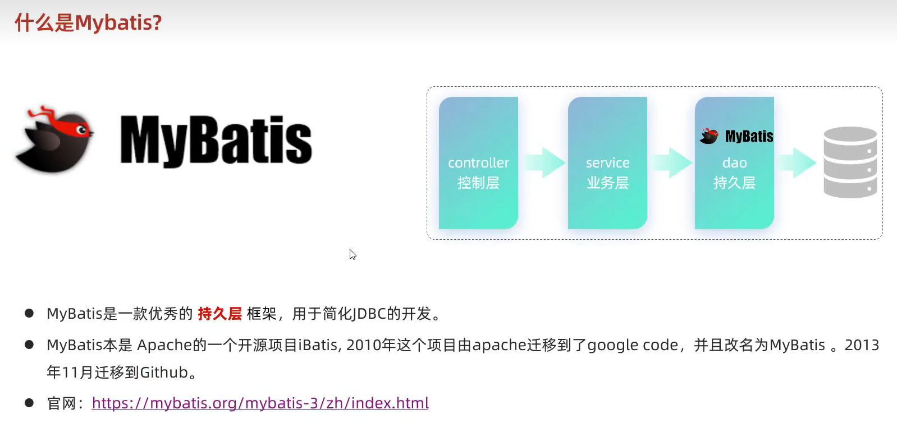
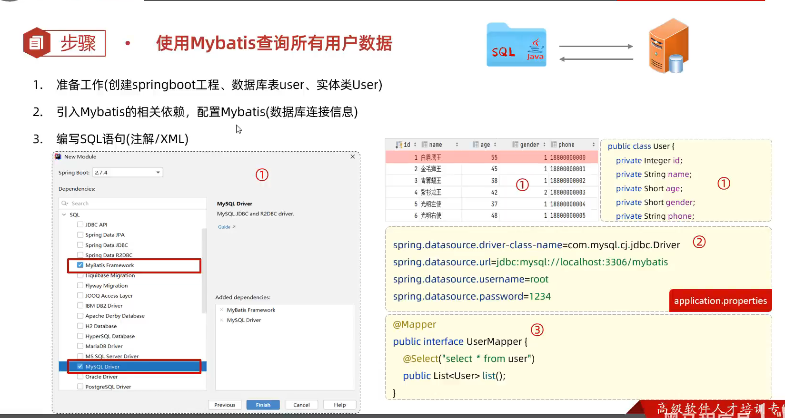
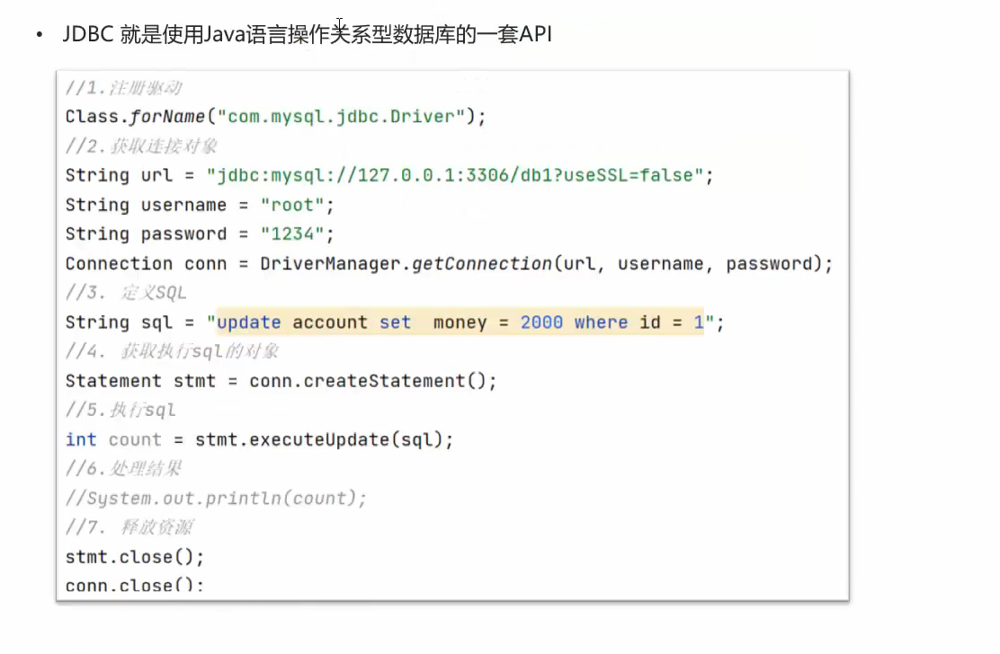
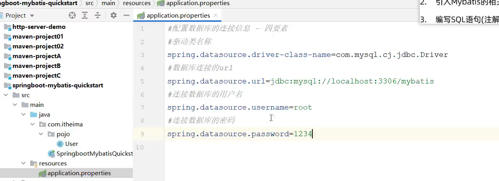
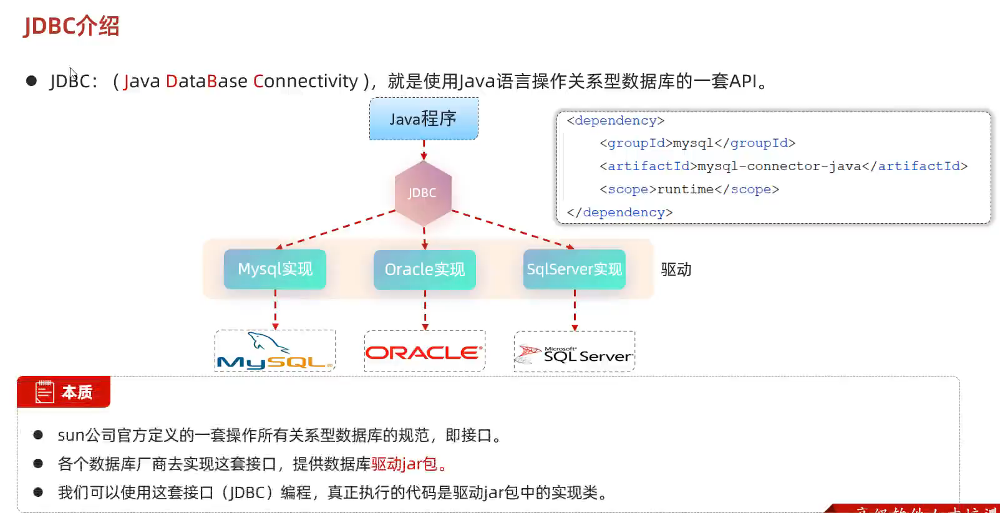
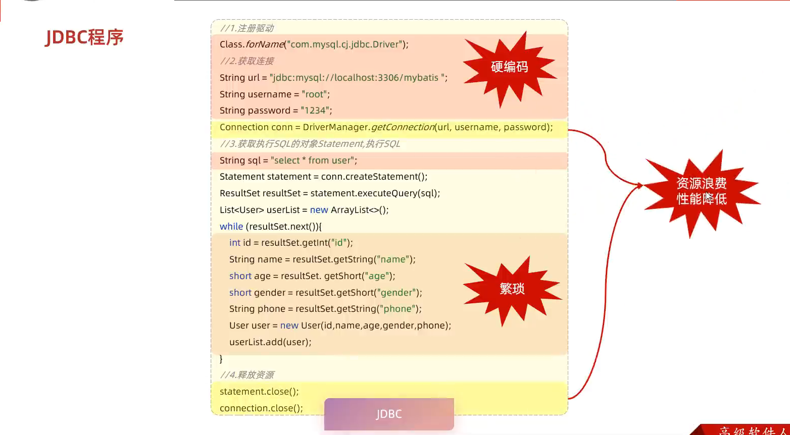

学完了sql语言，我们就可以编写sql来操作数据库的增删改查。

在后端程序中，我们是用java代码来操作数据库的。之前用的是java官方编写的jdbc框架来操作数据库。现在我们是用mybatis

在图形化界面工具DataGrip中编写并执行sql语句，然后将sql语句传给数据库，交由数据库来执行，并将结果返回给DataGrip。

用java程序操作数据库的流程是一样的，java程序将sql语句，传给数据库，然后等待接收数据库返回的结果。

接下来，我们使用Spring Boot整合Mybatis的方式实现“使用Mybatis查询所有用户数据”

Springboot整合Mybatis框架意思是在SpringBoot工程中导入Mybatis。

第一步，先在数据库中准备一张数据表。

第二步，创建Springboot工程，导入Mybatis框架和MySQL Driver（驱动或引擎）

然后准备一个实体类User，用于接收数据表。

最后，配置数据库的连接信息，之前在jdbc中，我们需要声明我们要用的驱动，在jdbc的代码中我们要写注册驱动的代码，在springboot中，我们把这部分声明配置文件中去。声明的是驱动类的全类名。。。

最后唯一要做的就是配置数据库的连接信息，在jdbc中，我们在java代码中配置连接信息，就是下图中的第二步。

要设置url，连接数据库的用户名及密码。这里的url前面的 `jdbc:mysql:`是固定的，后面是数据库的ip地址和端口号，db1表示要连接的数据库的名字。

在SpringBoot整合mybatis的方式中，配置数据库连接信息是在.properties的属性文件中。

第三步，使用mybatis框架编写将sql语句发送到数据库并等待接收数据库返回信息的代码了。

什么是驱动？

JDBC是Java官方定义的一套接口，一套规范。由于关系型数据库有不同的类，如MySQL数据库、oracle数据库、SqlServer数据库。他们各个厂商实现这套接口，提供了JDBC各个接口的实现类，并封装成jar包。我们需要导入jar包，然后在Java程序中，通过多态，声明接口的方式调用实现类。在使用前我们需要声明我们使用的是哪个jar包，也就是上面jdbc代码中的注册驱动那一步。

JDBC的缺点：

硬编码的部分：

在开发环境需要连接开发用的数据库，在测试环境需要连接测试用的数据库，在生产环境需要连接生产用的数据库。这部分代码需要频繁的改动，我们就把这部分配置，写入到配置文件中去。到哪个环境就用那个配置文件。这就是mybatis的做法。

繁琐那部分：

每个属性都要获取其值，如果一个表里有成千上万条属性会非常复杂，更别说还要调用不同的方法了。

每执行sql语句，都要建立和释放连接，不仅要手动编写连接与释放连接的代码，同时执行效率也不高。

在mybatis中是直接从数据库连接池中取一条连接，用完再还回去的。这就相当于线程池。