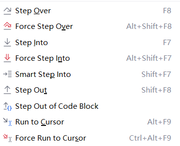

Debug学习

[IDEA Debug教程(超详细)-CSDN博客](https://blog.csdn.net/TheSky0108/article/details/106050268)

Step Over：一行一行地往下走，如果这一行上有方法不会进入方法。

Force Step Over：

Step Into：如果当前行有方法，可以进入方法内部，一般用于进入自定义方法内，不会进入官方类库的方法

Force Step Into：能进入任何方法，查看底层源码的时候可以用这个进入官方类库的方法。

Smart Step Into：

Step Out：从步入的方法内执行到方法调用处，此时方法已执行完毕，只是还没有完成赋值。

Run to Cursor (Alt + F9)：运行到光标处，你可以将光标定位到你需要查看的那一行，然后使用这个功能，代码会运行至光标行，而不需要打断点。

Resume Program：继续程序，运行到下一个断点。