# 基础


下面有两个案例，第一个是age 如何声明为TINYINT UNSIGNED

第二个是score是总长度为4，保留一位小数的double类型。


用的最多的是CHAR和VARCHAR，在定义的时候都需要指定最大长度。

对于定长字符串CHAR，适于存储性别，只有0或1

对于变长字符串VARCHAR，适于存储用户名等。


一般用DATE、TIME、DATETIME


## DDL

对数据库、表、表结构进行操作

对数据库操作

```mysql
show databases;    - 显示所有数据库
create database [if not exists] 数据库名; -[如果不存在该数据库]就新建数据库
use 数据库名; -切换到该数据库，接下来的sql语句都是针对该数据库的
select database();    - 在上面那条语句执行后再执行该语句可以查看当前使用的数据库
drop database [if exists] 数据库名; -[如果存在该数据库]删除数据库
```

对表操作

```mysql
show tables;  -- 查看当前数据库所有的表
create table 表名(
	字段1 字段1类型[comment 字段1注释],
	字段2 字段2类型[comment 字段2注释],
    字段3 字段3类型[comment 字段3注释]
)[comment 表注释];                        -- 创建表
desc 表名;  -- 查看表结构
show create table 表名;     -- 查看建该表的语句
drop table [if exists] 表名;  -- [如果表存在的话]删除表
truncate table 表名;    -- 清空该表
alter table 表名 add 新字段 新数据类型 [comment 注释] [约束];  -- 添加新字段
alter table 表名 rename to 新表名 [comment 注释] [约束];    -- 修改表名
alter table 表名 drop 字段名;         -- 删除该表的该字段
alter table 表名 modify 字段名 新数据类型;  -- 修改该字段的数据类型
alter table 表名 change 旧字段名 新字段名 新数据类型 [comment 注释] [约束]; 
-- 修改字段的名字和数据类型
```

## DML

对表中的数据进行增删改


## DQL

查询表中的数据


基本查询

```mysql
select 字段1,字段2,... from 表名;  - 返回表中这几个字段的所有数据项
select * from 表名; - 返回表中所有字段的所有数据项 (不建议使用，建议把所有字段写出来)

select 字段1 [[as] 别名],字段2 [[as] 别名],... from 表名; - 给字段设置别名

select distinct 字段列表 from 表名; - 去除重复数据项
```


条件查询

```mysql
select 字段列表 from 表名 where 条件
```


聚合函数

聚合函数配合分组查询使用，聚合函数：将某一列的所有数据进行计算（null值不参与计算）


```mysql
select 聚合函数(某一字段) from 表名;
```

```mysql
select count(*) from tlias; -返回tlias表中数据项的总和
```


分组查询


意思就是说，先根据where进行第一次的数据筛选，然后根据group by后面的字段分组，比如性别字段有两类值，第一次筛选出的数据的每一个值根据聚合函数归到不同的组去。然后对筛选出来的数据进行第二次having过滤。


排序查询


分页查询


DQL执行顺序


左边是编写顺序，右边是执行顺序：

先from表名，根据表和where条件返回数据，然后再根据group by和having进行第二次筛选，然后select返回数据，再根据order by 和limit进行排序和分页。

## DCL

用来1.管理数据库的用户，2.控制数据库的访问权限的。


## 函数

 substring的起始实从1开始的。


[30. 基础-函数-流程函数_哔哩哔哩_bilibili](https://www.bilibili.com/video/BV1Kr4y1i7ru?p=30&vd_source=5a374f315281b0338a0b7fd69b8b8e98)

## 约束

### 分类


例子


### auto_increment

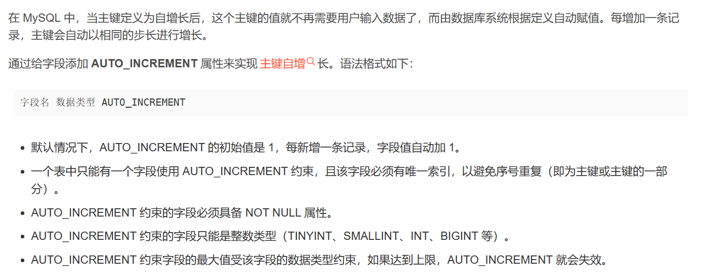

### 定义主键的方式

```sql
添加主键的第一种方式
create table stu4(
    id1 int primary key,   <------#直接指定主键字段
    id2 int,
    name varchar(20)
);


添加主键的第二种方式
create table stu5(
    id1 int,
    id2 int,
    name varchar(20),
    primary key(id1)  <------#语句最后指定主键字段
);


添加主键的第三种方式
create table stu6(
    id1 int,
    id2 int,
    name varchar(20)
);
没有主键的情况下添加主建
alter table stu6 add primary key(id1); <------#表创建完成后添加主键
```

### 联合主键

```sql
create table stu7(
    id1 int,
    id2 int,
    name varchar(20),
    primary key(id1,id2) <------#主键由两个字段组成
);

#不是指定两个主键, 一个primary key就是指定一个主键
#这里只出现了一个primary key, 所以只指定了一个主键
#只不过这个主键比较特殊, 是由两个字段共同组成的
```

外键约束


比如，父表中删除1号研发部，子表中并不会跟着删除。外键约束的作用是使两张表建立联系。子表的外键字段与父表中的主键字段相关联。


添加外键约束的两种方式，一种是建表的时候，另一种使用alter

外键名和外键字段名不是一个东西。


删除外键不会删除绑定的字段


## 多表查询

### 多表关系

数据库表结构设计阶段


一对多


多对多


一对一


### 多表查询

```sql
select * from 表1,表2,表3  -- 查询的是这三张表的笛卡尔积
```


多表查询的分类


#### 内连接


内连接就是笛卡尔积

例子：

在from语句执行了别名操作后，之后的语句只能使用别名而不能使用原名了。


#### 外连接


例子


#### 自连接


自连接就是查询的两张表是同一张表，此时把这一张表当成两张表看。

自连接查询可以结合内连接查询，即查询的是两张表交集的部分。交集的部分是由条件定义的。

也可以结合外连接查询，左连接和右连接是一个道理。

例子：


在下面这张表里，条件 where a.managerid = b.id，这个条件筛选出来这两张表交集部分。但是第一条数据不属于这个交集部分，但是在使用外连接查询的时候，会查询整张表，就会把这条数据查询出来。这个过程相当于在

`from emp a left join emp b`执行完这个就相当于先拿一张a表出来，然后根据条件，把b表的数据贴到a表数据上。


联合查询


```sql
SELECT cust_name, cust_contact, cust_email 
FROM Customers 
WHERE cust_state = 'MI' 
ORDER BY cust_name; 
UNION 
SELECT cust_name, cust_contact, cust_email 
FROM Customers 
WHERE cust_state = 'IL'
ORDER BY cust_name;
```

**这行**代码有两个错误，第一，union前的select语句不加分号，第二，order by只能有一个且位于下面。

#### 子查询


[44. 基础-多表查询-标量子查询_哔哩哔哩_bilibili](https://www.bilibili.com/video/BV1Kr4y1i7ru?p=44&vd_source=5a374f315281b0338a0b7fd69b8b8e98)


## 事务


```sql
select @@autocommit; -- 查看当前数据库是否会自动提交事务，如果值为1，则会自动提交事务。
```

自动提交事务是指：每执行一条语句，就会提交一次事务。

```sql
set @@autocommit = 0; -- 设置为手动提交
```

```sql
commit;  -- 提交事务
rollback; --回滚事务
```

```sql
start transaction;
begin;                    -- 这两个都是开启事务
```


定义事务有两种方式：

第一种，设置成手动提交。然后定义一组sql操作为一个事务，如果成功了就commit，失败了就rollback

第二种，手动开启事务，然后定义一组sql操作为一个事务，如果成功了就commit，失败了就rollback


脏读：


事务A执行update更新操作，但是还没提交。事务B执行select查询操作，读取到了事务A还没提交的update数据，发生了脏读现象。

不可重复读：


事务A读取某张表id=1的数据，然后事务B更新了id=1的数据并提交了，此时事务A又执行了select id=1的数据，读到的数据是事务B更新的数据，但是对于事务A来说，还想重复读取id=1的数据，因为事务B的影响导致事务A不可重复读了。

幻读：


事务A读取id=1的数据，没有读取到，即空表。然后事务B插入了一条id=1的数据并提交了，事务A又插入一条id=1的数据，此时发现插不进去。对于事务A来说，我明明已经看了id=1没有数据啊，为什么插不进去呢？再select id=1的数据还是没看到数据啊。


## 刷题


[584. 寻找用户推荐人 - 力扣（LeetCode）](https://leetcode.cn/problems/find-customer-referee/description/?envType=study-plan-v2&envId=sql-free-50)

查询referee_id不等于2的。（注意NULL）

```sql
select name from Customer where referee_id != 2 or referee_id is NULL;
```

[1148. 文章浏览 I - 力扣（LeetCode）](https://leetcode.cn/problems/article-views-i/?envType=study-plan-v2&envId=sql-free-50)

```sql
select distinct author_id id from Views where author_id = viewer_id order by id asc;
```

跟表别名不一样，字段起别名之后，where后面还是用原名，因为select执行顺序比where靠后。

[1683. 无效的推文 - 力扣（LeetCode）](https://leetcode.cn/problems/invalid-tweets/solutions/2366155/wu-xiao-de-tui-wen-by-leetcode-solution-5tfp/?envType=study-plan-v2&envId=sql-free-50)

```sql

```

对于SQL表，用于计算字符串中字符数的最佳函数是 `CHAR_LENGTH(str)`，它返回字符串 `str` 的长度。

[1661. 每台机器的进程平均运行时间 - 力扣（LeetCode）](https://leetcode.cn/problems/average-time-of-process-per-machine/?envType=study-plan-v2&envId=sql-free-50)

```sql
select 
    machine_id,
    round(avg(if(activity_type='start', -timestamp, timestamp))*2, 3) processing_time 
from Activity 
group by machine_id
```

先执行from，再执行group by，machine_id有三个值，分别是0，1，2,分成三组。

if里面遍历第一个组， (-0.712+1.520-3.140+4.120)

然后×2，取平均，取平均的时候是除4，正好最后公式是(-0.712+1.520-3.140+4.120)/2


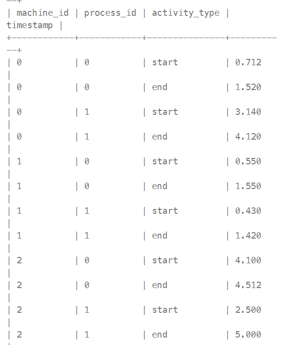

[1280. 学生们参加各科测试的次数 - 力扣（LeetCode）](https://leetcode.cn/problems/students-and-examinations/?envType=study-plan-v2&envId=sql-free-50)

```sql
SELECT 
    s.student_id,
    s.student_name,
    su.subject_name,
   COUNT(e.subject_name) AS attended_exams
FROM
    Students AS s
JOIN
    Subjects AS su
LEFT JOIN
    Examinations AS e
ON
    e.student_id = s.student_id
AND
    e.subject_name = su.subject_name
group by 
    s.student_name,
    su.subject_name
order by
    s.student_id,
    su.subject_name
```

首先Students和Subjects笛卡尔积。然后利用这个表再与Examinations左连接。左连接就是以这个表为基础，每行数据配Examinations整张表。然后利用这仨外键连接三张表。然后先根据s.student_name分组，然后su.subject_name分组。

[570. 至少有5名直接下属的经理 - 力扣（LeetCode）](https://leetcode.cn/problems/managers-with-at-least-5-direct-reports/?envType=study-plan-v2&envId=sql-free-50)

```sql
select e1.name
from Employee e1 left join Employee e2
on e1.id = e2.managerId
group by e1.id
having count(*) >= 5;
```

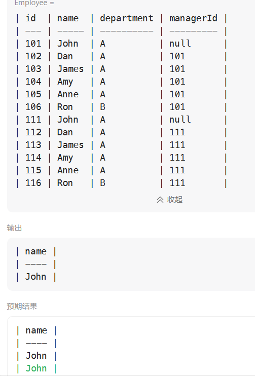

首先，group by 不能用 e1.name，因为可能不同id，有重名的。

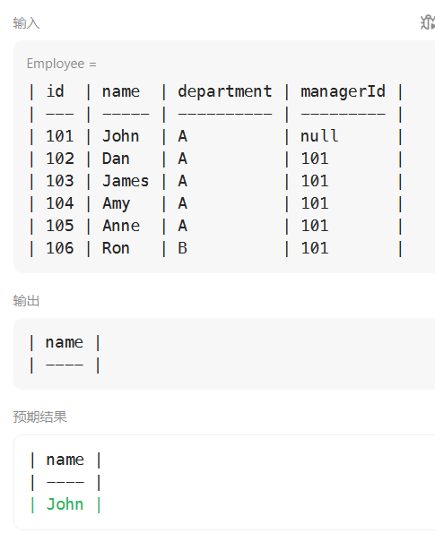

其次，应该是count(*)而不是count(e1.name)，因为count(e1.name)的话，会导致只看这一列数据。e1.name如果为null是不算是数据的，会省略。而count(\*)，即使e1.name是null也不会省略。

[1934. 确认率 - 力扣（LeetCode）](https://leetcode.cn/problems/confirmation-rate/?envType=study-plan-v2&envId=sql-free-50)

```sql
select 
    s.user_id,
    round(ifnull(avg(c.action='confirmed'),0),2) Confirmation_rate
from Signups s
left join Confirmations c
on s.user_id = c.user_id
group by s.user_id;
```

round(x,y)求x四舍五入的值，并保留y位小数。

ifnull(x,y) 如果x的值为null，返回y，否则返回x

avg(c.action='confirmed') 求c.action='confirmed'占所有c.action的比例。

[1251. 平均售价 - 力扣（LeetCode）](https://leetcode.cn/problems/average-selling-price/?envType=study-plan-v2&envId=sql-free-50)

```sql
select p.product_id,ifnull(round(sum(units*price)/sum(u.units),2),0) as average_price
from Prices p
left join UnitsSold u
on u.product_id = p.product_id
and u.purchase_date between p.start_date and p.end_date
group by p.product_id
```

这里用on不用where的原因：

首先p表和u表左连接，意思就是p表的每一个数据项配一张u表，连接条件为`u.product_id = p.product_id`这个的时候，如果p表有一个id=3，但是u表没有id=3，那也会给p表id=3的数据项配null的u表数据项。因为是左连接。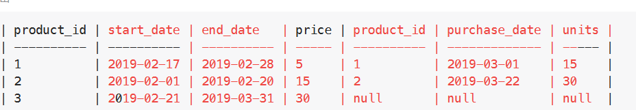

如上图所示。

如果是用where的话，就会筛掉id=3的数据项，就不满足左连接了。这就是为什么使用on的原因。

[1193. 每月交易 I - 力扣（LeetCode）](https://leetcode.cn/problems/monthly-transactions-i/?envType=study-plan-v2&envId=sql-free-50)

```sql
select date_format(trans_date,'%Y-%m') `month`,country,
count(id) trans_count,
count(state='approved' or null) approved_count,
sum(amount) trans_total_amount,
sum(if(state='approved',amount,0)) approved_total_amount
from Transactions
group by date_format(trans_date,'%Y-%m'),country
```

先按照month分组，然后再按照country分组。month会与关键字冲突，要加反引号。

date_format函数是以指定的格式显示日期。

date_format(trans_date,'%Y-%m')以 `%Y-%m`显示日期


# 进阶

## 存储引擎

存储引擎基于表

```sql
show engines;  -- 查询当前数据库支持的存储引擎
```

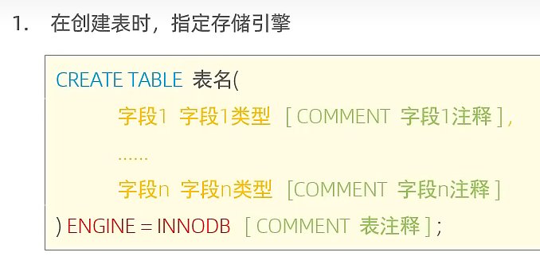

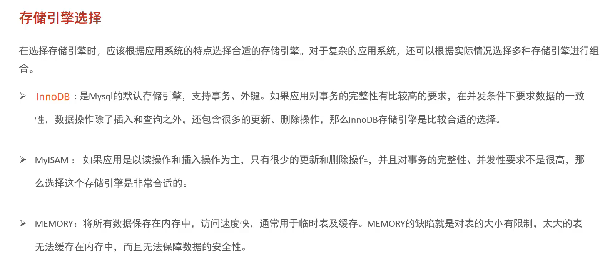

MyISAM：mongodb

memory：redis

## 索引

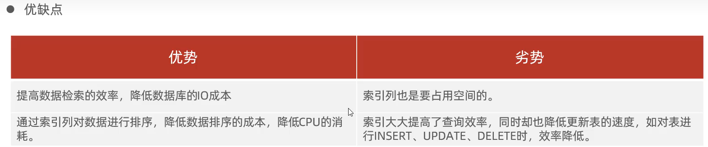

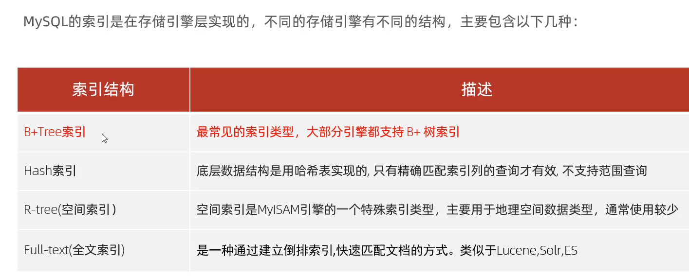

全文索引有印象，就是寻恩东课上讲过。

1. 存储引擎实现索引！
2. 就是将数据存储到支持高效搜索的数据结构中


b树，多路平衡查找树。

b+树，在b树的基础上，所有叶子节点之间互连成双向链表，且所有数据项均出现在叶子节点。

hash就是通过一个函数，如果冲突了，有对应解决冲突的方法。比如冲突了往后接链表。或者塞后一个位置。

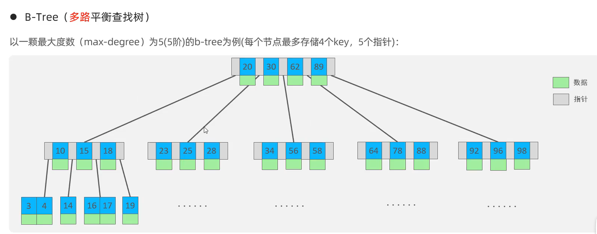

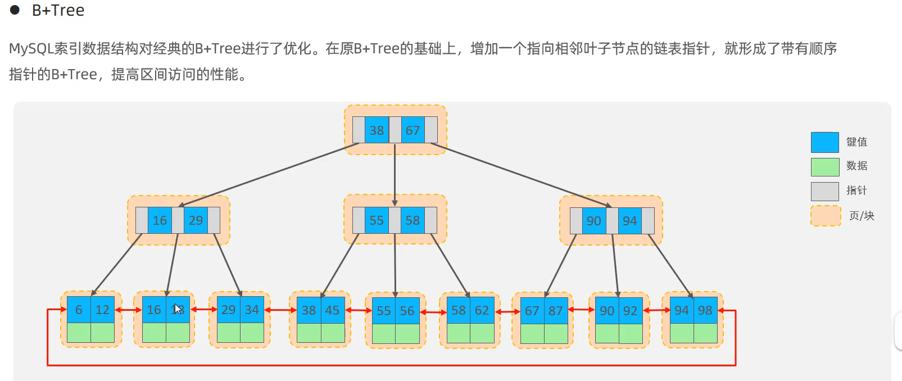

这里的key(键值)就是依据哪一列的值查询。根据这个键值来建立索引数据结构。

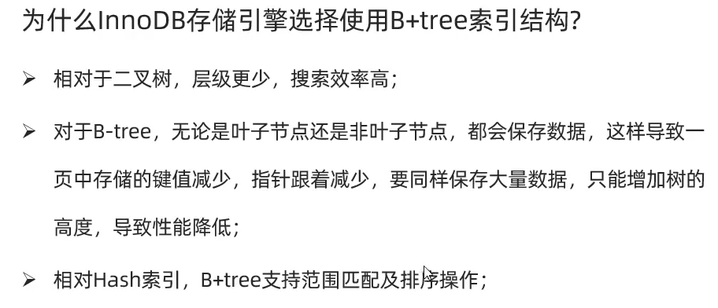

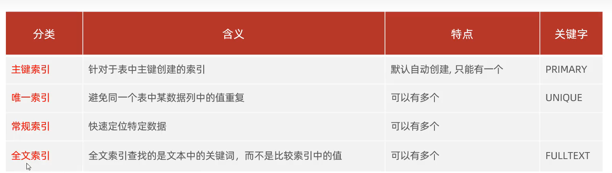

在约束篇中，一张表中一定会有主键，因此会根据主键列自动创建索引结构。

在定义唯一索引之后，也会创建索引结构

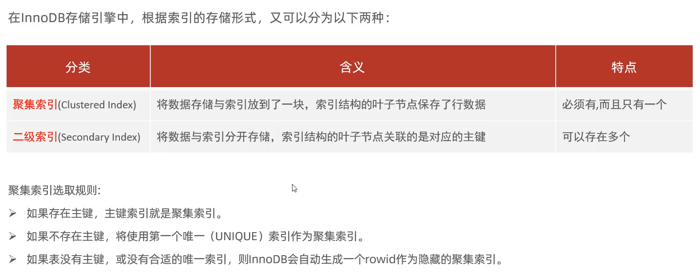

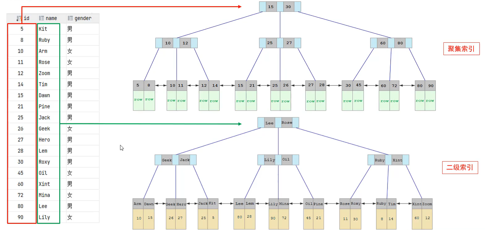

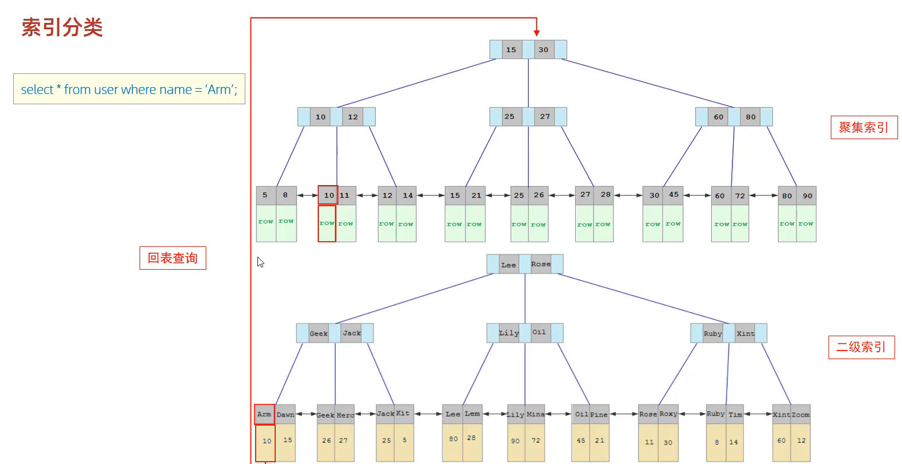

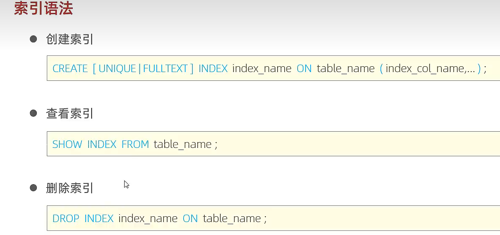

可以创建唯一索引或全文索引，如果指定唯一或全文的话会创建常规索引。后面括号的内容是指定用该表的那些列创建索引，如果只用一列的话是单列索引，用多列的话是联合索引。

索引名 ： idx_表名\_字段名

```sql
show index from 表名[\G]  -- 查看当前表的所有索引，\G表示按行显示
```

索引性能分析：

查看当前数据库的增删改查的频次

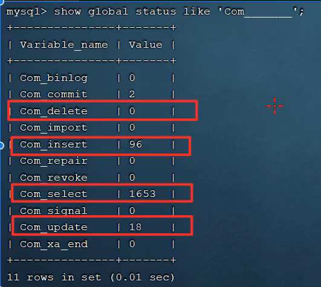


## sql优化

## 视图/存储过程/触发器

## 锁

## InnoDB引擎

## mysql管理


