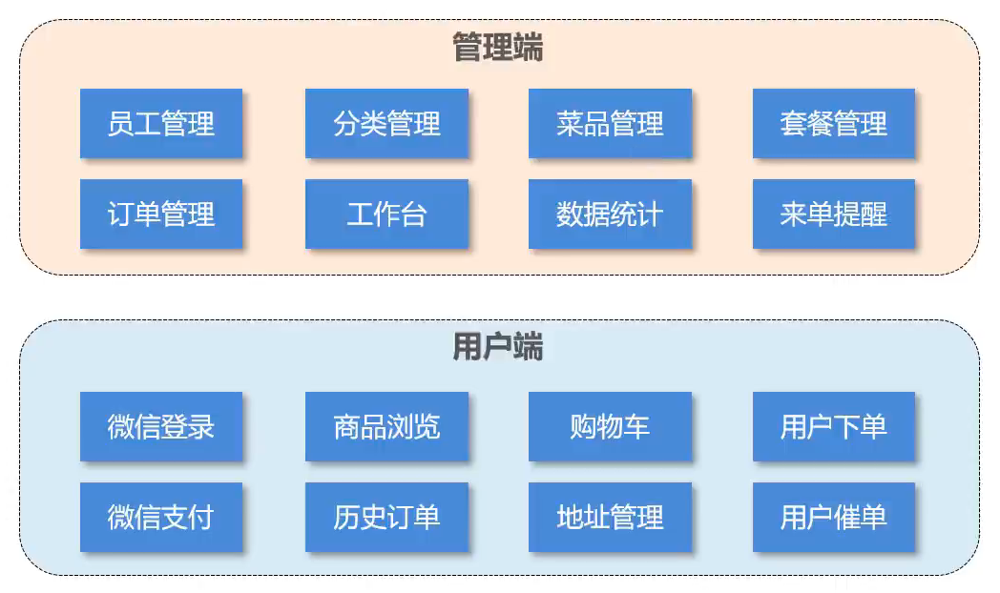
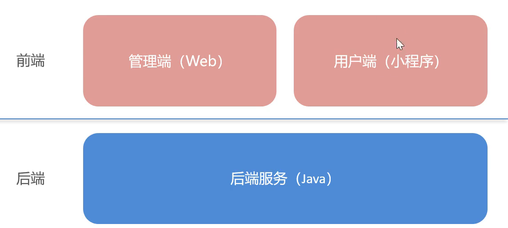

<style>
    img{
        width: 60%;
        padding-left: 20%;
    }
</style>

苍穹外卖

# Day 1

## 软件开发整体介绍

### 软件开发流程

需求分析：完成需求规格说明书、产品原型

设计：UI设计(用户界面设计)、数据库设计(整体库、表结构的设计)、接口设计(前后端联调接口的设计)

编码：项目代码、单元测试(保证项目代码正确)

测试：编写测试用例、出具测试报告

上线运维：软件环境安装、配置

### 角色分工

项目经理：负责整个项目，分配任务、把控进度

产品经理：(需求分析阶段)需求调研，输出需求调研文档、产品原型等

UI设计师：(设计阶段)根据产品原型输出界面效果图？(想象不出来)

架构师：(设计阶段)项目整体架构设计、技术选型等

开发工程师：(编码阶段)前后端根据接口文档编码

测试工程师：(测试阶段)编写测试用例、出具测试报告

运维工程师：(运维阶段)软件环境安装、配置，项目上线

### 软件环境

开发环境：开发人员使用的环境，就是开发人员的电脑

测试环境：测试人员使用的环境，通常会有一台专门用于测试的服务器，开发人员将写好的项目部署到测试服务器由测试人员进行测试。

生产环境：正式对外提供服务的环境，一般是公司的集群服务器(机房)

## 苍穹外卖项目介绍

### 项目介绍

定位：专为餐饮企业定制的一款软件产品

项目整体分两部分：管理端(商家使用)、用户端(客人使用)。功能模块如下



### 产品原型

产品原型是由产品经理设计的一些html页面，用于具体描述每个功能模块。


### 技术选型


## 开发环境搭建

### 前端环境搭建

前端环境有两个，一个是商家管理端(Web端)，一个是客人点餐端(小程序端)。

本项目是前后端分离的开发模式，所以前端Web服务器使用Ngnix，后端使用tomcat。先不管客人点餐端。

前端服务已经提供，我们只需要跑起来即可。



流程如下：

首先将前端服务nginx文件夹存放到无中文路径的地方。中间图片展示的是ngnix服务的标准目录结构。在html文件夹中存放的`sky`文件夹是前端开发人员开发好的前端项目。

<table><tr>
<td></td>
<td></td>
<td></td>
</tr></table>

启动ngnix服务：双击`nginx.exe`，无任何反应，需要打开任务管理器查看nginx进程是否正在运行。

停掉ngnix服务：在`nginx-1.20.2`文件夹下，打开cmd，输入命令

```shell
nginx -s quit    -- 较stop相比就比较温和一些了，需要进程完成当前工作后再停止。
nginx -s stop    -- 比较强硬，无论进程是否在工作，都直接停止进程。
```

访问nginx服务：浏览器输入localhost:80

查看nginx服务占用的端口号，用vscode打开`.\conf\nginx.conf`

### 后端环境搭建

#### 初始工程介绍

提供了后端初始工程，我们把该后端初始工程放在如左图位置。

<table><tr>
<td></td>
<td></td>
<td></td>
</tr></table>

当前项目的目录结构如中图所示，可知，这是一个基于maven构建的idea项目。我们用idea来打开该工程。

项目结构介绍：

`pom.xml`是maven项目的标识，可以看到`sky-take-out`是一个maven工程，下面的三个module也是maven工程。父工程`sky-take-out`统一管理所有子maven工程共同的依赖。

<table><tr>
<td></td>
</tr></table>

三个子module的目录如下，已知的有：

`sky-common`模块下有统一响应结果result类、exception异常类

`sky-pojo`模块下有与数据库表结构对应的entity类

`sky-server`模块下有config配置类、controller、mapper、service、interceptor拦截器、启动类`SkyApplication`、resource目录下有mybatis的mapper映射文件，还有yml配置文件。

<table><tr>
<td></td>
<td></td>
<td></td>
</tr></table>

#### git进行版本控制

用idea创建git以及推送至远程仓库很简单，不再记录。[Day01-06-开发环境搭建_后端环境搭建_使用Git进行版本控制_哔哩哔哩_bilibili](https://www.bilibili.com/video/BV1TP411v7v6/?p=7&spm_id_from=pageDriver&vd_source=5a374f315281b0338a0b7fd69b8b8e98)

#### 数据库搭建

1. [数据库设计文档](数据库设计文档.md)是数据库所有表结构的介绍，我们需要了解。可以看到每张表是与`sky-pojo`中`enetity`中的类是一一对应的。

2. 用datagrip执行sql文件创建数据库及表，这个简单不记录。

3. 在后端工程中配置数据库的连接信息。

   ```
   // application-dev.yml
   sky:
     datasource:
       driver-class-name: com.mysql.cj.jdbc.Driver
       host: localhost
       port: 3306
       database: sky_take_out
       username: root
       password: 123456
   ```

### 前后端联调

启动nginx、Springboot，访问localhost:80，点击登录，如果登录成功说明前后端连通。


### 登录功能完善

提供的初始工程中已经提供了登录功能的代码，只不过存在一些问题，我们需要完善一下。