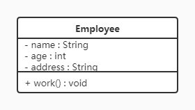

设计模式

# 设计模式概述

## 概念

设计模式是指在软件设计过程中一些不断重复发生的问题，以及该问题的解决方案。设计模式是对面对对象设计原则的实际应用。对类的封装性、继承性和多态性以及类的关联关系和组合关系的充分理解。

正确使用设计模式具有以下优点：

- 可以提高程序员的思维能力、编程能力和设计能力。
- 使程序设计更加标准化、代码编制更加工程化，使软件开发效率大大提高，从而缩短软件的开发周期。
- 使设计的代码可重用性高、可读性强、可靠性高、灵活性好、可维护性强。


## 分类

## 

- **创建型模式**

  用于描述“怎样创建对象”，它的主要特点是“将对象的创建与使用分离”（实现解耦）。GoF（四人组）书中提供了单例、原型、工厂方法、抽象工厂、建造者等 5 种创建型模式。

- **结构型模式**

  用于描述如何将类或对象按某种布局组成更大的结构，GoF（四人组）书中提供了代理、适配器、桥接、装饰、外观、享元、组合等 7 种结构型模式。

- **行为型模式**

  用于描述类或对象之间怎样相互协作共同完成单个对象无法单独完成的任务，以及怎样分配职责。GoF（四人组）书中提供了模板方法、策略、命令、职责链、状态、观察者、中介者、迭代器、访问者、备忘录、解释器等 11 种行为型模式。

不理解也没关系，先了解，我们接着学。


# UML


## 类的表示

在UML类图中，类使用包含类名、属性(field) 和方法(method) 且带有分割线的矩形来表示，比如下图表示一个Employee类，它包含name,age和address这3个属性，以及work()方法。 



属性/方法名称前加的加号和减号表示了这个属性/方法的可见性，UML类图中表示可见性的符号有三种：

- +：表示public
- -：表示private
- #：表示protected
- 什么都不加：表示默认

属性的完整表示方式是： **可见性  名称 ：类型 [ = 缺省值]**  

方法的完整表示方式是： **可见性  名称(参数列表) [ ： 返回类型]**

## 类与类之间关系的表示方式

### 关联关系

关联关系表示一类对象与另一类对象之间的联系，分为一般关联关系、聚合关系和组合关系。

一般关联又可以分为单向关联，双向关联，自关联。

#### 一般关联


**1、单向关联**


在UML类图中单向关联用一个带箭头的实线表示。上图表示每个顾客都有一个地址，这通过让Customer类持有一个类型为Address的成员变量来实现。

**2、双向关联**


从上图中我们很容易看出，所谓的**双向关联就是双方各自持有对方类型的成员变量**。

在UML类图中，双向关联用一个不带箭头的直线表示。上图中在Customer类中维护一个List\<Product>，表示一个顾客可以购买多个商品；在Product类中维护一个Customer类型的成员变量表示这个产品被哪个顾客所购买。


**3、自关联**


自关联在UML类图中用一个带有箭头且指向自身的线表示。上图的意思就是Node类包含类型为Node的成员变量。


#### 聚合关联

聚合关系：例如学校与老师的关系，学校包含老师，但如果学校停办了，老师依然存在。


#### 组合关联

组合关系：头和嘴的关系，没有了头，嘴也就不存在了。


### 依赖关系

依赖关系：某个类的方法通过局部变量、方法的参数或者对静态方法的调用来访问另一个类（被依赖类）中的某些方法。

依赖关系使用带箭头的虚线来表示，箭头从使用类指向被依赖的类。


这个图什么意思呢？意思就是Driver类里定义了方法，方法内部定义了其他类的对象（局部变量而不是成员变量），或者方法的参数是其他类的对象。这种情况跟直接在类中定义其他类的对象（成员变量）还是不一样的，这种情况耦合度低。

### 继承关系

继承关系就是描述继承呗。


### 实现关系

实现关系就是接口与实现类


# 软件设计原则

开闭原则

对扩展开放，对修改关闭。

- 对扩展开放，意味着有新的需求或变化时，可以对现有代码进行扩展，以适应新的情况。
- 对修改关闭，意味着类一旦设计完成，就可以独立的工作，而不要对其进行任何的修改。


# 设计模式

## 创建者模式

创建型模式的主要关注点是“怎样创建对象？”，它的主要特点是“将对象的创建与使用分离”。

这样可以降低系统的耦合度，使用者不需要关注对象的创建细节。

创建型模式分为：

- 单例模式
- 工厂方法模式
- 抽象工厂模式
- 原型模式
- 建造者模式


### 单例模式

单例设计模式分类两种：

​	饿汉式：类加载就会导致该单实例对象被创建

​	懒汉式：类加载不会导致该单实例对象被创建，而是首次使用该对象时才会创建，因为懒，所以用的时候才会创建对象。

```java
// 饿汉式
public class Singleton {
    // 私有化构造器,不能随意创建该类对象
    private Singleton(){}
    // 在类内创建一个唯一的该类对象
    private static Singleton instance = new Singleton();
    // 提供一个获取该对象的方法,必须是static方法.
    public static Singleton getInstance(){
        return instance;
    }
}
```

```java
//懒汉式
public class Singleton {
    //私有构造方法
    private Singleton() {}

    //在成员位置创建该类的对象
    private static Singleton instance;

    //对外提供静态方法获取该对象
    public static [synchronized] Singleton getInstance() { //synchronized保证线程安全
		// 在初次获取对象调用该方法的时候会创建对象，在以后每次获取对象时都会获取同一对象
        if(instance == null) {
            instance = new Singleton();
        }
        return instance;
    }
}
```

如果没有synchronized，可能会出现这种情况：

线程1正好执行完 `if(instance == null)`，还没创建对象，正好切换到线程2执行完 `if(instance == null)`,此时线程1和线程2都会各自创建一个该类的对象。


加上了synchronized之后就不会出现线程安全问题了，但是由于该方法被调用的时候大部分是返回实例对象而不是创建实例对象，当有大量线程调用该方法时会被卡在外面，造成性能问题。

#### 双重检查锁

```java
/**
 * 双重检查方式
 */
public class Singleton { 

    //私有构造方法
    private Singleton() {}

    private static volatile Singleton instance;

   //对外提供静态方法获取该对象
    public static Singleton getInstance() {
		//第一次判断，如果instance不为null，不进入抢锁阶段，直接返回实例
        if(instance == null) {
            synchronized (Singleton.class) {
                //抢到锁之后再次判断是否为null
                if(instance == null) {
                    instance = new Singleton();
                }
            }
        }
        return instance;
    }
}
```

双重检查锁模式是一种非常好的单例实现模式，解决了单例、性能、线程安全问题，上面的双重检测锁模式看上去完美无缺，其实是存在问题，在多线程的情况下，可能会出现空指针问题，出现问题的原因是JVM在实例化对象的时候会进行优化和指令重排序操作。

要解决双重检查锁模式带来空指针异常的问题，只需要使用 `volatile` 关键字, `volatile` 关键字可以保证可见性和有序性。

#### 静态内部类

由于 JVM 在加载外部类的过程中, 是不会加载静态内部类的, 只有内部类的属性/方法被调用时才会被加载, 并初始化其静态属性。静态属性由于被 `static` 修饰，保证只被实例化一次，并且严格保证实例化顺序。

```java
/**
 * 静态内部类方式
 */
public class Singleton {

    //私有构造方法
    private Singleton() {}

    private static class SingletonHolder {
        private static final Singleton INSTANCE = new Singleton();
    }

    //对外提供静态方法获取该对象
    public static Singleton getInstance() {
        return SingletonHolder.INSTANCE;
    }
}
```

<font color='red'>说明：</font>

​	第一次加载Singleton类时不会去初始化INSTANCE，只有第一次调用getInstance，虚拟机加载SingletonHolder

并初始化INSTANCE，这样不仅能确保线程安全，也能保证 Singleton 类的唯一性。

<font color="red">小结：</font>

​	静态内部类单例模式是一种优秀的单例模式，是开源项目中比较常用的一种单例模式。在没有加任何锁的情况下，保证了多线程下的安全，并且没有任何性能影响和空间的浪费。

#### 枚举方式

枚举类实现单例模式是极力推荐的单例实现模式，因为枚举类型是线程安全的，并且只会装载一次，设计者充分的利用了枚举的这个特性来实现单例模式，枚举的写法非常简单，而且枚举类型是所用单例实现中唯一一种不会被破坏的单例实现模式。

```java
/**
 * 枚举方式
 */
public enum Singleton {
    INSTANCE;
}
```

<font color='red'>说明：</font>

​	枚举方式属于饿汉式方式。


单例模式存在的问题

序列化和反射能够使单例类创建多个对象从而破坏单例模式。枚举方式不会出现这两个问题。

p29-p33


### 工厂模式


