# 概述

JVM：Java Virtual Machine，Java虚拟机，是一个运行class文件的程序。

JVM的功能：

1. 将字节码文件中的指令实时解释成机器码，让计算机执行。
2. 内存管理：自动垃圾回收机制，回收不再使用的对象。
3. 即时编译(JIT,)，对热点代码进行优化，提高执行效率。

具体来说，jvm如果发现一段代码将会在很短的时间内多次调用，会将这段代码解释成的机器码保存在内存当中，以便及时的执行。这样就不用每次都进行解释，提高了性能。

JVM的组成：

<table>
    <tr>
        <td>
        </td>
        <td>
        </td>
    </tr>
</table>

类加载器：加载字节码文件中的内容到内存中。

执行引擎：将字节码解释成机器码并执行。

运行时数据区域：JVM管理的内存，即在执行机器码时使用的内存，例如创建对象。

本地接口：由于JVM虚拟机是由C/C++实现的，虚拟机会提供一些已经编译好的c++方法供Java程序员调用。


学习内容：字节码文件、类加载器、运行时数据区、垃圾回收器、即时编译器。


# 字节码文件

字节码类似汇编语言，学会查看并阅读字节码可以清楚地明白Java程序的底层实现。

```java
package cn.itcast.jvm.t5;
// HelloWorld 示例
public class HelloWorld {
	public static void main(String[] args) {
		System.out.println("hello world");
	}
}
```

执行` javac -parameters HellowWorld.java`

`-parameters` 是 Java 编译器的一个选项，它指示编译器在生成的字节码文件中保存方法和构造函数的参数名。通常情况下，Java 编译后的字节码文件中并不包含参数名，只包含参数的类型信息。因此，在运行时使用反射（Reflection）机制时，无法获得参数的名字，只能知道参数的类型。

使用 `-parameters` 选项后，参数名会被保存在字节码中，这样在运行时可以通过反射机制获取方法和构造函数的参数名。这个功能对某些需要了解参数名的框架和库非常有用，比如依赖注入框架、序列化框架等。

举个例子：

假设有一个简单的 Java 类：

```java
public class Example {
    public void greet(String name) {
        System.out.println("Hello, " + name);
    }
}
```

在没有 `-parameters` 选项的情况下编译：

```sh
javac Example.java
```

然后通过反射获取方法参数名：

```java
import java.lang.reflect.Method;
import java.lang.reflect.Parameter;

public class ReflectionExample {
    public static void main(String[] args) throws Exception {
        Method method = Example.class.getMethod("greet", String.class);
        for (Parameter parameter : method.getParameters()) {
            System.out.println("Parameter: " + parameter.getName());
        }
    }
}
```

输出可能会是类似 `arg0` 这样的名字，而不是实际的参数名 `name`。

但如果使用 `-parameters` 选项编译：

```sh
javac -parameters Example.java
```

再通过反射获取方法参数名：

```java
import java.lang.reflect.Method;
import java.lang.reflect.Parameter;

public class ReflectionExample {
    public static void main(String[] args) throws Exception {
        Method method = Example.class.getMethod("greet", String.class);
        for (Parameter parameter : method.getParameters()) {
            System.out.println("Parameter: " + parameter.getName());
        }
    }
}
```

输出将是实际的参数名 `name`。

class文件用十六进制打开：这个就跟汇编语言差不多了，最左边是地址，中间是十六进制内容，就是没有最右边的指令。

```txt
0000000 ca fe ba be 00 00 00 34 00 23 0a 00 06 00 15 09
0000020 00 16 00 17 08 00 18 0a 00 19 00 1a 07 00 1b 07
0000040 00 1c 01 00 06 3c 69 6e 69 74 3e 01 00 03 28 29
0000060 56 01 00 04 43 6f 64 65 01 00 0f 4c 69 6e 65 4e
0000100 75 6d 62 65 72 54 61 62 6c 65 01 00 12 4c 6f 63
0000120 61 6c 56 61 72 69 61 62 6c 65 54 61 62 6c 65 01
0000140 00 04 74 68 69 73 01 00 1d 4c 63 6e 2f 69 74 63
0000160 61 73 74 2f 6a 76 6d 2f 74 35 2f 48 65 6c 6c 6f
0000200 57 6f 72 6c 64 3b 01 00 04 6d 61 69 6e 01 00 16
0000220 28 5b 4c 6a 61 76 61 2f 6c 61 6e 67 2f 53 74 72
0000240 69 6e 67 3b 29 56 01 00 04 61 72 67 73 01 00 13
0000260 5b 4c 6a 61 76 61 2f 6c 61 6e 67 2f 53 74 72 69
0000300 6e 67 3b 01 00 10 4d 65 74 68 6f 64 50 61 72 61
0000320 6d 65 74 65 72 73 01 00 0a 53 6f 75 72 63 65 46
0000340 69 6c 65 01 00 0f 48 65 6c 6c 6f 57 6f 72 6c 64
0000360 2e 6a 61 76 61 0c 00 07 00 08 07 00 1d 0c 00 1e
0000400 00 1f 01 00 0b 68 65 6c 6c 6f 20 77 6f 72 6c 64
0000420 07 00 20 0c 00 21 00 22 01 00 1b 63 6e 2f 69 74
0000440 63 61 73 74 2f 6a 76 6d 2f 74 35 2f 48 65 6c 6c
0000460 6f 57 6f 72 6c 64 01 00 10 6a 61 76 61 2f 6c 61
0000500 6e 67 2f 4f 62 6a 65 63 74 01 00 10 6a 61 76 61
0000520 2f 6c 61 6e 67 2f 53 79 73 74 65 6d 01 00 03 6f
0000540 75 74 01 00 15 4c 6a 61 76 61 2f 69 6f 2f 50 72
0000560 69 6e 74 53 74 72 65 61 6d 3b 01 00 13 6a 61 76
0000600 61 2f 69 6f 2f 50 72 69 6e 74 53 74 72 65 61 6d
0000620 01 00 07 70 72 69 6e 74 6c 6e 01 00 15 28 4c 6a
0000640 61 76 61 2f 6c 61 6e 67 2f 53 74 72 69 6e 67 3b
0000660 29 56 00 21 00 05 00 06 00 00 00 00 00 02 00 01
0000700 00 07 00 08 00 01 00 09 00 00 00 2f 00 01 00 01
0000720 00 00 00 05 2a b7 00 01 b1 00 00 00 02 00 0a 00
0000740 00 00 06 00 01 00 00 00 04 00 0b 00 00 00 0c 00
0000760 01 00 00 00 05 00 0c 00 0d 00 00 00 09 00 0e 00
0001000 0f 00 02 00 09 00 00 00 37 00 02 00 01 00 00 00
0001020 09 b2 00 02 12 03 b6 00 04 b1 00 00 00 02 00 0a
0001040 00 00 00 0a 00 02 00 00 00 06 00 08 00 07 00 0b
0001060 00 00 00 0c 00 01 00 00 00 09 00 10 00 11 00 00
0001100 00 12 00 00 00 05 01 00 10 00 00 00 01 00 13 00
0001120 00 00 02 00 14
```

根据 JVM 规范，类文件结构如下：

```java
ClassFile {
    u4 magic;
    u2 minor_version;
    u2 major_version;
    u2 constant_pool_count;
    cp_info constant_pool[constant_pool_count-1];
    u2 access_flags;
    u2 this_class;
    u2 super_class;
    u2 interfaces_count;
    u2 interfaces[interfaces_count];
    u2 fields_count;
    field_info fields[fields_count];
    u2 methods_count;
    method_info methods[methods_count];
    u2 attributes_count;
    attribute_info attributes[attributes_count];
}
```

在 Java 类文件的结构定义中，`u4` 和 `u2` 是表示数据类型的缩写，它们代表无符号整数类型。具体来说：

- `u4` 表示一个 4 字节（32 位）的无符号整数。
- `u2` 表示一个 2 字节（16 位）的无符号整数。

`u4 magic`表示magic是一个4字节的无符号整数，1个字节是8bit，1个十六进制是4bit。4个字节是32bit，也就是8个十六进制。

0~3 字节，表示它是否是【class】类型的文件，即magic=**ca fe ba be**

0000000 **ca fe ba be** 00 00 00 34 00 23 0a 00 06 00 15 09

`u2 minor_version`表示`minor_version`是一个2字节的无符号整数，16bit/4=4个十六进制

0000000 ca fe ba be **00 00** 00 34 00 23 0a 00 06 00 15 09

minor_version=0000,minor_version表示 Java 类文件格式的次版本号

`major_version`: 主版本号，表示 Java 类文件格式的主版本号 ,**major_version=00 34**   十六进制的34是十进制的52.

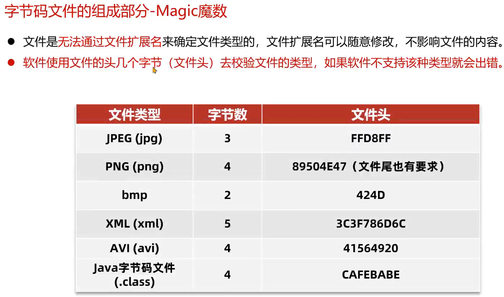

u2 constant_pool_count; 常量池的大小00 23---十进制35表示一共有35个常量。

| Constant Type               | Value |
| --------------------------- | ----- |
| CONSTANT_Class              | 7     |
| CONSTANT_Fieldref           | 9     |
| CONSTANT_Methodref          | 10    |
| CONSTANT_InterfaceMethodref | 11    |
| CONSTANT_String             | 8     |
| CONSTANT_Integer            | 3     |
| CONSTANT_Float              | 4     |
| CONSTANT_Long               | 5     |
| CONSTANT_Double             | 6     |
| CONSTANT_NameAndType        | 12    |
| CONSTANT_Utf8               | 1     |
| CONSTANT_MethodHandle       | 15    |
| CONSTANT_MethodType         | 16    |
| CONSTANT_InvokeDynamic      | 18    |

常量池可以看作是一张大型的符号表，记录了类、接口、方法、字段等的相关信息。以及他们的引用。

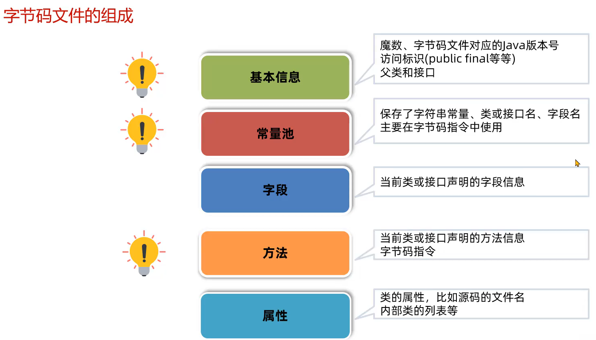

第一部分是基本信息，能看懂。第二部分是常量池，是张符号表，存储了各种字节码指令中会用到的信息，在字节码指令中是符号引用，根据常量池这张表找到对应的信息。

知道字节码文件是根据JVM规范实现的就行。我们不会看字节码的十六进制表示的，我们会使用jclasslib查看整理好的字节码文件。

使用jclasslib工具查看本地class文件。

jclasslib的使用。

javap是JDK自带的反编译工具，可以通过控制台查看字节码的内容。适合在服务器上查看字节码文件的内容。

```bash
jar -xvf 要解压的jar包名   -- 解压jar包
javap -v 要查看的字节码文件  -- 将字节码文件的内容输出到控制台
javap -v 要查看的字节码文件 > a.txt  --把字节码内容保存到txt文件中，然后打开txt，比在控制台上容易观察。
```

开发环境使用jclasslib插件

阅读字节码指令的方法：

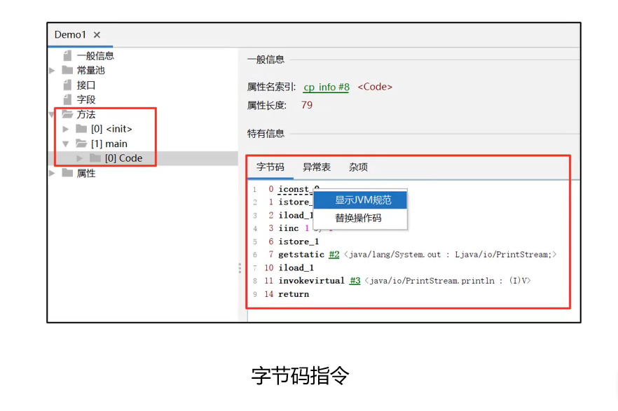

arthas


# 类的生命周期

类的生命周期描述了一个类加载、使用、卸载的整个过程。

类加载过程：ClassLoader将字节码信息(二进制)加载到方法区，生成一个InstanceKlass对象，存储二进制的字节码信息。同时在堆区生成一个Class对象，以便获取constructor、method、fields对象,建立反射机制。对于开发者来说，不关心InstanceKlass对象。

类的生命周期：

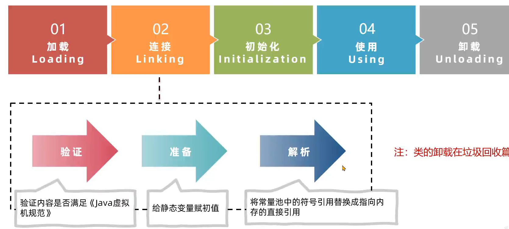

验证阶段：字节码文件的内容是有Java虚拟机规范要求的，这个阶段需要进行验证传进来的字节码文件符不符合规范

给静态变量赋初值赋的是默认值。

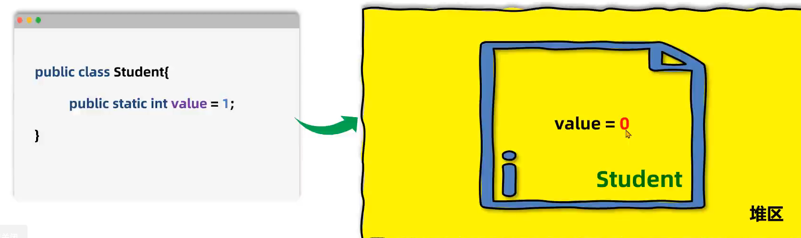

这个是编译的时候就已经决定了的。

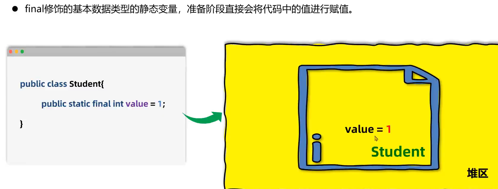

初始化阶段：给静态变量赋值、执行静态代码块。（按类中的位置顺序执行）

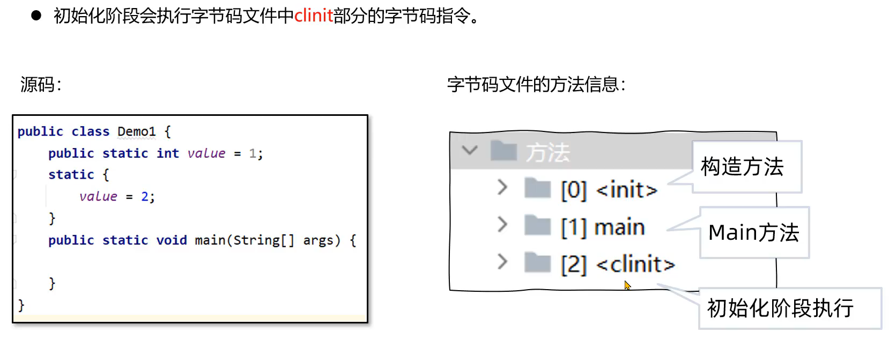

以下几种方法会导致类的初始化：

1. 访问类的静态方法或静态变量，如果静态变量被final修饰且等号右边为字面量，访问这类的不会导致类的初始化。如下图
2. 调用`Class.forName(String className)`
3. new一个该类对象
4. 执行main方法

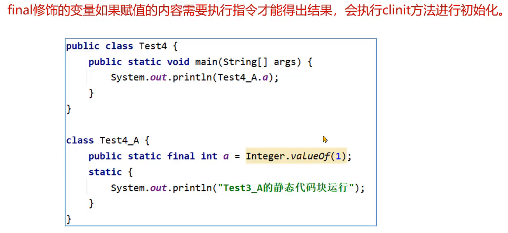


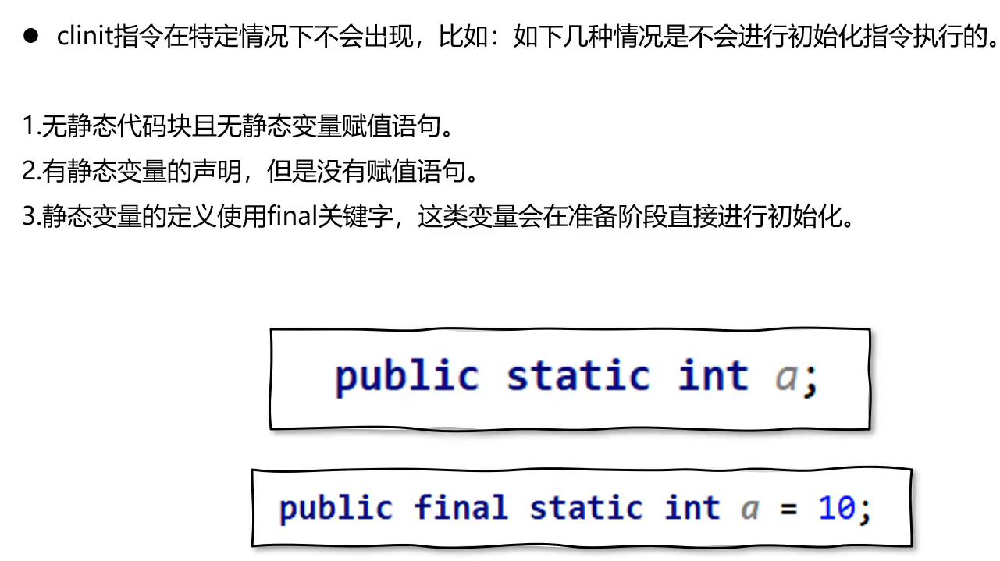


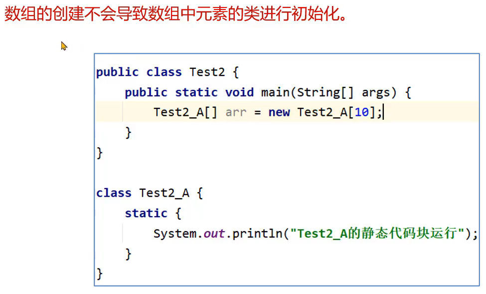

原因如下：上面的那行代码只是开辟了10个Test2_A类型的对象的空间，并没有创建对象。


# 类加载器

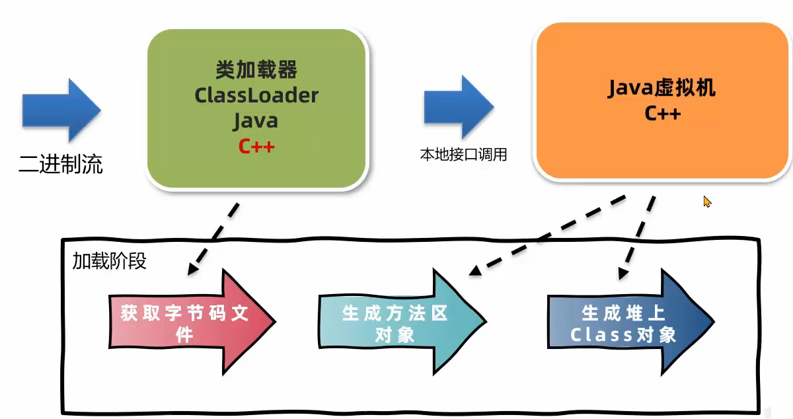

```java
public class Test
{
    public static Test t1 = new Test();
    {
         System.out.println("blockA");
    }
    static
    {
        System.out.println("blockB");
    }
    public static void main(String[] args)
    {
        Test t2 = new Test();
    }
 }
```

这段代码执行后输出的结果：blockAblockBblockA

原因如下：首先会调用main方法，在调用前触发类的装载，在连接阶段，给类中的静态变量赋默认值。t1=null，然后进入初始化阶段，这个过程对静态变量和静态代码块按顺序执行。先执行`t1=new Test()`，发现clinit过程已经调用，于是可以开始触发init过程，成员变量的初始化，非静态代码块，构造方法。输出blockA

然后继续执行初始化阶段，执行静态代码块输出blockB。初始化阶段完毕，最后执行main方法。


# 运行时数据区

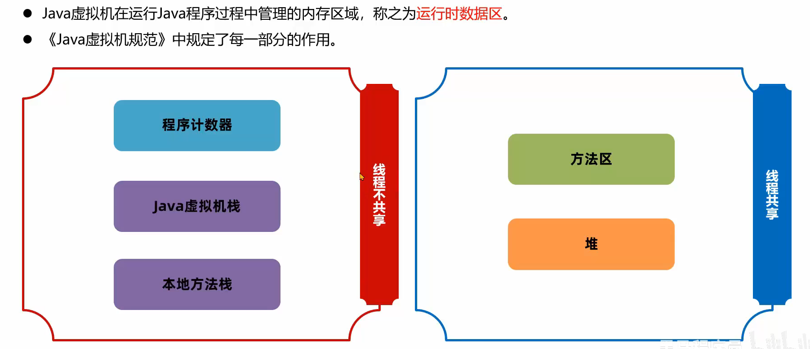

线程不共享是指每一个线程都会有一份程序计数器、虚拟机栈、本地方法栈


程序计数器：每个线程都会将**当前要执行的字节码指令的地址**保存在程序计数器中。指令的地址是固定长度的，不会导致程序计数器的数据溢出。在学汇编语言的时候，程序计数器是寄存器，在Java虚拟机中是用一个变量来模拟的。

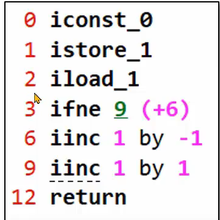

左边的数字是当前指令的地址相对于字节码指令开始的偏移量


栈：JVM使用一个物理上的栈来保存虚拟机栈和本地方法栈。

每次调用一个方法就会将当前方法的一些信息包装成一个栈帧压栈，下面是栈帧包含的内容。执行完return之后再弹栈


在jclasslib中查看test1()这个方法的一些信息。最右边是字节码文件中的局部变量表，并不是栈帧里的局部变量表 

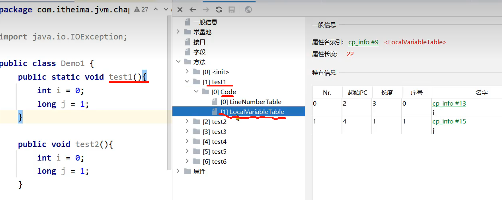

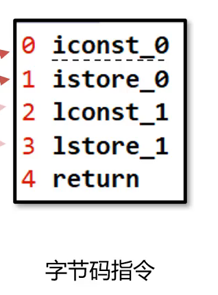

Nr.表示编号

起始PC和长度表示这个变量生效的范围，2表示字节码的标号为2开始，长度，从2开始数3个指令，这个范围内的指令，就是该变量生效的范围。


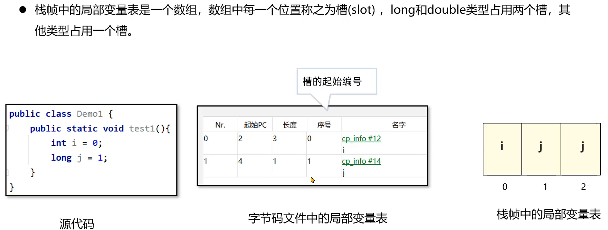

字节码文件中的局部变量表里的序号那一栏表示变量在栈帧中的起始位置。

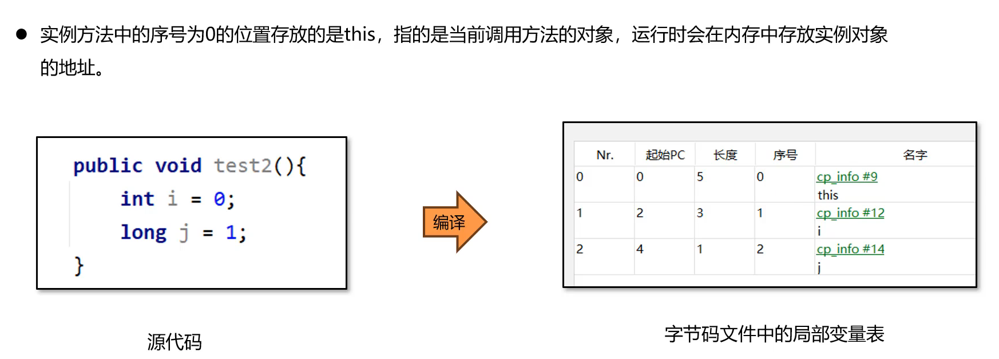

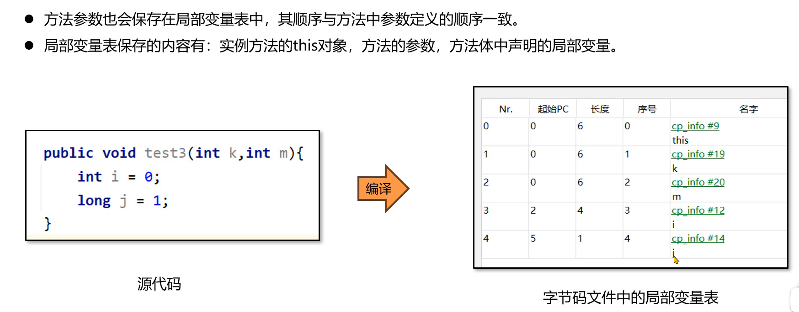


栈帧中局部变量表中slot的复用性。

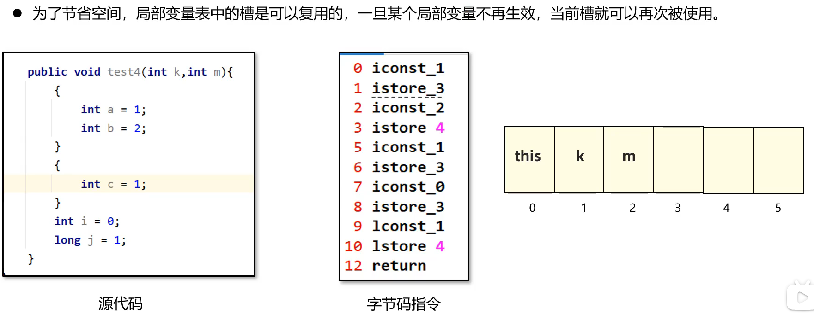

istore_3表示把变量a放到slot3的位置，istore4表示把变量b放到slot4，在执行第二个代码块的时候，第一个代码块的变量失效，此时再次执行istore3表示把变量c放到slot3的位置。


操作数栈

因为字节码指令最多的是压栈弹栈操作，操作数栈就是用来临时存储数据的地方。

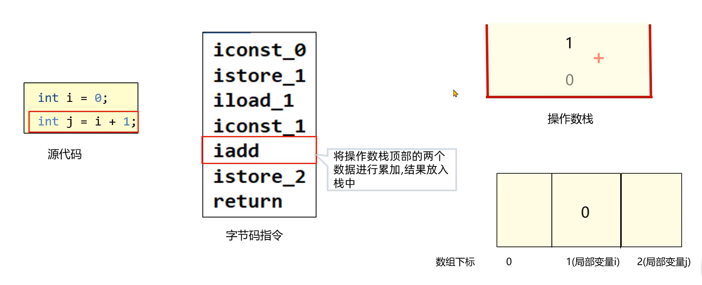

看右下角栈帧的局部变量表，局部变量i和j实际存储的是值。不是局部变量。


帧数据动态链接

在类的生命周期中，连接阶段会把字节码指令中的符号引用换成地址值，但是如果符号引用不属于当前类，即在当前类中调用了其他类的属性或方法时，这个符号引用不会被换成地址值。这些地址值会存放在运行时常量池里中。

动态链接：保存了这些符号引用到运行时常量池中对应地址值的映射关系。

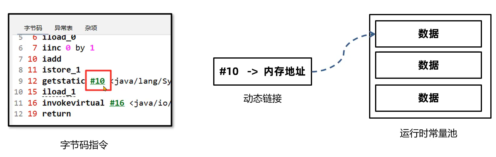


帧数据方法出口：

当 当前方法执行完以后，需要回到调用该方法的那条字节码指令中，

