python中一切皆对象

pep8,py文件执行顺序,注释,文档字符串,标识符,变量绑定,关键字,续行符,常量,字面量及六大类型,输入输出语句,索引和切片,for、range、if、continue、break、while，运算符，函数，命名空间，模块/包及搜索路径，类，异常，内置函数,字节码,查源码(内置模块是c++代码，查不了。只能查标准库模块python源码)

😀pep8：Python的官方代码风格指南，首先，它使得代码更加易读和易懂，这在团队合作或者长期维护中显得尤为重要。其次，统一的编码风格也有助于提高开发效率，因为开发者可以更快地熟悉和理解他人的代码。最后它有助于保证代码的质量和可维护性。

😀py文件的执行顺序

从顶部开始顺序执行。

```python
if __name__ == "__main__":
    # 文件被执行时想要执行的代码
else:
    # 文件被导入时想要执行的代码
```

此模块对象的属性`__name__`，当此模块是被import时，`__name__`的值为模块名，当此模块被执行时，`__name__`为`'__main__'`

😀注释

```python
# 单行注释，多行注释都用
```

😀文档字符串

使用一对三个单引号 **'''** 或者一对三个双引号 **"""** 来定义文档字符串。用于描述模块、函数、类、方法。

| 描述的对象   | 语句位置     |
| ------------ | ------------ |
| **模块**     | 文件第一行   |
| **函数**     | 函数体第一行 |
| **类**       | 类体第一行   |
| **类的方法** | 方法体第一行 |

😀标识符

标识符：程序员定义的名称/变量

(包括类名、函数名、模块名还有通过赋值语句定义的名字还有其他的属性名啥的)

变量的定义：变量x可以接收任意东西，并可以代表其接收的东西。例如c定义一个int类型的变量，限定了变量接收的范围，表示该变量只能接收int类型的东西。而python变量不限制其接收的范围。

1. 变量名只能包含字母、数字和下划线。不能以数字打头
3. 不能将python关键字作为变量名
5. 慎用小写字母l和大写字母O,因为它们可能被⼈错看成数字1 和0。
6. 大小写敏感

Python 3 允许使用 Unicode 字符作为标识符。

pep8要求用ascii字符，PEP8规定变量名和函数名采用**小写字母加下划线的形式**，例如用“calculate_average”表示计算平均值的函数，用“user_name”表示存储用户名的变量

```python
姓名 = "张三"  # 合法
π = 3.14159   # 合法
```

😀变量绑定：变量名与对象绑定。

```python
a = 1  # 将int类对象与变量a绑定
a,b = 1, 2 # 可以同时给多个变量赋对象,用逗号进行分隔，按顺序进行绑定  等号右边是一个元组
```

在python中一切皆对象，在Python 中，**定义一个类或函数或类的方法时，会创建一个 class 或 function或method对象，并将其绑定给类名或函数名。**

因此，不仅赋值语句可以实现绑定，定义类或函数或类的方法时也会绑定

> 变量绑定的底层实现
>
> 变量的值就是对象的地址。注意这是底层，强调一下，这是底层，为什么这么说，在python层面，只有一句话，变量就是对象的一种表示，任何对变量的操作，都是根据变量的绑定找到对应的对象，对对象的操作。
>
> 例如，a == b，并不是比较变量a和变量b的值，而是根据变量绑定找到对应的对象，判断 对象==对象。
>
> 任何时候，碰到对变量的操作，都先去找对应的对象，再考虑对对象的操作。在我们python程序员眼里，变量是没有值的，就是一个符号，更不存在对变量进行操作。因为python没有指针的概念。


😀关键字

Python 的标准库提供了一个 keyword 模块，可以输出当前版本的所有关键字：

```python
import keyword
print(keyword.kwlist)
```

😀续行符

Python 通常是一行写完一条语句，但如果语句很长，我们可以使用反斜杠 \ 来实现多行语句

```python
total = item_one + \
        item_two + \
        item_three
```

Python 可以在同一行中使用多条语句，语句之间使用分号 **;** 分割，以下是一个简单的例子：

```python
import sys; x = 'runoob'; sys.stdout.write(x + '\n')
```

```python
 x = 'runoob', sys.stdout.write(x + '\n')  # 这样也可以实现一行实现多条语句，返回值是这俩返回值的一个元组
 # 自己写代码，就一行一句就行，了解这俩是防止别人的代码这样写,自己看不懂
```

😀常量

在Python中，没有“常量”类型。Python 中的一个常见约定是使用大写变量名称来指示应将变量视为常量，提示其他开发人员不应修改该值。请务必注意，Python 不会阻止修改这些变量，需要依赖于程序员自觉遵守约定。

```python
MAX_CONNE = 5000
```

😀字面量

1. **字面量就是对象。**

举个例子：

```python
a = 1
print(a.bit_length()) # 1
1.to_bytes(); #   报错,这并不说明字面量1不能调用int类的方法，实际上，上述报错是语法层面上的错误  1.会被当成 float，给1加上括号(1)再调用就不会报错了，说明字面量就是对应类型的对象

print((1).bit_length());  # 1
```

2. **字面量的六大类型**

|  类型  | 描述                                                 |
| :----: | :--------------------------------------------------- |
| number | int、float、complex、bool                            |
|  str   | 有序、不可变序列，元素为字符                         |
|  list  | 有序、可变序列，元素可以是任意类型                   |
| tuple  | 有序、不可变序列，元素可以是任意类型                 |
|  set   | 无序、不重复集合，元素不能重复，所以必须是hashable   |
|  dict  | 无序的Key:Value集合，Key不能重复，所以必须是hashable |

先来简单介绍一下这六大类型字面量的表示形式

```python
# 整数的表示
a, b = 1, -1         # 十进制的正负

num1 = 42        # 十进制
num2 = 0b101010  # 二进制
num3 = 0o52      # 八进制
num4 = 0x2A      # 十六进制
# num1,num2,num3,num4绑定同一个int类对象

age = 14_000_000_000    # 当数字较大的时候可以用下划线进行分组，使清晰易读
print(age) # 14000000000

# 浮点数的表示
f0, f1, f2, f3 = 314.0, 0.314, .314, 3.14e-1 # 小数点形式(必须包含小数点)或指数形式
# 复数的表示
c1, c2 = 1+2j, complex(1,2) #这俩是一样的
# bool
"""
1. bool 是 int 的子类,因此布尔值可以被看作整数来使用,Python 会将 True 视为 1，False 视为 0
2. 数字0、None、空字符串、空列表、空元组、空字典{}等被视为 False。
"""
True,False

# 字符串的表示
# 在 Python 中，一对单引号（'）或者一对双引号（"）可以用来创建单行字符串，引号属于界定符，不是字符串的一部分。
str0 = "hello,world"

# 列表的表示
# 在Python中，使用方括号 [] 可以直接创建一个列表。列表中的元素用逗号 , 分隔。
my_list = [1, 2, 3, 4, 5]                                                # 列表的元素可以是任意对象
# 元组的表示
# 除了创建空元组,()是必须的，非空元组的()都不是必须的;但为了规范，我们一般都会加上()
tup1 = ()  # 创建空元组
tup2 = (1,)                                                              # 元组的元素可以是任意对象
tup3 = 1,   # 逗号不能少，否则会被识别为整数
tup4 = 1,2,3,4
# 集合的表示
# 用一对{}标识，用逗号分隔元素
a = set() # 空集合的创建
a = {1,2,'3sd',(4,)}                                                    # 集合的元素必须是hashable
# 字典的表示
# 用一对{}标识，元素之间用逗号分隔,字典的元素是键值对，键值之间由冒号标识.
dic = {} # 空字典的创建
alien = {'color':'green','points': 5}                                   # 字典的键必须是hashable
```

- **不可变数据（3 个）：**number、str、tuple
- **可变数据（3 个）：**list、set、dict

不可变：不支持在本身上进行增删改。

> 元组不可变，是指元组**结构固定**，即：
>
> - 元组长度不能变（不能加、删元素）
> - 元组中每个“槽位”引用的对象不能替换（即元素引用不可变）

> 元组是不可变的，即不支持在本身上进行增删改，如果元组里有一个元素是列表，是可以列表是可变的，即可以增删改。那这个元组还算不可变的吗？
>
> 算！因为，元组的元素没有变化，还是这几个对象。

(有序)序列：序列是可迭代对象(支持遍历)，支持索引和切片

(无序)集合：元素必须是可哈希对象，hashable:pass

> 如果元组里存在不可哈希的对象，那该元组也不可哈希。

😀输入输出语句

```python
# end -- 用来设定以什么结尾。默认值是换行符 \n，如果不想换行就换成 ''
print(*objects, sep=' ', end='\n', file=sys.stdout, flush=False)
```

```python
age = input("How old are you? ") # 返回值是字符串类型。
# age = int(age) 
print(age >= 18) 
# '>=' not supported between instances of 'str' and 'int'
```

😀索引和切片

对于一维列表，可以用`list[index]`来索引，对于二维列表，如何索引呢？

```python
b = [[1,2,3],[4,5,6]]  # 2x3
a = b[1][1]
print(a)
------
5
```

切片

什么样的对象支持索引和切片？

在 Python 中，**能被索引（obj[i]）或切片（obj[start:stop:step]）的对象**，需要满足以下条件：

条件：实现了以下方法中的至少一个

- `__getitem__(self, index)`：支持索引和切片（都调用这个方法）
- `__setitem__(self, index, value)`：支持通过索引/切片赋值
- `__delitem__(self, index)`：支持通过索引/切片删除

切片两大功能：

```python
# 在左边和在右边3
a = [1, 2, 3, 4, 5]
# 索引切片:比单一索引能强大，支持范围索引，步长控制索引(包括逆序)，如果可变对象的索引切片，支持修改和删除
a[:2] = [10, 20]  # 替换前两项
print(a)  # 输出: [10, 20, 3, 4, 5]
# 浅拷贝切片:由[start:stop:step]控制的子序列
b = a[1:4]  
b[:2] = [1,2]
print(a)

# 索引就这两个功能，
# 对于可变和不可变对象切片，不可变对象的索引切片是不支持修改和删除的。
# 那么对于不可变对象的浅拷贝全切片，如果也浅拷贝的话，是没有意义的，因为如果浅拷贝的话，内存中俩一模一样的不可变对象，
# 又不能更改，只需要一份就够了。


# 浅拷贝切片会返回一个新对象，新对象的元素是原序列的元素是同一个对象，即浅拷贝。
# 优化：在全切可变对象时，会返回同一个对象。
# 这就保证了，不可变对象，如果内容相同，内存中只会存在一份。
# 例子:
t0 = (1,2,3)
t1 = t0
t2 = t0[:]
print(t0 is t1)  # True
print(t0 is t2)  # True
# 也就是说 t1=t0和 t2=t0[:] 等价
```

基本语法

```python
4
```

😀if语句

```python
age = 12
if age < 4:
    print("Your admission cost is $0.")
elif age < 18:
    print("Your admission cost is $25.")
else:
    print("Your admission cost is $40.")
```

else非必须：如果所有的情况都可以用elif考虑到。。

if也可以嵌套

😀for循环和range()函数

用for循环来遍历可迭代对象

```python
bicycles = ['trek','redline','specialized']
for i in bicycles:       # 每一个 i 对应 列表中的一个元素；print函数自带换行
    print(i)
-----
trek
redline
specialized
```

```python
for i in range(a,b,c):   # [a,b)，步长是c   每一个i对应一个数字 切片？？？5
	#循环体
```

range返回值是一个可迭代对象。

for循环定义的"临时"变量可以在for循环外访问到，因为命名空间。

😀continue&break

😀while循环

用户决定循环结束：

```python
prompt = "\nTell me something, and I will repeat it back to you:" 
prompt += "\nEnter 'quit' to end the program. " 
 
message = "" 
while message != 'quit': 
    message = input(prompt) 
    if message != 'quit': 
        print(message) 
```

😀命名空间6

[高级Python编程知识-08.变量范围_哔哩哔哩_bilibili](https://www.bilibili.com/video/BV1UG4y1o7tG?spm_id_from=333.788.player.switch&vd_source=5a374f315281b0338a0b7fd69b8b8e98)

global

build-in,全局namespace（模块），局部namespace（函数）

静态。

[高级Python编程知识-09.nonlocal范围_哔哩哔哩_bilibili](https://www.bilibili.com/video/BV1mY411R7F5?spm_id_from=333.788.player.switch&vd_source=5a374f315281b0338a0b7fd69b8b8e98)

nonlocal

标识符与命名空间：

```python
del var            # 删除标识符：应该与命名空间有关系
del var_a, var_b
```

😀模块的搜索路径

前面介绍了导入模块的方法，接下来我们需要学习模块的搜索路径，这样如果显示没找到模块，或者模块使用错了，我们好根据模块的搜索路径，将其放置到正确的地方，以使模块能被找到或者能找到我们想使用的模块。

python解释器是由c语言实现的，用c语言实现了一些模块内置进了python解释器，这些内置模块被列在这个变量里`sys.builtin_module_names`（注意这不是标准库，标准库是python代码实现的，随python一起安装）

```python
import sys
print(sys.builtin_module_names)
```

当python解释这一条语句时 `import spam`,python首先会在  python的内置模块`sys.builtin_module_names`中找。如果没找到，就去变量 `sys.path`中找，这个列表里放的全是路径。解释器会按照列表顺序搜索,直到找到第一个模块就停止

sys.path列表的顺序

1. 当前目录。
2. 环境变量 `PYTHONPATH` 指定的目录。
3. Python 标准库目录。
4. 第三方包所在的 `site-packages` 目录(pip默认的安装目录)
5. `.pth` 文件中指定的目录。

sys.path 输出是一个列表，其中第一项是空串 ''，代表当前目录（若是从一个脚本中打印出来的话，可以更清楚地看出是哪个目录），亦即我们执行 python 解释器的目录（对于脚本的话就是运行的脚本所在的目录）。

#### 整数

在Python中存在小整数对象池机制(small integers pool)，对于范围在[-5, 256]之间的整数，Python会提前创建好这些整数对象并缓存起来。当我们使用这个范围内的整数时，实际上是引用了相同的对象。

[【python】字节码和虚拟机？python代码竟然是这么执行的！_哔哩哔哩_bilibili](https://www.bilibili.com/video/BV1ju411z7Sy/?spm_id_from=333.337.search-card.all.click&vd_source=5a374f315281b0338a0b7fd69b8b8e98)

#### 字符串

**转义；方法和属性；格式化字符串**

关于创建多行字符串字面量，不要用文档字符串也就是三重引号，因为含有隐式的换行符，会给程序员造成不必要的麻烦，要想创建多行字符串字面量，建议用单行字符串加换行符

使用单引号创建字符串，可以在字符串中直接使用双引号，而不需要转义：

```python
string1 = 'He said, "Hello!"'    # 输出 He said, "Hello!"
```

使用双引号创建字符串，可以在字符串中直接使用单引号，而不需要转义：

```python
string2 = "I'm fine."   # 输出  I'm fine.
```

但是，如果你想在同一种引号类型的字符串中包含该引号本身，就需要使用转义字符。

例如，如果你想在单引号字符串中包含单引号本身，你可以使用转义字符：

```python
string3 = 'It\'s raining.'
```

同样地，如果你想在双引号字符串中包含双引号本身，你可以使用转义字符：

```python
string4 = "She said, \"I love Python!\""
```

需要注意的是，当你使用，引号内的引号不需要转义，无论是单引号还是双引号。


字符串可以用 `+` 拼接，也可以用 `*` 重复：

```python
print(3 * 'un' + 'ium')
------
unununium
```

相邻的两个或多个字符串会自动拼接：

```python
print('Py' 'thon')
-----
Python
```


```python
name = "ada lovelace"
name.title()           //返回值是 将每个单词的首字母大写 ;不改变本身
name.upper()           //返回值是 将字符全都改为大写；不改变本身
name.lower()           //返回值是 将字符全都改为小写；不改变本身
name.rstrip()   //返回值是 删除字符串结尾多余的空格 ；不改变本身
name.lstrip()   //返回值是 删除字符串开头多余的空格 ；不改变本身
name.strip()    //返回值是 删除字符串两边多余的空格 ；不改变本身
```


格式化字符串

在字符串前加$f$ 能将字符串中大括号的内容识别为python的可执行语句

```python
first_name = "ada"
last_name = "lovelace"
full_name = f"{first_name} {last_name}"
print(full_name)
-----
ada lovelace
```

使用占位符

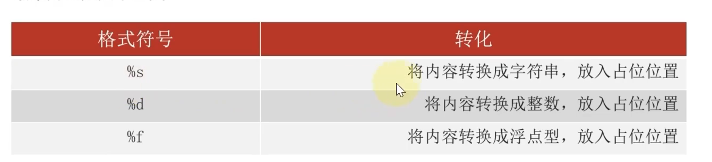

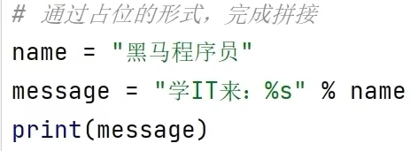


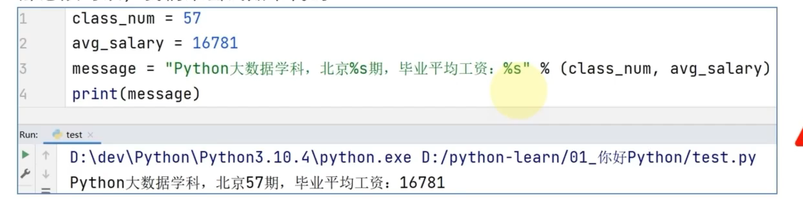

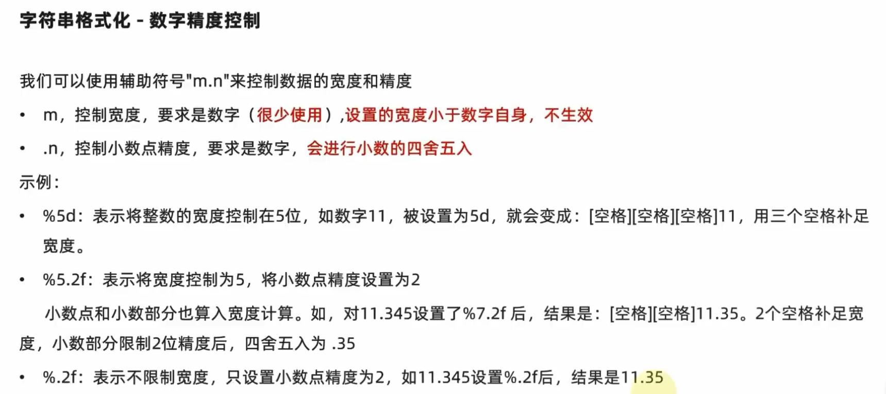


转义符 \

换行符 \n

制表符 \t         --补空格使对齐

如果在字符串中，不想 \ 反斜杠被识别为转义符，可以这样做

```python
path = r"C:\path\to\file"          #在字符串前加r，就不会被识别为转义符了，而被识别为反斜杠
path = "C:\\path\\to\\file"        #用第一个转义符\来 表示一个单独的反斜杠
```


#### 列表

列表是可变的序列,用 [] 表示列表，用逗号分隔列表中的元素

```python
bicycles = ['trek','redline','specialized']
print(bicycles[0])    #使用下标来访问列表中的元素，正向从0开始，逆向从-1开始
bicycles[0] = 'ducati'   #修改列表中某个位置的元素
bicycles.append('suzuki')   #在列表末尾添加元素
bicycles.insert(0,'honda') #将 下标从0开始的元素都往后移动一位，然后将 'honda'放到下标是0的位置
del bicycles[0]   #删除下标是0的元素，下标从1往后的元素往前移动一位
bicycles.pop()   #返回值是  列表的最后一个元素，并删除列表中的最后一个元素
#bicycles.pop(x) 返回值是 列表中下标为x的元素，并在列表中删除该元素。默认是删除并返回最后一个元素
bicycles.remove('ducati')  # 删除指定元素，且只删除列表从正向开始找第一个出现的 该元素
len(bicycles)  #返回列表的长度
bicycles.reverse()  #将列表逆序，修改本身
```

sort()方法语法：

```
list.sort(cmp=None, key=None, reverse=False)
```

参数

- cmp -- 可选参数, 如果指定了该参数会使用该参数的方法进行排序。
- key -- 主要是用来进行比较的元素，只有一个参数，具体的函数的参数就是取自于可迭代对象中，指定可迭代对象中的一个元素来进行排序。
- reverse -- 排序规则，**reverse = True** 降序， **reverse = False** 升序（默认）。

返回值:该方法没有返回值。


**sort 与 sorted 区别：**

sort 是 list类 的属性方法，sorted 是pythpn内置函数，可以对所有可迭代的对象进行排序操作。

list 的 sort 方法修改列表本身；而 sorted 方法返回值是排好序的列表或其他可迭代对象，不改变本身


sorted 语法：

```
sorted(iterable, cmp=None, key=None, reverse=False)
```

参数说明：

- iterable -- 可迭代对象。
- cmp -- 比较的函数，这个具有两个参数，参数的值都是从可迭代对象中取出，此函数必须遵守的规则为，大于则返回1，小于则返回-1，等于则返回0。
- key -- 主要是用来进行比较的元素，只有一个参数，具体的函数的参数就是取自于可迭代对象中，指定可迭代对象中的一个元素来进行排序。
- reverse -- 排序规则，reverse = True 降序 ， reverse = False 升序（默认）。


列表解析

```python
squares = [value**2 for value in range(1,11,2)]
print(squares)
-------
1
9
25
49
81
```


列表的复制

```python
my_foods = ['pizza', 'falafel', 'carrot']
his_foods = my_foods[:]   # 深拷贝 ，his_foods与my_foods对应的内存空间不相同
her_foods = my_foods       # 浅拷贝， her_foods与my_foods对应同一片内存空间
```

列表的合并

```python
a = [1,2,3]
b = [4,5,6]
c = a + b
print(c)
-----
[1,2,3,4,5,6]
```

列表*数字

```python
l = [1]
print(l*3)
-----
[1, 1, 1]
```


```python
my_list = [1, 2, 3]
new_list = my_list * 3
print(new_list)
-------
[1, 2, 3, 1, 2, 3, 1, 2, 3]
```


需要注意的是，当列表中的元素为可变对象时，通过乘以一个数来复制列表并不会创建新的对象，而是对原有对象的引用。因此，在修改其中一个元素时，所有的副本都会发生变化。如果需要创建全新的列表，可以使用列表推导式或者 `copy` 方法来实现。

```python
#如列表以列表为元素
a=[[1]]
b=a*3
#则b为
[[1],[1],[1]]
#不过有趣的是
id(b[0])==id(b[1])==id(b[2])
#也就是说b的三个列表元素项都是引用的一个原先的列表元素项，
#实际上并没有新的列表元素项产生，这与直接定义b=[[1],[1],[1]]
#是截然不同的，直接定义的b其各列表元素项的id值是不同的
```


#### 元组

虽然不能修改元组的元素，但是如果元组的元素是个列表的话，是可以修改列表里的内容的

```python
a = (1,2,[1,2])

a[2][0] = 2

print(a)
```


元组也可以使用 **+** 操作符进行拼接。

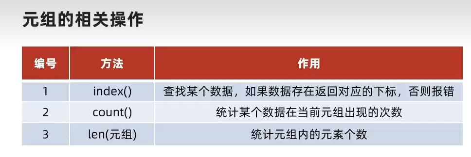


#### 运算符

整数和浮点数支持的运算 ：加、减、$*$乘、$/$除、$**$乘方、$//$整除、$\%$取余

浮点数和整数运算的结果是浮点数

取余常用来判断一个数是奇数还是偶数，x%2 == 0

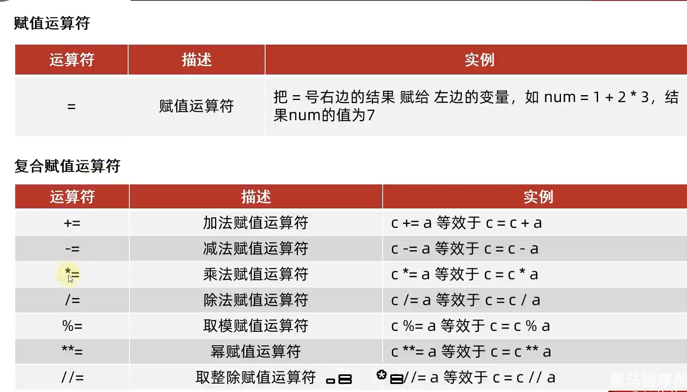


##### 比较运算符

$>,>=,<,<=,==,!=$

is和==的区别：

```python
a == b  # 调用了a.__eq__(b)
x is y # id(x) == id(y)
```

对于内置的类型，如int,str,list等对象的==，已实现 `__eq__`，比较的是字面量。

自定义类型如果不重写 `__eq__()`，`==` 就和 `is` 行为相同

##### 逻辑运算符

and、or、not


检查特定值是否包含在列表中

```python
banned=['andrew','car','david']
name = ['marie']

print(name in banned)
print(name not in banned)
```

##### 解包

```python
def f(a, b, c):
    print(a, b, c)

lst = [1, 2, 3]
f(*lst)  # 实际上是先遍历 lst，然后等价于 f(1, 2, 3)
```


这里的 *lst 是通过 iter(lst) 获取迭代器，然后用 for 循环依次取出值，并作为位置参数传入


pass语句:占坑用的

#### 字典

获取指定键的值

```python
字典名[键]   #得到的就是这个键的值
print(alien['color'])
------
green
```

如果字典中不存在 指定的键 对应的键值对就会报错

```python
alien['nml']
-----
KeyError
```

因此，当我们不确定字典中是否存在该键值对而又想访问这个键对应的键值对的时候，使用get函数

get()方法语法：

```python
dict.get(key[, value]) 
```

参数

- key -- 字典中要查找的键。
- value -- 可选，如果指定键的值不存在时，返回value。value默认为None

添加键值对

```python
alien['x_position'] = 0
alien['y_position'] = 25
print(alien)
---------
{'color':'green','points':5,'x_position':0,'y_position':25}
```


字典会保留定义时的元素排列顺序。如果将字典打印出来或遍历其元素，将发现元素的排列顺序与其添加顺序相同

修改给定键对应的值

```python
alien['color'] = 'yellow'
print(alien)
-------
{'color':'yellow','points':5,'x_position':0,'y_position':25}
```

删除指定键值对

```python
del alien['color']
print(alien)
-------
{'points':5,'x_position':0,'y_position':25}
```

遍历字典

```python
tinydict = {'Google': 'www.google.com', 'Runoob': 'www.runoob.com', 'taobao': 'www.taobao.com'}


# 遍历字典列表
for key, value in tinydict.items():
    print(key, value)
-----

Google www.google.com
Runoob www.runoob.com
taobao www.taobao.com
```

```python
for i in tinydict.items():
    print(i)
------
('Google', 'www.google.com')
('Runoob', 'www.runoob.com')
('taobao', 'www.taobao.com')
```

items() 方法把字典中每对 key 和 value 组成一个元组，并把这些元组放在列表中返回。


```python
tinydict = {'Google': 'www.google.com', 'Runoob': 'www.runoob.com', 'taobao': 'www.taobao.com'}

for key in tinydict.keys():    #遍历键
    print(key)
-----
Google
Runoob
taobao
```

```python
tinydict = {'Google': 'www.google.com', 'Runoob': 'www.runoob.com', 'taobao': 'www.taobao.com'}

for key in tinydict:    #遍历键
    print(key)
-----
Google
Runoob
taobao
```

这两种方式没有区别

**keys方法把字典中的key放入列表中返回，如果把字典名当作可迭代对象的话，就相当于keys方法**

因此，可以使用 `in` 或者 `not in dic.keys()` 来判断某个key是否是字典`dic` 里的关键字

```python
tinydict = {'Google': 'www.google.com', 'Runoob': 'www.runoob.com', 'taobao': 'www.taobao.com'}

for value in tinydict.values():    #遍历值
    print(value)
-------
www.google.com
www.runoob.com
www.taobao.com
```

 

#### 集合

首先了解 hashable ，可哈希

在Python中，可哈希（Hashable）是指一个对象具有哈希值（Hash Value）。哈希值是一个整数，用于唯一标识对象。不可哈希对象则相反，它们的哈希值可能会发生变化或者无法计算哈希值。例如，列表和字典是不可哈希的，因为它们是可变的，并且它们的值可能会改变。

可哈希的对象包括但不限于整数、浮点数、字符串、元组等不可变类型。这些对象的哈希值是根据它们的值计算得出的，因此具有相同值的对象将具有相同的哈希值。

不可变的对象计算出的哈希值是唯一的，可唯一标识该对象。

以后有时间了解一下这个哈希函数是什么


集合要求元素必须是可哈希对象的原因也很明显，因为集合要求所有元素都不能重复，根据的就是元素的哈希值不相同。对于列表和键值对这种可变数据类型，计算出的哈希值是不固定的，所以集合中的元素不能是可变数据类型对象


集合的创建

```python
class set([iterable])
```

set类的参数是一个可选的 iterable（可迭代对象），将可迭代对象的每一个元素放入到集合中，并返回该集合。

```python
a = set() # 空集合的创建
a = {1,2,'3sd',(4,)}
b = set('abcda')     #集合的去重
print(b)
----
{'a','b','c','d'}
```


```python
language = {'a':'python','b':'C','c':'Ruby','d':'python'}

for value in language.values():
    print(value)
---------
python
C
Ruby
python

for value in set(language.values()):  # 利用集合去重 字典的值
    print(value)
---------
C
python
Ruby
```


总结：

iterable 可迭代 

hashable 可哈希  

```python
# set可以进行集合运算
a = set('abracadabra')
b = set('alacazam')

print(a)

print(a - b)     # a 和 b 的差集

print(a | b)     # a 和 b 的并集

print(a & b)     # a 和 b 的交集

print(a ^ b)     # a 和 b 中不同时存在的元素
```

在python3.6之前，Python字典是**无序**的，但在Python3.6及之后的版本中，字典使用了一种称为“保留插入顺序”的技术来存储键值对，确保在字典中添加新键时，它们被添加到最后，并且在迭代字典时按照它们在字典中添加的顺序返回

**有序字典的作用只是记住元素插入顺序并按顺序输出。如果有序字典中的元素一开始就定义好了，后面没有插入元素这一动作，那么遍历有序字典，其输出结果仍然是无序的，因为缺少了有序插入这一条件，所以此时有序字典就失去了作用，所以有序字典一般用于动态添加并需要按添加顺序输出的时候。**


### 函数

函数必须先定义后使用

```python
def functionname( parameters ):
   '''文档注释'''
   # 函数体
   return [expression]     # 函数的返回值为空的话，默认返回None
```


python 中一切都是对象，传递参数的时候只有引用传递


参数列表的三种形式

按位置传入参数；显式地将实参传递给形参；形参的默认值

如果一个形参有默认值，把这个形参放到无默认值的形参的后面去。这让Python 依然能够正确地解读位置实参。

这三个方法会混合着用。不难理解。

```python
def add(a,b):
    return a+b

print(add(1,2)) //按位置顺序传入
print(add(a = 1,b = 2)) // 显式形参
```

```python
def add(a,b = 2):
    return a+b

print(add(1))   // 有默认值的参数放在无默认值的形参的后面
```

#### **默认值参数的需要注意的地方**

参数的默认值可以是变量。

```python
i = 5

def f(arg=i):
    print(arg)

i = 6
f()  // 5
```

**重要警告：** 默认值只计算一次。默认值为列表、字典或类实例等可变对象时，会产生与该规则不同的结果。例如，下面的函数会累积后续调用时传递的参数：

```python
def f(a, L=[]):
    L.append(a)
    return L

print(f(1))
print(f(2))
print(f(3))
```

输出结果如下：

```python
[1]
[1, 2]
[1, 2, 3]
```

不想在后续调用之间共享默认值时，应以如下方式编写函数：

```python
def f(a, L=None):
    if L is None:
        L = []
    L.append(a)
    return L
```

**默认参数是在函数“定义”时就求值，而不是每次“调用”时才求值。**

原因详解：Python 中函数也是“对象”

```
def f(a, L=[]):
    ...
```

当 Python 解释器执行这一行代码时，实际上它：

1. 创建了一个函数对象；
2. 把函数对象绑定到名字 `f`；
3. 同时**计算默认参数 L 的值为[]**，并把这个列表对象**放到函数对象内部的默认参数表里**。

这一步 **只做一次**。

| 阶段           | 说明                                                         |
| -------------- | ------------------------------------------------------------ |
| **定义函数时** | 创建函数对象，**计算默认参数**，存入函数的 `__defaults__` 属性中,这是个元组 |
| **调用函数时** | 创建新的栈帧，按参数匹配填入栈帧，如果某个参数没传，就用 `__defaults__` 中的值 |

举例：

```
def f(x, y=[]):  # 定义时，创建一个 list 对象 []，存入 f.__defaults__
```

每次你调用 `f(1)`，解释器会：

1. 检查有没有给第二个参数 `y` 显式传值；
2. 如果没有，就从 `f.__defaults__` 里拿那个同一个 `[]`；
3. 所以你一直在操作同一个列表对象。

总结

- **默认参数的求值是在函数定义时发生的**，不是每次调用都新建；
- 这是为了性能考虑（节省不必要的重复创建）；
- 但对于**可变对象**（如列表），可能导致副作用。

#### 函数参数中的 / 和 *

```python
def f(pos1, pos2, /, pos_or_kwd, *, kwd1, kwd2):
    #
```

当函数形参出现 / 或 * 时，要求传参的时候， /左边的参数必须按位置传递，*右边的参数必须显式传递给形参(关键字传参)

中间的 可以按照位置也可以显式传递,可以混用。

#### 传入任意数量的实参

有时候不能确定实参的数量，我们需要使用以下方法

```python
def make_pizza(*toppings):
    print(toppings)
```


形参名 *toppings 中的 * 号让python创建一个名为toppings的空元组，并将收到的所有值都封装到这个元组中。


```python
def make_pizza(a,b,c,*toppings):
    #
```

接受任意实参的形参与其他形参的组合使用：

把*toppings这个形参放到最后，前面配对完了之后，剩下的都是toppings这个元组的元素

`*toppings` 形参后的参数只能显式传递

#### 传入任意数量的键值对

```python
def build_profile(**user_info):
    print(user_info)


build_profile(location='p',field='s',first='f') #可以继续添加任意数量的键值对

build_profile(**{'location':'p','field':'s','first':'f'}) #这里的**是解包字典的操作。

--------
{'location': 'p', 'field': 's', 'first': 'f'}
```

形参 **user_info中的星号让python创建一个名为 user_info的空字典，并将收到的所有键值对放到字典中

可以发现，传入参数的时候， `location`, `field`, `first` 到了字典中都是键，且是**字符串类型**的。


如果遇到这种情况会发生什么？

```python
def build_profile(name,**user_info):
    print(user_info)

build_profile(1,name = 'n',location='p')
-------
报错：TypeError: build_profile() got multiple values for argument 'name'
```

原因是，我们想给形参name赋值1，将剩余的放到字典中。但是我们调用函数时使用了 `name='n'`

python将 `name='n'` 当作了给形参赋值。导致形参name有了多个values

解决办法

```python
def build_profile(name,/,**user_info):
    print(user_info)

build_profile(1,name = 'n',location='p')

-----
{'name': 'n', 'location': 'p'}
```

这样 形参name就一定会根据 位置赋值，不会再出现也可以根据关键字赋值的可能了。


#### 解包实参列表

函数调用要求独立的位置参数，但实参在列表或元组里时，要执行相反的操作。例如，内置的 range() 函数要求独立的 start 和 stop 实参。如果这些参数不是独立的，则要在调用函数时，用 * 操作符把实参从列表或元组解包出来：

```python
>>>
list(range(3, 6))            # normal call with separate arguments
[3, 4, 5]
args = [3, 6]
list(range(*args))            # 将列表解包，分别把3,6按位置传递给range函数
[3, 4, 5]
同样，字典可以用 ** 操作符传递关键字参数：

>>>
def parrot(voltage, state='a stiff', action='voom'):
    print("-- This parrot wouldn't", action, end=' ')
    print("if you put", voltage, "volts through it.", end=' ')
    print("E's", state, "!")

d = {"voltage": "four million", "state": "bleedin' demised", "action": "VOOM"}
parrot(**d)
-- This parrot wouldn't VOOM if you put four million volts through it. E's bleedin' demised !
```


#### python的重载

我们知道c++有函数重载的机制，具体来讲就是，只要函数的参数列表不相同，函数名相同。但是python没有这种机制，在Python中，**函数重名，但是后面定义的函数会覆盖之前定义的同名函数。这意味着，当调用函数时，会执行最后定义的同名函数。**这是因为名称绑定对象。

```python
def my_function():
    print("This is the first version of my_function.")

def my_function():
    print("This is the second version of my_function.")

my_function()
---------------
This is the second version of my_function.
```


但是，现实中，c++函数重载这种机制非常有意义。python没有怎么办？

今天，我看pytorch的说明文档时看到了这个东西：

[torch.normal — PyTorch 2.0 documentation](https://pytorch.org/docs/stable/generated/torch.normal.html)

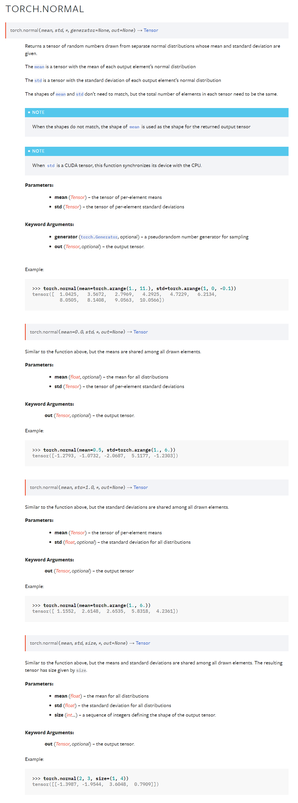

看到了torch.normal有4个同名函数，这是怎么实现的呢？

具体我也不知道，但是看这个视频[[编程基础\][python][面试提问]python的函数重载_哔哩哔哩_bilibili](https://www.bilibili.com/video/BV178411x7tA/?spm_id_from=333.337.search-card.all.click&vd_source=5a374f315281b0338a0b7fd69b8b8e98)

感觉有点理解，说明文档 说明可以这样用，但是具体不一定是这样实现的，就类似，底层实现和抽象使用一样，这个不是很重要，先会用再说以后。


#### 函数多返回值

```python
def fun():
    return 1,2,3

a,b,c = fun()
print(a,b,c)
```


#### 函数作为函数的参数

python 中一切都是对象,函数也是一个对象。

```python
def greet(name):
    return f"Hello, {name}!"

print(type(greet))   # <class 'function'>
```

```python
def greet(name):
    return f"Hi, {name}!"

say_hello = greet
print(say_hello("Alice"))  # Hi, Alice!两个名字指向同一个对象。
```

```python
def call_func(f, name):  #可以作为参数传递
    return f(name)

print(call_func(greet, "Bob"))  # Hi, Bob! 
```

```python
def make_greeter(prefix):  
    def greeter(name):
        return f"{prefix}, {name}!"
    return greeter  #可以作为返回值返回

hello = make_greeter("Hello")
print(hello("World"))  # Hello, World!
```

```python
funcs = [str.upper, str.lower]# 可以存入数据结构中
print(funcs[0]("hello"))  # HELLO
print(funcs[1]("HELLO"))  # hellos
```

#### 函数嵌套

```python
def outer():
    def inner():
        print('inner',end=" ")
    print('outer',end = " ")
    return inner  # 注意这里返回的是一个函数对象

outer()
```

> 当执行outer()时,程序的执行过程如下:
> 1. 调用outer()函数
> 2. 在outer函数中,首先定义了inner()函数
> 3. 接着执行print('outer')语句,打印"outer"
> 4. 最后return inner语句将inner函数对象返回,但并未执行inner函数

```python
def outer():
    def inner():
        print('inner',end=" ")
    print('outer',end = " ")
    return inner()  # 注意这里函数执行了之后再返回的

outer()
```


#### 装饰器

[【Python 高级特性】装饰器：不修改代码，就能改变函数功能的强大特性_哔哩哔哩_bilibili](https://www.bilibili.com/video/BV1Uz421Z79L/?spm_id_from=333.337.search-card.all.click&vd_source=5a374f315281b0338a0b7fd69b8b8e98)

#### 闭包

[高级Python编程知识-12.闭包_哔哩哔哩_bilibili](https://www.bilibili.com/video/BV13G411F77h/?spm_id_from=333.337.search-card.all.click&vd_source=5a374f315281b0338a0b7fd69b8b8e98)

#### yield

迭代器（Iterator）是一种用于遍历容器（如列表、元组、集合等）或自定义对象中元素的对象。它提供了一种顺序访问元素的方式，而不需要事先知道容器的具体结构。

迭代器的主要特点是：

1. 迭代器可以按照一定顺序逐个访问容器中的元素，而无需直接访问容器本身的内部结构。
2. 迭代器提供了两个核心方法：`__iter__()`和`__next__()`。`__iter__()`方法返回迭代器对象本身，`__next__()`方法返回容器中的下一个元素。
3. 在遍历过程中，迭代器会维护一个内部状态，以记录当前遍历到的位置，每次调用`__next__()`方法都会返回下一个元素。
4. 当容器中没有更多元素可供遍历时，迭代器会引发`StopIteration`异常，表示遍历结束。

使用迭代器可以遍历大型或无限序列的元素，逐个处理它们而无需将整个序列加载到内存中。这在处理大数据集或实时数据流时非常有用。

在Python中，许多内置的数据类型（如列表、字符串、字典等）都支持迭代器接口，可以直接使用`iter()`函数来获取它们的迭代器对象。此外，我们还可以通过定义自定义类，并实现`__iter__()`和`__next__()`方法来创建自己的迭代器。


在 Python 中，`yield` 是一个关键字，用于定义生成器函数，在函数中只要出现了yield关键字，该函数就是一个生成器函数，生成器函数返回值是一个迭代器对象。生成器函数是一种特殊的函数，可以通过迭代逐个产生值，而不是一次性返回所有结果。

`yield` 关键字用于在生成器函数中暂停函数的执行，并将结果返回给调用者。当生成器函数被调用时，它会返回一个迭代器对象。通过不断调用迭代器对象的 `__next__()` 方法，我们可以逐步执行生成器函数的代码，每次执行到 `yield` 语句时，会将产生的值返回给调用者，并暂停函数的执行。

下面是一个简单的例子，演示如何使用 `yield` 创建一个生成器函数：

```python
pythonCopy code
def generate_numbers():
    n = 0
    while True:
        yield n
        n += 1

# 调用生成器函数，获取迭代器对象
numbers = generate_numbers()

# 逐个获取生成器函数产生的值
print(next(numbers))  # 输出: 0
print(next(numbers))  # 输出: 1
print(next(numbers))  # 输出: 2
# ...
```

在上面的例子中，`generate_numbers()` 是一个生成器函数，通过 `yield` 语句产生一个递增的整数序列。通过调用 `generate_numbers()` 函数并获取返回的迭代器对象 `numbers`，我们可以使用 `next()` 函数逐个获取生成器函数产生的值。

需要注意的是，生成器函数会保存函数的上下文，并在每次调用 `next()` 方法时从上次暂停的位置继续执行。这使得生成器函数可以在迭代过程中保持状态，并可以有效地处理大量的数据或无限序列。

#### lambda表达式

[`lambda`](https://docs.python.org/zh-cn/3/reference/expressions.html#lambda) 关键字用于创建小巧的匿名函数。
Lambda函数是一种匿名函数，也称为函数字面值。

Lambda函数的基本语法如下：

```python
lambda arguments: expression
```

其中，`arguments`是函数的参数，可以是一个或多个，用逗号分隔。`expression`是函数的返回值，也可以是一个表达式。

Lambda函数通常用于简单的函数逻辑，它们可以作为参数传递给其他函数或用于函数式编程中的映射、过滤和排序等操作。由于Lambda函数是匿名的，它没有函数名，因此通常使用时直接调用或赋值给变量以供后续使用。

以下是一些Lambda函数的示例：

```python
# Lambda函数计算两个数的和
add = lambda x, y: x + y
print(add(2, 3))  # 输出: 5

# Lambda函数用于排序
numbers = [4, 2, 7, 1, 5]
sorted_numbers = sorted(numbers, key=lambda x: x % 2)
print(sorted_numbers)  # 输出: [2, 4, 7, 1, 5]

# Lambda函数作为参数传递给其他函数
result = map(lambda x: x * 2, [1, 2, 3, 4])
print(list(result))  # 输出: [2, 4, 6, 8]
```

Lambda函数在需要简单的函数逻辑，并且函数的使用范围有限时非常方便，但对于复杂的函数逻辑，通常还是推荐使用普通的命名函数。

模块/包 

py文件就是模块，`import pizza` 会让Python 将模块pizza.py中所有的代码都复制到这个程序中。

```python
# 导入模块中指定的对象
from moudle_name import function_name # 只导入某个模块的某个对象
from moudle_name import function_name1,function_name2,function_name3 # 导入某个模块任意数量的对象

# 给导入的模块或对象起别名
from moudle_name import function_name as fn # 给模块的function_name函数取个别名
import moudle_name as mn  # 给导入的模块取个别名

from pizza import *     # 将模块中定义的所有的对象导入，调用模块中定义的对象时直接 对象名  可能发生变量覆盖
import pizza            # 导入该模块，调用模块中定义的对象时必须 模块名.对象名 （推荐）
```


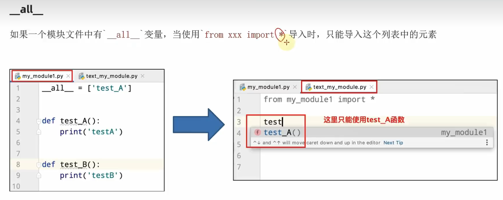


[第一阶段-第九章-06-自定义Python包_哔哩哔哩_bilibili](https://www.bilibili.com/video/BV1qW4y1a7fU?p=96&vd_source=5a374f315281b0338a0b7fd69b8b8e98)

### 类

pep8类的命名规则？


dir() 函数

`dir()` 是 Python 的一个内置函数，用来**查看一个对象的所有属性和方法**。以一个字符串列表的形式返回

如果不传入参数，返回当前命名空间中所有标识符。

类变量

```python
class Person:
    name = "sxc"   #python中直接在类中定义类变量，所有对象共享一份内存，只能通过类名.变量名访问。
   

print(Person.name) # sxc
p = Person()
print(p.name) # sxc
# 在类中定义变量不是类变量吗？为什么我还能访问实例变量呢？
```

> `name = 'sxc'` 是类变量，但你可以通过实例 `p.name` 来访问它。

这是因为，Python 的变量查找机制：

当你访问 `p.name` 时，Python 的解释器会按以下顺序查找变量：

1. **先在实例的 \__dict__ 中找（是一个字典，存放实例属性与值的集合）**
2. **如果没有，再去类Person(class的一个实例)的 \__dict__ 中找**
3. **如果类中也没有，再去父类中找**

所以你这段代码：

```python
class Person:
    name = 'sxc'  # 类变量

print(Person.name)  # 访问类变量 → 输出 'sxc'

p = Person()
print(p.name)       # 实例没有 name 属性 → 向上查找类的 name → 输出 'sxc'
```

虽然你通过 `p.name` 访问，但其实底层找到的是 `Person.name`。

如果你给实例赋值了：

```python
p.name = 'xyz'
print(p.name)       # 此时是实例自己的属性了
print(Person.name)  # 类的变量还是 'sxc'
```

这时候 `p.name` 和 `Person.name` 已经 **不再是同一个变量**。


用上述的方法构造变量，既是类的变量，又可以是对象的变量，大部分时候，我们不需要类的变量，而是只需要对象的成员变量。那么如何只定义对象的成员变量呢？

方式是**在类的成员函数中定义对象的成员变量**，一般是在构造函数中定义类的成员变量

```python
class Car: 
    def __init__(self, make, model, year): 
        """初始化描述汽⻋的属性""" 
        self.make = make 
        self.model = model 
        self.year = year 
        self.odometer_reading = 0 
```

类的构造函数一般形式：

如果没有自定义类的构造函数的话，python就会使用默认的构造函数，默认的构造函数不进行任何操作，仅仅在创建类的对象时，给对象分配空间。不过，我们默认还是自己定义构造函数吧。我们在自定义的构造函数中，实现初始化工作。

```python
class Person:
    def __init__(self):
        # python类的构造函数，self应该是跟c++的this指针是一样的，只不过这个是显式的。表示对象的引用
        # 类的每一个成员函数都有self这个参数，self参数约定俗成放在第一个位置，但语法没有这个硬性要求
```

\_\_init\_\_()是⼀个特殊⽅法，每当你根据Dog 类创建新实例时，Python 都会⾃动运⾏它。在这个⽅法的名称中，开头和末尾各有两个下划线，这是⼀种约定，旨在避免Python 默认⽅法与普通⽅法发⽣名称冲突。务必确保\_\_init\_\_() 的两边都有两个下划线，否则当你使⽤类来创建实例时，将不会⾃动调⽤这个⽅法，进⽽引发难以发现的错误.

当Python 调⽤这个⽅法来创建Dog 实例时，将⾃动传⼊实参self。每个与实例相关联的⽅法调⽤都会⾃动传递实参self，该实参是⼀个指向实例本⾝的引⽤，让实例能够访问类中的属性和⽅法。

```python
class Person:
    def __init__(self,name): #给构造函数传入一个参数name，注意name只是个参数，作用域只有这个函数块
        self.name = name  # 定义了对象的成员变量name
        #等号左边是对象的成员变量name，等号右边是参数name
        self.age = 18       # 定义了 对象变量age

p = Person('sxc')  # 在创建对象的时候会自动调用构造函数，所以这里要传参数，跟c++是一样的
print(p.name)   # 输出 sxc
print(Person.name)  # error:type object 'Person' has no attribute 'name'
```

方法查找机制：

当你调用：`p.some_method()`

Python 会：

1. **先在实例的 \__dict__ 中找 some_method 属性**。
2. **找不到，就查找 p.\__class__（即p对应的类Person）中的\_\_dict\_\_中有没有 some_method**。
3. **如果类中也没有，就根据类的继承关系（MRO）向父类中查找**。
4. 找到后，如果它是一个函数，就自动绑定为 **实例方法**（变成 `bound method`，自动传入 `self`）。

> 对于第一步的疑问：p实例为什么要找greet属性？p.greet()中是有小括号的啊，不会自动识别为方法吗？
>
> 括号 `()` 是 **调用操作符**，不是“方法识别器”
>
> Python 实际会**先执行 p.greet，再对结果调用 ()**

> 类对象的 `__dict__` 是一个特殊的属性，它是一个字典，**包含该类在定义时直接赋值的属性**，包括：
>
> - 类变量
> - 方法（函数对象）
> - 静态方法 / 类方法（被装饰器转换后的对象）
> - 其他直接在类体中定义的属性
>
> 
>
> 注意几点：
>
> - `__dict__` 里**不包含从父类继承而来的属性**。
> - `__dict__` 是一个 `mappingproxy` 类型（即“只读字典”），防止直接修改类属性映射。
> - 实例对象的 `__dict__` 和类对象的 `__dict__` 是完全独立的。

method和function的区别：

```python
class A:
    def f(self):
        print("called")

a = A()

# 等价过程

method = a.f      # 第一步：查找属性（返回的是“绑定方法”）
method()          # 第二步：调用这个方法

print(type(a.f))  # <class 'method'>
print(type(A.f))  # <class 'function'>
```


```python
class A:
    def f(self):
        print("called")
    def g(self):
        print(type(f(1)))

a = A()
a.g()      # 这里我想在一个成员方法里调用另一个成员方法，必须要传入对象，用对象调用，不能直接调用，直接调用的话，就是查找模块的命名空间，因为在函数外。
```


```python
class A:
    def f():           # 在类内定义的普通函数，之前说在类内绑定的所有标识符都会存放到class对象A的__dict__中 
        print("called")
    def g(self):
        print(type(f(1)))   # 直接调用还是查的模块的命名空间

a = A()
a.g()
```

类方法和静态方法

```python
class D:
    @staticmethod
    def sm():
        pass

    @classmethod
    def cm(cls):
        pass
```

| 函数定义方式     | 是否自动绑定实例 | 调用方式         |
| ---------------- | ---------------- | ---------------- |
| `def foo(self):` | ✅ 是实例方法     | `obj.foo()`      |
| `def foo():`     | ❌ 普通函数       | `Class.foo()`    |
| `@staticmethod`  | ❌ 静态方法       | 类或对象均可调用 |
| `@classmethod`   | ✅ 绑定类对象     | `Class.foo()`    |

PEP 8 并没有硬性规定不允许类中出现“普通函数”，但**风格上明确推荐使用实例方法，类方法，静态方法**，以符合 Python 的语义和设计哲学。如果你定义了“类中普通函数”，说明代码设计上可能不清晰、不符合 Pythonic 风格。

类的实例方法，传入了实例对象，可以对实例属性进行操作。

类的类方法，传入了class类的该对象，可以对类属性进行操作。

类的静态方法常用于在类的范围内执行通用操作，与类的实例无关。它们可以被视为类的工具函数。

> 既然类方法，实例方法，静态方法都放在class对象中的 __dict__中，那如果重名了会怎么样？

在 Python 中，**类方法（@classmethod）**、**实例方法（普通的带 self 参数的方法）**、以及 **静态方法（@staticmethod）** 存储在类对象的 `__dict__` 中（准确地说是 `__dict__` 返回的 `mappingproxy` 中）。
**后定义的会覆盖前面的** —— 无论你用的是哪种方法类型，Python 解释器在类的命名空间中会用“最后一次赋值”覆盖同名属性。

```python
class Demo:
    def func():
        print("普通函数")

    @classmethod
    def func(cls):
        print("类方法")

    @staticmethod
    def func():
        print("静态方法")
```

👆上面这个类中，`func` 定义了三次，最终生效的是**最后一次定义**（静态方法），之前的定义**都会被覆盖**。

类的继承

> 怎么看待类：
>
> 从设计角度看，继承就是字面意思，就是子类继承父类的属性和方法。
>
> 从程序员的角度看，我们不仅要理解上述抽象含义，还应该理解，继承的具体实现，实际上就是多层命名空间的顺序查找。

使用继承来提高代码的复用性。

```python
class A(B, C, D):  # 类同时继承B, C, D   (多继承)
    pass
```

多继承👆

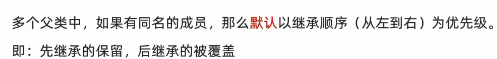

```python
class Animal:                   # 定义Animal类
    def __init__(self,name,age):
        self.name = name
        self.age = age
    def call(self):
        print(f'{self.name}会叫')
```

```python
class Cat(Animal):  # Cat类继承Animal类
    pass

c = Cat('sxc',18)   # 子类没有自定义构造函数，会自动继承父类的构造函数

print(c.name,c.age)
c.call()         # 子类会继承父类的成员函数
```

1. 当子类没有定义自己的构造函数时，会自动继承父类的构造函数。在这种情况下，子类的实例化过程中会先执行父类的构造函数，然后再执行子类特有的初始化代码。
2. 当子类定义了自己的构造函数时，需要在子类的构造函数中显式调用父类的构造函数。在子类的构造函数中，可以使用 `super()` 函数来调用父类的构造函数，并传递必要的参数。

```python
class Dog(Animal):
    def __init__(self,name,age,eyes):
        self.eyes = 2
        super().__init__(name,age)      #super()返回的是当前类的父类的实例对象，然后调用父类的构造函数
   #在类里面调用了父类的构造函数，相当于把构造函数的函数体复制到了当前位置，子类同样会有name变量和age变量
```

复写，也是按照调用顺序。。。。

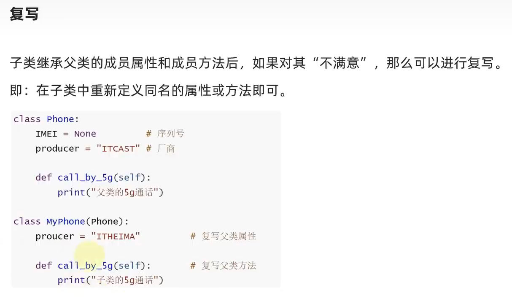


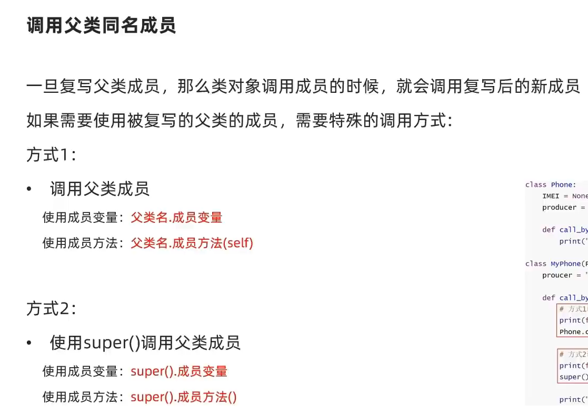


私有变量

私有成员：仅供在类内使用的属性和方法

私有变量会经过名称重整（Name Mangling）处理，导致其名称变为 `_ClassName__variable`，这样防止重名

python定义私有成员的形式

```python
class Person:
    def __init__(self,name):
        self.__name = name   #变量名前缀是两个下划线说明 变量 __name 是 私有变量
    def __print(self):       #函数名前缀是两个下划线说明 函数 __print 是 私有函数
        print(self.__name)
    def printf(self):
        self.__print()

p = Person('sxc')
p.printf()           # 输出 sxc
```


**魔术方法**

[高级Python编程知识-04.type类_哔哩哔哩_bilibili](https://www.bilibili.com/video/BV1DP411g75N?spm_id_from=333.788.videopod.sections&vd_source=5a374f315281b0338a0b7fd69b8b8e98)

[【python】魔术方法大全（一）——基础篇_哔哩哔哩_bilibili](https://www.bilibili.com/video/BV1b84y1e7hG/?spm_id_from=333.337.search-card.all.click&vd_source=5a374f315281b0338a0b7fd69b8b8e98)

[python特殊函数\_\_call\_\_(self) - 知乎 (zhihu.com)](https://zhuanlan.zhihu.com/p/165245990)

这个\_\_call\_\_方法也是一个魔术方法，另外这个在深度学习出现了。

类中的成员函数称为方法。


类型注解&typing模块

[第二阶段-第一章-10-变量的类型注解_哔哩哔哩_bilibili](https://www.bilibili.com/video/BV1qW4y1a7fU?spm_id_from=333.788.videopod.episodes&vd_source=5a374f315281b0338a0b7fd69b8b8e98&p=120)

多态

[第二阶段-第一章-13-多态_哔哩哔哩_bilibili](https://www.bilibili.com/video/BV1qW4y1a7fU?spm_id_from=333.788.videopod.episodes&vd_source=5a374f315281b0338a0b7fd69b8b8e98&p=123)

### 异常

异常也属于python编程的一部分。

[第一阶段-第八章-02-文件的读取操作_哔哩哔哩_bilibili](https://www.bilibili.com/video/BV1qW4y1a7fU?p=86&vd_source=5a374f315281b0338a0b7fd69b8b8e98)


### 读写文件

经常需要读取文件的数据，接下来看看怎么使用python来读取文件的数据。

什么是对象？对象就是一个有属性和方法的实体。

```python
file_object = open('filename', 'mode')
```

file_name:文件名，如果文件不在当前目录中需要指定路径


mode参数可以不写，默认mode参数是“r”。mode参数如下：

• ‘r’ – 只读模式，当文件处在“只读”的模式时使用。

• ‘w’ –写入模式，将新信息编辑写入文件中的时候使用（在使用该模式的时候、任何现存的同名文件的内容将会被擦除、从而写入新的内容）

慎用该模式：哪怕仅仅是运行了file=open(“filename”, “w”)这句话，那么该文件中所有内容全部被擦除。

• ‘a’ – append模式，将新数据加到文件末尾，不会擦除现存的同名文件的内容。

• ‘r+’ – 特殊的“读取”+“写入”模式，当同时存在读写操作的时候使用。


返回值是文件对象

文件对象的方法：

| 文件对象方法    | 执行的操作                                                   |
| --------------- | ------------------------------------------------------------ |
| f.close()       | 关闭文件，文件使用完毕一定要关掉，否则文件数据易被修改       |
| f.readlines()   | 读取所有行，返回一个 seq 可迭代对象                          |
| f.write(string) | 把 *string* 的内容写入文件，并返回写入的字符数。需要在w模式下 |
| f.read()        | 读取并返回整个文件的内容，返回值是空字符串                   |

f.write的应用：

```python
filename = 'programming.txt'
with open(filename,'w') as f:
    f.write("I love programming.")
    f.write("I love creating new games")
------filename的文件内容
I love programming.I love creating new games
```

write不会像print那样自动换行，因此如果要输入多行的话，需要在字符串后面加上 \n

```python
filename = 'programming.txt'
with open(filename,'w') as f:
    f.write("I love programming.\n")
    f.write("I love creating new games.")
------filename的文件内容
I love programming.
I love creating new games.
```


常用的打开文件的方式：

[高级Python编程知识-03.上下文管理器_哔哩哔哩_bilibili](https://www.bilibili.com/video/BV1a841187Zc?spm_id_from=333.788.videopod.sections&vd_source=5a374f315281b0338a0b7fd69b8b8e98)

```python
with open() as file_object:
    #对文件的操作

#file_object的作用域是在with代码块内。
#使用这种方式较open与close的好处是， 系统会在合适的位置关闭文件。
```

with

实例

```python
file = open('./test_runoob.txt', 'w')
file.write('hello world !')
file.close()
```

以上代码如果在调用 write 的过程中，出现了异常，则 close 方法将无法被执行，因此资源就会一直被该程序占用而无法被释放。


接下来我们呢可以使用 try…except…finally 来改进代码：

```python
file = open('./test_runoob.txt', 'w')
try:
  file.write('hello world')
finally:
  file.close()
```

以上代码我们对可能发生异常的代码处进行 try 捕获，发生异常时执行 except 代码块，finally 代码块是无论什么情况都会执行，所以文件会被关闭，不会因为执行异常而占用资源。


使用 **with** 关键字：

```python
with open('./test_runoob.txt', 'w') as file:
    file.write('hello world !')
```

使用 **with** 关键字系统会自动调用 f.close() 方法

with 语句实现原理建立在上下文管理器之上。资源对象是一个支持上下文管理协议的对象，例如文件对象、数据库连接等。资源对象是一个实现 **__enter__** 和 **__exit__** 方法的类。

使用 with 语句确保在嵌套块的末尾调用 __exit__ 方法。

`with` 语句的工作原理是通过调用资源对象的 `__enter__()` 和 `__exit__()` 方法来实现的。在进入 `with` 代码块之前，会调用资源对象的 `__enter__()` 方法来获取资源。而在退出 `with` 代码块时，无论是否发生异常，都会调用资源对象的 `__exit__()` 方法来释放资源。


### 测试代码

编写函数或类时，还可以为其编写测试。通过测试，可确定代码面对各种输入都能按照要求的那样工作。通过测试，可以让你深信，即便有更多人使用你的程序，它也能正确地工作。在程序中添加新代码时，也可以对其进行测试。程序员都会犯错，因此每个程序员都必须经常测试其代码，**在用户发现问题前找出它们**

[三种最流行的Python测试框架，我该用哪一个？ - 知乎 (zhihu.com)](https://zhuanlan.zhihu.com/p/68088736)

### 正则表达式

挖坑

### 内置函数

#### filter()

**filter()** 函数用于过滤序列，过滤掉不符合条件的元素，返回一个迭代器对象，如果要转换为列表，可以使用 **list()** 来转换。

该接收两个参数，第一个为函数，第二个为序列，序列的每个元素作为参数传递给函数进行判断，然后返回 True 或 False，最后将返回 True 的元素放到新列表中。

语法

以下是 filter() 方法的语法:

```
filter(function, iterable)
```

参数

- function -- 判断函数。
- iterable -- 可迭代对象。

返回值

返回一个迭代器对象

> 练习题
>
> ```python
> func = lambda x:x%2    # 将lambda函数对象与标识符func绑定
> result = filter(func, [1, 2, 3, 4, 5])
> print(list(result))
> ```

```
dict.fromkeys(seq[, value])
```

[Python 字典 fromkeys() 方法 | 菜鸟教程](https://www.runoob.com/python/att-dictionary-fromkeys.html)

```
str.join(sequence)
```

