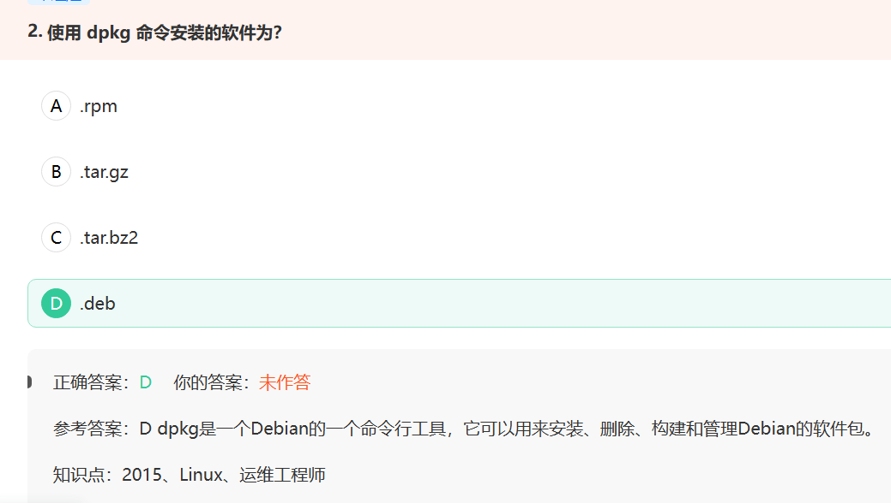
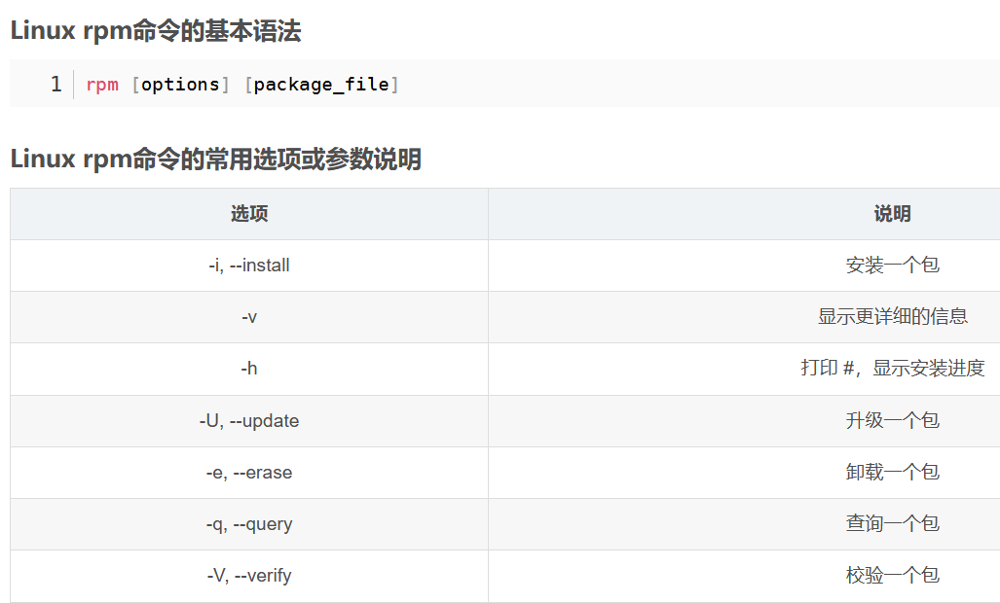
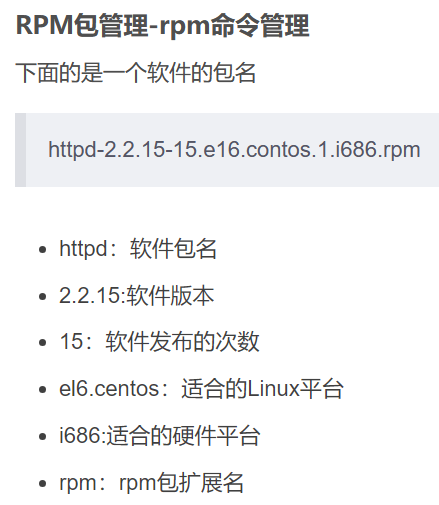

linux

# 课程目录


# 入门

## linux系统


## linux发行版

由于linux内核是免费开源的，任何人都可以在linux内核代码的基础上实现自己的系统级应用程序组成一个自己的linux系统。这被称为linux发行版。


## 安装linux系统

一个是使用虚拟机软件Vmware，一个是网上买台服务器。还可以给你自己电脑安装一个linux系统。最后一个是WSL。


VMware这种方法不太建议，因为是使用软件虚拟一整个硬件系统，在虚拟出来的硬件系统上运行linux系统，吃资源。

在电脑上装双系统，这个麻烦，也不建议。

WSL可以学学。


可以看到WSL这种比装双系统要简单。

## 使用操作系统


finalshell远程连接工具

我买的服务器，这个简单、易用。[第一章-07-远程连接Linux系统_哔哩哔哩_bilibili](https://www.bilibili.com/video/BV1n84y1i7td?p=8&vd_source=5a374f315281b0338a0b7fd69b8b8e98)

## linux目录结构


linux基础命令


# linux基础命令

ls 列出当前路径下的所有内容


cd


pwd


cat命令：将文件内容一次全输出显示在屏幕上。 

more命令：分屏显示文件内容，每次只显示一屏，只允许向前浏览。 

less命令：与more相似，并且支持向前，向后浏览。

> less 少呀，显示的少，所以不停往下翻页；more 多呀，显示的多，全显示了，所以不停往上翻页 


vi/vim

会用[第二章-13-vi编辑器_哔哩哔哩_bilibili](https://www.bilibili.com/video/BV1n84y1i7td?p=23&vd_source=5a374f315281b0338a0b7fd69b8b8e98)

题目：

在vi编辑器中，强制退出不保存的命令是？:q!


# linux权限控制


# linux实用操作

## 常用快捷键


## 软件安装





前面介绍了linux两种流行的发行版软件商店安装软件的方法，现在介绍我们从网上下载包，自己安装的过程。



Linux rpm命令实例详解
实例1：安装一个包

```
rpm -ivh package_name.rpm
```

这个命令会安装一个rpm包。

实例2：升级一个包

```
rpm -Uvh package_name.rpm
```

这个命令会升级一个已经安装的rpm包。

实例3：卸载一个包

```
rpm -e package_name
```

这个命令会卸载一个已经安装的rpm包。

实例4：查询一个包

```
rpm -q package_name
```

这个命令会查询一个已经安装的rpm包。

实例5：查询所有已安装的包

```
rpm -qa
```

这个命令会列出所有已经安装的rpm包。

实例6：查询一个包的信息

```
rpm -qi package_name
```

这个命令会显示一个已经安装的rpm包的详细信息。

实例7：查询一个包是否已经安装

```
rpm -q package_name
```

这个命令会检查一个rpm包是否已经安装。如果已经安装，它会显示包的版本号。如果没有安装，它会显示“package package_name is not installed”。

实例8：查询一个rpm文件的信息

```
rpm -qip package_file.rpm
```

这个命令会显示一个rpm文件的详细信息，包括名称、版本、发布者、大小、许可证、描述等。

实例9：验证一个包

```
rpm -V package_name
```

这个命令会验证一个已经安装的rpm包。如果包的文件被修改或丢失，它会显示相应的信息。

实例10：查询一个包的配置文件

```
rpm -qc package_name
```

这个命令会列出一个已经安装的rpm包的所有配置文件。

实例11：查询一个包的依赖关系

```
rpm -qR package_name
```

这个命令会列出一个已经安装的rpm包的所有依赖包。

实例12：查询一个rpm文件的依赖关系

```
rpm -qpR package_file.rpm
```

这个命令会列出一个rpm文件的所有依赖包。

实例13：查询一个包的提供的功能

```
rpm -q --provides package_name
```

这个命令会列出一个已经安装的rpm包提供的所有功能。

实例14：查询一个rpm文件的提供的功能

```
rpm -qp --provides package_file.rpm
```

这个命令会列出一个rpm文件提供的所有功能。

实例15：查询一个包的文件列表

```
rpm -ql package_name
```

这个命令会列出一个已经安装的rpm包的所有文件。

Linux rpm命令的注意事项
在使用rpm命令时，需要注意包之间的依赖关系。如果在卸载一个包时，其他的包依赖于它，那么需要先卸载依赖的包。



获取rpm安装包的方法：

一个是通过xftp这类文件传输软件，

一个是下面会学习的命令wget

## systemctl命令


有的软件安装后会自动集成到systemctl中，有的则不会，因此需要手动添加。

## 软链接


举例：

```bash
ln -s /etc/yum.conf ~/yum.conf  
```

在`~/yum.conf`路径下创建这个文件`/etc/yum.conf`的一个快捷方式

```bash
ln -s /etc/yum ~/yum
```

在`~/yum`路径下创建这个文件夹`/etc/yum`的一个快捷方式


## date与修改时区


## IP地址与主机名


这俩个都可以指代本机


在windows系统中配置私人地址本，管理员权限编辑hosts文件，


设置好以后，在finalshell里面把192.168.88.130这个本机地址换成centos就行。


## 配置固定IP


## ping、wget、curl


cip.cc是一个网站，可以返回公网IP信息。

第二个例子是访问这个网站，即发起网络请求，返回的是这个网站的html源码。

第三个例子是可以下载安装包。

## 端口


## 进程管理


## 系统资源监控


## 环境变量


## linux文件的上传和下载


## 压缩和解压


再看一遍韩顺平的linux吧，总结一下，然后去


