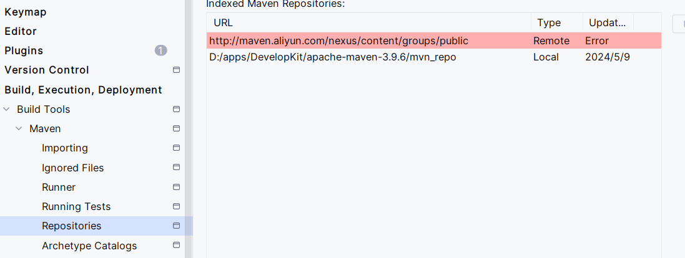

maven

作用：依赖管理、统一Java项目结构

依赖管理：不用程序员去对应官网下载依赖包了，只需简单配置即可。

安装maven需要进行的配置：

1. 配置`JAVA_HOME`
2. maven安装目录下的bin配成环境变量
3. 在maven安装目录下新建文件夹 `mvn_repo`将来用作本地仓库

> 不要问为什么这么配，要么你学的多了就知道了，要么永远都不知道，永远不知道的也没必要知道。都是前辈的经验，照抄即可。

仓库、坐标

[Maven Repository: Search/Browse/Explore (mvnrepository.com)](https://mvnrepository.com/)

今天在配置maven的依赖时发现没有自动联想和代码补全功能，然后我去看了下面这个东东

以为是远程仓库连接失败了(其实是index索引失效了)，然后我以为是网络问题，就是我之前刚下载的clash，然后重置电脑的网络，重启后没啥卵用...然后我就网上各种搜解决方案，换仓库，还是没啥卵用。然后我就找了室友的电脑，结果室友喊我去吃饭，然后就搁置了，回来用他的电脑一试，发现没有爆红。然后我就觉得还是我网络的问题，然后我上我电脑一试，唉可以！然后我就打开b站刷了一会(偷会闲😀)，然后再试的时候就又不行了。然后我就认定是阿里云maven镜像库的服务器的问题。然后我就刷起来其他的课了，等着看看阿里云服务器能不能恢复。快11点的时候，我又搜解决方案，结果，发现了问题所在：阿里云是不支持索引的，就是上面图爆红就是阿里云不支持索引的证据。不支持索引也就意味着是没有自动联想和代码补全的功能。在这种情况下，出现的自动联想和代码补全实际上是本地库的索引。如果想用代码补全功能的话就需要去maven原本的仓库。呜呜，找到解决方法的这一刻有两种感觉，第一种，真想一口老血喷出来，气炸了！第二种，唉，真是气到极致气笑了。

最后验证上述理论的正确性，就是去mvnrepository.com找到依赖的坐标，然后在配置阿里云maven库的情况下更新pom文件，看是否会下载对应的依赖，结果成功下载依赖。也就意味着阿里云的服务器是没问题的。我的网络也是没问题的。就是阿里云不支持索引。

现在总结一下，下载依赖的两种方法：

第一，用国外的服务器，支持索引，提供代码补全功能。缺点是访问速度慢。就算有梯子也访问慢，别问，问就是梯子质量差，经费不足。显然这种方法淘汰！

第二，还是用阿里云的maven库，虽然不支持索引，但是下载依赖会很快。至于索引的问题，我们可以借助mvnrepository.com网站获得坐标来替代代码补全坐标的功能。 hh怪不得视频里强调一定要记住这个网站...

 date：2024.5.9

