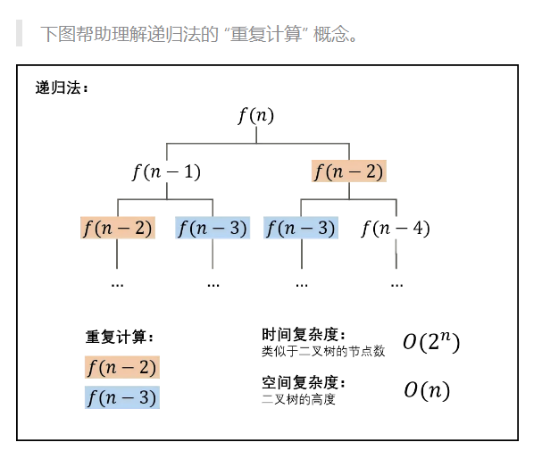

fibonacci

[剑指 Offer 10- I. 斐波那契数列 - 力扣（Leetcode）](https://leetcode.cn/problems/fei-bo-na-qi-shu-lie-lcof/description/?favorite=xb9nqhhg)


```cpp
class Solution {
public:
    int fib(int n) {

    }
};
```


第一眼是直接用递归来做

```cpp
class Solution {
public:
    int fib(int n) {
        if(n == 0) return 0;
        if(n == 1) return 1;
        return fib[n-1]+fib[n-2];
    }
};
```

然后就超时了。。。。究其原因是因为进行了多次重复计算



改进方法：使用一个一维数组来存储已经计算过的数字。这就是我们学习动态规划的实现方式。

```cpp
class Solution {
public:
    int fib(int n) {
        int *a = new int[n+10];
        a[0]=0;
        a[1]=1;
        for(int i = 2;i<=n;i++)
        {
            a[i] = (a[i-1]+a[i-2])%1000000007;
        }
        return a[n];
    }
};
```


空间优化：一维滚动数组。

因为 `fib[i]`只与 `fib[i-1]` 和 `fib[i-2]`有关，因此，滚动数组可以是一个只有三个元素的一维数组


```cpp
class Solution {
public:
    int fib(int n) {
        if(n == 0) return 0;
        if(n == 1) return 1;
        int a[3];
        a[0] = 0;
        a[1] = 1;
        for(int i = 1;i<n;i++) //斐波那契数列的第2项算到第n项共n-1项
        {
            a[2] = (a[0]+a[1])%1000000007;
            a[0] = a[1];
            a[1] = a[2];
        }
        return a[2];
    }
};
```

