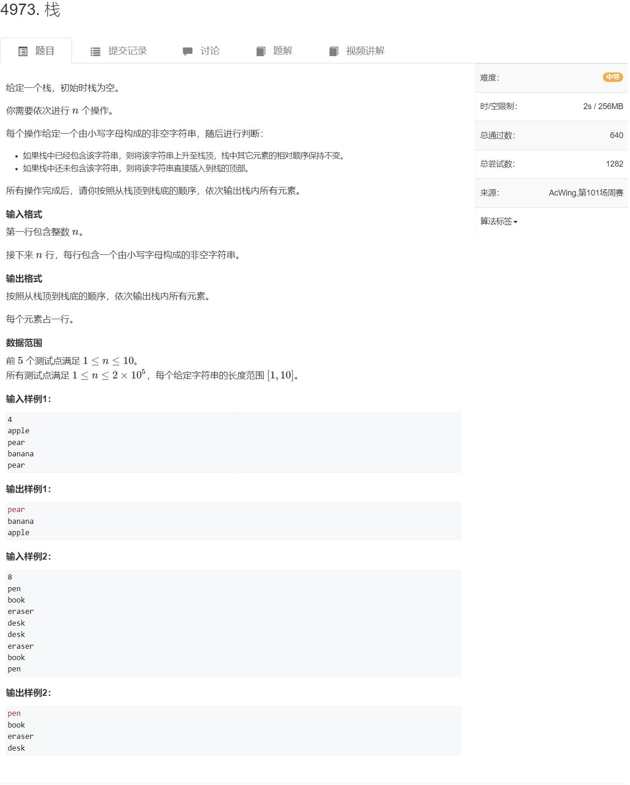

遍历查找与哈希查找

[4973. 栈 - AcWing题库](https://www.acwing.com/problem/content/4976/)



这道题思路不难，从后往前遍历，对于每一个字符串str[i]来说，从该字符串开始往后遍历，如果后面的字符串str[j] == str[i]  就不打印这个字符串，反之则打印。

如果用遍历的话可能会TLE

因此，使用哈希表；具体使用方法如下：

从后往前遍历，对于每一个字符串str[i]来说，如果哈希表里有这个字符串，不做任何操作。如果没有，打印该字符串，同时将该字符串放入哈希表中。

因为哈希表查找元素的时间是O(1),而遍历查找元素的时间是O(n)


```cpp
#include <iostream>
#include <unordered_set>
using namespace std;

const int N = 2e5+10;
char str[N][11];


int main()
{
    int n;
    cin >> n;
    for(int i = 0; i < n; i++) cin >> str[i];
    unordered_set<string> s;
    for(int i = n-1; i >= 0;i--)
    {
        if(!s.count(str[i]))
        {
            puts(str[i]);
            s.insert(str[i]);
        }
    }
}
```

