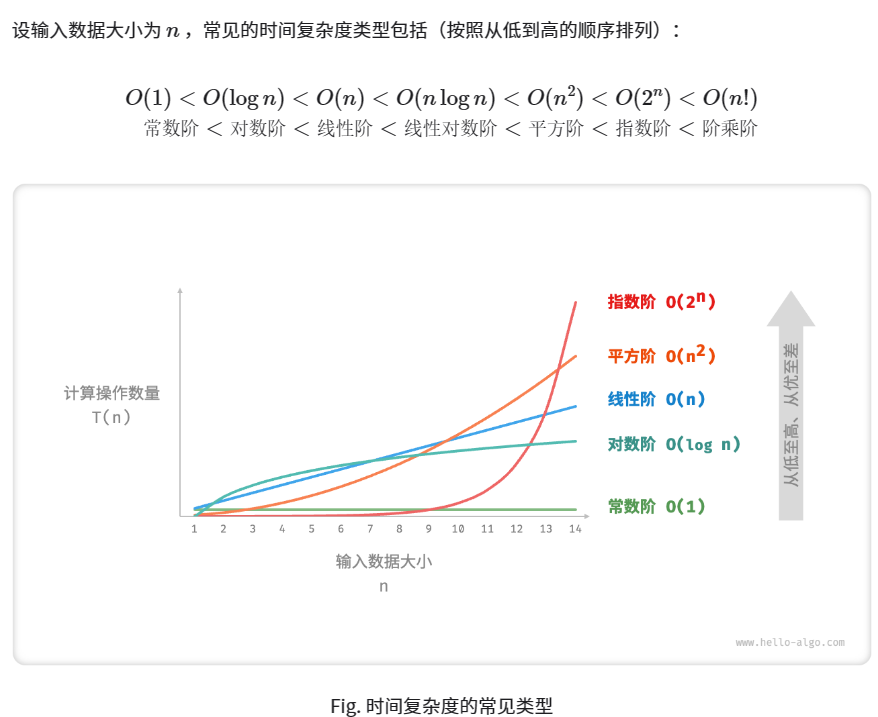

时间复杂度和空间复杂度

[时间复杂度和空间复杂度（详解版） (biancheng.net)](http://c.biancheng.net/view/8081.html)

### 什么是算法？

「算法 Algorithm」是在有限时间内解决特定问题的一组指令或操作步骤。算法具有以下特性：

- 问题是明确的，具有清晰的输入和输出定义。
- 解具有确定性，即给定相同的输入时，输出始终相同。
- 具有可行性，在有限步骤、时间和内存空间下可完成。

### 算法评价维度

从总体上看，算法设计追求以下两个层面的目标：

1. **找到问题解法**。算法需要在规定的输入范围内，可靠地求得问题的正确解。
2. **寻求最优解法**。同一个问题可能存在多种解法，我们希望找到尽可能高效的算法。

因此，在能够解决问题的前提下，算法效率成为主要的评价维度，主要包括：

- **时间效率**，即算法运行速度的快慢。
- **空间效率**，即算法占用内存空间的大小。

根据算法编写出的程序，运行时间更短，运行期间占用的内存更少，该算法的运行效率就更高，算法也就更好。

每一位初学者都要掌握一个技能，即善于运用时间复杂度和空间复杂度来衡量一个算法的运行效率。

#### 时间复杂度

 判断一个算法所编程序运行时间的多少，并不是将程序编写出来，通过在计算机上运行所消耗的时间来度量。原因很简单，一方面，解决一个问题的算法可能有很多种，一一实现的工作量无疑是巨大的，得不偿失；另一方面，不同计算机的软、硬件环境不同，即便使用同一台计算机，不同时间段其系统环境也不相同，程序的运行时间很可能会受影响，严重时甚至会导致误判。

实际场景中，我们更喜欢用一个估值来表示算法所编程序的运行时间。所谓估值，即估计的、并不准确的值。注意，虽然估值无法准确的表示算法所编程序的运行时间，但它的得来并非凭空揣测，需要经过缜密的计算后才能得出。  

**如何预估一个算法所编程序的运行时间呢？很简单，先分别计算程序中每条语句的执行次数，然后用总的执行次数间接表示程序的运行时间。**

以一段简单的 C 语言程序为例，预估出此段程序的运行时间：

```c
for(int i = 0 ; i < n ; i++)     
{
    a++;              
}
```

在上面这段代码中， `int i = 0`执行了一次；for循环里的条件判断语句 `i<n` 执行了 $n+1$次；`a++`执行了$n$次；`i++`执行了n次。总执行次数为 $1+(n+1)+n+n=3*n+2$

再举一个例子：

```c
for(int i = 0 ; i < n ; i++)     
{ 
    for(int j = 0 ; j < m ; j++)     
    {
        num++;                    
    }
}
```

先算内层循环，内层循环就是第一个例子，所以一次内层循环执行次数为 $3*m+2$;外层循环：`int i = 0`执行了一次;for循环里的条件判断语句执行了$n+1$次，`i++`执行了$n$次，内层循环执行了$n$次，一次内层循环执行次数为$3*m+2$,因此这段代码总执行次数为$1+(n+1)+n+n*[3*m+2]=3*n*m+4*n+2$ 


我们衡量一个程序的好坏，更多的是看程序在最坏情况下的运行时间，在上面的例子中，就是让数据规模$n,m$趋于无穷大，当$n,m$趋于无穷大的时候，代码总执行次数由更高阶的$n*m$决定，即当$n,m$趋于无穷大时，$3*n*m+4*n+2 = n*m$,即乘数3和常数2，以及低阶的$4*n$并不影响结果。因此，我们可以将这段代码的总执行次数简化为 $n*m$

然后写成这样的形式 $O(n*m)$ 来表示这段代码的时间复杂度。(不要问为什么用这样的形式，记住就行了)




对于比较短的程序，我们可以去数程序执行的次数，但是如果程序代码有几千行呢？

我们只关注 算法的 基本操作 就可以了。

什么是算法的 基本操作？

对于查找算法来说，比较关键字就是 查找算法的基本操作。


为什么可以只关注基本操作呢？因为 一个算法的基本操作 是这个算法频繁使用的操作，主要影响算法的执行时间。从时间复杂度的角度看就是最高阶项。

对于比较短的程序，我们依旧可以只看 这个程序的 基本操作，比如上面程序中，循环里的判断和循环内执行的语句就是程序中频繁执行的操作。所以求时间复杂度可以只关注这个循环的执行次数。

我们可以直接忽略那些顺序执行的语句，因为这些语句的执行次数与n没有关系，不会随着n的增大而增大，即不是主要影响时间复杂度的因素，可以直接忽略。这就是我们上面时间复杂度只取最高次项忽略常数项的原因。


#### 空间复杂度

要知道每一个算法所编写的程序，运行过程中都需要占用大小不等的内存空间，例如：

- 程序代码本身所占用的内存空间；
- 程序中如果需要输入输出数据，也会占用一定的内存空间；
- 程序在运行过程中，可能还需要临时申请更多的内存空间。

对于第一个因素，可以把代码写短点，占用的空间就少了，但是对于空间复杂度的影响几乎为0，这个东西不要考虑；第二个跟具体问题的输入输出要求有关，对空间复杂度的影响也可以忽略不计；**因此，我们只需要考虑程序运行过程中申请的空间和输入规模$n$的关系就可以了。**


举个例子：

```c
int n;
scanf("%d", &n);
int a[10];
```

这段程序在运行时所申请的临时空间，并不随 n 的值而变化。

再举一个例子：

```c
int a[n];
```

程序运行所申请的临时空间，和 n 值有直接的关联。

在第一个例子中，n的变化不影响申请的内存空间的变化，因此空间复杂度为O(1)

在第二个例子中，随着输入值 n 的增大，程序申请的临时空间成线性增长，则程序的空间复杂度用 O(n) 表示;


需要考虑空间复杂度的情况：

1. 如果有递归程序的话，需要考虑空间复杂度

2. 如果存在new语句，自己申请空间的话，也要考虑程序会不会在某个时刻申请过多空间导致出错。

3. 定义二维数组的时候

   ```cpp
   int a[100000][100000];
   ```

   像这样的，定义大空间的一维数组还好，直接定义这么大的二维数组，肯定是爆内存的。呜呜呜

如果程序中没有以上的情况的话，基本不用考虑空间复杂度，因为你不会写一个贼离谱的程序能直接把内存给爆掉的。


### 权衡时间与空间

理想情况下，我们希望算法的时间复杂度和空间复杂度都能达到最优。然而在实际情况中，同时优化时间复杂度和空间复杂度通常是非常困难的。

**降低时间复杂度通常需要以提升空间复杂度为代价，反之亦然**。我们将牺牲内存空间来提升算法运行速度的思路称为「以空间换时间」；反之，则称之为「以时间换空间」。

选择哪种思路取决于我们更看重哪个方面。在大多数情况下，时间比空间更宝贵，因此以空间换时间通常是更常用的策略。当然，在数据量很大的情况下，控制空间复杂度也是非常重要的。


我们来看一个题目：

第一行输入$n,m$，接下来输入n行，每一行有m个数。数据范围$1 \leq n,m \leq 100$ 

要求二维数组来存储这个矩阵。

有两种写法：

1. 根据数据范围申请一个静态二维数组

```cpp
# include <cstdio>    //scanf和printf在输入输出很多的时候运行的时间低于cin和cout，输入输出少的时                         //候，运行时间差不多
using namespace std;

const int N = 110;    //数据范围是100,多开10个防止溢出
int matrix[N][N];    //二维数组为全局变量，自动初始化使其元素全为0。比写到main函数里好，不用再初始化了

int main()
{
    int n,m;
    scanf("%d %d",&n,&m);
    for(int i = 0;i<n;i++)
        for(int j = 0;j<m;j++)
            scanf("%d",&matrix[i][j]);
}
```

2. 构造动态二维数组

```cpp
#include <cstdio>

using namespace std;

int main()
{
    int n,m;
    scanf("%d %d",&n,&m);
    int **s = new int*[n];
    for(int i = 0;i<n;i++) s[i] = new int[m];
}
```


第一种方法来说，虽然对于有某些实例来说，造成了空间浪费，但是相较于第二种方法，所消耗的时间更短，因为不用在开辟数组这个地方浪费时间。因此，第一种方法明显是比第二种好的，跟着y总也算是学到了一点皮毛。


