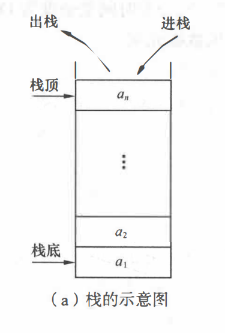
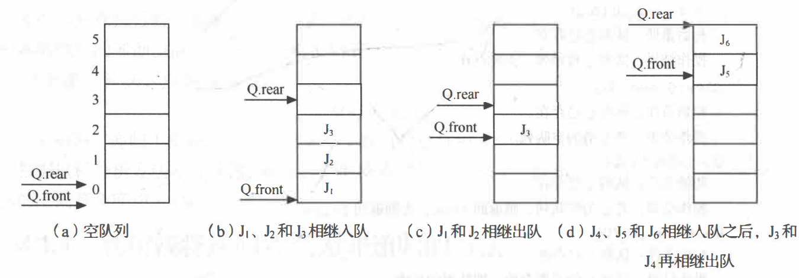
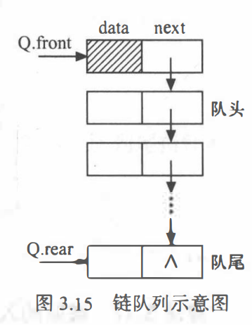

> 吃多了拉是队列，吃多了吐是栈。

# 栈

栈是限定仅在表尾进行插入或删除操作的线性表。，对栈来说， 表尾端有其特殊含义， 称为栈顶 (top), 相应地， 表头端称为栈底 (bottom)。 不含元素的空表称为空栈。

栈具体的存储结构，或者说，栈的具体实现有两种：**顺序栈和链栈。**

## 顺序栈

顺序栈可以用数组+栈顶指针。栈顶指针可以用int类型，来表示下标。初始化栈顶指针 `int top = 0;`

从逻辑结构来分析栈的话，需要定义两个指针，一个指向栈顶top，一个指向栈底base；初始化的时候需要把两个都置为0，但是栈的操作都是对栈顶元素进行操作，栈底base一直指向数组第0号元素，所以栈底指针就没必要定义。

**栈顶指针指向的是栈顶元素上面那个空位置。**

在进行入栈和出栈操作前，需要判断栈是否满了和是否为空。

判断为空的条件是 top=0

判断为满的条件是 top=MAXSIZE

## 链栈

链栈用单链表表示；链栈需要定义栈顶指针和栈尾指针；不定义栈尾指针怎么知道栈的范围，同时栈尾指针==栈顶指针用来判断栈是否为空，这个不用判断栈是否会满。

还记得之前讲的头插法和尾插法吗？这个一看就是头插法。注意：链栈不需要头结点。如果用头插法来实现入栈的话，需要定义头指针；如果用尾插法，我们直接把栈底指针当作头指针就可以了，就没必要定义头指针了。

## 对栈的操作

初始化，入栈，出栈，取栈顶元素。自己思考，不难。

# 递归和栈

我们先来了解一下函数调用的底层实现：

函数调用（递归的原理）：当CPU按存储顺序调用机器码时，若遇到函数调用指令，在跳转到函数那里之前会先把后面还未执行的指令地址开头存储到栈中，以便在函数执行完回到之前的位置。若出现多次调用情况，则也会多次压栈。显然，我们应该先回到最后一次调用函数之前的位置，再一步步回到最开始的位置，而越先出栈的地址反而是越后面的函数调用时压栈的地址，正好是应该先返回的地址，正好符合先进后出的要求，程序也会一步步地顺利返回最初一次函数调用时下一个指令的地址了。

[『教程』堆栈是个啥？_哔哩哔哩_bilibili](https://www.bilibili.com/video/BV1P44y1q7uL/?spm_id_from=333.788&vd_source=5a374f315281b0338a0b7fd69b8b8e98)

然后我们就可以用循环+栈替代递归函数。

# 队列

和栈相反，队列(queue)是一种先进先出的线性表。它只允许在表的一端进行插入，而在另一端删除元素。在队列中，允许插入的一端称为队尾(rear), 允许 删除的一端则称为队头(front)。

队列的存储结构也有两种实现：顺序存储的队列和链式存储的队列。

## 顺序存储形式

顺序存储的队列可以用数组+两个指针实现，一个指针指向队列的第一个元素，一个指向队尾最后一个元素的后面那个位置。这里的指针我们用下标来代替。比如初始化两个指针时(看第一个图), `int front = 0,rear=0;`

尾插操作对应 `rear++;` ,头出操作对应 `front++;`。根据上图可以看出来，在进行一些头出尾插的操作之后，队头指针和队尾指针跑到了数组的后面。那前面的空间就用不到了呀。这该怎么办呢？用循环队列啊！**那数组怎么实现循环队列呢？头、 尾指针 “依环状增1"的操作可用 “模” 运算来实现。**

比如数组的size是6，当处于图d那个状态时，我再往队尾放一个元素，根据循环队列，此时我们的 `rear`应该0,用代码来实现这样的循环操作使用的是 `rear = (rear+1)% 6;`，同理从队头出去一个元素，` (front+1) %= 6;`

还有另外一个问题，如果一直从队尾放元素而不从队头出元素，就会导致队列溢出。另一方面，如果一直从队头出元素而不放入，会导致每元素可出啊，**因此，我们在每次存放元素之前都要判断队列是否满了，在每次出元素的之前判断队列是否为空**

队空的条件： front = rear   (看图a，刚开始队列为空，此时front=rear)
队满的条件： (rear+ 1)%MAXSIZE = front

思考：怎么求循环队列的长度？

##  链式存储形式

队列的链式存储也是用单链表来表示，初始化两个指针，分别指向队头和队尾。当队头指针等于队尾指针时，队列为空，不用判断队满。跟链栈一样，链队也不需要头结点，好像头指针也没必要要。

## 对队列的操作

初始化，求队列长度，入队，出队，取队头元素。

综上所述，可知，链式结构的栈和队列是优于顺序结构的栈和队列的。

