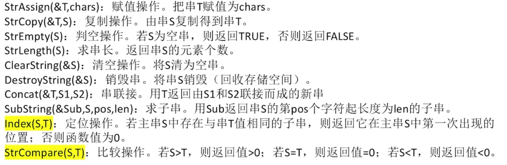
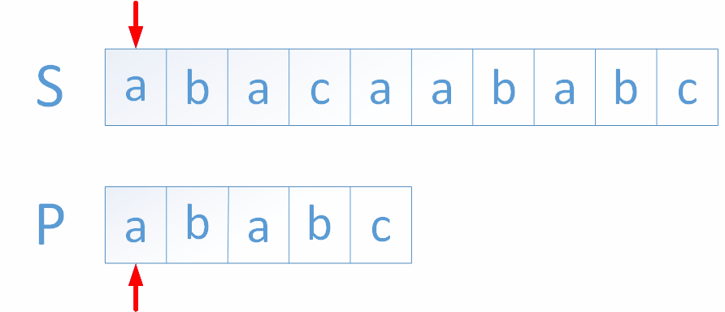

1.字符串

字符串的逻辑结构就是线性结构，跟线性表的区别在于，字符串的数据元素必须是字符。其次在操作上，对线性表的操作一般都是单个元素，而**对字符串操作，更多的是对子串。**

**一个字符串的子串是指 字符串一段连续的串。**空串也是子串

~~串的存储结构也分为顺序存储和链式存储。不是，我长这么大，都没见串写成链式的，链式存储的字符串有啥用？看看了书上，说顺序存储的字符串比链式存储的有效率，我擦，那又何必提字符串的链式结构呢？~~

ok，把上面一段删了，我们只学习串的顺序存储。

之前学过的，字符串使用数组存储的

创建字符串数组的两种方式：

```cpp
char c[MAXSIZE];   //静态的
```

在C语言中， 存在一个称之为 ＂堆" (Heap)的自由存储区， 可以为每个新产生的串动态分配一块实际串长所需的存储空间， 若分配成功， 则返回一个指向起始地址的指针， 作为串的基址.👇

```cpp
char *c;
```

字符串的基本操作




串的模式匹配算法

子串的定位运算通常称 为串的模式匹配或串匹配。此运算的应用非常广泛，比如在搜索引擎、拼写检查、 语言翻译、数据压缩等应用中， 都需要进行串匹配。

**BF算法(Brute-Force)**--->暴力算法

思路：先比较子串第一个字符和主串的第一个字符，如果不相等，就比较子串的第一个字符和主串的第二个字符，一直不相等就一直比，如果主串都比完了，都没找到，就说明主串不能匹配这个子串；如果某一时刻主串的第$i$字符跟子串的第一个字符相等，就比较主串的第$i+1$个字符和子串的第二个字符，以此类推，如果把子串给拼完了，就算是找到了，如果没找到，就让子串的第一个字符继续跟主串的第$i+1$个字符比较，以此类推。

看动态图比较清晰。



```cpp
int BF(string S,string T)
{
    int i = 1,j = 1;
    while(i <= S.length&& j <= P.length)
    {
        if(S[i] == P[j]) i++,j++;    //开始比较，如果相等，都往后移动指针，接着比较
        else                        //如果不相等
        {
            i = i-j+2;             //i指针移动到下一个子串开头
            j = 1;             //j指针移动到模式串开头
        }
    }
    if(j > P.length)    //说明成功匹配
    return i-P.length;   //返回匹配成功的子串在主串中的位置
    else return -1;     //否则没有匹配成功
}
```

BMP算法


