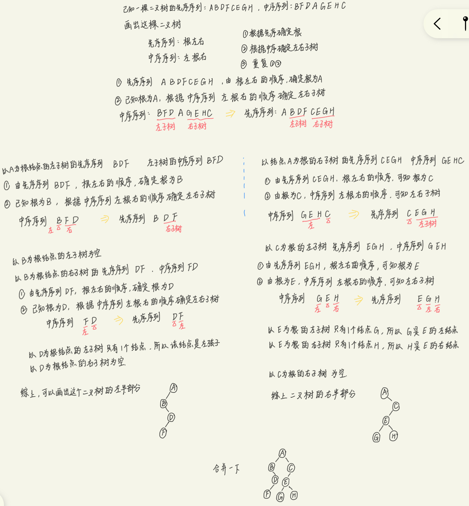
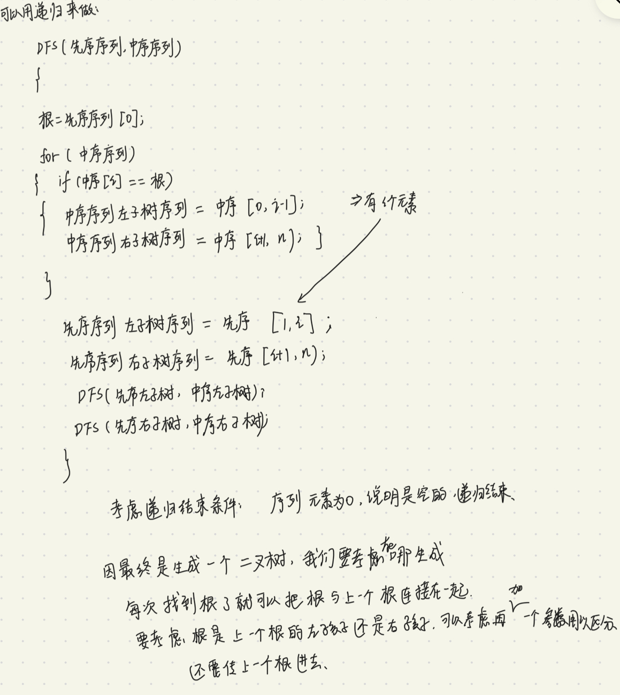

6.2.2根据前序中序或后序中序构造二叉树

硬性条件：**要求序列中不能有重复的元素**

1. 先理解如何从先序中序或后序中序构造二叉树这个过程

[数据结构 树和二叉树 考点二 由遍历序列确定二叉树_哔哩哔哩_bilibili](https://www.bilibili.com/video/BV1Je411N7b7/?spm_id_from=333.999.0.0&vd_source=5a374f315281b0338a0b7fd69b8b8e98)



[剑指 Offer 07. 重建二叉树 - 力扣（Leetcode）](https://leetcode.cn/problems/zhong-jian-er-cha-shu-lcof/?favorite=xb9nqhhg)



```cpp
/**
 * Definition for a binary tree node.
 * struct TreeNode {
 *     int val;
 *     TreeNode *left;
 *     TreeNode *right;
 *     TreeNode(int x) : val(x), left(NULL), right(NULL) {}
 * };
 */
 void dfs(vector<int> preorder,vector<int> inorder,int k,TreeNode* p)
 {
     vector<int> l_preorder,r_preorder,l_inorder,r_inorder;
     if(preorder.empty()) return;
     int root = preorder[0];
     TreeNode* t = new TreeNode;
     t->val = root;
     if(k == 0) p->left = t;
     else p->right = t;
     int i = 0;
     for(;i<inorder.size();i++)
     {
         if(inorder[i] == root) //因为我们是根据相等在中序中找的根，所以序列中不能有相同的元素。
         {
             for(int j = 0;j < i;j++) l_inorder.push_back(inorder[j]);
             for(int j = i+1;j < inorder.size();j++) r_inorder.push_back(inorder[j]);
             break;
         }
     }
     for(int j = 1;j <= i;j++) l_preorder.push_back(preorder[j]);
     for(int j = i+1;j < preorder.size();j++) r_preorder.push_back(preorder[j]);
     dfs(l_preorder,l_inorder,0,t);
     dfs(r_preorder,r_inorder,1,t);

 }
class Solution {
public:
    TreeNode* buildTree(vector<int>& preorder, vector<int>& inorder) {
        TreeNode * s = new TreeNode;
        dfs(preorder,inorder,0,s);
        s = s->left;
        return s;
    }
};
```

