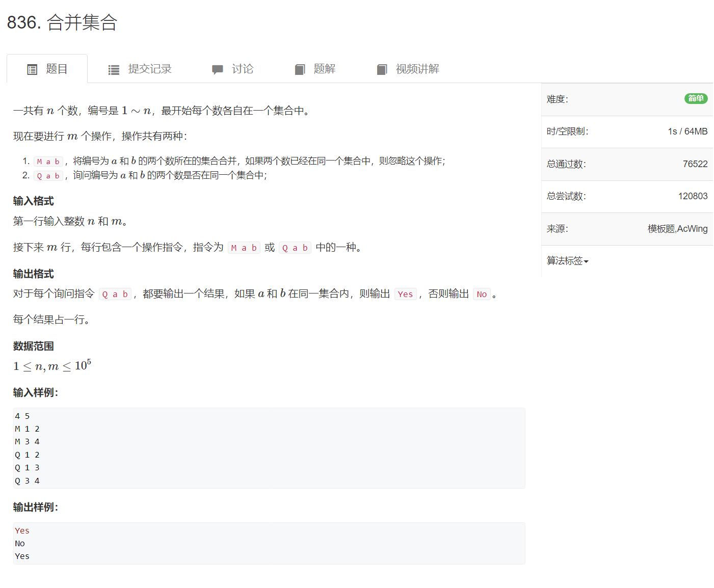
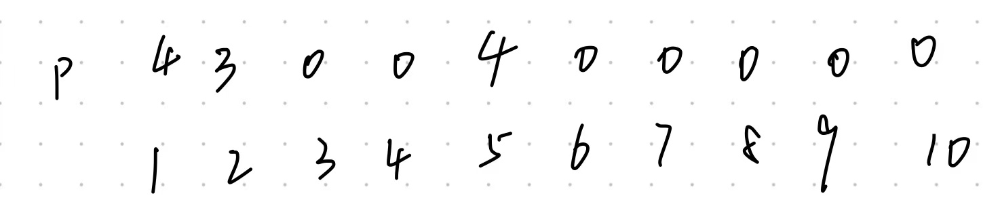

6.6并查集

并查集是一种数据结构，其逻辑结构是集合，元素的类型都是一样的，基本操作有两个：

1. 合并两个集合

2. 查询某个元素所属集合。这可以用于**判断两个元素是否属于同一集合**。


实现方式：

如何存储并查集？

**我们只要能存储 每一个元素 以及 每一个元素所属的集合名 就算存储了并查集。**

**不管具体的存储方式是什么，都必须能够实现 合并集合的操作和 查询某个元素所属的集合。**

简单来说，就是  给你一个元素， 你要能找到这个元素所属的集合。

例题：[836. 合并集合 - AcWing题库](https://www.acwing.com/problem/content/838/)




```cpp
#include <cstdio>

const int N = 100010;

int s[N];  //下标为数字i对应的a[i]表示数字i所属集合

int main()
{
    int n,m;
    scanf("%d %d",&n,&m);
    for(int i = 1;i <= n;i++) s[i]=i;
    while(m--)
    {
        char c[2];
        int a,b;
        scanf("%s %d %d",c,&a,&b);
        if(c[0] == 'M')
        {
            int temp = s[a];
            for(int i = 1;i <= n;i++)
            {
                if(s[i] == temp) s[i] = s[b];
            }
        }
        else
        {
            if(s[a] == s[b]) printf("Yes\n");
            else printf("No\n");
        }
    }
}
```

这个题的情况比较简单，用数组就可以实现，不过上面代码描述的方法时间复杂度较高。


**下面用树的存储结构（双亲表示法）的顺序存储来实现并查集**


从用户的角度看，数据元素之间的关系是集合，基本操作是合并和查找。

我们如何存储集合这种关系呢？

存储集合关系，就是存储每个数据元素以及其所属的集合。

用双亲表示法描述的一棵树可以看成是一个集合，这个集合用根节点来表示。这棵树上所有的结点都属于这个集合。

判断两个元素是否属于同一个集合：只需判断这两个元素所在树的根节点是否相同，如果相同说明属于同一个集合。

合并集合：只需让其中一棵树作为另一棵树的子树即可。


使用双亲表示法实现这两种操作都非常简单和快捷。


```cpp
#include <iostream>

using namespace std;

const int N = 100010;

int parent[N];  //下标从1开始，初始值全为0，表示数字i的父节点不存在，表示每个数字都是根节点，都是一个独立的集合

int main()
{
    int n,m;
    cin >> n >> m;
    while(m--)
    {
        char c;
        int a,b;
        cin >> c >> a >> b;
        if(c == 'M')    //合并a和b所在的集合
        {
            //找到a和b的根节点，让其中一个根节点的父节点是另一个根节点
            while(parent[a] != 0) a = parent[a];
            while(parent[b] != 0) b = parent[b];
            //此时a和b就是根节点
            parent[a] = b;    //让根节点a的父节点是b
        }
        else
        {
            while(parent[a] != 0) a = parent[a];
            while(parent[b] != 0) b = parent[b];
            if(a == b) cout << "Yes" << endl;
            else cout << "No" << endl;
        }
    }
}
```

还是超时


优化：路径压缩

在查找的时候，将路径上的结点的父节点都定义为根节点。这样我们下次只需更少的次数就可以找到根节点了，更快了。

方法是先找到根节点，然后在重新走一遍找根节点的过程，将每一步的父节点改为根节点。

```cpp
#include <iostream>

using namespace std;

const int N = 100010;

int parent[N];  //下标从1开始，初始值全为0，表示数字i的父节点不存在

int main()
{
    int n,m;
    cin >> n >> m;
    while(m--)
    {
        char c;
        int a,b;
        cin >> c >> a >> b;
        if(c == 'M')    //合并a和b所在的集合
        {
            //找到a和b的根节点，让其中一个根节点的父节点是另一个根节点
            while(parent[a] != 0) a = parent[a];
            while(parent[b] != 0) b = parent[b];
            //此时a和b就是根节点
            if(a == b) continue;   //注意这一条语句
            parent[a] = b;    //让根节点a的父节点是b
        }
        else
        {
            int root_a = a,root_b = b;
            while(parent[root_a] != 0) root_a = parent[root_a];
            while(a != root_a)
            {
                int temp = parent[a];
                parent[a] = root_a;
                a = temp;
            }
            while(parent[root_b] != 0) root_b = parent[root_b];
            while(b != root_b)
            {
                int temp = parent[b];
                parent[b] = root_b;
                b = temp;
            }
            if(a == b) cout << "Yes" << endl;
            else cout << "No" << endl;
        }
    }
}
```


`if(a == b) continue;` 是为了应对这种情况：



输入 `M 1 4`

执行这条命令之后，parent[4] = 4，而我们判断是否为根节点的依据是其父节点=0

因此，为了避免让parent[4] = 4 ,直接用continue掠过了。


因此，最好 判断是否为根节点的方式是，如果一个结点是根节点，让它等于它自己

