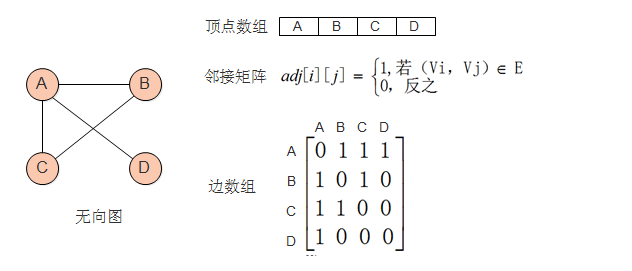
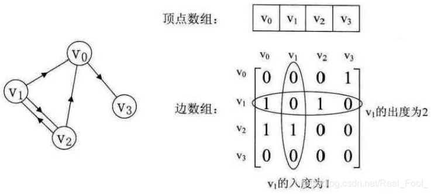
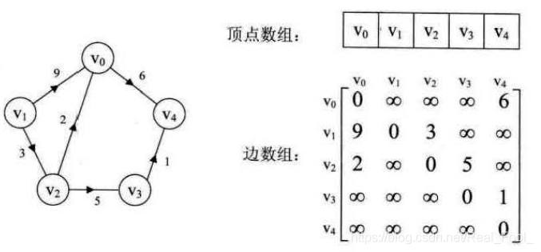
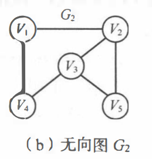

7.1图的存储结构

[数据结构：图(Graph)【详解】_数据结构图_UniqueUnit的博客-CSDN博客](https://blog.csdn.net/Real_Fool_/article/details/114141377)

由于图的结构比较复杂，任意两个顶点之间都可能存在联系，因此无法用数据元素在存储区中的物理位置来表示元素之间的关系，即图没有顺序存储结构，但可以借助二维数组来表示元素之间的关系，即邻接矩阵表示法。另一方面，由于图的任意两个顶点间都可能存在关系，因此，用链式存储表示图是很自然的事，图的链式存储有多种，有邻接表、十字链表和邻接多重表，应根据实际需要的不同选择不同的存储结构。

### 邻接矩阵

想要表示出来图，第一，要明确出来图的所有顶点，第二，顶点之间的相邻关系。

我们用一维数组来存放所有的顶点，用二维数组来存放顶点之间的相邻关系。

一个图有$n$个顶点，我们用一个一维数组来存放所有的顶点，我们把这个一维数组称为顶点数组。为了便于说明,我们定义，$v_i$表示顶点数组中下标为$i$的顶点。

我们用一个$n*n$的二维数组$A$来存放边的信息，我们定义$A[i][j]$只可能取两个值，一个为0，一个为1；当$A[i][j]=0$时表示，从顶点$v_i$和顶点$v_j$之间没有边。当$A[i][j]=1$时表示，从顶点$v_i$和顶点$v_j$之间没有边。


以下是无向图，及其邻接矩阵



性质：

1. 无向图的邻接矩阵一定是一个**对称矩阵**，主对角线的值一定为0，因此，在实际存储邻接矩阵时只需存储上(或下)三角矩阵的元素。
2. 对于无向图，邻接矩阵的第$i$行(或第$i$列)中1的个数正好是第$i$个顶点的度
3. 求顶点$v_i$的所有邻接点就是将矩阵中第i行元素扫描一遍，如果$A[i][j]=1$，那$v_j$就是$v_i$的邻接点。

以下是有向图及其邻接矩阵




性质：

1. 主对角线上数值依然为0。但因为是有向图，所以此矩阵并不对称。
2. 有向图讲究入度与出度，顶点$v_i$的出度为第$i$行1的个数；顶点$v_i$的入度为第$i$列1的个数。


以下是带权图及其邻接矩阵

我们用一个$n*n$的二维数组$A$来存放边的信息，如果从顶点$v_i$到$v_j$有边，则$A[i][j]$存放这条边对应的权值；如果$i == j$,$A[i][j]$存放0；如果没有边,$A[i][j]$存放无穷大($\infty$)

> 记住这种方式就行了，不用问为什么存放无穷大，碰到具体应用的时候就理解了。




### 邻接表

邻接表有两部分组成：结点表和边表




第一列是一个结点表，由一维数组实现，存放图的所有结点。以第一行举例，第一行的结点是$V_1$,结点后面跟了一个链表，链表的每一个元素表示从结点$V_1$出发的边。链表的第一个结点表示 从$V_1$出发到 *在一维数组中下标为$3$的顶点*  的边。 我们把跟在顶点$V_1$后面的链表是 从顶点$V_1$出发的边 的集合，称之为边表。

边表的元素没有先后顺序之分。各边表结点的链接次序取决于建立邻接表的算法，以及边的输入次序。

表头结点的结构如下：


```cpp
typedef struct VNode{
    ElemType data;
    ArcNode* firstArc;   //
}VNode;


VNode a[n];   //定义了一个大小为n的表头结点表a
```

边表是一个链表，链表的元素长这样；链表的每一个元素表示一条边；链表的元素无先后之分。


```cpp
typedef struct ArcNode{
    int adjvex;     //这条边指向的顶点在数组中的下标
    struct ArcNode* nextArc;    //指向 下一条边 的指针
    ElemType info;            //和边有关的信息
}ArcNode;
```

在无向图的邻接表中， 顶点$V_i$的度恰为第$i$个链表中的结点数;

而在有向图中， 第$i$个链表中的结点个数只是顶点$V_i$的出度， 为求入度，必须遍历整个邻接表。在所有链表中， 满足  $adjvex = V_i$的下标  的结点数 是 顶点$V_i$的入度。

为了便于确定顶点的入度，可以建立一个有向图的逆邻接表，即边表 是 进入顶点$V_i$的边  的集合。$adjvex$ 表示引出这条边的顶点在数组中的下标。


邻接表表示法的优缺点：

优点：

1. 便于增加和删除顶点。
2. 便于统计边的数目， 按顶点表顺序扫描所有边表可得到边的数目。若是无向图，边的数目要除以2
3. 空间效率高。对于一个具有n个顶点e条边的图 G, 若 G 是无向图，则在其邻接表表示中有 n 个顶点表结点和 2e 个边表结点；若 G 是有向图，则在它的邻接表表示或逆邻接表表示中均有 n 个顶点表结点和e个边表结点。因此，邻接表或逆邻接表表示的空间复杂度为 O(n + e), 适合表示稀疏图。对于稠密图常采取邻接矩阵表示法。

缺点：

1. 不便于判断顶点之间是否有边，要判定 $V_i$和$V_j$之间是否有边，就需扫描第$i$个边表，最坏情况下要耗费 O(n)时间。

2. 不便于计算有向图各个顶点的度。对于无向图，在邻接表表示中顶点$V_i$的度是第$i$个边表中的结点个数。 在有向图的邻接表中，第 $i$个边表上的结点个数是顶点$V_i$的出度，但求$V_i$的入度较困难，需遍历各顶点的边表。若有向图采用逆邻接表表示，则与邻接表表示相反，求顶点的入度容易，而求顶点的出度较难。


### 十字链表

### 邻接多重表


