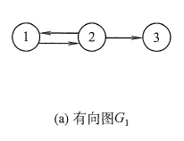

7.图

### 什么是图？

图的逻辑结构是下面的图形结构。

图的定义是：顶点和边的集合。(注意：图的数据元素有顶点和边，你看树啊，线性表啊都是顶点的集合)

图(Graph) G由两个集合V和E组成，记为G=(V,E) , 其中V是顶点的有穷非空集合，E是边的有穷集合

这个定义中，顶点$V$的集合是有穷非空的，边$E$的集合是有穷的。说明，图可以没有边，但至少要有一个顶点。(有多个顶点，没有边 也叫图)

对于图G,若边集E(G)为有向边的集合，则称该图为有向图；若边集E(G)为无向边的集合，则称该图为无向图。

在有向图中，顶点对$<x,y>$是有序的，它称为从顶点 x到顶点 y的一条有向边。 因此$<y,x>$与$<x,y>$ 是不同的两条边。顶点对用一对尖括号括起来，x是有向边的始点，y是有向边的终点。也称作一条弧，则 x为弧尾， y为弧头。

无向图中，顶点对$(x, y)$是无序的，它称为与顶点$x$和顶点$y$相关联的一条边。这条边没有特定的方向，$(x,y)$与$(y,x)$是同一条边。为了区别于有向图，无向图的顶点用一对圆括号括起来。

### 图的相关概念

1. 子图

设有两个图$G=(V,E)$和$G^{\prime}=(V^{\prime},G^{\prime}) $  若$V^{\prime}$是$V$的子集，且$E^{\prime}$是$E$的子集，则称$G^{\prime}$ 是$G$的子图。

2. 完全图

   无向完全图：任意两个顶点之间都有一条边。因此，无向完全图有$n(n-1)/2$条边

   有向完全图：任意两个顶点之间都有两条方向相反的边。因此，有向完全图有$n(n-1)$条边

3. 权和网

   在实际应用中，图的每一条边都可以标上具有某种意义的数值，该数值称为这条边上的权。这种带权的图称为网。

4. 邻接点

   在无向图中，如果两个顶点之间有边，那么这两个顶点就互为邻接点。

5. 度、入度和出度

   顶点的度是指与顶点直接相连的边的数目。在有向图中，顶点的入度是指 直接相连并且指向这个顶点的边 的数目。顶点的出度是指  直接相连并且从这个顶点出发的边 的数目。

6. 路径和路径长度

   在无向图中，从顶点$v$到顶点$v^{\prime}$的路径是 从顶点$v$沿着边到达顶点$v^{\prime}$ 途径的顶点序列。

   在有向图中，从顶点$v$到顶点$v^{\prime}$的路径是 从顶点$v$沿着有向边的箭头方向到达顶点$v^{\prime}$ 途径的顶点序列。

   路径的长度是一条路径上经过的边的数目。

7. 回路或环

   一个顶点能沿着边回到自己，就说这个图是存在回路的，或者说这个图是存在环的。对于有向图来说，是沿着箭头方向的有向边能回到自己。

8. 简单路径、 简单回路或简单环

   序列中顶点不重复出现的路径称为简单路径。除了第一个顶点和最后一个顶点之外，其余顶点不重复出现的回路，称为简单回路或简单环。

9. 连通、连通图和连通分量

   在无向图 G 中，如果从顶点$v$到顶点$v^{\prime}$有路径，则称 $v$和$v^{\prime}$ 是连通的。如果图中任意两个顶点都是连通的，则称 G 是连通图。连通分量是指无向图中的极大连通子图。

10. 强连通图和强连通分量

    在有向图 G 中，如果对于每一对顶点$v,v^{\prime}$都存在从$v$到$v^{\prime}$的路径和从$v^{\prime}$到$v$的路径，则称G是强连通图。有向图中的极大强连通子图称作有向图的强连通分量。

11. 连通图的生成树

12. 有向树和生成森林

