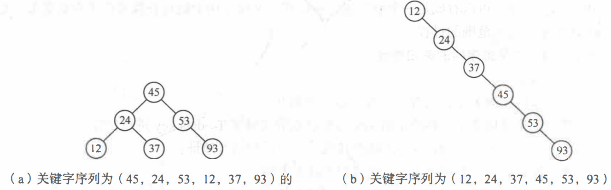

本书前几章介绍了各种线性和非线性的数据结构，并讨论了这些数据结构的相应运算。而在实际应用中，查找运算是非常常见的。面向一些数据量很大的实时系统，如订票系统、互联网上的信息检索系统等，查找效率尤其重要。本章将针对查找运算，讨论应该采用何种数据结构， 使用什么样的方法，并通过对它们的效率进行分析来比较各种查找算法在不同情况下的优劣。

# 7.1查找的基本概念

## 查找表

如果你想在某个数据集合中查找某个数据，那么这个数据集合就是查找表

举个例子：

如果你想在int数组中查找某个int，那么这个数组就是个查找表

## 记录、关键字、次关键字

先根据下面这张图，介绍一些概念


根据此表，可以看出每一横行对应着一位同学，每一行数据就是这张表的一个数据元素。

我们把这样的一条数据称为 **记录**。

准考证号，姓名 这一栏  是表的**数据项**

如果我们要查找某项记录，如何查找呢？根据 某一数据项 进行筛选。


如果要查找 陆华 这一行记录，你会根据哪一数据项进行查找？

肯定是 准考证号，因为每一位同学的准考证号都是唯一的。能精确查找。

因此，如果 能唯一确定一条记录的 某个 数据项 称为 主关键字。

如果主关键字 不能唯一确定，就在 找一个 数据项 进行筛选，这个数据项叫 次关键字。


像在int数组中查找int的，每一个int就是一个记录，int的值就是数据项。

因为只有这一个数据项，我们只能根据值进行查找，int的值就是主关键字，没有次关键字。


动态表和静态表

从**实际应用上**来说，如果一个查找表只用作 <font color=#c04851>查找</font> ，那么这个查找表就是静态表。如果查找表不仅用于 <font color=#c04851>查找</font>,有时候还需要进行<font color=#c04851>插入</font>或<font color=#c04851>删除</font>操作。那么这个查找表就是动态表。


## 平均查找长度

平均查找长度（Average Search Length，ASL）是一个用于衡量搜索算法效率的指标。通常情况下，ASL越小，查找效率越高。
$$
ASL=\sum_{i=1}^np_ic_i
\\
p_i表示查找第i项记录的概率，\sum_{i=1}^np_i=1，若无特殊说明，p_i=\frac{1}{n}
\\
c_i表示，当与第i项比较完的时候已经比较的次数
$$

刚接触这个概念的时候很懵逼，当时在想我靠，这什么玩意儿。


我们用 ASL 来衡量搜索算法的指标，为什么呢？

一个搜索算法，一个待查关键字，查找的一般过程如下

按照搜索算法的流程，将待查关键字与待查表中的关键字进行比较，如果相等，表明查找成功。否则，一直进行查找直到待查表查完。


一个搜索算法要想效率高，是不是就是搜索的要快，搜索算法把大部分时间都花费到了 关键字的比较上了，关键字比较是影响搜索算法效率的主力军，只要我们能尽可能缩短关键字的比较次数，那么这个搜索算法的效率就会明显提高。


对于一个搜索算法来说，如果查找 查找表中的每一项 都比较快的话，即查找每一项记录所花费的时间短，即关键字比较的次数少， 那这个搜索算法的效率就高。因此，我们用查找 待查表中每一项 所进行的关键字比较的次数的平均值，来代表 搜索算法的效率。平均值越小，搜索算法效率越高。


但在实际应用中，应该考虑这样一个问题，如果经常要查找某项记录，即 查找这一项记录的概率很大，那么我们就会希望 经常查找的这项记录 的关键字比较次数最小，这样我们的搜索效率就会更快。

> 这是初中还是高中的知识，用 期望值 代表 平均值，一直不理解，hh。导致看这个ASL的时候直接炸了。


但是，我们学习本章知识，并不考虑实际应用，所以，默认用平均值代替期望值。


# 7.2线性表的查找

## 7.2.1顺序查找

从表的一端开始，依次将记录的关键字和给定值进行比较，若某个记录的关键字和给定值相等，则查找成功；反之，若扫描整个表后，仍未找到关键字和给定值相等的记录，则查找失败。顺序查找方法既适用于线性表的顺序存储结构，又适用于线性表的链式存储结构。

```cpp
int search_seq(int s[],int key,int n)  //n为数组的最后一个元素的下标
{
    for(int i = n;i >= 1;i--)
        if(s[i] == key) return i;
    return 0;
}
```

上述代码的解释：

以上是对数组进行顺序查找的方法，数组s的元素下标范围$\in [1,n]$ ，我们从后往前进行顺序查找。其实从前往后也可以，这里从后往前的原因是可以对这种查找方法优化。

在查找过程中每步都要检测整个表是否查找完毕，即每次都要判断 $i \geq 1$是否成立，我们可以设置监视哨进行优化

```cpp
int search_seq(int s[],int key,int n)
{
    s[0] = key;
    for(int i = n;s[i]!=key;i--){}
    return i;
}
```

我们把key放到s[0]的位置，从后往前遍历的过程中如果碰到key就停下来。返回 i的值，如果是0说明数组s中没有key这个元素。这样就不用每次判断 $i \geq 1$ 了。

**然而实践证明，这个改进能使顺序查找在$n \geq$1000时，进行一次查找所需的平均时间几乎减少一 半。当然， 监视哨也可设在高下标处。**

顺序查找的优点是：算法简单， 对表结构无任何要求，既适用于顺序结构， 也适用于链式结构， 无论记录是否按关键字有序均可应用。

其缺点是： 平均查找长度较大， 查找效率较低， 所以当n很大时， 不宜采用顺序查找。


## 7.2.2二分查找

二分查找也叫折半查找，折半查找**要求线性表必须采用顺序存储结构， 而且表中元素按关键字有序排列。**

折半查找的查找过程为：从表的中间记录开始， 如果给定值和 中间记录的关键字相等， 则查找成功；如果给定值大于或者小千中间记录的关键字， 则在表中大于或小于中间记录的那一半中查找，这样重复操作， 直到查找成功，或者在某一步中查找区间为空， 则代表查找失败。


如果序列是有序的，二分查找的效率很高。

缺点：如果需要频繁进行插入和删除操作的话，顺序存储结构的硬性要求会导致二分查找不太合适。

ps：这时候需要二叉排序树（二叉排序树也是二分查找的思想）


## 7.2.3分块查找

分块查找 (Blocking Search) 又称索引顺序查找，这是一种性能介于顺序查找和折半查找之间的一种查找方法。在此查找法中，除表本身以外，尚需建立一个“索引表”。

有点像书中查目录一样


# 7.3树表的查找

对于 有频繁插入删除操作的查找表，如果用二分查找会导致性能不太好。

这时候就需要二叉排序树的登场了。 

## 7.3.1二叉排序树(BST)

二叉排序树又叫二叉搜索树，二叉查找树。

定义：

二叉排序树或者是一棵空树，或者是具有下列性质的二叉树：

- 若它的左子树不空，则左子树上所有结点的值均小于它的根结点的值；

- 若它的右子树不空，则右子树上所有结点的值均大于它的根结点的值；

- 它的左、 右子树也分别为二叉排序树。
- 二叉排序树的结点值不相等

二叉排序树的一个重要性质：中序遍历一棵二叉树时可以得到一个结点值递增的有序序列。


二叉排序树的存储方式是二叉链表


二叉排序树的递归查找

1. 若二叉排序树为空， 则查找失败，返回空指针。

2. 若二叉排序树非空， 将给定值key与根结点的值T->key进行比较：

   若key等于T->key, 则查找成功，返回根结点地址；

   若key小于T->key, 则递归查找左子树；

   若key大于T->key, 则递归查找右子树。


二叉排序树的插入

1. 若二叉排序树为空，则待插入结点\*S 作为根结点插入到空树中。

2. 若二叉排序树非空，则将key与根结点的关键字T->key进行比较：

   若key小于T->key, 则将\*S 插入左子树；

   若key大于T->key, 则将\*S 插入右子树。


二叉排序树的删除

是个麻烦的过程，以后遇到再说吧。写代码有点麻烦。


**二叉排序树的插入删除操作应该是比顺序存储的插入删除要快的。**


二叉排序树的创建

二叉排序树的创建是从空的二叉排序树开始的， 每输入一个结点， 经过查找操作， 将新结点插入到当前二叉排序树的合适位置。

1. 将二叉排序树T初始化为空树。

2. 读入一个关键字为key的结点。

3. 如果读入的关键字key不是输入结束标志，则循环执行以下操作：

   将此结点插入二叉排序树T中；

   读入一个关键字为 key 的结点；


二叉排序树的查找效率

根据二叉排序树的创建，分别创建以下两个序列的二叉排序树



我们来看看这两个二叉排序树的 ASL

$$
ASL=\sum_{i=1}^np_i*c_i
$$
$$P_i=\frac{1}{n}=\frac{1}{6}$$


对于第一个二叉排序树来说，

查找到 45,24,53,12,37,93  分别需要进行关键字比较次数为 1，2，2，3，3，3

对于第二个二叉排序树来说，

查找到 12，24，37，45，53，93 分别需要进行的关键字比较 次数为1，2，3，4，5，6


发现了规律没，如果你的序列是有序的，就不要改成二叉排序树，用二叉排序树算法来查找，直接用二分更好。

为什么，你会发现，如果序列是有序的，用二叉排序树跟用顺序查找算法的过程是一模一样的，$O(n)$的时间复杂度。

另一方面，

二叉树第一层 比较一次

二叉树第二层 比较两次

二叉树第三层 比较三次

二叉树越深，比较的次数越多。

因此，如果想用二叉排序树查找，二叉排序树越扁平越好。

这就为我们提供了一个思路，**根据序列创建二叉排序树，然后我们把二叉排序树调整成扁平的不就行了？** 

这样我们就可以用二叉排序树查找算法了呀，牛逼。后面要讲，二叉平衡树。


从顺序查找的效率低到二分查找不适合频繁插入删除到二叉排序树对于有序序列的查找退化为顺序查找，再到我们接下来要讲的二叉树。

一步步优化。


遇到的有关二叉排序树的题目：

[剑指 Offer 33. 二叉搜索树的后序遍历序列 - 力扣（Leetcode）](https://leetcode.cn/problems/er-cha-sou-suo-shu-de-hou-xu-bian-li-xu-lie-lcof/description/?favorite=xb9nqhhg)


## 7.3.2二叉平衡树

前面提到，有些序列如果使用二叉排序树的插入算法来创建二叉排序树的话，会导致二叉排序树很长，而二叉排序树如果过长会严重影响二叉排序树的查找效率，我们可以将二叉排序树进行改造，也可以说是平衡，平衡以后的二叉排序树不仅还是二叉排序树，而且还很扁平，那样我们的二叉排序树的查找效率就高了。

 

平衡二叉树的实现思路是这样的，

我们在 使用插入算法来创建二叉树的同时，每插入一个结点，就判断当前的二叉树是不是平衡二叉树，如果是，就继续插入，如果不是，就停下来，把当前的二叉树调整成平衡二叉树，继续插入。直到插入完成，这样，平衡二叉树就创建完成了。

如何判断二叉树是不是尽可能扁平的呢？换句话说，如何判断二叉树是不是平衡二叉树呢？

我们先定义一个平衡因子的概念：某一个结点的平衡因子 = 左子树高度-右子树高度

一棵平衡二叉树 满足：对于每一个结点的平衡因子的绝对值$\leq 1$ ，即结点的左子树的高度和右子树的高度差距不能超过1。

如果 平衡因子为-1，表示右子树比左子树高一层。

为0，表示左右子树一样高

为1，表示左子树比右子树高一层。


我们每插入一个结点，就要对 从根节点到该结点 路径上所有结点的平衡因子进行调整，如果存在平衡因子的绝对值$=$2的结点，那么这就不是一个平衡二叉树了，需要进行调整。


如何进行调整二叉排序树，使二叉排序树为平衡二叉树呢？

是个麻烦的过程。

[【AVL树的定义 .调整 .插入操作】如何理解AVL树这个数据结构_哔哩哔哩_bilibili](https://www.bilibili.com/video/BV1dr4y1j7Mz/?spm_id_from=333.337.search-card.all.click)

[二叉平衡树AVL平衡调整数据结构_哔哩哔哩_bilibili](https://www.bilibili.com/video/BV1xE411h7dd/?spm_id_from=333.337.search-card.all.click&vd_source=5a374f315281b0338a0b7fd69b8b8e98)


AVL树的缺点：好不容易创建了AVL树之后，查找是方便了，但是 插入 和 删除 很麻烦，因为每次插入或者删除都要调整二叉树为平衡二叉树。

所以AVL树只适合静态表的查找


接下来需要了解2-3-4树

红黑树。


