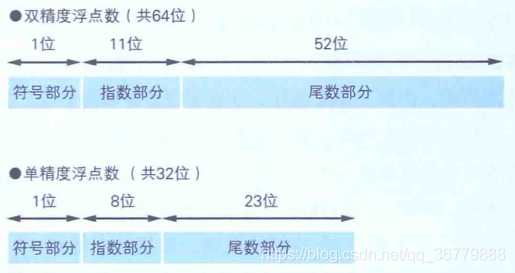
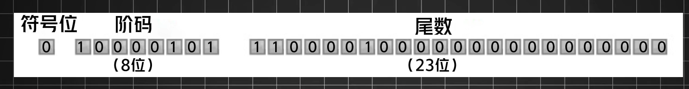

三个问题：

1. 整数和小数在计算机中如何存储
2. 任给你一个整数或小数，写出其在计算机中的存储形式
3. 小数的舍入问题

先聊整数，整数分为无符号整数和有符号整数。都是用计算机的补码表示的。

计算机中有符号整数的表示

原码、反码、补码

首先了解一下，**机器数**和**机器数的真值**

机器数是 数字在计算机中存储的二进制形式。

机器数的真值 就是 机器数表示的数

机器数有三种形式：原码、反码、补码

以  八位二进制数 表示 一个数 为例，了解原码、反码、补码

**原码**

原码的最高位为符号位，剩下的低七位 表示 值

$[+1]_原 = 00000001$   $[-1]_原 = 10000001$

如果用 八位二进制数的原码形式 表示一个数的话 ，表示的真值范围为 $[-2^8-1,2^8-1]$ 即$[-127,127]$  

**反码**

正数的反码是正数的原码

负数的反码是在负数的原码的基础上，符号位不变，其余位取反

$[+1]_原 =[+1]_反 =  00000001$ 

 $[-1]_原 = 10000001$    符号位不变，其余位取反-->  $[-1]_反 = 111111110$

**补码**

补码有两种记忆方式，

正数的补码是正数的原码

负数的补码是负数反码+1

另一种方式，

我们说，原码的最高位符号位不参与计算，补码的最高位既是符号位，又参与计算。

正数的最高位符号位为0，八位二进制 表示 值。

由上可知，正数的最高位为0，其实也算不参与计算，和正数的原码 求值 的方式是一样的，这也就是方法一中提到，正数的补码是正数的原码。

负数的最高位符号位为1，八位二进制 表示 值。

建议补码的记忆方式按照第二种方法。。。也就是下面这个公式
$$
二进制：x_{w-1}x_{w-2}...x_0  
\\
真值 = (-1)^{x_{w-1}}*(x_{w-1}*2^{w-1}) + \sum_{i=0}^{w-2} x_i*2^i
$$

**在现代的计算机中，整数在计算机中的存储形式为补码。**

总结：

整数在计算机中有三种存储方式：原码、反码、补码。

原码和补码 计算 真值的方式类似，区别在于最高位符号位是否参与 值 的计算。

反码，不知道有什么用，记住原码转反码，反码转补码的方式就可以了。

涉及这方面的有

数据溢出；数据类型的转换

小数在计算机如何存储？

首先需要学习，十进制小数如何转二进制小数，因此十进制小数如何在计算机存储的问题可以转化为对应的二进制小数如何在计算机中存储。

十进制小数转换成二进制小数采用"乘2取整，顺序排列"法。

具体做法如下：

> 　　用2乘十进制小数，可以得到积，将积的整数部分取出，再用2乘余下的小数部分，又得到一个积，再将积的整数部分取出，如此进行，直到积中的整数部分为零，或者整数部分为1，此时0或1为二进制的最后一位。或者达到所要求的精度为止。
> 　　然后把取出的整数部分按顺序排列起来，先取的整数作为二进制小数的高位有效位，后取的整数作为低位有效位。
> 　如：0.625=（0.101）B
> 　　0.625\*2=1.25  取出整数部分1
> 　　0.25\*2=0.5      取出整数部分0
> 　　0.5\*2=1          取出整数部分1
>
> 　　再如：0.7=（0.1 0110 0110...）B
> 　　0.7\*2=1.4                   取出整数部分1
> 　　0.4\*2=0.8              取出整数部分0
> 　　0.8\*2=1.6            取出整数部分1
> 　　0.6\*2=1.2             取出整数部分1
> 　　0.2\*2=0.4           取出整数部分0　
> 　　0.4\*2=0.8             取出整数部分0
> 　　0.8\*2=1.6            取出整数部分1
> 　　0.6\*2=1.2            取出整数部分1
> 　　0.2\*2=0.4           取出整数部分0

以 112.5 = (1110000.1)B 为例，计算机中如何存储 1110000.1的呢？

首先将 1110000.1 写成科学计数法的形式 1.1100001 * $2^6$

我们将存储科学计数法 **小数部分**(对应图中的尾数部分)，2的指数，还有符号位。

注意这里存储的是小数部分，整数部分的1没有存储，因为科学计数法的形式是  $a*10^b$ ，$1 \leq|a|<10$

这是十进制的形式，改成二进制是 $a*2^b,1 \leq |a| < 2$,因此 a的整数一定是1，所以不用存储。

a = 1+0.$f_{n-1}f_{n-2}...f_0$ ,只存储 $f_{n-1}f_{n-2}...f_0$ 对应图中的尾数部分。

以单精度浮点数为例，1.1100001对应计算机的尾数部分为 1100001000000...

按高位存储，剩余低位补零 

以单精度浮点数为例，最高位是符号位，0为正，1为负

用图中的八位来表示指数部分。如果我们这里直接用指数的二进制原码来存储的话，就无法表示指数为负数的情况。
$$
指数部分(e_{k-1}...e_1e_0)的值用E表示，指数用e表示,bias=2^{k-1}-1
\\
E = e + bias
$$
我们用e加上一个偏置项。

这里我们的k=8，$2^{k-1}-1=2^7-1=127$

我们 $e_{k-1}...e_1e_0$ 的取值范围是 (0,$2^k-1$)      这里，不算全0和全1的情况，这两种情况有特殊用途，后面提到。

全0的时候，e为-127，全1的时候，e为128，所以指数$e$的范围是（-127,127]，这样就能表示负数了。浮点数最小能表示的精度是$2^{-126}$，对应十进制的精度是？

对于双精度浮点数，k=11,指数e的范围是[-1022,+1023]，超出这个范围的话，double就表示不了了

什么是精度？

我是这样认为的，科学计数法中的$2^n$$10^n$，我们平常说的都是按10进制算的，所以如果没有特殊说明，指的就是$10^n$

比如说，某个题目要求精度是0.1,就是$10^{-1}$

float $112.5_{10}$ 在计算机存储的形式： 

首先符号为正，所以符号位为0

$112.5_{10}=1110000.1_{2}=1.1100001*2^6$  

求阶码

e = 6  = $00000110$ 

$2^{k-1}-1=2^{7}-1=01111111$ 

E = $e+2^{k-1}=00000110+01111111=10000101$  

 求尾数

小数部分是 $1100001$ 

尾数是 $11000010000....$ ，如图所示。

