计组

# 第一章 概述

## 计算机硬件的基本组成

1. 冯诺依曼结构

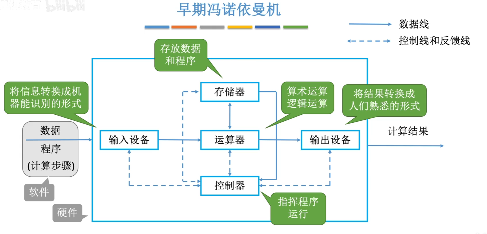

输入设备将信息转换成机器能识别的二进制形式，然后传输到运算器，运算器将数据和程序存储到存储器中，需要执行程序的时候，控制器解析程序的指令并通过控制信号控制其他部件执行指令。

冯诺依曼计算机的特点：

1. 计算机由五大部件组成：运算器，控制器，存储器，输入设备，输出设备
2. 指令和数据存储在存储器中，按地址访问
3. 指令和数据用二进制表示
4. 指令分操作码和地址码两部分
5. 以运算器为中心

有一个思想：对于任意一个功能，我们既可以用硬件实现，也可以用软件实现。用硬件实现是指通过设计逻辑电路来实现相应的功能。软件实现是指通过写代码实现相应的功能。

细想一下可知，硬件实现和软件实现的区别：硬件实现比软件实现更难，但是实现之后的运行效率高。

冯诺依曼结构的缺点：

运算器主要是用来进行算术运算和逻辑运算的，在冯诺依曼结构中还承担了将输入的数据和指令转运到存储器的任务。这会影响运算器的运算效率，而现代计算机结构对冯诺依曼结构进行了优化，改为了以存储器为中心

2. 现代计算机结构

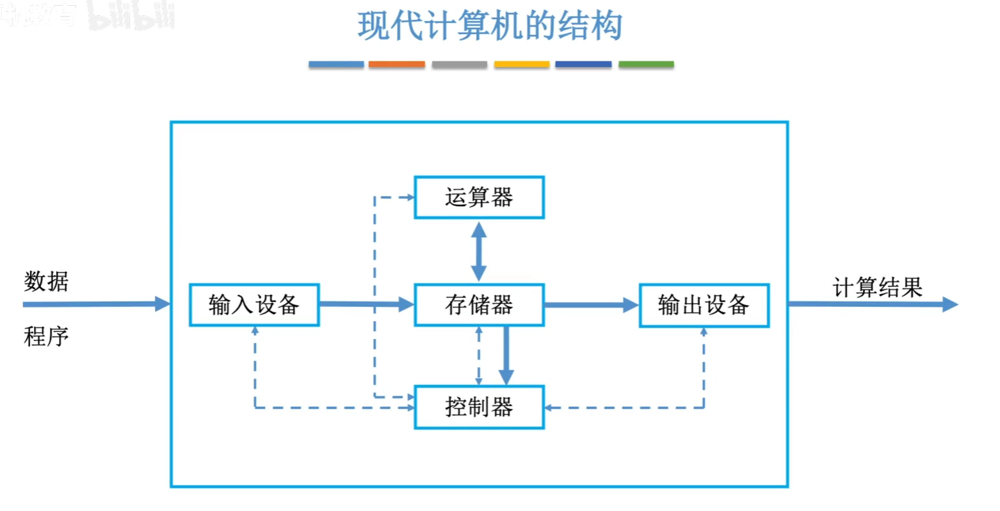

在大规模集成电路出现之后，将控制器和运算器集成在一个芯片中（这个芯片叫cpu），能极大的提高计算机的整体效率。

现代计算机的结构可以看成是下面这样

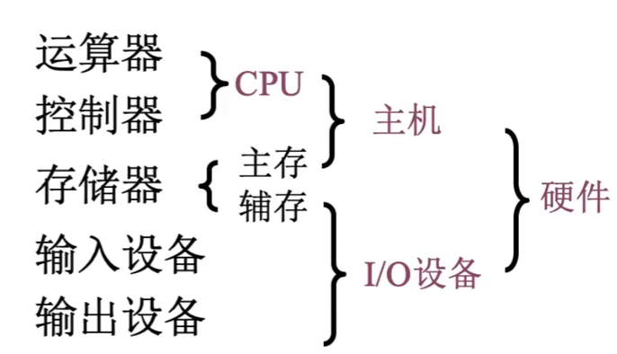

## 各个部件之间的协同合作

### 主存储器的基本组成

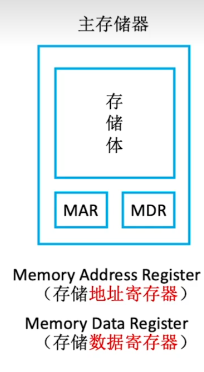

存储体的结构：

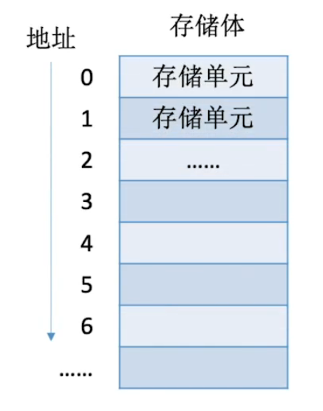

存储体相当于一个数组，每一个元素是一个存储单元，存储单元是一个8的整数倍个的bit位。每一个元素都有一个特定的地址，是按序排列的。

MAR是地址存储器，MDR是数据寄存器。

向存储器里写数据：

MAR存放想要将数据写入的地址，MDR存放想要存储的数据。根据MAR里存放的地址找到主存储器对应的存储单元，将数据存放到其中。

读取存储器里的数据：

MAR存放要想要读取的存储单元的地址，根据MAR找到主存储器对应的存储单元，并将存储单元里的数据取出来存放到MDR中。

MAR的位数决定了能访问到的主存储器的范围。比如MAR有8位，能访问主存储器的范围为00000000~11111111

换算成十六进制是0x00~0xFF

MDR的位数决定了存储单元的位数，因为MDR一次能存储一个存储单元的数据。

我们在学习清华大学王爽老师的《汇编语言》中，就是在8086pc机上学习的汇编语言。

8086计算机的存储字长是16位，存储字长就是存储单元的位数，存储字就是存储单元。可以知道8086计算机的主存储器的MDR是16位

### 运算器的组成

先说明一下什么是加数、被加数；减数，被减数；乘数，被乘数；除数，被除数

A+B----> 在A的基础上加上B，所以A是被加数，B是加数

A-B----->在A的基础上减去B，A是被减数，B是减数

A*B----->在A的基础上乘上B，A是被乘数，B是乘数

A/B----->在A的基础上除以B，A是被除数，B是除数

在下面的这个表格中，

在执行加法操作的时候，需要把`被加数`放到ACC寄存器中，把`加数`放到X寄存器中，然后这两个寄存器的内容作为输入，输入到ALU中执行加法，结果存放在ACC寄存器中。

在执行减法操作的时候，进行的操作如图所示（跟加法操作一样）

在执行乘法操作的时候，需要把`被乘数`放到X寄存器中，`乘数`放到MQ寄存器中，将这两个寄存器的内容作为输入，输入到ALU中执行乘法，积的位数是乘数的二倍，所以乘积的低位存放在MQ寄存器中，高位存放在ACC寄存器中。

这样就能看懂这个表格了。

ALU不止进行算术运算还会进行逻辑运算，但是这里没写，不知道会是什么样的。后面再说了。

### 控制器的组成

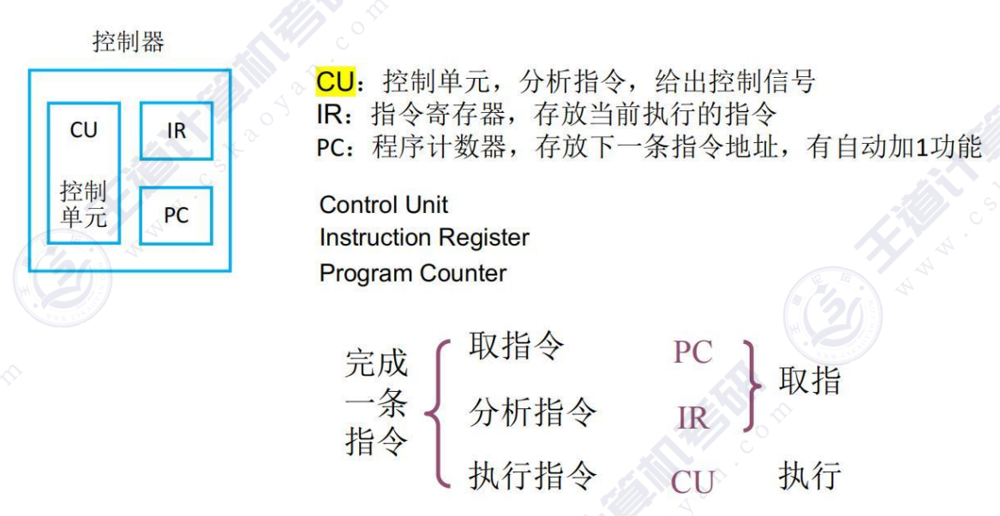

我们接下来通过学习计算机的工作过程来了解一下一条机器指令的大概实现过程。也就是控制器的运作过程。

### 计算机的工作过程

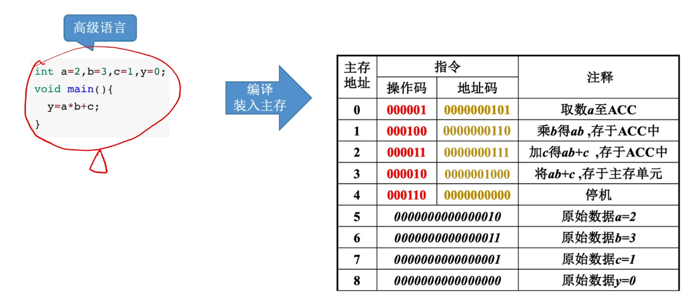

高级语言编写的程序经过翻译成机器语言，学过汇编很容易理解。

接下来看看这段程序的执行过程。

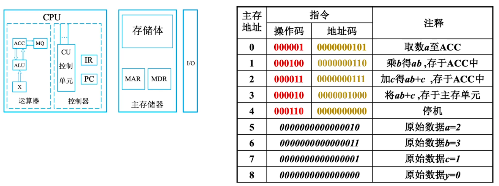

在汇编语言中，(寄存器)表示寄存器里的内容；(地址)表示主存储器该地址指向的内容

程序初始时，寄存器PC指向程序的第一条指令,即(PC) = 0

取指令：

1. (PC)->MAR,将指令地址传给MAR;控制器通过控制总线告诉主存储器进行读操作；(PC)++
2. 主存储器根据MAR的内容找到对应的存储单元，并将存储单元的内容放到MDR中。即M(MAR)->MDR,M表示memory主存储器，将主存储器的(MAR)这个地址的内容放到MDR中
3. (MDR)->IR,将指令放到IR中

分析指令：

4. 将IR的操作码部分输入给CU，CU分析指令的操作码，发出取数的控制信号。即OP(IR)->CU,OP表示operation操作码,OP(IR)表示IR的操作码部分

取数要进行的操作是这样的，将IR的操作数部分指向的内容给取出来放到ACC中

执行指令：

5. Ad(IR)->MAR，将IR的操作数部分放到MAR中
6. M(MAR)->MDR
7. (MDR)->ACC

这样就执行完了第一条机器指令。其他的机器指令也是按照这个过程，不再叙述。

## 计算机系统的层次结构

从程序员和硬件设计人员角度看，计算机的层次结构

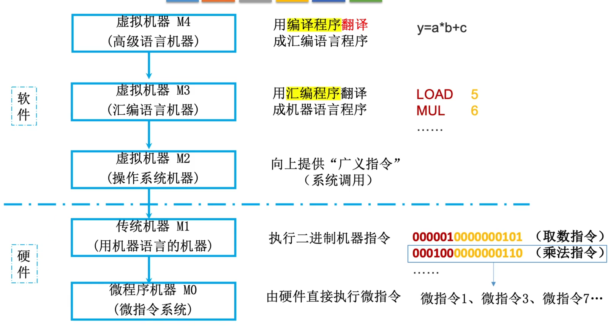

微指令就是执行机器语言的指令。上面提到的就是微指令。是由硬件直接执行的指令。这个具体要到硬件方面，比如设计cpu，各种硬件就知道了。

从编写和执行程序的角度看，每一层都为上一层提供了服务。越不依赖硬件。

## 计算机性能指标

‘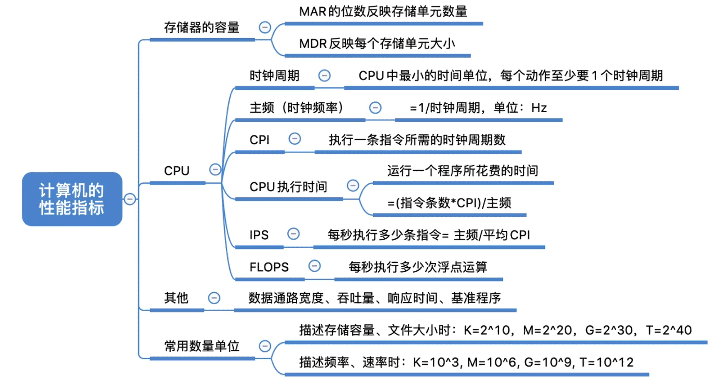

# 第二章 数据的表示和运算

## 学习计算机常用到的数制

### 二进制、十进制、八进制、十六进制

1. 任意数制的数转化为十进制

   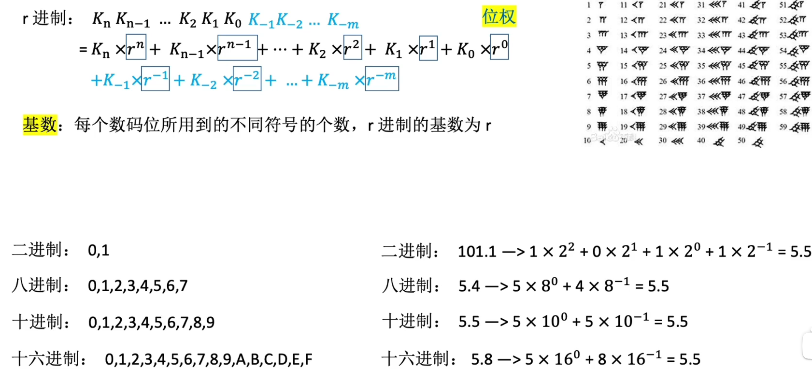

   

2. r进制的数相加减，跟十进制是一样的，逢r进1

3. 二进制转八进制、十六进制

   二进制转八进制，对于整数部分从低位每三个一组表示一个八进制位，对于小数部分从小数点开始每三个一组表示一个八进制位；二进制转十六进制，对于整数部分从低位开始每四个一组表示一个十六进制位，对于小数部分从小数点开始每四个一组表示一个十六进制位；**不足补零**；八进制、十六进制转二进制一样的

   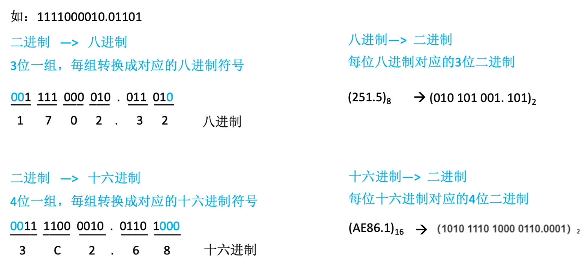

4. 各进制的常见书写方式

   1. 数字脚标

      $(001)_2=(1)_8=1_{10}=(1)_{16}$, 对于十进制也可以不写脚标

   2. 字母后缀

      001B=1O=1D=1H

   3. 十六进制的另一种常见表示,在十六进制数前加0x

5. 十进制转任意数制

   1. 原理法：

      分为两部分：整数部分和小数部分

      整数部分：

      小数部分：

      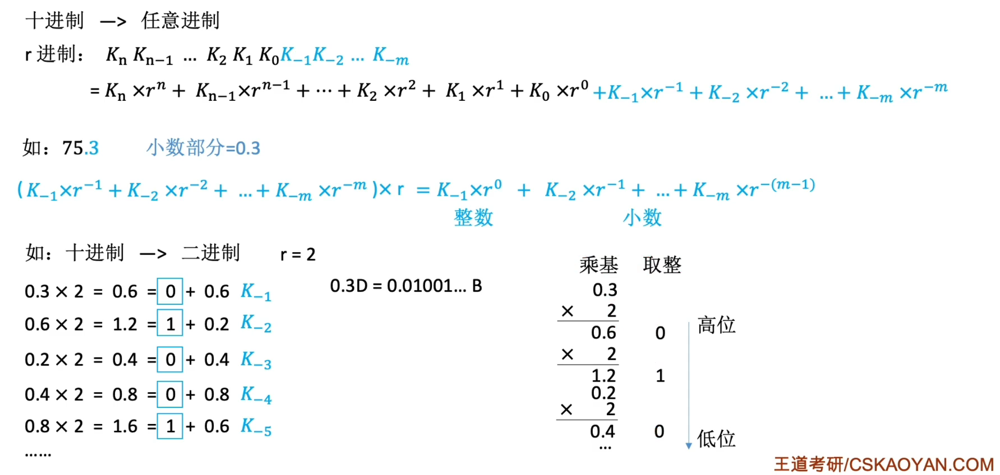

   2. 拼凑法

      适用于不大的数

      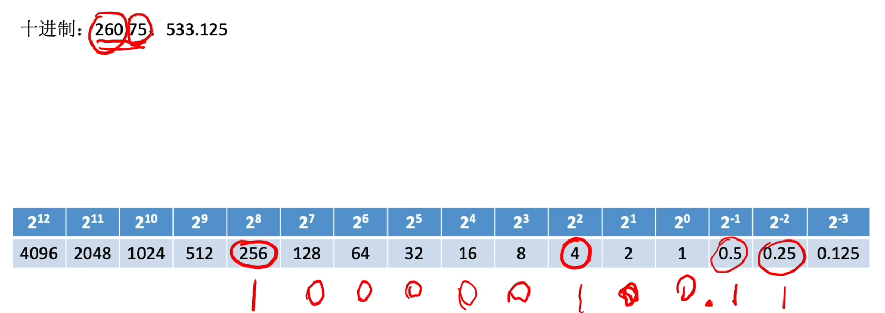

      

   

### BCD码

BCD码（Binary Code Decimal）

我们知道，在计算机中，只能用01两个数字。而现实生活中，我们常用的是十进制数，因此，必须解决的问题就是**十进制与二进制之间的转换**。如果使用传统的二进制与十进制之间的转换（除二取余，乘二取整），设计起来会非常复杂。

因此，为了方便且快捷的实现十进制与二进制之间的转换，设计了BCD码。

BCD码的特点是四位二进制表示一位十进制

先介绍第一种常见的BCD码

#### 8421码

BCD码是用四位二进制来表示一位十进制。8421码的特点是四位二进制权重从高到低为8421

那么8421码的四位二进制可以表示的数字从0000\~1111，我们只用8421码的0000\~1001就可以表示一位十进制数,剩余的6个8421码是多余的，即从1010~1111是多余的。

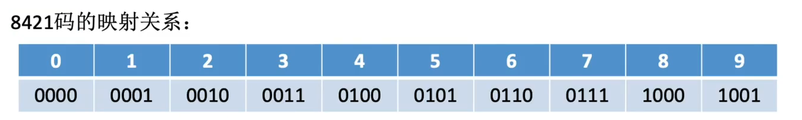

举例：985这个十进制数用8421码的表示：1001_1000_0101

8421码的加法规则

<video src="./计组.assets/20230629_101433000_iOS.mp4"></video>

#### 余3码

在8421码的基础上加上$3_{10}$

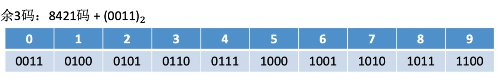

余3码是一种无权码，什么是无权码？先看什么是有权码，8421码是有权码，是因为四位二进制转化为十进制时从高到低每一位的权值分别是8421。而余3码只有上述图中的映射规则，每一位都没有固定的权值。

#### 2421码

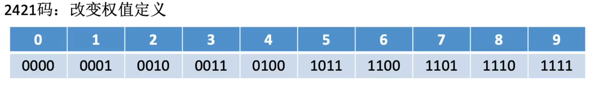

需要注意的是，2421码从[0,4]低位权值是2的为1；[5,9]是高位权值为2的为1

## 计算机中数的存储

### 无符号整数的存储与计算

#### 编码方式

我们以n位的无符号整数为例，
$$
无符号整数A在计算机中的表示是x_{n-1}x_{n-2}...x_0
\\
A = \sum_{i=0}^{i=n-1}x_i2^i
$$
这就是数学上的十进制对应的二进制

#### 表示的范围

n位二进制可以表示的无符号整数的范围是从全零到全1，对应的十进制是$[0,2^n-1]$

这里有一个二进制的运算关系：

对于$$x_{n-1}x_{n-2}...x_0$$,当它全1的时候再加上1就是$$2^n$$,所以它全1的时候就等于$$2^n-1$$

#### 截断

意思就是两个n位的无符号整数相加，结果可能会是n+1位，但是将结果赋值给了n位无符号整数的变量。这就会导致高位截断。

#### 无符号整数的加法和减法

无符号整数的相加就是正常的二进制加法。

无符号整数的减法：

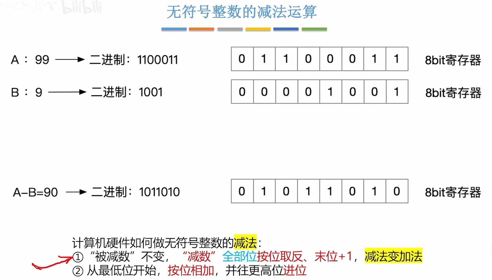

计算机这样做减法的原因是减法硬件比加法硬件设计起来更复杂，成本更高。

至于为什么要用上述操作实现减法，需要学习数论。如果不想学就硬记就好了。

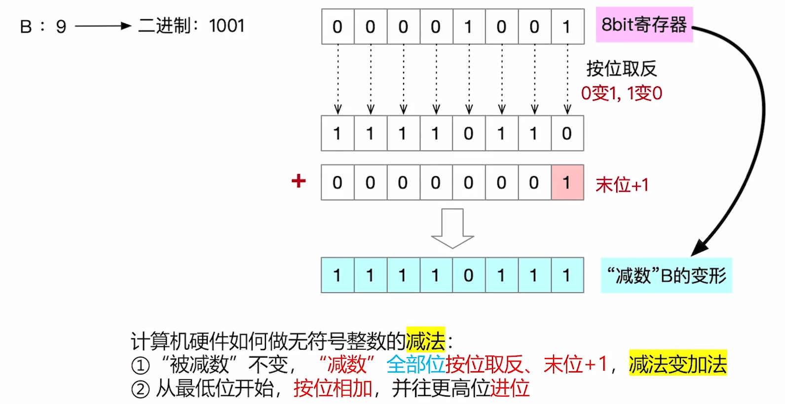

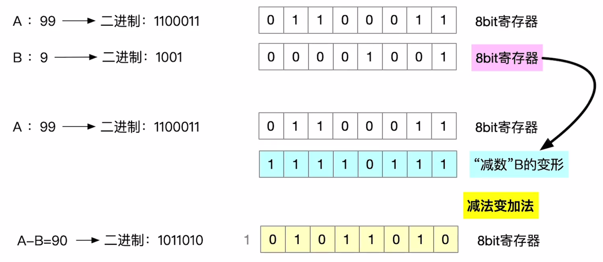

### 有符号整数的存储与计算

#### 原码

有符号整数在计算机中的原码表示：

以n位的有符号整数为例，最高位表示符号位，符号位为0表示正数，符号位为1表示负数。其余位表示数值位
$$
有符号整数A在计算机中的表示是x_{n-1}x_{n-2}...x_0
\\
A = (-1)^{x_{n-1}}\sum_{i=0}^{i=n-2}x_i2^i
$$
由公式可以看出，带符号整数A的数值$|A|$对应$x_{n-2}...x_0$，带符号整数A的符号用最高位$x_{n-1}$表示

n位有符号整数的表示范围：

最高位符号位为0时，对应有符号整数的正数范围$[0,2^{n-1}-1]$

最高位符号位为1时，对应有符号整数的负数范围$[-2^{n-1}+1,-0]$

注意，真值0有两种原码表示，一个是正0，一个是负0

原码的缺点：

原码的加减法运算很复杂，需要设计复杂的硬件电路才能实现原码的加减法。因此，科学家设计了补码。使用补码来表示有符号数既不会出现真值0的两种表示，也可以简单实现加减法运算。

因此，现代计算机都是用补码来表示有符号整数。

原码的用途：

现在不知道有什么用了，可能在补码还没出现之间，计算机里有符号数是用原码表示的。

#### 补码

有符号整数在计算机中的补码表示：

以n位的有符号整数为例，最高位表示符号位，符号位为0表示正数，符号位为1表示负数。所有位表示数值位
$$
有符号数A在计算机中的补码表示是x_{n-1}x_{n-2}...x_0
\\
A=-x_{n-1}2^{n-1}+\sum_{i=0}^{i=n-2}x_i2^{i}
$$
可以看到最高位不仅是符号位，而且参与计算。

当最高位为0时，等号右边第一项为0。A为整数，且值由$x_{n-2}...x_0$决定，这个跟补码一样了。

当最高位为1时，等号右边第一项为$-2^{n-1}$，后面就算全为1，也没有这个大，即最高位就是符号位。

n为无符号整数的补码表示的范围

当最高位为0，后面全为0时是正数的最小值0，后面全为1时是正数的最大值$2^{n-1}-1$,即$[0,2^{n-1}-1]$

当最高位为1时，后面全为0时是最小值$-2^{n-1}$,后面全为1时是最大值$-2^{n-1}+2^{n-1}-1=-1$,即$[-2^{n-1},-1]$

整个范围是$[-2^{n-1},2^{n-1}-1]$

只要记住理解上面的公式就行了，记住最小值是最高位为1其余位全0的情况，逐渐+1会逐渐变小，直到最高位为0，再继续+1，继续变大直到最大值。

补码的加减法

补码的加法：对于$[A]_{补}+[B]_{补}$或者$[A]_{补}+[-B]_{补}$跟普通的二进制相加一样没区别。

补码的减法: 对于$[A]_{补}-[B]_{补}$,需要将其转化为$[A]_{补}+[-B]_{补}$，这样做就是减法电路成本高，为了省钱。

如何转化呢？换句话说，如何将$-[B]_{补}$转化为$[-B]_{补}$ ,换句话说，对于有符号整数B的补码表示$[B]_{补}$和B的相反数的补码表示$[-B]_{补}$之间的关系是什么？

即$[-B]_{补}+[B]_{补}=0$

比如5的8位补码表示: $[5]_{补}=00000101$,这个数加上一个数的结果全为0，这个数就是$11111011$,根据补码的公式算一算对应的十进制数是$-2^7+2^6+2^5+2^4+2^3+2^1+2^0=-128+64+32+16+8+2+1=-5$

 总结：对于有符号整数B的补码表示$[B]_{补}$和B的相反数的补码表示$[-B]_{补}$之间的关系是所有位取反+1

总结：对于有符号整数的减法，是跟无符号整数的减法一模一样的👇。

#### 反码

反码也是一种有符号整数在计算机中的表示方法，但具体这个反码有什么意义，什么用途，我不了解一点，感觉反码没什么用。在这里也不说明十进制有符号整数与反码的编码公式了。就说一点，正数的原码就是正数的反码，负数的原码符号位不变，数值位取反就是反码。

### 定点小数的存储与运算

我们可以把之间学习的有符号整数称为定点整数。

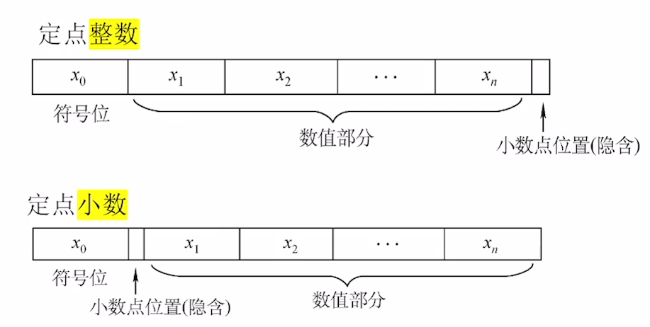

定点小数的表示方法也分为原码、反码、补码

这跟定点整数是一模一样的。

把有符号整数取名为定点整数的原因，可能就是定点小数跟有符号整数的表示是非常一样的，而有符号整数可以看成小数点在最后，这样就比较统一。

### 定点小数和定点整数的区别

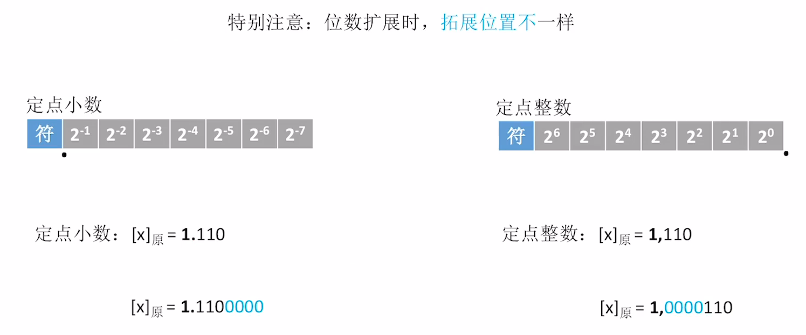

定点小数不知道有啥用。

### 奇偶校验码

#### 原理

在计算机中，可能会由于硬件的原因导致存储在计算机中的二进制位发生改变，为了保证数据从一个硬件传输到另一个硬件的时候不会出错，使用奇偶校验的方法**发现**错误。

举个例子，在取指阶段，控制器的PC将指令地址传输给主存储器的MAR，这个过程可能会由于一些物理硬件的原因导致发送出去的指令地址和MAR接收的指令地址不同，为了确保能够正确接收，发明了奇偶校验的方法。

这种方法的思想是在要传输的信息的基础上加一个校验位。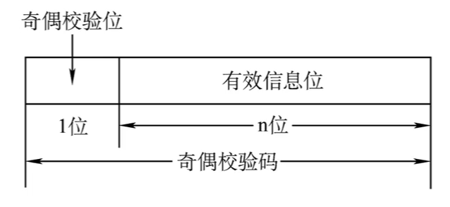

有两种校验策略，分别是奇校验和偶校验。

如果采用奇校验，

在发送端，根据有效信息位中1的个数来决定校验位的值，确保奇偶校验码中1的个数为奇数。即如果有效信息位中1的个数为奇数，则添加的校验位为0，确保奇偶校验码中1的个数为奇数。；如果有效信息位中1的个数为偶数，则添加的校验位为1。

在接收端，根据奇偶校验码中1的个数是否为奇数来判断在传输过程中是否出错。如果为奇数，则认为没有出错，如果为偶数则出错。

> 奇偶校验的局限性：如果在传输过程中发生了两个bit位的跳变，在接收的过程中是识别不出来的，会认为这是正确的而被接收。

偶校验，确保奇偶校验码中1的个数为偶数。

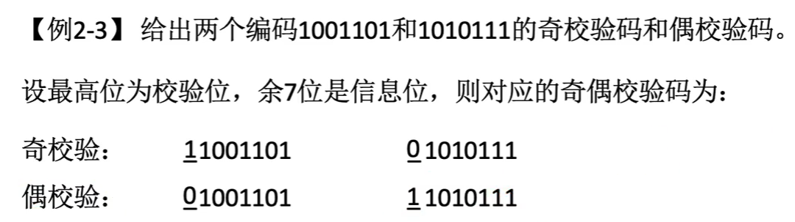

#### 硬件实现

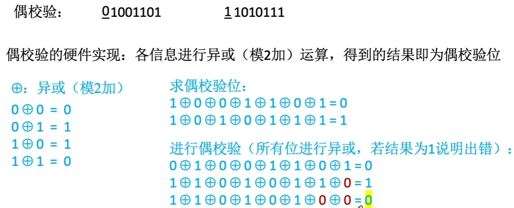

在发送端计算校验位，采用的硬件实现是将所有的信息位进行异或，得到的结果就是偶校验位。

其实也很好理解，异或运算中，两个1就抵消，一个1和一个0异或，就把1留下来。最后结果为1说明1没抵消完，那说明肯定就是奇数个1了。把结果作为偶校验位就可以了。

异或运算被称为模2加，这个异或运算，跟两个单独一个二进制位相加一样，也就是模2加了。

在接收端判断奇偶校验位中1的个数，如果所有位异或结果为0，说明1和1都相互抵消了，也就是1的个数是偶数，则认为是正确的。（对应图中第一个式子）

看图中第二个式子，最后一个1跳变成了0，导致运算结果为1，说明，发生了错误。

看图中第三个式子，最后两个1跳变成了0，运算结果还是为0，此时，会认为没有发生错误。这就是奇偶验证的局限性。

通过逻辑门电路的组合，可以实现奇偶校验码的硬件实现。这种实现方式在早期的计算机和通信系统中被广泛使用。然而，随着集成电路的发展，现代计算机和通信系统通常采用更高级和更复杂的错误检测和纠正机制，如循环冗余校验（CRC）和海明码（Hamming Code）。

## 算术逻辑单元

算术逻辑单元ALU，主要进行算术运算和逻辑运算，还有移位等操作。

这一节学习ALU的硬件构造

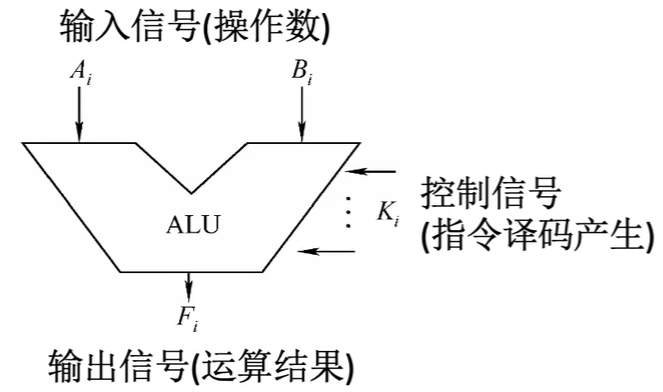

ALU的一般构造是这样的，有两个输入A和B经过算术或逻辑运算得到结果F，还有一些控制信号作为输入，来控制到底进行哪一种运算。

接下来看一个具体的ALU :   74181

先来理解位切片(bit slicing)的概念

> The 74181 is a 4-bit slice arithmetic logic unit (ALU)
>

位切片（bit slicing）是计算机编程和数字电路设计中的一种技术，用于从二进制数或数据结构中操作或提取特定位。它涉及将二进制值分解为单独的位，并对它们进行独立操作。

each bit position in a binary number is treated as a separate "slice."这样可以高效且并行地处理每个位，这在各种应用中非常有用，例如密码学、图像处理、信号处理和数据压缩。这种并行处理方法可以显著加快某些计算的速度，并实现对大量数据的高效处理。

总的来说，位切片提供了一种灵活且高效的方法来处理二进制数或数据结构中的单个位，实现对二进制数据的位级精细控制和操作。

在74181中，输入A和B来自一个四位的寄存器，经过bit slicing，将每一个单独的二进制位进行切割并作为ALU的输入。

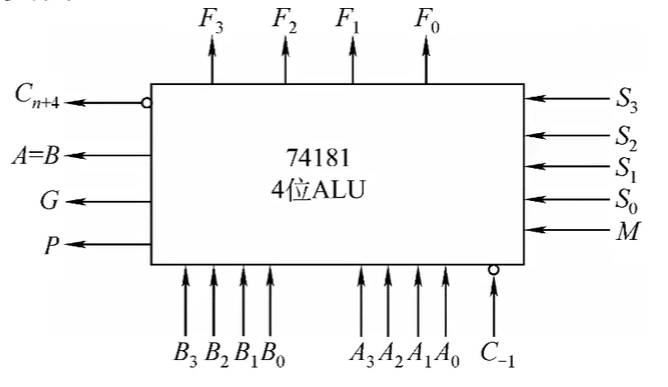

图中有22个针脚，实际硬件有24个针脚，这里少画了接地的阵脚GNU和供电的阵脚$V_{CC}$

根据箭头的指向可知哪些阵脚作为输入，哪些阵脚作为输出。现在无需知道各个阵脚的功能，只需知道bit slice的概念，以及一般ALU的结构是两个输入A,B进行运算，还有控制信号控制ALU执行具体什么运算。

接下来，我们学习数电的相关内容，这部分是硬件设计的基础。

## 数电

在网络上总会听到计算机专业的学生说数电、模电难学，那么数电、模电是什么呢？

### 数电模电区别

我们知道概率论中由连续量和离散量。连续量的取值是一个区间，离散量的取值是零零散散的几个值。

我们初高中学习的电路中流通的电流是连续量，因此那种电路就是模拟电路，至于为什么叫模拟电路不叫连续电路，管他呢，记住就行了。

在现代的计算机中，有这样两种电路，模/数转换电路(A/D)和数/模转换电路(D/A)，

A/D将模拟信号转换为数字信号，D/A将数字信号转换为模拟信号。

A/D里根据输入的电压输出电平，举个具体的例子，

> 在TTL（转istor-Transistor Logic）电路中，通常将0-0.8V定义为低电平，2-5V定义为高电平。而在CMOS（Complementary Metal-Oxide-Semiconductor）电路中，通常将0-0.3V定义为低电平，0.7VDD（供电电压）-VDD定义为高电平。

将模拟信号转化为高电平和低电平之后，电路中就剩下这两种信号了，也就是说，模拟电路中的电流可以是任意值，而数字电路中就只有高电平和低电平了。

这就是数字电路和模拟电路的区别。

我们要学习的就是数字电路，数字电路里只有高电平和低电平，我们可以把高电平看成0，低电平看成1；也可以把低电平看成0，高电平看成1。不管那种方式都是等效的，这里为了简单，把低电平看成0，高电平看成1.

数字电路又称为逻辑电路，是因为在数字电路中，执行与或非三种基本的逻辑运算。

### 逻辑代数

从数学的角度看，

#### 基本组成和简单使用

逻辑代数的基本组成包含逻辑变量，常量1，常量0，与或非三种运算

与运算用`·`表示，或运算用`+`，非A表示为$\overline A$

##### 基本公理

公理1 交换律

对于任意逻辑变量A,B，有
$$
A+B=B+A,A·B=B·A
$$
公理2 结合律

对于任意的逻辑变量A、B、C，有
$$
(A+B)+C=A+(B+C)\\
(A·B)·C=A·(B·C)
$$

公理3 分配律

对于任意的逻辑变量A、B、C，有
$$
A+(BC)=(A+B)(A+C)\\
A(B+C)=AB+AC
$$
注意，这跟我们初高中学习的不一样。我们初高中学的是代数，这里是逻辑。

公理4 0-1律

对于任意逻辑变量A,有
$$
A+0=A,A·1=A
\\
A+1=1,A·0=0
$$
总结来说就是，与运算就是且的意思，全1才1，有假即假

或运算就是或的意思，有1即1，全假才假

公理5 互补律

对于任意逻辑变量A，存在唯一变量的$\overline A$，使得
$$
A+\overline A=1,A·\overline A=0
$$

##### 基本定理

根据公理，可以推导出逻辑代数的基本定理。

1. 重叠律

$$
A+A=A,A·A=A
$$

证明:
$$
\begin{align}
A+A &= (A+A)·1\\
&= (A+A)·(A+\overline A)\\
&= A+(A·\overline A)\\
&= A+0\\
&= A\\
\end{align}
$$

2. 吸收律

$$
A+A·B=A,A·(A+B)=A
$$

证明：
$$
\begin{align}
A+A·B &= A·1+A·B \\
&=A·(1+B)  \\
&=A·1 \\
&=A \\
\end{align}
$$

3. 消除律

$$
A+\overline A·B = A+B,A·(\overline A+B)=A·B
$$

证明:
$$
\begin{align}
A+\overline A·B &= (A+\overline A)·(A+B) \\
&= 1·(A+B) \\
&= A+B
\end{align}
$$

4. 对合律

$$
\overline {\overline A} = A
$$

5. 互补律

$$
\overline {(A+B)} = \overline A·\overline B,\overline{A·B}=\overline A+\overline B
$$

证明:

由于
$$
\begin{align}
(\overline A· \overline B)+(A+B)&=(\overline A·\overline B+A)+B \\
&= (\overline B+A)+B \\
&= A+(\overline B+B) \\
&= A+1 \\
&= 1 \\
\end{align}
$$
而且
$$
\begin{align}
(\overline A·\overline B)·(A+B)&=\overline A·\overline B·A+\overline A·\overline B·B \\
&= 0+0 \\
&=0
\end{align}
$$
所以
$$
令A=(\overline A·\overline B)，B=(A+B)，\\则
\overline A+\overline B = \overline{(\overline A·\overline B)}
$$

6. 并项律

$$
A·B+A·\overline B=A,(A+B)·(A+\overline B)=A
$$

7. 包含律

$$
A·B+\overline A·C+B·C=A·B+\overline A·C
$$

##### 重要规则

1. 代入规则

**任何一个含有变量A的逻辑等式，如果将所有出现A的位置都代之以同一个逻辑函数，则等式仍然成立。**

例如，给定逻辑等式$A(B+C)=AB+AC$，若等式中C都用$(C+D)$代替，则该等式仍然成立
$$
A[B+(C+D)]=AB+A(C+D)
$$
好好思考这个规则,代入规则的正确性，是因为任何逻辑函数都和逻辑变量一样，只有01两种可能。

2. 反演规则

将逻辑表达式中的`·` 变成 `+`, `+`变成 `·`,变量取反，常量取反（即0变1，1变0），并保持运算顺序不变，得到的新的逻辑表达式是原逻辑表达式取非。

其实就是定理中的互补律。

3. 对偶规则

将逻辑表达式中的 `·`变 `+`，`+`变 `·`,常量取反，并保持运算顺序不变，得到的新的逻辑表达式称为原逻辑表达式的对偶式。

有些逻辑表达式的对偶式就是本身，这时称该逻辑表达式为对偶函数。

根据对偶规则，如果已经证明两个逻辑表达式相等，便可知它们的对偶式也相等。

利用对偶规则可以使定理、公式的证明减少一半。

**在这一节中，要多刷题，多写证明题，从而可以对该节内容有更深的理解。**

#### 逻辑函数

在初高中学的数学中，基本组成有变量，全体数字，基本运算。同样逻辑代数中，也有对应的数字01和基本运算与或非。更进一步，初高中学的数学中还有函数，逻辑代数中同样有逻辑函数。

通过设计复杂的逻辑函数实现特定的功能，再用具体的电路实现该逻辑函数，是硬件设计的一般流程。

#### 逻辑门

先来看元件，最基础的逻辑运算对应的电路结构。

我们将实现与、或、非三种逻辑运算的逻辑电路称为与门、或门、非门。

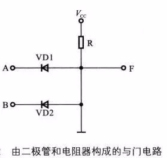

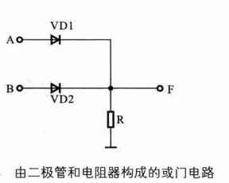

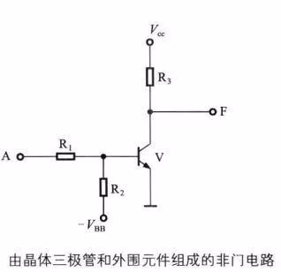

对于三种逻辑门的硬件实现，不是我们计科人关注的内容，我们只需关注逻辑门的抽象表示

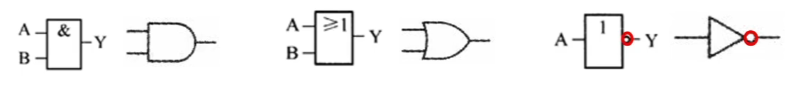

从左到右分别是与或非，每种个逻辑门都有两种表示

对于逻辑函数AC+AD，其逻辑电路图可以表示如下

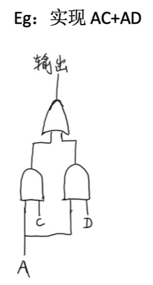

上述并不是最简的电路图，我们可以对逻辑表达式进行化简，从而可以根据逻辑表达式设计出更省钱的逻辑电路图

AC+AD=A(C+D)

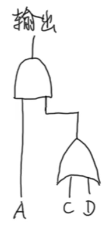

如何对逻辑表达式进行化简，最简逻辑表达式的标准是什么我们后面再说。

#### 复合逻辑

尽管由与或非三种基本的逻辑可以实现各种复杂的逻辑功能，但在实际应用种更广泛采用的使与非门、或非门、与或非门、异或门、同或门等逻辑功能更强，性能更优越的逻辑门

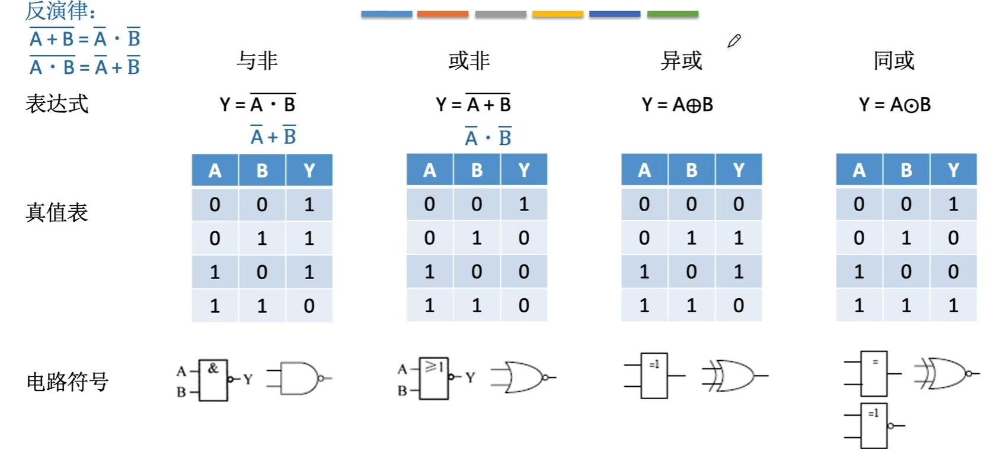

与非门$\overline {A·B}=\overline A+\overline B$，硬件实现可以用两个非门相或。

或非门硬件实现可以用两个非门相与。

异或门$A \oplus B=\overline A B+B \overline A$,硬件实现如下图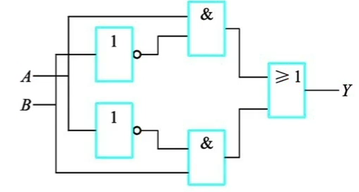

同或门就是异或门取反，看电路符号也能看出来。

 

