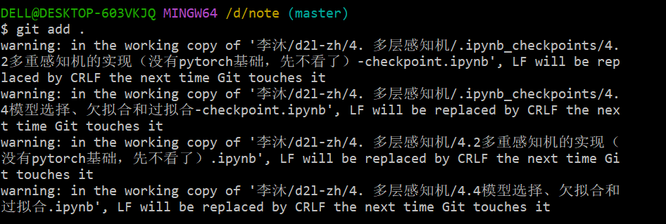

LF&CRLF

[CRLF和LF的差异 - 知乎 (zhihu.com)](https://zhuanlan.zhihu.com/p/380574688)

在 `git add .`时出现了这样的 `warning`

windows下的点一下回车是\r\n

unix系统下的回车一下是\n

\r表示将光标移至当前行的行首

\n表示将光标移至下一行（不是移到下一行的行首）

[C++中回车换行（\n\r）和换行(\r)的区别_linux里的c++换行-CSDN博客](https://blog.csdn.net/xiaofei2010/article/details/8458605)

[\r,\n,\r\n的区别 - 小 天 - 博客园 (cnblogs.com)](https://www.cnblogs.com/xiaotiannet/p/3510586.html)