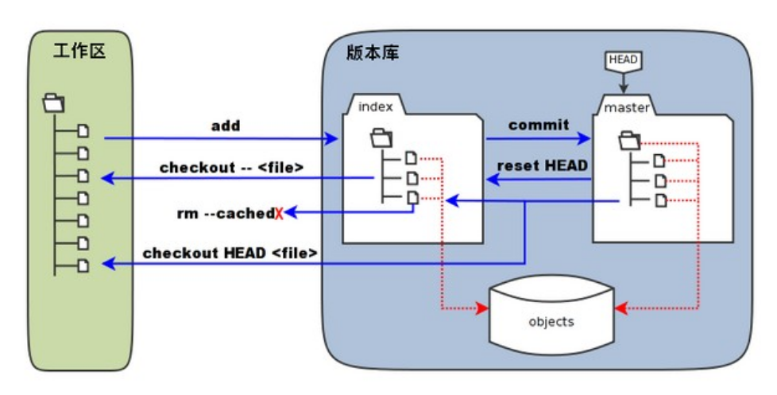
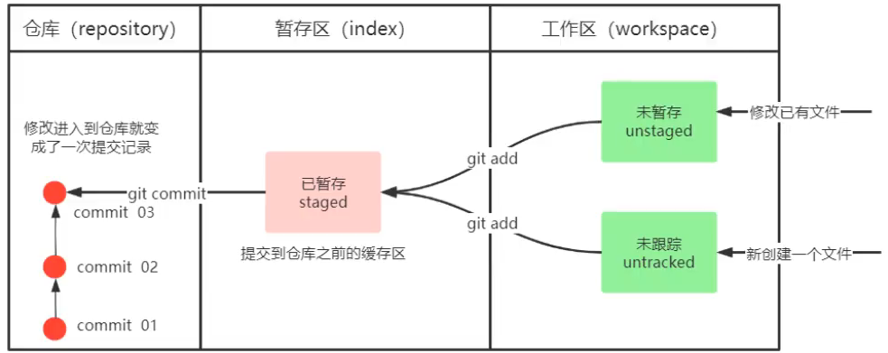

# VCS

version control system

版本控制是用来记录一个或若干文件内容的变化，以便将来查阅特定版本修订情况。

一般来说，我们对保存着软件源代码的文件作版本控制，但实际上，你可以对任何类型的文件进行版本控制。

有了VCS你就可以将选定的文件回溯到之前的状态，甚至将整个项目都回退到过去某个时间点的状态，你可以比较文件的变化细节，查出最后是谁修改了哪个地方，从而找出导致怪异问题出现的原因，又是谁在何时报告了某个功能缺陷等等。 使用版本控制系统通常还意味着，就算你乱来一气把整个项目中的文件改的改删的删，你也照样可以轻松恢复到原先的样子。


第一代版本控制---**本地版本控制系统**

许多人习惯用复制整个项目目录的方式来保存不同的版本，或许还会改名加上备份时间以示区别。 这么做唯一的好处就是简单，但是特别容易犯错。 有时候会混淆所在的工作目录，一不小心会写错文件或者覆盖意想外的文件。

为了解决这个问题，人们很久以前就开发了许多种本地版本控制系统，大多都是采用某种简单的数据库来记录文件的历次更新差异。

其中最流行的一种叫做 RCS，其工作原理是在硬盘上保存补丁集（补丁是指文件修订前后的变化），通过补丁，可以知晓各个版本的文件内容


第二代版本控制---**集中化的版本控制系统**

集中化的版本控制系统（Centralized Version Control Systems，简称 CVCS）

让在不同系统上的开发者协同工作，这类系统，诸如 CVS、Subversion 以及 Perforce等，都有一个单一的集中管理的服务器，保存所有文件的修订版本，而协同工作的人们都通过客户端连到这台服务器，从服务器取出最新的文件提交更新。 多年以来，这已成为版本控制系统的标准做法。

现在，每个人都可以在一定程度上看到项目中的其他人正在做些什么。 而管理员也可以轻松掌控每个开发者的权限，并且管理一个 CVCS 要远比在各个客户端上维护本地数据库来得轻松容易。

缺点是中央服务器的单点故障。 如果宕机一小时，那么在这一小时内，谁都无法提交更新，也就无法协同工作。 如果中心数据库所在的磁盘发生损坏，又没有做恰当备份，毫无疑问你将丢失所有数据——包括项目的整个变更历史，只剩下人们在各自机器上保留的单独快照。 本地版本控制系统也存在类似问题，只要整个项目的历史记录被保存在单一位置，就有丢失所有历史更新记录的风险。

第三代版本控制---**分布式版本控制系统**

分布式版本控制系统（Distributed Version Control System，简称 DVCS）

在这类系统中，像 Git、Mercurial、Bazaar 以及 Darcs 等，

1. **客户端而是把代码仓库完整地下载下来，包括完整的历史记录。**这么一来，任何一处协同工作用的服务器发生故障，事后都可以用任何一个镜像出来的本地仓库恢复。 因为每一次的克隆操作，实际上都是一次对代码仓库的完整备份。

2. 更进一步，许多这类系统都可以指定和若干不同的远端代码仓库进行交互。籍此，你就可以在同一个项目中，分别和不同工作小组的人相互协作。 你可以根据需要设定不同的协作流程，比如层次模型式的工作流，而这在以前的集中式系统中是无法实现的。


# git

## git的配置文件

一台电脑可以有多个用户使用，一个用户可以定义多个git仓库。

Linux系统中git的配置文件：

- `/etc/gitconfig` 文件：系统中对所有用户都适用的配置。若使用 `git config` 时用 `--system` 选项，读写的就是这个文件。
- `~/.gitconfig` 文件：用户目录下的配置文件只适用于该用户。若使用 `git config` 时用 `--global` 选项，读写的就是这个文件。
- 当前Git仓库的目录中的配置文件（ `.git/config` 文件）：这里的配置仅仅针对当前项目有效。每一个级别的配置都会覆盖上层的相同配置。

在 Windows 系统中git的配置文件：

- git安装目录下 `/etc/gitconfig` 是系统配置文件

  如果不知道git的安装目录，可以打开git bash，输入命令  where git 就可以了

- 当前用户目录下的 `.gitconfig` 是用户配置文件

- 当前git仓库目录下 `.git/config` 是仓库配置文件

在linux里我没找这几个文件，Windows里找到了。总结就一句话：就看当前仓库`.git/config`配置文件就行了。没人用你的电脑。

## 用户信息

配置个人的用户名称和电子邮件地址：

```
git config --global user.name "sxc"
git config --global user.email 1606855943@qq.com
```

如果用了 **--global** 选项，那么更改的配置文件就是位于你用户目录下的那个，以后你所有的项目都会默认使用这里配置的用户信息。

如果要在某个特定的项目中使用其他名字或者电邮，只要去掉 --global 选项重新配置即可，新的设定保存在当前项目的 .git/config 文件里。


总结：这个是必须配置的，在提交代码的时候可以找到人。配置成global就行。

查看配置信息

```
git config --list
```

git默认使用的编辑器是vim

```bash
vim /etc/gitconfig    # 查看系统配置文件
vim ~/.gitconfig      # 查看用户配置文件
vim .git/config       # 查看仓库配置文件
```

感觉下面的更清晰一点。

## 基础使用

创建本地仓库：

首先创建一个空文件夹，然后在当前文件夹下右键打开git bash，输入初始化仓库命令。

```
git init
```

在初始化仓库之后，会在当前文件夹下生成一个隐藏文件夹`.git`

然后我们就可以在  **当前文件夹下，`.git`文件以外的位置**(工作区)存放我们的项目代码了。

对当前项目中文件进行修改以后：

```bash 
git add .  # 将工作区内容添加到暂存区
git commit -m "本次提交内容"  # 将暂存区内容提交到本地仓库
```

每一次commit都会被记录下来

```bash
git log
```

通过学习这个[Learn Git Branching](https://learngitbranching.js.org/?locale=zh_CN)了解分支树，实现版本切换与多人协作(branch)。



- **暂存区：**英文叫 stage 或 index。一般存放在 **.git** 目录下的 index 文件（.git/index）中，所以我们把暂存区有时也叫作索引（index）。
- **版本库：**工作区有一个隐藏目录 **.git**，这个不算工作区，而是 Git 的版本库。



文件的四种状态

```bash
git status  # 查看仓库当前的状态，显示有变更的文件以及文件状态。
```

文件有四种状态：**已提交（committed）**、**已修改（modified）** 、**已暂存（staged）**和**未跟踪(untracked)**

- 已修改表示修改了文件，但还没保存到数据库中。
- 已暂存表示对一个已修改文件的当前版本做了标记，使之包含在下次提交的快照中。
- 已提交表示提交快照，即数据已经安全地保存在本地数据库中。
- 未追踪表示文件还不是项目的一部分

> 忽略文件


> 代码托管平台

代码托管平台，就是托管代码的服务器。可以将自己的项目放到代码托管平台上，也可以在该平台上下载其他人的项目，也可用于多人协作，将代码更新到平台上的项目上，来开发项目，也可以防止因为自己机器的原因导致整个项目丢失，即远程仓库。

github

gitee

gitlab  --搭建代码托管平台用的


本地仓库和github仓库关联

[【git】- 将本地项目关联到github远程仓库 - 知乎 (zhihu.com)](https://zhuanlan.zhihu.com/p/88246764)

C:\Users\DELL\.ssh

在该目录下，打开git bash

输入命令  ssh-keygen -t -rsa 

这条命令是生成ssh密钥，生成的两个文件中.pub后缀的是公钥，另一个是密钥，不能公开。

把公钥的内容复制到自己的github上.

```
$ ssh -T git@github.com     //验证是否可以通过ssh连接到github
```


表示本地主机成功连接到github。


如果是上面这样的话

```
cd ~/.ssh
vim config
```

编辑以下内容

```
Host github.com
User git
Hostname ssh.github.com
PreferredAuthentications publickey
IdentityFile ~/.ssh/id_rsa
Port 443

Host gitlab.com
Hostname altssh.gitlab.com
User git
Port 443
PreferredAuthentications publickey
IdentityFile ~/.ssh/id_rsa
```

再次回到项目目录检查是否成功

```
ssh -T git@github.com
```

接下来将本地仓库和github仓库进行连接。

先在本地创建仓库，然后在github上创建空仓库(必须是空的)

然后将github上仓库的ssh链接复制下来

然后输入

```
git remote add origin git@github.com:123456789sxc/note.git
```

remote可以看做是一个人的电脑，假设有十个人合作，那么就有10个remote对象。为了方便大家同步，我们创建一个叫做origin的remote，大家都和这个origin同步，那么大家就可以达成一致了。因此这条命令指的是把远程仓库作为项目服务器，所有人的项目都会更新到这个仓库。

```
`$ git push -u origin master`
```

上面命令将本地的master分支推送到origin主机，同时指定origin为默认主机，后面就可以不加任何参数使用git push了。

即，上面的步骤完成后，在以后的git使用中，过程如下

1. 更新文件
2. git add .
3. git commit -m " "
4. git push


这样就可以成功提交到远程仓库了。

一些命令

```
git remote  //列出已经存在的远程分支，origin是主分支
git remote -v  //列出已经存在的远程分支，以及对应的URL
```

```
git branch //列出本地分支，master是本地主分支，分支前的*号表示当前分支
git branch branchname  //建立一个名为branchname的分支
git checkout branchname   //让名为branchname的分支作为当前分支
```


上图中只有一个分支master，且当前分支master

```
git branch -d branchname  //删除名为branchname的分支,使用前提：该分支不能是当前分支
```

合并分支

```
git merge branchname  //将名为branchname的分支合并到主分支，合并完之后需要自己删除该分支
```


图中蓝色部分表示当前分支


## 合并冲突

[10_解决冲突_哔哩哔哩_bilibili](https://www.bilibili.com/video/BV1MU4y1Y7h5?p=10&vd_source=5a374f315281b0338a0b7fd69b8b8e98)

## 打标签

## 别名

## 撤销操作

[Git - Book (git-scm.com)](https://git-scm.com/book/zh/v2)

你执行的 Git 操作，几乎只往 Git 数据库中 **添加** 数据。 你很难使用 Git 从数据库中删除数据，也就是说 Git 几乎不会执行任何可能导致文件不可恢复的操作。 同别的 VCS 一样，未提交更新时有可能丢失或弄乱修改的内容。但是一旦你提交快照到 Git 中， 就难以再丢失数据，特别是如果你定期的推送数据库到其它仓库的话。

这使得我们使用 Git 成为一个安心愉悦的过程，因为我们深知可以尽情做各种尝试，而没有把事情弄糟的危险。 更深度探讨 Git 如何保存数据及恢复丢失数据的话题，请参考[撤消操作](https://www.git-scm.com/book/zh/v2/ch00/_undoing)。


==不要在master主分支上进行工作，一般是在其他分支上进行工作然后合并到主分支==


## git 警告

github要求上传的单个文件最大不能超过100M，会报错。另外超过50M会警告。50M没啥问题，还能用，过了100M可能就有问题了，注意点。要是真不小心传了一个100M多的文件再找解决办法吧。


建仓库的时候，尽量把文件名全改成英文的，因为有些时候使用古早系统，不支持中文路径，弄得我必须把中文路径改成英文的， 这样可能就会导致某些图片显示不出来，然后就要再去改图片的路径很麻烦。


今天遇到一个问题，就是我添加了大文件比如超过50MB或100MB的文件上去。导致下次git push的时候失败了。

因此，以后不要添加大文件上去。一般来说，github的repository存放一个项目的话，单个文件也不会超过50MB。


