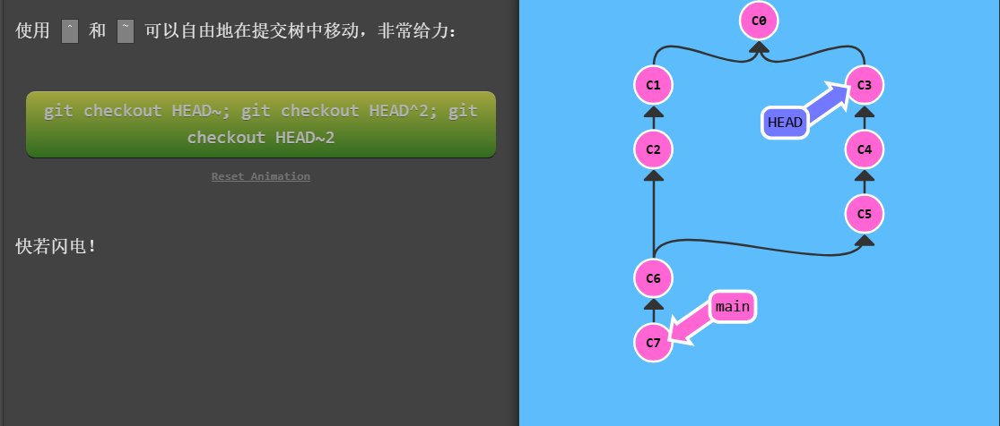
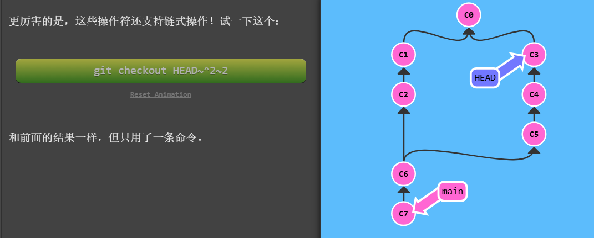
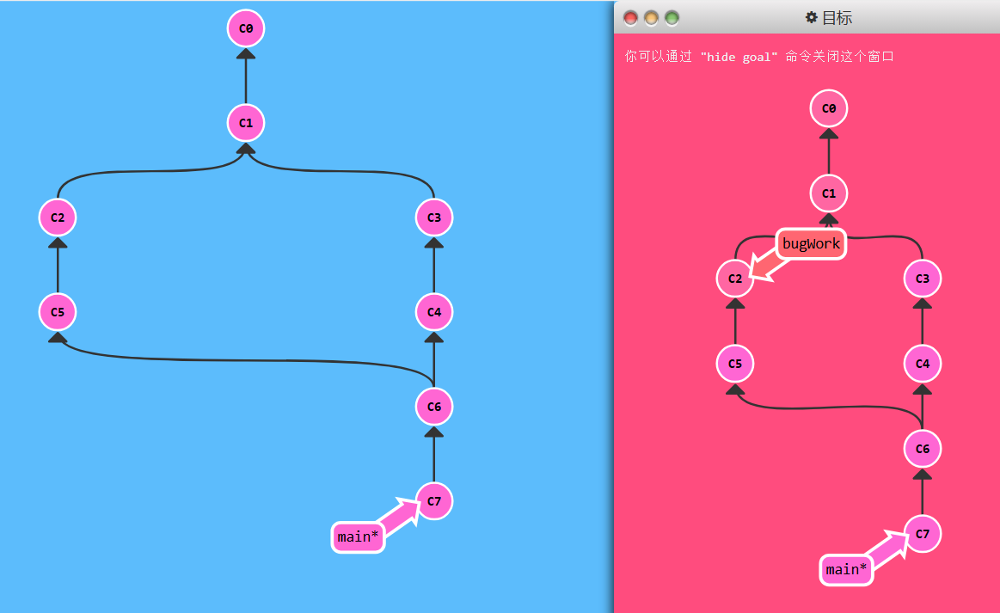

git

#### 提交

一条提交记录就是项目的一个快照

```bash
git status
git add .
git commit -m "更新内容说明"
git push
```

#### 切换分支

```bash
git branch 分支名      --创建分支
git checkout 分支名   --将该分支切换为当前分支
```

#### 合并分支

##### merge

```bash
git merge bugFix         
```

<table>
    <tr>
        <td></td>
        <td></td>
    </tr>
</table>

这样当前分支就包含了所有的修改，但是bugFix分支并没有包含所有的修改。

```bash
git checkout bugFix
git merge main
```

<table>
    <tr>
        <td></td>
        <td></td>
    </tr>
</table>

这样所有分支就包含了所有的修改了。


##### rebase

```bash
git rebase bugFix --将当前分支上的所有记录依次提交到bugFix分支上
```

<table>
    <tr>
        <td></td>
        <td></td>
    </tr>
</table>

```bash
git checkout bugFix
git rebase main
```

<table>
    <tr>
        <td></td>
        <td></td>
    </tr>
</table>


这样也实现了合并分支的操作，所有分支包含所有的修改。

#### 移动分支

##### 移动HEAD指针

两种方法：一种指定提交记录的hash值，另一种相对于某个指针定位记录。

指定提交记录的hash值来移动分支

```bash
git checkout c1
```

git中存在一个HEAD指针，这个指针总是指向当前分支最近一次提交记录。如果改变HEAD的指向，我们当前分支也会跟着变。

<table>
    <tr>
        <td></td>
        <td></td>
    </tr>
</table>


在实际使用中，git并不会提供上述可视化树，因此我们需要通过`git log`来查看提交记录的唯一标识hash值，以替代`c1`，hash值很长，例如 `fed2da64c0efc5293610bdd892f82a58e8cbc5d8`

令人欣慰的是，Git 对哈希的处理很智能。你只需要提供能够提交记录的hash值得前几个字符即可。


使用相对引用来移动分支

使用 `^`向上移动一个提交记录

```bash
git checkout main^ --相对于指针main，HEAD指向 main上一个提交记录
```

<table>
    <tr>
        <td></td>
        <td></td>
    </tr>
</table>

```bash
git checkout main^^    --HEAD指向main上两个提交记录
git checkout main^^^    --HEAD指向main上三个提交记录,依次类推
git checkout main~3    --HEAD指向main上三个提交记录
```

使用`~<num>`向上移动多个提交记录。


分支名就是指针，创建一个分支，就是创建一个指针，我们可以相对于指针定位记录。当然也可以相对于HEAD定位记录。

```bash
git checkout HEAD^1  -- HEAD指向HEAD上一个提交记录
```


> 相对引用和指定记录hash值之间的区别：
>
> 指定记录hash值可以将指针向后移，相对引用只能将指针向前移

如何实现将main指针移动到c6上？


```bash
git branch -f main c6  --实际git中，c6是该记录的hash值的前几位
```


##### 强制移动自定义指针

把main指针指向 HEAD指针指向记录，再往上找三个的记录。

```bash
git branch -f main HEAD~3
```

<table>
    <tr>
        <td></td>
        <td></td>
    </tr>
</table>


#### 撤销更改

```bash
git reset HEAD^
```

<table>
    <tr>
        <td></td>
        <td></td>
    </tr>
</table>

```bash
git revert HEAD
```

<table>
    <tr>
        <td></td>
        <td></td>
    </tr>
</table>

#### 自由提交

在当前分支里依次提交接下来指定的  提交

```bash
git cherry-pick 提交名1 提交名2 提交名3 ...
```

将指定的这些提交，按顺序依次提交到当前分支上。

<table>
    <tr>
        <td></td>
        <td></td>
    </tr>
</table>
```
git rebase -i HEAD^
```


指定当前记录沿着当前分支向上走的某个记录，把这个记录作为新的当前记录，然后pick和调换顺序，`这之间的记录s`。之后这些记录会依次提交。


#### Tag

给某个记录打标签，就相当于定义了一个指针。

```bash
git tag v1 c1  --给c1定义一个名为v1的Tag指针
```

<table>
    <tr><td></td>
    </tr>
</table>

```bash
git checkout v1  --将HEAD指针指向v1标签
```

这个Tag指针跟branch指针唯一不同的地方就是，当HEAD指针指向标签的时候是不能commit的。


符号 `^`后面也可以跟数字

比如下面这个图里面，main指针指向的记录有两个parent记录

```bash
git checkout main^    -- HEAD指针指向第一个记录c1
git checkout main^2   -- HEAD指针指向第二个记录c2
```

<table>
    <tr><td> </td>
    <td></td>
    </tr>
</table>





```bash
git branch bugWork HEAD~1^2^1    --链式
```




#### 总结


记录树+指针

记录的表示：

1. hash前几位
2. 相对位置：指针、`^[num]`、`~[num]`、链式。（只能定位该指针前面的记录）

指针分为branch指针和tag指针

```bash
git status
git add .
git commit -m "更新内容说明"
git push
```

```bash
git branch 指针名 [记录]     --创建一个branch指针指向该记录,不具体指出记录的话，默认为HEAD指针指向的记录
git tag 指针名 [记录]   --创建一个tag指针指向该记录，不具体指出记录的话，默认为HEAD指针指向的记录
git checkout 记录        --将HEAD指针指向该记录
git branch -f 指针名 记录 --将该branch指针指向该记录
git merge 记录     --将该记录合并到当前分支上。
git rebase 记录      --将当前分支上的所有记录，依次提交到该记录上
git reset 记录
git revert 记录
git cherry-pick 记录1 记录2 记录3 ...  --将指定的这些记录，按顺序依次提交到当前分支上。
git rebase -i 记录  --当前记录沿着当前分支向上走到该记录,对沿途这些记录可以进行pick和调换顺序，然后将该记录当作当前记录，接下来按照你选择的记录依次commit 
```

