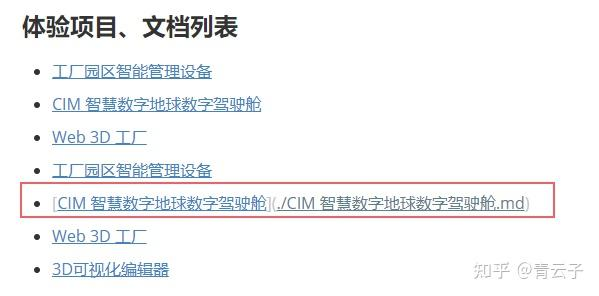

typora的使用，快捷键，html的学习使用

[Typora_Markdown_图片标题(题注)_markdown图标题_Ladybug_的博客-CSDN博客](https://blog.csdn.net/m0_47098916/article/details/117827687)


快捷键

ctrl+数字    设置标题

ctrl+shift+~     代码行

ctrl+shift+K      代码块

前后双等号    高亮

前后单$          latex公式行

ctrl+shift+M   latex公式块

ctrl+b   加粗

ctrl+shift+Q   引用    可以用来当小标题


让html代码生效：直接写html就行，自己会生效，不要放到代码行或代码块里。

居中html代码

`<center>****</center>`

<center>Impressions of after-reading of Dive into deep learning</center>


latex

|      |            |              |      |
| ---- | ---------- | ------------ | ---- |
| 撇儿 | d^{\prime} | $d^{\prime}$ |      |


| 运算     | 公式              | 显示                                      |
| -------- | ----------------- | ----------------------------------------- |
| 除法     | \frac{a}{c}       | $ \frac{a}{c}$                            |
| 对数     | \log_ax           | log以a为底，以x为真数。l小写    $\log_ax$ |
|          | \Ln x             | log以e为底，以x为真数。 L大写     $\In x$ |
|          | \lg x             | log以10为底，以x为真数。       $\lg x$    |
| 向下取整 | \lfloor x \rfloor | $\lfloor x \rfloor$                       |
| 向上取整 | \lceil x \rceil   | $\lceil x \rceil$                         |

|       | 公式    | 显示      | 解释                                                   |
| ----- | ------- | --------- | ------------------------------------------------------ |
| 向量x | \pmb{x} | $\pmb{x}$ | 有时我们需要表示一个向量x，即如何把在latex中的字母加粗 |
|       |         |           |                                                        |
|       |         |           |                                                        |

| 括号   | 公式                           | 显示                             | 解释                                                         |
| ------ | ------------------------------ | -------------------------------- | ------------------------------------------------------------ |
| 尖括号 | \left \langle x \right \rangle | $\left \langle x \right \rangle$ | 在美元符号\$中可以直接用<>来表示尖括号，单感觉有点违和，空隙较大，不好看，所以就总结一下。尖括号什么时候使用？<br />$\left \langle \pmb{x},\pmb{w} \right \rangle$ 表示向量x和向量w的内积 |
| 大括号 | \lbrace x\rbrace               | $\lbrace x\rbrace$               | 由于大括号{} 被用于分组，因此需要在latex中使用{}，比如集合的时候用 |
|        |                                |                                  |                                                              |

| 导数     | 公式                          | 显示                            | 解释 |
| -------- | ----------------------------- | ------------------------------- | ---- |
| 一阶导数 | \frac{\partial f}{\partial x} | $\frac{\partial f}{\partial x}$ |      |
|          |                               |                                 |      |
|          |                               |                                 |      |


| 范围表示 |        |          |
| -------- | ------ | -------- |
| 属于     | \in    | $\in$    |
| 不属于   | \notin | $\notin$ |
| 无穷大   | \infty | $\infty$ |

| 比较     |           |             |                  |
| -------- | --------- | ----------- | ---------------- |
| 大于等于 | \geqslant | $\geqslant$ |                  |
| 小于等于 | \leqslant | $\leqslant$ |                  |
| 不等号   | \neq      | $\neq$      | /not equal的简写 |

| 集合   |             |               |                        |
| ------ | ----------- | ------------- | ---------------------- |
| 空集   | \varnothing | $\varnothing$ |                        |
| 包含于 | \subset     | $\subset$     | 两边都是集合           |
| 包含   | \supset     | $\supset$     |                        |
|        | \subseteq   | $\subseteq$   | 左边是元素，右边是集合 |
|        | \supseteq   | $\supseteq$   |                        |
| 并集   | A\cup B     | $A\cup B$     |                        |
| 交集   | A\cap B     | $A\cap B$     |                        |


| 四周               |                |                  |              |
| ------------------ | -------------- | ---------------- | ------------ |
| 在单个字母上加横线 | \bar{a}        | $\bar{a}$        |              |
| 在多个字母上加横线 | \overline{a+b} | $\overline{a+b}$ | 用于矩阵的逆 |
|                    |                |                  |              |

| 排列组合 |               |                 |                  |
| -------- | ------------- | --------------- | ---------------- |
| 组合     | C_{n}^{m}     | $C_{n}^{m}$     | 从n个数中取出m个 |
| 组合     | \tbinom{n}{m} | $\tbinom{n}{m}$ | 从n个数中取出m个 |
| 组合     | n \choose k   | $n\choose k$    | 从n个数中取出k个 |

| 有序列表 |                                                              |      |
| -------- | ------------------------------------------------------------ | ---- |
| ①        | 用输入法打出来即可，不要想着用公式了，效果不好，再说我平常也不怎么用这种序号 |      |
|          |                                                              |      |
|          |                                                              |      |


①


| 矩阵 |      |      |      |
| ---- | ---- | ---- | ---- |
|      |      |      |      |
|      |      |      |      |
|      |      |      |      |

[如何用latex编写矩阵（包括各类复杂、大型矩阵）？ - 知乎 (zhihu.com)](https://zhuanlan.zhihu.com/p/266267223)


工作需求：

想要把网页上的gif搬到我的typora笔记当中。

第一步，将网页上的gif下载到电脑上：

1. 左键点击按住移动GIF图区域

2. 拖动GIF图到你的桌面

第二步，把gif保存到文件中，然后用markdown插入图片的代码 

就ok了


在Typora，markdown中可以使用相对路径引用本地文档



使用的代码跟插入图片使用的代码差不多

```
[文件描述](相对路径)   //引用本地文档
```

```
    //插入图片
```


