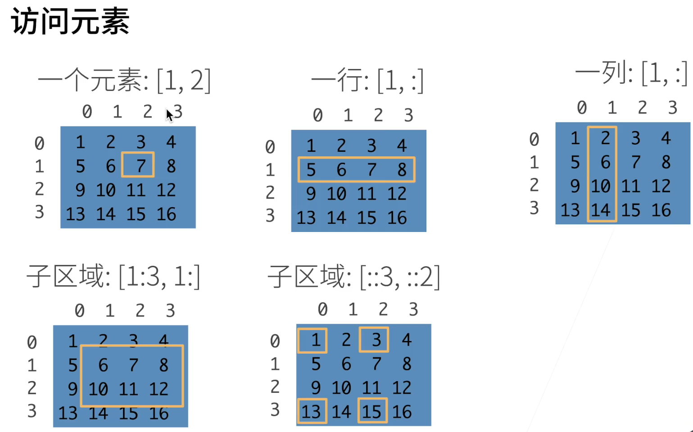

<center>Impressions of after-reading of Dive into deep learning</center>

#### 引言

> 开发 程序 的方法：
>
> 1. 依靠人类逻辑编写代码，一步步完成开发。这类程序始终会执行相同的业务逻辑，程序处理业务的性能不会有所提升。
> 2. 机器学习，从经验中学习，提高性能的一种技术。

我们接触的计算机程序大部分都是开发人员从零编写的，开发任何一个程序都是开发人员编写程序逻辑的过程，细致地考虑应用程序可用遇到的边界情况，并为这些情况编写合适的规则，不断的经过测试，完善逻辑漏洞，逐步完善程序。有了编写某类程序的经验之后，就可以按照这类程序的固定逻辑步骤 很快完成程序的开发。

但是，也有些程序，不能完全由人类所能考虑到的逻辑来开发。如下：

- 编写一个应用程序，接受地理信息、卫星图像和一些历史天气信息，并预测明天的天气；
- 编写一个应用程序，接受自然文本表示的问题，并正确回答该问题；
- 编写一个应用程序，接受一张图像，识别出该图像所包含的人，并在每个人周围绘制轮廓；
- 编写一个应用程序，向用户推荐他们可能喜欢，但在自然浏览过程中不太可能遇到的产品。

举一些原因：

- 有时任务可能遵循一种随着时间推移而变化的模式，我们需要程序来自动调整。
- 有时任务内的关系可能太复杂（比如像素和抽象类别之间的关系），需要数千或数百万次的计算。 即使人类的眼睛能毫不费力地完成这些难以提出完美解决方案的任务，这其中的计算也超出了人类意识理解范畴。

举个列子再来理解下为什么某些程序用传统编写逻辑的方法不能开发的原因。

现在，假如需要我们编写程序来响应一个“唤醒词”（比如“Alexa”“小爱同学”和“Hey Siri”）。 我们试着用一台计算机和一个代码编辑器编写代码，如图中所示。 问题看似很难解决：麦克风每秒钟将收集大约44000个样本，每个样本都是声波振幅的测量值。而该测量值与唤醒词难以直接关联。那又该如何编写程序，令其输入麦克风采集到的原始音频片段,输出是否{是,否}（表示该片段是否包含唤醒词）的可靠预测呢？**我们对编写这个程序毫无头绪，这就是需要机器学习的原因。**


我们可以收集一个包含大量音频样本的*数据集*（dataset），并对包含和不包含唤醒词的样本进行标记。 利用机器学习算法，我们不需要设计一个“明确地”识别唤醒词的系统。 相反，我们只需要定义一个灵活的程序算法，其输出由许多*参数*（parameter）决定，然后使用数据集来确定当下的“最佳参数集”，这些参数通过某种性能度量方式进行自我调整达到完成任务的最佳性能。


> 机器学习的关键组件：
>
> 1. 可以用来学习的*数据*（data）；
> 2. 如何转换数据的*模型*（model）；
> 3. 一个*目标函数*（objective function），用来量化模型的有效性；
> 4. 调整模型参数以优化目标函数的*算法*（algorithm）。

1.数据

数据集是由一个个样本组成的，每一个样本是由一组称为特征的属性组成的。机器学习基于数据分析实质上是基于样本的一组特征属性进行分析。

样本是独立同分布的，样本也叫实例或数据点。


样本举例：

1. “唤醒词”程序中，数据集的每一个样本是一段音频，音频的特征是  “是” 或  “否”。机器学习基于每段音频的特征来调整自己的参数，使模型能正确识别。
2.   当处理图像数据时，每一张单独的照片即为一个样本，它的特征由每个像素数值的有序列表表示。 比如，200×200彩色照片由200×200×3=120000个数值组成，其中的“3”对应于每个空间位置的红、绿、蓝通道的强度。
3. 对于一组医疗数据，样本是该患者的医疗数据，给定一组标准的特征（如年龄、生命体征和诊断），此数据可以用来尝试预测患者是否会存活。

样本的特征常写成向量的形式，这个向量称为特征向量。特征的个数称为 维数。

比如  <年龄，生命体征，诊断> 这就是特征向量，是三维的。


> 深度学习的优点，还不知道什么是深度学习，这个可以用来浅浅理解以下，以后会进一步了解的。

然而，并不是所有的数据都可以用“固定长度”的向量表示。 以图像数据为例，如果它们全部来自标准显微镜设备，那么“固定长度”是可取的； 但是如果图像数据来自互联网，它们很难具有相同的分辨率或形状。 这时，将图像裁剪成标准尺寸是一种方法，但这种办法很局限，有丢失信息的风险。 此外，文本数据更不符合“固定长度”的要求。 比如，对于亚马逊等电子商务网站上的客户评论，有些文本数据很简短（比如“好极了”），有些则长篇大论。 与传统机器学习方法相比，深度学习的一个主要优势是可以处理不同长度的数据。

一般来说，拥有越多数据的时候，工作就越容易。 更多的数据可以被用来训练出更强大的模型，从而减少对预先设想假设的依赖。 数据集的由小变大为现代深度学习的成功奠定基础。 在没有大数据集的情况下，许多令人兴奋的深度学习模型黯然失色。 就算一些深度学习模型在小数据集上能够工作，但其效能并不比传统方法高。

请注意，仅仅拥有海量的数据是不够的，我们还需要正确的数据。 如果数据中充满了错误，或者如果数据的特征不能预测任务目标，那么模型很可能无效。 有一句古语很好地反映了这个现象：“输入的是垃圾，输出的也是垃圾。”（“Garbage in, garbage out.”） 此外，糟糕的预测性能甚至会加倍放大事态的严重性。 在一些敏感应用中，如预测性监管、简历筛选和用于贷款的风险模型，我们必须特别警惕垃圾数据带来的后果。 一种常见的问题来自不均衡的数据集，比如在一个有关医疗的训练数据集中，某些人群没有样本表示。 想象一下，假设我们想要训练一个皮肤癌识别模型，但它（在训练数据集中）从未“见过”黑色皮肤的人群，这个模型就会顿时束手无策。

再比如，如果用“过去的招聘决策数据”来训练一个筛选简历的模型，那么机器学习模型可能会无意中捕捉到历史残留的不公正，并将其自动化。 然而，这一切都可能在不知情的情况下发生。 因此，当数据不具有充分代表性，甚至包含了一些社会偏见时，模型就很有可能有偏见。

==挖坑==


#### 预备知识

> 数据存储

我们把 一个由数值组成的数组 叫张量(tensor)；只有一个数的张量对应数学上的标量；一维数组对应数学上的向量(vector)；二维数组对应数学上的矩阵(maxtrix)

```python
import torch
x = torch.arange(12)  #创建一个从0到11的张量，数据类型为int；创建的张量默认存储在内存中，采用基于CPU
x                     #的计算
____

tensor([ 0,  1,  2,  3,  4,  5,  6,  7,  8,  9, 10, 11])

```

```python
x.shape   #通过张量的shape属性来访问张量（沿每个轴的长度）的形状
x.numel()   #返回张量的元素总数
X = x.reshape(3, 4)
X
___

torch.Size([12])
12
tensor([[ 0,  1,  2,  3],
        [ 4,  5,  6,  7],
        [ 8,  9, 10, 11]])
```




横轴表示样本，纵轴表示样本的特征。

创建数组需要考虑：

1. 形状 ，比如3x4
2. 元素的数据类型
3. 元素的初始值，比如全是0，或者是随机值

这个随机值可以是正态分布，也可以是均匀分布。

访问数组元素的方式：


只需要理解

对于每一个维度，

a​ : b : c    --->表示的区域是   $[a,b)$ 步长是c

只有a的时候表示，选取下标是a的这个元素

a:b 表示从a到b，左闭右开，步长是1

a可以从-1往负数方向递减，指的是从最后一个元素往前。

:    -->表示所有元素

::2   表示从下标为0开始，每隔1个选取一个


首先，我们导入`torch`。请注意，虽然它被称为PyTorch，但是代码中使用`torch`而不是`pytorch`。

```
import torch
x = torch.arange(12)   //创建从0开始的前11个整数
```


