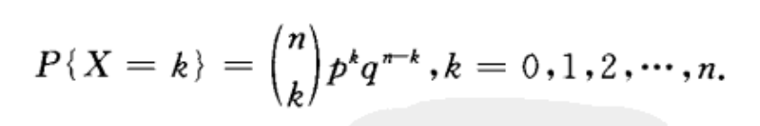
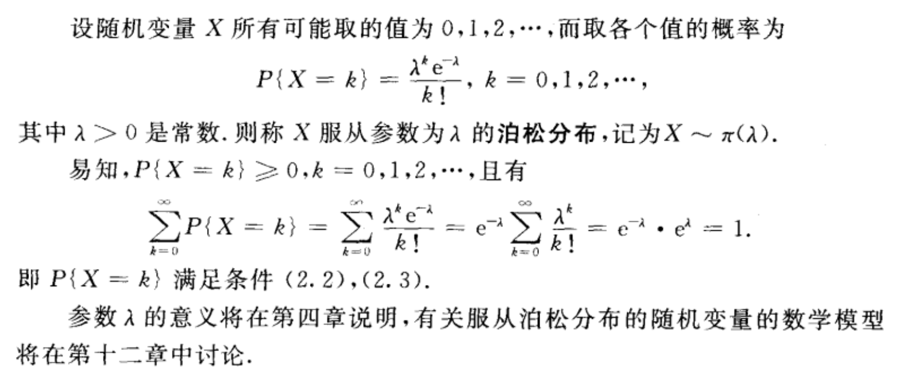
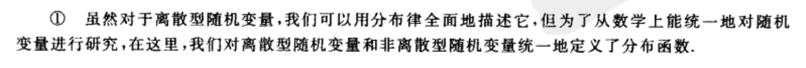
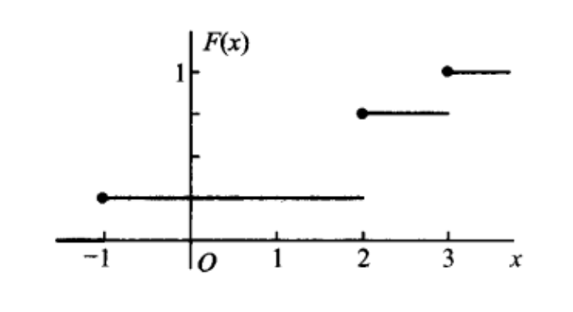
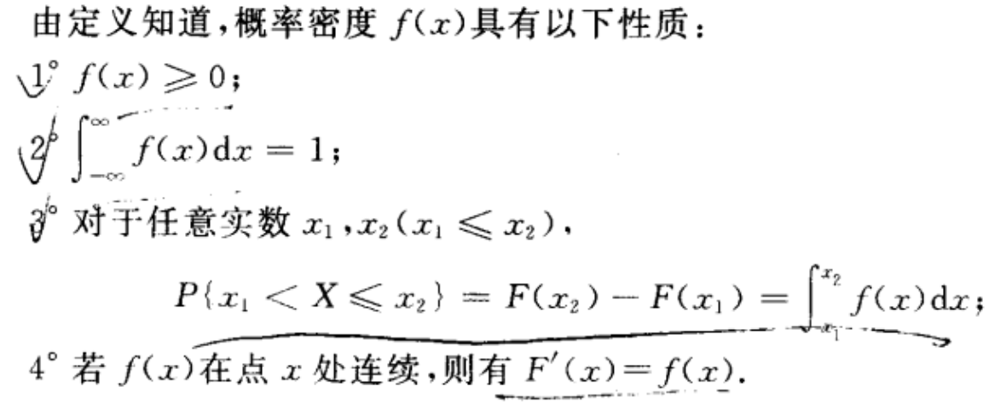
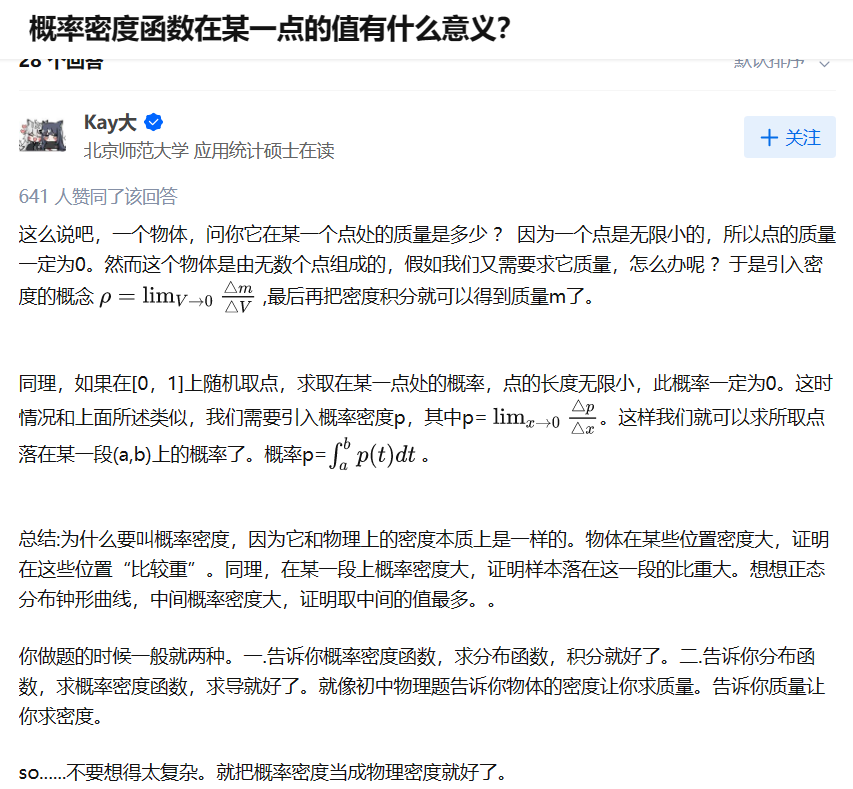
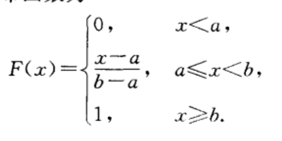
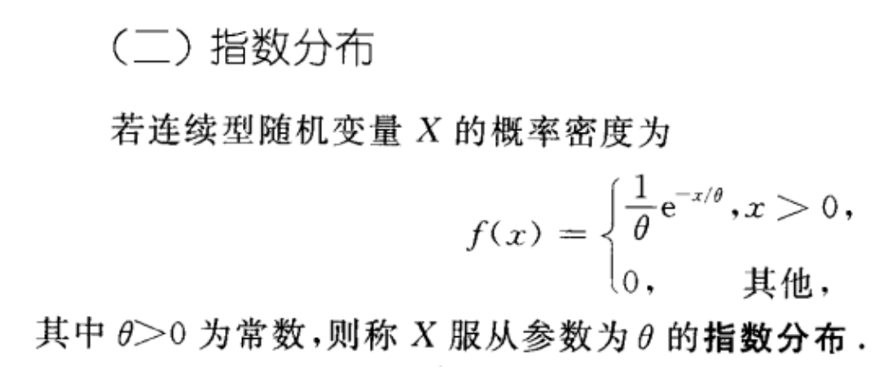
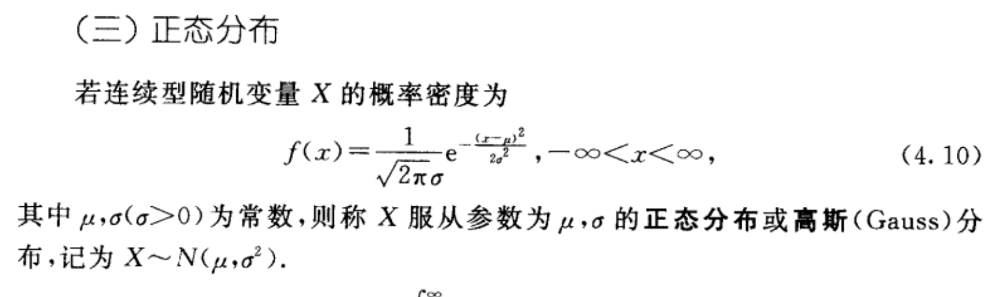

### 第二章 随机变量及其分布

在第一章中，我们看到有些随机试验的结果可以用数字来表示；比如试验$E$:将一枚硬币抛掷三次，观察出现正面的次数，试验的可能结果，即样本空间$S=\lbrace 0,1,2,3\rbrace$ ;但是也有的随机试验的结果不是用数字来表示的，比如试验$E$:抛掷一枚硬币，观察正面$H$,反面$T$出现的情况；样本空间$S=\lbrace H,T \rbrace$,对于这种样本空间的元素不是数值的随机试验来说，我们难以描述和研究，因此我们希望将样本空间里的每一个元素映射成数值。

随机变量的定义：

- 设随机试验的样本空间$S=\lbrace e \rbrace$,$X=X(e)$是定义在样本空间$S$上的实值单值函数，成$X=X(e)$为随机变量。

注意：随机变量$X$的作用是将样本空间的每一个样本点映射成一个实数；可以1对1，也可以1对多。我们可以用随机变量$X$将非数值型的样本点映射成实数，也可以将数值型的样本点映射成实数，具体情况具体分析。

当题目提及随机变量$X$时，注意两点：

1. 样本空间，即定义域
2. 函数式
3. 值域

随机变量分为离散型随机变量和连续型随机变量。

离散型随机变量和连续型随机变量的区别在于，离散型随机变量的取值是有限个数值，连续性随机变量的取值是实数区间。(随机变量的取值是映射之后的那些数值)

#### 分布

**要研究一个离散型随机变量的统计规律，需要知道随机变量的所有取值，以及每一个取值的概率。**

用表格的形式表示分布律：(很熟悉吧)注意：分布律一定是和随机变量挂钩的。

| $\pmb{X}$ | $x_1$ | $x_2$ | ...  | $x_n$ |
| --------- | ----- | ----- | ---- | ----- |
| $p_k$     | $p_1$ | $p_2$ | ...  | $p_n$ |

写个例题吧

设一汽车在开往目的地的道路上需要经过四组信号灯，每组信号灯以$\frac{1}{2}$的概率允许或禁止汽车通过，用$X$表示汽车首次停下时，它已经通过的信号灯的数量(设各组信号灯的工作是相互独立的)，求$X$的分布律

解析：随机试验$E$：汽车通过四组信号灯，记录汽车经过信号灯时的亮暗状态。

样本空间$S$有16种可能，因为$2*2*2*2=16$,就不一一列举了

X：表示汽车首次停下时，已经通过的信号灯的数量

由此，可计算出$X$的值域$\lbrace 0,1,2,3,4\rbrace$

因此分布律表格的第一行就有了

| $\pmb{X}$ | 0    | 1    | 2    | 3    | 4    |
| --------- | ---- | ---- | ---- | ---- | ---- |
| $p_k$     |      |      |      |      |      |

接着计算每一个取值的概率

$X=0$时对应的情况是，遇到第一个信号灯的时候就停下来了，对应的样本数有$1*2*2*2=8$种，对应的概率是$0.5*1*1*1=0.5$ 

$X=1$对应的情况是遇到第二个信号灯的时候就停下来了，那么就知道第一个信号灯一定是可以通过的，对应的样本数有$1*1*2*2=4$ ,对应概率$0.5*0.5*1*1=0.25$

$X=2$对应的情况是遇到第三个信号灯的时候就停下来了，那么就知道第一第二个信号灯也是可以通过的，对应的样本数有$1*1*1*2=2$,概率为$0.5*0.5*0.5*1=0.125$

$X=3$对应的情况是遇到第四个信号灯时停下来了，可知第一二三信号灯可以通过，对应的样本数$1*1*1*1=1$,对应的概率是$0.5*0.5*0.5*0.5=0.0625$

$X=4$对应的情况是没有停下来，可知四组信号灯都能通过,样本数只有$1*1*1*1=1$，对应的概率是$0.5*0.5*0.5*0.5=0.0625$ 

| $\pmb{X}$ | 0    | 1    | 2     | 3      | 4      |
| --------- | ---- | ---- | ----- | ------ | ------ |
| $p_k$     | 0.5  | 0.25 | 0.125 | 0.0625 | 0.0625 |

这是简写的解析，如果具体的话，要分别求出每一个样本的概率，然后相加。太麻烦了，如果手写的话我说不定会试试，因为写完整的话才能明白每一处细节，不过我已经想到了所有的细节。就不详写了。

### 三种重要的离散型随机变量

1.(0-1)分布

| $X$   | 0    | 1     |
| ----- | ---- | ----- |
| $p_k$ | $p$  | $1-p$ |

2.伯努利试验、二项分布

设随机试验$E$只可能有两种结果：$A$或者$\bar A$,则称$E$为伯努利试验。设$A$的概率$P(A)=p$,$P(\bar A)=1-p$.

将$E$**独立重复**地进行$n$次，称为$n$重伯努利试验。

**重复**指每次试验的$P(A)$不变；**独立**是指各试验之间互不影响,即若记$C_i$ 是第$\pmb{i}$次试验结果，$C_i$为$A$或$\bar A$ ,则$$P(C_1C_2C_3..C_n)=P(C_1)*P(C_2)*P(C_3)...*P(C_n)$$

用随机变量$X$表示n重伯努利试验中，事件$A$发生的次数，现在我们来求求随机变量$X$的分布律

随机试验$E$表示进行一次n重伯努利试验；

样本空间$S$ 的每一个元素表示进行一次n重伯努利试验之后的结果，元素可以这样表示$(A,A,...A)$,这是进行一次n重伯努利试验后的全$A$的结果。那么样本空间$S$有$2^n$个元素。

随机变量$X$有哪几种取值呢？

$X=0$可以吗？可以，表示在一次n重伯努利试验中，事件$A$一次也没有发生。对应的样本只有一个$(\bar A,\bar A,\bar A,...\bar A)$，这个样本的概率为$(1-p)^n$,那么$P(X=0)=(1-p)^n$

$X=n$,表示在一次n重伯努利试验中，事件$A$发生了$n$次，对应的样本也只有一个$(A,A,A,...,A)$,对应的概率为$p^n$,那么$P(X=n)=p^n$

$X=1$,表示在一次n重伯努利试验中，事件$A$发生了一次，对应的样本数有n个，不难理解,每一个样本的概率都是$p*(1-p)^{n-1}$,那么$P(X=1)=p*(1-p)^{n-1} * n$

$X=2$表示在一次n重伯努利试验中，事件$A$发生了两次，对应的样本数有$(n-1)!$个，也不难理解。每一个样本的概率是$p^2*(1-p)^{n-2}$,那么$P(X=2)=p^2*(1-p)^{n-2}*C_n^2$

根据上面的举的例子，可以知道，

$P(X=k)=p^k*(1-p)^{n-k}*C_n^k$

我们称这个随机变量$X$服从参数$n,p$的二项分布，并记为$X~b(n,p)$,

3. 泊松分布

#### 随机变量的分布函数

背景：对于非离散型随机变量，(我也不知道除了连续型随机变量外还有啥)，那就拿连续型随机变量举例；因为连续型随机变量的取值是一个范围，连续型随机变量取值的个数是无限的、不可数的，不能一一列举出来，因此就不能跟离散型随机变量一样用分布律就可以表示出来。**另外，我们平常所遇到的非离散型随机变量取任一指定的实数值的概率都等于零**，hh，这个我刚开始不是很能理解，我来举个例子，比如随机变量$X$表示人的身高，现实生活中，测量两个人是否具有完全相同的身高没有太大意义。 如果我们进行足够精确的测量，最终会发现这个星球上没有两个人具有完全相同的身高。 在这种情况下，询问某人的身高是否落入给定的区间，比如是否在1.79米和1.81米之间更有意义。这上面这个例子中，我们可以知道，当我们测量人的身高足够精确的时候，$P(x=1.8)$是趋于0的，因为没有人的身高能精确就是1.8m，就算有也是非常非常少的，所以，**连续型随机变量取某一个具体值的概率为0**，这句话能否接受？我反正可以接受了。

**对于连续型随机变量来说，我们更想要去分析的不是取单独某个值的概率，而是落在某个区间上的概率，这就是我们接下来要讲的分布函数。**

**分布函数$F(x)$描述了随机变量$X$ 小于等于实数$x$的取值 的概率。这里的随机变量$X$既可以是连续型的，也可以是离散型的。**（这里有可能就有疑问了，哎？背景里面不是说分布函数是给连续型随机变量使用的吗，离散型随机变量也有呢？这是因为，分布函数的定义既适用于连续型随机变量，也适用于离散型随机变量啊,另一方面是因为下图的①；但从实际意义上讲，但是对于离散型随机变量更关注的还是分布律，对于随机变量更关心的还是分布函数。）

分布函数的性质：

什么是右连续？早忘了。无所谓，这些性质很容易理解。

下面分别举两个例子，第一个例子是离散型随机变量的分布函数，第二个例子是连续型随机变量的分布函数。

例1：

设随机变量$X$的分布律为

| $X$   | -1            | 2             | 3             |
| ----- | ------------- | ------------- | ------------- |
| $P_k$ | $\frac{1}{4}$ | $\frac{1}{2}$ | $\frac{1}{4}$ |

求$X$的分布函数，并求$P\lbrace X\leq \frac{1}{2}\rbrace$,$P\lbrace \frac{3}{2}<X\leq\frac{5}{2}\rbrace$,$P\lbrace 2 \leq X \leq 3\rbrace$

下面是离散型随机变量的分布函数的图像，是个分段函数

例2：

一个靶子是半径为2的圆盘，设击中靶上任一同心圆盘上的点的概率与该圆盘的面积成正比，并设射击都能击中靶，以$X$表示弹着点与圆心的距离。试求随机变量$X$的分布函数

连续型随机变量的分布函数图像是连续的。

### 连续型随机变量的概率密度函数

概率密度函数与$x$轴围成的面积是1

概率密度函数在区间$(x_1,x_2)$ (开闭无所谓，因为连续型随机变量在某一点的概率值为0)与$x$轴围成的面积是随机变量$X$落在这个区间上的概率。

下面这句话的意思是不在乎概率密度函数的函数值

### 三种重要的连续型随机变量

到pdf 59为止了。

