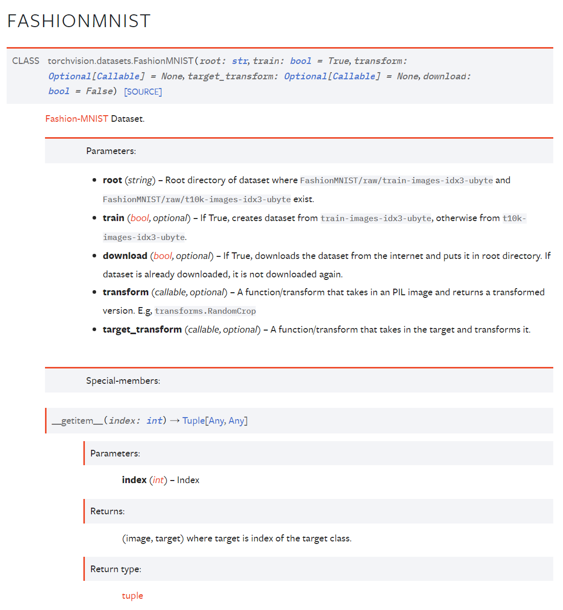
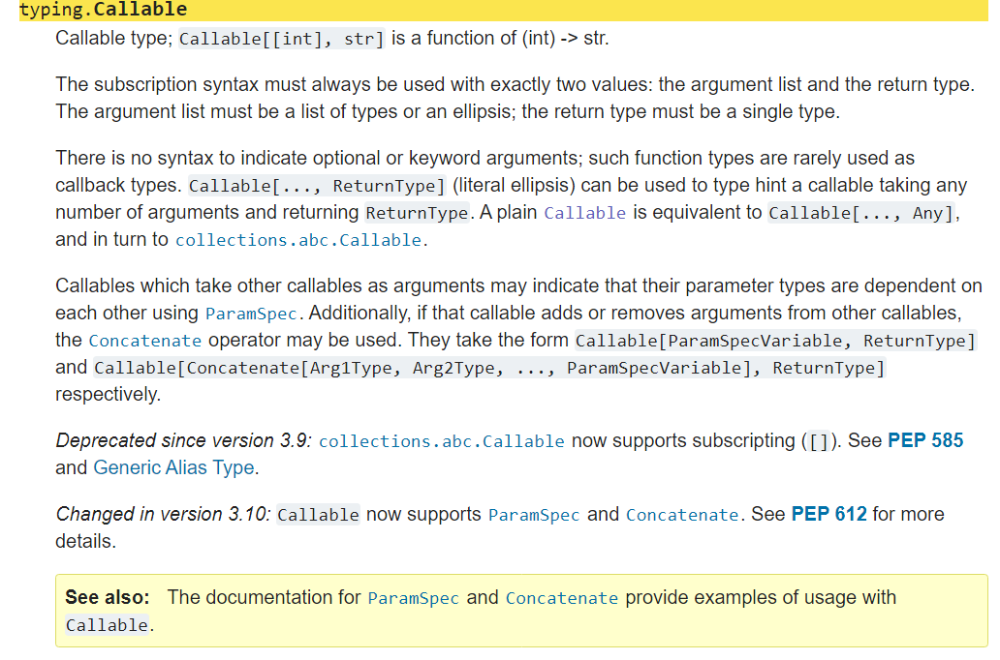
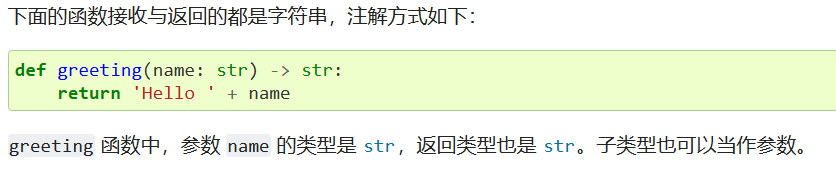

typing

# 背景

在学习*动手学深度学习*这门课时，少不了理解代码的过程，因为之前并没有使用过python的module，对于代码中使用的module并不熟悉，因此查阅对应module的说明文档，以下面这张图为例



根据这张图我也大致能明白，torchvision.datasets.FashionMNIST()是个类(CLASS)，这个类有五个参数：**root,train,transform,target_transform,download**,*parameter*那一栏是对参数的说明，*Special-members*那一栏是这个python类的特殊成员，*\_getitem_()*是这个类的特殊成员函数。

唯一不理解的地方就是*callable*,这个*callable*难道是跟前面的*str,bool*一样是数据类型？然后我就点进去看了

是typing模块中的数据类型，下面的翻译我也没看懂，就到处找资料，发现了typing module 的重要性，一起来看看。


我们知道，在python中，声明变量并不需要向c++那样显式定义其数据类型，这样就会产生一个问题：很多人在写完代码一段时间之后再看代码时，很可能忘记了之前写的函数的参数的数据类型是什么了，然后就必须阅读函数的具体内容，因此，typing module就诞生了。

在typing module的说明文档中，typing支持类型注释，人话就是typing module就是用来给进行类型注释的。

> Python 运行时不执行函数和变量类型注解，但这些注解可用于类型检查器、IDE、静态检查器等第三方工具。



以上是typing 说明文档中的内容，下面具体来讲。

typing的作用：

1. 类型检查，在调用的时候检查参数和返回值的类型是否正确，这样就能在运行前发现错误
2. **作为开发文档的附加说明，清晰告知函数的参数类型和返回值类型，便于使用者的使用。**(这个前面遇到了)

typing module的常用方式：

```python
from typing import List, Tuple, Dict
def add(a:int, string:str, f:float, b:bool) -> Tuple[List, Tuple, Dict, bool]:
    list1 = list(range(a))
    tup = (string, string, string)
    d = {"a":f}
    bl = b
    return list1, tup, d,bl


print(add(5,"hhhh", 2.3, False))
# 结果：([0, 1, 2, 3, 4], ('hhhh', 'hhhh', 'hhhh'), {'a': 2.3}, False)
```

没用typing module情况：

```python
def add(a, string, f, b):
    list1 = list(range(a))
    tup = (string, string, string)
    d = {"a":f}
    bl = b
    return list1, tup, d,bl


print(add(5,"hhhh", 2.3, False))
# 结果：([0, 1, 2, 3, 4], ('hhhh', 'hhhh', 'hhhh'), {'a': 2.3}, False)
```

对比可以发现typing module的优势

-----

```python
def add(a:int, string:str, f:float, b:bool) -> Tuple[List, Tuple, Dict, bool]:
```

在这行代码中，**int,str,float,bool**这些并不是指python内置的数据类型，而是typing module中新定义的类型，有一个统一的名称 *注解类型*，从字面就可以理解，**int,str,float,bool**在这里本身是注释，并不是python内置的数据类型。

我们来了解一些typing module中定义的注释类型：

1. List,基本等同于python中的list，list的泛型。具体怎么用，举个例子

- ```python
  def add(var: List[int or float] = [2,3.5]):
  ```

  说明了参数var的数据类型是list，list的元素属于int or float 都可以。

- 另外还可以嵌套声明都是可以的

  ```python
  var: List[List[int]] = [[1, 2], [2, 3]]
  ```

  说明了var的数据类型，是二维的list，内层list的元素必须是int

2. Tulpe

Tuple、元组，是 tuple 的泛型，**其后紧跟一个方括号，方括号中按照顺序声明了构成本元组的元素类型**，如 `Tuple[X, Y]` 代表了构成元组的第一个元素是 X 类型，第二个元素是 Y 类型。 比如想声明一个元组，分别代表姓名、年龄、身高，三个数据类型分别为 str、int、float，那么可以这么声明：

```python
person: Tuple[str, int, float] = ('Mike', 22, 1.75)
```

Tuple同样可以用于嵌套


3. NoReturn

NoReturn，当一个方法没有返回结果时，为了注解它的返回类型，我们可以将其注解为 NoReturn，例如：

```python
def hello() -> NoReturn:
    print('hello')
```

4. Callable

- Callable 在声明的时候需要使用 `Callable[[Arg1Type, Arg2Type, ...], ReturnType]` 这样的类型注解，将参数类型和返回值类型都要注解出来。单独的 Callable 表示无参数无输出的函数

```python
def date(year: int, month: int, day: int) -> str:
    return f'{year}-{month}-{day}'

def get_date_fn() -> Callable[[int, int, int], str]:
    return date
```

5. Union，联合类型，`Union[X, Y]` 代表要么是 X 类型，要么是 Y 类型。 

- 联合类型的联合类型等价于展平后的类型：

```python
Union[Union[int, str], float] == Union[int, str, float]
```

- 仅有一个参数的联合类型会坍缩成参数自身，比如：

```python
Union[int] == int
```

- 多余的参数会被省略，比如： 

```python
Union[int, str, int] == Union[int, str]
```

- 在比较联合类型的时候，参数顺序会被忽略，比如：

```python
Union[int, str] == Union[str, int]
```

- 这个在一些方法参数声明的时候比较有用，比如一个方法，要么传一个字符串表示的方法名，要么直接把方法传过来

```python
def process(fn: Union[str, Callable]):
    if isinstance(fn, str):
        # str2fn and process
        pass
    elif isinstance(fn, Callable):
        fn()
```

5. Optional

   Optional，意思是说这个参数可以为空或已经声明的类型，即 `Optional[X]` 等价于 `Union[X, None]`。 但值得注意的是，这个并不等价于可选参数，当它作为参数类型注解的时候，不代表这个参数可以不传递了，而是说这个参数可以传为 None。


在看这张图，可知*transform:Optional[Callable]*表示的含义了，*Optional[Callable]*等价于*Union[Callable,None]*,表示要么传入一个函数，要么传入None。再在*Parameter*那一栏看参数transform的具体含义:要求这个函数需要传入一张PIL的image，返回一个transformed 版本。


文章来源:[python模块分析之typing（三） - 倥偬时光 - 博客园 (cnblogs.com)](https://www.cnblogs.com/cwp-bg/p/7825729.html)