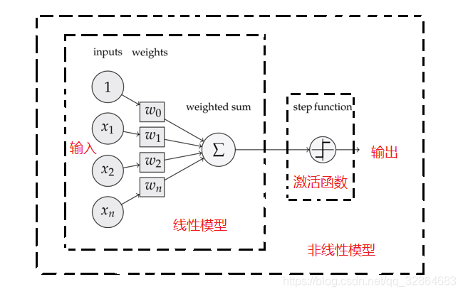
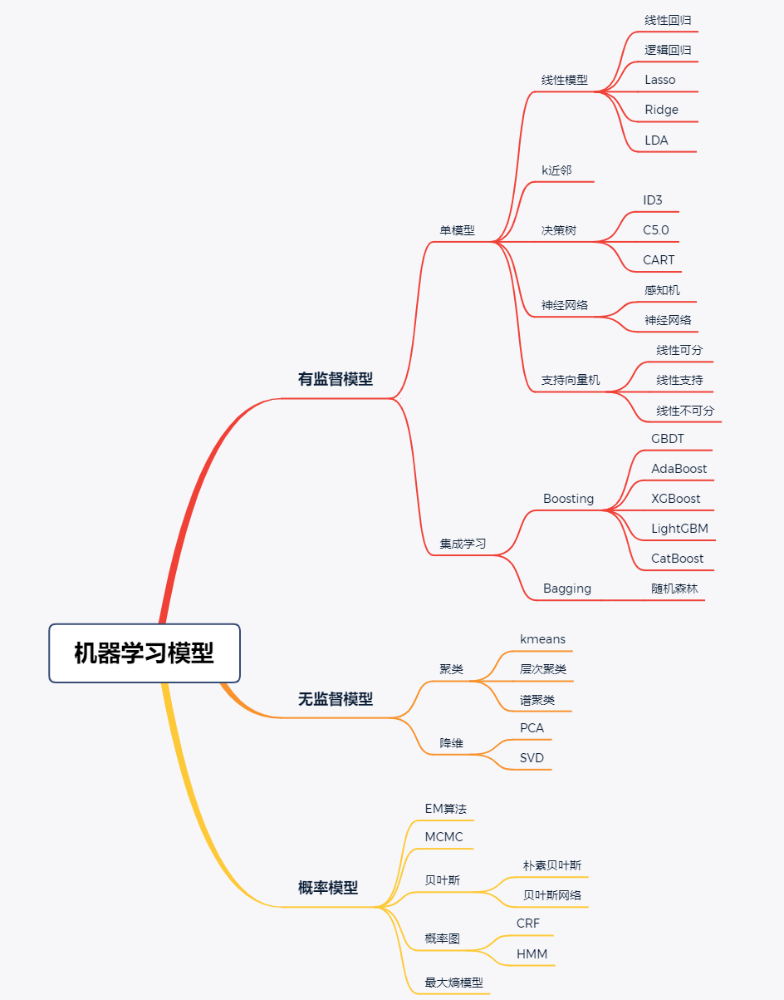

 线性模型和非线性模型的区别

神经网络中提到的线性模型与非线性模型之间的区别就体现在字面意思上：线性模型即仅通过对输入进行线性变换得到输出的网络模型，我们知道在线性代数中矩阵的相乘就是一种线性变换，根据矩阵乘法的结合律可知：一个矩阵依次与多个矩阵相乘等价于这个矩阵乘上这多个矩阵的乘积；类似的，任意线性模型的组合还是线性模型，也就是说，**只通过线性变换，任意层的全连接神经网络和单层神经网络的表达能力没有区别。**

由于线性模型的表达能力的局限性，非线性模型的优势就凸显出来，通过在线性模型的基础上增加激活函数的机制来实现，具体过程为在每一个神经元在接收上一层的加权和和偏执值之后，在该基础上计算一个非线性函数的函数值作为该神经元的输出，这个非线性函数就是激活函数。

线性模型假设自变量与因变量之间存在一个线性关系，即当自变量发生变化时，因变量的变化可以用一个线性方程来描述。在线性回归中，我们使用线性模型来拟合数据，以求出最佳拟合直线，从而对未知数据进行预测或分析自变量与因变量之间的关系。

非线性模型假设自变量与因变量之间的关系不是线性的，而是一个复杂的非线性关系。非线性模型可能包含多项式、指数、对数、三角函数等非线性函数，以更准确地描述自变量与因变量之间的关系。在实际应用中，非线性模型通常比线性模型更适合于描述数据之间的复杂关系，例如在图像识别、语音识别、自然语言处理等领域。

根据上面的描述，以及结论：线性回归、softmax回归和感知机回归都是线性模型，

思考：softmax和感知机都有非线性激活函数，为什么还是被称为线性模型？

**尽管softmax是一个非线性函数，但softmax回归的输出仍然由输入特征的放射变换决定。因此，softmax回归式一个线性模型**

softmax回归的输出是每一个类别的概率，

再来思考一下softmax函数的作用，归一化。

感知机是线性的，因为它的输出是**输入特征与权重的线性组合**。

我不能理解！！！

上述解释是我在网上找的，我觉得纯属扯淡。

区分线性和非线性模型的根本是什么呢？

在这张图里，我记得好像就学了一点有监督学习中的单模型部分和概率模型，就拿有监督学习来举例吧，多的我也不知道，有监督学习的任务主要有两个：分类和回归。

回归是预测一个连续变量的，分类是预测一个离散变量的。这是我之前的认知。

后来学习了sotfmax回归，softmax是逻辑回归在多分类问题上的推广。卧槽，你他妈挂羊头卖狗肉是吧，名字上说是回归其实是分类问题，怎么回事？

我们来看看“回归”二字的由来吧。

“回归”是由英国著名生物学家兼统计学家高尔顿(Francis Galton,1822～1911)在研究人类遗传问题时提出来的。为了研究父代与子代身高的关系，高尔顿搜集了1078对父亲及其儿子的身高数据。他发现这些数据的散点图大致呈直线状态，也就是说，总的趋势是父亲的身高增加时，儿子的身高也倾向于增加。但是，高尔顿对试验数据进行了深入的分析，发现了一个很有趣的现象—回归效应。因为当父亲高于平均身高时，他们的儿子身高比他更高的概率要小于比他更矮的概率；父亲矮于平均身高时，他们的儿子身高比他更矮的概率要小于比他更高的概率。它反映了一个规律，即这两种身高父亲的儿子的身高，有向他们父辈的平均身高回归的趋势。对于这个一般结论的解释是:大自然具有一种约束力，使人类身高的分布相对稳定而不产生两极分化，这就是所谓的回归效应。

根据上面一段话中，有两个直观的含义：

1. 父亲与儿子身高的散点图大致是呈直线的，自变量是父亲的身高，因变量是儿子的身高，随着父亲身高的增加，儿子的身高趋向于增加；随着父亲身高的减小，儿子的升高也趋向于减小。这只是只有一个自变量的情况，在一些统计示例中，会有多个自变量，一个因变量的情况，自变量的变化趋势有多种可能，因变量的变化只有两种可能 ，从整体上讲，我们可以认为 随着自变量向某一种趋势变化，因变量也会向着某一种趋势变化。
2. 回归效应，图像上从纵轴上看，即当x确定的时候，儿子的身高更集中于某一个值。

那么回归就是说，自变量和因变量之间的关系可以用一个线性方程表示出来。

那分类是什么呢？

还是上面这个例子，我们有了父亲的身高与儿子身高的线性方程，从图像上看是平面里的一条线，这条线将因变量分为两个类别，一个是小于平均值的，一个是大于平均值的。因此，说是分类问题，实际上还是求的回归方程。你可能有疑惑，对于多分类问题，比如有三个类别，是怎么用一条线划分的，我们把因变量设置成softmax那种形式的输出，哪一个最大，就最可能是这个类别，实际上还是求得自变量与因变量之间的线性方程。

这回我是真的知道什么是线性模型了。

如果还是不能理解，

不是说，感知机是线性模型吗？因为感知机有激活函数啊，不应该是非线性吗？为什么是线性呢？

一个很明显的例子就是感知机不能处理xor函数，在二维平面中，x轴和y轴是xor函数的两个输入，既然感知机是二分类问题，应该也能将平面中的点正确分类，也就是找到一条线性方程能够将平面一分为二，很显然，一条线是不可能将xor的两类点分开的。

你是否能根据样本点(自变量)的分布，以及样本点的类别（因变量），理解什么是线性的了呢？

为什么感知机（单层神经网络）无法解决非线性问题？

向上结论：因为感知机是广义线性模型。不管有无[激活函数](https://www.zhihu.com/search?q=激活函数&search_source=Entity&hybrid_search_source=Entity&hybrid_search_extra={"sourceType"%3A"answer"%2C"sourceId"%3A2181148302})，单层神经网络的决策边界都是线性的。

**一、单层神经网络的缺陷**

单层神经网络如逻辑回归、感知器等模型，本质上都属于广义线性分类器（**决策边界为线性**）。

这点可以从逻辑回归模型的决策函数看出，决策函数Y=sigmoid(wx + b)，当wx+b>0，Y>0.5;当wx+b<0，Y<0.5，以wx+b这条线可以区分开Y=0或1（如下图），可见决策边界是线性的。

这也导致了历史上著名xor问题：

> 1969年，“符号主义”代表人物[马文·明斯基](https://www.zhihu.com/search?q=马文·明斯基&search_source=Entity&hybrid_search_source=Entity&hybrid_search_extra={"sourceType"%3A"answer"%2C"sourceId"%3A2181148302})（Marvin Minsky）提出XOR问题：xor即异或运算的函数，输入两个bool数值（取值0或者1），当两个数值不同时输出为1，否则输出为0。如下图，可知XOR数据无法通过线性模型的边界正确的区分开

由于单层神经网络线性，连简单的非线性的异或函数都无法正确的学习，而我们经常希望模型是可以学习[非线性函数](https://www.zhihu.com/search?q=非线性函数&search_source=Entity&hybrid_search_source=Entity&hybrid_search_extra={"sourceType"%3A"answer"%2C"sourceId"%3A2181148302})，这给了神经网络研究以沉重的打击，神经网络的研究走向长达10年的低潮时期。

