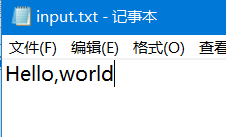
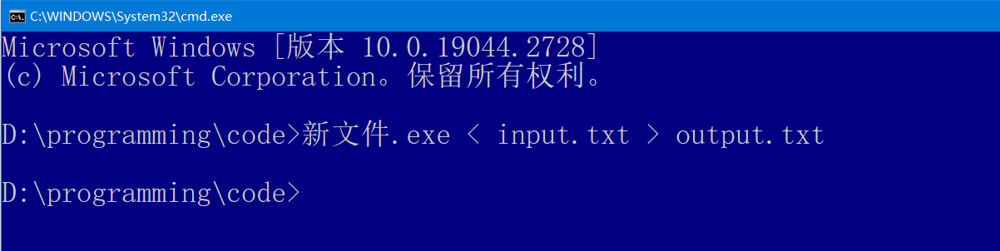

c++基础

#include <>  and  #include ""    的区别

<>里的头文件是标准库的头文件；  "" 里的头文件是 不属于标准库里的头文件，比如自己写的头文件

## 输入

1.读取数量不定的输入数据

预先不知道要输入多少个数时

```c++
 int n;
 while(cin >> n) //不断读取数据直到没有新输入或者输入数据类型不匹配为止
 {
     
 }
```


## 数据类型

| 类型     | 关键字 |
| :------- | :----- |
| 布尔型   | bool   |
| 字符型   | char   |
| 整型     | int    |
| 浮点型   | float  |
| 双浮点型 | double |
| 无类型   | void   |

| 类型                     | 位             | 范围                                                         |                                     |
| :----------------------- | :------------- | :----------------------------------------------------------- | ----------------------------------- |
| char                     | 1 个字节       | -128 到 127 或者 0 到 255                                    | char无符号还是有符号的取决于编译器  |
| unsigned char            | 1 个字节       | 0 到 255                                                     |                                     |
| signed char              | 1 个字节       | -128 到 127                                                  |                                     |
| unsigned int             | 4 个字节       | 0 到 4294967295                                              | unsigned int                        |
| [signed] int             | 4 个字节，32位 | -2147483648 到 2147483647，-21亿到21亿，-2e9到2e9            | 等价于int                           |
| unsigned short [int]     | 2 个字节       | 0 到 65,535                                                  | 等价于unsigned short                |
| [signed] short [int]     | 2 个字节       | -32768 到 32767                                              | 等价于short                         |
| [signed] long [int]      | 8 个字节，64位 | -9,223,372,036,854,775,808 到 9,223,372,036,854,775,807，-9e18到9e18 | 等价于long                          |
| unsigned long [int]      | 8 个字节       | 0 到 18,446,744,073,709,551,615， 1.8e19                     | 等价于unsigned long                 |
| [signed]long long [int]  | 16个字节，64位 |                                                              | 等价于 long long，是在c++11中定义的 |
| unsigned long long [int] | 16个字节，64位 |                                                              | 等价于unsigned long long            |
| float                    | 4 个字节       | 精度型占4个字节（32位）内存空间，+/- 3.4e +/- 38 (~7 个数字) |                                     |
| double                   | 8 个字节       | 双精度型占8 个字节（64位）内存空间，+/- 1.7e +/- 308 (~15 个数字) |                                     |
| long double              | 16 个字节      | 长双精度型 16 个字节（128位）内存空间，可提供18-19位有效数字。 |                                     |

## 字符串

也算学完了c++，找个时间看一下string的源码解析。[源码分析C++的string实现 - 知乎 (zhihu.com)](https://zhuanlan.zhihu.com/p/267896855)

1. 头文件

```cpp
#include <string>
```

2. string的创建

```cpp
string s1;     //未初始化，默认是空字符串，即""
string s2 = "c plus plus";   //初始化
```

3. string与c语言字符串的区别

   **string是一个类，而char是基本数据类型**

   string类的字符串不以 字符'\0' 结尾

4. string的输入输出cin、cout

5. 访问string中的字符用下标运算符[]

   需要注意一个问题：s[i] 是什么类型的？

   ```cpp
   string s = "niubi666";
   ```

   

5. 字符串的拼接用运算符  + 或 +=

6. string类的成员函数

   1. replace

   ```cpp
   1. string& replace(size_t pos, size_t n, const char *s);//将当前字符串从pos索引开始的n个字符，替换成字符串s。pos是第一个
   
   2. string& replace(size_t pos, size_t n, size_t n1, char c); //将当前字符串从pos索引开始的n个字符，替换成n1个字符c
   
   3. string& replace(iterator i1, iterator i2, const char* s);//将当前字符串[i1,i2)区间中的字符串替换为字符串s
   ```

   replace()会对源字符串进行更改，另外，返回的也是修改后的字符串


## 位运算符

| 符号 | 描述 | 运算规则                                                     |
| :--- | :--- | :----------------------------------------------------------- |
| &    | 与   | 两个位都为1时，结果才为1                                     |
| \|   | 或   | 两个位都为0时，结果才为0                                     |
| ^    | 异或 | 两个位相同为0，相异为1                                       |
| ~    | 取反 | 0变1，1变0                                                   |
| <<   | 左移 | 各二进位全部左移若干位，高位丢弃，低位补0                    |
| >>   | 右移 | 各二进位全部右移若干位，对无符号数，高位补0，对有符号数，补符号位（算术右移） |

什么是算术右移？什么是逻辑右移？

举例

```c++
int x;          // int 是 32位的，有符号数
x = 5 & 2;   // 5的二进制 00000……101   ， 2的二进制000000……010  
             // 101 & 010 对应位相与，得到  000……000  ， 000的十进制是0，即x=0
```


```c++
int x = 5;       // int 是 32 位的，且是有符号数
int y = x >> 1;  //  x所有位右移1
				//  5的二进制 0……101 全部右移1，高位补符号位0， 即 0……010
// y = x / 2   等价于  x >> 1
```

$$
\frac{x}{2^n} = x >> n
$$


## 文件重定向

[C语言--文件重定向_文件重定向是什么意思_墨上烟雨的博客-CSDN博客](https://blog.csdn.net/weixin_42704090/article/details/86657886)

在测试程序的时候，可能会反复从键盘上敲入数据，如果你不想反反复复地敲入数据的话，可以使用文件重定向命令。(文件重定向命令是操作系统的)

大多数**操作系统支持文件重定向**，这种机制能够 由==键盘输入==变为由==文件输入==，由==输出到屏幕==变为==输出到文件==

1. 重定向运算符有两个  <    >
2. 重定向输入命令  `xxx.exe < file`
3. 重定向输出命令  `xxx.exe > outfile`
4. 组合重定向命令  `xxx.exe < file > outfile`

说明：

1.  `xxx.exe` 是可执行程序，`file`是输入文件名，里面存放输入的数据； `outfile`是输出文件名，里面存放程序执行后的输出。
2. 在Windows系统下，这些命令中的 `xxx.exe` 是 `xxx.exe` ；在Linux系统下，`xxx.exe` 应该变为 `xxx`
3. 可执行程序，输入文件，输出文件应该在同一目录下
4. 输入文件名和输出文件名不能一样
5. 重定向运算符连接一个可执行文件和一个数据文件，不能用于连接一个数据文件和另一个数据文件，也不能用于连接一个可执行程序和另一个可执行程序；


举例实践：

我电脑上没有vs了，用dev-c++实现一下，

```c++
#include <stdio.h>

int main() {
	char ch;

	while ((ch = getchar()) != EOF) {
		putchar(ch);
	}

	return 0;
}
```

输入上述代码，然后编译，会生成一个exe文件


在当前目录下，新建两个txt文件


在input.txt中输入并保存。



在当前目录下，打开cmd


输入命令：



打开output.txt查看是否成功


## 引用

```c++
int i = 1;
```

这条语句做了两件事：

1. 开辟一个int空间分配给变量$i$，相当于给这片空间取了个名字叫$i$
2. 将1存放到这片空间。

```c++
int& r = i;
```

创建了一个变量$i$的引用$r$，$r$是这片空间的另一个名字.


引用和指针的区别：

1. 引用必须在创建的时候就初始化；指针没这个必要

2. 引用不能更改，指针可以修改

- 比如

  ```
  int i,j;
  int& r = i;
  int& r = j; //这条语句会报错，因为引用不能修改
  ```

3. 指针可以指向NULL,引用必须有对应空间。

**可以把引用理解为受限制的指针，指针相较于引用更加灵活。**

## 新for循环表示

```cpp
for(auto i in 容器)  // i是容器的每一个元素
{
    
}
```

等价python中的循环👇

```python
for i in 容器:
    
```


