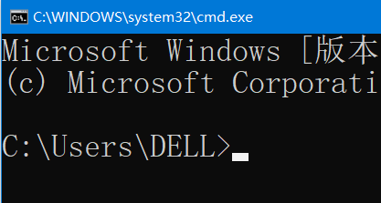
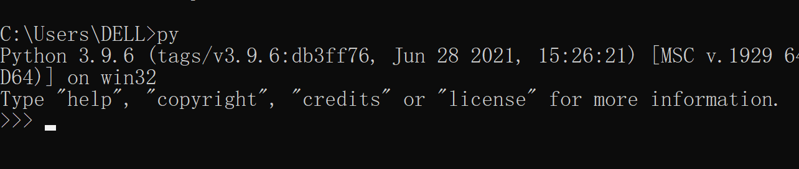
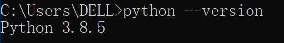

python基础

以下是python的简洁笔记，更多内容以后遇到了再添加


### python基础

#### 变量的命名规则

1. 变量名只能包含字母、数字和下划线。不能以数字打头
2. 变量名不能有空格，应该使用下划线分隔单词
3. 不能将python关键字和函数名作为变量名
4. 变量名应简短且具有描述性
5. 慎用小写字母l和大写字母O


变量名的本质到底是什么，这个学了汇编语言就知道了，挖个坑


#### 字符串

用一对单引号或者一对双引号括起来的连续的字符就是字符串，引号属于界定符，不是字符串的一部分。


在 Python 中，单引号（'）和双引号（"）可以用来创建字符串，并且它们在大多数情况下是等效的，没有本质的区别。

主要区别在于你可以在一个引号类型的字符串中使用另一种引号类型，而不需要进行转义。例如：

使用单引号创建字符串，可以在字符串中直接使用双引号，而不需要转义：

```python
string1 = 'He said, "Hello!"'    # 输出 He said, "Hello!"
```

使用双引号创建字符串，可以在字符串中直接使用单引号，而不需要转义：

```python
string2 = "I'm fine."   # 输出  I'm fine.
```

这种灵活性允许你在字符串中包含引号，而不需要使用转义字符。但是，如果你想在同一种引号类型的字符串中包含该引号本身，就需要使用转义字符。

例如，如果你想在单引号字符串中包含单引号本身，你可以使用转义字符：

```python
string3 = 'It\'s raining.'
```

同样地，如果你想在双引号字符串中包含双引号本身，你可以使用转义字符：

```python
string4 = "She said, \"I love Python!\""
```

需要注意的是，当你使用三重引号（'''或"""）创建多行字符串时，引号内的引号不需要转义，无论是单引号还是双引号。


三重引号

三重引号可以用于创建包含多行文本的字符串，例如长的文档字符串（docstring），或者在代码中需要跨多行的字符串。当使用三重引号创建字符串时，引号内的内容会被保留，而不是被解释器忽略。

下面是一个使用三重引号创建多行字符串的示例：

```python
string = '''
这是一个
多行字符串，
可以包含多行文本。
'''

print(string)
```

输出：

```python
                    #这里有空行，这是因为我们在输入回车的时候，字符串会隐式含有\n
这是一个
多行字符串，
可以包含多行文本。
```

请注意，三重引号创建的多行字符串可以用作注释，特别是用作函数或类的文档字符串。这是因为这些字符串会被解释器忽略，不会作为可执行代码执行。然而，三重引号本身并不是专门用于注释的语法结构，而是用于创建多行字符串的一种方式。


字符串可以用 `+` 合并（粘到一起），也可以用 `*` 重复：

```python
print(3 * 'un' + 'ium')
------
unununium
```

相邻的两个或多个 *字符串字面值* （引号标注的字符）会自动合并：

```python
print('Py' 'thon')
-----
Python
```

上面的方法不适用于 字符串变量

```python
a = 'Py'
b = 'thon'
print(ab)       # name 'ab' is not defined
print(a'thon')    # SyntaxError: invalid syntax
```


在用三重引号创建一个多行字符串的时候，我们会按下回车，这时候就会隐式有一个\n，如果我们在每一行的末尾加一个转义符,按照之前所学，

```python
string = '''
这是一个\
多行字符串，
可以包含多行文本。
'''

print(string)
-----
                       #这里有空行
这是一个\n多行字符串，      #两行会合并，并且显示出来\n
可以包含多行文本。
```

而实际上的输出是这样的

```python
                      #这里有空行
这是一个多行字符串，       #\n没有显式出来
可以包含多行文本。 
```

因此，回车写下的隐式\n该隐式还是隐式。

因此，我们可以在每行末尾加转义符来合并两行


由上所学，我们也可以这样创建一个多行字符串

```python
string = "1" \
         "2" \
         "3" \
         "4"

print(string)
-----
1234
```


使用方法修改字符串的大小写

```python
name = "ada lovelace"
name.title()           //返回值是 将每个单词的首字母大写 ;不改变本身
name.upper()           //返回值是 将字符全都改为大写；不改变本身
name.lower()           //返回值是 将字符全都改为小写；不改变本身
```


在字符串中使用变量

在字符串前加$f$ 能将字符串中大括号的内容识别为python的可执行语句，而不再是字符串

```python
first_name = "ada"
last_name = "lovelace"
full_name = f"{first_name} {last_name}"
print(full_name)
-----
ada lovelace
```


转义字符

转义符 \

在字符串中，当出现了 \ 反斜杠，反斜杠紧跟在某些特定字符之前时，它们组合起来表示一个特殊的字符序列。

例如：

换行符 \n

制表符 \t         --补空格使对齐


如果在字符串中，不想 \ 反斜杠被识别为转义符，可以这样做

```python
path = r"C:\path\to\file"          #在字符串前加r，就不会被识别为转义符了，而被识别为反斜杠
path = "C:\\path\\to\\file"        #用第一个转义符\来 表示一个单独的反斜杠
```


删除空白

```python
name.rstrip()   //返回值是 删除字符串结尾多余的空格 ；不改变本身
name.lstrip()   //返回值是 删除字符串开头多余的空格 ；不改变本身
name.strip()    //返回值是 删除字符串两边多余的空格 ；不改变本身
```


字符串也支持索引和切片


#### 整数和浮点数

整数和浮点数支持的运算 ：加、减、$*$乘、$/$除、$**$乘方、$//$整除、$\%$取余

浮点数和整数运算的结果是浮点数

```python
age = 14_000_000_000    #当数字较大的时候可以用下划线进行分组，使清晰易读
print(age)
---------
14000000000
```

 

#### 同时给多个变量赋值

可以在一行代码中给多个变量赋值，这有助于缩短程序并提高其可读性

```python
x, y, z = 0, 0, 0    #用逗号进行分隔，按顺序进行赋值
```


#### 常量

**一般常量名的定义是全大写**

```python
MAX_CONNE = 5000
```

#### 列表

列表是可变的序列,用 [] 表示列表，用逗号分隔列表中的元素

```python
bicycles = ['trek','redline','specialized']
print(bicycles[0])    #使用下标来访问列表中的元素，正向从0开始，逆向从-1开始
bicycles[0] = 'ducati'   #修改列表中某个位置的元素
bicycles.append('suzuki')   #在列表末尾添加元素
bicycles.insert(0,'honda') #将 下标从0开始的元素都往后移动一位，然后将 'honda'放到下标是0的位置
del bicycles[0]   #删除下标是0的元素，下标从1往后的元素往前移动一位
bicycles.pop()   #返回值是  列表的最后一个元素，并删除列表中的最后一个元素
#bicycles.pop(x) 返回值是 列表中下标为x的元素，并在列表中删除该元素。默认是删除并返回最后一个元素
bicycles.remove('ducati')  # 删除指定元素，且只删除列表从正向开始找第一个出现的 该元素
len(bicycles)  #返回列表的长度
bicycles.reverse()  #将列表逆序
```

sort()方法语法：

```
list.sort(cmp=None, key=None, reverse=False)
```

参数

- cmp -- 可选参数, 如果指定了该参数会使用该参数的方法进行排序。
- key -- 主要是用来进行比较的元素，只有一个参数，具体的函数的参数就是取自于可迭代对象中，指定可迭代对象中的一个元素来进行排序。
- reverse -- 排序规则，**reverse = True** 降序， **reverse = False** 升序（默认）。

返回值

该方法没有返回值，但是会对列表的对象进行排序。


**sort 与 sorted 区别：**

sort 是应用在 list 上的方法，sorted 可以对所有可迭代的对象进行排序操作。

list 的 sort 方法是对已经存在的列表进行操作，无返回值；而python自带的函数 sorted 方法返回值是排好序的列表或其他可迭代对象，不改变本身


sorted 语法：

```
sorted(iterable, cmp=None, key=None, reverse=False)
```

参数说明：

- iterable -- 可迭代对象。
- cmp -- 比较的函数，这个具有两个参数，参数的值都是从可迭代对象中取出，此函数必须遵守的规则为，大于则返回1，小于则返回-1，等于则返回0。
- key -- 主要是用来进行比较的元素，只有一个参数，具体的函数的参数就是取自于可迭代对象中，指定可迭代对象中的一个元素来进行排序。
- reverse -- 排序规则，reverse = True 降序 ， reverse = False 升序（默认）。


#### for循环和range()函数

用for循环来遍历列表

```python
bicycles = ['trek','redline','specialized']
for i in bicycles:       # 每一个 i 对应 列表中的一个元素；print函数自带换行
    print(i)
-----
trek
redline
specialized
```


```python
for i in range(a,b,c):   # [a,b)，步长是c   每一个i对应一个数字
	#循环体
```


#### 数字列表的创建

```python
numbers = [range(1,6)]
print(numbers)
-------
[1,2,3,4,5]
```


#### 数字列表常用的统计函数

```python
digits = [1,2,3,4,5,6,7,8,9,0]
min(digits)
max(digits)
sum(digits)
```


#### 列表解析

```python
squares = [value**2 for value in range(1,11,2)]
print(squares)
-------
1
9
25
49
81
```


#### 切片

前面我们提到用  列表名[下标] 的方法来访问 列表中的某个元素，从而可以对该元素进行一些处理；但是我们该如何访问列表中的多个元素呢？使用切片

```python
列表名[a:b:c]    #切片的一般形式，返回值是 原列表下标[a,b)步长为c的元素的 一个列表
切片是个情况比较复杂的语法，希望有一天能碰到一个非常全面且清晰的教程
```


#### 列表的复制

```python
my_foods = ['pizza', 'falafel', 'carrot']
his_foods = my_foods[:]   # 深拷贝 ，his_foods与my_foods对应的内存空间不相同
her_foods = my_foods       # 浅拷贝， her_foods与my_foods对应同一片内存空间
```

#### 列表的合并

```python
a = [1,2,3]
b = [4,5,6]
c = a + b
print(c)
-----
[1,2,3,4,5,6]
```


#### 元组

元组是不可变的序列，只不过元组的元素不能改变；元组用圆括号标识,可以用下标访问

```python
dimensions = (400,50)
print(dimensions[0])
print(dimensions[1])
#dimensions[0] = 20  尝试修改元组的元素会报错
------
400
50
```


<font color = #a61b29> 严格地说，元组是由逗号标识的，圆括号只是让元组看起来更清晰、整洁。除了空元组，括号可以省略。但元组是更大的表达式的一部分或会产生语法歧义的情况，括号不能省略</font>

```python
name = ()  #空元组
name = (1,)     # 圆括号可以省略，逗号不能省略，因为逗号是用来说明是元组的。
print(type(name))
print(name)
-------
tuple
(1,)
```


只需要知道这个本质就可以了，我们以后定义或使用元组的时候都要带上圆括号。


虽然不能修改元组的元素，但是可以给元组变量重新赋值

```python
dimensions = (400,50)
dimensions = (400,100)
```


#### 运算符

##### 比较运算符

$>,>=,<,<=,==,!=$

##### 逻辑运算符

and、or、not


检查特定值是否包含在列表中

```python
banned=['andrew','car','david']
name = ['marie']

print(name in banned)
print(name not in banned)
```


#### if语句

```python
age = 12
if age < 4:
    print("Your admission cost is $0.")
elif age < 18:
    print("Your admission cost is $25.")
else:
    print("Your admission cost is $40.")
```

#### pass语句

占坑用的


#### 确定列表是否为空

```python
s = []
if s:       # 列表名作布尔表达式时，如果为空，返回False；至少存在一个元素，返回True
    #
```

#### 字典

字典的元素是键值对，用花括号标识，元素之间用逗号分隔，键值之间由冒号标识

键不能重复出现，键必须是可哈希的对象

```python
alien = {'color':'green','points':5}
```


获取指定键的值

```python
字典名[键]   #得到的就是这个键的值
print(alien['color'])
------
green
```


如果字典中不存在 指定的键 对应的键值对就会报错

```python
alien['nml']
-----
KeyError
```

因此，当我们不确定字典中是否存在该键值对而又想访问这个键对应的键值对的时候，使用get函数

get()方法语法：

```python
dict.get(key[, value]) 
```

参数

- key -- 字典中要查找的键。
- value -- 可选，如果指定键的值不存在时，返回value。value默认为None


添加键值对

```python
alien['x_position'] = 0
alien['y_position'] = 25
print(alien)
---------
{'color':'green','points':5,'x_position':0,'y_position':25}
```


字典的排列顺序是添加的顺序


修改给定键对应的值

```python
alien['color'] = 'yellow'
print(alien)
-------
{'color':'yellow','points':5,'x_position':0,'y_position':25}
```


删除指定键值对

```python
del alien['color']
print(alien)
-------
{'points':5,'x_position':0,'y_position':25}
```


#### 遍历字典


```python
tinydict = {'Google': 'www.google.com', 'Runoob': 'www.runoob.com', 'taobao': 'www.taobao.com'}


# 遍历字典列表
for key, values in tinydict.items():
    print(key, values)
-----

Google www.google.com
Runoob www.runoob.com
taobao www.taobao.com
```

```python
for i in tinydict.items():
    print(i)
------
('Google', 'www.google.com')
('Runoob', 'www.runoob.com')
('taobao', 'www.taobao.com')
```

items() 方法把字典中每对 key 和 value 组成一个元组，并把这些元组放在列表中返回。


```python
tinydict = {'Google': 'www.google.com', 'Runoob': 'www.runoob.com', 'taobao': 'www.taobao.com'}

for key in tinydict.keys():    #遍历键
    print(key)
-----
Google
Runoob
taobao
```

```python
tinydict = {'Google': 'www.google.com', 'Runoob': 'www.runoob.com', 'taobao': 'www.taobao.com'}

for key in tinydict:    #遍历键
    print(key)
-----
Google
Runoob
taobao
```

这两种方法没有区别

**keys方法把字典中的key放入列表中返回，如果把字典名当作可迭代对象的话，就相当于keys方法**

因此，可以使用 `in` 或者 `not in dic.keys()` 来判断某个key是否是字典`dic` 里的关键字


```python
tinydict = {'Google': 'www.google.com', 'Runoob': 'www.runoob.com', 'taobao': 'www.taobao.com'}

for value in tinydict.values():    #遍历值
    print(value)
-------
www.google.com
www.runoob.com
www.taobao.com
```

 

#### 集合

集合的元素是不重复的，用一对花括号标识，用逗号分隔元素。

集合的元素可以是数字，字符串，元组，不能是键值对、列表。

原因如下：

首先了解 hashable ，可哈希

在Python中，可哈希（Hashable）是指一个对象具有哈希值（Hash Value）。哈希值是一个整数，用于唯一标识对象。不可哈希对象则相反，它们的哈希值可能会发生变化或者无法计算哈希值。例如，列表和字典是不可哈希的，因为它们是可变的，并且它们的值可能会改变。

可哈希的对象包括但不限于整数、浮点数、字符串、元组等不可变类型。这些对象的哈希值是根据它们的值计算得出的，因此具有相同值的对象将具有相同的哈希值。

不可变的对象计算出的哈希值是唯一的，可唯一标识该对象。

以后有时间了解一下这个哈希函数是什么


集合要求元素必须是可哈希对象的原因也很明显，因为集合要求所有元素都不能重复，根据的就是元素的哈希值不相同。对于列表和键值对这种可变数据类型，计算出的哈希值是不固定的，所以集合中的元素不能是可变数据类型对象


集合的创建

```python
class set([iterable])
```

set函数的参数是一个可选的 iterable（可迭代对象），将可迭代对象的每一个元素放入到集合中，并返回该集合。

```python
a = {}
a = set()
# 空集合的创建
a = {1,2,'3sd',(4,)}
b = set('abcda')     #集合的去重
print(b)
----
{'a','b','c','d'}
```


```python
language = {'a':'python','b':'C','c':'Ruby','d':'python'}

for value in language.values():
    print(value)
---------
python
C
Ruby
python

for value in set(language.values()):
    print(value)
---------
C
python
Ruby
```


总结：

iterable 可迭代  ----如果一个对象可迭代，说明可以遍历

hashable 可哈希  ---如果一个对象可哈希，说明这个对象是不能变的，如字符串常量，数字常量，元组。可哈希就是唯一确定的，可变就不是唯一确定的了。


#### 用户输入input()

函数input()让程序暂停运行，等待用户输入一些文本。将用户输入（字符串）作为返回值。

```python
message = input("input something:")
```

input()函数接受一个参数——要求用户输入什么信息的提示或说明


#### 数据类型转换

```python
s = "21"

s = int(s)
print(type(s))
print(s)
----
<class'int'>
21
```


### 函数

```python
def functionname( parameters ):
   '''文档注释'''
   function_suite
   return [expression]
```


三个单引号括起来的字符串称为 文档字符串，python使用文档字符串来生成函数的文档。

函数的返回值为空的话，默认返回None


函数调用的三种方法：

按位置传入参数；显式地将实参传递给形参；形参的默认值

如果一个形参有默认值，把这个形参放到最后面去。

这三个方法会混合着用。不难理解。

#### **默认值参数的需要注意的地方**

默认值在 *定义* 作用域里的函数定义中求值，所以：----->这个东西的话，需要进一步的学习；额，以后才能理解

```
i = 5

def f(arg=i):
    print(arg)

i = 6
f()
```

上例输出的是 `5`。

**重要警告：** 默认值只计算一次。默认值为列表、字典或类实例等可变对象时，会产生与该规则不同的结果。例如，下面的函数会累积后续调用时传递的参数：

```python
def f(a, L=[]):
    L.append(a)
    return L

print(f(1))
print(f(2))
print(f(3))
```

输出结果如下：

```python
[1]
[1, 2]
[1, 2, 3]
```

不想在后续调用之间共享默认值时，应以如下方式编写函数：

```python
def f(a, L=None):
    if L is None:
        L = []
    L.append(a)
    return L
```


#### 函数参数中的 / 和 *

```python
def f(pos1, pos2, /, pos_or_kwd, *, kwd1, kwd2):
    #
```

当函数形参出现 / 或 * 时，要求传参的时候， /左边的参数必须按位置传递，*右边的参数必须显式传递给形参

中间的 可以按照位置也可以显式传递


python在函数传递的时候与c/c++不同，c/c++在传递参数的时候是值传递，即执行函数的时候，给形参分配空间，将实参的值赋值给形参。函数执行后不会影响实参。python则相反，直接传入实参，函数执行直接影响实参。

举个例子：

```python
def f(name):
    #函数体


name = [1,2,3]
f(name)          #传入函数的就是name，函数执行会影响本身
f(name[:])       #函数执行不会影响name本身
```


#### 传入任意数量的实参

有时候不能确定实参的数量，我们需要使用以下方法

```python
def make_pizza(*toppings):
    print(toppings)
```


形参名 *toppings 中的 * 号让python创建一个名为toppings的空元组，并将收到的所有值都封装到这个元组中。


```python
def make_pizza(a,b,c,*toppings):
    #
```

接受任意实参的形参与其他形参的组合使用：

把*toppings这个形参放到最后，前面配对完了之后，剩下的都是toppings这个元组的元素

`*toppings` 形参后的任何形式参数只能是仅限关键字参数，即只能用作关键字参数，不能用作位置参数：

#### 传入任意数量的键值对

```python
def build_profile(**user_info):
    print(user_info)


build_profile(location='p',field='s',first='f') #可以继续添加任意数量的键值对

--------
{'location': 'p', 'field': 's', 'first': 'f'}

build_profile(**{'location':'p','field':'s','first':'f'}) #另一种方法

```

形参 **user_info中的星号让python创建一个名为 user_info的空字典，并将收到的所有键值对放到字典中

可以发现，传入参数的时候， `location`, `field`, `first` 到了字典中都是键，且是**字符串类型**的。


如果遇到这种情况会发生什么？

```python
def build_profile(name,**user_info):
    print(user_info)

build_profile(1,name = 'n',location='p')
-------
TypeError: build_profile() got multiple values for argument 'name'
```

原因是，我们想给形参name赋值1，将剩余的放到字典中。但是我们调用函数时使用了 `name='n'`

python将 `name='n'` 当作了给形参赋值。导致形参name有了多个values

解决办法

```python
def build_profile(name,/,**user_info):
    print(user_info)

build_profile(1,name = 'n',location='p')

-----
{'name': 'n', 'location': 'p'}
```

这样 形参name就一定会根据 位置赋值，不会再出现也可以根据关键字赋值的可能了。

#### 解包实参列表

函数调用要求独立的位置参数，但实参在列表或元组里时，要执行相反的操作。例如，内置的 range() 函数要求独立的 start 和 stop 实参。如果这些参数不是独立的，则要在调用函数时，用 * 操作符把实参从列表或元组解包出来：

```python
>>>
list(range(3, 6))            # normal call with separate arguments
[3, 4, 5]
args = [3, 6]
list(range(*args))            # call with arguments unpacked from a list
[3, 4, 5]
同样，字典可以用 ** 操作符传递关键字参数：

>>>
def parrot(voltage, state='a stiff', action='voom'):
    print("-- This parrot wouldn't", action, end=' ')
    print("if you put", voltage, "volts through it.", end=' ')
    print("E's", state, "!")

d = {"voltage": "four million", "state": "bleedin' demised", "action": "VOOM"}
parrot(**d)
-- This parrot wouldn't VOOM if you put four million volts through it. E's bleedin' demised !
```

### lambda表达式

[`lambda`](https://docs.python.org/zh-cn/3/reference/expressions.html#lambda) 关键字用于创建小巧的匿名函数。
Lambda函数是一种匿名函数，也称为函数字面值。它是一种特殊的函数形式，可以在需要函数的地方使用，并且不需要使用`def`关键字来定义函数。

Lambda函数的基本语法如下：

```python
lambda arguments: expression
```

其中，`arguments`是函数的参数，可以是一个或多个，用逗号分隔。`expression`是函数的返回值，也可以是一个表达式。

Lambda函数通常用于简单的函数逻辑，它们可以作为参数传递给其他函数或用于函数式编程中的映射、过滤和排序等操作。由于Lambda函数是匿名的，它们没有函数名，因此通常使用时直接调用或赋值给变量以供后续使用。

以下是一些Lambda函数的示例：

```python
# Lambda函数计算两个数的和
add = lambda x, y: x + y
print(add(2, 3))  # 输出: 5

# Lambda函数用于排序
numbers = [4, 2, 7, 1, 5]
sorted_numbers = sorted(numbers, key=lambda x: x % 2)
print(sorted_numbers)  # 输出: [2, 4, 7, 1, 5]

# Lambda函数作为参数传递给其他函数
result = map(lambda x: x * 2, [1, 2, 3, 4])
print(list(result))  # 输出: [2, 4, 6, 8]
```

Lambda函数在需要简单的函数逻辑，并且函数的使用范围有限时非常方便，但对于复杂的函数逻辑，通常还是推荐使用普通的命名函数。


### 模块

将函数/类存储在模块中

模块是扩展名为.py的文件。

举个例子：

```python
def make_pizza():  # 在 pizza.py 文件中定义了这样一个函数
    #函数体
```

在pizza.py所在的目录下，新建一个py文件

```python
import pizza    #在新py文件中导入pizza模块
#这样我们就可以直接调用在pizza.py文件中定义好的函数make_pizza()
pizza.make_pizza()   #调用方法是 模块名.函数名
```


导入特定的函数

```python
from moudle_name import function_name #只导入某个模块的某个函数
from moudle_name import function_name1,function_name2,function_name3 #导入某个模块任意数量的某些函数
```


指定别名

```python
from moudle_name import function_name as fn #给模块的function_name函数取个别名
import moudle_name as mn  #给导入的模块取个别名
```

给函数取别名，是因为导入的函数名可能与程序中的名称有冲突，或者函数名太长了，简写一下

给模块取别名就是想简写的。


导入模块中的所有函数

```python
from pizza import *
```


将pizza.py文件中所有的函数复制到该文件中，这样做就不需要使用 `模块名.函数名`的调用方式了，直接调用就可以了。

缺点：

如果程序中定义的函数名称与模块中的名称相同，python遇到名称相同的函数名或变量名会进行覆盖。


### 命名空间


### 模块的搜索路径

前面介绍了导入模块的方法，接下来我们需要学习模块的搜索路径，这样如果显示没找到模块，或者模块使用错了，我们好根据模块的搜索路径，将其放置到正确的地方，以使模块能被找到或者能找到我们想使用的模块。

我们在安装python的时候会安装一些python自带的一些模块，被称为内置模块（built-in），这些模块被列在这个变量里`sys.builtin_module_names`

sys也是python内置的模块，就在这里面。


输入上面的代码我们就可以看到内置模块。


举个例子来说明模块的搜索路径：

当python解释这一条语句时 `import spam`，

python首先会在 `sys.builtin_module_names` python的内置模块中找。如果没找到，就去 变量 `sys.path`中找，print一下，就会发现，这个列表里放的全是路径。解释器会按照列表的顺序搜索,直到找到第一个模块

这些路径分三类：

1. 当前py文件所在的目录
2. python的环境变量（PYTHONPATH）
3. 不太了解，以后再说。


导入模块时搜索路径的顺序也可以改变.这里分两种情况:

1,通过sys.path.append(),sys.path.insert()等方法来改变,这种方法当重新启动解释器的时候,原来的设置会失效.

2,改变PYTHONPATH,这种设置方法永久有效。


### windows系统的环境变量

我们先来理解一下windows系统的环境变量，每次打开cmd之后，都会有一个路径。

我们都知道，cmd解释器交互式窗口的作用就是，我们输入命令并执行，系统返回信息。

我们的这些命令本质上是exe文件。

如果我在 `C:\Users\DELL\`的目录下，放一个 `QQ.exe`,我输入 `QQ.exe` 之后，程序就会执行。因此，如果想用cmd打开exe文件的话，需要先cd到exe文件所在的文件夹，然后输入执行就行了。

在 Windows 的命令解释器（cmd.exe）中，当你输入一个命令时，它会按照以下顺序搜索可执行文件：

1. 当前目录：首先，命令解释器会在当前工作目录中查找可执行文件。如果找到匹配的可执行文件，则执行该文件。
2. 系统目录：如果在当前目录中找不到匹配的可执行文件，命令解释器会搜索系统目录。系统目录的路径通常为 `C:\Windows\System32`。
3. Windows 目录：如果在系统目录中找不到匹配的可执行文件，命令解释器会搜索 Windows 目录。Windows 目录的路径通常为 `C:\Windows`。
4. PATH 环境变量：如果在以上位置都找不到匹配的可执行文件，命令解释器会按照 PATH 环境变量中指定的路径顺序搜索可执行文件。PATH 环境变量包含了一系列用分号分隔的目录路径，命令解释器会依次在这些路径中查找可执行文件。

如果命令解释器找到匹配的可执行文件，它将执行该文件；否则，将显示“命令未找到”的错误消息。

需要注意的是，如果在不同位置存在同名的可执行文件，命令解释器将使用搜索顺序中的第一个找到的文件。因此，当存在多个同名的可执行文件时，确保路径的优先级正确以避免意外的行为。

-----------------------------------------------------------------------------------------------------------------------------------------------------------

对于 Windows 的命令解释器（cmd.exe）内置的命令，执行文件并不是以可执行文件的形式存在，而是作为内部命令（Internal Command）直接内置在命令解释器中。

内置命令在命令解释器的可执行文件中实现，当你输入内置命令时，命令解释器会直接调用内部代码来执行相应的功能，而不需要搜索外部的可执行文件。

一些常见的内置命令包括 `cd`、`dir`、`copy`、`del` 等。这些命令可以直接在命令提示符中执行，无需指定可执行文件的路径。

要查看命令解释器中提供的内置命令列表，可以在命令提示符中输入 `help` 命令，它会显示可用的内部命令列表和简要说明。

需要注意的是，内置命令在命令解释器中运行，而不是作为单独的可执行文件，因此无法在其他程序中直接调用内置命令。


### 类

本书提到的太简单且不涉及底层，不记录了。以后会遇到更好的教程。


类中的函数称为方法。


约定俗成

类名应采用驼峰命名法，类名中不适用下划线，类名的每个单词的首字母大写。

实例名和模块名都采用小写格式，单词之间用下划线隔开。

每个类/模块在定义的时候都要跟上一个文档字符串，简要描述类/模块的功能。

在类中，使用一个空行来分隔方法。

在模块中，使用两个空行分隔类和函数。

在运算符前后使用空格，在逗号后面用空格。


### python解释器

python interpreter

python解释器将python代码一行一行的转换为机器码或字节码，然后交给cpu执行。跟c/c++编译器的区别是，编译器将程序所需的文件进行整合编译，转换成一个exe文件。我们执行exe文件，cpu开始执行。

说实话，我们学习的python，这门语言其实是由解释器定义的。

开发者告诉我们python该怎么用，其实就是开发者编写的解释器会怎样去识别代码。


我们在安装python的时候，必须将 python解释器添加到环境变量。这样我们就可以在电脑的任何位置通过cmd来执行python解释器

打开cmd，输入 `py` 命令，就会执行python解释器



这 `>>>` 意味着我们已经打开了python解释器的交互模式，输入python代码回车后就会被执行。

退出python解释器的交互模式的方法是

1. ctrl+z 回车
2. 输入quit() 回车


退出 Python 解释器后，再次进入时，之前在 Python 解释器中定义的函数和变量就丢失了。因此，编写较长程序时，建议用文本编辑器代替解释器，执行文件中的输入内容，这就是编写 *脚本* 。也就是我们的py文件，即模块。


py文件的执行顺序：

从顶部开始顺序执行。

遇到定义的函数，只执行函数名，执行函数名的目的是让python知道有这么个函数。不执行函数内部，只有发生函数调用的时候才执行函数内部。

遇到定义的类，这个不太清楚，需要先了解一下类。以后再说，挖坑了。


与c/c++不同的是，c/c++执行是从main函数开始执行的，而python是从文件开始执行的。

其实，让我来说的话，也有迹可循。c/c++使用的是编译器，main函数前的全局变量、函数、类都已经放到了内存中。而python使用的是解释器，全局变量、函数、类都要先执行一下，即全局变量直接放到内存，函数名和类名那一行执行一下，相当于声明，告诉python有这个函数。如果python也要从main开始执行的话，前面的全局变量、函数声明、类声明怎么办呢？你说是吧。


一份典型的python文件

```python
#/usr/bin/env/ python     　　　　   #(1) 起始行
#"this is a test module"     　　　　 #(2) 模块文档(文档字符串)
import sys
import os　　　　　　　　　　　　　　#(3) 模块导入

debug = True   　　　　　　　　　　　#(4) (全局)变量定义
class FooClass (object):
    'foo class'
    pass                           #(5) 类定义(若有)
def main():
    'test function'
    foo = FooClass()
    if debug:
        print 'ran test()'         #(6) 函数定义(若有)
if __name__ == '__main__':
    main()
```

Python引入了变量`__name__`，当文件是被调用时，`__name__`的值为模块名，当文件被执行时，`__name__`为`'__main__'`

也就是说，如果py文件被import到其他文件的，即调用文件，此时 `__name__`的值为 py文件的名字 ，主程序不会执行。 当py文件被执行的时候，main()就会被执行。


### 以脚本方式执行模块

可以用以下方式运行 Python 模块：

```
python 文件名.py <arguments>
```

具体还是不会用，没有具体的例子，接着往后看吧。

这种操作常用于为模块提供便捷用户接口，或用于测试（把模块当作执行测试套件的脚本运行）。

这句话也不太理解。。。


### python标准库

python标准库是一组模块，安装python的时候就包含它。成为了python语言的一部分了。


### 异常

异常也属于python编程的一部分。


### 读写文件

经常需要读取文件的数据，接下来看看怎么使用python来读取文件的数据。


什么是对象？对象就是一个有属性和方法的实体。

```python
file_object = open('filename', 'mode')
```

file_name:文件名，如果文件不在当前目录中需要指定路径


mode参数可以不写，默认mode参数是“r”。mode参数如下：

• ‘r’ – 只读模式，当文件处在“只读”的模式时使用。

• ‘w’ –写入模式，将新信息编辑写入文件中的时候使用（在使用该模式的时候、任何现存的同名文件的内容将会被擦除、从而写入新的内容）

慎用该模式：哪怕仅仅是运行了file=open(“filename”, “w”)这句话，那么该文件中所有内容全部被擦除。

• ‘a’ – append模式，将新数据加到文件末尾，不会擦除现存的同名文件的内容。

• ‘r+’ – 特殊的“读取”+“写入”模式，当同时存在读写操作的时候使用。


返回值是文件对象

文件对象的方法：

| 文件对象方法    | 执行的操作                                                   |
| --------------- | ------------------------------------------------------------ |
| f.close()       | 关闭文件，文件使用完毕一定要关掉，否则文件数据易被修改       |
| f.readlines()   | 读取所有行，返回一个 seq 可迭代对象                          |
| f.write(string) | 把 *string* 的内容写入文件，并返回写入的字符数。需要在w模式下 |
| f.read()        | 读取并返回整个文件的内容，返回值是空字符串                   |
|                 |                                                              |
|                 |                                                              |

f.write的应用：

```python
filename = 'programming.txt'
with open(filename,'w') as f:
    f.write("I love programming.")
    f.write("I love creating new games")
------filename的文件内容
I love programming.I love creating new games
```

write不会像print那样自动换行，因此如果要输入多行的话，需要在字符串后面加上 \n

```python
filename = 'programming.txt'
with open(filename,'w') as f:
    f.write("I love programming.\n")
    f.write("I love creating new games.")
------filename的文件内容
I love programming.
I love creating new games.
```


常用的打开文件的方式：

```python
with open() as file_object:
    #对文件的操作

#file_object的作用域是在with代码块内。
#使用这种方式较open与close的好处是， 系统会在合适的位置关闭文件。
```

### json存储结构化数据

从文件写入或读取字符串很简单，数字则稍显麻烦，因为 read() 方法只返回字符串，这些字符串必须传递给 int() 这样的函数，接受 '123' 这样的字符串，并返回数字值 123。保存嵌套列表、字典等复杂数据类型时，手动解析和序列化的操作非常复杂。

json模块能够让你将python的数据结构存储到文件中，并在程序再次运行时加载文件中的数据。你也可使用json在python程序之间分享数据。更重要的是，json数据格式并非python专用，这让你能够将以json格式存储的数据与使用其他编程语言的人分享。

> json（JavaScript Object Notation）格式最初是为JavaScript开发的，但随后成了一种常见格式，被包括python在内的众多语言采用

#### json的简单使用

```python
import json
numbers = [2,3,5,7,11,13]

filename = 'numbers.json'
with open(filename,'w') as f:
    json.dump(numbers,f)           #将numbers写入 filename中
```

打开numbers.json文件，显示的就是 [2,3,5,7,11,13]


```python
import json
filename = 'numbers.json'
with open(filename) as f:
    numbers = json.load(f)

print(numbers)
-------
[2,3,5,7,11,13]
```

#### json的作用

使用json来保存用户生成的数据大有裨益，因为如果不以某种方式存储，用户的信息会在程序停止运行时丢失。

举例说明：

先看两个程序

1. 提示用户首次运行时输入自己的名字，并在再次运行程序时记住他。

```python
import json
username = input("What's your name?")

filename = 'username.json'
with open(filename,'w') as f:
    json.dump(username,f)
# 这样就把用户的名字保存在了json文件中。
```

2. 向用户发出问候

```python
import json
filename = 'username.json'

with open('filename') as f:
    username = json.load(f)
    print(f"Welcome back,{username}")
# 这样就把json中存放的用户名字取出来了。
```


接下来，我们将两个程序合并，并完成以下功能：

如果用户是首次运行程序，需要输入自己的名字。如果用户再次运行程序时，向用户发出问候

```python
import json

filename = 'username.json'

try:
    with open(filename) as f:
        username = json.load(f)
except FileNotFoundError:
    username = input("What's your name?")
    with open(filename,'w') as f:
        json.dump(username,f)
else:
    print(f"Welcome back,{username}")
```


### 代码重构

虽然代码能够正确的运行，但是不利于以后的扩展，或者说，代码不利于理解。为此我们需要重新规划代码的结构，使代码能够更加清晰，更容易理解，更容易扩展。

重构代码是指对现有代码进行改进、重组和优化的过程，以改善代码的可读性、可维护性、性能或其他方面的质量。

下面是一般性的重构代码的步骤：

1. 确定重构的目标：明确想要改善的方面，如代码结构、命名规范、性能等。
2. 创建测试用例：确保在重构过程中不会引入新的错误。编写测试用例来验证代码在重构后的行为是否与重构前相同。
3. 分解代码：将大块的代码分解为更小的、可重用的函数或类。这有助于提高代码的可读性和可维护性。
4. 提取重复代码：找出重复出现的代码片段，并将其提取为单独的函数或类。这样可以减少代码冗余，提高代码的复用性。
5. 简化复杂的逻辑：如果存在复杂的条件判断、嵌套循环或过长的函数，考虑简化逻辑结构，使代码更易于理解和调试。
6. 重命名和重构命名规范：确保变量、函数和类的命名符合一致的规范，并更具表达力和可读性。
7. 消除魔法数字和硬编码：将代码中的魔法数字和硬编码的常量提取为命名常量或配置项，以增加代码的可维护性。
8. 性能优化：根据需求和性能测试结果，对性能瓶颈进行优化。这可能涉及算法改进、数据结构优化或并发处理等方面。
9. 逐步测试和验证：每次进行重构后，运行测试用例并验证代码的行为是否如预期。确保没有引入新的错误或不良影响。
10. 文档更新：及时更新代码文档、注释或相关文档，以反映重构后的代码结构和行为。

重构代码是一个迭代的过程，可以按需重复上述步骤，直到达到预期的代码质量和可维护性。此外，重构代码需要谨慎操作，并在保证代码行为正确性的前提下进行。


### 虚拟环境

Python应用程序通常会使用不在标准库内的软件包和模块。应用程序有时需要特定版本的库，因为应用程序可能需要修复特定的错误，或者可以使用库的过时版本的接口编写应用程序。

这意味着一个Python安装可能无法满足每个应用程序的要求。如果应用程序A需要特定模块的1.0版本但应用程序B需要2.0版本，则需求存在冲突，安装版本1.0或2.0将导致某一个应用程序无法运行。

这个问题的解决方案是创建一个 [virtual environment](https://docs.python.org/zh-cn/3/glossary.html#term-virtual-environment)，一个目录树，其中安装有特定Python版本，以及许多其他包。

然后，不同的应用将可以使用不同的虚拟环境。 要解决先前需求相冲突的例子，应用程序 A 可以拥有自己的 安装了 1.0 版本的虚拟环境，而应用程序 B 则拥有安装了 2.0 版本的另一个虚拟环境。 如果应用程序 B 要求将某个库升级到 3.0 版本，也不会影响应用程序 A 的环境。

#### 创建虚拟环境

用于创建和管理虚拟环境的模块称为 [`venv`](https://docs.python.org/zh-cn/3/library/venv.html#module-venv)。[`venv`](https://docs.python.org/zh-cn/3/library/venv.html#module-venv) 通常会安装你可用的最新版本的 Python。如果您的系统上有多个版本的 Python，您可以通过运行 `python3` 或您想要的任何版本来选择特定的Python版本。

要创建虚拟环境，请确定要放置它的目录，并将 [`venv`](https://docs.python.org/zh-cn/3/library/venv.html#module-venv) 模块作为脚本运行目录路径:

```
python -m venv tutorial-env
```

这将创建 `tutorial-env` 目录，如果它不存在的话，并在其中创建包含 Python 解释器副本和各种支持文件的目录。

虚拟环境的常用目录位置是 `.venv`。 这个名称通常会令该目录在你的终端中保持隐藏，从而避免需要对所在目录进行额外解释的一般名称。 它还能防止与某些工具所支持的 `.env` 环境变量定义文件发生冲突。

创建虚拟环境后，您可以激活它。

#### 激活虚拟环境

在Windows上，运行:

```
tutorial-env\Scripts\activate.bat
```

在Unix或MacOS上，运行:

```
source tutorial-env/bin/activate
```

（这个脚本是为bash shell编写的。如果你使用 **csh** 或 **fish** shell，你应该改用 `activate.csh` 或 `activate.fish` 脚本。）

激活虚拟环境将改变你所用终端的提示符，以显示你正在使用的虚拟环境，并修改环境以使 `python` 命令所运行的将是已安装的特定 Python 版本。 例如：

```
$ source ~/envs/tutorial-env/bin/activate
(tutorial-env) $ python
Python 3.5.1 (default, May  6 2016, 10:59:36)
  ...
>>> import sys
>>> sys.path
['', '/usr/local/lib/python35.zip', ...,
'~/envs/tutorial-env/lib/python3.5/site-packages']
>>>
```

#### 关闭虚拟环境

To deactivate a virtual environment, type:

```
deactivate
```

into the terminal.


我们也可以使用anaconda去创建虚拟环境。

### 使用pip管理包

You can install, upgrade, and remove packages using a program called **pip**. By default `pip` will install packages from the [Python Package Index](https://pypi.org/). You can browse the Python Package Index by going to it in your web browser.


> 我们都知道python有海量的第三方库或者说模块，这些库针对不同的应用，发挥不同的作用。我们在实际的项目中，或多或少的都要使用到第三方库，那么如何将他人的库加入到自己的项目中内呢？
>
> 打个电话？大哥你好，想用下你那个库，麻烦给邮箱发个源码呗！显然这是个笑话。Python官方的PyPi仓库为我们提供了一个统一的代码托管仓库，所有的第三方库，甚至你自己写的开源模块，都可以发布到这里，让全世界的人分享下载。当然，除了Python官方的仓库，也有一些其他公司提供的仓库，还有一些私有的或针对内部的仓库。(PyPi仓库就是上面提到的网址：Python Package Index)
>
> 有了统一的管理仓库，那么我们是不是就可以从上面下载源码进行安装了？原则上是的，只不过由于使用源码安装比较繁琐，容易出错，也不够简便，因此出现了wheel文件格式，类似zip或rar文件，并提供专用的安装工具pip，帮助我们更快更简便的安装。它能帮助我们自动从仓库上下载并安装第三方库，同时将该库所依赖的而本地没有安装的库一并安装。
>
> 由于历史的原因，Python有两个著名的包管理工具easy_install和pip。在Python2.7的安装包中,easy_install是默认安装的，而pip需要我们手动安装。随着Python版本的提高，easy_install已经逐渐被淘汰，但是一些比较老的第三方库，在现在仍然只能通过easy_install进行安装。目前，pip已经成为主流的安装工具，自Python2 >=2.7.9或者Python3.4以后默认都安装有pip。


pip也是有版本的，不同版本的pip适用于不同版本的python，用的时候需要注意pip版本和python版本是否适用。

查看是否适用的方法如下：

在cmd输入如下代码

```
pip --version
```


可以看出我这个pip版本适用于 python 3.8



我的python版本也是3.8的

没问题。


pip安装包的命令

```
pip install SomePackage              # 最新版本
pip install SomePackage==1.0.4       # 指定版本
pip install 'SomePackage>=1.0.4'     # 最小版本
```

升级指定的包，通过使用==, >=, <=, >, < 来指定一个版本号。


由于我们通过pip命令下载python包是在python官方仓库(PyPi)下载的，可能会由于网络问题导致无法访问。

使用以下命令查看pip默认使用的网站

```
pip config get global.index-url
```


### 测试代码

编写函数或类时，还可以为其编写测试。通过测试，可确定代码面对各种输入都能按照要求的那样工作。通过测试，可以让你深信，即便有更多人使用你的程序，它也能正确地工作。在程序中添加新代码时，也可以对其进行测试。程序员都会犯错，因此每个程序员都必须经常测试其代码，**在用户发现问题前找出它们**


[三种最流行的Python测试框架，我该用哪一个？ - 知乎 (zhihu.com)](https://zhuanlan.zhihu.com/p/68088736)


