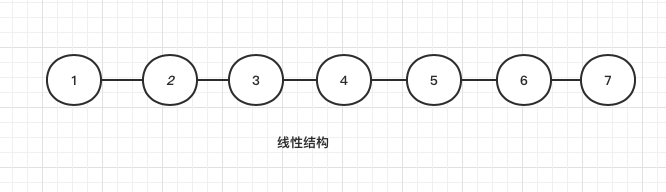
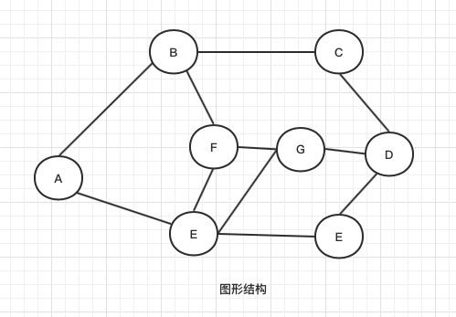

什么是数据结构？

「数据结构 Data Structure」是计算机中组织和存储数据的方式。为了提高数据存储和操作性能，数据结构的设计目标包括：

- 空间占用尽量减少，节省计算机内存。
- 数据操作尽可能快速，涵盖数据访问、添加、删除、更新等。
- 提供简洁的数据表示和逻辑信息，以利于算法高效运行。

数据结构设计是一个充满权衡的过程，这意味着要在某方面取得优势，往往需要在另一方面作出妥协。例如，链表相较于数组，在数据添加和删除操作上更加便捷，但牺牲了数据访问速度；图相较于链表，提供了更丰富的逻辑信息，但需要占用更大的内存空间。

了解一种数据结构应该从两方面考虑，一方面是抽象的逻辑结构，另一方面是物理的存储结构；

数据的逻辑结构不考虑数据在计算机的位置，只描述数据元素之间的关系；

1. 线性结构：数据元素之间是一对一的关系。

- 一对一：

  其开始节点和终端节点具有唯一性，除了开始节点和终端节点，其他的元素有且仅有一个前驱节点和后继节点

2. 树形结构：数据元素之间存在一种一对多的层次关系。

- 一对多：

  每一个数据元素只有一个前驱节点，但是后继节点可以有多个。

3. 图形结构：数据元素之间是多对多关系。

- 数据元素之间存在着多对多的关系，其前驱节点和后继节点的个数可以是任意多个

数据的存储结构，指数据的逻辑结构在计算机中具体的存储形式。一种逻辑结构可以有多种存储形式。

顺序存储结构：把逻辑上相邻的数据元素存储在物理位置上相邻的存储单位里，用物理位置上的相邻来体现逻辑上的相邻。

链式存储结构：是把数据元素存放在任意的存储单元里，这组存储单元可以是连续的，也可以是不连续的。（很显然，这样的话链式结构的数据元素存储关系并不能反映逻辑关系，因此需要用一个指针存放数据元素的地址，这样子通过地址就可以找到相关联数据元素的位置。)

学习任何的数据结构都要关注的三个方面（三要素）：

1. 逻辑结构
2. 物理结构
3. 对数据结构的基本操作

定义数据结构的基本操作的意义是什么？

1. 定义的数据结构可以方便使用。

   没有对数据结构的操作，只学习数据的结构有什么用呢？数据结构就是拿来操作的啊。

2. 将常用的运算/操作封装成函数可以避免重复操作。

