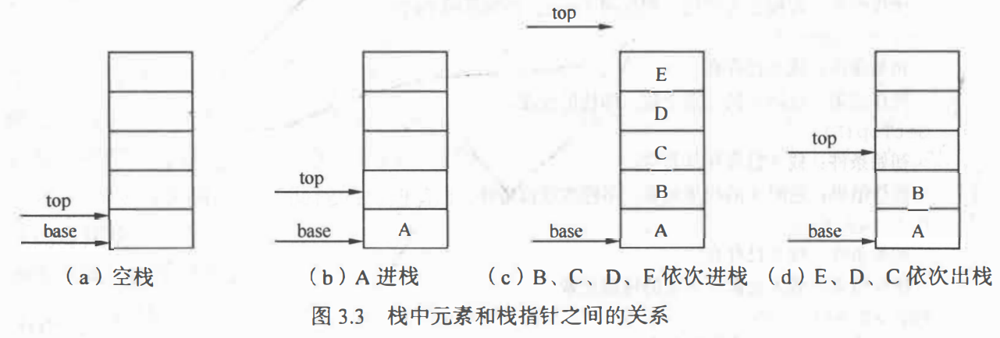
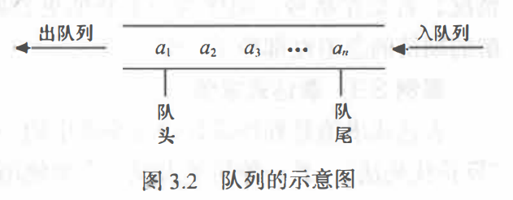
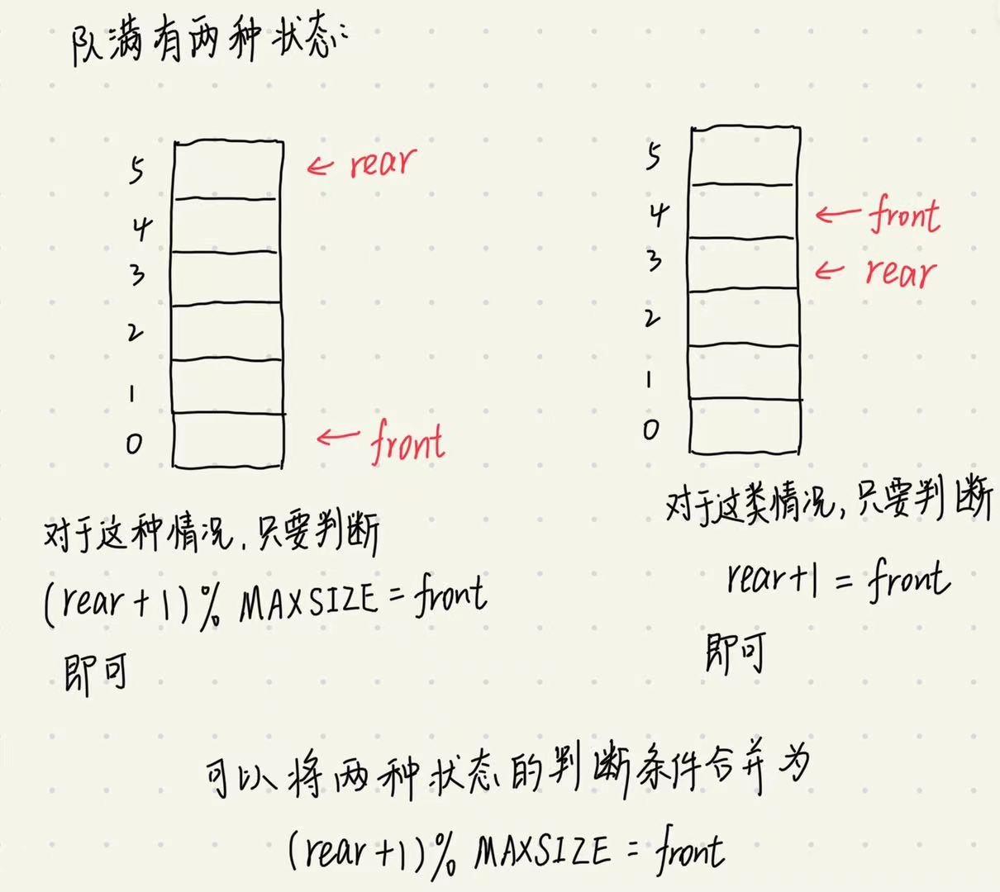

> 吃多了拉是队列，吃多了吐是栈。

# 栈

栈是限定仅在表尾进行插入或删除操作的线性表。， 对栈来说， 表尾端有其
特殊含义， 称为栈顶 (top), 相应地， 表头端称为栈底 (bottom)。 不含元素的空表称为空栈。

栈具体的存储结构，或者说，栈的具体实现有两种：**顺序栈和链栈。**

## 顺序栈

顺序栈可以用数组+栈顶指针。栈顶指针可以用int类型，来表示下标。初始化栈顶指针 `int top = 0;`

从逻辑结构来分析栈的话，需要定义两个指针，一个指向栈顶top，一个指向栈底base；初始化的时候需要把两个都置为0，但是栈的操作都是对栈顶元素进行操作，栈底base一直指向数组第0号元素，所以栈底指针就没必要定义。

**栈顶指针指向的是栈顶元素上面那个空位置。**

在进行入栈和出栈操作前，需要判断栈是否满了和是否为空。

判断为空的条件是 top=0

判断为满的条件是 top=MAXSIZE

## 链栈

链栈用单链表表示；链栈需要定义栈顶指针和栈尾指针；不定义栈尾指针怎么知道栈的范围，同时栈尾指针==栈顶指针用来判断栈是否为空，这个不用判断栈是否会满。

还记得之前讲的头插法和尾插法吗？这个一看就是头插法。注意：链栈不需要头结点。如果用头插法来实现入栈的话，需要定义头指针；如果用尾插法，我们直接把栈底指针当作头指针就可以了，就没必要定义头指针了。

## 对栈的操作

初始化，入栈，出栈，取栈顶元素。自己思考，不难。

# 递归思想和栈

什么是递归？递归是算法吗？

什么是算法？算法就是解决某类问题的思路。

递归是算法吗，换句话说，递归算是解决某种问题的思路吗？

我觉得递归是一种算法，递归思想是将大问题分解成同类小问题，或者将小问题合成同类大问题。

这里的同类是，我们对大问题和小问题执行同样的操作，或者说，同样的代码。除了终止条件。

算法是算法，实现是实现。

递归不仅是一种算法，还是一种实现，递归函数是实现递归思想的一种方式。

定义递归函数的时候需要注意什么呢？

1. 必须有一个明确的递归结束条件
2. 子问题的数据规模和大问题的数据规模之间的关系，换句话说，就是子问题和大问题之间的区别
3. 子问题的结果和大问题的结果之间的关系

2和3合起来就是  递推公式

唉，你刚才说，“递归函数是实现递归思想的一种方式”，难道还有什么其他实现递归思想的方法吗？换句话说，递归函数难道还有等价的其他实现方式？

当然有，听我一一道来。

我们先来了解一下函数调用的底层实现：

1. 从汇编角度看，需要去看csapp，自己知道就行，没必要增加文档的负担。
2. 忽略汇编层的实现细节，简要说说递归函数是怎么用栈实现的。[『教程』堆栈是个啥？_哔哩哔哩_bilibili](https://www.bilibili.com/video/BV1P44y1q7uL/?spm_id_from=333.788&vd_source=5a374f315281b0338a0b7fd69b8b8e98)

然后我们就可以用循环+栈替代递归函数。这只是我的一个想法，并没具体实现，先挖个坑。

以后在阅读一下，《数据结构》3.4.2 递归过程与递归工作栈   这部分到底讲了什么，我到现在还没明白要说什么。

# 队列

和栈相反，队列(queue)是一种先进先出的线性表。它只允许在表的一端进行插入，而在另一端删除元素。在队列中，允许插入的一端称为队尾(rear), 允许 删除的一端则称为队头(front)。

队列的存储结构也有两种实现：顺序存储的队列和链式存储的队列。

## 顺序存储形式

顺序存储的队列可以用数组+两个指针实现，一个指针指向队列的第一个元素，一个指向队尾最后一个元素的后面那个位置。这里的指针我们用下标来代替。比如初始化两个指针时(看第一个图), `int front = 0,rear=0;`

尾插操作对应 `rear++;` ,头出操作对应 `front++;`。根据上图可以看出来，在进行一些头出尾插的操作之后，队头指针和队尾指针跑到了数组的后面。那前面的空间就用不到了呀。这该怎么办呢？用循环队列啊！**那数组怎么实现循环队列呢？头、 尾指针 “依环状增1"的操作可用 “模” 运算来实现。**

比如数组的size是6，当处于图d那个状态时，我再往队尾放一个元素，根据循环队列，此时我们的 `rear`应该0,用代码来实现这样的循环操作使用的是 `rear = (rear+1)% 6;`，同理从队头出去一个元素，` (front+1) %= 6;`

还有另外一个问题，如果一直从队尾放元素而不从队头出元素，就会导致队列溢出。另一方面，如果一直从队头出元素而不放入，会导致每元素可出啊，**因此，我们在每次存放元素之前都要判断队列是否满了，在每次出元素的之前判断队列是否为空**

队空的条件： front = rear   (看图a，刚开始队列为空，此时front=rear)
队满的条件： (rear+ 1)%MAXSIZE = front

思考：怎么求循环队列的长度？

##  链式存储形式

队列的链式存储也是用单链表来表示，初始化两个指针，分别指向队头和队尾。当队头指针等于队尾指针时，队列为空，不用判断队满。跟链栈一样，链队也不需要头结点，好像头指针也没必要要。

## 对队列的操作

初始化，求队列长度，入队，出队，取队头元素。

综上所述，可知，链式结构的栈和队列是优于顺序结构的栈和队列的。

