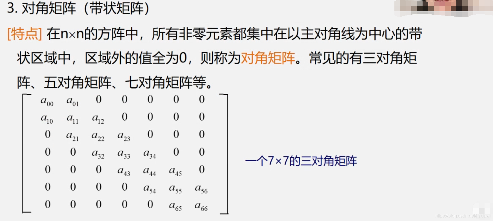
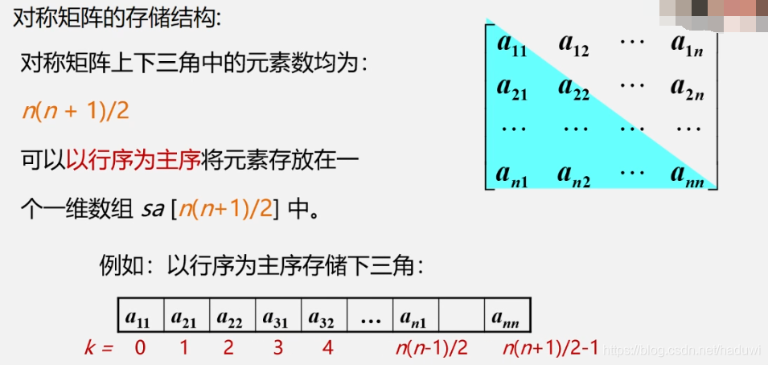

特殊矩阵的表示

在学习特殊矩阵的表示之前，先学习二维数组的两个小知识。

1. 求数组元素的地址

2. 二维数组的本质(多维数组的本质)

   **在C/C++中无论是几维的数组，那必然是连续的内存空间。**

[对称矩阵、对角矩阵与三角矩阵 - 知乎 (zhihu.com)](https://zhuanlan.zhihu.com/p/34896186)

我们用二维int类型的数组来存储矩阵。对于某些特殊矩阵用二维数组来存储会很浪费空间，接下来介绍一下用一维数组对特殊矩阵进行压缩存储。

1. 对称矩阵

对称矩阵（Symmetric Matrix）是指元素以主对角线为对称轴对应相等的矩阵。例如：
$$
\left(
\begin{array}{l}
1 & 2 \\ 
2 & 3
\end{array}
\right),
\left(
\begin{array}{l}
1 & 2 & 5 \\ 
2 & 3 & 4 \\
5 & 4 & 3
\end{array}
\right)
$$
可以看到，对称矩阵的转置等于其自身，即：$A^T=A$

2. 三角矩阵

三角矩阵（Triangular Matrix）分为上三角矩阵和下三角矩阵。

上三角矩阵（Upper Triangular Matrix）是指主对角线以下元素全为0的矩阵，如：
$$
\begin{pmatrix}
1 & 2 \\
0 & 1
\end{pmatrix},
\begin{matrix}
1 & 2 & 3 \\
0 & 1 & 2 \\
0 & 0 & 3
\end{matrix}
$$
下三角矩阵（Lower Triangular Matrix）是指主对角线以上元素全为0的矩阵，如：
$$
\begin{pmatrix}
1 & 0 \\
2 & 1 
\end{pmatrix},
\begin{pmatrix}
1 & 0 & 0 \\
0 & 1 & 0 \\
1 & 1 & 1 
\end{pmatrix}
$$

3. 带状矩阵

4. 稀疏矩阵

如果一个矩阵中非零元素的个数远远小于矩阵元素的总数，并且非零元素的分布没有规律，我们称这样的矩阵为**稀疏矩阵（Sparse Matrix）**。

1. 对称矩阵、三角矩阵的压缩存储

因为是对称的，我们可以存一半，存上三角和下三角都行，以下三角为例：

2. 带状矩阵的压缩存储(以三对角矩阵为例)

提问：单对角矩阵满足这样的存储方式吗？

3. 稀疏矩阵的压缩方式
   1. 顺序存储
   2. 链式存储

挖坑，这些矩阵的压缩方式我都没实现过，或者说，没有真正理解。我只是把框架给搞出来了。

