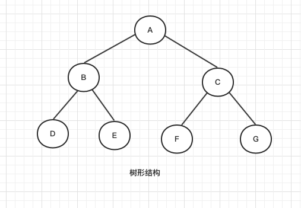

6.树和二叉树

### 树的定义

树的逻辑结构是下图中的树形结构；每一个数据元素只有一个前驱节点，但是后继节点可以有多个。

树的定义：

树的数据元素是树的结点。树必须有一个这样的结点，这个结点没有前驱结点，我们称这个结点为根。树的其他结点具备这样的特点：只能有一个前驱节点，可以有多个后继结点。

子树的定义：我们可以把树的每一个结点看成这个树的子树的根结点。

#### 树的相关概念

1. 结点
2. 结点的度：结点拥有的子树的个数
3. 树的度：树内所有结点的度的最大值
4. 叶结点：结点的度为0 的结点叫 叶结点
5. 非终端结点：结点的度不为0的结点叫 非终端结点；非终端结点分为根节点和内部结点
6. 双亲结点：结点的前驱结点叫做这个结点的双亲结点
7. 孩子结点：结点的所有后继结点叫做这个结点的孩子结点。
8. 层次：树的根节点是第一层，根节点的孩子结点是第二层，以此类推
9. 树的深度：树的最大层次称树的深度；根节点那一层的深度定义为1，从根节点开始往下开始数，每往下一层，深度+1，最长的分支代表树的深度。
10. 树的高度：将所有的叶结点的高度定义为0，分别从每一个叶结点往上开始数，每往上一层，对应的高度加1，直到根节点，取最大高度。

### 二叉树

二叉树是一种特殊的树，二叉树要求每一个结点的度$\leq 2$ ；以上树的概念都适用于二叉树。

二叉树是我们学习的重点。

#### 二叉树的性质

性质1：**在二叉树的第$i$层上至多有$2^{i-1}$个结点。($i \geq 1$)**

性质2:**深度为K的二叉树至多有$2^K-1$个结点 ($K \geq 1$)。**

性质3: **对于一棵非空的二叉树，如果叶子结点数为$n_0$，度数为2的结点数为$n_2$，则有$n_0 ＝n_2＋1$。**

> 妈的，真烦，把定义说的那么复杂是生怕学生有兴趣学下去是吧，一两句话就能解释的东西，你非要搞个公式来定义，你用也就用了，你他妈不会说人话是吧，用让人能听懂的话解释一下不行？非他妈装这个b，我承认你懂的多，但是我真想骂死你，国内的教学环境就是被你们这些教书的搞坏了。

满二叉树(Full Binary Tree)

Every node except the leaf nodes have two children.除了叶子结点之外的每一个结点都有两个孩子结点

完美二叉树(Perfect Binary Tree)

Every node except the leaf nodes have two children and every level (last level too) is completely filled.         除了叶子结点之外的每一个结点都有两个孩子，每一层(当然包含最后一层)都被完全填充

完全二叉树(Complete Binary Tree)

Every level except the last level is completely filled and all the nodes are left justified.

除了最后一层之外的其他每一层都被完全填充，并且所有结点都保持向左对齐.

性质4:具有 n 个结点的完全二叉树的深度为$\lfloor log_2n \rfloor +1$。

性质5：如果对一棵有n个结点的完全二叉树（其深度为$\lfloor log_2n\rfloor +1$）的结点按层序编号（从第一层到$\lfloor log_2n\rfloor +1$层，每层从左到右），对任一结点$i,(1 \leq i \leq n)$:
（1）如果i=1，则结点i是二叉树的根，无双亲，如果i>1,则其双亲结点是结点$\lfloor x/2\rfloor$
（2）如果2i>n，则结点i无左孩子.
（3）如果2i+1>n,则结点i无右孩子.

