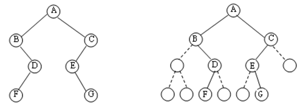

顺序存储结构

二叉树的顺序存储，就是用一组连续的存储单元存放二叉树中的结点。因此，必须把二叉树的所有结点安排成为一个恰当的序列，结点在这个序列中的相互位置能反映出结点之间的逻辑关系，用编号的方法从树根起，自上层至下层，每层自左至右地给所有结点编号,缺点是有可能对存储空间造成极大的浪费，在最坏的情况下，一个深度为k且只有k个结点的右单支树需要2k-1个结点存储空间。

依据二叉树的性质，完全二叉树和满二叉树采用顺序存储比较合适，树中结点的序号可以唯一地反映出结点之间的逻辑关系，这样既能够最大可能地节省存储空间，又可以利用数组元素的下标值确定结点在二叉树中的位置，以及结点之间的关系。

对于一般的二叉树，如果仍按从上至下和从左到右的顺序将树中的结点顺序存储在一维数组中，则数组元素下标之间的关系不能够反映二叉树中结点之间的逻辑关系，只有增添一些并不存在的空结点，使之成为一棵完全二叉树的形式，然后再用一维数组顺序存储。

应该找个题具体写写

顺序存储比较适合完全二叉树这类特殊的二叉树，对一般二叉树而言会造成极大的空间浪费。所以我们对二叉树的存储一般使用链式存储。