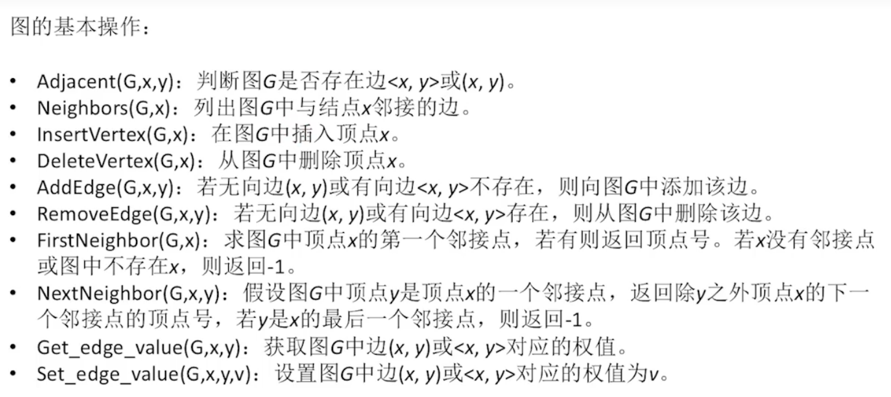

7.3对图的遍历

和树的遍历类似，图的遍历也是从图中某一顶点出发，按照某种方法对图中所有顶点访问且仅访问一次。图的遍历算法是求解图的连通性问题、拓扑排序和关键路径等算法的基础。然而， 图的遍历要比树的遍历复杂得多。

根据搜索路径的方向， 通常有两条遍历图的路径：深度优先搜索和广度优先搜索。 它们对无向图和有向图都适用。

> 遇到不会的算法题：
> 1. 确定算法的输入和输出，理解人家的思路
> 2. 看具体实现，根据代码，重新推导一遍；对照着思路看
> 3. 如果彻底理解了，自己总结一遍
> 4. 如果没理解，每天都敲一遍

