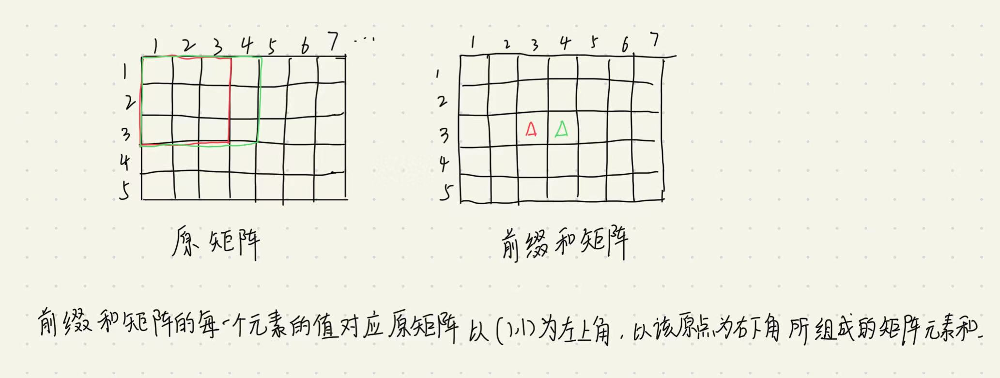

前缀和矩阵


思路：构造出前缀和矩阵



举例说明：


如何构造前缀和矩阵？


如何计算呢？


对于以下三种情况，也能归入上面。


```c++
#include <cstdio>
#include <cstring>
#include <iostream>
#include <algorithm>

using namespace std;

const int N = 1010;

int n, m, q;
int a[N][N], s[N][N];

int main()
{
    scanf("%d%d%d", &n, &m, &q);

    for (int i = 1; i <= n; i ++ )
        for (int j = 1; j <= m; j ++ )
        {
            scanf("%d", &a[i][j]);
            s[i][j] = s[i - 1][j] + s[i][j - 1] - s[i - 1][j - 1] + a[i][j];
        }

    while (q -- )
    {
        int x1, y1, x2, y2;
        scanf("%d%d%d%d", &x1, &y1, &x2, &y2);
        printf("%d\n", s[x2][y2] - s[x1 - 1][y2] - s[x2][y1 - 1] + s[x1 - 1][y1 - 1]);
    }

    return 0;
}

作者：yxc
链接：https://www.acwing.com/activity/content/code/content/162673/
来源：AcWing
著作权归作者所有。商业转载请联系作者获得授权，非商业转载请注明出处。
```

