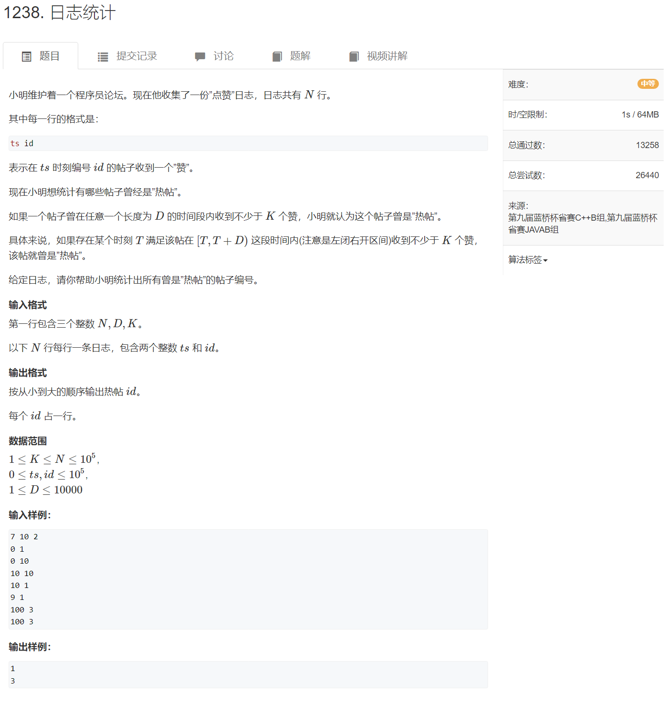

双指针

双指针就是用了两个指针，比如说，链表删除某个结点的时候就是一前一后两个指针同时走

[1238. 日志统计 - AcWing题库](https://www.acwing.com/problem/content/1240/)




```cpp
#include <cstdio>
#include <cstring>
#include <iostream>
#include <algorithm>

#define x first
#define y second

using namespace std;

typedef pair<int,int> PII;

const int N = 100010;

int n,d,k;
PII logs[N];
int cnt[N];
bool st[N];  //记录每个帖子是否是热帖

int main()
{
    scanf("%d%d%d",&n,&d,&k);
    for(int i = 0;i < n; i++) scanf("%d%d",&logs[i].x,&logs[i].y);
    // logs[i]存放每一条记录，logs[i].x 存放每条记录的时刻，logs[i],y 存放每条记录的帖子编号
    sort(logs,logs+n);
    // 按照时刻由小到大排序
    for(int i = 0,j = 0; i < n; i++) //这里的i，j遍历每条记录
    {
        int id = logs[i].y;
        cnt[id] ++;  //cnt存放每个帖子的点赞数量
        while (logs[i].x - logs[j].x >= d) //一直往cnt里记录d时间段的帖子点赞量，直到i走出了d时间段，此时把当头的0时刻的数据删除
        {
            cnt[logs[j].y] --;
            j++;
        }
        if(cnt[id] >= k) st[id] = true;
    }
    for(int i = 0;i < 100000;i++)
    if(st[i] == 1) cout << i << endl;
}
```


[算法总结：双指针算法（什么时候该使用、如何使用）_c++ 什么时候使用双指针参数_companion_zhang的博客-CSDN博客](https://blog.csdn.net/dauiwsbd/article/details/119490444)

[算法一招鲜——双指针问题 - 知乎 (zhihu.com)](https://zhuanlan.zhihu.com/p/71643340)

