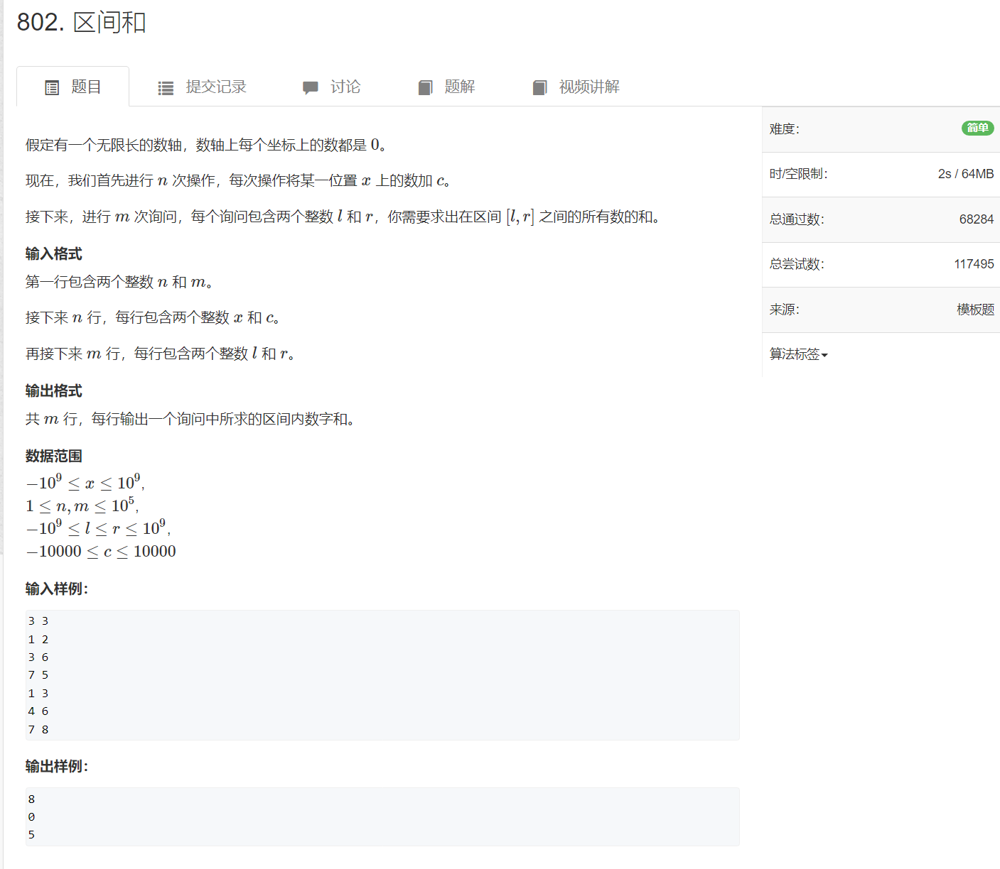

离散化

> 在某些问题当中,会出现某个量,我们只关心其相对大小而不关心其绝对大小,这个时候就可以把这个量离散化,即,把每个量用”在所有出现的数中他是第几小的”来替代,从而不改变其相对大小关系而缩小了范围,便于处理.

[802. 区间和 - AcWing题库](https://www.acwing.com/problem/content/804/)




一开始的思路是，开辟一个数组a，数组下标从0开始到$10^{18}$,下标代表数轴的位置，存放的值代表该位置上的数值

这样是不可行的。想想就不行。就n个零零散散的x有值，其余的位置全为0，太浪费空间了，也不好操作。

我们考虑能不能把这n个离散的点给排成一个有序序列，那样根据l，r找区间上的点也不好找。

那我们就把n个离散的点+l，r排成一个有序序列，从小到大排吧，找l，r区间上的点就好找了，找到l，r在序列中的位置就可以了。

这个题的思想就是只考虑相对大小，那么把离散的点排成有序序列，（这个过程存在映射），根据l，r在序列中的位置找到l，r区间上离散的点。

具体做法如下：


在这个问题当中，我们关心的是 输入的数据 x，l，r的相对大小，因此，我们可以用一个数组来存储所有的x，l，r

x最多有n个，l 最多有m个，r最多也有m个，因此这个数组最多有的元素个数是 max(n+2*m)

根据  $1 \leq n,m \leq 10^5$ ,应该给这个数组开辟 $3*10^5+10$ 的元素大小。

思路是 给这个数组去重、排序，下标$i$就是 元素在所有数字中的 第$i$小,给定任意一对 l，r，根据数组找到对应下标，在两个下标之间的 元素 就是 在l，r区间的所有位置，找到了位置就好求位置上的数字和了。

具体细节如下：

因为我们只考虑这个数组中元素的相对大小，给这个数组去重、排序，从小到大映射到  1，2，3，...

去重、排序后的数组，下标从1开始啊（这就要求一开始存的时候，就从下标1开始存），存放的值是数轴的位置，下标是 该数字在所有数字中是第几小的数字，把这个数组称为映射数组更好。（自己命名的）

然后，我们根据任意的 l，r  ，为求l，r区间的数字和，根据**映射数组**，找到 l，r 映射成的 下标 $l_1,r_1$，遍历下标从$l_1$到$r_1$ 的映射数组，处在这个范围内的 a[i] 就是 处在 l，r区间 的位置，根据每一个a[i] 找到对应的数值相加求和。这里要完成，需要在输入数据的时候在创建一个 unordered_map


上述很需要优化的点在于，如何找  l，r 在映射数组的下标，我们可能需要一次遍历才能找到。很浪费时间。

改进的方式就是 使用二分法作为 映射函数。

```cpp
#include <iostream>
#include <vector>
#include <set>
#include <unordered_map>
using namespace std;

const int N = 3*10e5+10;
set<int> s;  //用来去重、排序 x，l，r
int a[N];  //用来存储去重、排序后的x，l，r
int k[N];
int n,m;
unordered_map<int,int> u;  //用来存储 <x,x位置上的数值> 因为要根据x进行合并，要用map

vector<pair<int,int>> v;  //用来存储每一对 l，r  不能用map/unordered_map存储

int find(int x)        // 根据元素x在所有数据中的大小返回元素x在所有数据中处于第几小
{
    int l = 0, r = s.size() - 1;
    while (l < r)
    {
        int mid = (l + r) >> 1;
        if (a[mid] >= x) r = mid;
        else l = mid + 1;
    }
    return r;
}


int main()
{
    cin >> n >> m;
    int i = 0,y = m;
    while(n--)
    {
        int x,c;
        cin >> x >> c;
        u[x] += c;
        s.insert(x);
    }
    while(m--)
    {
        int l,r;
        cin >> l >> r;
        v.push_back({l,r});
        s.insert(l),s.insert(r);
    }
    for(auto t = s.begin();t != s.end();t++) a[++i] = (*t);
    for(int i = 1; i < s.size();i++) k[i] = k[i-1]+u[a[i]];  //前缀和数组
    for(int i = 0;i < v.size();i++)
        cout << k[find(v[i].second)]-k[find(v[i].first)-1] << endl;
}
```


 

