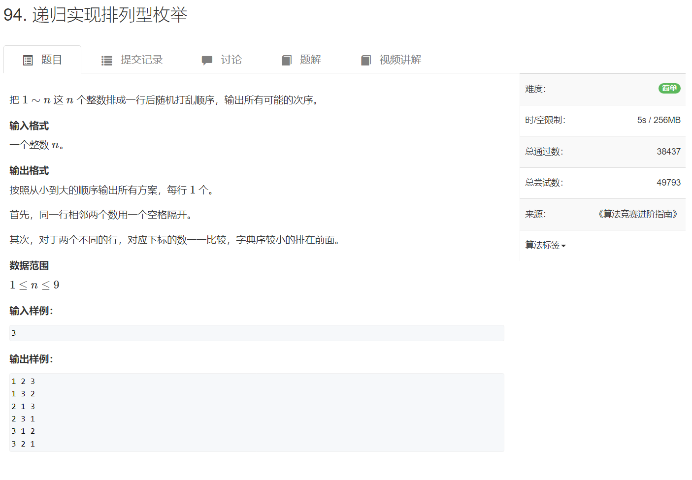
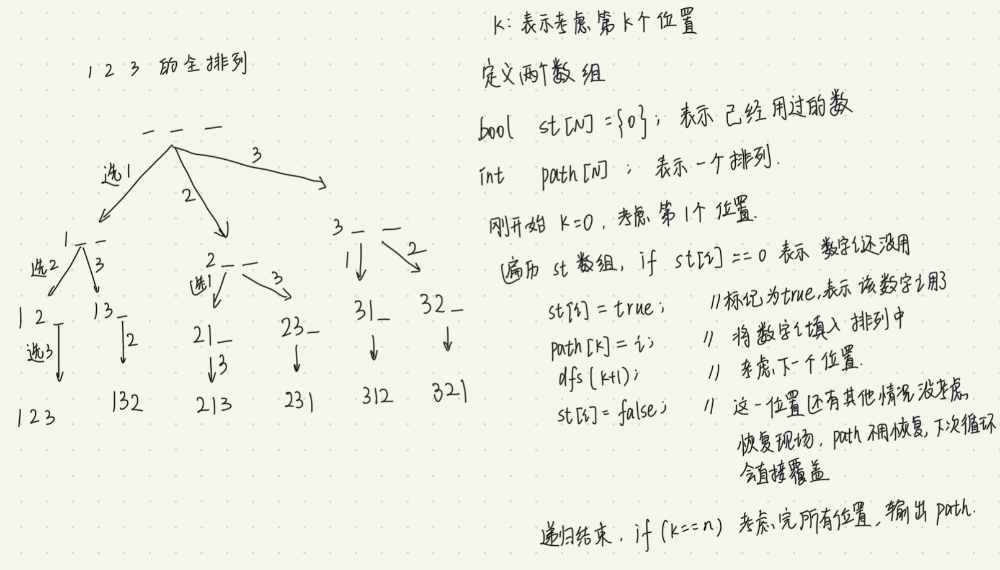

枚举所有情况

[AcWing 92. 递归实现指数型枚举 - AcWing](https://www.acwing.com/activity/content/problem/content/1545/)

#### 选或不选


```cpp
#include <iostream>
using namespace std;

const int N = 15;
int st[N];  //存放每个位置的状态，初始值为0表示还没考虑
int n;

void dfs(int k)  // k表示当前考虑的位置
{
    if(k == n)
    {
        for(int i = 0;i < n;i++)
        if(st[i] == 1) cout << i+1 <<' ';
        cout << endl;
        return;
    }
    st[k] = 2;  // 值为2表示不选
    dfs(k+1);
    st[k] = 1;  //值为1表示选
    dfs(k+1);
    st[k] = 0;
}

int main()
{
    cin >> n;
    dfs(0);
    return 0;
}
```


#### 全排列

[94. 递归实现排列型枚举 - AcWing题库](https://www.acwing.com/problem/content/96/)





```cpp
#include <iostream>

using namespace std;

int n;
const int N = 10;  //0~9
bool st[N]; 
int path[N];

void dfs(int k)
{
    if(k == n)
    {
        for(int i = 0;i < n;i++) cout << path[i] << ' ';
        cout << endl;
        return;
    }
    for(int i = 1;i <= n;i++)
    {
        if(!st[i])
        {
            st[i] = true;
            path[k] = i;
            dfs(k+1);
            st[i] = false;
        }
    }
}

int main()
{
    cin >> n;
    dfs(0);
}
```


全排列可以重复

举个例子：给我3个不重复数字，输出所有全排列，这个全排列中数字可以重复。

```cpp
#include <iostream>

using namespace std;

int n;
const int N = 10;  //0~9
int path[N];

void dfs(int k)
{
    if(k == n)
    {
        for(int i = 0;i < n;i++) cout << path[i] << ' ';
        cout << endl;
        return;
    }
    for(int i = 1;i <= n;i++)
    {
        path[k] = i;  //把st数组删去即可，可以重复就没必要要st数组了
        dfs(k+1);
    }
}

int main()
{
    cin >> n;
    dfs(0);
}
```

这种情况在遍历n位数的所有情况时需要用到👇


```cpp
#include <iostream>
```

遇到这类题了再说


另一类，数字可以重复，给出全排列，但是排列不能重复。

举个例子：

如果用全排列的方法的话，就会出现下面这样的情况。


法一：使用库函数`next_permutation` 和 `prev_permutation`

```cpp
bool next_permutation(iterator start,iterator end);
bool prev_permutation(iterator start,iterator end);
```

将当前序列[start,end)修改成下一个字典序排列。

当当前序列不存在下一个或上一个排列时，函数返回false，否则返回true


```cpp
class Solution {
public:
    vector<vector<int>> permutation(vector<int>& nums) {
        sort(nums.begin(), nums.end());

        vector<vector<int>> res;
        do res.push_back(nums); while (next_permutation(nums.begin(), nums.end()));

        return res;
    }
};
```


这种方法就很巧妙，并没有直接求，而是拐了个弯，就到了目的地。非常牛逼