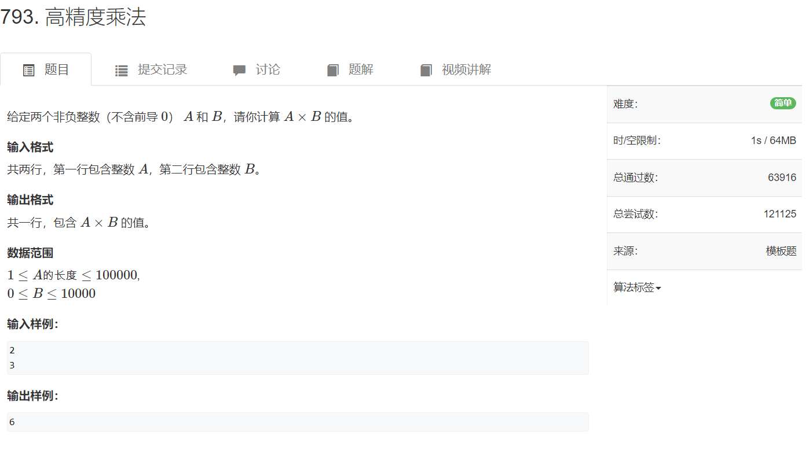

高精度

[算法笔记 (一) 高精度 - 知乎 (zhihu.com)](https://zhuanlan.zhihu.com/p/275011916)

什么是高精度？
高精度算法（High Accuracy Algorithm）是处理大数字的数学计算方法。在一般的科学计算中，会经常算到小数点后几百位或者更多，当然也可能是几千亿几百亿的大数字。一般这类数字我们统称为高精度数，高精度算法是用计算机对于超大数据的一种模拟加，减，乘，除，乘方，阶乘，开方等运算。对于非常庞大的数字无法在计算机中正常存储，于是，将这个数字拆开，拆成一位一位的，或者是四位四位的存储到一个数组中， 用一个数组去表示一个数字，这样这个数字就被称为是高精度数。

**本文将介绍四种常见的高精度计算，包括高精度加法、减法、高精度乘低精度、高精度除低精度。**

[791. 高精度加法 - AcWing题库](https://www.acwing.com/problem/content/793/)


该题中的数的位数最大能达到6位。而我们的 64位无符号整数最大值为 $2^{64}-1$ 约为 1.8e19。也就最多20位。

也就是我们表示不能用计算机来存储了。


模拟加法

```cpp
#include <iostream>
#include <vector>

using namespace std;

vector<int> add(vector<int> &A, vector<int> &B)
{
    vector<int> C;  //存放高精度加法的结果
    int t = 0;
    for (int i = 0; i < A.size() || i < B.size(); i ++ )
    {
        if(i < A.size()) t += A[i];
        if(i < B.size()) t += B[i];
        C.push_back(t % 10);
        t /= 10;    // t存放进位，如果t大于10的话， t / 10 = 1,参加下一位的加法
    }

    if (t) C.push_back(t);
    return C;
}

int main()
{
    string a, b;           //用string来接收高精度数字
    vector<int> A, B;
    cin >> a >> b;
    for (int i = a.size() - 1; i >= 0; i -- ) A.push_back(a[i] - '0');  
    //别忘了ascii转成数字，其次，这是将数字逆序放到vector中，下标0对应数字的最低位，即个位；
    for (int i = b.size() - 1; i >= 0; i -- ) B.push_back(b[i] - '0');

    auto C = add(A, B);

    for (int i = C.size() - 1; i >= 0; i -- ) cout << C[i];
    cout << endl;

    return 0;
}
```


[792. 高精度减法 - AcWing题库](https://www.acwing.com/problem/content/794/)


模拟减法

```cpp
#include <iostream>
#include <vector>
using namespace std;


//根据主函数，可知，sub的参数A始终大于B，同时返回值是A-B的结果
vector<int> sub(vector<int> A,vector<int> B)
{
    vector<int> C; //存放结果值
    //模拟两个数相减，是从最低位相减开始算
    for(int i = 0;i < A.size();i++) //这里是遍历A，原因是A大于B，那么A的位数一定是大于B的位数的，一方面，当算到B的最高位的时候，有两种可能，要么A同时也是最高位，直接减就可以，那么这样遍历A，B都是一样的，但是如果，A的位数要大于B的位数时，算到B的最高位B[i]的时候，要么A[i]>=B[i],直接减就可以了，剩下的A的高位部分直接加到结果值C的后面就可以了,如果遍历B的话，剩下A的高位部分还要再写一个循环才能放到C里；要么就是A[i] < B[i],这样不够减，又要向A的高位借1，如果遍历的是B的话，这个循环就结束了，还要再写一个循环完成剩下借位和把A的高位部分放到C的过程，比较麻烦。因此遍历A
    {
        int t = 0;  //用来表示借位，初始化为0；
        if(A[i] >= B[i])  //按照最低位
        {
            t = 0;
            C.push_back(A[i]-B[i]);
        }
        else if(A[i] < B[i])
        {
            t = 1;
            C.push_back(A[i]+10-B[i]);
        }
    }
    //上面存在的问题是，每次循环t都为0，因此，要把t放到循环外;
    //另一方面，我们的A[i]并没有加上上次得到的进位
    //修改放到下面
    
}
vector<int> sub(vector<int> A,vector<int> B)
{
    vector<int> C; //存放结果
    int t = 0; //存放进位
    for(int i = 0; i < A.size();i++)
    {
        if(A[i]-t >= B[i])
        {
            t = 0;
            C.push_back(A[i]-t-B[i]);
        }
        else
        {
            t = 1;
            C.push_back(A[i]+10-t-B[i]);
        }
    }
    //上面存在的问题是，i有可能会超出B的位数；修改如下
}
vector<int> sub(vector<int> A,vector<int> B)
{
    vector<int> C; //存放结果
    int t = 0; //存放进位
    for(int i = 0; i < A.size();i++)
    {
        if(i < B.size())
        {
            if(A[i]-t >= B[i])
            {
                t = 0;
                C.push_back(A[i]-t-B[i]);
            }
            else
            {
                t = 1;
                C.push_back(A[i]+10-t-B[i]);
            }
        }
        // 注意：if(A[B.size()-1] < B[B.size()-1]) t = 1;因此A[B.size()]还要在减去1
        else
        {
            if(i == B.size()) A[i] -= 1;//不是-1，是减t；另外如果A[i] = 0,再减1会成-1，实际情况是再进位，这样写不对的
            C.push_back(A[i]);
        }
    }
    return C;
}

int main()
{
    string a,b;
    cin >> a >> b;
    vector<int> A,B;
    for(int i = a.size()-1;i >= 0; i--) A.push_back(a[i]);
    for(int i = b.size()-1;i >= 0; i--) B.push_back(b[i]);
    //注意这个题没有考虑A or B 是负数的情况，具体情况具体分析哦
    // 计算A-B，如果A-B<0，要输出负号;因此判断A和B的大小
    if(A.size() > B.size()) // 不输出负号，直接输出结果
    else if(A.size() < B.size())  //输出负号
    else //A.size() = B.size()时，依次从最高位往最低位判断大小，
        if(A[i] > B[i]) //停止判断，不输出负号
        else if(A[i] < B[i]) //停止判断，输出负号
        else //A[i] == B[i]  //继续判断，直到判断完所有位，如果依旧没有判断出来，则相等。
        
        if i== A.size()  // A == B，直接输出0，return掉
    
    //经过上面判断，如果A-B<0，
     if(A-B<0)
     sub(A,B);
     else sub(B,A);  //这里条件是 A-B>0,不考虑A==B，if(A==B),已经return了
}

```

上面是思考过程以及伪代码

```cpp
#include <iostream>
#include <vector>
using namespace std;

vector<int> sub(vector<int> A, vector<int> B)
{
    vector<int> C;
    int t = 0;
    for(int i = 0; i < A.size();i++)
    {
        if(i < B.size())
        {
            if(A[i]-t >= B[i])
            {
                C.push_back(A[i]-t-B[i]);
                t = 0;//t要放下面
            }
            else
            {
                C.push_back(A[i]-t+10-B[i]);
                t = 1;  // t要放下面
            }
        }
        else
        {
            if(A[i] - t >= 0) 
            {
                C.push_back(A[i]-t);
                t = 0;
            }
            else
            {
                C.push_back(A[i]+10-t);
                t = 1;
            }
        }
    }
    while (C.size() > 1 && C.back() == 0) C.pop_back(); //去除前导零
    return C;
}

int main()
{
    string a,b;
    vector<int> A,B;
    cin >> a >> b;
    for(int i = a.size() - 1; i >= 0; i--) A.push_back(a[i]-'0');
    for(int i = b.size() - 1; i >= 0; i--) B.push_back(b[i]-'0');
    int flag = 0; //0表示A>B;
    if(A.size() < B.size())
    {
        cout << "-";
        flag = 1;
    }
    else if(A.size() == B.size())
    {
        if(a < b)
        {
            cout << '-';
            flag = 1;
        }
    }
    if(flag == 0)
    {
        vector<int> C = sub(A,B);
        for(int i = C.size()-1; i >= 0;i--) cout << C[i];
    }
    else
    {
        vector<int> C = sub(B,A);
        for(int i = C.size()-1; i >= 0 ;i--) cout << C[i];
    }
}
```

yxc

```cpp
#include <iostream>
#include <vector>

using namespace std;

bool cmp(vector<int> &A, vector<int> &B)
{
    if (A.size() != B.size()) return A.size() > B.size();

    for (int i = A.size() - 1; i >= 0; i -- )
        if (A[i] != B[i])
            return A[i] > B[i];

    return true;
}

vector<int> sub(vector<int> &A, vector<int> &B)
{
    vector<int> C;
    for (int i = 0, t = 0; i < A.size(); i ++ )
    {
        t = A[i] - t;
        if (i < B.size()) t -= B[i];
        C.push_back((t + 10) % 10);
        if (t < 0) t = 1;
        else t = 0;
    }

    while (C.size() > 1 && C.back() == 0) C.pop_back();
    return C;
}

int main()
{
    string a, b;
    vector<int> A, B;
    cin >> a >> b;
    for (int i = a.size() - 1; i >= 0; i -- ) A.push_back(a[i] - '0');
    for (int i = b.size() - 1; i >= 0; i -- ) B.push_back(b[i] - '0');

    vector<int> C;

    if (cmp(A, B)) C = sub(A, B);
    else C = sub(B, A), cout << '-';

    for (int i = C.size() - 1; i >= 0; i -- ) cout << C[i];
    cout << endl;

    return 0;
}

```

[793. 高精度乘法 - AcWing题库](https://www.acwing.com/problem/content/795/)



这个是一个 大数*小数 的算法题


模拟乘法

yxc

```cpp
#include <iostream>
#include <vector>

using namespace std;


vector<int> mul(vector<int> &A, int b)
{
    vector<int> C;

    int t = 0;
    for (int i = 0; i < A.size() || t; i ++ )
    {
        if (i < A.size()) t += A[i] * b;
        C.push_back(t % 10);
        t /= 10;
    }

    while (C.size() > 1 && C.back() == 0) C.pop_back();

    return C;
}


int main()
{
    string a;
    int b;

    cin >> a >> b;

    vector<int> A;
    for (int i = a.size() - 1; i >= 0; i -- ) A.push_back(a[i] - '0');

    auto C = mul(A, b);

    for (int i = C.size() - 1; i >= 0; i -- ) printf("%d", C[i]);

    return 0;
}
```


大数*大数

双重循环

[一个视频带你了解高精度计算！再也不用担心数据溢出了！_哔哩哔哩_bilibili](https://www.bilibili.com/video/BV1eV4y1g73a/?vd_source=5a374f315281b0338a0b7fd69b8b8e98)

```cpp
#include <iostream>
#include <vector>

using namespace std;

vector<int> mul(vector<int> A, vector<int> B)
{
    vector<int> C(A.size() + B.size());

    for (int i = 0; i < A.size(); i ++ )
        for (int j = 0; j < B.size(); j ++ )
            C[i + j] += A[i] * B[j];

    for (int i = 0, t = 0; i < C.size() || t; i ++ )
    {
        t += C[i];
        if (i >= C.size()) C.push_back(t % 10);
        else C[i] = t % 10;
        t /= 10;
    }

    while (C.size() > 1 && !C.back()) C.pop_back();

    return C;
}

int main()
{
    string a, b;
    cin >> a >> b;
    vector<int> A, B;
    for (int i = a.size() - 1; i >= 0; i -- ) A.push_back(a[i] - '0');
    for (int i = b.size() - 1; i >= 0; i -- ) B.push_back(b[i] - '0');
    auto C = mul(A, B);

    for (int i = C.size() - 1; i >= 0; i -- ) cout << C[i];
    cout << endl;

    return 0;
}

```


fft可以优化，以后再看吧[快速傅里叶变换(FFT)——有史以来最巧妙的算法？_哔哩哔哩_bilibili](https://www.bilibili.com/video/BV1za411F76U/?spm_id_from=333.337.search-card.all.click&vd_source=5a374f315281b0338a0b7fd69b8b8e98)


高精度综合题

[3395. 10进制 VS 2进制 - AcWing题库](https://www.acwing.com/problem/content/description/3398/)